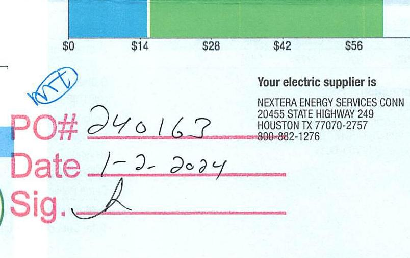
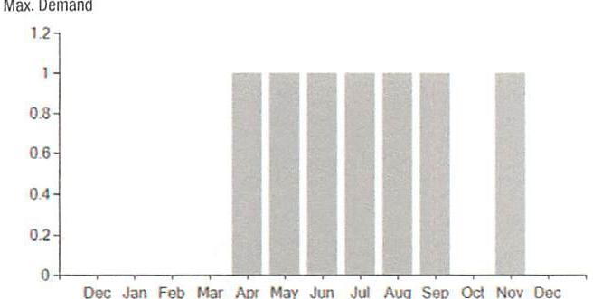

6066595 1-10-24 \$5535.15

## EVERSEURCE

Account Number: 51064223068
Statement Date: 12/15/23
Service Provided To:
BERLIN JOHN PAGER LITTLE LEAGU

## EICTAL USAGE

## EICTAL USAGE

## EICTAL USAGE Summary

This month your average daily electric use was 6.0 kWh

This month you used $20.0 \%$ more than at the same time last year

## EICTAL USAGE

## EICTAL USAGE

## New

## EVERSEURCE

Account Number: 51064223068
Non-residential and residential non-hardship customers may be subject to a 1.00\% late payment charge if the "Total Amount Due" is not received by $01 / 12 / 24$.

## EICTAL USAGE

| Total Amount Due |
| :-- |
| by 02/13/24 |
| Amount Due On 12/11/23 |
| Last Payment Received On 11/22/23 |
| Balance Forward |
| Total Current Charges |

## Current Charges for Electricity

| Supply | Delivery |
| :--: | :--: |
| \$15.49 | \$46.23 |
| Cost of electricity from NEXTERA | Cost to deliver electricity |
| ENERGY SERVICES CONN | from Eversource |

The image is a photo of a section of a document, possibly a bill or receipt. It includes a bar graph with a scale showing dollar amounts: $0, $14, $28, $42, and $56. Next to the graph, there is text indicating the electric supplier:

"Your electric supplier is
NEXTERA ENERGY SERVICES CONN
20455 STATE HIGHWAY 249
HOUSTON TX 77070-2757
800-882-1276"

There is handwritten text in blue ink: "MTF" and in red ink:

"PO# 240163
Date 1-2-2024
Sig."

The graph and text are part of a financial or utility document, with the graph likely representing costs or usage.

## EICTAL USAGE

This month you used $20.0 \%$ more than at the same time last year

## Date $1-3-2024$

## EICTAL USAGE

## EICTAL USAGE

A new discount for electric bills is available if you have a financial hardship status on your electric account. Based on your household income or receipt of a public assistance benefit, you may be eligible for a $10 \%$ or $50 \%$ discount off your electric bill per month. For example, if you have a $\$ 100$ monthly bill, it would be $\$ 10$ less if you receive a $10 \%$ discount or $\$ 50$ less if you receive the $50 \%$ discount. See how to enroll at eversource.com/billhelp.

Remit Payment To: Eversource, PO Box 56002, Boston, MA 02205-6002
CE_231219PROD.TXT-6443-300345979
Please make your check payable to Eversource and consider adding $\$ 1$ for Operation Fuel.
You can also add $\$ 2$ or $\$ 3$ when paying your bill online. $100 \%$ of your tax-deductible donation provides energy assistance grants. If mailing, please allow up to 5 business days to post.

## Total Amount Due

by $02 / 13 / 24$
Amount Enclosed
$003222000045979$
[11] 11111111111111111111111111111111111111111111111111111111111111111111111111111111111111111111111111111111111111111111111111111111111111111111111111111111111111111111111111111111111111111111111111111111

## EVERSEURCE

Account Number: 5106422 3068
Customer name key: BERL
Statement Date: 12/15/23
Service Provided To:
BERLIN JOHN PAGER LITTLE LEAGU

| Svc Add: 960 NORTON RO BERLIN GT 06637 |  |  |  |  |  |
| :--: | :--: | :--: | :--: | :--: | :--: |
| Serv Ref: 168712009 |  |  | Bill Cycle: 69 |  |  |
| Service from 11/13/23 - 12/14/23 |  |  | 31 Days |  |  |
| Next road date on or about: Jan 12-2024 |  |  |  |  |  |
| Meter   Number | Current   Read | Previous   Read | Current   Usage | Reading   Type |  |
| 035153622 | 9196 | 8998 | 198 | Actual |  |

Total Demand Use $=0.80 \mathrm{~kW}$

| Monthly kWh Use |  |  |  |  |  |
| :--: | :--: | :--: | :--: | :--: | :--: |
| Dec | Jan | Feb | Mar | Apr | May |
| 170 | 88 | 59 | 75 | 180 | 262 |
| Jul | Aug | Sep | Oct | Nov | Dec |
| 345 | 402 | 329 | 279 | 240 | 198 |

## Contact Information

Emergency: 800-286-2000
www.eversource.com
Pay by Phone: 888-783-6618
Customer Service: 888-783-6617

## Total Amount Due by $02 / 13 / 24$

## $127.19$

Electric Account Summary
Amount Due On 12/11/23
$134.43
Last Payment Received On 11/22/23
$-$ \$68.96
Balance Forward
\$65.47
Current Charges/Credits
Electric Supply Services
$15.49$
Delivery Services
Total Current Charges
Total Current Charges
Total Amount Due
Total Charges for Electricity

## Supplier

NEXTERA ENERGY
Service Reference: 168712009
Supply
Subtotal Supplier Services
$198.00 \mathrm{kWh} \times \$ 0.07822$
\$15.49
$15.49$

## Delivery

(DISTRIBUTION RATE: 030)
Service Reference: 168712009
Fixed Monthly Charge
\$44.00
Revenue Decoupling
198.00kWh X \$0.00080
\$0.16
FMCC Charge
198.00kWh X \$0.00288
\$0.57
Comb Public Benefit Chrg
198.00kWh X \$0.00760
\$1.50
$198.00 \mathrm{kWh} \times \$ 0.00760$
Total Cost of Electricity
Total Current Charges
$\$ 61.72$

# EVERSEURCE 

Account Number: 51064223068
Customer name key: BERL
Statement Date: 12/15/23
Service Provided To:
BERLIN JOHN PAGER LITTLE LEAGU

Continued from previous page...

Supply Rate
Dollars / kWh

The image is a bar chart.

- **Chart Type**: Bar chart
- **X-Axis**: Labeled with months from "Dec" to "Dec" (December to December).
- **Y-Axis**: Labeled "Max. Demand" with a scale from 0 to 1.2.
- **Data Points**: Bars are present for each month from January to October, with each bar reaching approximately the 1.0 mark on the Y-axis. There are no bars for November and December.
- **Styling**: The bars are uniform in color and height, indicating consistent demand across the months shown.
- **Yearly Usage Breakdown (Monthly-Based)**: The chart provides a monthly breakdown of maximum demand over the year.

Demand Profile
Max. Demand

The image is a bar chart.

- **Chart Type**: Bar chart
- **X-Axis**: Labeled with months from "Dec" to "Dec" (December to December).
- **Y-Axis**: Labeled "Max. Demand" with a scale from 0 to 1.2.
- **Data Points**: Bars are present for each month from January to October, with each bar reaching approximately the 1.0 mark on the Y-axis. There are no bars for November and December.
- **Styling**: The bars are uniform in color and height, indicating consistent demand across the months shown.
- **Yearly Usage Breakdown (Monthly-Based)**: The chart provides a monthly breakdown of maximum demand over the year.

