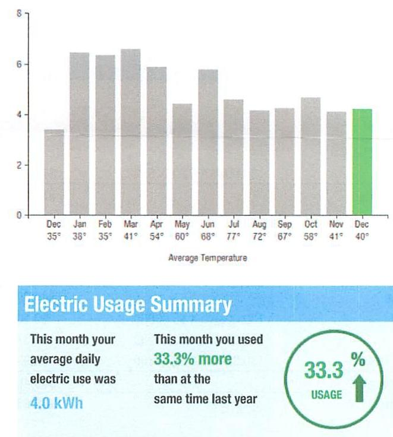
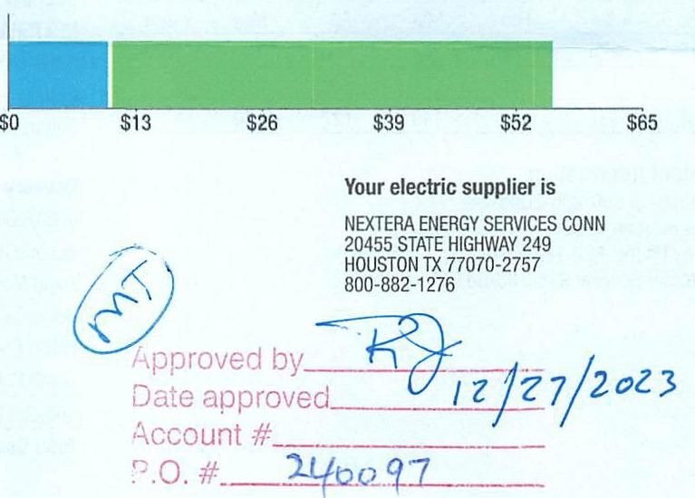

## EVERSEURCE

Account Number: 51301223020
Statement Date: $12 / 15 / 23$
Service Provided To: TOWN OF BERLIN

## Electric Usage History - Kilowell House (KWh)

The image is a bar chart.

- **Chart Type**: Bar chart
- **X-Axis**: Months with average temperature
  - Dec 35°
  - Jan 38°
  - Feb 35°
  - Mar 41°
  - Apr 54°
  - May 60°
  - Jun 68°
  - Jul 77°
  - Aug 72°
  - Sep 67°
  - Oct 58°
  - Nov 41°
  - Dec 40°
- **Y-Axis**: No specific title or unit, but it appears to represent electric usage in kWh.
- **Data Points**: 
  - December (first) is around 3 kWh
  - January and February are around 6 kWh
  - March is slightly above 6 kWh
  - April is slightly below 6 kWh
  - May is around 5 kWh
  - June is slightly above 6 kWh
  - July is slightly below 6 kWh
  - August is around 5 kWh
  - September is slightly below 5 kWh
  - October is slightly above 4 kWh
  - November is slightly below 4 kWh
  - December (second) is around 4 kWh (highlighted in green)
- **Styling**: The bar for December (second) is highlighted in green, indicating a focus on this month's data.
- **Additional Text**: 
  - "Electric Usage Summary"
  - "This month your average daily electric use was 4.0 kWh"
  - "This month you used 33.3% more than at the same time last year"
  - "33.3% USAGE" with an upward arrow indicating an increase.

## Electric Usage Summary

This month your average daily electric use was 4.0 kWh

This month you used $33.3 \%$ more than at the same time last year

## 5066463 1-4-2024 \$10.559.83

Total Amount Due by 02/13/24
Amount Due On 12/11/23
Last Payment Received On 12/13/23
Balance Forward
Total Current Charges
555.63

Current Charges for Electricity

| Supply | Delivery |
| :--: | :--: |
| \$10.17 | \$45.46 |
| Cost of electricity from NE | Cost to deliver electricity |
| ENERGY SERVICES CON | from E |

The image is a photo of a section of a document.

- **Embedded Text**:
  - "Your electric supplier is"
  - "NEXTERA ENERGY SERVICES CONN"
  - "20455 STATE HIGHWAY 249"
  - "HOUSTON TX 77070-2757"
  - "800-882-1276"
  - "Approved by"
  - "Date approved"
  - "Account #"
  - "P.O. #"
  - "240097"
  - "12/27/2023"
- **Graph Elements**:
  - A bar graph with a scale from $0 to $65.
  - A blue section at the start of the bar, followed by a green section.
  - The blue section is labeled at approximately $13.
  - The green section extends beyond $52.
- **Handwritten Elements**:
  - "MT" in a circle.
  - Signature or initials near "Approved by".
  - Date "12/27/2023" written next to "Date approved".

## News For You

A new discount for electric bills is available if you have a financial hardship status on your electric account. Based on your household income or receipt of a public assistance benefit, you may be eligible for a $10 \%$ or $50 \%$ discount off your electric bill per month. For example, if you have a $\$ 100$ monthly bill, it would be $\$ 10$ less if you receive a $10 \%$ discount or $\$ 50$ less if you receive the $50 \%$ discount. See how to enroll at eversource.com/billhelp.

Remit Payment To: Eversource, PO Box 56002, Boston, MA 02205-6002
CE_231219PROD.TXT-7587-000945471
Please make your check payable to Eversource and consider adding $\$ 1$ for Operation Fuel.
You can also add $\$ 2$ or $\$ 3$ when paying your bill online. $100 \%$ of your tax-deductible donation provides energy assistance grants. If mailing, please allow up to 5 business days to post.

Total Amount Due
by $02 / 13 / 24$
Amount Enclosed
$1\left[\int \mathrm{I} \cdot \mathrm{H}\left[\int \mathrm{I}\left(\mathrm{I} \cdot \mathrm{I} \cdot \mathrm{I} \cdot \mathrm{H}\left[\int\left[\mathrm{I}_{\mathrm{I}} \mathrm{I} \cdot \mathrm{I}_{\mathrm{I}}\left[\mathrm{I}_{\mathrm{I}} \mathrm{I} \cdot \mathrm{I}_{\mathrm{I}}\left[\mathrm{I}_{\mathrm{I}} \mathrm{I}_{\mathrm{I}} \mathrm{I}_{\mathrm{I}} \mathrm{I}\left[\mathrm{I}_{\mathrm{I}} \mathrm{I}_{\mathrm{I}} \mathrm{I}_{\mathrm{I}}\right] \mathrm{I}\right.\right.\right.\right.\right.\right.$
$1\left[\int \mathrm{I} \cdot \mathrm{H}\left[\int \mathrm{I}_{\mathrm{I}} \cdot \mathrm{I} \cdot \mathrm{I} \cdot \mathrm{H}\left[\int\left[\mathrm{I}_{\mathrm{I}} \mathrm{I} \cdot \mathrm{I}_{\mathrm{I}}\left[\mathrm{I}_{\mathrm{I}} \mathrm{I} \cdot \mathrm{I}_{\mathrm{I}}\left[\mathrm{I}_{\mathrm{I}} \mathrm{I}_{\mathrm{I}} \mathrm{I}_{\mathrm{I}}\left[\mathrm{I}_{\mathrm{I}} \mathrm{I}_{\mathrm{I}}\right] \mathrm{I}\right.\right.\right.\right.\right.$
Eversource
PO Box 56002
Boston, MA 02205-6002

## EVERSEURCE

Account Number: 51301223020
Customer name key: BERL
Statement Date: 12/15/23
Service Provided To:
TOWN OF BERLIN

| Svc Add: GUINDY TRL |  |  |  |  |  |
| :--: | :--: | :--: | :--: | :--: | :--: |
| BERLIN O1 06037 |  |  |  |  |  |
| Serv Rel: 925712901 |  |  | Bill Cycle: 03 |  |  |
| Service from 11/13/23 - 12/14/23 |  |  | 31 Days |  |  |
| Next road date on or about: Jan 12-2023 |  |  |  |  |  |
| Meter   Number | Current   Read | Previous   Read | Current   Usage |  | Reading   Type |
| 868869842 | 91747 | 91617 | 130 |  | Actual |
| Monthly KWh Use |  |  |  |  |  |
| Dec | Jan | Feb | Mar | Apr | May |
| 112 | 225 | 152 | 204 | 176 | 128 |
| Jul | Aug | Sep | Oct | Nov | Dec |
| 138 | 137 | 123 | 140 | 127 | 130 |

## Contact Information

Emergency: 800-286-2000
www.eversource.com
Pay by Phone: 888-783-6618
Customer Service: 888-783-6617

## Total Amount Due by $02 / 13 / 24$

Electric Account Summary
Amount Due On 12/11/23
$\$ 55.37$
Last Payment Received On 12/13/23
$\$ 55.37$
Balance Forward
Current Charges/Credits
Electric Supply Services
$\$ 10.17$
Delivery Services
Total Current Charges
Total Amount Due
Total Charges for Electricity

## Supplier

NEXTERA ENERGY
Service Reference: 925712001
Supply
Subtotal Supplier Services
$\$ 10.17$
Delivery
(DISTRIBUTION RATE: 030)
Service Reference: 925712001
Fixed Monthly Charge
Revenue Decoupling
FMCC Charge
Comb Public Benefit Chrg
Subtotal Delivery Services
Total Cost of Electricity
Total Current Charges
$\$ 44.00$
$\$ 0.10$
$\$ 0.37$
$\$ 0.99$
$\$ 45.46$
$\$ 45.46$
$\$ 55.63$

Total Current Charges

