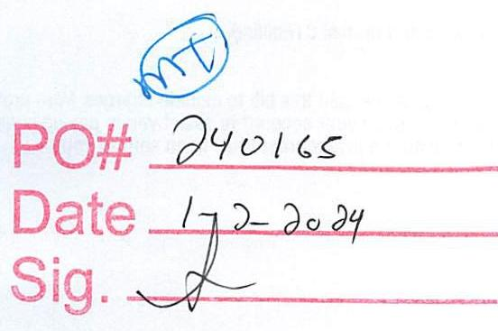
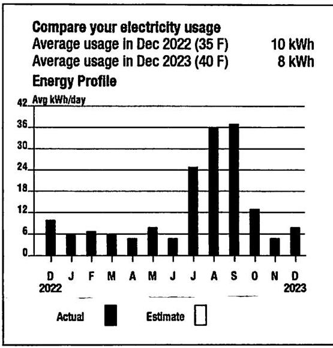
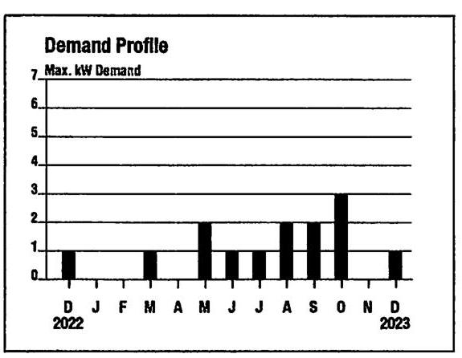
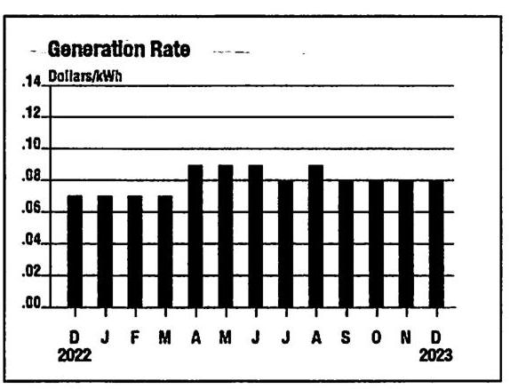

0000120

## EVERSEURCE

## Contact Information

Emergency: 1-800-286-2000 (anytime)
Web Site: www.eversource.com
Pay by Phone 1-888-783-6618

## Business customers:

Customer Service: 1-888-783-6617

## Your electric supplier is

NEXTERA ENERGY SERVICES CONN
20455 STATE HIGHWAY 249
HOUSTON TX 77070-2757
$1-800-882-1276$
*Important information. This bill includes charges for previous months. An arrangement has been established on your account. Please see the Account Messages section for more information.

The image is a photo of a form or document section with handwritten elements. It includes:

- A blue circle with the letters "MT" inside.
- Red printed text with handwritten entries:
  - "PO#" followed by "240165"
  - "Date" followed by "1-2-2024"
  - "Sig." followed by a signature or scribble.

## EVERSEURCE

Account Number
51304223084

## EVERSEURCE

000044000000190
$\mathrm{n} / \mathrm{lg} / \mathrm{d} / \mathrm{Hlg} / \mathrm{ng} / \mathrm{ng} / \mathrm{d} / \mathrm{d} / \mathrm{n} / \mathrm{l} / \mathrm{l} / \mathrm{H} / \mathrm{ng} / \mathrm{l} / \mathrm{Hl} / \mathrm{l} / \mathrm{n} / \mathrm{Hl} / \mathrm{l} / \mathrm{l}$

TOWN OF BERLIN
C/O PUBLIC GROUNDS
15 TOWN FARM LN
BERLIN CT 06037-2324

TOWN OF BERLIN
Scheduled Payment Due
\$43.00

Statement date: Dec 15, 2023
Customer name key: BERL
Account number: 51304223084

## Electric Account Summary

Amount due on Nov 13
\$181.04
Balance Forward
The 'Balance forward' includes $\$ 43.81$ generation charges
** Past Due Amount \$181.04 **
New Charges/Credits
Electricity Supply Services
Delivery Services
Total new charges
Account Balance
Scheduled Payment Due
See Account Messages for important information.

Detail for Service at:
WILCOX CT, EAST BERLIN CT 06023
Service reference: 436712005
Billing cycle: 09
Your meter reading for meter \# 033214112
For billing period: Nov 13 - Dec 14 (31 days)
Actual reading on Dec 14, 2023
Actual reading on Nov 13, 2023
Difference
Meter constant
Billed usage
Total demand use: 1.20 kW

Next read date on or about: Jan 12, 2024
15
$=6$
$\times 40$
$=240$

Please allow up to 5 business days for your payment to post.
Remit Payment To: Eversource, P.O.Box 56002, Boston, MA 02205-6002
(continued on next page)

Make your check payable to Eversource. Please consider adding $\$ 1$ for Operation Fuel. To add more visit www.eversource.com

## EVERSEURCE

## Account Number

51304223084

## Statement date

Dec 15, 2023

Scheduled Payment Due
\$43.00

Scheduled Payment Due must be made on time to avoid a past due balance on your account.

Eversource
P0 Box 56002
Boston, MA 02205-6002

The image is a bar chart titled "Energy Profile" that compares electricity usage over a year. The x-axis represents months from December 2022 to December 2023, and the y-axis is labeled "Avg kWh/day" ranging from 0 to 42. 

- **Average usage in Dec 2022 (35 F):** 10 kWh
- **Average usage in Dec 2023 (40 F):** 8 kWh

The bars show monthly electricity usage, with actual usage in black and estimated usage in white. The highest usage is in August and September 2023, reaching above 36 kWh/day. The chart provides a yearly usage breakdown (monthly-based).

| Generation Detail | NEXTERA ENERGY |  |  |
| :--: | :--: | :--: | :--: |
| Supply | 240.00 KWH | $\times$ | \$0.078220 |
| Subtotal |  |  | \$18.77 |
| Delivery Services Detail | DISTRIBUTION RATE: 030 |  |  |
| Fixed Monthly Charge | 240.00 KWH | $\times$ | \$0.000800 |
| Revenue Decoupling | 240.00 KWH | $\times$ | \$0.002880 |
| FMCC Charge | 240.00 KWH | $\times$ | \$0.002880 |
| Comb Public Benefit Chrg | 240.00 KWH | $\times$ | \$0.007600 |

\$18.77

## Explanation of your charges

## Account messages

The CSF MVS update code is bleng tested on thsi CTEbilling.

MULTI-MONTH BILL: A delay in billing has caused this bill to include charges from previous months. A payment plan has been set up on your account to assist you in paying your bill in installments. A letter further describing the arrangement has been sent to you.

Please allow up to 5 business days for your payment to post.

The image is a bar chart titled "Demand Profile." 

- **Y-axis title:** Max. kW Demand
- **Y-axis units:** 0 to 7
- **X-axis labels:** Months from December 2022 (D) to December 2023 (D)
- **Data points:**
  - December 2022: 1
  - January 2023: 0
  - February 2023: 1
  - March 2023: 0
  - April 2023: 2
  - May 2023: 1
  - June 2023: 1
  - July 2023: 1
  - August 2023: 2
  - September 2023: 3
  - October 2023: 2
  - November 2023: 3
  - December 2023: 1

The chart provides a **yearly usage breakdown (monthly-based)**, showing the maximum kW demand for each month. The bars are uniformly styled in black.

The image is a bar chart titled "Generation Rate."

- **Y-axis title:** Dollars/kWh
- **Y-axis units:** 0.00 to 0.14
- **X-axis labels:** Months from December 2022 (D) to December 2023 (D)
- **Data points:**
  - December 2022: 0.06
  - January 2023: 0.06
  - February 2023: 0.06
  - March 2023: 0.08
  - April 2023: 0.08
  - May 2023: 0.10
  - June 2023: 0.10
  - July 2023: 0.10
  - August 2023: 0.08
  - September 2023: 0.08
  - October 2023: 0.08
  - November 2023: 0.08
  - December 2023: 0.08

The bars are uniformly styled in black. The chart provides a monthly breakdown of the generation rate over the specified period.

Historical generation rate information will be added to this graph each month, providing you with 13 months of information over time.

## Customer Billing Information

## Questions and complaints

If you have a question or complaint about your bill or any payment arrangement, call the number listed on the front of the bill. A complete explanation of your rights is available upon written request to the company or by calling customer service at the phone number listed in the upper left corner of the bill.

## Termination of service and customer rights

You have the right to dispute a termination notice. You may also have service continued between November 1st and May 1st if you qualify for hardship status or have a serious illness or life-threatening condition.

## Third-party notice

You can ask us at any time to notify a third party if your service is subject to being shut off. For additional information, you should call the number listed on the front of the bill.

## Electric suppliers

Information about licensed electric suppliers, including rates and charges, contract terms and conditions, energy sources and emission rates, is available from the Public Utilities Regulatory Authority (PURA), 10 Franklin Square, New Britain, Connecticut, 06051, by visiting www.EnergizeCT.com/suppliers

## Check processing

By sending your check, you authorize Eversource to use the check information to create an electronic funds transfer. The electronic transfer, for the original check amount, will be processed on the day your check is received. The check will be destroyed and an image of your check will be stored for 2 years. If the electronic transfer cannot be completed, a demand draft of your check can be created and used in place of the original.

## Security Deposit

PURA Regulation 16-11-105 allows the Company to collect a security deposit from business customers with either no credit or a negative credit history with the Company. Business customers with a timely bill payment history will not be assessed a security deposit.
PURA Regulation 16-262j-1 allows the Company to collect a security deposit from a residential customer who has either no credit or a negative credit history with the Company. Customers who can verify that they lack the financial ability to pay a security deposit will not be required to pay a security deposit.
Security deposits, along with accrued interest, will be refunded to the customer after 12 consecutive months of good payment history.

## Information and questions

For information or questions regarding your account, please contact Eversource at 860-947-2000 or 1-800-286-2000. For other consumer questions and unresolved complaints, you may call PURA Consumer Services
toll free at 1-800-382-4586.

## Información en la Factura para el Consumidor

## Preguntas y quejas

Si usted tiene alguna pregunta o queja sobre su factura o sobre algún arreglo de pago, llame al número listado al frente de esta factura. Una explicación detallada de sus derechos como consumidor está disponible si lo pide por escrito a la compañía o si llama al centro de servicios al consumidor al número listado arriba, a la izquierda en su factura.

## Terminación de servicio y sus derechos como consumidor

Usted tiene el derecho de refutar la carta de terminación. También podrá continuar el servicio entre el 1 de Noviembre y el 1 de Mayo, si usted califica como consumidor con dificultad económica documentada o tiene alguna enfermedad seria, o una situación de vida o muerte existente en su hogar.

## Notificación a una tercera persona

Usted puede solicitar en cualquier momento que nos comuniquemos con una tercera persona si su servicio está en riesgo de ser desconectado. Para más información, llame al número listado en su factura.

## Proveedores de energía eléctrica

Información acerca de proveedores de energía eléctrica licenciados, incluyendo clases de tarifas y cargos, términos y condiciones de contratos, fuentes de energía y tarifas de emisión, estan disponible a los consumidores a través de la Autoridad Reguladora de Servicios Públicos (PURA),
10 Franklin Square, New Britain, Connecticut, 06051, o visitando www.EnergizeCT.com/suppliers.

## Procesamiento de chequeo

Al enviar su cheque, usted autoriza a Eversource a usar la información de su cheque para crear transferencias de fondos electrónicamente. La transferencia electrónica por la cantidad original del cheque será procesada el día que su cheque es recibido. El cheque será destruido y una copia electrónica será guardada por 2 años. Si la transferencia electrónica no puede ser completada podemos exigir un retiro de fondos y este puede ser usado en lugar del original.

## Déposito de Seguridad

Según la Regulación 16-11-105 de "PURA," a la Compañía se le permite colectar un depósito de seguridad de aquellos clientes comerciales o industriales que no tengan crédito, o que tengan crédito negativo con la Compañía. A los clientes comerciales o industriales que tengan un historial de crédito con pagos hechos a tiempo, no se les cobrara un depósito de seguridad.
La Regulación de PURA 16-262j-1 permite que la compañía colecte un depósito de seguridad de aquellos clientes residenciales que no tengan crédito, o que tengan crédito negativo con la compañía. Los clientes que puedan verificar que no tienen la habilidad financiera para pagar su depósito de seguridad no tendrán que pagarlo. Los depósitos de seguridad, junto con el interés que se haya acumulado, les serán devueltos a los clientes después de que hayan cumplido 12 meses consecutivos de buen historial con sus pagos.

## Para información o preguntas

Para informacion o preguntas relacionadas con su cuenta por favor llame a Eversource al 860-947-2000, o 1-800-286-2000.
Para más información y para asistencia sobre disputas no resueltas, llame a PURA al número 1-800-382-4586.

