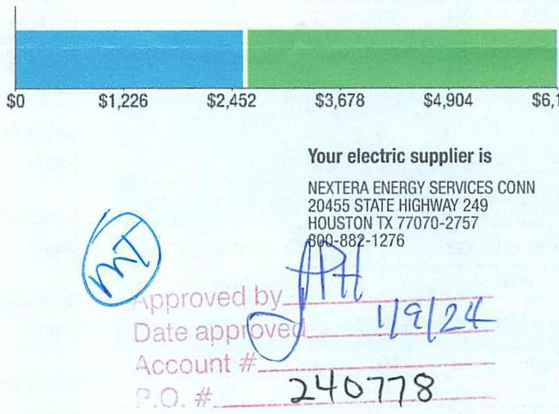

## EVERSEURCE

Account Number: 51628023087
Statement Date: 01/02/24
Service Provided To:
TOWN OF BERLIN

## Total Amount Due

by 03/02/24
Amount Due On 12/29/23
Last Payment Received On 12/27/23
Balance Forward
Total Current Charges
\$6,122.01

## Current Charges for Electricity

| Supply | Delivery |
| :--: | :--: |
| \$2,577.33 | \$3,544.68 |
| Cost of electricity from NEXTERA ENERGY SERVICES CONN | Cost to deliver electricity from Eversource |

The image is a section of a document featuring a bar chart and some text.

- **Chart Type**: Bar chart
- **Data Points**:
  - $0
  - $1,226
  - $2,452
  - $3,678
  - $4,904
  - $6,130

- **Text**:
  - "Your electric supplier is"
  - "NEXTERA ENERGY SERVICES CONN"
  - "20455 STATE HIGHWAY 249"
  - "HOUSTON TX 77070-2757"
  - "800-882-1276"
  - "Approved by"
  - "Date approved"
  - "Account #"
  - "P.O. #"
  - "240778"

- **Handwritten Elements**:
  - "MT" (circled)
  - "JH"
  - "1/9/24"

The bar chart is divided into two colored sections, with blue and green segments, representing different monetary values.

## News For You

A new discount for electric bills is available if you have a financial hardship status on your electric account. Based on your household income or receipt of a public assistance benefit, you may be eligible for a $10 \%$ or $50 \%$ discount off your electric bill per month. For example, if you have a $\$ 100$ monthly bill, it would be $\$ 10$ less if you receive a $10 \%$ discount or $\$ 50$ less if you receive the $50 \%$ discount. See how to enroll at eversource.com/billhelp.

Remit Payment To: Eversource, PO Box 56002, Boston, MA 02205-6002
CE_04110/PROD.TXT-138097-00002433
Please make your check payable to Eversource and consider adding $\$ 1$ for Operation Fuel.
You can also add $\$ 2$ or $\$ 3$ when paying your bill online. $100 \%$ of your tax-deductible donation provides energy assistance grants. If mailing, please allow up to 5 business days to post.

Total Amount Due
by 03/02/24
Amount Enclosed
\$6,122.01
\$122.01

069549000002433
$11 \mathrm{HH} \mid 1 \mathrm{HH} \mid 1 \mathrm{HH} \mid 1 \mathrm{HH} \mid 1 \mathrm{HH} \mathrm{HH} \mid 1 \mathrm{HH} \mid 1 \mathrm{HH} \mid 1 \mathrm{HH} \mid 1 \mathrm{HH} \mid$
$1 / 4 \mid 1 \mathrm{HH} \mid 1 \mathrm{HH} \mid 1 \mathrm{HH} \mid 1 \mathrm{HH} \mathrm{HH} \mid 1 \mathrm{HH} \mid 1 \mathrm{HH} \mid 1 \mathrm{HH} \mid 1 \mathrm{HH} \mathrm{HH} \mid 1 \mathrm{HH} \mid$
$1 / 4$
$1 / 4$
$1 / 4$
$1 / 4$
$1 / 4$
$1 / 4$
$1 / 4$
Eversource
PO Box 56002
Boston, MA 02205-6002

| SVERSEURCE |  |  |  |  |  |
| --- | --- | --- | --- | --- | --- |
| Account Number: 5162802 3087 |  |  |  |  |  |
| Customer name key: BERL |  |  |  |  |  |
| Statement Date: 01/02/24 |  |  |  |  |  |
| Service Provided To: |  |  |  |  |  |
| TOWN OF BERLIN |  |  |  |  |  |

| Svc Addr: STREETLIGHTS |  |  |  |  |  |
| :--: | :--: | :--: | :--: | :--: | :--: |
| BERLIN CT 06037 |  |  |  |  |  |
| Rate 117 Serv Rel: 06/063009 | Bill Cycle: 20 |  |  |  |  |
| Service From: 12/01/23 - 01/02/24 | 32 Days |  |  |  |  |
| 18000 LUMEN HP SOMM |  |  |  |  |  |
| Number of Devices |  | Unmetered Usage |  |  |  |
| 0004 |  | 304 kWh |  |  |  |

| Monthly kWh Use |  |  |  |  |  |
| :--: | :--: | :--: | :--: | :--: | :--: |
| Dec | Jan | Feb | Mar | Apr | May | Jun |
| 304 | 298 | 251 | 250 | 214 | 193 | 173 |
| Jul | Aug | Sep | Oct | Nov | Dec |  |
| 185 | 207 | 230 | 267 | 284 | 304 |  |
| Svc Addr: 0 OLD FARM FL |  |  |  |  |  |
| BERLIN CT 06080 |  |  |  |  |  |
| Rate 117 Serv Rel: 22/083000 | Bill Cycle: 20 |  |  |  |  |
| Service From: 12/01/23 - 01/02/24 | 32 Days |  |  |  |  |
| OTHER WATTACE-NON-NO 3L ECUIP |  |  |  |  |  |
| Number of Devices |  | Unmetered Usage |  |  |  |
| 0004 |  | 53 kWh |  |  |  |

| Monthly kWh Use |  |  |  |  |  |
| :--: | :--: | :--: | :--: | :--: | :--: |
| Dec | Jan | Feb | Mar | Apr | May |
| 0 | 52 | 0 | 43 | 37 | 33 |
| Jul | Aug | Sep | Oct | Nov | Dec |
| 32 | 0 | 40 | 47 | 50 | 53 |

## Total Amount Due by 03/02/24

## Electric Account Summary

Amount Due On 12/29/23
Last Payment Received On 12/27/23
Balance Forward
Current Charges/Credits
Electric Supply Services
Delivery Services
Total Current Charges
Total Amount Due

Total Charges for Electricity

## Supplier

NEXTERA ENERGY
Service Reference: 063963009
Supply
Service Reference: 251083008
Supply
Service Reference: 258863002
Supply
Service Reference: 498273009
Supply
Service Reference: 595243008
Supply
Service Reference: 636193002
Supply
Service Reference: 659234000
Supply

## $304.40 \mathrm{kWh} X \$ 0.07822$

53.00 kWh X $\$ 0.07822$
706.80 kWh X $\$ 0.07822$
30165.20 kWh X $\$ 0.07822$
103.20 kWh X $\$ 0.07822$
37.20 kWh X $\$ 0.07822$
49.10 kWh X $\$ 0.07822$
$\$ 23.81$
$\$ 4.15$
$\$ 55.29$
$\$ 2,359.52$
$\$ 8.07$
$\$ 2.91$
$\$ 3.84$

49.10 kWh X $\$ 0.07822$
$\$ 3.84$

## EVERSEURCE

Account Number: 51628023087
Customer name key: BERL
Statement Date: 01/02/24
Service Provided To:
TOWN OF BERLIN

Continued from previous page...

| Svc Addr. STREETLIGHTS BERLIN BY 06037 |  |  |  |  |  |  |
| :--: | :--: | :--: | :--: | :--: | :--: | :--: |
| Rate: 117 Serv Rel: 258883602 |  |  |  | Bill Cycle: 20 |  |  |
| Service From: 12/01/23 - 01/02/24 |  |  |  | 32 Days |  |  |
| 6300 EUMEN NP SORRINA |  |  |  |  |  |  |
| Number of Devices |  |  |  | Unmetered Usage |  |  |
| 0019 |  |  |  | 707 kWh |  |  |

| Monthly kWh Use |  |  |  |  |  |  |
| :--: | :--: | :--: | :--: | :--: | :--: | :--: |
| Dec | Jan | Feb | Mar | Apr | May | Jun |
| 707 | 692 | 583 | 581 | 496 | 446 | 401 |
| Jul | Aug | Sep | Oct | Nov | Dec |  |
| 429 | 481 | 534 | 619 | 659 | 707 |  |
| Svc Addr. STREETLIGHTS BERLIN BY 06037 |  |  |  |  |  |  |
| Rate: 117 Serv Rel: 488273009 |  |  |  | Bill Cycle: 20 |  |  |
| Service From: 12/01/23 - 01/02/24 |  |  |  | 32 Days |  |  |
| DTHEP WATTASE-HON-RUCK EQUIP |  |  |  |  |  |  |
| Number of Devices |  |  |  | Unmetered Usage |  |  |
| 2372 |  |  |  | 30,165 kWh |  |  |

| Monthly kWh Use |  |  |  |  |  |  |
| :--: | :--: | :--: | :--: | :--: | :--: | :--: |
| Dec | Jan | Feb | Mar | Apr | May | Jun |
| 0 | 29428 | 0 | 24538 | 21110 | 19070 | 0 |
| Jul | Aug | Sep | Oct | Nov | Dec |  |
| 18457 | 0 | 23062 | 26570 | 28288 | 30165 |  |
| Svc Addr. 0 CHOLESSUCH BERLIN BY 06000 |  |  |  |  |  |  |
| Rate: 110 Serv Rel: 595143000 |  |  |  | Bill Cycle: 05 |  |  |
| Service From: 11/10/23 - 12/13/23 |  |  |  | 33 Days |  |  |
| 5500 EUMEN NP SORRINA |  |  |  |  |  |  |
| Number of Devices |  |  |  | Unmetered Usage |  |  |
| 0002 |  |  |  | 103 kWh |  |  |

| Monthly kWh Use |  |  |  |  |  |  |
| :--: | :--: | :--: | :--: | :--: | :--: | :--: |
| Dec | Jan | Feb | Mar | Apr | May | Jun |
| 103 | 102 | 85 | 86 | 73 | 65 | 59 |
| Jul | Aug | Sep | Oct | Nov | Dec |  |
| 63 | 70 | 79 | 91 | 96 | 103 |  |

## Total Amount Due

by $03 / 02 / 24$

Continued from previous page...

Service Reference: 729963005 Supply

Service Reference: 747373003 Supply

Service Reference: 785963000 Supply

Service Reference: 792973002 Supply

Service Reference: 839973000 Supply

Service Reference: 919963005 Supply

Subtotal Supplier Services

## Delivery

(DISTRIBUTION RATE: 117)
Service Reference: 063963009 Transmission
Local Delivery
Revenue Decoupling
CTA
FMCC Charge
Comb Public Benefit Chrg
Local Delivery Improvements
(DISTRIBUTION RATE: 117)
Service Reference: 251083008 Transmission
Local Delivery
Revenue Decoupling
CTA
FMCC Charge
Comb Public Benefit Chrg
Local Delivery Improvements
(DISTRIBUTION RATE: 117)
Service Reference: 258863002 Transmission

| 304.40 kWh X \$0.02454 | $\$ 7.47$ |
| :-- | :-- |
|  | $\$ 8.72$ |
| 304.40 kWh X \$0.00080 | $\$ 0.24$ |
| 304.40 kWh X \$-0.00046 | $-\$ 0.14$ |
| 304.40 kWh X \$0.00192 | $\$ 0.58$ |
| 304.40 kWh X \$0.00768 | $\$ 2.34$ |
| 304.40 kWh X \$0.02179 | $\$ 6.63$ |

53.00 kWh X \$0.02454 \$1.30
$\$ 2.67$
53.00 kWh X \$0.00080 \$0.04
53.00 kWh X \$-0.00046 - $\$ 0.02$
53.00 kWh X \$0.00192 \$0.10
53.00 kWh X \$0.00768 \$0.41
53.00 kWh X \$0.02179 \$1.15
706.80 kWh X \$0.02454 \$17.34

## EVERSEURGE

Account Number: 51628023087
Customer name key: BERL
Statement Date: 01/02/24
Service Provided To:
TOWN OF BERLIN

Continued from previous page...

| Svc Addr: 0 LOWEVER OF BERLIN ET 00000 |  |  |  |  |  |
| :--: | :--: | :--: | :--: | :--: | :--: |
| Rate: 117 Serv Rel: 636193602 |  |  |  | Bill Cycle: 20 |  |
| Service From: 12/01/23 - 01/02/24 |  |  |  | 32 Days |  |
| 6300 LOWEN HP SURGIN |  |  |  |  |  |
| Number of Devices |  |  | Unmetered Usage |  |  |
| 0001 |  |  | 37 kWh |  |  |

| Monthly kWh Use |  |  |  |  |  |
| :--: | :--: | :--: | :--: | :--: | :--: |
| Dec | Jan | Feb | Mar | Apr | May | Jun |
| 37 | 36 | 31 | 31 | 26 | 23 | 21 |
| Jul | Aug | Sep | Oct | Nov | Dec |  |
| 23 | 25 | 28 | 33 | 35 | 37 |  |
| Svc Addr: 0 DIMMALS KENDRITOR: ET 00000 |  |  |  |  |  |
| Rate: 116 Serv Rel: 625234000 |  |  |  | Bill Cycle: 20 |  |
| Service From: 12/01/28 - 01/02/24 |  |  |  | 32 Days |  |

3311 LED TRADITIONAL

| Number of Devices |  |  |  | Unmetered Usage |  |
| :--: | :--: | :--: | :--: | :--: | :--: |
| 0004 |  |  |  | 49 kWh |  |
| Monthly kWh Use |  |  |  |  |  |
| Aug | Sep | Oct | Nov | Dec |  |
| 8 | 37 | 43 | 46 | 49 |  |

| Svc Addr: STREETLIGHTS BERLIN ET 00007 |  |  |  |  |  |
| :--: | :--: | :--: | :--: | :--: | :--: |
| Rate: 117 Serv Rel: 729063005 | Bill Cycle: 20 |  |  |  |  |
| Service From: 12/01/23 - 01/02/24 | 32 Days |  |  |  |  |
| 0500 LUMEN HP SURGIN |  |  |  |  |  |
| Number of Devices |  |  | Unmetered Usage |  |  |
| 0016 |  |  | 834 kWh |  |  |
| Monthly kWh Use |  |  |  |  |  |
| Dec | Jan | Feb | Mar | Apr | May | Jun |
| 834 | 818 | 688 | 686 | 586 | 528 | 474 |
| Jul | Aug | Sep | Oct | Nov | Dec |  |
| 507 | 568 | 630 | 733 | 779 | 834 |  |

## Total Amount Due

by $03 / 02 / 24$

Continued from previous page...

| Local Delivery |  | \$23.75 |
| :--: | :--: | :--: |
| Revenue Decoupling | 706.80 kWh X \$0.00080 | \$0.57 |
| CTA | 706.80 kWh X \$-0.00046 | - $\$ 0.33$ |
| FMCC Charge | 706.80 kWh X \$0.00192 | \$1.36 |
| Comb Public Benefit Chrg | 706.80 kWh X \$0.00768 | \$5.43 |
| Local Delivery Improvements | 706.80 kWh X \$0.02179 | \$15.40 |
| (DISTRIBUTION RATE: 117) |  |  |
| Service Reference: 498273009 |  |  |
| Transmission | 30165.20 kWh X \$0.02454 | \$740.25 |
| Local Delivery |  | \$1,555.91 |
| Revenue Decoupling | 30165.20 kWh X \$0.00080 | \$24.13 |
| CTA | 30165.20 kWh X \$-0.00046 | - $\$ 13.88$ |
| FMCC Charge | 30165.20 kWh X \$0.00192 | \$57.92 |
| Comb Public Benefit Chrg | 30165.20 kWh X \$0.00768 | \$231.67 |
| Local Delivery Improvements | 30165.20 kWh X \$0.02179 | \$657.30 |
| (DISTRIBUTION RATE: 116) |  |  |
| Service Reference: 595243008 |  |  |
| Transmission | 103.20 kWh X \$0.02481 | \$2.56 |
| Local Delivery |  | \$18.08 |
| Revenue Decoupling | 103.20 kWh X \$0.00080 | \$0.08 |
| CTA | 103.20 kWh X \$-0.00046 | - $\$ 0.05$ |
| FMCC Charge | 103.20 kWh X \$0.00194 | \$0.20 |
| Comb Public Benefit Chrg | 103.20 kWh X \$0.00768 | \$0.79 |
| Local Delivery Improvements | 103.20 kWh X \$0.02179 | \$2.25 |
| (DISTRIBUTION RATE: 117) |  |  |
| Service Reference: 659234000 |  |  |
| Transmission | 37.20 kWh X \$0.02454 | \$0.91 |
| Local Delivery |  | \$1.25 |
| Revenue Decoupling | 37.20 kWh X \$0.00080 | \$0.03 |
| CTA | 37.20 kWh X \$-0.00046 | - $\$ 0.02$ |
| FMCC Charge | 37.20 kWh X \$0.00192 | \$0.07 |
| Comb Public Benefit Chrg | 37.20 kWh X \$0.00768 | \$0.29 |
| Local Delivery Improvements | 37.20 kWh X \$0.02179 | \$0.81 |
| (DISTRIBUTION RATE: 116) |  |  |
| Service Reference: 659234000 |  |  |
| Transmission | 49.10 kWh X \$0.02481 | \$1.22 |
| Local Delivery |  | \$29.60 |
| Revenue Decoupling | 49.10 kWh X \$0.00080 | \$0.04 |
| CTA | 49.10 kWh X \$-0.00046 | - $\$ 0.02$ |
| FMCC Charge | 49.10 kWh X \$0.00194 | \$0.10 |

## EVERSEURCE

Account Number: 51628023087
Customer name key: BERL
Statement Date: 01/02/24
Service Provided To:
TOWN OF BERLIN

Continued from previous page...

| Svc Addr. STREET LIGHTS |  |  |  |  |  |
| :--: | :--: | :--: | :--: | :--: | :--: |
| BERLIN BT 03037 |  |  |  |  |  |
| Rate 117 Serv Rel. 747373003 |  |  |  | Bill Cycle: 20 |  |
| Service From: 12/01/23 - 01/02/24 |  |  |  | 32 Days |  |
| OTHER WATTASE-IP SUDIUM |  |  |  |  |  |
| Number of Devices |  |  |  | Unmetered Usage |  |
| 0015 |  |  |  | 272 kWh |  |
| Monthly kWh Use |  |  |  |  |  |
| Dec | Jan | Feb | Mar | Apr | May | Jun |
| 0 | 265 | 0 | 221 | 190 | 172 | 0 |
| Jul | Aug | Sep | Oct | Nov | Dec |  |
| 166 | 0 | 208 | 239 | 255 | 271 |  |
| Svc Addr. STREET LIGHTS |  |  |  |  |  |
| BERLIN BT 03037 |  |  |  |  |  |
| Rate 117 Serv Rel. 702583000 |  |  |  | Bill Cycle: 20 |  |
| Service From: 12/01/23 - 01/02/24 |  |  |  | 32 Days |  |
| SUDIUM LUMEN HP SUDIUM |  |  |  |  |  |
| Number of Devices |  |  |  | Unmetered Usage |  |
| 0001 |  |  |  | 209 kWh |  |
| Monthly kWh Use |  |  |  |  |  |
| Dec | Jan | Feb | Mar | Apr | May | Jun |
| 209 | 204 | 172 | 172 | 146 | 132 | 118 |
| Jul | Aug | Sep | Oct | Nov | Dec |  |
| 127 | 142 | 158 | 183 | 195 | 209 |  |
| Svc Addr. 0 GEDTGIHI DR |  |  |  |  |  |
| BERLIN BT 03080 |  |  |  |  |  |
| Rate 117 Serv Rel. 792073002 |  |  |  | Bill Cycle: 20 |  |
| Service From: 12/01/23 - 01/02/24 |  |  |  | 32 Days |  |
| OTHER WATTASE-NON-NUEL EQUIP |  |  |  |  |  |
| Number of Devices |  |  |  | Unmetered Usage |  |
| 0002 |  |  |  | 27 kWh |  |
| Monthly kWh Use |  |  |  |  |  |
| Dec | Jan | Feb | Mar | Apr | May | Jun |
| 0 | 26 | 0 | 21 | 18 | 17 | 0 |
| Jul | Aug | Sep | Oct | Nov | Dec |  |
| 16 | 0 | 20 | 23 | 25 | 26 |  |

Continued from previous page...

| Comb Public Benefit Chrg | 49.10 kWh X $\$ 0.00768$ | $\$ 0.38$ |
| :-- | :-- | :-- |
| Local Delivery Improvements | 49.10 kWh X $\$ 0.02179$ | $\$ 1.07$ |
| (DISTRIBUTION RATE: 117) |  |  |
| Service Reference: 729963005 |  |  |
| Transmission | 833.60 kWh X $\$ 0.02454$ | $\$ 20.46$ |
| Local Delivery | $\$ 25.76$ |  |
| Revenue Decoupling | 833.60 kWh X $\$ 0.00080$ | $\$ 0.67$ |
| CTA | 833.60 kWh X $\$ 0.00046$ | - $\$ 0.38$ |
| FMCC Charge | 833.60 kWh X $\$ 0.00192$ | $\$ 1.60$ |
| Comb Public Benefit Chrg | 833.60 kWh X $\$ 0.00768$ | $\$ 6.40$ |
| Local Delivery Improvements | 833.60 kWh X $\$ 0.02179$ | $\$ 18.16$ |
| (DISTRIBUTION RATE: 117) |  |  |
| Service Reference: 747373003 |  |  |
| Transmission | 271.50 kWh X $\$ 0.02454$ | $\$ 6.66$ |
| Local Delivery | 271.50 kWh X $\$ 0.00080$ | $\$ 11.78$ |
| Revenue Decoupling | 271.50 kWh X $\$ 0.00046$ | - $\$ 0.12$ |
| CTA | 271.50 kWh X $\$ 0.00192$ | $\$ 0.52$ |
| FMCC Charge | 271.50 kWh X $\$ 0.00768$ | $\$ 2.09$ |
| Comb Public Benefit Chrg | 271.50 kWh X $\$ 0.02179$ | $\$ 5.92$ |
| Local Delivery Improvements |  |  |
| (DISTRIBUTION RATE: 117) |  |  |
| Service Reference: 785963000 |  |  |
| Transmission | 208.60 kWh X $\$ 0.02454$ | $\$ 5.12$ |
| Local Delivery | 208.60 kWh X $\$ 0.00080$ | $\$ 5.37$ |
| Revenue Decoupling | 208.60 kWh X $\$ 0.00046$ | - $\$ 0.17$ |
| CTA | 208.60 kWh X $\$ 0.00046$ | - $\$ 0.10$ |
| FMCC Charge | 208.60 kWh X $\$ 0.00192$ | $\$ 0.40$ |
| Comb Public Benefit Chrg | 208.60 kWh X $\$ 0.00768$ | $\$ 1.60$ |
| Local Delivery Improvements | 208.60 kWh X $\$ 0.02179$ | $\$ 4.55$ |
| (DISTRIBUTION RATE: 117) |  |  |
| Service Reference: 792973002 |  |  |
| Transmission | 26.50 kWh X $\$ 0.02454$ | $\$ 0.65$ |
| Local Delivery | 26.50 kWh X $\$ 0.02454$ | $\$ 1.34$ |
| Revenue Decoupling | 26.50 kWh X $\$ 0.00080$ | $\$ 0.02$ |
| CTA | 26.50 kWh X $\$ 0.00046$ | - $\$ 0.01$ |
| FMCC Charge | 26.50 kWh X $\$ 0.00192$ | $\$ 0.05$ |
| Comb Public Benefit Chrg | 26.50 kWh X $\$ 0.00768$ | $\$ 0.20$ |
| Local Delivery Improvements | 26.50 kWh X $\$ 0.02179$ | $\$ 0.58$ |
| (DISTRIBUTION RATE: 117) |  |  |

## EVERSEURCE

Account Number: 51628023087
Customer name key: BERL
Statement Date: 01/02/24
Service Provided To:
TOWN OF BERLIN

Continued from previous page...

| Svc Addr: SPRING VALLEY OR BERLIN GT 08037 |  |  |  |  |  |
| :--: | :--: | :--: | :--: | :--: | :--: |
| Rate: 117 Serv Rel: 8399/3000 | Bill Cycle: 20 |  |  |  |  |
| Service From: 12/01/23 - 01/02/24 | 32 Days |  |  |  |  |
| OTHER WATTAGE-RON-NU SL EDIIP |  |  |  |  |  |
| Number of Devices |  |  | Unmetered Usage |  |  |
| 0004 |  |  | 53 kWh |  |  |

| Monthly kWh Use |  |  |  |  |  |
| :--: | :--: | :--: | :--: | :--: | :--: |
| Dec | Jan | Feb | Mar | Apr | May | Jun |
| 0 | 52 | 0 | 43 | 37 | 33 | 0 |
| Jul | Aug | Sep | Oct | Nov | Dec |  |
| 32 | 0 | 40 | 47 | 50 | 53 |  |
| Svc Addr: STREETLIGHTS |  |  |  |  |  |
| BERLIN GT 08037 |  |  |  |  |  |
| Rate: 117 Serv Rel: 01980/0005 | Bill Cycle: 20 |  |  |  |  |
| Service From: 12/01/23 - 01/02/24 | 32 Days |  |  |  |  |
| 27500 LUNEN HP SODIUM |  |  |  |  |  |
| Number of Devices |  |  |  | Unmetered Usage |  |
| 0001 |  |  |  | 138 kWh |  |

| Monthly kWh Use |  |  |  |  |  |
| :--: | :--: | :--: | :--: | :--: | :--: |
| Dec | Jan | Feb | Mar | Apr | May | Jun |
| 137 | 135 | 114 | 113 | 96 | 87 | 78 |
| Jul | Aug | Sep | Oct | Nov | Dec |  |
| 84 | 94 | 104 | 121 | 128 | 137 |  |

## Contact Information

Emergency: 800-286-2000
www.eversource.com
Pay by Phone: 888-783-6618
Customer Service: 888-783-6617

## Total Amount Due by 03/02/24

Continued from previous page...

Service Reference: 839973000
Transmission
Local Delivery
Revenue Decoupling
CTA
FMCC Charge
Comb Public Benefit Chrg
Local Delivery Improvements

137.50 kWh X $\$ 0.02454$
137.50 kWh X $\$ 0.00080$
53.00 kWh X $\$ 0.00080$
53.00 kWh X $\$ 0.00046$
53.00 kWh X $\$ 0.00192$
53.00 kWh X $\$ 0.00768$
53.00 kWh X $\$ 0.02179$

## \$1.30

\$2.67
\$0.04
\$0.02
\$0.10
\$0.41
\$1.15

| 137.50kWh X $\$ 0.02454$ |  |
| :-- | --: |
|  | $\$ 3.37$ |
|  | $\$ 3.66$ |
| 137.50 kWh X $\$ 0.00080$ |  |
| 137.50 kWh X $\$ 0.00046$ |  |
| 137.50 kWh X $\$ 0.00192$ |  |
| 137.50 kWh X $\$ 0.00768$ |  |
| 137.50 kWh X $\$ 0.02179$ |  |
|  | $\$ 3.00$ |
|  | $\$ 3.544 .68$ |

Total Cost of Electricity
Total Current Charges
$\$ 6,122.01$

