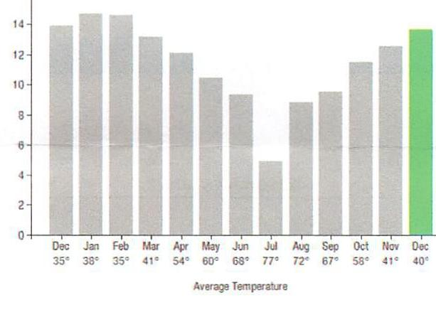
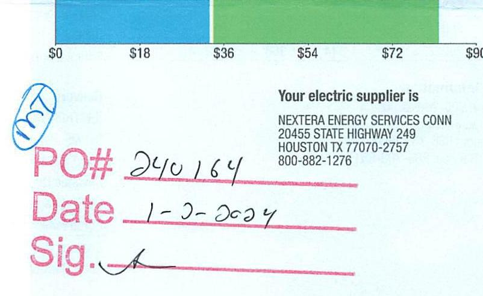
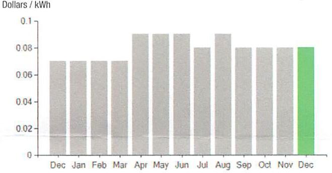

## EVERSEURCE

Account Number: 51407123082
Statement Date: 12/15/23
Service Provided To:
TOWN OF BERLIN

## Electric Usage History - Kilowait Hours (kWh)

kWh/Day

The image is a bar chart showing the average daily electric usage in kilowatt-hours (kWh) per day over a year, with each bar representing a month. 

- **Chart Type**: Bar chart
- **X-Axis**: Months of the year with average temperatures labeled below each month:
  - Dec: 35°
  - Jan: 38°
  - Feb: 35°
  - Mar: 41°
  - Apr: 54°
  - May: 60°
  - Jun: 68°
  - Jul: 77°
  - Aug: 72°
  - Sep: 67°
  - Oct: 58°
  - Nov: 41°
  - Dec: 40°
- **Y-Axis**: kWh/Day, ranging from 0 to 14.
- **Data Points**: 
  - December and January have the highest usage, slightly above 14 kWh/day.
  - February usage is similar to January.
  - Usage decreases from March to July, with the lowest point in July.
  - Usage increases again from August to December.
- **Styling**: The bar for the current December is highlighted in green, while other bars are in gray.

This chart provides a **yearly usage breakdown (monthly-based)**, showing how electric usage varies with temperature changes throughout the year.

## Electric Usage Summary

This month your average daily electric use was 14.0 kWh

This month your usage stayed the same compared to same time last year.

## 8160.51

$153.52
$153.52
$74.79
$78.73
$51.76

## Current Charges for Electricity

| Supply | Delivery |
| :--: | :--: |
| \$33.01 | \$48.77 |
| Cost of electricity from NEXTERA ENERGY SERVICES CONN | Cost to deliver electricity from Eversource |

The image is a photo of a section of a document. It includes the following text and elements:

- A colored bar with a scale below it, marked with dollar amounts: $0, $18, $36, $54, $72, $90.
- Text: "Your electric supplier is NEXTERA ENERGY SERVICES CONN, 20455 STATE HIGHWAY 249, HOUSTON TX 77070-2757, 800-882-1276."
- Handwritten elements:
  - "PO# 240164"
  - "Date 1-2-2024"
  - "Sig." followed by a signature.
- A blue circular stamp or mark is visible on the left side.

## News For You

A new discount for electric bills is available if you have a financial hardship status on your electric account. Based on your household income or receipt of a public assistance benefit, you may be eligible for a $10 \%$ or $50 \%$ discount off your electric bill per month. For example, if you have a $\$ 100$ monthly bill, it would be $\$ 10$ less if you receive a $10 \%$ discount or $\$ 50$ less if you receive the $50 \%$ discount. See how to enroll at eversource.com/billhelp.

Remit Payment To: Eversource, PO Box 56002, Boston, MA 02205-6002
CE_231215PR00.TXT-7253-00045622

## EVERSEURCE

Account Number: 51407123082
Non-residential and residential non-hardship customers may be subject to a $1.00 \%$ late payment charge if the "Total Amount Due" is not received by $01 / 12 / 24$.

## $8160.51$

Amount Enclosed
$81.78$

003627000045622
$1 / 100[10101010101010101010101010101010101010101010101010101010101010101010101010101010101010101010101010101010101010101010101010101010101010101010101010101010101010101010101010101010101010101010101010101010

## EVERSEURCE

Account Number: 51407123082
Customer name key: BERL
Statement Date: 12/15/23
Service Provided To:
TOWN OF BERLIN

| Svc Addr. WILSON AVE |  |  |  |  |  |
| :--: | :--: | :--: | :--: | :--: | :--: |
| EAST BERLIN ET 06023 |  |  |  |  |  |
| Serv Rel. 003712003 |  |  | Bill Cycle: 09 |  |  |
| Service from 11/13/23 - 12/14/23 |  |  | 31 Days |  |  |
| Next read date on or about: Jan 12, 2024 |  |  |  |  |  |
| Meter   Number | Current   Read | Previous   Read | Current   Usage |  | Reading   Type |
| 803647172 | 88726 | 88304 | 422 |  | Actual |
| Monthly kWh U.Ss |  |  |  |  |  |
| Dec | Jan | Feb | Mar | Apr | May | Jun |
| 459 | 513 | 350 | 408 | 362 | 303 | 308 |
| Jul | Aug | Sep | Oct | Nov | Dec |  |
| 148 | 292 | 277 | 344 | 388 | 422 |  |

## Contact Information

Emergency: 800-286-2000
www.eversource.com
Pay by Phone: 888-783-6618
Customer Service: 888-783-6617

Total Amount Due
by $02 / 13 / 24$

## $160.51

Electric Account Summary
Amount Due On 12/11/23
$153.52
Last Payment Received On 11/22/23
Balance Forward
$74.79
Current Charges/Credits
Electric Supply Services
$33.01
Delivery Services
Total Current Charges
Total Amount Due
Total Charges for Electricity

## Supplier

NEXTERA ENERGY
Service Reference: 003712003
Supply
Subtotal Supplier Services
$33.01
Delivery
(DISTRIBUTION RATE: 030)
Service Reference: 003712003
Fixed Monthly Charge
422.00kWh X $\$ 0.00080$
$50.34$
FMCC Charge
422.00kWh X $\$ 0.00288$
$51.22$
Comb Public Benefit Chrg
$422.00 \mathrm{kWh} \times \$ 0.00760$
$3.21$
Subtotal Delivery Services
Total Cost of Electricity
Total Current Charges
$\$ 81.78$

# EVERSEURCE 

## Account Number: 51407123082

Customer name key: BERL
Statement Date: $12 / 15 / 23$
Service Provided To:
TOWN OF BERLIN

Continued from previous page...

Supply Rate
Dollars / kWh

The image is a bar chart with the title "Dollars / kWh" on the y-axis, which ranges from 0 to 0.1. The x-axis represents the months from December to December. Each month has a corresponding bar indicating the supply rate in dollars per kWh. The bars for December are highlighted in green, while the other months are in gray. This chart provides a **yearly usage breakdown (monthly-based)** of the supply rate.

