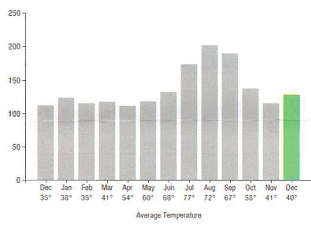
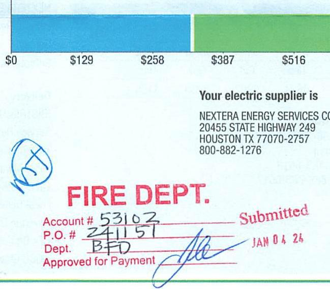
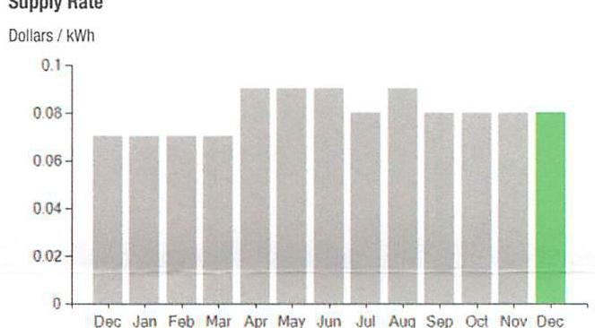
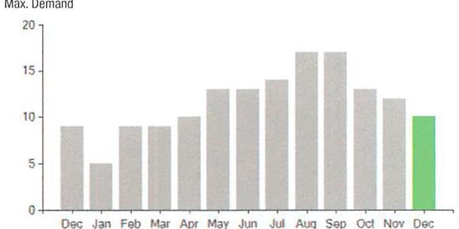

## EVERSEURCE

Account Number: 51819813007
Statement Date: 12/15/23
Sērvice Provided To:
TOWN OF BERLIN TOWN HALL

## Electric Usage History - Kinwatt Hours (kWh)

The image is a bar chart showing the electric usage history in kilowatt-hours (kWh) over a year, with monthly data points. 

- **X-axis**: Months of the year from December to December, labeled with average temperatures in degrees Fahrenheit (e.g., Dec 35°, Jan 38°, Feb 35°, etc.).
- **Y-axis**: Electric usage in kWh, ranging from 0 to 250.
- **Data Points**: 
  - December: ~110 kWh
  - January: ~100 kWh
  - February: ~100 kWh
  - March: ~110 kWh
  - April: ~110 kWh
  - May: ~120 kWh
  - June: ~140 kWh
  - July: ~180 kWh
  - August: ~220 kWh
  - September: ~200 kWh
  - October: ~130 kWh
  - November: ~110 kWh
  - December (highlighted in green): ~130 kWh

The chart provides a **yearly usage breakdown (monthly-based)**, with the December bar highlighted in green to indicate a notable change or emphasis.

## Electric Usage Summary

This month your average daily electric use was 127.0 kWh

This month you used $13.4 \%$ more than at the same time last year

## $1,262.11$

Amount Due On 12/11/23
Last Payment Received On 11/15/23
Balance Forward
Total Current Charges

## Current Charges for Electricity

| Supply | Delivery |
| :--: | :--: |
| \$328.13 | \$311.23 |
| Cost of electricity from NEXTERA ENERGY SERVICES CON | Cost to deliver electricity from Eversource |

The image is a photo of a document with the following details:

- A bar chart with a scale showing dollar amounts: $0, $129, $258, $387, $516.
- Text on the right side: 
  - "Your electric supplier is"
  - "NEXTERA ENERGY SERVICES CO"
  - "20455 STATE HIGHWAY 249"
  - "HOUSTON TX 77070-2757"
  - "800-882-1276"
- Stamped text in red: 
  - "FIRE DEPT."
  - "Account # 53102"
  - "P.O. # 241157"
  - "Dept. BFD"
  - "Submitted"
  - "Approved for Payment"
  - Date: "JAN 04 24"
- A handwritten signature and initials.

## News For You

A new discount for electric bills is available if you have a financial hardship status on your electric account. Based on your household income or receipt of a public assistance benefit, you may be eligible for a $10 \%$ or $50 \%$ discount off your electric bill per month. For example, if you have a $\$ 100$ monthly bill, it would be $\$ 10$ less if you receive a $10 \%$ discount or $\$ 50$ less if you receive the $50 \%$ discount. See how to enroll at eversource.com/billhelp.

Remit Payment To: Eversource, PO Box 56002, Boston, MA 02205-6002
CE_231219PROD.TXT-6037-00046162

## EVERSEURCE

Account Number: 51819813007
Non-residential and residential non-hardship customers may be subject to a $1.00 \%$ late payment charge if the "Total Amount Due" is not received by $01 / 12 / 24$.

Please make your check payable to Eversource and consider adding $\$ 1$ for Operation Fuel.
You can also add $\$ 2$ or $\$ 3$ when paying your bill online. $100 \%$ of your tax-deductible donation provides energy assistance grants. If mailing, please allow up to 5 business days to post.

## Total Amount Due

by $02 / 13 / 24$
Amount Enclosed
$1,262.11$

## Amount Enclosed

$23.32$

003019000046162
$1 / 10[11 / 11] / 11[11] / 11[11] / 11[11] / 11[11] / 11[11] / 11[11] / 11[11] / 11[11] / 11[11] / 11[11] / 11[11] / 11[11] 11

TOWN OF BERLIN TOWN HALL
27 TOWN FARM LN
BERLIN CT 06037-2324
$\left[\left[\left[11^{111} 11^{111} 11^{111} 11^{111} 11^{111} 11^{111} 11^{111} 11^{111}\right] 11^{111}\right.$
Eversource
PO Box 56002
Boston, MA 02205-6002

## EVERSEURCE

Account Number: 51819813007
Customer name key: BERL
Statement Date: 12/15/23
Service Provided To:
TOWN OF BERLIN TOWN HALL

| Svc Addr: 1857 BERLIN TPKE |  |  |  |  |  |
| :--: | :--: | :--: | :--: | :--: | :--: |
| BERLIN CT 06037 |  |  |  |  |  |
| Serv Re: 188-112008 |  |  | Bill Cycle: 09 |  |  |
| Service from 11/09/23 - 12/12/23 |  |  | 33 Days |  |  |
| Next read date on or about: Jan 12, 2024 |  |  |  |  |  |
| Meter   Number | Current   Read | Previous   Read | Current   Usage |  | Reading   Type |
| 889900242 | 22746 | 18551 | 4195 |  | Actual |

Cuot provided ID: RISP 191
Total Demand Use $=10.20 \mathrm{~kW}$

| Monthly KWh Use |  |  |  |  |  |
| :--: | :--: | :--: | :--: | :--: | :--: |
| Dec | Jan | Feb | Mar | Apr | May |
| 3706 | 3966 | 3115 | 3650 | 3349 | 3432 |
| Jul | Aug | Sep | Oct | Nov | Dec |
| 5208 | 6451 | 5674 | 3992 | 3230 | 4195 |

## Contact Information

Emergency: 800-286-2000
www.eversource.com
Pay by Phone: 888-783-6618
Customer Service: 888-783-6617

## Total Amount Due by $02 / 13 / 24$

## Electric Account Summary

Amount Due On 12/11/23
Last Payment Received On 11/15/23
Balance Forward
Current Charges/Credits
Electric Supply Services
Delivery Services
Total Current Charges
Total Amount Due

## Total Charges for Electricity

## Supplier

NEXTERA ENERGY
Service Reference: 186412008
Supply
Subtotal Supplier Services

## Delivery

(DISTRIBUTION RATE: 030)
Service Reference: 186412008
Transmission Demand Chrg
Fixed Monthly Charge
Local Delivery Demand Chrg
Local Delivery Improvements
Revenue Decoupling
CTA Demand Chrg
FMCC Charge
Comb Public Benefit Chrg
Subtotal Delivery Services
Total Cost of Electricity

Total Current Charges
\$1,262.11

## \$1,262.11

\$328.13
\$622.75
\$328.13
\$311.23
\$639.36
\$1,262.11

## $4195.00 \mathrm{kWh} \times \$ 0.07822$ \$328.13

\$328.13

## \$328.13

\$44.00
\$116.60
\$18.61
\$3.36
\$1.07
\$12.08
\$31.88
\$311.23
\$639.36

Total Current Charges

# EVERSEURCE 

## Account Number: 51819813007

Customer name key: BERL
Statement Date: 12/15/23
Service Provided To:
TOWN OF BERLIN TOWN HALL

Continued from previous page...

The image is a bar chart showing the "Supply Rate" in "Dollars / kWh" over the months of the year. The x-axis lists the months from December to December, and the y-axis ranges from 0 to 0.1. Each bar represents the supply rate for a specific month. 

- December (first) to November have bars of equal height, approximately around 0.06.
- The bar for December (last) is highlighted in green and is slightly higher, around 0.07.

This chart provides a **yearly usage breakdown (monthly-based)** of the supply rate.

Demand Profile
Max. Demand

The image is a bar chart showing "Max. Demand" over the months of the year. The x-axis lists the months from December to December, and the y-axis ranges from 0 to 20. Each bar represents the maximum demand for a specific month.

- December (first) has a bar height around 10.
- January has a lower bar, approximately around 5.
- February to April show a gradual increase, with April around 10.
- May to August have higher bars, peaking in July and August around 17.
- September and October show a slight decrease, with bars around 15.
- November decreases further to around 12.
- The bar for December (last) is highlighted in green and is slightly higher than November, around 13.

