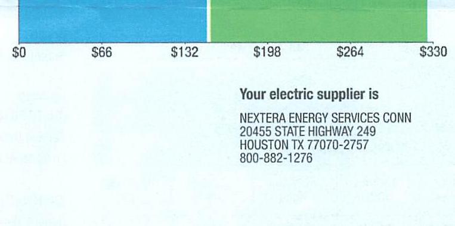

## EVERSEURCE

Account Number: 51649213063
Statement Date: 12/14/23
Service Provided To:
TOWN OF BERLIN/PUBLIC WORKS

## Total Amount Due

by $02 / 12 / 24$
Amount Due On 12/11/23
Last Payment Received On 11/22/23
Balance Forward
Total Current Charges

## Current Charges for Electricity

| Supply | Delivery |
| :--: | :--: |
| \$149.87 | \$173.98 |
| Cost of electricity from NEXTERA ENERGY SERVICES CONN | Cost to deliver electricity from Eversource |

The image is a section of a bill or statement featuring a bar chart and text. 

- **Chart Type**: Bar chart
- **Axis Labels and Data Points**:
  - X-axis: Labeled with dollar amounts: $0, $66, $132, $198, $264, $330.
  - The chart is divided into two colored sections: blue and green.
  
- **Embedded Text**:
  - "Your electric supplier is"
  - "NEXTERA ENERGY SERVICES CONN"
  - "20455 STATE HIGHWAY 249"
  - "HOUSTON TX 77070-2757"
  - "800-882-1276"

- **Styling**: The chart uses two distinct colors to represent different sections, blue and green, with a clear separation between them.

## News For You

A new discount for electric bills is available if you have a financial hardship status on your electric account. Based on your household income or receipt of a public assistance benefit, you may be eligible for a $10 \%$ or $50 \%$ discount off your electric bill per month. For example, if you have a $\$ 100$ monthly bill, it would be $\$ 10$ less if you receive a $10 \%$ discount or $\$ 50$ less if you receive the $50 \%$ discount. See how to enroll at eversource.com/billhelp.

Remit Payment To: Eversource, PO Box 56002, Boston, MA 02205-6002
CE_211214PROD.TXT-7889-030033416
Please make your check payable to Eversource and consider adding $\$ 1$ for Operation Fuel.
You can also add $\$ 2$ or $\$ 3$ when paying your bill online. $100 \%$ of your tax-deductible donation provides energy assistance grants. If mailing, please allow up to 5 business days to post.

Total Amount Due
by $02 / 12 / 24$
Amount Enclosed
$3550.68$

Amount Enclosed
$355.35$

003945000033416
$100000000000000000000000000000000000000000000000000000000000000000000000000000000000000000000000000000000000000000000000000000000000000000000000000000000000000000000000000000000000000000000000000000000

| SVEES¬URCE |  |  |  |  |  |
| --- | --- | --- | --- | --- | --- |
| Account Number: 5164 921 3063 |  |  |  |  |  |
| Customer name key: BERL |  |  |  |  |  |
| Statement Date: 12/14/23 |  |  |  |  |  |
| Service Provided To: |  |  |  |  |  |
| TOWN OF BERLIN/PUBLIC WORKS |  |  |  |  |  |

| Svc Addr: FERDIVAL AVE |  |  |  |  |  |
| :--: | :--: | :--: | :--: | :--: | :--: |
| KENSINGTON CT 06037 |  |  |  |  |  |
| Serv Ret: 254212005 |  |  | Bill Cycle: 10 |  |  |
| Service from 11/13/23 - 12/13/23 |  |  | 30 Days |  |  |
| Next road date on or about: Jan 15, 20/24 |  |  |  |  |  |
| Meter Number | Current Read | Previous Read | Current Usage |  | Reading Type |
| 891340282 | 7171 | 7171 | 0 |  | Actual |
| Monthly kWh Use |  |  |  |  |  |
| Dec | Jan | Feb | Mar | Apr | May | Jun |
| 1 | 0 | 0 | 0 | 0 | 26 | 51 |
| Jul | Aug | Sep | Oct | Nov | Dec |  |
| 95 | 86 | 33 | 44 | 43 | 0 |  |
| Svc Addr: FERDIVAL AVE |  |  |  |  |  |
| KENSINGTON CT 06037 |  |  |  |  |  |
| Serv Ret: 493112004 |  |  | Bill Cycle: 10 |  |  |
| Service from 11/13/23 - 12/13/23 |  |  | 30 Days |  |  |
| Next road date on or about: Jan 15, 20/24 |  |  |  |  |  |
| Meter Number | Current Read | Previous Read | Current Usage |  | Reading Type |
| 890245242 | 65948 | 64032 | 1916 |  | Actual |
| Total Demand Use $=4.40 \mathrm{~kW}$ |  |  |  |  |  |
| Monthly kWh Use |  |  |  |  |  |
| Dec | Jan | Feb | Mar | Apr | May | Jun |
| 1535 | 633 | 622 | 741 | 420 | 660 | 4358 |
| Jul | Aug | Sep | Oct | Nov | Dec |  |
| 7084 | 7460 | 926 | 456 | 1270 | 1916 |  |

| Total Amount Due by $02 / 12 / 24$ |  |  |  |  |  |
| :--: | :--: | :--: | :--: | :--: | :--: |
| Electric Account Summary |  |  |  |  |  |
| Amount Due On 12/11/23 |  |  |  |  | \$359.73 |
| Last Payment Received On 11/22/23 |  |  |  |  | - $\$ 132.75$ |
| Balance Forward |  |  |  |  | \$226.98 |
| Current Charges/Credits |  |  |  |  |  |
| Electric Supply Services |  |  |  |  | \$149.87 |
| Delivery Services |  |  |  |  | \$173.98 |
| Total Current Charges |  |  |  |  | \$323.85 |
| Total Amount Due |  |  |  |  | \$550.83 |
| Total Charges for Electricity |  |  |  |  |  |
| Supplier |  |  |  |  |  |
| NEXTERA ENERGY |  |  |  |  |  |
| Service Reference: 483112004 |  |  |  |  |  |
| Supply |  | 1916.00kWh X \$0.07822 |  |  | \$149.87 |
| Subtotal Supplier Services |  |  |  |  | \$149.87 |
| Delivery |  |  |  |  |  |
| (DISTRIBUTION RATE: 030) |  |  |  |  |  |
| Service Reference: 264212005 |  |  |  |  |  |
| Fixed Monthly Charge |  |  |  |  | \$44.00 |
| (DISTRIBUTION RATE: 030) |  |  |  |  |  |
| Service Reference: 483112004 |  |  |  |  |  |
| Transmission Demand Chrg | 2.40KW X \$10.46000 |  |  |  | \$25.10 |
| Fixed Monthly Charge |  |  |  |  | \$44.00 |
| Local Delivery Improvements | 2.40KW X \$2.27000 |  |  |  | \$5.45 |
| Local Delivery Demand Chrg | 2.40KW X \$14.22000 |  |  |  | \$34.13 |
| Revenue Decoupling | 1916.00kWh X \$0.00080 |  |  |  | \$1.53 |
| CTA Demand Chrg | 2.40KW X \$-0.13000 |  |  |  | - $\$ 0.31$ |
| FMCC Charge | 1916.00kWh X \$0.00288 |  |  |  | \$5.52 |
| Comb Public Benefit Chrg | 1916.00kWh X \$0.00760 |  |  |  | \$14.56 |
| Subtotal Delivery Services |  |  |  |  | \$173.98 |

## EVERSEURCE

Account Number: 51649213063
Customer name key: BERL
Statement Date: 12/14/23
Service Provided To:
TOWN OF BERLIN/PUBLIC WORKS

Continued from previous page...

## Contact Information

Emergency: 800-286-2000
www.eversource.com
Pay by Phone: 888-783-6618
Customer Service: 888-783-6617

## Total Amount Due by 02/12/24

Continued from previous page...
Total Cost of Electricity
\$323.85
Total Current Charges
\$323.85

