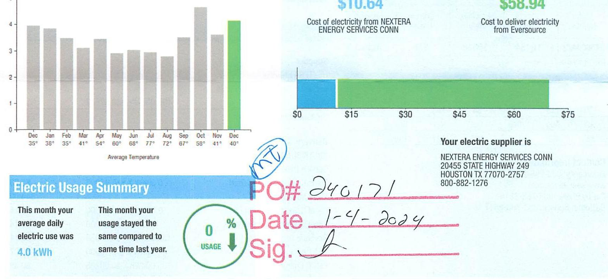
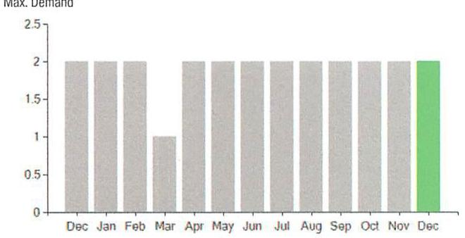

## EVERSEURCE

Account Number: 51797496023
Statement Date: 12/15/23
Service Provided To:
TOWN OF BERLIN PUBLIC GROUNDS

## EIJ 02/13/24

Amount Due On 12/11/23
Last Payment Received On 11/22/23
Balance Forward
Total Current Charges

## EIJ 03/35

Amount Due On 12/11/23
$\$ 135.95$
Last Payment Received On 11/22/23
$\$ 72.18$
Balance Forward
Total Current Charges

## Current Charges for Electricity

The image is a combination of a bar chart and a cost breakdown.

- **Bar Chart**: 
  - **X-axis**: Months (Dec, Jan, Feb, Mar, Apr, May, Jun, Jul, Aug, Sep, Oct, Nov, Dec) with corresponding average temperatures (35°, 38°, 35°, 41°, 54°, 60°, 68°, 77°, 72°, 67°, 58°, 41°, 40°).
  - **Y-axis**: Unspecified units, ranging from 0 to 4.
  - **Bars**: Represent monthly data, with a notable increase in October and December.

- **Cost Breakdown**:
  - **Cost of electricity from NEXTERA ENERGY SERVICES CONN**: $10.64
  - **Cost to deliver electricity from Eversource**: $58.94
  - **Graph**: A horizontal bar showing costs, with segments marked at $0, $15, $30, $45, $60, $75.

- **Electric Usage Summary**:
  - "This month your average daily electric use was 4.0 kWh."
  - "This month your usage stayed the same compared to same time last year."
  - "0% USAGE" with a downward arrow.

- **Additional Text**:
  - "PO# 240171"
  - "Date 1-4-2024"
  - "Sig." with a signature line.
  - "Your electric supplier is NEXTERA ENERGY SERVICES CONN, 20455 STATE HIGHWAY 249, HOUSTON TX 77070-2757, 800-882-1276."

## News For You

A new discount for electric bills is available if you have a financial hardship status on your electric account. Based on your household income or receipt of a public assistance benefit, you may be eligible for a $10 \%$ or $50 \%$ discount off your electric bill per month. For example, if you have a $\$ 100$ monthly bill, it would be $\$ 10$ less if you receive a $10 \%$ discount or $\$ 50$ less if you receive the $50 \%$ discount. See how to enroll at eversource.com/billhelp.

Remit Payment To: Eversource, PO Box 56002, Boston, MA 02205-6002
CE_231219/PROD.TXT-6109-000040130

## EVERSEURCE

Account Number: 51797496023
Non-residential and residential non-hardship customers may be subject to a 1.00\% late payment charge if the "Total Amount Due" is not received by $01 / 12 / 24$.

## EIJ 04/13/24

$14 \frac{11}{11} 11 \frac{1}{11} 11 \frac{1}{11} 11 \frac{1}{11} 11 \frac{1}{11} 11 \frac{1}{11} 11 \frac{1}{11} 11 \frac{1}{11} 11 \frac{1}{11} 11 \frac{1}{11} 11 \frac{1}{11} 11 \frac{1}{11} 11 \frac{1}{11} 11 \frac{1}{11} 11 \frac{1}{11} 11 \frac{1}{11} 11 \frac{1}{11} 11 \frac{1}{11} 11 \frac{1}{11} 11 \frac{1}{11} 11 \frac{1}{11} 11 \frac{1}{11} 11 \frac{1}{11} 11 \frac{1}{11} 11 \frac{1}{11} 11 \frac{1}{11} 11 \frac{1}{11} 11 \frac{1}{11} 11 \frac{1}{11} 11 \frac{1}{11} 11 \frac{1}{11} 11 \frac{1}{11} 11 \frac{1}{11} 11 \frac{1}{11} 11 \frac{1}{11} 11 \frac{1}{11} 11 \frac{1}{11} 11 \frac{1}{11} 11 \frac{1}{11} 11 \frac{1}{11} 11 \frac{1}{11} 11 \frac{1}{11} 11 \frac{1}{11} 11 \frac{1}{11} 11 \frac{1}{11} 11 \frac{1}{11} 11 \frac{1}{11} 11 \frac{1}{11} 11 \frac{1}{11} 11 \frac{1}{11} 11 \frac{1}{11} 11 \frac{1}{11} 11 \frac{1}{11} 11 \frac{1}{11} 11 \frac{1}{11} 11 \frac{1}{11} 11 \frac{1}{11} 11 \frac{1}{11} 11 \frac{1}{11} 11 \frac{1}{11} 11 \frac{1}{11} 11 \frac{1}{11} 11 \frac{1}{11} 11 \frac{1}{11} 11 \frac{1}{11} 11 \frac{1}{11} 11 \frac{1}{11} 11 \frac{1}{11} 11 \frac{1}{11} 11 \frac{1}{11} 11 \frac{1}{11} 11 \frac{1}{11} 11 \frac{1}{11} 11 \frac{1}{11} 11 \frac{1}{11} 11 \frac{1}{11} 11 \frac{1}{11} 11 \frac{1}{11} 11 \frac{1}{11} 11 \frac{1}{11} 11 \frac{1}{11} 11 \frac{1}{11} 11 \frac{1}{11} 11 \frac{1}{11} 11 \frac{1}{11} 11 \frac{1}{11} 11 \frac{1}{11} 11 \frac{1}{11} 11 \frac{1}{11} 11 \frac{1}{11} 11 \frac{1}{11} 11 \frac{1}{11} 11 \frac{1}{11} 11 \frac{1}{11} 11 \frac{1}{11} 11 \frac{1}{11} 11 \frac{1}{11} 11 \frac{1}{11} 11 \frac{1}{11} 11 \frac{1}{11} 11 \frac{1}{11} 11 \frac{1}{11} 11 \frac{1}{11} 11 \frac{1}{11} 11 \frac{1}{11} 11 \frac{1}{11} 11 \frac{1}{11} 11 \frac{1}{11} 11 \frac{1}{11} 11 \frac{1}{11} 11 \frac{1}{11} 11 \frac{1}{11} 11 \frac{1}{11} 11 \frac{1}{11} 11 \frac{1}{11} 11 \frac{1}{11} 11 \frac{1}{11} 11 \frac{1}{11} 11 \frac{1}{11} 11 \frac{1}{11} 11 \frac{1}{11} 11 \frac{1}{11} 11 \frac{1}{11} 11 \frac{1}{11} 11 \frac{1}{11} 11 \frac{1}{11} 11 \frac{1}{11} 11 \frac{1}{11} 11 \frac{1}{11} 11 \frac{1}{11} 11 \frac{1}{11} 11 \frac{1}{11} 11 \frac{1}{11} 11 \frac{1}{11} 11 \frac{1}{11} 11 \frac{1}{11} 11 \frac{1}{11} 11 \frac{1}{11} 11 \frac{1}{11} 11 \frac{1}{11} 11 \frac{1}{11} 11 \frac{1}{11} 11 \frac{1}{11} 11 \frac{1}{11} 11 \frac{1}{11} 11 \frac{1}{11} 11 \frac{1}{11} 11 \frac{1}{11} 11 \frac{1}{11} 11 \frac{1}{11} 11 \frac{1}{11} 11 \frac{1}{11} 11 \frac{1}{11} 11 \frac{1}{11} 11 \frac{1}{11} 11 \frac{1}{11} 11 \frac{1}{11} 11 \frac{1}{11} 11 \frac{1}{11} 11 \frac{1}{11} 11 \frac{1}{11} 11 \frac{1}{11} 11 \frac{1}{11} 11 \frac{1}{11} 11 \frac{1}{11} 11 \frac{1}{11} 11 \frac{1}{11} 11 \frac{1}{11} 11 \frac{1}{11} 11 \frac{1}{11} 11 \frac{1}{11} 11 \frac{1}{11} 11 \frac{1}{11} 11 \frac{1}{11} 11 \frac{1}{11} 11 \frac{1}{11} 11 \frac{1}{11} 11 \frac{1}{11} 11 \frac{1}{11} 11 \frac{1}{11} 11 \frac{1}{11} 11 \frac{1}{11} 11 \frac{1}{11} 11 \frac{1}{11} 11 \frac{1}{11} 11 \frac{1}{11} 11 \frac{1}{11} 11 \frac{1}{11} 11 \frac{1}{11} 11 \frac{1}{11} 11 \frac{1}{11} 11 \frac{1}{11} 11 \frac{1}{11} 11 \frac{1}{11} 11 \frac{1}{11} 11 \frac{1}{11} 11 \frac{1}{11} 11 \frac{1}{11} 11 \frac{1}{11} 11 \frac{1}{11} 11 \frac{1}{11} 11 \frac{1}{11} 11 \frac{1}{11} 11 \frac{1}{11} 11 \frac{1}{11} 11 \frac{1}{11} 11 \frac{1}{11} 11 \frac{1}{11} 11 \frac{1}{11} 11 \frac{1}{11} 11 \frac{1}{11} 11 \frac{1}{11} 11 \frac{1}{11} 11 \frac{1}{11} 11 \frac{1}{11} 11 \frac{1}{11} 11 \frac{1}{11} 11 \frac{1}{11} 11 \frac{1}{11} 11 \frac{1}{11} 11 \frac{1}{11} 11 \frac{1}{11} 11 \frac{1}{11} 11 \frac{1}{11} 11 \frac{1}{11} 11 \frac{1}{11} 11 \frac{1}{11} 11 \frac{1}{11} 11 \frac{1}{11} 11 \frac{1}{11} 11 \frac{1}{11} 11 \frac{1}{11} 11 \frac{1}{11} 11 \frac{1}{11} 11 \frac{1}{11} 11 \frac{1}{11} 11 \frac{1}{11} 11 \frac{1}{11} 11 \frac{1}{11} 11 \frac{1}{11} 11 \frac{1}{11} 11 \frac{1}{11} 11 \frac{1}{11} 11 \frac{1}{11} 11 \frac{1}{11} 11 \frac{1}{11} 11 \frac{1}{11} 11 \frac{1}{11} 11 \frac{1}{11} 11 \frac{1}{11} 11 \frac{1}{11} 11 \frac{1}{11} 11 \frac{1}{11} 11 \frac{1}{11} 11 \frac{1}{11} 11 \frac{1}{11} 11 \frac{1}{11} 11 \frac{1}{11} 11 \frac{1}{11} 11 \frac{1}{11} 11 \frac{1}{11} 11 \frac{1}{11} 11 \frac{1}{11} 11 \frac{1}{11} 11 \frac{1}{11} 11 \frac{1}{11} 11 \frac{1}{11} 11 \frac{1}{11} 11 \frac{1}{11} 11 \frac{1}{11} 11 \frac{1}{11} 11 \frac{1}{11} 11 \frac{1}{11} 11 \frac{1}{11} 11 \frac{1}{11} 11 \frac{1}{11} 11 \frac{1}{11} 11 \frac{1}{11} 11 \frac{1}{11} 11 \frac{1}{11} 11 \frac{1}{11} 11 \frac{1}{11} 11 \frac{1}{11} 11 \frac{1}{11} 11 \frac{1}{11} 11 \frac{1}{11} 11 \frac{1}{11} 11 \frac{1}{11} 11 \frac{1}{11} 11 \frac{1}{11} 11 \frac{1}{11} 11 \frac{1}{11} 11 \frac{1}{11} 11 \frac{1}{11} 11 \frac{1}{11} 11 \frac{1}{11} 11 \frac{1}{11} 11 \frac{1}{11} 11 \frac{1}{11} 11 \frac{1}{11} 11 \frac{1}{11} 11 \frac{1}{11} 11 \frac{1}{11} 11 \frac{1}{11} 11 \frac{1}{11} 11 \frac{1}{11} 11 \frac{1}{11} 11 \frac{1}{11} 11 \frac{1}{11} 11 \frac{1}{11} 11 \frac{1}{11} 11 \frac{1}{11} 11 \frac{1}{11} 11 \frac{1}{11} 11 \frac{1}{11} 11 \frac{1}{11} 11 \frac{1}{11} 11 \frac{1}{11} 11 \frac{1}{11} 11 \frac{1}{11} 11 \frac{1}{11} 11 \frac{1}{11} 11 \frac{1}{11} 11 \frac{1}{11} 11 \frac{1}{11} 11 \frac{1}{11} 11 \frac{1}{11} 11 \frac{1}{11} 11 \frac{1}{11} 11 \frac{1}{11} 11 \frac{1}{11} 11 \frac{1}{11} 11 \frac{1}{11} 11 \frac{1}{11} 11 \frac{1}{11} 11 \frac{1}{11} 11 \frac{1}{11} 11 \frac{1}{11} 11 \frac{1}{11} 11 \frac{1}{11} 11 \frac{1}{11} 11 \frac{1}{11} 11 \frac{1}{11} 11 \frac{1}{11} 11 \frac{1}{11} 11 \frac{1}{11} 11 \frac{1}{11} 11 \frac{1}{11} 11 \frac{1}{11} 11 \frac{1}{11} 11 \frac{1}{11} 11 \frac{1}{11} 11 \frac{1}{11} 11 \frac{1}{11} 11 \frac{1}{11} 11 \frac{1}{11} 11 \frac{1}{11} 11 \frac{1}{11} 11 \frac{1}{11} 11 \frac{1}{11} 11 \frac{1}{11} 11 \frac{1}{11} 11 \frac{1}{11} 11 \frac{1}{11} 11 \frac{1}{11} 11 \frac{1}{11} 11 \frac{1}{11} 11 \frac{1}{11} 11 \frac{1}{11} 11 \frac{1}{11} 11 \frac{1}{11} 11 \frac{1}{11} 11 \frac{1}{11} 11 \frac{1}{11} 11 \frac{1}{11} 11 \frac{1}{11} 11 \frac{1}{11} 11 \frac{1}{11} 11 \frac{1}{11} 11 \frac{1}{11} 11 \frac{1}{11} 11 \frac{1}{11} 11 \frac{1}{11} 11 \frac{1}{11} 11 \frac{1}{11} 11 \frac{1}{11} 11 \frac{1}{11} 11 \frac{1}{11} 11 \frac{1}{11} 11 \frac{1}{11} 11 \frac{1}{11} 11 \frac{1}{11} 11 \frac{1}{11} 11 \frac{1}{11} 11 \frac{1}{11} 11 \frac{1}{11} 11 \frac{1}{11} 11 \frac{1}{11} 11 \frac{1}{11} 11 \frac{1}{11} 11 \frac{1}{11} 11 \frac{1}{11} 11 \frac{1}{11} 11 \frac{1}{11} 11 \frac{1}{11} 11 \frac{1}{11} 11 \frac{1}{11} 11 \frac{1}{11} 11 \frac{1}{11} 11 \frac{1}{11} 11 \frac{1}{11} 11 \frac{1}{11} 11 \frac{1}{11} 11 \frac{1}{11} 11 \frac{1}{11} 11 \frac{1}{11} 11 \frac{1}{11} 11 \frac{1}{11} 11 \frac{1}{11} 11 \frac{1}{11} 11 \frac{1}{11} 11 \frac{1}{11} 11 \frac{1}{11} 11 \frac{1}{11} 11 \frac{1}{11} 11 \frac{1}{11} 11 \frac{1}{11} 11 \frac{1}{11} 11 \frac{1}{11} 11 \frac{1}{11} 11 \frac{1}{11} 11 \frac{1}{11} 11 \frac{1}{11} 11 \frac{1}{11} 11 \frac{1}{11} 11 \frac{1}{11} 11 \frac{1}{11} 11 \frac{1}{11} 11 \frac{1}{11} 11 \frac{1}{11} 11 \frac{1}{11} 11 \frac{1}{11} 11 \frac{1}{11} 11 \frac{1}{11} 11 \frac{1}{11} 11 \frac{1}{11} 11 \frac{1}{11} 11 \frac{1}{11} 11 \frac{1}{11} 11 \frac{1}{11} 11 \frac{1}{11} 11 \frac{1}{11} 11 \frac{1}{11} 11 \frac{1}{11} 11 \frac{1}{11} 11 \frac{1}{11} 11 \frac{1}{11} 11 \frac{1}{11} 11 \frac{1}{11} 11 \frac{1}{11} 11 \frac{1}{11} 11 \frac{1}{11} 11 \frac{1}{11} 11 \frac{1}{11} 11 \frac{1}{11} 11 \frac{1}{11} 11 \frac{1}{11} 11 \frac{1}{11} 11 \frac{1}{11} 11 \frac{1}{11} 11 \frac{1}{11} 11 \frac{1}{11} 11 \frac{1}{11} 11 \frac{1}{11} 11 \frac{1}{11} 11 \frac{1}{11} 11 \frac{1}{11} 11 \frac{1}{11} 11 \frac{1}{11} 11 \frac{1}{11} 11 \frac{1}{11} 11 \frac{1}{11} 11 \frac{1}{11} 11 \frac{1}{11} 11 \frac{1}{11} 11 \frac{1}{11} 11 \frac{1}{11} 11 \frac{1}{11} 11 \frac{1}{11} 11 \frac{1}{11} 11 \frac{1}{11} 11 \frac{1}{11} 11 \frac{1}{11} 11 \frac{1}{11} 11 \frac{1}{11} 11 \frac{1}{11} 11 \frac{1}{11} 11 \frac{1}{11} 11 \frac{1}{11} 11 \frac{1}{11} 11 \frac{1}{11} 11 \frac{1}{11} 11 \frac{1}{11} 11 \frac{1}{11} 11 \frac{1}{11} 11 \frac{1}{11} 11 \frac{1}{11} 11 \frac{1}{11} 11 \frac{1}{11} 11 \frac{1}{11} 11 \frac{1}{11} 11 \frac{1}{11} 11 \frac{1}{11} 11 \frac{1}{11} 11 \frac{1}{11} 11 \frac{1}{11} 11 \frac{1}{11} 11 \frac{1}{11} 11 \frac{1}{11} 11 \frac{1}{11} 11 \frac{1}{11} 11 \frac{1}{11} 11 \frac{1}{11} 11 \frac{1}{11} 11 \frac{1}{11} 11 \frac{1}{11} 11 \frac{1}{11} 11 \frac{1}{11} 11 \frac{1}{11} 11 \frac{1}{11} 11 \frac{1}{11} 11 \frac{1}{11} 11 \frac{1}{11} 11 \frac{1}{11} 11 \frac{1}{11} 11 \frac{1}{11} 11 \frac{1}{11} 11 \frac{1}{11} 11 \frac{1}{11} 11 \frac{1}{11} 11 \frac{1}{11} 11 \frac{1}{11} 11 \frac{1}{11} 11 \frac{1}{11} 11 \frac{1}{11} 11 \frac{1}{11} 11 \frac{1}{11} 11 \frac{1}{11} 11 \frac{1}{11} 11 \frac{1}{11} 11 \frac{1}{11} 11 \frac{1}{11} 11 \frac{1}{11} 11 \frac{1}{11} 11 \frac{1}{11} 11 \frac{1}{11} 11 \frac{1}{11} 11 \frac{1}{11} 11 \frac{1}{11} 11 \frac{1}{11} 11 \frac{1}{11} 11 \frac{1}{11} 11 \frac{1}{11} 11 \frac{1}{11} 11 \frac{1}{11} 11 \frac{1}{11} 11 \frac{1}{11} 11 \frac{1}{11} 11 \frac{1}{11} 11 \frac{1}{11} 11 \frac{1}{11} 11 \frac{1}{11} 11 \frac{1}{11} 11 \frac{1}{11} 11 \frac{1}{11} 11 \frac{1}{11} 11 \frac{1}{11} 11 \frac{1}{11} 11 \frac{1}{11} 11 \frac{1}{11} 11 \frac{1}{11} 11 \frac{1}{11} 11 \frac{1}{11} 11 \frac{1}{11} 11 \frac{1}{11} 11 \frac{1}{11} 11 \frac{1}{11} 11 \frac{1}{11} 11 \frac{1}{11} 11 \frac{1}{11} 11 \frac{1}{11} 11 \frac{1}{11} 11 \frac{1}{11} 11 \frac{1}{11} 11 \frac{1}{11} 11 \frac{1}{11} 11 \frac{1}{11} 11 \frac{1}{11} 11 \frac{1}{11} 11 \frac{1}{11} 11 \frac{1}{11} 11 \frac{1}{11} 11 \frac{1}{11} 11 \frac{1}{11} 11 \frac{1}{11} 11 \frac{1}{11} 11 \frac{1}{11} 11 \frac{1}{11} 11 \frac{1}{11} 11 \frac{1}{11} 11 \frac{1}{11} 11 \frac{1}{11} 11 \frac{1}{11} 11 \frac{1}{11} 11 \frac{1}{11} 11 \frac{1}{11} 11 \frac{1}{11} 11 \frac{1}{11} 11 \frac{1}{11} 11 \frac{1}{11} 11 \frac{1}{11} 11 \frac{1}{11} 11 \frac{1}{11} 11 \frac{1}{11} 11 \frac{1}{11} 11 \frac{1}{11} 11 \frac{1}{11} 11 \frac{1}{11} 11 \frac{1}{11} 11 \frac{1}{11} 11 \frac{1}{11} 11 \frac{1}{11} 11 \frac{1}{11} 11 \frac{1}{11} 11 \frac{1}{11} 11 \frac{1}{11} 11 \frac{1}{11} 11 \frac{1}{11} 11 \frac{1}{11} 11 \frac{1}{11} 11 \frac{1}{11} 11 \frac{1}{11} 11 \frac{1}{11} 11 \frac{1}{11} 11 \frac{1}{11} 11 \frac{1}{11} 11 \frac{1}{11} 11 \frac{1}{11} 11 \frac{1}{11} 11 \frac{1}{11} 11 \frac{1}{11} 11 \frac{1}{11} 11 \frac{1}{11} 11 \frac{1}{11} 11 \frac{1}{11} 11 \frac{1}{11} 11 \frac{1}{11} 11 \frac{1}{11} 11 \frac{1}{11} 11 \frac{1}{11} 11 \frac{1}{11} 11 \frac{1}{11} 11 \frac{1}{11} 11 \frac{1}{11} 11 \frac{1}{11} 11 \frac{1}{11} 11 \frac{1}{11} 11 \frac{1}{11} 11 \frac{1}{11} 11 \frac{1}{11} 11 \frac{1}{11} 11 \frac{1}{11} 11 \frac{1}{11} 11 \frac{1}{11} 11 \frac{1}{11} 11 \frac{1}{11} 11 \frac{1}{11} 11 \frac{1}{11} 11 \frac{1}{11} 11 \frac{1}{11} 11 \frac{1}{11} 11 \frac{1}{11} 11 \frac{1}{11} 11 \frac{1}{11} 11 \frac{1}{11} 11 \frac{1}{11} 11 \frac{1}{11} 11 \frac{1}{11} 11 \frac{1}{11} 11 \frac{1}{11} 11 \frac{1}{11} 11 \frac{1}{11} 11 \frac{1}{11} 11 \frac{1}{11} 11 \frac{1}{11} 11 \frac{1}{11} 11 \frac{1}{11} 11 \frac{1}{11} 11 \frac{1}{11} 11 \frac{1}{11} 11 \frac{1}{11} 11 \frac{1}{11} 11 \frac{1}{11} 11 \frac{1}{11} 11 \frac{1}{11} 11 \frac{1}{11} 11 \frac{1}{11} 11 \frac{1}{11} 11 \frac{1}{11} 11 \frac{1}{11} 11 \frac{1}{11} 11 \frac{1}{11} 11 \frac{1}{11} 11 \frac{1}{11} 11 \frac{1}{11} 11 \frac{1}{11} 11 \frac{1}{11} 11 \frac{1}{11} 11 \frac{1}{11} 11 \frac{1}{11} 11 \frac{1}{11} 11 \frac{1}{11} 11 \frac{1}{11} 11 \frac{1}{11} 11 \frac{1}{11} 11 \frac{1}{11} 11 \frac{1}{11} 11 \frac{1}{11} 11 \frac{1}{11} 11 \frac{1}{11} 11 \frac{1}{11} 11 \frac{1}{11} 11 \frac{1}{11} 11 \frac{1}{11} 11 \frac{1}{11} 11 \frac{1}{11} 11 \frac{1}{11} 11 \frac{1}{11} 11 \frac{1}{11} 11 \frac{1}{11} 11 \frac{1}{11} 11 \frac{1}{11} 11 \frac{1}{11} 11 \frac{1}{11} 11 \frac{1}{11} 11 \frac{1}{11} 11 \frac{1}{11} 11 \frac{1}{11} 11 \frac{1}{11} 11 \frac{1}{11} 11 \frac{1}{11} 11 \frac{1}{11} 11 \frac{1}{11} 11 \frac{1}{11} 11 \frac{1}{11} 11 \frac{1}{11} 11 \frac{1}{11} 11 \frac{1}{11} 11 \frac{1}{11} 11 \frac{1}{11} 11 \frac{1}{11} 11 \frac{1}{11} 11 \frac{1}{11} 11 \frac{1}{11} 11 \frac{1}{11} 11 \frac{1}{11} 11 \frac{1}{11} 11 \frac{1}{11} 11 \frac{1}{11} 11 \frac{1}{11} 11 \frac{1}{11} 11 \frac{1}{11} 11 \frac{1}{11} 11 \frac{1}{11} 11 \frac{1}{11} 11 \frac{1}{11} 11 \frac{1}{11} 11 \frac{1}{11} 11 \frac{1}{11} 11 \frac{1}{11} 11 \frac{1}{11} 11 \frac{1}{11} 11 \frac{1}{11} 11 \frac{1}{11} 11 \frac{1}{11} 11 \frac{1}{11} 11 \frac{1}{11} 11 \frac{1}{11} 11 \frac{1}{11} 11 \frac{1}{11} 11 \frac{1}{11} 11 \frac{1}{11} 11 \frac{1}{11} 11 \frac{1}{11} 11 \frac{1}{11} 11 \frac{1}{11} 11 \frac{1}{11} 11 \frac{1}{11} 11 \frac{1}{11} 11 \frac{1}{11} 11 \frac{1}{11} 11 \frac{1}{11} 11 \frac{1}{11} 11 \frac{1}{11} 11 \frac{1}{11} 11 \frac{1}{11} 11 \frac{1}{11} 11 \frac{1}{11} 11 \frac{1}{11} 11 \frac{1}{11} 11 \frac{1}{11} 11 \frac{1}{11} 11 \frac{1}{11} 11 \frac{1}{11} 11 \frac{1}{11} 11 \frac{1}{11} 11 \frac{1}{11} 11 \frac{1}{11} 11 \frac{1}{11} 11 \frac{1}{11} 11 \frac{1}{11} 11 \frac{1}{11} 11 \frac{1}{11} 11 \frac{1}{11} 11 \frac{1}{11} 11 \frac{1}{11} 11 \frac{1}{11} 11 \frac{1}{11} 11 \frac{1}{11} 11 \frac{1}{11} 11 \frac{1}{11} 11 \frac{1}{11} 11 \frac{1}{11} 11 \frac{1}{11} 11 \frac{1}{11} 11 \frac{1}{11} 11 \frac{1}{11} 11 \frac{1}{11} 11 \frac{1}{11} 11 \frac{1}{11} 11 \frac{1}{11} 11 \frac{1}{11} 11 \frac{1}{11} 11 \frac{1}{11} 11 \frac{1}{11} 11 \frac{1}{11} 11 \frac{1}{11} 11 \frac{1}{11} 11 \frac{1}{11} 11 \frac{1}{11} 11 \frac{1}{11} 11 \frac{1}{11} 11 \frac{1}{11} 11 \frac{1}{11} 11 \frac{1}{11} 11 \frac{1}{11} 11 \frac{1}{11} 11 \frac{1}{11} 11 \frac{1}{11} 11 \frac{1}{11} 11 \frac{1}{11} 11 \frac{1}{11} 11 \frac{1}{11} 11 \frac{1}{11} 11 \frac{1}{11} 11 \frac{1}{11} 11 \frac{1}{11} 11 \frac{1}{11} 11 \frac{1}{11} 11 \frac{1}{11} 11 \frac{1}{11} 11 \frac{1}{11} 11 \frac{1}{11} 11 \frac{1}{11} 11 \frac{1}{11} 11 \frac{1}{11} 11 \frac{1}{11} 11 \frac{1}{11} 11 \frac{1}{11} 11 \frac{1}{11} 11 \frac{1}{11} 11 \frac{1}{11} 11 \frac{1}{11} 11 \frac{1}{11} 11 \frac{1}{11} 11 \frac{1}{11} 11 \frac{1}{11} 11 \frac{1}{11} 11 \frac{1}{11} 11 \frac{1}{11} 11 \frac{1}{11} 11 \frac{1}{11} 11 \frac{1}{11} 11 \frac{1}{11} 11 \frac{1}{11} 11 \frac{1}{11} 11 \frac{1}{11} 11 \frac{1}{11} 11 \frac{1}{11} 11 \frac{1}{11} 11 \frac{1}{11} 11 \frac{1}{11} 11 \frac{1}{11} 11 \frac{1}{11} 11 \frac{1}{11} 11 \frac{1}{11} 11 \frac{1}{11} 11 \frac{1}{11} 11 \frac{1}{11} 11 \frac{1}{11} 11 \frac{1}{11} 11 \frac{1}{11} 11 \frac{1}{11} 11 \frac{1}{11} 11 \frac{1}{11} 11 \frac{1}{11} 11 \frac{1}{11} 11 \frac{1}{11} 11 \frac{1}{11} 11 \frac{1}{11} 11 \frac{1}{11} 11 \frac{1}{11} 11 \frac{1}{11} 11 \frac{1}{11} 11 \frac{1}{11} 11 \frac{1}{11} 11 \frac{1}{11} 11 \frac{1}{11} 11 \frac{1}{11} 11 \frac{1}{11} 11 \frac{1}{11} 11 \frac{1}{11} 11 \frac{1}{11} 11 \frac{1}{11} 11 \frac{1}{11} 11 \frac{1}{11} 11 \frac{1}{11} 11 \frac{1}{11} 11 \frac{1}{11} 11 \frac{1}{11} 11 \frac{1}{11} 11 \frac{1}{11} 11 \frac{1}{11} 11 \frac{1}{11} 11 \frac{1}{11} 11 \frac{1}{11} 11 \frac{1}{11} 11 \frac{1}{11} 11 \frac{1}{11} 11 \frac{1}{11} 11 \frac{1}{11} 11 \frac{1}{11} 11 \frac{1}{11} 11 \frac{1}{11} 11 \frac{1}{11} 11 \frac{1}{11} 11 \frac{1}{11} 11 \frac{1}{11} 11 \frac{1}{11} 11 \frac{1}{11} 11 \frac{1}{11} 11 \frac{1}{11} 11 \frac{1}{11} 11 \frac{1}{11} 11 \frac{1}{11} 11 \frac{1}{11} 11 \frac{1}{11} 11 \frac{1}{11} 11 \frac{1}{11} 11 \frac{1}{11} 11 \frac{1}{11} 11 \frac{1}{11} 11 \frac{1}{11} 11 \frac{1}{11} 11 \frac{1}{11} 11 \frac{1}{11} 11 \frac{1}{11} 11 \frac{1}{11} 11 \frac{1}{11} 11 \frac{1}{11} 11 \frac{1}{11} 11 \frac{1}{11} 11 \frac{1}{11} 11 \frac{1}{11} 11 \frac{1}{11} 11 \frac{1}{11} 11 \frac{1}{11} 11 \frac{1}{11} 11 \frac{1}{11} 11 \frac{1}{11} 11 \frac{1}{11} 11 \frac{1}{11} 11 \frac{1}{11} 11 \frac{1}{11} 11 \frac{1}{11} 11 \frac{1}{11} 11 \frac{1}{11} 11 \frac{1}{11} 11 \frac{1}{11} 11 \frac{1}{11} 11 \frac{1}{11} 11 \frac{1}{11} 11 \frac{1}{11} 11 \frac{1}{11} 11 \frac{1}{11} 11 \frac{1}{11} 11 \frac{1}{11} 11 \frac{1}{11} 11 \frac{1}{11} 11 \frac{1}{11} 11 \frac{1}{11} 11 \frac{1}{11} 11 \frac{1}{11} 11 \frac{1}{11} 11 \frac{1}{11} 11 \frac{1}{11} 11 \frac{1}{11} 11 \frac{1}{11} 11 \frac{1}{11} 11 \frac{1}{11} 11 \frac{1}{11} 11 \frac{1}{11} 11 \frac{1}{11} 11 \frac{1}{11} 11 \frac{1}{11} 11 \frac{1}{11} 11 \frac{1}{11} 11 \frac{1}{11} 11 \frac{1 \frac{1}{11} 11 \frac{1}{11} 11 \frac{1 \frac{1}{11} 11 \frac{1}{11} 11 \frac{1}{11} 11 \frac{1}{11} 11 \frac{1 \frac{1}{11} 11 \frac{1 \frac{1}{11} 11 \frac{1 \frac{1}{11} 11 \frac{1}{11} 11 \frac{1}{11} 11 \frac{1 \frac{1}{11} 11 \frac{1 \frac{1}{11} 11 \frac{1 \frac{1}{11} 11 \frac{1 \frac{1}{11} 11 \frac{1 \frac{1}{11} 11 \frac{1 \frac{1}{11} 11 \frac{1 \frac{1}{11} 11 \frac{1 \frac{1}{11} 11 \frac{1 \frac{1}{11} 11 \frac{1 \frac{1 \frac{1}{11} 11 \frac{1 \frac{1 \frac{1}{11} 11 \frac{1 \frac{1}{11} 11 \frac{1 \frac{1 \frac{1}{11} 11 \frac{1 \frac{1 \frac{1}{11} 11 \frac{1 \frac{1 \frac{1 \frac{1}{11} 11 \frac{1 \frac{1 \frac{1 \frac{1}{11} 11 \frac{1 \frac{1 \frac{1 \frac{1}{11} 11 \frac{1 \frac{1 \frac{1 \frac{1}{11} 11 \frac{1 \frac{1 \frac{1 \frac{1 \frac{1 \frac{1 \frac{1}{11} 11 \frac{1 \frac{1 \frac{1 \frac{1 \frac{1 \frac{1}{11} 11 \frac{1 \frac{1 \frac{1 \frac{1 \frac{1 \frac{1 \frac{1 \frac{1} 11 \frac{1 \frac{1 \frac{1 \frac{1 \frac{1 \frac{1 \frac{1 \frac{1 \frac{1 \frac{1.111} 11 \frac{1 \frac{1 \frac{1 \frac{1 \frac{1 \frac{1 \frac{1 \frac{1.11} 11 \frac{1 \frac{1 \frac{1 \frac{1 \frac{1.11} 11 \frac{1 \frac{1 \frac{1 \frac{1 \frac{1 \frac{1 \frac{1 \frac{1 \frac{1.11} 11 \frac{1 \frac{1 \frac{1 \frac{1 \frac{1 \frac{1 \frac{1.11} 11 \frac{1 \frac{1 \frac{1 \frac{1 \frac{1 \frac{1.11} 11 \frac{1 \frac{1 \frac{1 \frac{1.11} 11 \frac{1 \frac{1 \frac{1 \frac{1.11 \frac{1.11} 11 \frac{1 \frac{1 \frac{1 \frac{1 \frac{1.11} 11 \frac{1 \frac{1 \frac{1 \frac{1.11.11} 11 \frac{1 \frac{1 \frac{1.11.11.11} 11 \frac{1 \frac{1 \frac{1 \frac{1 \frac{1.11.11.11} 11 \frac{1 \frac{1 \frac{1 \frac{1 \frac{1.11.11.11.11.11.11.11.11.11.11.11.11.11.11.11.11.11.11.11.11.11.11.11.11.11.11.11.11.11.11.11.11.11.11.11.11.11.11.11.11.11.11.11.11.11.11.11.11.11.11.11.11.11.11.11.11.11.11.11.11.11.11.11.11.11.11.1

## EVERSEURCE

Account Number: 51797496023
Customer name key: BERL
Statement Date: 12/15/23
Service Provided To:
TOWN OF BERLIN PUBLIC GROUNDS

| SVo. Addr: 1517 BERLIN TPKE BLEG MAINTENAE BERLIN CT 06037 |  |  |  |  |  |
| :--: | :--: | :--: | :--: | :--: | :--: |
| Serv NoF: 120653004 |  |  |  | Bill Ejects: 09 |  |
| Service from 11/09/23 - 12/12/23 |  |  |  | 33 Days |  |
| Next read date on or about: Jan 12, 2024 |  |  |  |  |  |
| Meter   Number | Current   Read | Previous   Read | Current   Usage |  | Reading   Type |
| 893883422 | 10454 | 10318 | 136 |  | Actual |
| Total Demand Use $=2.50 \mathrm{~kW}$ |  |  |  |  |  |
| Monthly RWh Use |  |  |  |  |  |
| Dec | Jan | Feb | Mar | Apr | May | Jun |
| 130 | 119 | 97 | 96 | 103 | 84 | 100 |
| Jul | Aug | Sep | Oct | Nov | Dec |  |
| 88 | 89 | 105 | 135 | 101 | 136 |  |

## Contact Information

Emergency: 800-286-2000 www.eversource.com
Pay by Phone: 888-783-6618
Customer Service: 888-783-6617

## Total Amount Due by 02/13/24

## Electric Account Summary

| Amount Due On 12/11/23 | $\$ 135.95$ |
| :-- | --: |
| Last Payment Received On 11/22/23 | - $\$ 72.18$ |
| Balance Forward | $\$ 63.77$ |
| Current Charges/Credits |  |
| Electric Supply Services | $\$ 10.64$ |
| Delivery Services | $\$ 58.94$ |
| Total Current Charges | $\$ 69.58$ |
| Total Amount Due | $\$ 133.35$ |

## Total Charges for Electricity

## Supplier

NEXTERA ENERGY
Service Reference: 120653004 Supply
Subtotal Supplier Services
$\$ 10.64$

## Delivery

(DISTRIBUTION RATE: 030)
Service Reference: 120653004
Transmission Demand Chrg
Fixed Monthly Charge
Local Delivery Demand Chrg
Local Delivery Improvements
Revenue Decoupling
CTA Demand Chrg
FMCC Charge
Comb Public Benefit Chrg
Subtotal Delivery Services
Total Cost of Electricity
Total Current Charges
$\$ 10.64$

| 0.50 KW X \$10.46000 | $\$ 5.23$ |
| :-- | --: |
| $\$ 44.00$ |  |
| 0.50 KW X \$14.22000 | $\$ 7.11$ |
| 0.50 KW X \$2.27000 | $\$ 1.14$ |
| 136.00 kWh X \$0.00080 | $\$ 0.11$ |
| 0.50 KW X \$ -0.13000 | - $\$ 0.07$ |
| 136.00 kWh X \$0.00288 | $\$ 0.39$ |
| 136.00 kWh X \$0.00760 | $\$ 1.03$ |
| $\$ 58.94$ |  |
| $\$ 69.58$ |  |

\$69.58

# EVERSEURCE 

## Account Number: 51797496023

Customer name key: BERL
Statement Date: 12/15/23
Service Provided To:
TOWN OF BERLIN PUBLIC GROUNDS

Continued from previous page...

Supply Rate
Dollars / kWh

The image is a bar chart.

- **Chart Type**: Bar chart
- **Y-Axis Title**: Max. Demand
- **Y-Axis Unit**: Not explicitly stated, but implied to be in some unit of demand (e.g., kW)
- **X-Axis Labels**: Dec, Jan, Feb, Mar, Apr, May, Jun, Jul, Aug, Sep, Oct, Nov, Dec
- **Data Points**:
  - Dec: ~2.0
  - Jan: ~2.0
  - Feb: ~2.0
  - Mar: ~0.5
  - Apr: ~2.0
  - May: ~2.0
  - Jun: ~2.0
  - Jul: ~2.0
  - Aug: ~2.0
  - Sep: ~2.0
  - Oct: ~2.0
  - Nov: ~2.0
  - Dec: ~2.0
- **Notable Styling**: The bar for December is highlighted in green, while all other bars are in gray.
- **Yearly Usage Breakdown (Monthly-Based)**: The chart shows the maximum demand for each month, with a notable dip in March.

Demand Profile
Max. Demand

The image is a bar chart.

- **Chart Type**: Bar chart
- **Y-Axis Title**: Max. Demand
- **Y-Axis Unit**: Not explicitly stated, but implied to be in some unit of demand (e.g., kW)
- **X-Axis Labels**: Dec, Jan, Feb, Mar, Apr, May, Jun, Jul, Aug, Sep, Oct, Nov, Dec
- **Data Points**:
  - Dec: ~2.0
  - Jan: ~2.0
  - Feb: ~2.0
  - Mar: ~0.5
  - Apr: ~2.0
  - May: ~2.0
  - Jun: ~2.0
  - Jul: ~2.0
  - Aug: ~2.0
  - Sep: ~2.0
  - Oct: ~2.0
  - Nov: ~2.0
  - Dec: ~2.0
- **Notable Styling**: The bar for December is highlighted in green, while all other bars are in gray.
- **Yearly Usage Breakdown (Monthly-Based)**: The chart shows the maximum demand for each month, with a notable dip in March.

Dec Jan Feb Mar Apr May Jun Jul Aug Sep Oct Nov Dec

