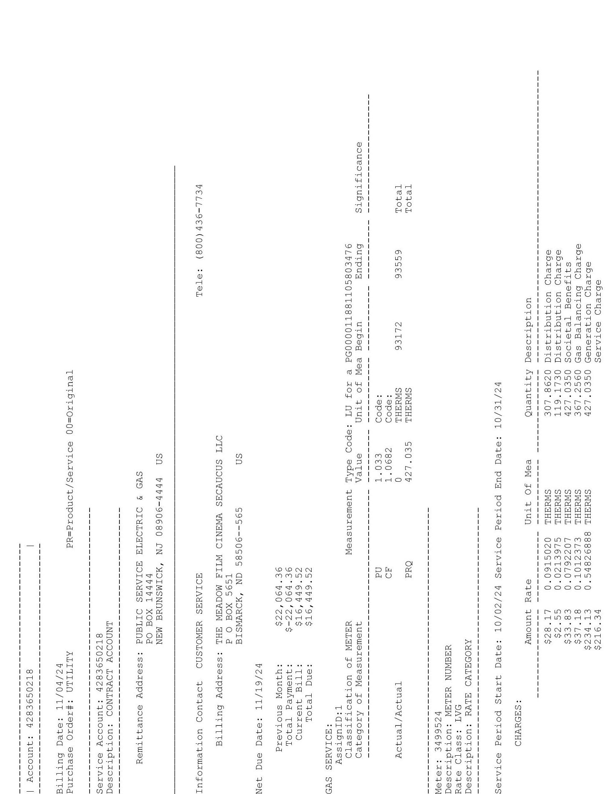
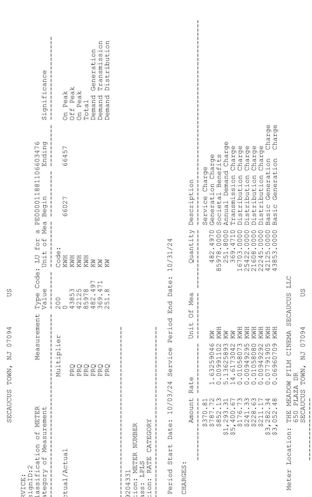

The image is a photo of a document, likely a utility bill. It contains structured text with various sections and data points. Key elements include:

- **Remittance Address:** PUBLIC SERVICE ELECTRIC & GAS, NEW BRUNSWICK, NJ 08906-4444 US
- **Customer Service:** THE MEADOW 14 CINEMA, SECAUCUS LLC, BISMARCK, ND 58506-565
- **Account Number:** 248650218
- **Billing Date:** 11/04/24
- **Service Period Start Date:** 10/02/24
- **Service Period End Date:** 10/31/24
- **Net Due Date:** 11/19/24
- **Total Due:** $1649.52
- **Charges:**
  - Distribution Charge: $97.82
  - System Control Charge: $7.38
  - Societal Benefits Charge: $21.05
  - Transition Charge: $7.05
  - Service Charge: $30.00
- **Measurement Type Code:** PU, CF, PRQ
- **Unit of Measurement:** CCF, THERMS
- **Quantity:** 310.7, 427.0
- **Amount Rate:** $0.15020, $0.31297, $0.24634

The document is organized with sections for billing information, charges, and measurement details. The text is aligned in columns and rows, typical of a billing statement.

The image is a photo of a document, likely an electricity bill or utility statement. It contains various sections with text organized in columns and rows. Key elements include:

- **Meter Information**: 
  - "METER NUMBER: 66027"
  - "RATE CATEGORY: PRQ"
  - "Period Start Date: 10/03/24"
  - "Service Period End Date: 10/31/24"

- **Charges**:
  - "Service Charge: $370.31"
  - "General Generation Charge: $87.12"
  - "On Peak Generation Charge: $24.16"
  - "Off Peak Generation Charge: $21.07"
  - "Annual Demand Charge: $216.73"
  - "Transmission Charge: $32.14"
  - "Distribution Charge: $252.14"
  - "Basic Generation Charge: $42.25"

- **Usage Details**:
  - "On Peak: 43853 KWH"
  - "Off Peak: 42578 KWH"
  - "Total: 86431 KWH"
  - "Demand Generation: 369.4 KW"
  - "Demand Transmission: 386.497 KW"
  - "Demand Distribution: 251.8 KW"

- **Location**:
  - "Meter Location: THE MEADOW FILM CINEMA SECAUCUS LLC"
  - "Address: 650 PLAZA DR, SECAUCUS TOWN, NJ 07094, US"

The text is aligned vertically and horizontally with dashed lines separating different sections.

