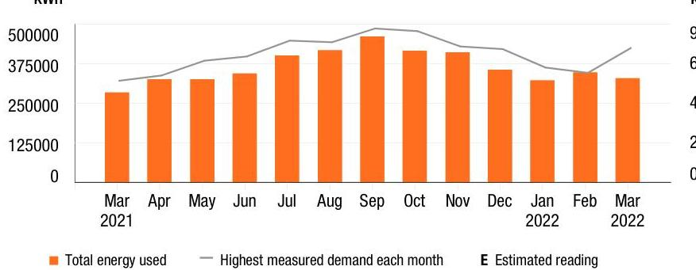

## Your energy bill

## Message Center

Smart meters are safe, and will provide our electric customers with many benefits. They use low power radio frequency (RF) that is generally far less than that used by everyday items like baby monitors, cell phones, microwaves, TVs and wireless routers. To learn more, go to pseg.com/smartmeters.

All PSE\&G employees carry identification cards with their picture on it. For your safety, ask to see the ID card of any PSE\&G employee visiting your home or business.

Get convenient, online access to your account and other valuable information. Sign up for My Account to view/pay bills, review usage history, report/track an outage, schedule a service appointment and more. Log in or register through My Account at pseg.com.

Put our tools to work for your business! For easy access to tips, programs and resources to help your business save time, energy and money, visit pseg.com/bizsavings.

## (3) NEXT METER READING March 31, 2022

## How to contact us

## 1-855-BIZ-PSEG (249-7734)

Customer Service: 8am to 5:30pm Mon to Fri,
Closed on weekends and holidays
Emergencies / Outages / WorryFree Services: 24/7
TTY for the hearing impaired: 1-800-225-0072
Visit pseg.com/myaccount to access your account anytime
Text us. Register for MyAlerts by texting REG to 4PSEG(47734)
$>$ Text OUT to report an outage.
facebook.com/pseg
twitter.com/psegdelivers

Bill date: March 16, 2022
For the period: February 01, 2022 to February 28, 2022

## - TRIS PHARMA INC

## ACCOUNT NUMBER

4226402200

## SERVICE ADDRESS

2033 ROUTE 130 BLDG B A-G
SOUTH BRUNSWICK TWP NJ 08852

## Your billing summary

Balance remaining from your last bill
PSE\&G balance from last bill
\$119,701.64
Loss Payment received - thank you!
\$119,701.64
Balance remaining from your last bill
This month's charges and credits
Electric charges - PSE\&G for 1 meter
This month's charges and credits
Total amount due by Mar 31, 2022
\$52,806.19
\$52,806.19

Page 1 of 4

## PSE\&G

We offer a variety of methods that make it easy to pay your bill. See reverse side for more information.

By checking this box, I authorize PSE\&G to initiate recurring ACH/Electronic Debits using the bank account number on the enclosed check.

By checking this box, I authorize PSE\&G to enroll me in paperless billing at this email address:

TRIS PHARMA INC
2033 RTE 130 STE D
MONMOUTH JUNCTION NJ 08852

Account number
Total amount due by Mar 31, 2022
\$52,806.19
Amount enclosed

PSE\&G CO
PO BOX 14444
NEW BRUNSWICK NJ 08906-4444

## Message Center (Continued from page 1)

Si desea recibir en español una notificación de desconexión del servicio, llame al 1-800-357-2262.

At PSE\&G, we make it our business to support your business. That's why we have a dedicated, toll-free phone number to address your energy questions and concerns. PSE\&G's Business Solutions Center is available Monday-Friday, 8:00 a.m. - 5:30 p.m. at 1-855-249-7734 (1-855-BIZ-PSEG).

## Don't miss your meter reading

If you'll be away on your meter reading day, use our mobile app to upload a picture of your meter or enter your reading manually, or call 1-800-622-0197.

## Electric \& Gas Rate Information

For news about PSE\&G's rate filing and upcoming public hearings visit www.pseg.com/pseandgfilings. Under applicable tax law, the State Sales and Use Tax and corporate business tax are imposed upon the energy you have used.

# IT'S YOUR BILL. HOW YOU PAY IS YOUR CHOICE. 

## 1.15 My Account

Make a payment anytime from a checking or savings account stored in My Account. Visit pseg.com/ myaccount

Mobile: Download our Mobile App "PSE\&G"

Pay by text: Text PAY to 4PSEG (47734)

Voice: Ask Alexa or use Google Assistant.

## Automatic Bill Pay

Automatic payments from your bank. Skip checks and stamps. Never worry about due dates.

## Enroll at:

pseg.com/autopay

## Credit Card

Pay your bill with a credit card online or by phone. Because we don't use customer rates to subsidize the cost of this service, there is a fee.

## My Account:

pseg.com/myaccount
Phone:
$1-888-575-6273$

Phone
Bank Account:
1-800-553-7734
Credit Card:
1-888-575-6273

## $=$ By Mail

Make your check payable to PSE\&G and write your account number on your check.

When you pay by check, you authorize PSE\&G to make a one-time electronic fund transfer from your account, in the amount of your check. If you prefer not to authorize us, call 1-800-436-PSEG.

## In Person

Payments are accepted at any customer service center or authorized location.

Locations can be found at: pseg.com/csc

Details of your electric charges
Your rate: Large Power \& Lighting Secondary (LPLS)

## Meter \# 9206728

## Usage

Reading Feb 28, 2022
On-Peak Actual
4828
Reading Feb 1, 2022
Less On-Peak Actual
3733
Multiplier
300
Total On kWh
151,777
Total Off kWh
176,659
Total kWh
328,436

## Delivery charges

Monthly service charge
$\$ 370.81$
Charges for delivering electric to you:
Annual Demand
Annual Demand
$749,500 \mathrm{~kW} \times \$ 3.785297$
The highest Measured Demand in any time period in the current month.
kWh - On-peak
$151,777 \mathrm{kWh} \times \$ 0.005407$
Energy consumed between 8am-10pm, Monday to Friday.
kWh - Off-peak
$176,659 \mathrm{kWh} \times \$ 0.005407$
Energy consumed outside peak hours.
Societal Benefits
$328,436 \mathrm{kWh} \times \$ 0.009621$
This charge recovers the cost of government mandated programs designed to achieve public policy goals, such as energy conservation.

Total electric delivery charges
$\$ 8,143.63$
Supply charges
BGS Capacity
Generation
Transmission
Cost of electric supplied by PSE\&G:
Charges
Total electric supply charges
Total electric charges
$\$ 52,806.19$

Your monthly electric use
kWh

The image is a bar and line chart.

- **Chart Type**: Combination of bar and line chart.
- **X-Axis**: Displays months from "Mar 2021" to "Mar 2022".
- **Y-Axis**: Labeled "kWh" with values ranging from 0 to 500,000.
- **Legend**:
  - Orange bars represent "Total energy used".
  - Gray line represents "Highest measured demand each month".
  - "E" indicates "Estimated reading".
- **Data Points**:
  - Bars show monthly energy usage, with the highest in September 2021 and a noticeable increase in March 2022.
  - The line shows the highest measured demand, peaking around September 2021.
- **Styling**: Orange bars for energy usage, gray line for demand, with estimated readings marked. 

This chart provides a **yearly usage breakdown (monthly-based)** of energy consumption and demand.

Visit MyAccount for more details regarding your energy usage.

## MEASURED DEMAND

On-Peak kW
749.50

Off-Peak2 kW
634.20

Measured Demand is the maximum use of electricity at any time during a monthly time period, as measured by your meter.

## BILLED DEMAND

Annual Demand kW
749.50

## SUPPLY CAPACITY

Generation kW
Transmission kW
765.791

Supply capacity is required to serve the system's annual peak usage. It represents your share of these facilities, in kilowatts (kW). It is calculated based on your peak usage from the previous summer. Supply capacity values are updated periodically throughout the year and are prorated based on your service period.

## Price to compare

If you want to consider getting your electric supply from another supplier, compare their price with ours. This month, your cost for energy supply is $\$ 44,662.56$. This price to compare varies month to month, depending on your usage.

Your PoD ID is: PE000012025094968332 Your PoD ID is your Point of Delivery identification within PSE\&G's system. You will need this number if you are considering enrolling with another supplier.

Payments

| Payment - Thank You | Feb 24, 2022 | -$70,837.21 |
| :-- | --: | --: |
| Payment - Thank You | Feb 10, 2022 | -$48,864.43 |
| Total payments | $119,701.64 CR |  |

