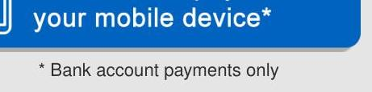
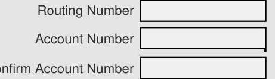
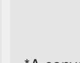
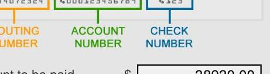
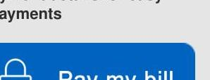
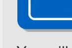
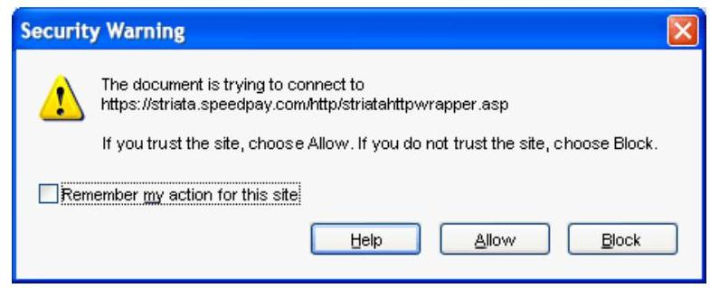
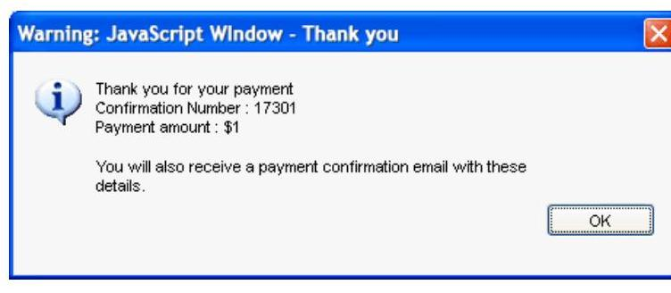
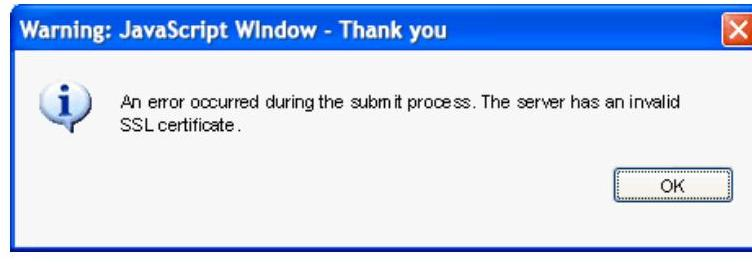

nationalgrid

## Bank Account / Electronic Check

The image is a photo or illustration. It contains a section of text at the bottom of a larger image or webpage. The text reads: "* Bank account payments only". The text is positioned beneath a blue section that is partially visible, suggesting it might be a footer or a note related to the content above it.

* Bank account payments only

The image is a photo or illustration showing a section of a form with three labeled input fields. The labels are:

- Routing Number
- Account Number
- Confirm Account Number

Each label is followed by a blank rectangular input box, indicating where users can enter the respective information. The layout is vertical, with each label directly above its corresponding input box.

| YOUR NAME | 1234 Main Street |
| :-- | :-- |
| Anywhere, OH 0000 |  |
| PAY TO THE |  |
| ORDER OF |  |

The image is a photo or illustration showing a partial view of a document or webpage. The visible text reads: "*A convenience fee will apply". The text is positioned at the bottom of the image, suggesting it might be a footnote or disclaimer related to the content above it. The background is light gray.

DOLLARS

The image is a photo or illustration showing a section of a check or a form related to bank account details. It includes three labeled sections:

- "ROUTING NUMBER" in orange
- "ACCOUNT NUMBER" in green
- "CHECK NUMBER" in blue

Each label is positioned above a rectangular box that likely contains or is meant to contain the respective numbers. The layout is horizontal, with each label directly above its corresponding box.

Amount to be paid
$\$ 38930.00$
Payment date 11
$\square$
Upon payment you will be presented and emailed a payment confirmation.

Save payment details for easy future payments

The image is a photo or illustration showing a partial view of a webpage or application interface. It features a blue button with the text "Pay my bill" visible. Above the button, there is a partial icon of a lock, suggesting a secure payment option. The background is light gray, and the button is positioned towards the bottom right of the visible area.

By clicking on the Pay my bill button, you are agreeing to the Terms and Conditions

## Credit / Debit Card

The image is a photo or illustration showing a close-up of a webpage or application interface. It features a blue rectangular element with a white border, likely part of a button or a highlighted section. The background is light gray. The visible portion of text at the bottom reads: "You will". The layout suggests this is part of a larger interactive element, possibly related to payment options.

Click here to pay with a credit/debit card

You will be redirected to the service site for Speedpay®, an ACI Worldwide Company, to pay with a debit or credit card on any device.
*A convenience fee will apply

## Other Payment Options

## Automated Payments

## Never miss another payment!

Enroll in Automated Payments to have your full bill amount automatically deducted from your bank account. That's one less thing to remember next month!

www.nationalgridus.com
C \& I BUSINESS TEAM M-F 8-5
1-800-664-6729
GAS EMERGENCIES
1-800-892-2345
(Does not replace 911 emergency medical service)

OUTAGE AND ELECTRIC EMERGENCIES
1-800-867-5222
CORRESPONDENCE ADDRESS
300 Erie Blvd West
Syracuse, NY 13202
DATE BILL ISSUED
Sep 30, 2020

## Enrollment Information

To enroll with a supplier or change to another supplier, you will need the following information about your account:

Acct No: 13199-37142 Cycle: 2, HUDS

## ACCOUNT BALANCE

Previous Balance
0.00

Payment Received No payments have been received during this billing period - 0.00
Current Charges
$+38,930.00$
Amount Due
\$38,930.00
A deposit is required to establish service for your new address. For your convenience, we have billed the deposit for this account.

## SUMMARY OF CURRENT CHARGES

DELIVERY SERVICES

SUPPLY SERVICES

SERVICES

OTHER CHARGES: ADJUSTMENTS

TOTAL
38,930.00
38,930.00
Total Current Charges $\$ 0.00$
\$ 38,930.00
\$ 38,930.00
We are restarting normal business operations and our gradual return to normal operations also means that we will be resuming collections activities for business customers in the next few weeks. Beginning October 7, business customers will begin receiving disconnection notices for nonpayment. If you need payment help, call us at 1-800-443-1837 or visit ngrid.com/moretime. Eligible customers may sign-up for a COVID-19 payment plan that will protect your account from possible service disconnection

Tougher Penalties Help Protect Utility Workers: New York State has new laws in place to help better protect our field workers who face a number of challenges. Now, any action by a member of the public that prevents a utility worker from performing their job, or causes the worker physical injury, is considered a felony.

Payment concerns? We are here to help. To learn about solutions to help you take control of your energy use and bills, visit www.ngrid.com/billhelp.

KEEP THIS PORTION FOR YOUR RECORDS.
RETURN THIS PORTION WITH YOUR PAYMENT.

| ACCOUNT NUMBER | PLEASE RIV. 02 | AMOUNT DUE |
| :-- | :-- | :-- |
| 13199-37142 | Oct 24, 2020 | $\$ 38,930.00$ |

300 Erie Blvd West
Syracuse NY 13202-0960

HUDSON DATA CENTER
2140 COUNTY ROUTE 1, ELEC
OSWEGO NY 13126

055725

ENTER AMOUNT ENCLOSED
\$
Write account number on check and make payable to National Grid

NATIONAL GRID
PO BOX 11742
NEWARK NJ 07101-4742

| SERVICE FOR | BILLING PERIOD |  | PAGE 2 of 3 |
| :--: | :--: | :--: | :--: |
| HUDSON DATA CENTER | to Sep 30, 2020 |  |  |
| 2140 COUNTY ROUTE 1, ELEC | ACCOUNT NUMBER | 214002140 |  |
| OSWEGO NY 13126 | 13199-37142 | Oct 24, 2020 | \$ 38,930.00 |

# DETAIL OF CURRENT CHARGES 

## Other Charges/Adjustments

| Deposit | 38,930.00 |
| :-- | --: |
| Total Other Charges/Adjustments | $\mathbf{\$ 3 8 , 9 3 0 . 0 0}$ |

## www.nationalgridus.com

## For Your Information

We want you to easily understand your bill, the terms we use and the charges that appear. Following is a brief explanation of items that appear on your bill, as well as payment programs and billing services we offer. If you have questions or want more detailed explanations, please visit our website at www.nationalgrid.com or call 1-800-642-4272.
Paying Your Bill/
Payment Options

- DirectPay: If you choose, National Grid will automatically withdraw your monthly bill payment from your checking or savings account. You will avoid the inconvenience of check writing, stamps, mailing and due dates. Your service bill will indicate your energy usage and the date of your next automatic withdrawal.
- By Mail: Send us your payment in the envelope provided with your bill. For your protection, please do not send cash. Put your 10-digit account number on your check or money order and include your bill stub. Please do not staple or paper clip your check to the stub.
- In Person: Pay at an authorized payment location by cash or check. Please bring your bill with you. Most locations charge a fee for providing this service. For the payment locations nearest you, visit our website or contact us.
- Online: Enroll online to receive and pay your bill online. The online function will begin with the next billing cycle following your enrolment.
- Late Payment Charge: To avoid Late Payment Charges, your payment must be received by the date shown on the front of the bill.

## Billing Credits

## Paperless Billing Credit: A credit

provided to Customers who elect to receive their bills electronically through the Company's Online Bill-Pay Program.
Outage Credit : A credit issued by the company in case of a prolonged electric service outage.

## Charges

Charges for electric or gas service are based on rates or prices approved by the New York State Public Service Commission (PSC). When changes in prices are approved by the PSC, information will be included with your bill. Complete price schedules are available on our website or by contacting us. National Grid reserves the right to upwardly adjust a previously issued bill or back bill.
Basic Service: A charge to cover costs for meter reading, billing, equipment and maintenance. This charge is the same regardless of how much energy is used during the billing period.
Tariff Surcharge: New York State and many local municipalities impose taxes on National Grid's revenue. These operating costs are recovered through a tariff surcharge applied to all rates and charges and may vary among taxing municipalities within the National Grid system area.
Sales Tax: In some areas National Grid is required to collect state and local sales taxes. Some school districts also impose taxes.
Merchant Function Charge: A charge for the Company's cost to procure gas or electricity supply. The Company will not bill you this charge if you choose an alternate supplier.

## Energy Measurement Terms

kWh: The unit of electricity usage measured by your meter. One kilowatt-hour(kWh) is 1000 watts-hours, and will light a 100-watt bulb for 10 hours. The number of kWhs is used to determine the electricity charges on your bill.
Meter Multiplier: Due to their design, some meters record a fraction of the total usage. The multiplier is used to convert the recorded meter reading on these types of meters to total actual consumption. CCF: The unit of gas volume ( 100 cubic feet) as measured by your meter.
Therm: A unit of heat content equal to 100,000 British Thermal Units (BTU). A BTU represents the amount of heat required to raise the temperature of one pound of water by one degree Fahrenheit. The number of CCFs is multiplied by a conversion factor to determine the therms used. The number of therms is used to determine the gas charges on your bill.

## Electric Service

Delivery: National Grid's charges for bringing electricity from your supplier to your premise, regardless of supplier. Included, when applicable, are the following surcharges: Earnings Adjustment Mechanism, Dynamic Load Management, Non-Wires Alternative, Clean Energy Standard Delivery, Value of Delivery Energy Resources and Reliability Services Surcharge.
Legacy Transition Charge (LTC): All delivery service customers are billed the cost or benefit of electricity supply contracts the Company entered prior to June 1, 2001. Residential customers also receive the benefit of low cost hydropower and a discount payment from the New York Power Authority
Capacity Tag: Your adjusted electricity demand at the hour of the New York Control Area peak load in the most recent 12 month period ending May 1.

SBC: These charges reflect costs associated with mandated public policy programs, such as Clean Energy Fund.
Revenue Decoupling Mechanism ("RDM") : Reconciles actual billed delivery service revenues to annual target revenues. Delivery service revenues above target are refunded to customers. Target revenues above actual delivery service revenues are collected from customers.
Transmission Revenue Adjustment: Reconciles wholesale transmission service revenue to the forecasted transmission service revenue embedded in electric delivery rates. Transmission service revenues above those forecasted are credited to customers. Forecast revenues above actual revenues are collected from customers.
Electricity Supply: The price of electricity supply used during the billing period. If you choose an alternate supplier, the price will be what you agree upon with that supplier.
Electricity Supply Reconciliation Mechanism (ESRM): Reconciles National Grid's electricity supply service revenues to the cost of Company purchased electricity, including Clean Energy Standard costs. Costs above revenues are recovered from customers. Revenues above costs are credited to customers. SBC Exemption: A credit provided to Customers who are not subject to the SBC.

## Gas Service

National Grid Gas Delivery Service Charge: National Grid's charges for transporting gas across its distribution system to your premise, regardless of supplier.
Adjustment for changes from normal weather: A mechanism that adjusts customers' gas bills due to variations from normal weather during the heating months, October through May.
System Benefits Charge: A charge to reflect costs associated with certain mandated public policy programs, such as Clean Energy Fund.
Gas Supply: A charge to reflect the Company's actual cost to purchase gas from suppliers and transporting the gas to the Company's distribution system. If you choose an alternate supplier, the price will be what you agree upon with that supplier. Delivery Service Adjustment:
A collection of surcharges and credits consisting of a Pipeline Refund, Net Revenue Sharing Adjustment, Research \& Development Surcharge, Revenue Decoupling Mechanism ,Adjustment Gas Safety and Reliability Surcharge and Earnings Adjustment Mechanism.

## Estimating Your Usage

When we are unable to obtain a reading, we estimate your usage based on your past usage, taking current weather conditions into account. Because our meters keep a continuous record of usage, any difference between estimated and actual usage is reconciled with the next meter reading. To avoid estimated readings, you can take your own reading on or just before the scheduled date shown on your bill and call it in at 1-888-932-0301.
For more information, visit us at: www.nationalgrid .com or call 1-800-642-4272. Customers with problems paying their National Grid bill should call 1-800-443-1837.

# 5 PAYMENT INSTRUCTIONS 

## 6

SECURITY

## 2

PAYMENT FAQs

## PAYMENT INSTRUCTIONS

1. Enter account details for your selected payment type.
2. Confirm payment details at the bottom of the form.
3. Click the Submit this payment button.
4. Click OK to submit payment.
5. Select Allow when you see the security pop-up.
6. You will receive both onscreen and e-mail payment confirmations.

The image is a screenshot of a security warning dialog box. 

- **Title:** Security Warning
- **Warning Message:** "The document is trying to connect to https://striata.speedpay.com/http/striatahttpwrapper.asp"
- **Instructions:** "If you trust the site, choose Allow. If you do not trust the site, choose Block."
- **Checkbox Option:** "Remember my action for this site"
- **Buttons:** 
  - Help
  - Allow
  - Block

The warning icon is a yellow triangle with an exclamation mark. The checkbox is located below the warning message, and the buttons are aligned horizontally at the bottom.

Adobe will verify that you are about to connect to the Internet when submitting a payment to Speedpay. Click the "Allow" button when you see the warning above. Note: If you do not wish to see this warning again select the check box "Remember my action for the site ...."

Example of an onscreen confirmation.

## Back to Top

## SECURITY

## PAYMENT SECURITY

Payments from this Paperless Bill are submitted securely to a bank accredited payment processor using the same 128 bit SSL connection as online payment ( $\triangle$ HTTPS). As this payment is paid directly from your encrypted PDF (and not on a web site), it is significantly more secure.
Payments are processed by accredited and audited payment providers.

- NACHA - The Electronic Payments Association is the leading organization in developing electronic solutions to improve the payments system.

## PAPERLESS BILL DOCUMENT SECURITY

The PDF that contains this payment form has been encrypted. Encryption is of the highest 'banking-industry' standard. Your secure PDF is being viewed offline (locally on your computer) and the information is not accessible over the Internet. It is only available on your computer when you open the secure document using the first five digits of your service address ZIP code. This information is only held locally on your machine for as long as you have the document open.

## Back to Top

# SYSTEM REQUIREMENTS 

## FOR MAC USERS

Payment requires Adobe Reader Version 7 or above. (Download now). You cannot use your Mac Preview.

Complete these steps to open your secure PDF in Adobe Reader:

1. Open the e-mail that contains the attachment.
2. Save the attachment to your hard disk.
3. Open Adobe Reader and select File - Open... .
4. In the screen that pops up, select the saved PDF from the location where you saved it.

## Back to Top

## ADOBE READER

Payment requires Adobe Reader Version 7 or above. Click here to download.

Q: What is the proper way to open my Paperless Bill PDF so it offers me full functionality?
A: PC Users - click to download the attachment and open with Adobe Reader.

MAC Users - save the PDF to your computer, right click and select "Open with Adobe Reader".

Google Chrome Users - Return to your email and click "download". When presented with a document link at the bottom of the browser, click on the arrow and select "Open with System Viewer".

Q: How do I know if my payment went through?
A: When the process is complete and you have selected "Submit this payment", the payment is processed and you will receive an immediate pop-up window that looks like the following:

The image is a screenshot of a pop-up window with the following text:

"Warning: JavaScript Window - Thank you

Thank you for your payment
Confirmation Number: 17301
Payment amount: $1

You will also receive a payment confirmation email with these details."

There is an "OK" button at the bottom right of the window. The window has a blue title bar with a close button on the top right.

You will also receive a payment confirmation e-mail with relevant payment details and confirmation number. It may take up to two business days for your account to reflect the payment.
Q: What if I see the below error when attempting to submit payment?

The image is a screenshot of a pop-up window with the following text:

"Warning: JavaScript Window - Thank you

An error occurred during the submit process. The server has an invalid SSL certificate."

There is an "OK" button at the bottom right of the window. The window has a blue title bar with a close button on the top right.

A: Following a recent security upgrade, PDF payments are no longer compatible with some older operating systems and browsers. If you are using Windows XP, Windows Vista or Mac OS 10.9.5, you can still make a payment here as long as you use one of the supported browsers below:

Internet Explorer 11+
Chrome 30+
Safari 7+
Firefox 27+
Microsoft Edge
Back to Top

Q: I don't think my payment went through. Who should I contact?
A: If you have any questions about your payment, please use Contact us from the e-mail.

Q: What does the "Save payment details" option do?
A: "Save payment details" will remember your partial payment information, so next time you receive a secure PDF, the information will be pre-populated. When you select this option, instead of re-entering the information each time, you just click the "Submit this payment" button.

## Q: Why should I do this?

A: By clicking on the checkbox, this payment method will automatically be saved. This eliminates the need to enter your payment method details again, making future online payments using this method easier and faster.

Q: Can I pay with a different account/payment method once my details have been remembered?
A: Yes, simply type over the pre-populated information with your new banking details or select a new payment option and complete the relevant details. If you select the "Save payment details" again, the new banking information will be stored once you click "Submit this payment" and successfully make a payment.

Q: How do I prevent the secure PDF from saving my payment information?
A: Uncheck the "Save payment details" box, and the system will not save your details. Once you click "Submit this payment" and successfully make a payment, your details will not be stored for future use.

Q: How do I permanently remove previously saved payment details?
A: Contact a customer service representative to have your payment details removed from the system.

