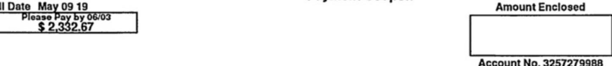

## Birling and Payment Summary

| Account \# 3257279988 | Due Date: Jun 03, 2019 |
| :--: | :--: |
| Total Amount Due: |  |
| To avoid a Late Payment Charge of 1.5\% please pay by Jun 03, 2019. |  |
| Previous Amount Due: | \$ 1,655.27 |
| Payments as of May 09: | \$ 1,655.27 CR |

For service emergencies and power outages please call 1-866-DOM-HELP (1-866-366-4357): Visit us at www.dominionenergy.com.

| Meter and Usage | Usage History |  |  |
| :--: | :--: | :--: | :--: |
| Current Billing Days: 32 |  |  |  |
|  | Mo | $\mathrm{Y}_{1}$ | kWh |
|  | May | 18 | 18240 |
| Billinge Usage | Jun | 18 | 25040 |
| Schedule GS-2 | 04/05-05/07 | Jul | 18 | 31680 |
| Total kWh | 23120 | Aug | 18 | 30800 |
| Demand | 65.0 | Sep | 18 | 31120 |
|  |  | Oct | 18 | 26480 |
| Measured Usage |  | Nov | 18 | 19600 |
| Meter: 0005215176 | 04/05-05/07 | Dec | 18 | 20000 |
| Current Reading | 41491 | Jan | 19 | 20720 |
| Previous Reading | 41202 | Feb | 19 | 18560 |
| Total kWh | 23120 | Mar | 19 | 18080 |
| Current Reading | .82 | Apr | 19 | 17360 |
| Demand | 65.60 | May | 19 | 23120 |

## Explanation of Bill Detall

| Customer Service | 1-866-DOM-HELP (1-866-366-4357) |
| :--: | :--: |
| Previous Balance | 1,655.27 |
| Payment Received | 1,655.27 CR |
| Balance Forward | 0.00 |
| Non-Residential Service (Schedule GS-2) 04/05-05/07 |  |
| Distribution Service |  |
| Basic Customer Charge | 21.22 |
| Distribution Service kWh | 1.73 |
| Dist Serv Demand Charge | 220.69 |
| All Applicable Distribution Riders | 34.59 |
| Electricity Supply Svc (ESS) |  |
| Electricity Supply kWh | 731.90 |
| Demand Charge | 44.58 |
| Transmission Demand Chg | 136.66 |
| Fuel | 624.24 |
| All Other Applicable ESS Riders | 302.60 |
| Sales and Use Surcharge | 10.64 |
| State/Local Consumption Tax | 23.80 |
| SUFFOLK Utility Tax | 180.02 |
| Total Current Charges | 2,332.67 |
| Total Account Balance | 2,332.67 |
| View payment options, request service changes and enroll in eBill at www.dominionenergy.com, search: Manage Your Account |  |

Important Customer Information from Dominion Energy Virginia
Help a family in need through EnergyShare - add $\$ 1,2,5,10,20,25$ or 35 to your payment. Overpayments in these exact amounts are automatically recognized as a contribution to EnergyShare. You may also mail a separate check for any amount payable to EnergyShare to P.O. Box 91717, Richmond,VA 23291-1717.

Use energy wisely - your next bill will be on summer rates.

# Mailed on May 10, 2019 

Please dunch and return this payment coupon with your check made payable to Dominion Energy Virginia. Please see reverse side for mailing address change instructions.

## Payment Coupon

The image is a photo of a payment coupon section from a bill. It contains the following text:

- "Bill Date May 09 19"
- "Please Pay by 06/03"
- "$2,332.67"
- "Amount Enclosed"
- "Account No. 3257279988"

The layout shows the bill date and payment due date on the left, with the amount due prominently displayed below. The right side has a blank space for the amount enclosed and the account number below it.

## 0291221 AV 0.380 T\#000095

## TACCO PLAZA AZTECA SUFFOLK INC

$0292 \times 1467 \mathrm{~N}$ MAIN ST SUFFOLK VA 23434 - 4352

SUFFOLK VA 23434-4352

Sand Payment to:

DOMINION ENERGY VIRGINIA
P 0 BOX 24543
RICHMOND VA 23290-0001
llllllllllllllllllllllllllllllllllllllllllllllllllllllllllllllllllllllllllllllllllllllllllllllllllllllllllllllllllllllllllllllllllllllllllllllllllllllllllllllllllllllllllllllllllllllllllllllllllllllllllllllllllllllllllllllllllllllllllllllllllllllllllllllllllllllllllllllllllllllllllllllllllllllllllllllllllllllllllllllllllllllllllllllllllllllllllllllllllllllllllllllllllllllllllllllllllllllllllllllll

