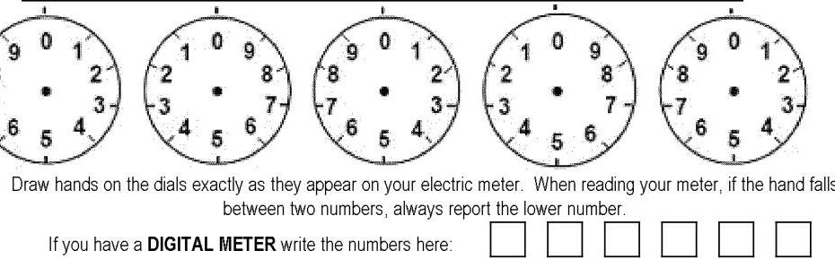

Billing Period: Feb 10 to Mar 13, 2023 for 32 days
Bill Fxr:
TRAF-PAR CORPORATION
BL003
4101 READING CREST AVE
READING PA 19605

| To report an emergency or an outage, call 24 hours a day 1.488.544-4877. |  |  |  |  |  |  |  |  |  |  |  |  |  |  |
| :--: | :--: | :--: | :--: | :--: | :--: | :--: | :--: | :--: | :--: | :--: | :--: | :--: | :--: |
| Bill Issued by: Met-Ed, PO Box 16001, Reading PA 19612-6001 |  |  |  |  |  |  |  |  |  |  |  |  |  |  |
| To enroll in eBill or pay your bill online, scan the QR code on the right of this bill from your mobile device or go to www.frcelerergycorp.com. |  |  |  |  |  |  |  |  |  |  |  |  |  |  |
| For Customer Service, call 1.800.045-7741. For Payment Options, call 1.800.962-4848. |  |  |  |  |  |  |  |  |  |  |  |  |  |  |
|  | Shopping Information |  |  |  | Account Summary |  |  |  | Amount |  |  |  | Amount |  |
| Customer Number | Rate Category |  |  | Previous Balance |  |  |  | 13,642 |  |  |  |  |  |
| 0603816046-0006241017 | General Service Primary ME-GPP |  |  | Payments/Adjustments |  |  |  | Balance at Billing on Mar 16, 2023 |  |  |  | 8.88 |  |
|  | Messages |  |  | Balance at Billing on Mar 16, 2023 |  |  |  |  |  |  |  |  |  |  |
| To avoid a 2.00\%. Late Payment Charge being added to your bill please pay the Amount Due by the Due Date. |  |  |  |  |  |  |  |  |  |  |  |  |  |  |
| To receive your PRICE TO COMPARE please call 1.488-478-2306. Customer reserves the right to shop for an electric supplier. |  |  |  |  |  |  |  |  |  |  |  |  |  |  |
| Your next meter reading is scheduled to occur on or about Apr 12, 2023. |  |  |  |  |  |  |  |  |  |  |  |  |  |  |
| Your bill includes $1.251.10 in PA taxes, of which $1.004.28 is PA gross receipts tax. |  |  |  |  |  |  |  |  |  |  |  |  |  |  |
| Generation prices and charges are set by the electric generation supplier you have chosen. The Public Utilities Commission regulates distribution prices and services. The Federal Energy Regulatory Commission regulates transmission prices and services. |  |  |  |  |  |  |  |  |  |  |  |  |  |  |
| Customers receiving Default Service have a new Price to Compare (PTC), effective March 1, 2023. Please review the PTC information shown on page one of your bill. You can save money by switching to an electric generation supplier that offers a lower price than your PTC. |  |  |  |  |  |  |  |  |  |  |  |  |  |  |
|  |  |  |  |  |  |  |  |  |  |  |  |  |  |  |

Additional messages, if any, can be found on back.

| Usage History |  |  |  |  |  |  |  |  |  |  |  |  |  |  |
| :--: | :--: | :--: | :--: | :--: | :--: | :--: | :--: | :--: | :--: | :--: | :--: | :--: | :--: | :--: |
| 600000 |  |  |  |  |  |  |  |  |  |  |  |  |  |  |
| 500000 |  |  |  |  |  |  |  |  |  |  |  |  |  |  |
| 400000 |  |  |  |  |  |  |  |  |  |  |  |  |  |  |
| 300000 |  |  |  |  |  |  |  |  |  |  |  |  |  |  |
| 200000 |  |  |  |  |  |  |  |  |  |  |  |  |  |  |
| 100000 |  |  |  |  |  |  |  |  |  |  |  |  |  |  |
|  |  |  |  |  |  |  |  |  |  |  |  |  |  |  |
| On/Poet-Load in KWIKVA |  |  |  |  |  |  |  |  |  |  |  |  |  |  |
| Off-reak Load in KWIKVA |  |  |  |  |  |  |  |  |  |  |  |  |  |  |
| OnPeak KVAR |  |  |  |  |  |  |  |  |  |  |  |  |  |  |
| OffPeak KVAR |  |  |  |  |  |  |  |  |  |  |  |  |  |  |
| (Mied Load in KWIKVA |  |  |  |  |  |  |  |  |  |  |  |  |  |  |
|  |  |  |  |  |  |  |  |  |  |  |  |  |  |  |
|  |  |  |  |  |  |  |  |  |  |  |  |  |  |  |
|  |  |  |  |  |  |  |  |  |  |  |  |  |  |  |
|  |  |  |  |  |  |  |  |  |  |  |  |  |  |  |
| Changes From Met-Ed |  |  |  |  |  |  |  |  |  |  |  |  |  |  |
| When contacting an Electric Generation Supplier, please provide the following Customer Number: 0600818046 0006241017 |  |  |  |  |  |  |  |  |  |  |  |  |  |  |
|  |  |  |  |  |  |  |  |  |  |  |  |  |  |  |
| Rate: General Service Primary ME-GPP |  |  |  |  |  |  |  |  |  |  |  |  |  |  |
| Hourly Pricing Service Charge | 267.122 KWH |  |  | $\times 0.048942$ |  |  |  |  |  |  |  |  |  |  |
| Customer Charge |  |  |  |  |  |  |  |  |  |  |  |  |  |  |
| Distribution System Improvement Charge |  |  |  |  |  |  |  |  |  |  |  |  |  |  |
| Distribution Charge | 844.2 KW |  |  | $\times 2.980000$ |  |  |  |  |  |  |  |  |  |  |
|  | 216.9 KVAR |  |  | $\times 0.200000$ |  |  |  |  |  |  |  |  |  |  |
| Energy Efficiency Charge Phase IV | 866.3 KW |  |  | $\times 0.080000$ |  |  |  |  |  |  |  |  |  |  |
| Solar Requirements Charge | 267.122 KWH |  |  | $\times 0.000280$ |  |  |  |  |  |  |  |  |  |  |
|  |  |  |  |  |  |  |  |  |  |  |  |  |  |  |
| Default Service Support Charge | 690.2 KW |  |  | $\times 0.764000$ |  |  |  |  |  |  |  |  |  |  |
| TCJA Voluntary Surcharge |  |  |  |  |  |  |  |  |  |  |  |  |  |  |
| State Sales Tax |  |  |  |  |  |  |  |  |  |  |  |  |  |  |
| Current Consumption Bill Charges |  |  |  |  |  |  |  |  |  |  |  |  |  | 17,831.94 |
|  | Detail Payment and Adjustment Information |  |  |  |  |  |  |  |  |  |  |  |  |  |
| 0301023 | Payment |  |  |  |  |  |  |  |  |  |  |  |  | 13,642.16 |

Additional messages, if any, can be found on back.

| Usage History |  |  |  |  |  |  |  |  |  |  |  |  |  |  |
| :--: | :--: | :--: | :--: | :--: | :--: | :--: | :--: | :--: | :--: | :--: | :--: | :--: | :--: |
| 600000 |  |  |  |  |  |  |  |  |  |  |  |  |  |  |
| 500000 |  |  |  |  |  |  |  |  |  |  |  |  |  |  |
| 400000 |  |  |  |  |  |  |  |  |  |  |  |  |  |  |
| 300000 |  |  |  |  |  |  |  |  |  |  |  |  |  |  |
| 200000 |  |  |  |  |  |  |  |  |  |  |  |  |  |  |
| 100000 |  |  |  |  |  |  |  |  |  |  |  |  |  |  |
|  |  |  |  |  |  |  |  |  |  |  |  |  |  |  |
|  |  |  |  |  |  |  |  |  |  |  |  |  |  |  |
|  |  |  |  |  |  |  |  |  |  |  |  |  |  |  |
|  |  |  |  |  |  |  |  |  |  |  |  |  |  |  |
|  |  |  |  |  |  |  |  |  |  |  |  |  |  |  |
|  |  |  |  |  |  |  |  |  |  |  |  |  |  |  |
|  |  |  |  |  |  |  |  |  |  |  |  |  |  |  |
|  |  |  |  |  |  |  |  |  |  |  |  |  |  |  |
|  |  |  |  |  |  |  |  |  |  |  |  |  |  |  |
|  |  |  |  |  |  |  |  |  |  |  |  |  |  |  |
|  |  |  |  |  |  |  |  |  |  |  |  |  |  |  |
|  |  |  |  |  |  |  |  |  |  |  |  |  |  |  |
|  |  |  |  |  |  |  |  |  |  |  |  |  |  |  |
|  |  |  |  |  |  |  |  |  |  |  |  |  |  |  |
|  |  |  |  |  |  |  |  |  |  |  |  |  |  |  |
|  |  |  |  |  |  |  |  |  |  |  |  |  |  |  |
|  |  |  |  |  |  |  |  |  |  |  |  |  |  |  |
|  |  |  |  |  |  |  |  |  |  |  |  |  |  |  |
|  |  |  |  |  |  |  |  |  |  |  |  |  |  |  |
|  |  |  |  |  |  |  |  |  |  |  |  |  |  |  |
|  |  |  |  |  |  |  |  |  |  |  |  |  |  |  |
|  |  |  |  |  |  |  |  |  |  |  |  |  |  |  |
|  |  |  |  |  |  |  |  |  |  |  |  |  |  |  |
|  |  |  |  |  |  |  |  |  |  |  |  |  |  |  |
|  |  |  |  |  |  |  |  |  |  |  |  |  |  |  |
|  |  |  |  |  |  |  |  |  |  |  |  |  |  |  |
|  |  |  |  |  |  |  |  |  |  |  |  |  |  |  |
|  |  |  |  |  |  |  |  |  |  |  |  |  |  |  |
|  |  |  |  |  |  |  |  |  |  |  |  |  |  |  |
|  |  |  |  |  |  |  |  |  |  |  |  |  |  |  |
|  |  |  |  |  |  |  |  |  |  |  |  |  |  |  |

# Explanation of Terms 

Customer Charge - Monthly charge that offsets costs for billing, meter reading, equipment, service line maintenance, and assessing and deploying Smart Meter Technology.
Default Service Support Charge - Charge to recover new and deferred costs associated with serving customers in a competitive market.
Distribution Charge - Charge for the use of local wies, transformers, substations and other equipment used to deliver electricity to consumers from high-voltage transmission lines.
Distribution System Improvement Charge - This charge recovers costs incurred to repair, improve or replace infrastructure that the Company uses to deliver electricity to its customers.
Estimated Reading - On the months we do not read a meter, we calculate the bill based on paid electrical usage.
Energy Efficiency Charge(s) - Charge to fund the utility's programs designed to reduce customers' annual electric use and peak demand for electricity mandated by Act 129 of 2008.
Hourly Pricing Service Charge - Charge to provide energy, capacity, compliance with Alternative Energy Portfolio Standards, transmission and ancillary services for industrial customers receiving Default Service

KRH (Kilowatt Hour) - A unit of measure for electricity usage equal to 1,000 watts used for low hour.
Late Payment Charge - A charge added to the bill on balances owed after the Univ. Deir.
Price to Company (PTC) - Price per kilowatt hour to be used when comparing to the price of a generation supplier.
Price to Company Default Service - Charge for costs to provide energy, capacity, compliance with Alternative Energy Portfolio Standards, transmission and ancillary services for customers receiving Default Service.
Prorated Reading - Reading calculated by multiplying the daily average electric usage between two recent readings by the number of days in the billing period.
Service Charge - Charge for opening an account.
Solar Requirements Charge - Charge to acquire Solar Photovoltaic Alternative Energy Chattis in comply with the Alternative Energy Portfolio Standards Act.
State Tax Surcharge - An adjustment to the state taxes recovered through Met-Ed's basic charges.
TCJA Voluntary Surcharge - This surcharge adjusts customer rates for the reduction to corporate federal income tax under the Tax Cuts and Jobs Act.

## General Information

If you have billing questions or complaints about your Met Ed account, please contact us before the due date.
Call Customer Service at 1-800-545-7741 Monday-Finday, from 8 a.m. - 6 p.m. Our representatives can answer your questions, describe the charges on your bill, explain how to make sure your bill is correct, and provide information on rate schedules and energy efficiency.
Call Payment Options at 1-800-962-4948 Monday-Finday, from 8 a.m. - 6 p.m.
Visit our website at www.frotenergycop.com
Write to us at Met-Ed, 76 S. Main St., A-RPC, Akron, OH 44308-1890
Customers with hearing or speech impairments can contact the Telecommunications Relay Service (TRS) at 711.

For your protection, all of our employees wear Photo I.D. badges.
Electronic Check Conversion - Your check authorizes us either to make a one-time electronic funds transfer (EFT) from your account or process as a check. If you have questions about this program, call 1-866-283-8081.

To provide a customer meter reading, use the dais provided and enter the reading on-line at www.frotenergycop.com/aboutyoursubill or by calling 1-800-545-7741. Say "Meter Reading" when asked "Which of these can I help you with today?" Have the date you took the reading available. If this is to avoid a scheduled estimate, please check the front of the bill for entry dates.

## Provide reading by telephone or on-line only: DO NOT MAIL

The image is an illustration showing five analog meter dials, each numbered from 0 to 9. Below the dials, there is a set of five empty boxes for entering numbers from a digital meter. The text instructs users to "Draw hands on the dials exactly as they appear on your electric meter. When reading your meter, if the hand falls between two numbers, always report the lower number." It also states, "If you have a DIGITAL METER write the numbers here:" followed by the empty boxes.

Draw hands on the dais exactly as they appear on your electric meter. When reading your meter, if the hand fails between two numbers, always report the lower number.
If you have a DGITAL METER write the numbers here:

