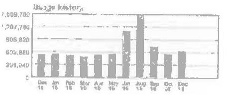

Hudson Energy Services, LLC
P.O. Box 142109

Iving, TX 76014
PUC License \#: Gas-
12-271G(2) Electric
$-12-538 \mathrm{E}(3)$

Questions or Comments
HudsonEnergyCare@hudsonenergy.net
Q www.HudsonEnergy.net

## 655-373-1622

Mon - Fri: 9:00 am - 5:30 pm Central
Emergencies and Power Cutages Call: ComEd 1-800-334-7661

The amount billed may include price changes allowed by law or regulatory action.

The image is a bar chart.

- **Chart Type**: Bar chart
- **Axis Titles and Units**: 
  - Y-axis: No clear title, but the values range from approximately 0 to 1,409,780.
  - X-axis: Monthly labels from "Dec '15" to "Dec '16".
- **Legend Entries**: None visible.
- **Data Points**: 
  - Dec '15: Approximately 400,000
  - Jan '16: Approximately 400,000
  - Feb '16: Approximately 400,000
  - Mar '16: Approximately 400,000
  - Apr '16: Approximately 400,000
  - May '16: Approximately 400,000
  - Jun '16: Approximately 1,200,000
  - Jul '16: Approximately 400,000
  - Aug '16: Approximately 400,000
  - Sep '16: Approximately 400,000
  - Oct '16: Approximately 400,000
  - Nov '16: Approximately 400,000
  - Dec '16: Approximately 400,000
- **Notable Styling**: The bar for Jun '16 is significantly higher than the others, indicating a peak in that month.

This chart provides a **yearly usage breakdown (monthly-based)**, showing a consistent pattern with a notable spike in June 2016.

## 400-410 MI REAL ESTATE HOLDING, LLC

Consolato Gattuso
410 N MICHIGAN AVE Ste 300
Chicago, IL 60811

Service at ESI ID \#: \#1430277018 400-410 N MICHIGAN AVE CHICAGO,IL 60811
Eieckston@galsenergy.com
Post 88

| Deposits (1991) | 1992 | 1993 | 1994 | 1995 | 1996 | 1997 | 1998 |
| :--: | :--: | :--: | :--: | :--: | :--: | :--: | :--: |
| $\$ 34,668.95$ | $\$ 35,857.51$ | $\$ 22,329.96$ | $\$ 36,076.80$ | $\$ 109817$ |  |  |  |
| 141313912 | 1928 - 13611 | 0 | 0 | 1 | 109,199.88 | 170.85 |  |
| 141833474 | 1928 - 13611 | 0 | 0 | 1 | 11.88 | 5.81 |  |
| 141881911 | 1928 - 13611 | 0 | 0 | 1 | 15,190.88 | 38.85 |  |
| 141833988 | 1928 - 13611 | 0 | 0 | 1 | 19,301.26 | 364.00 |  |
| 097125948 | 1928 - 13611 | 0 | 0 | 1 | 19,836.88 | 72.04 |  |
| 141827183 | 1928 - 13611 | 0 | 0 | 1 | 288,188.88 | 382.86 |  |
| 141838277 | 1928 - 13611 | 0 | 0 | 1 | 28.45 | 8.86 |  |
| 141854841 | 1928 - 13611 | 0 | 0 | 1 | 62,428.36 | 170.21 |  |
| 141807485 | 1928 - 13611 | 0 | 0 | 1 | 68,913.88 | 848.84 |  |
| Previous Balance................................................. |  |  |  |  |  |  | $\$ 34,558.85$ |
| Payments and Adjustments   SLockboxD Correction on 11/17/16........................ |  |  |  |  |  |  | $\$ 34,558.95$ |
| Payment on 11/17/16............................................... |  |  |  |  |  |  | $\$ 34,558.95$ |
| Payment on 11/18/16............................................... |  |  |  |  |  |  | $\$ 34,558.95$ |
| 2016................................................................................. |  |  |  |  |  |  | $\$ 1,511.83$ |
| NITS Adjustment Debit on 12/01/16 December 2016 |  |  |  |  |  |  | $\$ 707.46$ |
| Total PaymentsiAdjustments...................................... |  |  |  |  |  |  | $\$ 32,339.86$ |
| Current Charges |  |  | City | Rate |  |  | Amount |
| Electric Service |  |  |  |  |  |  |  |
| Electric Energy Charges...................................... 618,232.91 |  |  | 0.05800 |  |  |  | $\$ 35,857.51$ |
| Total Current Charges......................................... |  |  |  |  |  |  | $\$ 35,857.51$ |
| Total Amount Due.................................. |  |  |  |  |  |  | $\$ 38,076.80$ |
| Agreement Details |  |  | Usage | Avg Rate |  |  | Amount |
| 19/29/16 - 11/12/16 Fixed Rate 11/13/16 - 12/01/16 Fixed Rate |  |  | 272,748.81 | 0.05800 |  |  | $\$ 15,819.48$ |
|  |  |  | 348,483.10 | 0.05800 |  |  | $\$ 35,038.02$ |

The average price you paid this month is $5.8 \mathrm{~g}$.
You have several convenient options to pay your bill; Recurring Payment, Online Ach Payment, By Plann and By Mail.
For applicable products, contract quantity under current charges may be grossed up for fine loss por the contract.
..Please return this portion with your payment ....

Acct \#: 100431042

| Involce Date: 12/02/16 | Involce \#: 1612000486 |
| :-- | :-- |
| Amount Due: $\$ 38,876.80$ | Due by: 01/08/17 |
| Amount Due After 01/06/17 | $\$ 38,435.38$ |
| Amount Enclosed : $\$$ |  |
| Make check payable to: Hudson Energy Services, LLC |  |
| Send payment check along with this portion to the address below. |  |

Hudson Energy Services, LLC
24919 Network Place
Chicago, IL 60673-1249

