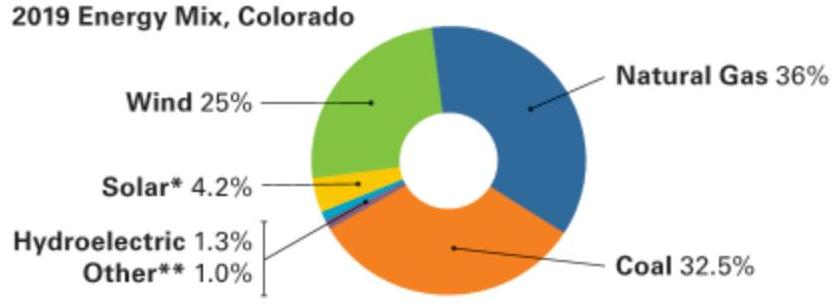

| MAILING ADDRESS | ACCOUNT NUMBER | DUE DATE |
| :--: | :--: | :--: |
| PPF AMLI 801 SOUTH CHERRY ST | 53-0012513594-9 | 05/04/2020 |
| C/O CONSERVIC |  |  |
| PO BOX 4697 | STATEMENT NUMBER | STATEMENT DATE |
| LOGAN UT 84323-4697 | 680849898 | 04/14/2020 |

## QUESTIONS ABOUT YOUR BILL?

See our website: xcelenergy.com
Email us at: Customerservice@xcelenergy.com
Please Call: 1-800-481-4700
Hearing Impaired: 1-800-895-4949
Fax: 1-800-311-0050
Or write us at: XCEL ENERGY
PO BOX 8
EAU CLAIRE WI 54702-0008

## ACCOUNT BALANCE (Balance de su cuenta)

Previous Balance
Payment Received
Balance Forward
Current Charges

As of 03/09
Electronic 03/24

## $16,353.60$

$\$ 16,353.60$ CR
$50.00$
$12,681.50$

## PREMISES SUMMARY

| PREMISES NUMBER | PREMISES IDENTIFIER | PREMISES DESCRIPTION | CURRENT BILL |
| :--: | :--: | :--: | :--: |
| 304393096 | 801 S CHERRY ST BLDG C HSE |  | \$1,921.82 |
| 304393097 | 801 S CHERRY ST BLDG G HSE |  | \$635.18 |
| 304393099 | 801 S CHERRY ST BLDG GARAGE |  | \$7,597.69 |
| 304393100 | 801 S CHERRY ST BLDG D HSE |  | \$356.32 |
| 304393101 | 801 S CHERRY ST BLDG E HSE |  | \$435.43 |
| 304393102 | 801 S CHERRY ST BLDG B HSE |  | \$310.17 |
| 304393105 | 801 S CHERRY ST BLDG F HSE |  | \$449.23 |
| 304393107 | 801 S CHERRY ST BLDG A HSE |  | \$975.66 |
| Total |  | \$12,681.50 |  |

## INFORMATION ABOUT YOUR BILL

Your safety and the safety of our employees will always be our top priority. We are prepared and are taking steps to ensure we'll continue to be there for you to meet your energy needs as COVID-19 affects a growing number of businesses in our communities. Our team will be working day and night to deliver the energy your business counts on. Learn more at xcelenergy.com/covid-19_response.

RETURN BOTTOM PORTION WITH YOUR PAYMENT - PLEASE DO NOT USE STAPLES, TAPE OR PAPER CLIPS

## Xcel Energy*

Please help our neighbors in need by donating to Energy Outreach Colorado. Please mark your donation amount on the back of this payment stub and CHECK THE RED BOX under your address below.
------ manifest line -------
$\mathrm{I}^{\mathrm{r}}\left\{\left\lvert\, \mathrm{I}_{\mathrm{I}}\right.$
$\mathrm{I}^{\mathrm{r}}\left\{\left\lvert\, \mathrm{I}_{\mathrm{I}}\right.\right.$
PPF AMLI 801 SOUTH CHERRY ST
C/O CONSERVIC
PO BOX 4697
LOGAN UT 84323-4697

| ACCOUNT NUMBER | DUE DATE | AMOUNT BILL |  |  |  |  |  |  |  |  |
| :--: | :--: | :--: | :--: | :--: | :--: | :--: | :--: | :--: | :--: | :--: |
| 53-0012513594-9 | 05/04/2020 | \$12,681.50 |  |  |  |  |  |  |  |  |
| Please see the back of this bill for more information regarding the late payment charge.   Make your check payable to XCEL ENERGY |  |  | 5 | M | T | W | 1 | F | 5 |  |
|  |  | 3 |  | 5 | 6 | 7 | 8 | 9 |  |
|  |  | 10 | 11 | 12 | 13 | 14 | 15 | 16 |  |
|  |  | 17 | 18 | 19 | 20 | 21 | 22 | 23 |  |
|  |  | 24 | 25 | 26 | 27 | 28 | 29 | 30 |  |
|  |  | 31 |  |  |  |  |  |  |  |

| ACCOUNT NUMBER | DUE DATE | AMOUNT BILL |  |  |  |  |  |
| :--: | :--: | :--: | :--: | :--: | :--: | :--: |
| 53-0012513594-9 | 05/04/2020 | \$12,681.50 |  |  |  |  |
|  |  |  |  | WAY |  |  |
|  |  |  |  |  |  |  |
| Please see the back of this bill for more information regarding the late payment charge. Make your check payable to XCEL ENERGY |  |  | 5 | M | T | W | 1 | F | 5 |
|  |  | 3 |  | 5 | 6 | 7 | 8 | 9 |  |
|  |  | 10 | 11 | 12 | 13 | 14 | 15 | 16 |  |
|  |  | 17 | 18 | 19 | 20 | 21 | 22 | 23 |  |
|  |  | 24 | 25 | 26 | 27 | 28 | 29 | 30 |  |
|  |  | 31 |  |  |  |  |  |  |  |

| $\mathrm{I}^{\mathrm{r}}\left\{\left\lvert\, \mathrm{I}_{\mathrm{I}}\right.\right.$ |  |  |  |  |  |  |
| :--: | :--: | :--: | :--: | :--: | :--: | :--: |
| $\left\lvert\, \mathrm{I}_{\mathrm{I}}\right.$ |  |  |  |  |  |  |
| $\left\lvert\, \mathrm{I}_{\mathrm{I}}\right.$ |  |  |  |  |  |  |
| $\left\lvert\, \mathrm{I}_{\mathrm{I}}\right.$ |  |  |  |  |  |  |
| $\left\lvert\, \mathrm{I}_{\mathrm{I}}\right.$ |  |  |  |  |  |  |
| $\left\lvert\, \mathrm{I}_{\mathrm{I}}\right.$ |  |  |  |  |  |  |
| $\left\lvert\, \mathrm{I}_{\mathrm{I}}\right.$ |  |  |  |  |  |  |
| $\left\lvert\, \mathrm{I}_{\mathrm{I}}\right.$ |  |  |  |  |  |  |
| $\left\lvert\, \mathrm{I}_{\mathrm{I}}\right.$ |  |  |  |  |  |  |
| $\left\lvert\, \mathrm{I}_{\mathrm{I}}\right.$ |  |  |  |  |  |  |
| $\left\lvert\, \mathrm{I}_{\mathrm{I}}\right.$ |  |  |  |  |  |  |
| $\left\lvert\, \mathrm{I}_{\mathrm{I}}\right.$ |  |  |  |  |  |  |
| $\left\lvert\, \mathrm{I}_{\mathrm{I}}\right.$ |  |  |  |  |  |  |
| $\left\lvert\, \mathrm{I}_{\mathrm{I}}\right.$ |  |  |  |  |  |  |
| $\left\lvert\, \mathrm{I}_{\mathrm{I}}\right.$ |  |  |  |  |  |  |
| $\left\lvert\, \mathrm{I}_{\mathrm{I}}\right.$ |  |  |  |  |  |  |
| $\left\lvert\, \mathrm{I}_{\mathrm{I}}\right.$ |  |  |  |  |  |  |
| $\left\lvert\, \mathrm{I}_{\mathrm{I}}\right.$ |  |  |  |  |  |  |
| $\left\lvert\, \mathrm{I}_{\mathrm{I}}\right.$ |  |  |  |  |  |  |
| $\left\lvert\, \mathrm{I}_{\mathrm{I}}\right.$ |  |  |  |  |  |  |
| $\left\lvert\, \mathrm{I}_{\mathrm{I}}\right.$ |  |  |  |  |  |  |
| $\left\lvert\, \mathrm{I}_{\mathrm{I}}\right.$ |  |  |  |  |  |  |
| $\left\lvert\, \mathrm{I}_{\mathrm{I}}\right.$ |  |  |  |  |  |  |
| $\left\lvert\, \mathrm{I}_{\mathrm{I}}\right.$ |  |  |  |  |  |  |
| $\left\lvert\, \mathrm{I}_{\mathrm{I}}\right.$ |  |  |  |  |  |  |
| $\left\lvert\, \mathrm{I}_{\mathrm{I}}\right.$ |  |  |  |  |  |  |
| $\left\lvert\, \mathrm{I}_{\mathrm{I}}\right.$ |  |  |  |  |  |  |
| $\left\lvert\, \mathrm{I}_{\mathrm{I}}\right.$ |  |  |  |  |  |  |
| $\left\lvert\, \mathrm{I}_{\mathrm{I}}\right.$ |  |  |  |  |  |  |
| $\left\lvert\, \mathrm{I}_{\mathrm{I}}\right.$ |  |  |  |  |  |  |
| $\left\lvert\, \mathrm{I}_{\mathrm{I}}\right.$ |  |  |  |  |  |  |
| $\left\lvert\, \mathrm{I}_{\mathrm{I}}\right.$ |  |  |  |  |  |  |

| MAILING ADDRESS | ACCOUNT NUMBER |  | DUE DATE |
| :--: | :--: | :--: | :--: |
| PPF AMLI 801 SOUTH CHERRY ST   C/O CONSERVICE   PO BOX 4697   LOGAN UT 84323-4697 | 53-0012513594-9 |  | 05/04/2020 |
|  | STATEMENT NUMBER | STATEMENT DATE | AMOUNT DUE |
|  | 680849898 | 04/14/2020 | $\$ 12,681.50$ |

INFORMATION ABOUT YOUR BILL

Thank you for your payment.
Convenience at your service - Pay your bills electronically-fast and easy with Electronic Funds Transfer. Call us at 1-800-481-4700 or visit us at www.xcelenergy.com.

The image is a photo showing two people, a man and a woman, who appear to be looking at a tablet together. The woman is standing behind the man, leaning over with her arms around his shoulders, while the man is seated and holding the tablet. They are in a room with shelves filled with books and other items in the background. The atmosphere seems relaxed and intimate.

# TOGETHER WE POWER STABILITY. 

Energy Outreach Colorado is a nonprofit partnering with Xcel Energy to provide energy bill payment assistance and energy-efficiency upgrades for affordable housing and nonprofit facilities. We need your help today!

## ENERGY OUTREACH COLORADO

There are two ways to contribute:

1. Visit the Energy Outreach Colorado website at www.energyoutreach.org to make a one-time donation.
2. CHECK THE RED BOX on the front-left side of this payment stub AND select a taxdeductible contribution below.

## MONTHLY DONATION:

$\$ 20$ $\qquad$ $\$ 10$ $\qquad$ $\$ 5$ $\qquad$ Other $\qquad$

|  | MAILING ADDRESS | ACCOUNT NUMBER | DUE DATE |
| :--: | :--: | :--: | :--: |
|  | PPF AMLI 801 SOUTH CHERRY ST | 53-0012513594-9 | 05/04/2020 |
|  | C/D CONSERVICE |  |  |
|  | PO BOX 4697 | STATEMENT NUMBER | STATEMENT DATE |
|  | LOGAN UT 84323-4697 | 680849898 | 04/14/2020 | $\$ 12,681.50$ |

SERVICE ADDRESS: 801 S CHERRY ST BLDG C HSE GLENDALE, CO 80246
NEXT READ DATE: 05/08/20

# ELECTRICITY SERVICE DETAILS 

| PREMISES NUMBER: | 304393096 |
| :-- | :-- |
| INVOICE NUMBER: | 0835422077 |

METER REXIONS INFORMATION

| METER $83507048-$ Multiplier $\times 160$ |  |  | Read Dates: 03/10/20 | 04/08/20 (29 Days) |
| :--: | :--: | :--: | :--: | :--: |
| DESCRIPTION | CURRENT READING | PREVIOUS READING | MEASURED   USAGE | BILLED   USAGE |
| Total Energy | 2972 Actual | 2821 Actual | 151 | 24160 kWh |
| Demand | Actual |  |  | 42.56 kW |
| Billable Demand |  |  |  | 43 kW |

ELECTRICITY CHARGES

| DESCRIPTION | USAGE UNITS | RATE | CHARGE |
| :--: | :--: | :--: | :--: |
| Service \& Facility |  |  | \$34.64 |
| Secondary General | 24160 kWh | $\$ 0.004610$ | \$111.38 |
| Elec Commodity Adj | 17495.17 kWh | $\$ 0.027080$ | \$473.77 |
| Elec Commodity Adj | 6664.83 kWh | $\$ 0.026910$ | \$179.35 |
| GRSA E | 24160 kWh | $\$ 0.004200$ | \$101.47 |
| Distribution Demand | 43 kW | $\$ 5.630000$ | \$242.09 |
| Gen \& Transm Demand | 43 kW | $\$ 9.820000$ | \$422.26 |
| Trans Cost Adj | 43 kW | $\$ 0.110000$ | \$4.73 |
| Demand Side Mgmt Cost | 43 kW | $\$ 0.620000$ | \$26.66 |
| Purch Cap Cost Adj | 43 kW | $\$ 1.210000$ | \$52.03 |
| CACJA | 43 kW | - \$0.030000 | - \$1.29 CR |
| Renew. Energy Std Adj |  |  | \$33.87 |
| GRSA |  |  | \$46.67 |
| Subtotal |  |  | \$1,727.63 |
| Franchise Fee |  | $3.00 \%$ | \$51.83 |
| Sales Tax |  |  | \$142.36 |
| Total |  |  | \$1,921.82 |

Premises Total
\$1,921.82

| DAILY AVERAGES | Last Year | This Year |
| :-- | :--: | :--: |
| Temperature | $40^{\circ} \mathrm{F}$ | $44^{\circ} \mathrm{F}$ |
| Electricity kWh | 777.9 | 82.11 |
| Electricity Cost | $\$ 63.72$ | 56.77 |

|  | MAILING ADDRESS | ACCOUNT NUMBER | DUE DATE |
| :--: | :--: | :--: | :--: |
|  | PPF AMLI 801 SOUTH CHERRY ST | 53-0012513594-9 | 05/04/2020 |
|  | C/D CONSERVICE |  |  |
|  | PO BOX 4697 | STATEMENT NUMBER | STATEMENT DATE |
|  | LOGAN UT 84323-4697 | 680849898 | 04/14/2020 | $\$ 12,681.50$ |

SERVICE ADDRESS: 801 S CHERRY ST BLDG G HSE GLENDALE, CO 80246
NEXT READ DATE: 05/08/20

# ELECTRICITY SERVICE DETAILS 

| PREMISES NUMBER: | 304393097 |
| :-- | :-- |
| INVOICE NUMBER: | 0835416584 |

METER REASURE INFORMATION
METER \$3388908 - Multiplier $\times 40$

| DESCRIPTION | CURRENT READING | PREVIOUS READING | $\begin{gathered} \text { MEASURED } \\ \text { USAGE } \end{gathered}$ | $\begin{gathered} \text { BILLED } \\ \text { USAGE } \end{gathered}$ |
| :--: | :--: | :--: | :--: | :--: |
| Total Energy | 7115 Actual | 6917 Actual | 198 | 7920 kWh |
| Demand | Actual |  |  | 13.2 kW |
| Billable Demand |  |  |  | 13 kW |

ELECTRICITY CHARGES
RESCRIPTION
Service \& Facility
Secondary General
Elec Commodity Adj
Elec Commodity Adj
GRSA E
Distribution Demand
Gen \& Transm Demand
Trans Cost Adj
Demand Side Mgmt Cost
Purch Cap Cost Adj
CACJA
Renew. Energy Std Adj
GRSA
Subtotal
Franchise Fee
Sales Tax
Total

| TABLE AVERAGES | Last Year | This Year |
| :-- | :--: | :--: |
| Temperature | $44^{\circ} \mathrm{F}$ | $\mathbf{4 1}^{\circ} \mathbf{F}$ |
| Electricity kWh | 256.8 | $\mathbf{3 2 3 . 1}$ |
| Electricity Cost | $\$ 23.80$ | $\mathbf{2 2 1 . 9 0}$ |

RATE: SG Secondary General

|  |  |
| :-- | :-- |
| MEASURED | BILLED |
| USAGE | USAGE |
|  |  |

|  |  |  |  |
| :--: | :--: | :--: | :--: |
|  |  |  |  |
|  |  |  |  |
|  |  |  |  |
|  |  |  |  |
|  |  |  |  |
|  |  |  |  |
|  |  |  |  |
|  |  |  |  |
|  |  |  |  |
|  |  |  |  |
|  |  |  |  |
|  |  |  |  |
|  |  |  |  |
|  |  |  |  |
|  |  |  |  |
|  |  |  |  |
|  |  |  |  |
|  |  |  |  |
|  |  |  |  |
|  |  |  |  |
|  |  |  |  |
|  |  |  |  |
|  |  |  |  |
|  |  |  |  |
|  |  |  |  |
|  |  |  |  |
|  |  |  |  |
|  |  |  |  |
|  |  |  |  |
|  |  |  |  |
|  |  |  |  |

The image is a photo of a utility bill header from Xcel Energy. It includes the following details:

- **Logo**: Xcel Energy logo on the left.
- **Mailing Address**: 
  - PPF AMLI 801 SOUTH CHERRY ST
  - C/O CONSERVICE
  - PO BOX 4697
  - LOGAN UT 84323-4697
- **Account Information**:
  - **Account Number**: 53-0012513594-9
  - **Due Date**: 05/04/2020
  - **Statement Number**: 680849898
  - **Statement Date**: 04/14/2020
  - **Amount Due**: $12,681.50

The layout places the mailing address on the left and the account information on the right, with the due date and amount due highlighted in red.

SERVICE ADDRESS: 801 S CHERRY ST BLDG GARAGE GLENDALE, CO 80246
NEXT READ DATE: $\quad 05 / 08 / 20$
ELECTRICITY SERVICE DETAILS
PREMISES NUMBER: 304393099
INVOICE NUMBER: 0835420864

# MOTER READING INFORMATION 

| METER 68875726 - Multiplier $\times 160$ |  |  | Read Dates: 03/09/20 - 04/07/20 (29 Days) |  |
| :--: | :--: | :--: | :--: | :--: |
| DESCRIPTION | CURRENT READING | PREVIOUS READING | MEASURED USAGE | BILLED   USAGE |
| Total Energy | 13932 Actual | 13639 Actual | 293 | 46880 kWh |
| Demand | Actual |  |  | 87.52 kW |
| Biliable Demand |  |  |  | 88 kW |

ELECTRICITY CHARGES
RATE: SG Secondary General

| DESCRIPTION | USAGE UNITS | RATE | CHARGE |
| :--: | :--: | :--: | :--: |
| Service \& Facility |  |  | \$34.58 |
| Secondary General | 46880 kWh | \$0.004610 | \$216.12 |
| Elec Commodity Adj | 35564.14 kWh | \$0.027080 | \$963.08 |
| Elec Commodity Adj | 11315.86 kWh | \$0.026910 | \$304.51 |
| GRSA E | 46880 kWh | \$0.004200 | \$196.90 |
| Distribution Demand | 88 kW | \$5.630000 | \$495.44 |
| Gen \& Transm Demand | 88 kW | \$9.820000 | \$864.16 |
| Trans Cost Adj | 88 kW | \$0.110000 | \$9.68 |
| Demand Side Mgmt Cost | 88 kW | \$0.620000 | \$54.56 |
| Purch Cap Cost Adj | 88 kW | \$1.210000 | \$106.48 |
| CACJA | 88 kW | - \$0.030000 | - \$2.64 CR |
| Renew. Energy Std Adj |  |  | \$66.71 |
| GRSA |  |  | \$92.76 |
| Subtotal |  |  | \$3,402.34 |
| Franchise Fee |  | $3.00 \%$ | \$102.07 |
| Sales Tax |  |  | \$280.35 |
| Total |  |  | \$3,784.76 |

SERVICE ADDRESS: 801 S CHERRY ST BLDG GARAGE GLENDALE, CO 80246 NEXT READ DATE: $\quad 05 / 08 / 20$

NATURAL GAS SERVICE DETAILS
PREMISES NUMBER: 304393099
INVOICE NUMBER: 0415149140

| METER READING INFORMATION |  |  |  |
| :--: | :--: | :--: | :--: |
| METER 10609815 |  | Read Dates: 02/10/20 - 04/06/20 (29 Days) |  |
| DESCRIPTION | CURRENT READING | PREVIOUS READING | USAGE |
| Total Energy | 626275 Actual | 618030 Actual | 8245 ccf |
| Demand PDQ |  |  | 103.20 Dth |

NATURAL GAS ADJUSTMENTS

| DESCRIPTION | VALUE UNITS | CONVERSION | VALUE UNITS |
| :-- | :--: | :--: | :--: |
| Dth Multiplier | 8245 ccf | $\times 0.100720$ | $\mathbf{8 3 0 . 4 0} \mathrm{Dth}$ |

NATURAL GAS CHARGES
DESCRIPTION
Service \& Facility
Usage Charge
Capacity Charge
Natural Gas 1 Qtr
Natural Gas 2 Qtr

RATE: CLG Commercial MDQ
$\$ 102.36$
\$102.36
\$191.16
\$900.94
\$1,146.42
\$258.87

|  | MAILING ADDRESS | ACCOUNT NUMBER | DUE DATE |
| :--: | :--: | :--: | :--: |
|  | PPF AMLI 801 SOUTH CHERRY ST   C/O CONSERVICE   PO BOX 4697   LOGAN UT 84323-4697 | $53-0012513594-9$ | 05/04/2020 |
|  |  | STATEMENT NUMBER | STATEMENT DATE | AMOUNT DUE |
| NATURAL GAS CHARGES |  | 680849898 | 04/14/2020 | $\$ 12,681.50$ |
| DESCRIPTION | USAGE UNITS | RATE | CHARGE |
| DSMCA |  |  | \$23.18 |
| Interstate Pipeline | 830.40 Dth | \$0.508996 | \$422.67 |
| Pipe Sys Int Adj | 830.40 Dth | \$0.460116 | \$382.08 |
| Subtotal |  |  | \$3,427.68 |
| Franchise Fee |  | $3.00 \%$ | \$102.83 |
| Sales Tax |  |  | \$282.42 |
| Total |  |  | \$3,812.93 |
| Premises Total |  |  | \$7,597.69 |

| DAILY AVERAGES | Last Year | This Year |
| :-- | :--: | :--: |
| Temperature | $44^{\circ} \mathrm{F}$ | $44^{\circ} \mathrm{F}$ |
| Electricity kWh | 1594.8 | 1616.6 |
| Electricity Cost | $\$ 129.90$ | $\$ 130.51$ |
| DAILY AVERAGES | Last Year | This Year |
| Temperature | $45^{\circ} \mathrm{F}$ | $44^{\circ} \mathrm{F}$ |
| Gas Therms | 354.9 | 286.3 |
| Gas Cost | $\$ 211.42$ | $\$ 171.46$ |

The image is a photo showing two people sitting and talking in what appears to be a casual or business setting. One person, a woman, is holding a tablet and smiling at the other person, a man, who is turned slightly away from the camera. The setting includes modern furniture, such as chairs and tables, and the atmosphere seems relaxed and professional. The woman is wearing glasses and a black dress, while the man is in a white shirt.

# ENROLL IN AUTO PAY 

## NO LATE FEES, NO WORRIES.

Enjoy the benefits of automatic payment withdrawal from your checking account. Your payment will automatically post to your Xcel Energy account on your due date.
To enroll, fill out the information below, cut off this form, and include it, along with your check and bill stub, in the remittance envelope. Money orders do not qualify. Watch for Automated Bank Payment to appear on your billing statement to ensure your enrollment is in effect.
To enroll your business in Auto Pay online, visit xcelenergy.com/AutoPay. For more information call our Business Solutions Center at 800.481.4700.

| Authorized signature | Xcel Energy account number | Date |
| :--: | :--: | :--: |
| Signature above must match name on the bank account | See page 1 of bill statement |  |
| I authorize Xcel Energy to initiate transfers from the bank account indicated on the enclosed check to make monthly payments on my Xcel Energy account on my due date. This authority will remain in effect until I notify Xcel Energy, or Xcel Energy notifies me, of the need to cancel the enrollment. I understand that a new authorization is required if I change my bank account. I have kept a record of this authorization. |  |  |

|  | MAILING ADDRESS | ACCOUNT NUMBER | DUE DATE |
| :--: | :--: | :--: | :--: |
|  | PPF AMLI 801 SOUTH CHERRY ST | 53-0012513594-9 | 05/04/2020 |
|  | C/D CONSERVICE |  |  |
|  | PO BOX 4697 | STATEMENT NUMBER | STATEMENT DATE |
|  | LOGAN UT 84323-4697 | 680849898 | 04/14/2020 | $\$ 12,681.50$ |

SERVICE ADDRESS: 801 S CHERRY ST BLDG D HSE GLENDALE, CO 80246
NEXT READ DATE: 05/08/20

# ELECTRICITY SERVICE DETAILS 

| PREMISES NUMBER: | 304393100 |
| :-- | :--: |
| INVOICE NUMBER: | 0835417373 |

METER REASURE INFORMATION
METER 72565631 - Multiplier $\times 40$

| DESCRIPTION | CURRENT READING | PREVIOUS READING | $\begin{gathered} \text { MEASURED } \\ \text { USAGE } \end{gathered}$ | $\begin{gathered} \text { BILLED } \\ \text { USAGE } \end{gathered}$ |
| :--: | :--: | :--: | :--: | :--: |
| Total Energy | 6518 Actual | 6427 Actual | 91 | 3640 kWh |
| Demand | Actual |  |  | 7.96 kW |
| Billable Demand |  |  |  | 8 kW |

ELECTRICITY CHARGES
RESCRIPTION
Service \& Facility
Secondary General
Elec Commodity Adj
Elec Commodity Adj
GRSA E
Distribution Demand
Gen \& Transm Demand
Trans Cost Adj
Demand Side Mgmt Cost
Purch Cap Cost Adj
CACJA
Renew. Energy Std Adj
GRSA
Subtotal
Franchise Fee
Sales Tax
Total

| DARLY AVERAGES | Last Year | This Year |
| :-- | :--: | :--: |
| Temperature | $44^{\circ} \mathrm{F}$ | $\$ 4^{\circ} \mathrm{F}$ |
| Electricity kWh | 172.9 | $\$ 20.5$ |
| Electricity Cost | $\$ 16.12$ | $\$ 12.29$ |

RATE: SG Secondary General

| USAGE UNITS | RATE | CHARGE |
| :--: | :--: | :--: |
|  |  | \$34.58 |
| 3640 kWh | $\$ 0.004610$ | $\$ 16.78$ |
| 2761.38 kWh | $\$ 0.027080$ | $\$ 74.78$ |
| 878.62 kWh | $\$ 0.026910$ | $\$ 23.64$ |
| 3640 kWh | $\$ 0.004200$ | $\$ 15.29$ |
| 8 kW | $\$ 5.630000$ | $\$ 45.04$ |
| 8 kW | $\$ 9.820000$ | $\$ 78.56$ |
| 8 kW | $\$ 0.110000$ | $\$ 0.88$ |
| 8 kW | $\$ 0.620000$ | $\$ 4.96$ |
| 8 kW | $\$ 1.210000$ | $\$ 9.68$ |
| 8 kW | - $\$ 0.030000$ | - $\$ 0.24$ CR |
|  |  | $\$ 6.29$ |
|  |  | $\$ 10.08$ |
| 3.00\% |  | $\$ 320.32$ |
|  |  | $\$ 9.61$ |
|  |  | $\$ 26.39$ |
|  |  | $\$ 356.32$ |

Premises Total $\$ 356.32$

| DAILY AVERAGES | Last Year | This Year |
| :-- | :--: | :--: |
| Temperature | $44^{\circ} \mathrm{F}$ | $\$ 4^{\circ} \mathrm{F}$ |
| Electricity kWh | 172.9 | $\$ 20.5$ |
| Electricity Cost | $\$ 16.12$ | $\$ 12.29$ |

|  | MAILING ADDRESS | ACCOUNT NUMBER | DUE DATE |
| :--: | :--: | :--: | :--: |
|  | PPF AMLI 801 SOUTH CHERRY ST | 53-0012513594-9 | 05/04/2020 |
|  | C/D CONSERVICE |  |  |
|  | PO BOX 4697 | STATEMENT NUMBER | STATEMENT DATE |
|  | LOGAN UT 84323-4697 | 680849898 | 04/14/2020 | $\$ 12,681.50$ |

SERVICE ADDRESS: 801 S CHERRY ST BLDG E HSE GLENDALE, CO 80246
NEXT READ DATE: 05/08/20

# ELECTRICITY SERVICE DETAILS 

| PREMISES NUMBER: | 304393101 |
| :-- | :--: |
| INVOICE NUMBER: | 0835418863 |

METER REASURE INFORMATION

| METER 74842713 - Multiplier $\times 40$ |  |  |  | Read Dates: 03/10/20 | 04/08/20 (29 Days) |
| :--: | :--: | :--: | :--: | :--: | :--: |
| DESCRIPTION | CURRENT READING | PREVIOUS READING | MEASURED   USAGE | BILLED   USAGE |  |
| Total Energy | 5856 Estimate | 5742 Actual | 114 | 4560 kWh |  |
| Demand | Estimate |  |  |  | 10.24 kW |
| Billable Demand |  |  |  | 10 kW |  |

ELECTRICITY CHARGES

| DESCRIPTION | USAGE UNITS | RATE | CHARGE |
| :-- | --: | --: | --: |
| Service \& Facility |  |  | $\$ 34.64$ |
| Secondary General | 4560 kWh | $\$ 0.004610$ | $\$ 21.02$ |
| Elec Commodity Adj | 3302.07 kWh | $\$ 0.027080$ | $\$ 89.42$ |
| Elec Commodity Adj | 1257.93 kWh | $\$ 0.026910$ | $\$ 33.85$ |
| GRSA E | 4560 kWh | $\$ 0.004200$ | $\$ 19.15$ |
| Distribution Demand | 10 kW | $\$ 5.630000$ | $\$ 56.30$ |
| Gen \& Transm Demand | 10 kW | $\$ 9.820000$ | $\$ 98.20$ |
| Trans Cost Adj | 10 kW | $\$ 0.110000$ | $\$ 1.10$ |
| Demand Side Mgmt Cost | 10 kW | $\$ 0.620000$ | $\$ 6.20$ |
| Purch Cap Cost Adj | 10 kW | $\$ 1.210000$ | $\$ 12.10$ |
| CACJA | 10 kW | $-\$ 0.030000$ | $-\$ 0.30$ CR |
| Renew. Energy Std Adj |  |  | $\$ 7.65$ |
| GRSA |  |  | $\$ 12.10$ |
| Subtotal |  |  | $\$ 391.43$ |
| Franchise Fee |  | $3.00 \%$ | $\$ 11.74$ |
| Sales Tax |  |  | $\$ 32.26$ |
| Total |  |  | $\$ 435.43$ |

Premises Total $\quad \$ 435.43$

| DAILY AVERAGES | Last Year | This Year |
| :-- | :--: | :--: |
| Temperature | $45^{\circ} \mathrm{F}$ | $44^{\circ} \mathrm{F}$ |
| Electricity kWh | 201.4 | $12.12$ |
| Electricity Cost | $\$ 17.49$ | $\$ 10.01$ |

INFORMATION ABOUT YOUR BILL
This bill reflects an estimate. Actual charges will be billed once a meter reading is established. If you feel this estimate is above or below your average billing, please contact us at 1-800-481-4700.

|  | MAILING ADDRESS | ACCOUNT NUMBER | DUE DATE |
| :--: | :--: | :--: | :--: |
|  | PPF AMLI 801 SOUTH CHERRY ST | 53-0012513594-9 | 05/04/2020 |
|  | C/D CONSERVICE |  |  |
|  | PO BOX 4697 | STATEMENT NUMBER | STATEMENT DATE |
|  | LOGAN UT 84323-4697 | 680849898 | 04/14/2020 | $\$ 12,681.50$ |

SERVICE ADDRESS: 801 S CHERRY ST BLDG B HSE GLENDALE, CO 80246
NEXT READ DATE: 05/08/20

# ELECTRICITY SERVICE DETAILS 

| PREMISES NUMBER: | 304393102 |
| :-- | :--: |
| INVOICE NUMBER: | 0835419198 |

METER REASURE INFORMATION
METER 74843685 - Multiplier $\times 80$

| DESCRIPTION | CURRENT READING | PREVIOUS READING | $\begin{gathered} \text { MEASURED } \\ \text { USAGE } \end{gathered}$ | $\begin{gathered} \text { BILLED } \\ \text { USAGE } \end{gathered}$ |
| :--: | :--: | :--: | :--: | :--: |
| Total Energy | 2376 Actual | 2334 Actual | 42 | 3360 kWh |
| Demand | Actual |  |  | 6.16 kW |
| Billable Demand |  |  |  | 7 kW |

ELECTRICITY CHARGES
RESCRIPTION
Service \& Facility
Secondary General
Elec Commodity Adj
Elec Commodity Adj
GRSA E
Distribution Demand
Gen \& Transm Demand
Trans Cost Adj
Demand Side Mgmt Cost
Purch Cap Cost Adj
CACJA
Renew. Energy Std Adj
GRSA
Subtotal
Franchise Fee
Sales Tax
Total

## Premises Total

| DAILY AVERAGES | Last Year | This Year |
| :-- | :--: | :--: |
| Temperature | $44^{\circ} \mathrm{F}$ | $44^{\circ} \mathrm{F}$ |
| Electricity kWh | 170.3 | $\mathbf{1 1 1 . 3}$ |
| Electricity Cost | $\$ 15.35$ | $\mathbf{3 1 0 . 7 0}$ |

|  | MAILING ADDRESS | ACCOUNT NUMBER | DUE DATE |
| :--: | :--: | :--: | :--: |
|  | PPF AMLI 801 SOUTH CHERRY ST | 53-0012513594-9 | 05/04/2020 |
|  | C/D CONSERVICE |  |  |
|  | PO BOX 4697 | STATEMENT NUMBER | STATEMENT DATE |
|  | LOGAN UT 84323-4697 | 680849898 | 04/14/2020 | $\$ 12,681.50$ |

SERVICE ADDRESS: 801 S CHERRY ST BLDG F HSE GLENDALE, CO 80246
NEXT READ DATE: 05/08/20

# ELECTRICITY SERVICE DETAILS 

| PREMISES NUMBER: | 304393105 |
| :-- | :--: |
| INVOICE NUMBER: | 0835418845 |

METER REASURE INFORMATION

| METER 73453252 - Multiplier $\times 40$ |  |  | Read Dates: 03/09/20 | 04/09/20 (31 Days) |
| :--: | :--: | :--: | :--: | :--: |
| DESCRIPTION | CURRENT READING | PREVIOUS READING | MEASURED   USAGE | BILLED   USAGE |
| Total Energy | 5810 Estimate | 5675 Actual | 135 | 5400 kWh |
| Demand | Actual |  |  | 8.84 kW |
| Billable Demand |  |  |  | 9 kW |

ELECTRICITY CHARGES

| DESCRIPTION | USAGE UNITS | RATE | CHARGE |
| :--: | :--: | :--: | :--: |
| Service \& Facility |  |  | \$34.69 |
| Secondary General | 5400 kWh | \$0.004610 | \$24.89 |
| Elec Commodity Adj | 3832.26 kWh | \$0.027080 | \$103.78 |
| Elec Commodity Adj | 1567.74 kWh | \$0.026910 | \$42.19 |
| GRSA E | 5400 kWh | \$0.004200 | \$22.68 |
| Distribution Demand | 9 kW | \$5.630000 | \$50.67 |
| Gen \& Transm Demand | 9 kW | \$9.820000 | \$88.38 |
| Trans Cost Adj | 9 kW | \$0.110000 | \$0.99 |
| Demand Side Mgmt Cost | 9 kW | \$0.620000 | \$5.58 |
| Purch Cap Cost Adj | 9 kW | \$1.210000 | \$10.89 |
| CACJA | 9 kW | - \$0.030000 | - \$0.27 CR |
| Renew. Energy Std Adj |  |  | \$7.92 |
| GRSA |  |  | \$11.44 |
| Subtotal |  |  | \$403.83 |
| Franchise Fee |  | $3.00 \%$ | \$12.12 |
| Sales Tax |  |  | \$33.28 |
| Total |  |  | \$449.23 |

Premises Total $\quad \$ 449.23$

| DAILY AVERAGES | Last Year | This Year |
| :-- | :--: | :--: |
| Temperature | $40^{\circ} \mathrm{F}$ | $\$ 4^{\circ} \mathrm{F}$ |
| Electricity kWh | 176.8 | $\$ 31.2$ |
| Electricity Cost | $\$ 17.62$ | $\$ 14.49$ |

INFORMATION ABOUT YOUR BILL
This bill reflects an estimate. Actual charges will be billed once a meter reading is established. If you feel this estimate is above or below your average billing, please contact us at 1-800-481-4700.

| MAILING ADDRESS | ACCOUNT NUMBER | DUE DATE |
| :--: | :--: | :--: |
| PPF AMLI 801 SOUTH CHERRY ST   C/D CONSERVICE   PO BOX 4697   LOGAN UT 84323-4697 | 53-0012513594-9 | 05/04/2020 |
|  | STATEMENT NUMBER | STATEMENT DATE | AMOUNT DUE |
|  | 680849898 | 04/14/2020 | $\$ 12,681.50$ |

SERVICE ADDRESS: 801 S CHERRY ST BLDG A HSE GLENDALE, CO 80246
NEXT READ DATE: 05/08/20

# ELECTRICITY SERVICE DETAILS 

| PREMISES NUMBER: | 304393107 |
| :-- | :--: |
| INVOICE NUMBER: | 0835417420 |

METER REASONS INFORMATION

| METER 45005336 - Multiplier $\times 80$ |  |  | Read Dates: 03/09/20 | 04/07/20 (29 Days) |  |
| :--: | :--: | :--: | :--: | :--: | :--: |
| DESCRIPTION | CURRENT READING | PREVIOUS READING | MEASURED   USAGE | BILLED   USAGE |  |
| Total Energy | 7881 | Actual | 7735 | Actual | 146 | 11680 kWh |
| Demand | Actual |  |  |  | 22.4 kW |  |
| Billable Demand |  |  |  |  | 22 kW |  |

ELECTRICITY CHARGES

| DESCRIPTION | USAGE UNITS | RATE | CHARGE |
| :--: | :--: | :--: | :--: |
| Service \& Facility |  |  | \$34.58 |
| Secondary General | 11680 kWh | \$0.004610 | \$53.84 |
| Elec Commodity Adj | 8860.69 kWh | \$0.027080 | \$239.95 |
| Elec Commodity Adj | 2819.31 kWh | \$0.026910 | \$75.87 |
| GRSA E | 11680 kWh | \$0.004200 | \$49.06 |
| Distribution Demand | 22 kW | \$5.630000 | \$123.86 |
| Gen \& Transm Demand | 22 kW | \$9.820000 | \$216.04 |
| Trans Cost Adj | 22 kW | \$0.110000 | \$2.42 |
| Demand Side Mgmt Cost | 22 kW | \$0.620000 | \$13.64 |
| Purch Cap Cost Adj | 22 kW | \$1.210000 | \$26.62 |
| CACJA | 22 kW | - \$0.030000 | - \$0.66 CR |
| Renew. Energy Std Adj |  |  | \$17.20 |
| GRSA |  |  | \$24.66 |
| Subtotal |  |  | \$877.08 |
| Franchise Fee |  | $3.00 \%$ | \$26.32 |
| Sales Tax |  |  | \$72.26 |
| Total |  |  | \$975.66 |

Premises Total
\$975.66

| DAILY AVERAGES | Last Year | This Year |
| :-- | :--: | :--: |
| Temperature | $44^{\circ} \mathrm{F}$ | $44^{\circ} \mathrm{F}$ |
| Electricity kWh | 363.9 | 400.8 |
| Electricity Cost | $\$ 32.50$ | $\$ 32.64$ |

The image is a photo or illustration of a mostly blank white page with a small QR code located in the bottom right corner. There is no other visible text or elements on the page.

# COLORADO'S DIVERSE ENERGY MIX 

The image is a photo/illustration of a wind turbine against a clear blue sky. The focus is on the turbine's blades and hub, highlighting the clean energy theme. There is no embedded text in the image.

Because clean energy matters to our customers, we use a diverse mix of sources to produce the reliable, affordable electricity you need. Today, Xcel Energy serves Colorado customers with electricity that is more than $31 \%$ carbon-free, putting us well on the way to our Colorado Energy Plan goal of 55\% renewable sources in Colorado by 2026.
Working together, we are confident we can achieve our industry-leading corporate vision to serve customers with $100 \%$ carbon-free electricity by 2050. Between 2005 and 2019, we have lowered carbon emissions $42 \%$ in Colorado. You can help us reach our goals, while using less energy and saving money. Some ideas:

- Opt for renewable choices, including Windsource ${ }^{\circledR}$ and solar programs
- Drive electric for big savings over the life of your vehicle
- Explore rebates and money-saving products for home and business
- Choose smart devices for greater control of your energy use

Xcel Energy's clean energy vision is bolder than ever. Ready to learn more? Go to xcelenergy.com to explore all your options.

Power delivery: Includes specific labor associated with transmission and distribution facilities, metering, billing, customer service, allocated overheads, taxes and a profit component.
Power supply: Costs include all purchased power and energy source costs. For generation plants owned by Xcel Energy, power supply costs also include labor at generation plants, depreciation of generation plants, allocated overhead, taxes and a profit component.
Price components: Percentage components for an average monthly electric bill:

The image is a graph/chart, specifically a pair of donut charts. 

- The left chart is labeled "Residential service" and shows:
  - "Power delivery" at 37%
  - "Power supply" at 63%

- The right chart is labeled "Commercial service" and shows:
  - "Power delivery" at 40%
  - "Power supply" at 60%

The charts visually represent the percentage breakdown of power delivery and power supply for residential and commercial services. The "Power delivery" section is highlighted in blue, while "Power supply" is in gray. The text "Transmission and delivery" and "Generation and purchase" are associated with "Power delivery" and "Power supply," respectively.

Example: If your residential bill for this month is $\$ 67.10$, then about $63 \%$ (or $\$ 42.34$ of your bill) is for the electricity itself, and about $37 \%$ (or $\$ 24.76$ ) covers the cost of having the electricity delivered to your home.
Note: Price component information applies to the average customer and may differ when applied to individual customers. Additional information is available upon request.

Power supply mix: Our Colorado energy mix includes coal, natural gas, wind, solar and hydroelectric power. Energy sources used in power generation and purchase for all energy customers in the 2019 calendar year:

2019 Energy Mix, Colorado

The image is a graph/chart, specifically a donut chart titled "2019 Energy Mix, Colorado." It shows the percentage breakdown of different energy sources used in Colorado:

- Natural Gas: 36%
- Coal: 32.5%
- Wind: 25%
- Solar*: 4.2%
- Hydroelectric: 1.3%
- Other**: 1.0%

The chart visually represents the contribution of each energy source to the overall energy mix. The sections are color-coded for differentiation.

Visit xcelenergy.com for more information about the resources that produce your electricity, including the average cost of each resource.
*Includes wind and solar energy generated through Xcel Energy's renewable energy programs: Windsource, Renewable*Connect, Solar*Rewards Community and Solar*Rewards. **Includes purchased biomass, oil and nuclear power.

The image is a photo or illustration of a mostly blank white page with a small QR code located in the top right corner. There is no other visible text or elements on the page.

