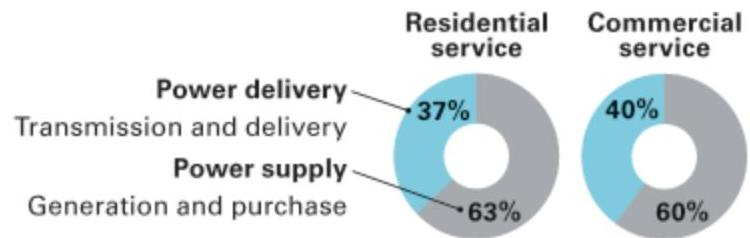

| MAILING ADDRESS | ACCOUNT NUMBER | DUE DATE |
| :--: | :--: | :--: |
| AMLI RESIDENTIAL PROPERTIES LP | 53-0011936069-8 | 05/07/2020 |
| C/O CONSERVICE |  |  |
| PO BOX 4697 | STATEMENT NUMBER | STATEMENT DATE |
| LOGAN UT 84323-4697 | 681373152 | 04/17/2020 |

## QUESTIONS ABOUT YOUR BILL?

See our website: xcelenergy.com
Email us at: Customerservice@xcelenergy.com
Please Call: 1-800-481-4700
Hearing Impaired: 1-800-895-4949
Fax: 1-800-311-0050
Or write us at: XCEL ENERGY
PO BOX 8
EAU CLAIRE WI 54702-0008

## ACCOUNT BALANCE (Balance de su cuenta)

Previous Balance
Payment Received
Balance Forward
Current Charges

As of 03/12
Electronic 03/26
$-$ \$12,368.61 CR
\$0.00
\$9.915.74
Amount Due (Cantidad a pagar)
$\$ 9,915.74$

# PREMISES SUMMARY 

| PREMISES NUMBER | PREMISES IDENTIFIER | PREMISES DESCRIPTION | CURRENT BILL |
| :--: | :--: | :--: | :--: |
| 304401898 | 2525 WEWATTA WAY |  | \$2,478.80 |
| 304560673 | 2525 WEWATTA WAY UNIT G-MDP |  | \$3,979.44 |
| 304560730 | 2525 WEWATTA WAY UNIT L-MDP |  | \$892.72 |
| 304560756 | 2525 WEWATTA WAY UNIT HP-2 |  | \$909.44 |
| 304560772 | 2525 WEWATTA WAY UNIT HP-1 |  | \$598.77 |
| 304560847 | 2525 WEWATTA WAY UNIT HP-3 |  | \$485.05 |
| 304560848 | 2525 WEWATTA WAY UNIT HP-4 |  | \$287.76 |
| 304565291 | 2525 WEWATTA WAY UNIT GAS MTR B |  | \$283.76 |
| Total |  |  | \$9,915.74 |

## INFORMATION ABOUT YOUR BILL

Your safety and the safety of our employees will always be our top priority. We are prepared and are taking steps to ensure we'll continue to be there for you to meet your energy needs as COVID-19 affects a growing number of businesses in our communities. Our team will be working day and night to deliver the energy your business counts on. Learn more at xcelenergy.com/covid-19_response.

RETURN BOTTOM PORTION WITH YOUR PAYMENT - PLEASE DO NOT USE STAPLES, TAPE OR PAPER CLIPS

## Xcel Energy*

Please help our neighbors in need by donating to Energy Outreach Colorado. Please mark your donation amount on the back of this payment stub and CHECK THE RED BOX under your address below.
------ manifest line --------
101111213141516
$\left.\begin{array}{l}1^{10} 11112 \\ 10^{11} 1111 \\ 10^{12} 1111 \\ 10^{13} 1111 \\ 10^{14} 11111111111111111111111111111111111111111111111111111111111111111111111111111111111111111111111111111111111111111111111111111111111111111111111111111111111111111111111111111111111111111111111111111111

| MAILING ADDRESS | ACCOUNT NUMBER |  | DUE DATE |
| :--: | :--: | :--: | :--: |
| AMEI RESIDENTIAL PROPERTIES LP   C/O CONSERVICE   PO BOX 4697   LOGAN UT 84323-4697 | 53-0011936069-8 |  | 05/07/2020 |
|  | STATEMENT NUMBER | STATEMENT DATE | AMOUNT DUE |
|  | 681373152 | 04/17/2020 | $\$ 9,915.74$ |

INFORMATION ABOUT YOUR BILL

Thank you for your payment.
Convenience at your service - Pay your bills electronically-fast and easy with Electronic Funds Transfer. Call us at 1-800-481-4700 or visit us at www.xcelenergy.com.

The image is a photo showing two people, a woman and a man, who appear to be looking at a tablet together. The woman is standing behind the man, leaning over his shoulder with a smile, while the man is seated and holding the tablet. They are both casually dressed, and the setting appears to be indoors, possibly in a home environment with bookshelves in the background.

# TOGETHER WE POWER STABILITY. 

Energy Outreach Colorado is a nonprofit partnering with Xcel Energy to provide energy bill payment assistance and energy-efficiency upgrades for affordable housing and nonprofit facilities. We need your help today!

## ENERGY OUTREACH COLORADO

There are two ways to contribute:

1. Visit the Energy Outreach Colorado website at www.energyoutreach.org to make a one-time donation.
2. CHECK THE RED BOX on the front-left side of this payment stub AND select a taxdeductible contribution below.

## MONTHLY DONATION:

$\$ 20$ $\qquad$ $\$ 10$ $\qquad$ $\$ 5$ $\qquad$ Other $\qquad$

| MAILING ADDRESS | ACCOUNT NUMBER | DUE DATE |
| :--: | :--: | :--: |
| AMILI RESIDENTIAL PROPERTIES LP | $53-0011936069-8$ | 05/07/2020 |
| C/O CONSERVICE |  |  |
| PO BOX 4697 | STATEMENT NUMBER | STATEMENT DATE |
| LOGAN UT 84323-4697 | 681373152 | 04/17/2020 | \$9,915.74 |

SERVICE ADDRESS: 2525 WEWATTA WAY DENVER, CO 80216
NEXT READ DATE: $05 / 12 / 20$
NATURAL GAS SERVICE DETAILS
PREMISES NUMBER: 304401898
INVOICE NUMBER: 0415453758

| METER DEADING INFORMATION |  |  |  |
| :--: | :--: | :--: | :--: |
| METER 10012405 |  | Read Dates: 03/12/20 - 04/10/20 (29 Days) |  |
| DESCRIPTION | CURRENT READING | PREVIOUS READING | USAGE |
| Total Energy | 160226 Actual | 156611 Actual | 3615 ccf |
| Demand P00 |  |  | 54.00 Dth |

NATURAL GAS ADJUSTMENTS

| DESCRIPTION | VALUE UNITS | CONVERSION | VALUE UNITS |
| :-- | :--: | :--: | :--: |
| Dth Multiplier | 3615 ccf | $\times 0.157866$ | $\mathbf{5 7 0 . 7 0}$ Dth |

NATURAL GAS CHARGES

| DESCRIPTION | USAGE UNITS | RATE | CHARGE |
| :-- | :--: | :--: | :--: |
| Service \& Facility |  |  | $\$ 102.99$ |
| Usage Charge | 570.70 Dth | $\$ 0.230209$ | $\$ 131.38$ |
| Capacity Charge | 54 Dth | $\$ 8.730000$ | $\$ 471.42$ |
| Natural Gas 1 Qtr | 402.10 Dth | $\$ 1.813000$ | $\$ 729.13$ |
| Natural Gas 2 Qtr | 168.50 Dth | $\$ 1.307000$ | $\$ 220.27$ |
| DSMCA |  |  | $\$ 13.70$ |
| Interstate Pipeline | 570.70 Dth | $\$ 0.509006$ | $\$ 290.49$ |
| Pipe Sys Int Adj | 570.70 Dth | $\$ 0.460102$ | $\$ 262.58$ |
| Subtotal |  |  | $\$ 2,221.96$ |
| Franchise Fee |  | $3.00 \%$ | $\$ 66.66$ |
| Sales Tax |  |  | $\$ 190.18$ |
| Total |  |  | $\$ 2,478.80$ |

Premises Total $\quad \$ 2,478.80$

The image is a photo showing two people sitting and talking. One person is a woman wearing glasses and a black dress, smiling and holding a tablet or document. The other person is a man in a white shirt, seen from the back. They appear to be in a casual or professional setting with bright, modern decor, including green chairs in the background.

# ENROLL IN AUTO PAY 

## NO LATE FEES, NO WORRIES.

Enjoy the benefits of automatic payment withdrawal from your checking account. Your payment will automatically post to your Xcel Energy account on your due date.
To enroll, fill out the information below, cut off this form, and include it, along with your check and bill stub, in the remittance envelope. Money orders do not qualify. Watch for Automated Bank Payment to appear on your billing statement to ensure your enrollment is in effect.
To enroll your business in Auto Pay online, visit xcelenergy.com/AutoPay. For more information call our Business Solutions Center at 800.481.4700.

| Authorized signature | Xcel Energy account number | Date |
| :--: | :--: | :--: |
| Signature above must match name on the bank account | See page 1 of bill statement |  |
| I authorize Xcel Energy to initiate transfers from the bank account indicated on the enclosed check to make monthly payments on my Xcel Energy account on my due date. This authority will remain in effect until I notify Xcel Energy, or Xcel Energy notifies me, of the need to cancel the enrollment. I understand that a new authorization is required if I change my bank account. I have kept a record of this authorization. |  |  |

| MAILING ADDRESS | ACCOUNT NUMBER | DUE DATE |
| :--: | :--: | :--: |
| AMEI RESIDENTIAL PROPERTIES LP | 53-0011936069-8 | 05/07/2020 |
| C/O CONSERVICE |  |  |
| PO BOX 4697 | STATEMENT NUMBER | STATEMENT DATE |
| LOGAN UT 84323-4697 | 681373152 | 04/17/2020 |

SERVICE ADDRESS: 2525 WEWATTA WAY UNIT G-MDP DENVER, CO 80216-3734
NEXT READ DATE: $05 / 12 / 20$
ELECTRICITY SERVICE DETAILS

| PREMISES NUMBER: | 304560673 |
| :-- | :-- |
| INVOICE NUMBER: | 0836137704 |

METER REASURE INFORMATION

| METER 75496533 - Multiplier $\times 300$ |  |  | Read Dates: 03/11/20 - 04/09/20 (29 Days) |  |
| :--: | :--: | :--: | :--: | :--: |
| DESCRIPTION | CURRENT READING | PREVIOUS READING | MEASURED   USAGE | BILLED   USAGE |
| Total Energy | 5623 Actual | 5472 Actual | 151 | 45300 kWh |
| Demand | Actual |  |  | 99.6 kW |
| Billable Demand |  |  |  | 100 kW |

ELECTRICITY CHARGES

| DESCRIPTION | USAGE UNITS | RATE | CHARGE |
| :--: | :--: | :--: | :--: |
| Service \& Facility |  |  | \$34.70 |
| Secondary General | 45300 kWh | \$0.004610 | \$208.83 |
| Elec Commodity Adj | 31241.38 kWh | \$0.027080 | \$846.02 |
| Elec Commodity Adj | 14058.62 kWh | \$0.026910 | \$378.32 |
| GRSA E | 45300 kWh | \$0.004200 | \$190.26 |
| Distribution Demand | 100 kW | \$5.630000 | \$563.00 |
| Gen \& Transm Demand | 100 kW | \$9.820000 | \$982.00 |
| Trans Cost Adj | 100 kW | \$0.110000 | \$11.00 |
| Demand Side Mgmt Cost | 100 kW | \$0.620000 | \$62.00 |
| Purch Cap Cost Adj | 100 kW | \$1.210000 | \$121.00 |
| CACJA | 100 kW | - \$0.030000 | - \$3.00 CR |
| Renew. Energy Std Adj |  |  | \$69.95 |
| GRSA |  |  | \$103.02 |
| Subtotal |  |  | \$3,567.10 |
| Franchise Fee |  | $3.00 \%$ | \$107.01 |
| Sales Tax |  |  | \$305.33 |
| Total |  |  | \$3,979.44 |

Premises Total
\$3,979.44

| DAILY AVERAGES | Last Year | This Year |
| :-- | :--: | :--: |
| Temperature | $45^{\circ} \mathrm{F}$ | $\$ 5^{\circ} \mathrm{F}$ |
| Electricity kWh | 1458.6 | 1642.1 |
| Electricity Cost | $\$ 136.82$ | $\$ 137.22$ |

| MAILING ADDRESS | ACCOUNT NUMBER | DUE DATE |
| :--: | :--: | :--: |
| AMEI RESIDENTIAL PROPERTIES LP   C/O CONSERVICE   PO BOX 4697   LOGAN UT 84323-4697 | $53-0011936069-8$ | 05/07/2020 |
|  | STATEMENT NUMBER | STATEMENT DATE | AMOUNT DUE |
|  | 681373152 | 04/17/2020 | \$9,915.74 |

SERVICE ADDRESS: 2525 WEWATTA WAY UNIT L-MDP DENVER, CO 80216-3734
NEXT READ DATE: $05 / 12 / 20$
ELECTRICITY SERVICE DETAILS

| PREMISES NUMBER: | 304560730 |
| :-- | :--: |
| INVOICE NUMBER: | 0836138398 |

METER REASURE INFORMATION

| METER 74842833 - Multiplier $\times 80$ |  |  |  | Read Dates: 03/11/20 | 04/09/20 (29 Days) |
| :--: | :--: | :--: | :--: | :--: | :--: |
| DESCRIPTION | CURRENT READING | PREVIOUS READING | MEASURED   USAGE | BILLED   USAGE |  |
| Total Energy | 4985 Actual | 4903 Actual | 82 | 6560 kWh |  |
| Demand | Actual |  |  | 28.16 kW |  |
| Billable Demand |  |  |  | 28 kW |  |

ELECTRICITY CHARGES

| DESCRIPTION | USAGE UNITS | RATE | CHARGE |
| :-- | :--: | :--: | :--: |
| Service \& Facility |  |  | $\$ 34.70$ |
| Secondary General | 6560 kWh | $\$ 0.004610$ | $\$ 30.24$ |
| Elec Commodity Adj | 4524.14 kWh | $\$ 0.027080$ | $\$ 122.51$ |
| Elec Commodity Adj | 2035.86 kWh | $\$ 0.026910$ | $\$ 54.78$ |
| GRSA E | 6560 kWh | $\$ 0.004200$ | $\$ 27.55$ |
| Distribution Demand | 28 kW | $\$ 5.630000$ | $\$ 157.64$ |
| Gen \& Transm Demand | 28 kW | $\$ 9.820000$ | $\$ 274.96$ |
| Trans Cost Adj | 28 kW | $\$ 0.110000$ | $\$ 3.08$ |
| Demand Side Mgmt Cost | 28 kW | $\$ 0.620000$ | $\$ 17.36$ |
| Purch Cap Cost Adj | 28 kW | $\$ 1.210000$ | $\$ 33.88$ |
| CACJA | 28 kW | $-\$ 0.030000$ | - $\$ 0.84$ CR |
| Renew. Energy Std Adj |  |  | $\$ 15.68$ |
| GRSA |  |  | $\$ 28.66$ |
| Subtotal |  |  | $\$ 800.20$ |
| Franchise Fee |  | $3.00 \%$ | $\$ 24.01$ |
| Sales Tax |  |  | $\$ 68.51$ |
| Total |  |  | $\$ 892.72$ |

# Premises Total 

$\$ 892.72$

| DAILY AVERAGES | Last Year | This Year |
| :-- | :--: | :--: |
| Temperature | $40^{\circ} \mathrm{F}$ | $\$ 5^{\circ} \mathrm{F}$ |
| Electricity kWh | 226.2 | $\$ 24.2$ |
| Electricity Cost | $\$ 28.22$ | $\$ 30.78$ |

|  | MAILING ADDRESS | ACCOUNT NUMBER | DUE DATE |
| :--: | :--: | :--: | :--: |
|  | AMILI RESIDENTIAL PROPERTIES LP | 53-0011936069-8 | 05/07/2020 |
|  | C/O CONSERVICE |  |  |
|  | PO BOX 4697 | STATEMENT NUMBER | STATEMENT DATE |
|  | LOGAN UT 84323-4697 | 681373152 | 04/17/2020 |

SERVICE ADDRESS: 2525 WEWATTA WAY UNIT HP-2 DENVER, CO 80216-3734
NEXT READ DATE: $05 / 12 / 20$
ELECTRICITY SERVICE DETAILS

| PREMISES NUMBER: | 304560756 |
| :-- | :--: |
| INVOICE NUMBER: | 0836137348 |

METER REASURE INFORMATION

| METER 74842742 - Multiplier x 80 |  |  | Read Dates: 03/11/20 | 04/09/20 (29 Days) |
| :--: | :--: | :--: | :--: | :--: |
| DESCRIPTION | CURRENT READING | PREVIOUS READING | MEASURED   USAGE | BILLED   USAGE |
| Total Energy | 8416 Actual | 8291 Actual | 125 | 10000 kWh |
| Demand | Actual |  |  | 21.76 kW |
| Billable Demand |  |  |  | 22 kW |

ELECTRICITY CHARGES

| DESCRIPTION | USAGE UNITS | RATE | CHARGE |
| :--: | :--: | :--: | :--: |
| Service \& Facility |  |  | \$34.70 |
| Secondary General | 10000 kWh | \$0.004610 | \$46.10 |
| Elec Commodity Adj | 6896.55 kWh | \$0.027080 | \$186.76 |
| Elec Commodity Adj | 3103.45 kWh | \$0.026910 | \$83.51 |
| GRSA E | 10000 kWh | \$0.004200 | \$42.00 |
| Distribution Demand | 22 kW | \$5.630000 | \$123.86 |
| Gen \& Transm Demand | 22 kW | \$9.820000 | \$216.04 |
| Trans Cost Adj | 22 kW | \$0.110000 | \$2.42 |
| Demand Side Mgmt Cost | 22 kW | \$0.620000 | \$13.64 |
| Purch Cap Cost Adj | 22 kW | \$1.210000 | \$26.62 |
| CACJA | 22 kW | - \$0.030000 | - \$0.66 CR |
| Renew. Energy Std Adj |  |  | \$15.98 |
| GRSA |  |  | \$24.23 |
| Subtotal |  |  | \$815.20 |
| Franchise Fee |  | $3.00 \%$ | \$24.46 |
| Sales Tax |  |  | \$69.78 |
| Total |  |  | \$909.44 |

Premises Total
\$909.44

| DAILY AVERAGES | Last Year | This Year |
| :-- | :--: | :--: |
| Temperature | $40^{\circ} \mathrm{F}$ | $\$ \$ 1 \mathrm{~F}$ |
| Electricity kWh | 366.9 | $\$ 44.8$ |
| Electricity Cost | $\$ 36.51$ | $\$ 31.36$ |

| MAILING ADDRESS | ACCOUNT NUMBER | DUE DATE |
| :--: | :--: | :--: |
| AMLI RESIDENTIAL PROPERTIES LP | $53-0011936069-8$ | $05 / 07 / 2020$ |
| C/O CONSERVICE |  |  |
| PO BOX 4697 | STATEMENT NUMBER | STATEMENT DATE |
| LOGAN UT 84323-4697 | 681373152 | $04 / 17 / 2020$ |

SERVICE ADDRESS: 2525 WEWATTA WAY UNIT HP-1 DENVER, CO 80216-3734
NEXT READ DATE: $05 / 12 / 20$

## ELECTRICITY SERVICE DETAILS

PREMISES NUMBER: 304560772
INVOICE NUMBER: 0836139593

| METER DEADING INFORMATION |  |  |  |
| :--: | :--: | :--: | :--: |
| METER 71418970 |  | Read Dates: 03/11/20 - 04/09/20 (29 Days) |  |
| DESCRIPTION | CURRENT READING | PREVIOUS READING | USAGE |
| Total Energy | 419222 Actual | 412740 Actual | 6482 kWh |
| Demand | Actual |  | 14.259 kW |
| Billable Demand |  |  | 14 kW |

ELECTRICITY CHARGES
RESCRIPTION
Service \& Facility
Secondary General
Elec Commodity Adj
Elec Commodity Adj
GRSA E
Distribution Demand
Gen \& Transm Demand
Trans Cost Adj
Demand Side Mgmt Cost
Purch Cap Cost Adj
CACJA
Renew. Energy Std Adj
GRSA
Subtotal
Franchise Fee
Sales Tax
Total

## Premises Total

RATE: SG Secondary General

| USAGE UNITS | RATE | CHARGE |
| :--: | :--: | :--: |
| 6482 kWh | $\$ 0.004610$ | $\$ 29.88$ |
| 4470.34 kWh | $\$ 0.027080$ | $\$ 121.06$ |
| 2011.66 kWh | $\$ 0.026910$ | $\$ 54.13$ |
| 6482 kWh | $\$ 0.004200$ | $\$ 27.22$ |
| 14 kW | $\$ 5.630000$ | $\$ 78.82$ |
| 14 kW | $\$ 9.820000$ | $\$ 137.48$ |
| 14 kW | $\$ 0.110000$ | $\$ 1.54$ |
| 14 kW | $\$ 0.620000$ | $\$ 8.68$ |
| 14 kW | $\$ 1.210000$ | $\$ 16.94$ |
| 14 kW | $-\$ 0.030000$ | - $\$ 0.42$ CR |
|  |  | $\$ 10.51$ |
|  |  | $\$ 16.18$ |
|  |  | $\$ 536.72$ |
| 3.00\% |  | $\$ 16.10$ |
|  |  | $\$ 45.95$ |
|  |  | $\$ 598.77$ |

## ENROLL IN AUTO PAY

## NO LATE FEES, NO WORRIES.

Enjoy the benefits of automatic payment withdrawal from your checking account. Your payment will automatically post to your Xcel Energy account on your due date.
To enroll, fill out the information below, cut off this form, and include it, along with your check and bill stub, in the remittance envelope. Money orders do not qualify. Watch for Automated Bank Payment to appear on your billing statement to ensure your enrollment is in effect.
To enroll your business in Auto Pay online, visit xcelenergy.com/AutoPay. For more information call our Business Solutions Center at 800.481.4700.

| Authorized signature | Xcel Energy account number | Date |
| :--: | :--: | :--: |
| Signature above must match name on the bank account | See page 1 of bill statement |  |
| I authorize Xcel Energy to initiate transfers from the bank account indicated on the enclosed check to make monthly payments on my Xcel Energy account on my due date. This authority will remain in effect until I notify Xcel Energy, or Xcel Energy notifies me, of the need to cancel the enrollment. I understand that a new authorization is required if I change my bank account. I have kept a record of this authorization. |  |  |

| MAILING ADDRESS | ACCOUNT NUMBER | DUE DATE |
| :--: | :--: | :--: |
| AMLI RESIDENTIAL PROPERTIES LP | $53-0011936069-8$ | $05 / 07 / 2020$ |
| C/O CONSERVIC |  |  |
| PO BOX 4697 | STATEMENT NUMBER | STATEMENT DATE |
| LOGAN UT 84323-4697 | 681373152 | $04 / 17 / 2020$ |

SERVICE ADDRESS: 2525 WEWATTA WAY UNIT HP-3 DENVER, CO 80216-3734
NEXT READ DATE: $05 / 12 / 20$

## ELECTRICITY SERVICE DETAILS

PREMISES NUMBER: 304560847
INVOICE NUMBER: 0836137405

| METER DEADING INFORMATION |  |  |  |
| :--: | :--: | :--: | :--: |
| METER 71418990 |  | Read Dates: 03/11/20 - 04/09/20 (29 Days) |  |
| DESCRIPTION | CURRENT READING | PREVIOUS READING | USAGE |
| Total Energy | 259219 Actual | 253989 Actual | 5230 kWh |
| Demand | Actual |  | 11.312 kW |
| Billable Demand |  |  | 11 kW |

ELECTRICITY CHARGES
RESCRIPTION
Service \& Facility
Secondary General
Elec Commodity Adj
Elec Commodity Adj
GRSA E
Distribution Demand
Gen \& Transm Demand
Trans Cost Adj
Demand Side Mgmt Cost
Purch Cap Cost Adj
CACJA
Renew. Energy Std Adj
GRSA

## Subtotal

Francisse Fee
Sales Tax
Total

## Premium

## ENROLL IN AUTO PAY

## NO LATE FEES, NO WORRIES.

Enjoy the benefits of automatic payment withdrawal from your checking account. Your payment will automatically post to your Xcel Energy account on your due date.
To enroll, fill out the information below, cut off this form, and include it, along with your check and bill stub, in the remittance envelope. Money orders do not qualify. Watch for Automated Bank Payment to appear on your billing statement to ensure your enrollment is in effect.
To enroll your business in Auto Pay online, visit xcelenergy.com/AutoPay. For more information call our Business Solutions Center at 800.481.4700.

| Authorized signature | Xcel Energy account number   \% | Date |
| :-- | :--: | :--: |
| Signature above must match name on the bank account | See page 1 of bill statement |  |
| I authorize Xcel Energy to initiate transfers from the bank account indicated on the enclosed check to make monthly payments on my   Xcel Energy account on my due date. This authority will remain in effect until I notify Xcel Energy, or Xcel Energy notifies me, of the need to   cancel the enrollment. I understand that a new authorization is required if I change my bank account. I have kept a record of this authorization. |  |  |

| MAILING ADDRESS | ACCOUNT NUMBER | DUE DATE |
| :--: | :--: | :--: |
| AMLI RESIDENTIAL PROPERTIES LP | $53-0011936069-8$ | $05 / 07 / 2020$ |
| C/O CONSERVICE |  |  |
| PO BOX 4697 | STATEMENT NUMBER | STATEMENT DATE |
| LOGAN UT 84323-4697 | 681373152 | $04 / 17 / 2020$ |

SERVICE ADDRESS: 2525 WEWATTA WAY UNIT HP-4 DENVER, CO 80216-3734
NEXT READ DATE: $05 / 12 / 20$

## ELECTRICITY SERVICE DETAILS

PREMISES NUMBER: 304560848
INVOICE NUMBER: 0836138755

| METER DEZOIDE INFORMATION |  |  |  |
| :--: | :--: | :--: | :--: |
| METER 69852236 |  | Read Dates: 03/11/20 - 04/09/20 (29 Days) |  |
| DESCRIPTION | CURRENT READING | PREVIOUS READING | USAGE |
| Total Energy | 178521 | Actual | 176577 Actual | 1944 kWh |
| Demand | Actual |  | 8.382 kW |
| Billable Demand |  |  | 8 kW |

ELECTRICITY CHARGES
RESCRIPTION
Service \& Facility
Secondary General
Elec Commodity Adj
Elec Commodity Adj
GRSA E
Distribution Demand
Gen \& Transm Demand
Trans Cost Adj
Demand Side Mgmt Cost
Purch Cap Cost Adj
CACJA
Renew. Energy Std Adj
GRSA
Subtotal
Franchise Fee
Sales Tax
Total

## Premiums Total

RATE: SG Secondary General

| USAGE UNITS | RATE | CHARGE |
| :--: | :--: | :--: |
|  |  | $\$ 34.70$ |
| 1944 kWh | $\$ 0.004610$ | $\$ 8.96$ |
| 1340.69 kWh | $\$ 0.027080$ | $\$ 36.31$ |
| 603.31 kWh | $\$ 0.026910$ | $\$ 16.24$ |
| 1944 kWh | $\$ 0.004200$ | $\$ 8.16$ |
| 8 kW | $\$ 5.630000$ | $\$ 45.04$ |
| 8 kW | $\$ 9.820000$ | $\$ 78.56$ |
| 8 kW | $\$ 0.110000$ | $\$ 0.88$ |
| 8 kW | $\$ 0.620000$ | $\$ 4.96$ |
| 8 kW | $\$ 1.210000$ | $\$ 9.68$ |
| 8 kW | $-\$ 0.030000$ | - $\$ 0.24$ CR |
|  |  | $\$ 5.05$ |
|  |  | $\$ 9.64$ |
|  |  | $\$ 257.94$ |
| 3.00\% |  | $\$ 7.74$ |
|  |  | $\$ 22.08$ |
|  |  | $\$ 287.76$ |

# ENROLL IN AUTO PAY 

## NO LATE FEES, NO WORRIES.

Enjoy the benefits of automatic payment withdrawal from your checking account. Your payment will automatically post to your Xcel Energy account on your due date.
To enroll, fill out the information below, cut off this form, and include it, along with your check and bill stub, in the remittance envelope. Money orders do not qualify. Watch for Automated Bank Payment to appear on your billing statement to ensure your enrollment is in effect.
To enroll your business in Auto Pay online, visit xcelenergy.com/AutoPay. For more information call our Business Solutions Center at 800.481.4700.

| Authorized signature | Xcel Energy account number | Date |
| :--: | :--: | :--: |
| Signature above must match name on the bank account | See page 1 of bill statement |  |
| I authorize Xcel Energy to initiate transfers from the bank account indicated on the enclosed check to make monthly payments on my Xcel Energy account on my due date. This authority will remain in effect until I notify Xcel Energy, or Xcel Energy notifies me, of the need to cancel the enrollment. I understand that a new authorization is required if I change my bank account. I have kept a record of this authorization. |  |  |

# 2 Xcel Energy 

YOUR MONTHLY NATURAL GAS USAGE

The image is a bar chart with a table below it.

- **Chart Type**: Bar chart
- **Yearly Usage Breakdown (Monthly-Based)**: The x-axis represents months from April (A) to March (M), with each bar corresponding to a specific month.
- **Styling**: The bars are in shades of gray, with the bar for April highlighted in blue.
  
**Table Below the Chart**:
- **Title**: DAILY AVERAGES
- **Columns**: 
  - **Category**: Temperature, Gas Therms, Gas Cost
  - **Last Year**: 
    - Temperature: 45° F
    - Gas Therms: 22.1
    - Gas Cost: $15.75
  - **This Year** (highlighted in green):
    - Temperature: 44° F
    - Gas Therms: 18.5
    - Gas Cost: $9.78

| MAILING ADDRESS | ACCOUNT NUMBER |  | DUE DATE |
| :--: | :--: | :--: | :--: |
| AMLI RESIDENTIAL PROPERTIES LP | 53-0011936069-8 |  | 05/07/2020 |
| C/O CONSERVICE |  |  |  |
| PO BOX 4697 | STATEMENT NUMBER | STATEMENT DATE | AMOUNT DUE |
| LOGAN UT 84323-4697 | 681373152 | 04/17/2020 | \$9,915.74 |

SERVICE ADDRESS: 2525 WEWATTA WAY UNIT GAS MTR B DENVER, CO 80216-3734
NEXT READ DATE: $05 / 12 / 20$
NATURAL GAS SERVICE DETAILS

| PREMISES NUMBER: | 304565291 |
| :-- | :-- |
| INVOICE NUMBER: | 0415450180 |

METER DEADING INFORMATION

| METER 10812422 |  | Read Dates: 03/12/20 - 04/10/20 (29 Days) |  |
| :--: | :--: | :--: | :--: |
| DESCRIPTION | CURRENT READING | PREVIOUS READING | USAGE |
| Total Energy | 81482 Actual | 80872 Actual | 610 ccf |

NATURAL GAS ADJUSTMENTS

| DESCRIPTION | VALUE UNITS | CONVERSION | VALUE UNITS |
| :-- | :--: | :--: | :--: |
| Therm Multiplier | 610 ccf | $\times 0.879722$ | $\$ 37$ therms |

NATURAL GAS CHARGES

| DESCRIPTION | USAGE UNITS | RATE | CHARGE |
| :-- | :--: | :--: | :--: |
| Service \& Facility |  |  | $\$ 43.64$ |
| Usage Charge | 537 therms | $\$ 0.115850$ | $\$ 02.21$ |
| Interstate Pipeline | 537 therms | $\$ 0.060200$ | $\$ 32.33$ |
| DSMCA |  |  | $\$ 2.05$ |
| Natural Gas 1 Qtr | 378.42 therms | $\$ 0.181500$ | $\$ 68.68$ |
| Natural Gas 2 Qtr | 158.58 therms | $\$ 0.130700$ | $\$ 20.73$ |
| Pipe Sys Int Adj | 537 therms | $\$ 0.046010$ | $\$ 24.71$ |
| Subtotal |  |  | $\$ 254.35$ |
| Franchise Fee |  |  | $\$ 7.63$ |
| Sales Tax |  |  | $\$ 21.78$ |
| Total |  |  | $\$ 283.76$ |

Premises Total
\$283.76

The image is a photo showing two people sitting and having a conversation. One person is a woman wearing glasses and a black dress, holding a tablet and smiling. The other person is a man wearing a white shirt, seen from the back. They are seated in a bright, modern setting with green chairs in the background.

## ENROLL IN AUTO PAY

## NO LATE FEES, NO WORRIES.

Enjoy the benefits of automatic payment withdrawal from your checking account. Your payment will automatically post to your Xcel Energy account on your due date.
To enroll, fill out the information below, cut off this form, and include it, along with your check and bill stub, in the remittance envelope. Money orders do not qualify. Watch for Automated Bank Payment to appear on your billing statement to ensure your enrollment is in effect.
To enroll your business in Auto Pay online, visit xcelenergy.com/AutoPay. For more information call our Business Solutions Center at 800.481.4700.

| Authorized signature | Xcel Energy account number | Date |
| :--: | :--: | :--: |
| Signature above must match name on the bank account | See page 1 of bill statement |  |
| I authorize Xcel Energy to initiate transfers from the bank account indicated on the enclosed check to make monthly payments on my Xcel Energy account on my due date. This authority will remain in effect until I notify Xcel Energy, or Xcel Energy notifies me, of the need to cancel the enrollment. I understand that a new authorization is required if I change my bank account. I have kept a record of this authorization. |  |  |

# COLORADO'S DIVERSE ENERGY MIX 

The image is a photo of a wind turbine blade against a clear blue sky. The focus is on the turbine's hub and a portion of the blades, highlighting the structure and design of the wind turbine. The image captures the turbine from a low angle, emphasizing its size and the clean energy aspect associated with wind power.

Because clean energy matters to our customers, we use a diverse mix of sources to produce the reliable, affordable electricity you need. Today, Xcel Energy serves Colorado customers with electricity that is more than $31 \%$ carbon-free, putting us well on the way to our Colorado Energy Plan goal of 55\% renewable sources in Colorado by 2026.
Working together, we are confident we can achieve our industry-leading corporate vision to serve customers with $100 \%$ carbon-free electricity by 2050. Between 2005 and 2019, we have lowered carbon emissions $42 \%$ in Colorado. You can help us reach our goals, while using less energy and saving money. Some ideas:

- Opt for renewable choices, including Windsource ${ }^{\circledR}$ and solar programs
- Drive electric for big savings over the life of your vehicle
- Explore rebates and money-saving products for home and business
- Choose smart devices for greater control of your energy use

Xcel Energy's clean energy vision is bolder than ever. Ready to learn more? Go to xcelenergy.com to explore all your options.

Power delivery: Includes specific labor associated with transmission and distribution facilities, metering, billing, customer service, allocated overheads, taxes and a profit component.
Power supply: Costs include all purchased power and energy source costs. For generation plants owned by Xcel Energy, power supply costs also include labor at generation plants, depreciation of generation plants, allocated overhead, taxes and a profit component.
Price components: Percentage components for an average monthly electric bill:

The image is a graph/chart, specifically a pair of donut charts comparing the percentage components of power delivery and power supply for residential and commercial services.

- **Residential service:**
  - Power delivery: 37%
  - Power supply: 63%

- **Commercial service:**
  - Power delivery: 40%
  - Power supply: 60%

The chart uses two colors to differentiate between "Power delivery" and "Power supply," with labels indicating "Transmission and delivery" for power delivery and "Generation and purchase" for power supply.

Example: If your residential bill for this month is $\$ 67.10$, then about $63 \%$ (or $\$ 42.34$ of your bill) is for the electricity itself, and about $37 \%$ (or $\$ 24.76$ ) covers the cost of having the electricity delivered to your home.
Note: Price component information applies to the average customer and may differ when applied to individual customers. Additional information is available upon request.

Power supply mix: Our Colorado energy mix includes coal, natural gas, wind, solar and hydroelectric power. Energy sources used in power generation and purchase for all energy customers in the 2019 calendar year:

2019 Energy Mix, Colorado

The image is a donut chart titled "2019 Energy Mix, Colorado." It shows the percentage distribution of different energy sources used in Colorado for the year 2019. The chart includes the following data points:

- Natural Gas: 36%
- Coal: 32.5%
- Wind: 25%
- Solar*: 4.2%
- Hydroelectric: 1.3%
- Other**: 1.0%

The chart uses different colors to represent each energy source, with labels and lines pointing to each segment. The asterisk notes indicate that solar includes energy generated through Xcel Energy's renewable energy programs, and "Other" includes purchased biomass, oil, and nuclear power.

Visit xcelenergy.com for more information about the resources that produce your electricity, including the average cost of each resource.
*Includes wind and solar energy generated through Xcel Energy's renewable energy programs: Windsource, Renewable*Connect, Solar*Rewards Community and Solar*Rewards. **Includes purchased biomass, oil and nuclear power.

The image is a photo or illustration of a mostly blank white page with a small QR code located in the bottom right corner. There is no other visible content or text on the page.

