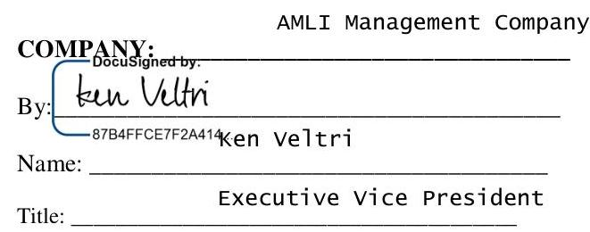

# GREEN MOUNTAIN ENERGY COMPANY CONTINUOUS 

## ENERGY SERVICES AGREEMENT - BUNDLED

This CONTINUOUS ENERGY SERVICES AGREEMENT is between GREEN MOUNTAIN ENERGY COMPANY ("Green Mountain") and AMLI Management Co ("Company") and is effective as of the Service Date on Exhibit A.

## BACKGROUND:

Company is the owner, manager, or rental agent for certain multi-family housing properties. For those properties, excluding occupied Units, Company is the exclusive entity responsible for purchasing electricity for those properties and selecting and designating a certified retail electric provider. Green Mountain is a retail electric provider which supplies retail electric service in certain electric service territories within the State of Texas. Subject to the terms and conditions set forth below, Green Mountain desires to sell to Company, and Company desires to buy from Green Mountain, electric energy and associated services for the multi-family housing properties described herein.

## AGREEMENT

NOW, THEREFORE, in consideration of the mutual promises and undertakings set forth in this Agreement, the parties hereby agree as follows:

## 1. Definitions.

(a) "Change in Law" means any revisions in, implementation of, amendment to, interpretation of, or enactment or adoption of any Law affecting approved or anticipated rates, meter classifications or profiles, tariffs, taxes, charges, fees, credit requirements or assessments, the wholesale or retail energy market, licensing, supply, generation, transmission or delivery of energy, including, without limitation, any material change in ERCOT Congestion Zones or Commercially Significant Constraint (as those terms are defined in the ERCOT Protocols).
(b) "Full Term Requirements" means that neither Party will, without liability, be relieved of its obligation to sell and deliver, or purchase and receive all electric energy consumed at the Facilities except to the extent that, and for the period during which, that performance is (i) terminated in accordance with the provisions of this Agreement (ii) prevented by causes of Force Majeure or (iii) curtailed by for any reason by the Electric Reliability Council of Texas ("ERCOT")
(c) "Law" means any law, rule, regulation, ordinance, statute, judicial decision or administrative order of any state or federal regulatory agency or court having jurisdiction; and any rule, protocol, provision or similar requirement of ERCOT or any other transmission independent system operator, power pool or regional transmission organization, or any successor organization, group, agency, corporation or body, including, without limitation, the ERCOT Operating Guides, the ERCOT Protocols, any TDSP Tariffs, and any similar documents, decisions or requirements.
(d) "Taxes and Fees" means (i) any and all existing or new ad valorem, property, occupation, generation, privilege, sales, use, consumption, excise, lease, transaction, municipal, utility, utility use, regulatory, BTU, energy, gross receipts, public utility assessment and other taxes (other than income taxes or franchise taxes), or any other tax costs, including, without limitation, any license fees, administrative fees, permit fees, energy resource surcharges, public land use surcharges and other fees, surcharges, uplifts and impositions.
(e) "TDSP Discretionary Charges" means any charges imposed by the TDSP for services, repairs or additional equipment needed for Company's electric service or requested by or on behalf of Company, and any similar or related charges the TDSP may impose from time to time.

# 2. Selection; Purchase and Sale. 

(a) Company selects Green Mountain as its exclusive Firm Full Requirements retail electric provider for electric service pursuant to the terms and conditions of this Agreement. Green Mountain agrees to sell to Company, and Company agrees to purchase, electric energy (including the associated electric services) to meet the Firm Full Requirements for electric energy at the multi-family housing properties, set forth on Exhibit A, as it may be amended from time-to-time to either add or delete properties (the "Facilities"). Green Mountain and Company each acknowledges and agrees that retail electric service to Company under this Agreement will only be to the vacant Units at the Facilities.
(b) Company must (i) add to this Agreement all Facilities in the Market Area that it acquires through any means and (ii) delete Facilities in the Market Area that is sells. Company will notify Green Mountain at least 20 days before Company's facility either becomes a Facility or is deleted as a Facility and the parties will enter into an amended Exhibit A reflecting the change. If Company adds a Facility, for purposes of Exhibit A, Company must also use reasonable efforts to provide Green Mountain with the required enrollment information for the new facility. Within 30 days after Green Mountain has received Customer's notice and all required information, Green Mountain will enroll the new Facility for electric energy service by Green Mountain or delete the Facility from Exhibit A, as applicable. Company will assist Green Mountain in obtaining signatures and other appropriate information regarding the Facility or Company necessary to secure the enrollment.
3. No Other Electric Services. Notwithstanding any provision contained herein, Green Mountain's services to the Company shall not include any electric energy distribution, transmission and related services.
4. Product Description. Included in the purchase of this electricity product, Green Mountain will ensure that electricity equals $100 \%$ of Company's paid electricity usage under this Agreement is produced by renewable resources. Green Mountain does so by purchasing and retiring renewable energy certificates or attributes from specific renewable generation facilities serving the national power grid. Company understands and acknowledges that Company will not have electricity from a specific generation facility delivered directly to its Facilities. Resource availability varies hour to hour and from season to season. Green Mountain will rely on system power from the grid to serve Company's minute by minute consumption but will match the applicable percentage of Company's actual paid electricity use under this Agreement on an annual basis with renewable energy certificates from renewable resources delivering energy to power systems serving the United States. Notwithstanding the foregoing, Green Mountain reserves the right to change the product content (including generation resources) without prior notice to, or the consent of, Company so long as the resulting generation mix is less polluting than average Texas system power.

## 5. Purchase Price.

(a) For all electric energy (including associated electric services) provided by Green Mountain hereunder, Company shall pay to Green Mountain the following:
(i) an energy charge of $\$ 0.074$ per kWh (which includes TDSP Delivery Charges); plus
(ii) a base charge of $\$ 2.95$ per month (or portion thereof) per meter; plus
(iii) the pass-through of any TDSP Discretionary Charges assessed by the applicable TDSP; plus
(iv) all Taxes and Fees.
(b) The per kWh energy charge stated in Section 5(a)(i) is a fixed price that will not change during the Minimum Term for any reason other than as a result of a Change in Law or a change in regulatory or ERCOT approved charges (such as, but not limited to, changes in PUCT-approved TDSP Delivery Charges or changes to ERCOT fees or charges).
(c) Upon the expiration of the Minimum Term, unless otherwise agreed in writing between Company and Green Mountain or otherwise indicated in a change in terms made by Green Mountain pursuant to Section 10, the price applicable for periods after the expiration of the Minimum Term will be a variable price that may vary on a monthly basis at Green Mountain's discretion with notice from Green Mountain in accordance with Section 10.

# 6. Billing and Payment. 

(a) Green Mountain will generate a consolidated bill for each Facility each calendar month, in a format that includes the Green Mountain charges and rate, Company's usage, the applicable base monthly charges, and any other charges provided for in this Agreement. Bills are due on or before the date that is 30 days from the issuance date on the bill. Bills shall be deemed past due and delinquent if payment in full is not received and posted to the applicable Company account(s) by the close of business on the day the bill is due. Green Mountain may assess a late charge equal to five percent (5\%) of any month's past due charges. Green Mountain's acceptance of a partial payment from Company will not relieve Company of its obligation to pay the full amount owed. Green Mountain reserves the right to pursue all legal methods to collect any amounts owed. If, after proper notice and cure period pursuant to Section 9 of this Agreement, Company has failed to pay, Green Mountain may terminate this Agreement and/or disconnect electric service for nonpayment. Company shall be liable for any and all reasonable attorney fees, and collection costs and expenses incurred by Green Mountain. Green Mountain further reserves the right to include on Company's bills any charges or credits necessary to correct any billing errors, whether resulting from a meter reading error, miscalculation of applicable taxes or fees or other error or omission. Green Mountain may bill Company an estimated bill for any month of service for which usage data is not timely available from the TDSP and such charges will be trued up to reflect actual usage when such data becomes available. Company acknowledges that billing matters are subject to problems related to ERCOT operations and/or TDSPs which are outside the reasonable control of Green Mountain.
(b) If Company has any questions or any dispute regarding the Green Mountain Energy electricity charges on the bill or payments with respect to Company's account, Company shall provide Green Mountain a written explanation of the basis for any dispute no later than 30 days after the date of the invoice to VIP@GreenMountain.com. Green Mountain will respond or investigate the matter promptly and report its findings to Company. Company will pay the undisputed portion of the bill by the due date. Company will not be required to pay any portion of Company's billing disputed in good faith while Green Mountain investigates and before Green Mountain's report of its findings to Company. If, after investigation, Green Mountain determines that the disputed amount is owed by Company, that amount shall be paid to Green Mountain within 10 days after that determination, together with all late charges.
7. Taxes and Fees. Company shall be responsible for all Taxes and Fees. As reasonably and lawfully determined by Green Mountain, any or all such Taxes and Fees may be collected by Green Mountain and remitted to the applicable taxing authority or entity assessing such fees.
8. Continuous Electric Service for Units. Company will establish accounts with Green Mountain for all Units in the Facilities when those Units are not occupied by residents in order to continue electric service to those Units during the vacancy period. "Unit" means the individual residential Units in the Facilities listed on Exhibit A. During each period when a Unit is not occupied by a resident, and following a request by the Unit's resident to discontinue service at that Unit (an "Interim Period"), Green Mountain will, upon receipt of notification from ERCOT, establish an account related to that Unit in Company's name as of the effective date of termination of service by the resident. Company will thereby be Green Mountain's customer with respect to the sale and delivery of electric service to that Unit at the applicable purchase price set forth in Section 5. The purpose of these provisions is to provide for continuity of service to Units during Interim Periods. This Agreement does not limit or otherwise affect Green Mountain's rights to discontinue or terminate electric service to a Unit or to Company pursuant to the terms set forth herein, nor does this Agreement limit or otherwise affect the liability of any person who is or has been a resident of a Unit to Green Mountain. This Agreement will not apply during those periods after a resident's service has been discontinued due to nonpayment by the resident. In those cases, Company must specifically request that electric service be established in Company's name, as the continuous service for these Units does not apply. Company must pay for all applicable charges for the reconnection or establishment of service, but will not be required to pay for any delinquent service bills which were unpaid by the resident. Company agrees that it will not request that Green Mountain turn off electric service to Units on a temporary, seasonal basis. Green Mountain will have no obligation to comply with any request from Company for a seasonal turn-off.

## 9. Term: Termination.

(a) Term. Service under this Agreement will begin on the Service Start Date for each Facility as indicated on Exhibit A ("Start Date"). Subject to termination of this Agreement as provided in Section 9(b), this Agreement is effective on the Effective Date and will continue for 36 months after the Start Date applicable to each Facility ("Minimum Term"). Upon the expiration of the Minimum Term, this Agreement will continue indefinitely on a month-

to-month basis ("Renewal Term"), unless and until (i) either party terminates this Agreement by giving the other party 30 days advance written notice; (ii) Company and Green Mountain agree in writing to renew or continue service at a different rate or pricing plan; or (iii) Green Mountain notifies Company in writing of a change in the Agreement as provided in Section 10. The Minimum Term and Renewal Term are referred to as the "Term."
(b) Termination. If this Agreement is terminated as provided in this Section 9, that termination will relieve Green Mountain from any further obligations to deliver electric service hereunder effective immediately upon the termination date and Green Mountain may, at its election, disconnect Company's electric service, and/or execute "move-out" transactions with respect to Company ESI IDs served under this Agreement. Without limiting the generality of the forgoing, if Company defaults or Company terminates this Agreement (in whole or in part) before the end of the Term, Green Mountain shall, in addition to these termination rights, have the right to recover damages from Company, including, without limitation any amounts Company owes Green Mountain through the remaining Term of this Agreement and any reasonable costs or expenses which Green Mountain incurs on account of such termination including, without limitation, any collection costs and expenses, any fees and costs of investigation, any reasonable attorney fees and expenses referred to in Section 5, and any other damages, fees, costs or penalties payable by Green Mountain to any of its suppliers of electricity and related services.

The Term of this Agreement is subject to termination under any of the following provisions:
(i) Either party's breach of a material term or condition of this Agreement shall constitute an event of default ("Event of Default"). If an Event of Default is not cured by the defaulting party to the reasonable satisfaction of the non-defaulting party within 20 days after the defaulting party's receipt of written notice describing in reasonable detail the facts, nature and circumstances giving rise to the alleged Event of Default, then the non-defaulting party may, at its sole election, terminate this Agreement by giving written notice to the defaulting party, and that termination will be effective on the date stated in that notice. If the non-defaulting party does not terminate this Agreement within 60 days after delivery of its notice of the Event of Default, then the non-defaulting party's right to terminate this Agreement will be deemed waived with respect to that specific Event of Default. Notwithstanding the forgoing, the cure period for any failure by Company to make a payment when due shall be five days instead of 20 days.
(ii) Either party may terminate this Agreement, upon written notice of termination as promptly as reasonably possible, without liability to the other, if any unforeseen ERCOT, judicial, regulatory or legislative action or change renders performance of this Agreement impossible or illegal.
(iii) If any of the following events occurs, either party may terminate this Agreement immediately upon providing written notice to the other party:
(A) the commencement of any bankruptcy (other than an involuntary bankruptcy petition which is dismissed within 60 days), insolvency, reorganization, dissolution, liquidation of debt, receivership or conservatorship proceeding or other similar proceeding under federal or state bankruptcy, debtors' relief, bank regulatory or other law by or against the other party; or
(B) the suspension or termination of a substantial part of a party's business, the dissolution of a party, or the appointment of a receiver, conservator, trustee or similar officer to take charge of, a substantial part of the property of the other party.
(c) Early Termination by Company. Any sale, assignment or other transfer of a Facility by Company where the purchaser, assignee, or transferee of that Facility does not assume this Agreement with respect to that Facility in accordance with this Agreement, will constitute a partial early termination of this Agreement by Company with respect to that Facility and a default under this Agreement if a 30 day written notice to cancel the contract is not submitted to Green Mountain Energy. Partial default or partial early termination charges will be calculated the same as those for a complete default or early termination as provided in Section 9(d), except the calculation will apply only to the Units in those Facilities affected by the partial default or partial early termination. Exhibit A will be deemed automatically amended to reflect the change in Facility ownership and this Agreement will remain in effect as to the remaining Company Facilities.
(d) Effect of Termination: If Green Mountain terminates this Agreement because of any uncured Company default or,

if this Agreement terminates because any Related Agreement is terminated for default or breach by Company under that Related Agreement or, if Company terminates this Agreement (in whole or in part, including with respect to one or more Facilities or meters covered by this Agreement) before the end of the Term, then Company will owe and promptly pay to Green Mountain an Early Termination Charge equal to the following

- Under 100 Units - \$1,000
- 100-500 Units - \$3,000
- 500 Units - \$5,000
(e) Payments. If this Agreement expires or is terminated, Customer must pay Green Mountain all amounts due and owing for services provided through date of termination.

10. Changes to Agreement. After the Minimum Term expires, Green Mountain may at any time propose to change the pricing or other terms and conditions of this Agreement. Green Mountain will send Company a written notice at least 30 days before the effective date of any change. If any change is not acceptable to Company, Company may cancel this Agreement by giving Green Mountain 30 days advance written notice and switching to another retail electric provider. If Company does not cancel this Agreement and switch to another retail electric provider, Green Mountain will continue to provide service under this Agreement as modified by Green Mountain's change in pricing or other terms on the effective date indicated in its notice. If at any time after the Effective Date there is a Change in Law, Green Mountain may, adjust the price as provided in Section 16. 11. No Warranties. GREEN MOUNTAIN MAKES NO REPRESENTATIONS OR WARRANTIES OTHER THAN THOSE EXPRESSLY SET FORTH IN THIS AGREEMENT, IF ANY, AND GREEN MOUNTAIN EXPRESSLY DISCLAIMS ALL OTHER WARRANTIES, EXPRESS OR IMPLIED, INCLUDING MERCHANTABILITY AND FITNESS FOR A PARTICULAR PURPOSE.
11. Notices. Except as otherwise provided herein, all notices must be in writing and be delivered to the applicable party at the address specified for that party in this Section, either in person, by U.S. mail certified or registered mail, return receipt requested, or by nationally recognized express courier or delivery service. Notices are deemed given upon delivery to the applicable address set forth below (or at such other address of which a Party is notified from time-to-time in accordance with this Section.

Green Mountain Energy Company
ATTN: Dorinda Maier
2745 Dallas Parkway, Ste 200
Plano, TX 75093

Company Notice Information:
AMLI Management Company
141 West Jackson, Ste 300
Chicago, IL 60604

Either party may change its notice information by giving notice to the other party in accordance with these provisions. Notices are deemed received on the day delivered, or if that day is not a business day, as of the beginning of the first business day following the day delivered.
12. Limitation of Liability: Force Majeure. Neither party shall in any event be liable for any special, indirect, incidental, punitive, exemplary or consequential damages, or any damages whatsoever resulting from loss of use, data or profits, arising out of or in connection with either party's performance or non-performance under this Agreement or for any other reason, regardless of the form of action, whether in contract or tort or otherwise (including, without limitation, negligence, strict liability or otherwise), whether or not such damages are foreseen or either party has been advised of the possibility of such damages. Green Mountain will endeavor in a

commercially reasonable manner to provide service, but Green Mountain does not guarantee a continuous supply of electrical energy. Events that are out of Green Mountain's control ("Force Majeure" events) may result in interruptions in service. Green Mountain will not be liable for any such interruptions. Green Mountain does not generate Company's electricity, nor does Green Mountain transmit or distribute electricity to Company. Therefore, Company agrees that Green Mountain is not liable for damages caused by events of Force Majeure, including acts of God, acts of any governmental authority, including the PUCT or ERCOT, accidents strikes, labor trouble, required maintenance work, inability to access the TDSP's system, nonperformance of the TDSP, delay of deregulation or changes in laws, rules, regulations, practices or procedures of any governmental authority or ERCOT, or any cause beyond Green Mountain's control. If a Force Majeure event occurs that makes it impossible for Green Mountain to perform under this Agreement, Green Mountain's performance under this Agreement and, to the extent of such non-performance only, the corresponding requirement for payment therefore by Company, shall be excused for the duration of such event.
13. Waiver of Small Commercial/Consumer Rights. Company hereby represents and warrants that Company is a non-residential customer with a peak demand of at least fifty (50) kilowatts during any 12 -month period and Company is not a small commercial customer as such term is defined in subchapter 25.471 et seq. of the PUC's Substantive Rules (as amended). To the extent permitted by Law, Customer agrees that the Customer Protection Rules adopted by the PUCT pursuant to the PURA do not apply to this Agreement and that this Agreement will govern any conflict between it and the Customer Protection Rules, except for the rules contained in Sections 25.481 (regarding unauthorized charges), 25.485 (regarding customer access and complaint handling) and 25.495 (regarding unauthorized switches). Company understands that Company has the right to consult an attorney of Company's own selection and that Company has voluntarily consented to this waiver.

# 14. Assignment. 

(a) Neither party may assign or transfer all or any part of this Agreement or any of its rights or obligations under this Agreement without the prior written consent of the other party, which consent shall not be unreasonably withheld or delayed, except as set forth in Sections 15(b) or (c). Any purported assignment or transfer of all or any part of this Agreement or any rights or obligations hereunder, without that consent, will be null and void from the outset. This Agreement will bind, benefit and be enforceable by and against both parties and their respective successors and consented to assigns.
(b) Green Mountain may, without Company's consent (a) transfer, sell, pledge, encumber, collaterally assign or assign this Agreement or the accounts, revenues or proceeds hereof in connection with any financing, financial arrangements or power supply transaction; and/or (b) assign this Agreement to any entity either succeeding to all or substantially all of Green Mountain's business or assets.
(c) Company agrees that upon the sale or transfer of any Facility, all of its rights and obligations under this Agreement with respect to that Facility will be assigned to and assumed by the purchaser or transferee of that Facility (the "New Owner"), subject to the following: (i) Company will notify Green Mountain in writing of the Facilities to be transferred and the proposed assignment and assumption, as soon as practicable; (ii) any such assignment and assumption will be subject to the New Owner meeting Green Mountain's reasonable credit requirements and/or paying a deposit or providing other security as requested by Green Mountain; and (iii) Company will provide Green Mountain with information it has available about the prospective transferee or assignee in order for Green Mountain to process the assignment and assumption. Upon any sale or transfer of a Facility by Company and the assignment to and assumption of this Agreement by the New Owner of that Facility, the parties hereto will promptly amend this Agreement to reflect the then-current Facilities covered by this Agreement. Any assignment and assumption of this Agreement shall be evidenced by the execution of an Assignment Addendum substantially in the form attached as Exhibit B. Any assignment and assumption will fully bind the New Owner to all of the terms and conditions of this Agreement, and will fully terminate any and all obligations, liabilities, rights and privileges of Company under this Agreement, but only to the extent of and with respect to the transferred Facilities, except with regard to any unpaid debts hereunder accruing before the assignment, and the rights and obligations of the parties related to a breach by either party that occurred before the assignment. Notwithstanding the forgoing or any other provision of this Agreement, if Company sells or transfers a Facility to a New Owner and the New Owner does not agree in writing to assume and perform Company's obligations under this Agreement with respect to the transferred Facility and/or the assignment does not meet all requirements set forth in this Section 15, then, in addition to any other rights and remedies of Green Mountain, Green

Mountain may terminate the Agreement as to such Facility, by giving 10 days advance written notice to Company and Customer will pay the Early Termination Charge applicable to that Facility.
15. Change in Law: Other Material Change. If at any time after the Effective Date there is a Change in Law or a material increase in the amount of electricity consumed under this Agreement, Green Mountain may without prior notice to Company, adjust the price and other charges payable by Company under this Agreement, but only to the extent the adjustment reflects Green Mountain's actual incremental or unavoidable costs resulting from the Change in Law or increase in the number of demand meters or consumption, as applicable.
16. Miscellaneous. This Agreement constitutes the entire understanding between the parties concerning the subject matter hereof and supersedes all prior or contemporaneous agreements, understandings or commitments related to its subject matter. If any provision of this Agreement is deemed to be invalid, illegal or otherwise unenforceable, the parties agree that it shall be modified to the minimum extent necessary to ensure that the essential terms and conditions of this Agreement for both parties remain valid, legal and enforceable. Company shall keep confidential the purchase price set forth in Section 5. Green Mountain makes no representation or warranties to Company about Green Mountain or any of its services unless specifically set forth herein. This Agreement may only be modified or amended by a writing signed by both parties. All Exhibits attached hereto are incorporated by reference. Each party is an independent contractor and nothing under this Agreement shall be construed to create a relationship of partnership, principal/agent, joint venturers or any other implied relationship. This Agreement may be executed in counterparts, each of which will be deemed to be an original, and all of which will constitute one and the same agreement. Each party will be authorized to rely upon the signatures on this Agreement that are delivered by facsimile or other reliable electronic means, such as in .pdf or .jpg format, as constituting a duly authorized, irrevocable, actual delivery of this Agreement with original ink signatures of each person and entity. This Agreement will be governed by, and construed and enforced in accordance with, the laws of the State of Texas, without regard to its provisions governing conflicts of laws.

IN WITNESS WHEREOF, the parties have caused this Energy Services Agreement to be executed by their duly authorized representatives as of the date first written above.

# GREEN MOUNTAIN ENERGY COMPANY 

Name: Mark Parsons
Title: Vice President

The image is a photo of a document signature section. It includes the following text:

- "AMLI Management Company"
- "COMPANY:"
- "By: ken Veltri" (with "DocuSigned by:" above the signature)
- "87B4FFCE7F2A414" (below the signature)
- "Ken Veltri"
- "Name: __________________________"
- "Title: Executive Vice President"
- "Title: __________________________"

Exhibit A
to
Continuous Energy Services Agreement

# List of Facilities 

The following properties are subject to the Agreement:

| Property Name | Units Phone | TDSP | Property Address | City | Zip | Start |
| :--: | :--: | :--: | :--: | :--: | :--: | :--: |
| AMU 2121 | 430 713-529-7700 | CNP | 2121 Allen Pkwy | Houston | 77019 | 6/1/2020 |
| AMU Addison | 349 469-450-3061 | ONC | 15250 Quorum Dr | Addison | 75001 | 6/1/2020 |
| AMU at City Vista | 404 713-526-2211 | CNP | 2221 W DALLAS ST | Houston | 77019 | 6/1/2020 |
| AMU at Escena | 330 972-910-0332 | ONC | 6401 Escena Blvd | Irving | 75039 | 6/1/2020 |
| AMU at Escena Ph II | 110 972-910-0332 | ONC | 6401 Escena Blvd | Irving | 75039 | 6/1/2020 |
| AMU at Memorial | 380 713-862-9400 | CNP | 3003 MEMORIAL CT | Houston | 77007 | 6/1/2020 |
| AMU at The Ballpark | 332 469-888-7100 | ONC | 7755 John Q Hammons | Frisco | 75034 | 6/1/2020 |
| AMU Campion Trail | 483 972-910-0316 | ONC | 777 LAKE CAROLYN PKWY | Irving | 75039 | 6/1/2020 |
| AMU Design District | 314 214-658-1400 | ONC | 1400 HI LINE DR | Dallas | 75207 | 6/1/2020 |
| AMU Frisco Crossing | 366 972-763-8444 | ONC | 7275 TEXAS RANGERS DR | Frisco | 75034 | 6/1/2020 |
| AMU Las Colinas | 341 972-402-0007 | ONC | 1050 Lake Carolyn Pkwy | Irving | 75039 | 6/1/2020 |
| AMU on Maple | 300 214-351-9800 | ONC | 6008 Maple Ave | Dallas | 75235 | 6/1/2020 |
| AMU on Riverside | 324 972-599-0342 | ONC | 310 GRAN VIA | Irving | 75039 | 6/1/2020 |
| AMU Quadrangle | 220 214-975-0111 | ONC | 2717 Howell | Dallas | 75204 | 6/1/2020 |
| Amli River Oaks | 275 855-577-6691 | CNP | 1340 W Gray St | Houston | 77019 | 6/1/2020 |
| AMU Uptown | 238 713-960-4970 | CNP | 2525 McCue Rd | Houston | 77056 | 6/1/2020 |
| AMU West Plano | 264 972-599-1360 | ONC | 5961 W PARKER RD | Plano | 75093 | 6/1/2020 |
| Total | 5460 |  |  |  |  |  |

Billing Address:
C/O Conservice
PO Box 4697
Logan, UT 84323

Exhibit B

# ASSIGNMENT AND ASSUMPTION AGREEMENT 

This Assignment and Assumption Agreement ("Assignment Agreement") is by and among Green Mountain Energy Company ("Green Mountain"), $\qquad$ , with its principal office at $\qquad$ ,

for itself and as authorized agent for the respective owners of certain multi-family housing properties (the "Assignor"), and $\qquad$ , with its principal office at $\qquad$ ("Assignee") and is effective on the date signed by the last party to sign it as indicated by the dates in the respective signature blocks (the "Effective Date").

WHEREAS, Green Mountain and Assignor are parties to a Green Mountain Energy Company Continuous Energy Services Agreement dated $\qquad$ ("Agreement") pursuant to which Green Mountain agrees to provide and Assignor agrees to purchase electric energy services for certain multi-family housing properties covered by the Agreement ("Facilities"); and

WHEREAS, one or more of the Facilities covered by the Agreement, as identified on Exhibit A to this Assignment Agreement, has been sold by Assignor to Assignee (each a "Transferred Facility" and together the "Transferred Facilities"); and

WHEREAS, Assignor desires to assign, and Assignee desires to assume, all of Assignor's interest, rights and obligations under the Agreement solely with respect to the Transferred Facilities;

NOW, THEREFORE, in consideration of the foregoing and of the mutual promises and undertakings set forth in this Assignment Agreement, and for other good and valuable consideration, the receipt and sufficiency of which are hereby acknowledged, the parties agree as follows:

1. Assignor Assignment. Assignor hereby assigns to Assignee all of Assignor's rights under and interest in, and delegates to Assignee all of Assignor's duties and obligations under, the Agreement solely with respect to the Transferred Facility.
2. Assignee Assumption. Assignee hereby assumes and agrees to perform all of Assignor's duties and obligations under the Agreement solely with respect to the Transferred Facility arising from and after the time of such assumption, and agrees to be bound by all of the provisions of the Agreement.
3. Other Agreements. Assignor, Assignee and Green Mountain agree to take such further actions as may be reasonably requested by a party to effect and/or further document the transactions contemplated by this Assignment Agreement, including the execution of a separate Green Mountain Continuous Energy Services Agreement between Green Mountain and Assignee, in substantially the same form as the Agreement, covering the Transferred Facility.
4. Green Mountain Acknowledgement. Subject to the terms of this Assignment Agreement, Green Mountain hereby acknowledges and consents to the assignment by Assignor, and assumption by Assignee, , of all of Assignor's interest, rights and obligations under the Agreement solely with respect to the Transferred Facility
5. Assignment. Neither party may assign this Assignment Agreement or any of its rights or obligations under this Assignment Agreement without the prior written consent of the other party, which consent shall not be unreasonably withheld. Any purported assignment of this Assignment Agreement or any rights or obligations hereunder, without such consent, shall be null and void from the outset. Subject to the foregoing, this Assignment Agreement shall be binding upon, and shall inure to the benefit of, the parties and their respective successors and permitted assigns.
6. Amendment; Waiver. This Assignment Agreement may be amended or modified only by a written instrument signed by each of the parties hereto. No waiver of any provision of this Assignment Agreement shall be effective unless set forth in a written instrument signed by the waiving party. Any failure by any party to this Assignment Agreement to enforce at any time any term or condition of this Assignment Agreement shall not be considered a waiver of that party's right thereafter to enforce each and every term and condition of this Assignment Agreement.
7. Governing Law. This Assignment Agreement shall be governed by, and construed and enforced in accordance with, the laws of the State of Texas, without regard to its provisions governing conflicts of laws.
8. Entire Agreement. This Assignment Agreement and the Ancillary Agreements constitute the final and entire agreement of the parties with respect to the subject matter of this Assignment Agreement and such Ancillary

Agreements, and supersede all prior and contemporaneous written or oral agreements, understandings, commitments or representations with respect to such subject matter.
9. Counterparts. This Assignment Agreement may be signed in multiple counterparts, by facsimile or otherwise, each of which shall constitute an original, and all of which, taken together, shall constitute one and the same agreement. Each party hereto shall be authorized to rely upon the signatures on this Agreement that are delivered by facsimile or other reliable electronic means as constituting a duly authorized, irrevocable, actual delivery of this Agreement with original ink signatures of each person and entity.

IN WITNESS WHEREOF, the parties have caused this Assignment and Assumption Agreement to be executed by their duly authorized representatives as of the date first written above.

ASSIGNOR:

By:
Name:
Title:
Date:

ASSIGNEE:

By:
Name:
Title:
Date:

GREEN MOUNTAIN ENERGY COMPANY

By:
Name:
Title:
Date:

