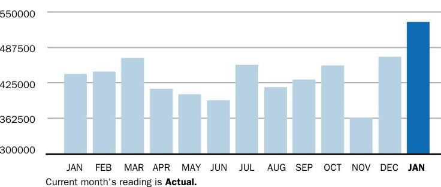

## $\stackrel{\rightharpoonup}{r}$   Constellation

Arkema, Inc. - 0640166043
12840 S PULASKI RD
ALSIP, IL 60803-1917
PO 4501185294

| Rate Plan: | Flexible Index Solutions |
| :--: | :--: |
| Account ID: | 10728917 |
| Utility Number: | 0640166043 |
| Service Period: | 12/22/2023 to 1/25/2024 |
| Statement Number: | 67516528101 |

## HOW WE CALCULATED YOUR BILL

See reverse side for detailed description of charges

UDC Charges
$\$ 28,486.81$

Market Charges
$\$ 5,320.63$

CONSUMPTION HISTORY

The image is a bar chart.

- **Chart Type**: Bar chart
- **X-Axis**: Months (JAN, FEB, MAR, APR, MAY, JUN, JUL, AUG, SEP, OCT, NOV, DEC, JAN)
- **Y-Axis**: No title, but values range from 300,000 to 550,000
- **Data Points**: 
  - JAN: Approximately 532,895
  - FEB: Approximately 425,000
  - MAR: Approximately 425,000
  - APR: Approximately 362,500
  - MAY: Approximately 362,500
  - JUN: Approximately 362,500
  - JUL: Approximately 487,500
  - AUG: Approximately 425,000
  - SEP: Approximately 425,000
  - OCT: Approximately 362,500
  - NOV: Approximately 425,000
  - DEC: Approximately 425,000
  - JAN: Approximately 532,895
- **Legend/Note**: "Current month's reading is Actual."
- **Styling**: The bar for the current month (JAN) is highlighted in a darker shade. 

This represents a **yearly usage breakdown (monthly-based)**.

## MONTHLY USAGE

Current Month 532,895 kWh
A $21.0 \%$ from last year

Last Month
471,446
kWh

| Last Year |
| :-- |
| 440,771 |
| kWh |

You can also pay your bill online - go to Energy Manager at https://energymanager.constellation.com to get started. It's fast, simple and secure. Detach stub and enclose with your payment in return envelope. Please write your statement number on your check. Thank you for your payment!

## $\stackrel{\rightharpoonup}{r}$   Constellation

PO Box 4911
Houston, TX 77210-4911

PO 4501098098
Arkema, Inc.
PO BOX 62207
KING OF PRUSSIA PA 19406-3797

## Monthly Invoice

Statement Date: 01/26/2024
Customer Number: 7305573-14

Total Amount Due by 02/16/2024 \$69,109.03

## $\begin{array}{ll}\text { AMOUNT } & \\ \text { ENCLOSED } & \end{array} \quad \end{array}$

MAKE CHECKS PAYABLE TO:
CONSTELLATION NEWENERGY, INC.
PO BOX 4640
CAROL STREAM IL 60197-4640

# HAVE A QUESTION OR EMERGENCY? 

To Contact Your Local Utility
Commonwealth Edison
800-334-7661
For Customer Care Contact Constellation
Website
Email
Phone
https://energymanager.constellation.com
customercare@constellation.com
844-6ENERGY (844-636-3749)

| Meter Number: | SERVICE PERIOD START | SERVICE PERIOD END | USAGE |
| :--: | :--: | :--: | :--: |
|  | $12 / 22 / 2023$ | 01/25/2024 | 532,894.570 |

## DETAILED CHARGES

## Contract Charges

Retail Service Charge
438505.64209 - Electric Percent of Load RTT 7x24 50 PERCENT OF LOAD

445431.64209 - Electric Percent of Load RTT 7x24 25 PERCENT OF LOAD

Subtotal Contract Charges
Market Charges
Market Energy - Day Ahead
Renewable Portfolio Standards
Subtotal Market Charges

## UDC Charges

Subtotal UDC Charges
Total New Charges

## $\$ 69,109.03$

## Message Center

Thank you for your prompt payment. A finance charge of $1.5 \%$ per month may be assessed on all past due invoices.

## Other Ways to Pay Your Bill

## Energy Manager

Manage your account at:
https://energymanager.constellation.com

## Phone

Call 844-6ENERGY (844-636-3749)
for our 24/7
phone payment option

## $A \mathrm{ACH} /$ WIRE

CONSTELLATION NEWENERGY, INC.
ACH/WIRE: WELLS FARGO, ABA 121000248 /
ACCOUNT 4879656445
ACH/WIRE NOTIFICATION:
PAYMENTS@CONSTELLATION.COM

# Message Center (Con't) 

Thank you for choosing Constellation as your electric supplier.
To ensure timely application of your payment, please include your Statement Number on your payment remittance. Thank you for being a valued Constellation Customer!

Adjustments: Any adjustments that were made to your account within the invoice period. Adjustments may be made for a variety of reasons, including special contract calculations, corrections to prior bills, or settlement of disputed charges.
Administration Fee or Service Charge: The fee or charge set forth for each account per billing cycle.
Ancillary Service Charges: Charges regarding ancillary services as set forth in the applicable Independent Service Operator (ISO) Open Access Transmission Tariff (OATT) and for other ISO costs not included in the definition of Capacity Costs, Energy Costs, and Transmission Costs. Generally, these costs are associated with ensuring the reliability of the electrical grid.
Capacity Charge: Charge for fulfilling the capacity requirements for the Account(s) imposed by the ISO or otherwise. Generally, these costs are associated with ensuring there is enough generating capacity available now and in the future to meet customer requirements.
Energy Charge - Non-Time of Use (TOU): Charge per kWh for electricity supplied for all hours of each day.
Kilowatt Hour (kWh): A measure of the quantity of electricity (energy) that you use.
Late Fees or Finance Charges: Additional charges assessed to accounts for late payment of invoices. Payment terms and charge calculations are specified in your contract.
Line Loss Charges: The cost associated with the loss of electricity as it travels over the transmission and distribution wires.
Reliability Must Run (RMR): Ancillary service administered by the ISO. Generation resources scheduled to operate out-of-merit order and identified by the ISO as necessary to preserve regional system reliability. Renewable Portfolio Standards Cost (RPS): NewEnergy's cost of procuring renewable energy to comply with Renewable Portfolio Standards (RPS) requirements, usually established by individual states. Generally, these costs are associated with requirements to support generating units that produce power using renewable fuels such as water (hydro-electric) and solar.
Retail Service Charge: A contracted charge for supplying electricity to an account, based upon total kWh consumption per billing cycle.

Retail Trade Transaction (RTT): The fixed unit Price and Quantity for a specific commodity for a specific delivery point and pattern.
Transmission Service Charge: The charge for Network Transmission Service as identified in the applicable OATT Tariff for the provision of transmission service by the ISO within the Utility's service territory. Generally, these costs are associated with building and maintaining the electric transmission lines.

You may access the Environmental Disclosure information on our website http://www.constellation.com/disclosures

Disputed Invoices: Should you question any portion of your Constellation NewEnergy invoice, please call 844-6ENERGY (844-636-3749) Monday to Friday BAM-6PM Eastern Time, email , or write to: Constellation NewEnergy, c/o Customer Care, PO Box 4911 Houston, TX 77210-4911. If you have a billing dispute that you are not able to resolve with Constellation NewEnergy you may file a complaint with the Illinois Commerce Commission (ICC). The ICC can be reached by phone at 217-782-7434, or you may visit their website at www.icc.illinois.gov.

In the event of a service interruption or electric emergency, please contact your utility directly at: Commonwealth Edison 800-334-7661

DISCLAIMER: General Understanding - This glossary is for informational purposes only. Please refer to your agreement with us for the defined terms that govern the contractual obligations applicable to us supplying you. Not all defined terms set forth above may be applicable to your agreement with Constellation NewEnergy.

# UTILITY DISTRIBUTION CHARGES 

BillingGroup Name Arkema, Inc.
Service Location 12840 S PULASKI RD

Commonwealth Edison Account ID: 0640166043
Amount Due \$28,486.81

## METER READINGS

|  |  | METER READING |  |  |  |  |
| :-- | :-- | :-- | :-- | :-- | :-- | :-- |
| READ DATE | METER NO. | LOAD TYPE | READING TYPE | PREVIOUS | PRESENT | MULTIPLY X | USAGE |
| 01/25/2024 | 230129022 | General Service | Pk kW | Actual | Actual |  | $\mathbf{6 3 . 9 6 0}$ |
| 01/25/2024 | 230129022 | General Service | Total kWh | Actual | Actual |  | $\mathbf{1 0 2 . 3 2 4}$ |
| 01/25/2024 | 230130460 | General Service | Pk kW | Actual | Actual |  | $\mathbf{8 6 8 . 3 2 0}$ |
| 01/25/2024 | 230130460 | General Service | Total kWh | Actual | Actual |  | $\mathbf{5 3 2 , 7 7 3 , 6 7 2}$ |
| 01/25/2024 | 272143126 | General Service | Pk kW | Actual | Actual |  | 0.105 |
| 01/25/2024 | 272143126 | General Service | Total kWh | Actual | Actual |  | $\mathbf{1 8 . 5 7 0}$ |

## INVOICE DETAILS

Rate Class - Retail Delivery Service - 400 kW
Service : 12/22/2023 To 01/25/2024 - 34 Days

| CHARGE TYPE | QUANTITY | UOM | RATE | AMOUNT |
| :-- | --: | --: | --: | --: |
| Carbon-Free Energy Resource Adj | 532895.00 | KH | 0.01608 | $\$ 8,568.95$ |
| Customer Charge | 0.00 |  | 0 | $\$ 139.31$ |
| Distribution Facilities Charge | 828.36 | K1 | 11.24 | $\$ 9,310.77$ |
| Energy Efficiency Programs | 532895.00 | KH | 0.00691 | $\$ 3,682.30$ |
| Energy Transition Assistance | 532895.00 | KH | 0.00072 | $\$ 383.68$ |
| Environmental Cost Recovery Adj | 532895.00 | KH | 0.00022 | $\$ 117.24$ |
| Franchise Cost | 10148.08 | DO | 0.01308 | $\$ 132.74$ |
| IL Electricity Distribution Charge | 532895.00 | KH | 0.00123 | $\$ 655.46$ |
| Meter Lease | 0.00 |  | 0 | $\$ 12.36$ |
| Nonstandard Facilities Charge | 0.00 |  | 0 | $\$ 166.02$ |
| Renewable Portfolio Standard | 532895.00 | KH | 0.00502 | $\$ 2,675.13$ |
| Single Bill Option Credit | 0.00 |  | 0 | $-\$ 0.70$ |

# UTILITY DISTRIBUTION CHARGES 

BillingGroup Name Arkema, Inc.
Service Location 12840 S PULASKI RD

Commonwealth Edison Account ID: 0640166043
Amount Due $\$ 28,486.81$

## INVOICE DETAILS (Con't)

| CHARGE TYPE | QUANTITY | UOM | RATE | AMOUNT |
| :-- | --: | --: | --: | --: |
| Standard Metering Charge | 0.00 | 0 | $\$ 11.10$ |  |
| State Tax | 0.00 | 0 | $\$ 1,593.30$ |  |
| Zero Emission Standard | 532895.00 | KH | 0.00195 | $\$ 1,039.15$ |
| Total New Charges |  |  | $\$ 28,486.81$ |  |

## THIS IS NOT AN INVOICE - DO NOT PAY

We are required by your utility to include these charges for informational purpose only. Constellation NewEnergy, Inc. is responsible for payment of the Total Current Charges.

For Questions about Utility Charges? Call 800-334-7661

