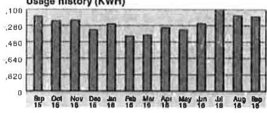
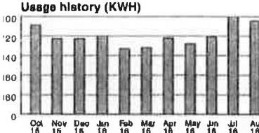
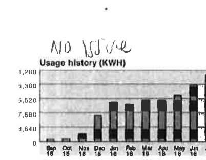
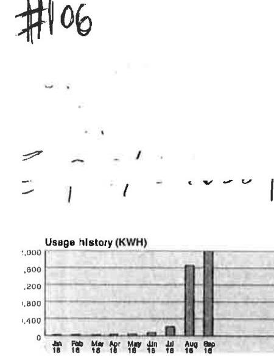
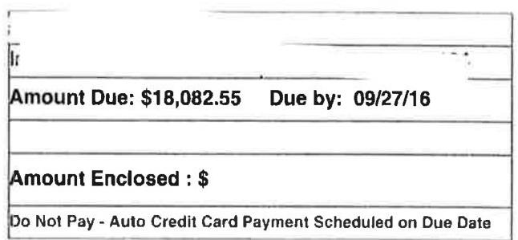
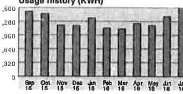

Hudson Energy Services, LLC
P.O. Box 142109

Irvine, TV 75014

Questions or Comments

53 HudsonEnergyCare@hudsonenergy.net
C www.HudsonEnergy.net

866-483-7664
Mon - Fri: 9:00 am - 5:30 pm Central
Emergencies and Power Outages
Call Centerpoint directly at
1-800-332-7143
The amount billed may include price changes allowed by law or regulatory action.
$\pm 103$

The image is a photo or illustration. It contains text that is mostly illegible due to blurriness and low contrast. The visible part of the text appears to be a sequence of numbers or letters, but it is not clear enough to extract any specific information or meaning.

Usage history (KWH)

The image is a graph/chart.

- **Chart Type**: Bar chart
- **Title**: Usage history (KWH)
- **X-Axis**: Months labeled as Sep 15, Oct 16, Nov 16, Dec 16, Jan 16, Feb 16, Mar 16, Apr 16, May 16, Jun 16, Jul 16, Aug 16, Sep 16
- **Y-Axis**: Values labeled as 0, .820, .640, .460, .280, .100
- **Yearly usage breakdown (monthly-based)**: The chart shows monthly electricity usage in kilowatt-hours (KWH) over a year.
- **Styling**: Bars are uniformly styled with no additional highlights or emphasis.

Tawa, Inc.
Tawa, Inc.
6281 Regio Ave.
Sugar Land, TX 774784408-4408

Buena Park, CA 90620

| 

The image is a photo or illustration. It contains a partial logo or graphic on the top right, with the text "Hudson Energy" below it. The text "P.O." is partially visible, likely part of an address. The rest of the image is mostly blank or white space. | New Charge |  | Payments/Ash, |  | Due Amount |  | Due Date |
| :--: | :--: | :--: | :--: | :--: | :--: | :--: | :--: |
|  | \$14,941.16 | \$14,843.78 | \$14,941.16 |  | \$14,843.78 |  | 10/20/16 |
| 16 Motor | LWG | 120 | 180 | Mail | Lcage | Gomup | Creece 1 arta |
| 80769155 | ACT (09/10-05/09) | 51810 | 50749 | 192 | 203,712.00 | 424.00 | 0 |
| Previous Balance. |  |  |  |  |  |  | \$14,941.16 |
| Payments and Adjustments |  |  |  |  |  |  |  |
| Payment on 09/19/16. |  |  |  |  |  |  | - $\$ 14,941.16$ |
| Total Payments/Adjustments. |  |  |  |  |  |  | - $\$ 14,941.16$ |
| Current Charges |  |  | Qty |  | Rate |  | Amount |
| Electric Service |  |  |  |  |  |  |  |
| Electric Energy Charges. |  |  | 203,712.00 |  | 0.04760 |  | \$9,696.69 |
| TDU Delivery Charges. |  |  |  |  |  |  | \$2,588.14 |
| Transmission Distribution Charges. |  |  |  |  |  |  | \$1,257.72 |
| Applicable Taxes |  |  |  |  |  |  |  |
| City Tax. |  |  |  |  |  |  | \$251.01 |
| Gross Receipts Reim |  |  |  |  |  |  | \$245.33 |
| PUC Assessment. |  |  |  |  |  |  | \$20.48 |
| State Tax. |  |  |  |  |  |  | \$784.41 |
| Total Current Charges. |  |  |  |  |  |  | \$14,843.78 |
| Total Amount Due. |  |  |  |  |  |  | \$14,843.78 |
| Agreement Details |  |  | Usage kWh |  | Avg Rate |  | Amount |
| 08/11/16 - 09/09/16 Fixed Rate |  |  | 203,712.00 |  | 0.04760 |  | \$9,696.69 |

The average price you paid for electricity this month is 6.6 g per kWh . Contract valid through 08/17/2017.

If you believe this bill includes unauthorized charges, please contact Hudson Energy to dispute such charges and, if you are not satisfied with our review, you may file a complaint with the Public Utility Commission of Texas, P.O. Box 13326, Austin, TX 78711-3326, (512) 936-7120 or toll-free in Texas at (888) 782-8477. Hearing and speech impaired individuals with text telephones (TTY) may contact the Commission at (512) 936-7136.
...Please return this portion with your payment ....

## Hudson Energy

Hudson Energy Services, LLC
P.O. Box 142109

Irving, TX 75014

Tawa, Inc.
Tawa, Inc.
6281 Regio Ave.
Buena Park, CA 90620

Amount Due: \$14,843.78 Due by: 10/20/16

Amount Enclosed : \$
Do Not Pay - Auto Credit Card Payment Scheduled on Due Date
Please call us if you are interested in participating in the Bill Assistance Program.

Hudson Energy Services, LLC
P.O. Box 731137

Dallas, TX 75373-1137

Hudson Energy Services, LLC
P.O. Box 142109

Irving, TX 75014

Questions or Comments

HudsonEnergyCare 2 hudsonenergy.net
www.HudsonEnergy.net

866-483-7664
Mon-Fri: 9:00 am - 5:30 pm Central
Emergencies and Power Outages Call Oncor directly at
1-888-313-4747
The amount billed may include price changes allowed by law or regulatory action.

The image is a photo or illustration featuring handwritten text. The text reads "# 102".

## 102

Usage history (KWH)

The image is a graph/chart.

- **Chart Type**: Bar chart
- **Title**: Usage history (KWH)
- **X-Axis**: Months (Oct 15, Nov 15, Dec 15, Jan 16, Feb 16, Mar 16, Apr 16, May 16, Jun 16, Jul 16, Aug 16)
- **Y-Axis**: KWH (Kilowatt-hours) with increments of 20, ranging from 0 to 200
- **Data Points**: 
  - Oct 15: ~180 KWH
  - Nov 15: ~180 KWH
  - Dec 15: ~160 KWH
  - Jan 16: ~160 KWH
  - Feb 16: ~140 KWH
  - Mar 16: ~160 KWH
  - Apr 16: ~180 KWH
  - May 16: ~160 KWH
  - Jun 16: ~160 KWH
  - Jul 16: ~180 KWH
  - Aug 16: ~200 KWH
- **Notable Styling**: Bars are uniformly styled with no additional highlights or emphasis.

This represents a **yearly usage breakdown (monthly-based)**.

Tawa, Inc.
Tawa Supermarket, Inc.
6281 Regio Ave.
Buena Park, CA 90620

Tawa, Inc.
Tawa Supermarket, Inc.
6281 Regio Ave.
Buena Park, CA 90620

Tawa, Inc.
Tawa Supermarket, Inc.
6281 Regio Ave.
Buena Park, CA 90620

Tawa, Inc.
Tawa Supermarket, Inc.
00131 W Spring Creek Pky
Plano, TX 750234609-4609

Invoice Date: 10/17/16 Invoice Period - 09/02/16 thru 10/04/16

| Province Science | New Change |  | Payment Date |  | Due Amount |  | Due Date |
| :--: | :--: | :--: | :--: | :--: | :--: | :--: | :--: |
| \$21,429.68 | $\$ 20,627.32$ |  | $\$ 21,429.68$ |  | $\$ 20,627.32$ |  | $11 / 16 / 16$ |
| 314 Amer | 1996 | 180 | 180 | 180 | Usage | Demand | Power Factor |
| 118430997LG | $\left\lvert\, \begin{gathered} 09 / 02-10 / 04 \\ 18 / 02 \end{gathered}\right.$ | 18521 | 18047 | 500 | 284,400.00 | 516.00 | 0.824 |

Previous Balance
Payments and Adjustments
Payment on 10/14/16
Total Payments/Adjustments
Current Charges
Electric Service
Electric Energy Charges
TDU Delivery Charges
Transmission Distribution Charges
Applicable Taxes
City Tax
Gross Receipts Reimb
S20,627.32

| Agreement Detalls | Usage kWh | Avg Rate | Amount |
| :-- | --: | --: | --: |
| 08/03/16 - 10/04/16 Fixed Rate | 284,400.00 | 0.04760 | $\$ 13,537.44$ |

The average price you paid for electricity this month is 6.6 z per kWh . Contract valid through 06/04/2017.

If you believe this bill includes unauthorized charges, please contact Hudson Energy to dispute such charges and, if you are not satisfied with our review, you may file a complaint with the Public Utility Commission of Texas, P.O. Box 13326, Austin, TX 76711-3326, (512) 936-7120 or toll-free in Texas at (888) 782-8477. Hearing and speech impaired individuals with text telephones (TTY) may contact the Commission at (512) 936-7136.

## 100

...Please return this portion with your payment ...

## Hudson Energy

Hudson Energy Services, LLC
P.O. Box 142109

Irving, TX 75014

Tawa, Inc.
Tawa Supermarket, Inc.
6281 Regio Ave.
Buena Park, CA 90620

## Amount Due: $\$ 20,627.32$ Due by: 11/16/16

Amount Enclosed : \$
Do Not Pay - Auto Credit Card Payment Scheduled on Due Date
Please call us if you are interested in participating in the Bill Assistance Program.

Hudson Energy Services, LLC
P.O. Box 731137

Dallas, TX 75373-1137

Hudson Energy Services, LLC
P.O. Box 142109

Irving, TX 75014

Questions or Comments

53 HudsonEnergyCare@hudsonenergy.net
C www.HudsonEnergy.net

866-483-7664
Mon - Fri: 9:00 am - 5:30 pm Central
Emergencies and Power Outages Call Oncor directly at 1-888-313-4747

The amount billed may include price changes allowed by law or regulatory action

The image is a photo or illustration containing the text "action. #105". The text is handwritten or styled to appear handwritten, with "action." written in a smaller font size above the larger and more prominently displayed "#105". The background is mostly white, with some indistinct marks or smudges visible.

411

The image is a graph/chart.

- **Chart Type**: Bar chart
- **Title**: Usage history (KWH)
- **X-Axis**: Months labeled as Sep 16, Oct 16, Nov 16, Dec 16, Jan 17, Feb 17, Mar 17, Apr 17, May 17, Jun 17
- **Y-Axis**: Labeled with numbers 0, 3,840, 5,520, 7,680, 9,360, 1,200
- **Data Points**: Bars representing usage for each month, with varying heights.
- **Notable Text**: "No Issue" handwritten above the chart.
- **Yearly Usage Breakdown (Monthly-Based)**: The chart shows monthly electricity usage over a year.

410
Usage history (KWH)

The image is a photo or illustration containing a logo and text. The logo consists of a stylized "H" with a wave-like design. To the right of the logo, the text reads "Hudson Energy" in a bold font. The background is white, and the logo and text are in black.

420
Usage history (KWH)

The image is a photo or illustration containing text. The visible text reads "P.O. Box" and "Irving, TX". The text is printed in black on a white background, with ample white space surrounding the text.

Tawa, Inc.
Tawa, Inc.
2540 Old Denion Rd Ste 150 Carrollton,TX 75006-1352
Buena Park, CA 90620

| Previous Balance | New Charges | Payment(s/SD) |  |  |  |  |  |  |
| :--: | :--: | :--: | :--: | :--: | :--: | :--: | :--: | :--: |
| \$17,224.26 | \$18,500.20 |  |  |  |  |  |  |  |
|  |  |  |  |  |  |  |  |  |
| 36 Meters |  |  |  |  |  |  |  |  |
| 107266876 LG |  |  |  |  |  |  |  |  |
|  |  |  |  |  |  |  |  |  |
| Previous Balance |  |  |  |  |  |  |  | \$17,224.26 |
| Payments and Adjustments |  |  |  |  |  |  |  |  |
|  |  |  |  |  |  |  |  |  |
|  | Payment on 08/25/16 |  |  |  |  |  |  | - $\$ 17,224.26$ |
| Total Payments/Adjustments |  |  |  |  |  |  |  | - $\$ 17,224.26$ |
| Current Charges |  |  |  | Qty |  | Rate |  | Amount |
| Electric Service |  |  |  |  |  |  |  |  |
| Electric Energy Charges |  |  |  | 244,200.00 |  | 0.04760 |  | \$11,623.92 |
| TDU Delivery Charges |  |  |  |  |  |  |  | \$5,145.59 |
| Transmission Distribution Charges |  |  |  |  |  |  |  | - $\$ 45.56$ |
| Applicable Taxes |  |  |  |  |  |  |  |  |
| City Tax |  |  |  |  |  |  |  | \$171.32 |
| Gross Receipts Reimb. |  |  |  |  |  |  |  | \$334.89 |
| Special Tax. |  |  |  |  |  |  |  | \$171.32 |
| PUC Assessment. |  |  |  |  |  |  |  | \$27.95 |
| State Tax. |  |  |  |  |  |  |  | \$1,070.77 |
| Total Current Charges. |  |  |  |  |  |  |  | \$18,500.20 |
| Total Amount Due. |  |  |  |  |  |  |  | \$18,500.20 |
| Agreement Details |  |  |  |  |  |  |  |  |
| 08/05/16 - 08/06/16 Fixed Rate |  |  |  |  |  |  |  |  |
|  |  |  |  |  |  |  |  |  |

The average price you paid for electricity this month is 6.8 g per kWh . Contract valid through 06/07/2017.

If you believe this bill includes unauthorized charges, please contact Hudson Energy to dispute such charges and, if you are not satisfied with our review, you may file a complaint with the Public Utility Commission of Texas, P.O. Box 13326, Austin, TX 78711-3326, (512) 936-7120 or toll-free in Texas at (888) 782-8477. Hearing and speech impaired individuals with text telephones (TTY) may contact the Commission at (512) 936-7136.

## Hudson Energy

Hudson Energy Services, LLC
P.O. Box 142109
irving, TX 75014

Tawa, Inc.
Tawa, Inc.
6281 Regio Ave.
Buena Park, CA 90620

Hudson Energy Services, LLC
P.O. Box 731137

Dallas, TX 75373-1137

Hudson Energy Services, LLC
P.O. Box 142109

Irvina, TX 75014

Questions or Comments

E3 HudsonEnergyCare@hudsonenergy.net
( www.HudsonEnergy.net

## 866-483-7664

Mon - Fri: 9:00 am - 5:30 pm Central
Emergencies and Power Outages Call Centerpoint directly at 1-800-332-7143

The amount billed may include price changes allowed by law or regulatory action.

The image is a graph/chart.

- **Chart Type**: Bar chart
- **Title**: Usage history (KWH)
- **X-Axis**: Months labeled as Jan 16, Feb 16, Mar 16, Apr 16, May 16, Jun 16, Jul 16, Aug 16, Sep 16
- **Y-Axis**: KWH with increments labeled as 0, 400, 800, 1,200, 1,600, 2,000
- **Data Points**: 
  - Jan 16: 0 KWH
  - Feb 16: 0 KWH
  - Mar 16: 0 KWH
  - Apr 16: 0 KWH
  - May 16: 0 KWH
  - Jun 16: 0 KWH
  - Jul 16: Approximately 1,600 KWH
  - Aug 16: Approximately 1,800 KWH
  - Sep 16: Approximately 1,800 KWH
- **Yearly usage breakdown (monthly-based)**: The chart shows a significant increase in usage starting in July, with the highest usage in August and September.

## Tawa, Inc.

Tawa, Inc.
009 to Miason
Katy,TX 77450-2437
Buena Park, CA 90620

|  |  |  |  |  |  |  |  |
| :--: | :--: | :--: | :--: | :--: | :--: | :--: | :--: |
| Invoice Date: 09/07/16 |  | Invoice Period - 08/04/16 thru 09/05/16 |  |  |  |  |  |
| Province Balance |  | New C | charges | Payments/Adj. |  | Due Amount | Due Date |
| \$15,252.49 |  | \$18,082.55 |  | - $\$ 15,252.49$ |  | \$18,082.55 | 09/27/16 |
| As Motor | 1200 |  |  | 6071.42 | 384 | 251,962.57 | 179,777.05 |
| 771408 | 1,401 | 09/04 - 09/05 | 6727.61 | 6071.42 | 384 | 251,962.57 | 179,777.05 |
| Previous Balance |  |  |  |  |  |  | \$15,252.49 |
| Payments and Adjustments |  |  |  |  |  |  |  |
| Payment on 08/25/16 |  |  |  |  |  |  | - $\$ 15,252.49$ |
| Total Payments/Adjustments |  |  |  |  |  |  | - $\$ 15,252.49$ |
| Current Charges |  |  |  | Qty | Rate | Amount |  |
| Electric Service |  |  |  |  |  |  |  |
| Electric Energy Charges. |  |  |  | 251,962.37 | 0.04590 | \$11,565.07 |  |
| TDU Delivery Charges. |  |  |  |  |  | \$3,648.12 |  |
| Transmission Distribution Charges. |  |  |  |  |  | \$1,586.81 |  |
| Applicable Taxes |  |  |  |  |  |  |  |
| City Tax. |  |  |  |  |  | \$152.39 |  |
| Special Tax. |  |  |  |  |  | \$152.39 |  |
| PUC Assessment. |  |  |  |  |  | \$25.36 |  |
| State Tax. |  |  |  |  |  | \$952.41 |  |
| Total Current Charges. |  |  |  |  |  | \$18,082.55 |  |
| Total Amount Due. |  |  |  |  |  | \$18,082.55 |  |
| Agreement Details |  |  |  |  |  |  |  |
| 08/04/16 - 09/05/16 Fixed Rate |  |  |  | 251,962.37 | 0.04590 | \$11,565.07 |  |

The average price you paid for electricity this month is 6.72 per kWh . Contract valid through 12/10/2016.

If you believe this bill includes unauthorized charges, please contact Hudson Energy to dispute such charges and, if you are not satisfied with our review, you may file a complaint with the Public Utility Commission of Texas, P.O. Box 13326, Austin, TX 78711-3326, (512) 936-7120 or toll-free in Texas at (888) 782-8477. Hearing and speech impaired individuals with text telephones (TTY) may contact the Commission at (512) 936-7136.
...Please return this portion with your payment ....

## Hudson Energy

Hudson Energy Services, LLC
P.O. Box 142109

Irving, TX 75014

The image is a photo of a billing statement section.

- **Text**:
  - "Amount Due: $18,082.55"
  - "Due by: 09/27/16"
  - "Amount Enclosed: $"
  - "Do Not Pay - Auto Credit Card Payment Scheduled on Due Date"

- **Layout**:
  - The "Amount Due" and "Due by" information is at the top.
  - Below is a space for "Amount Enclosed."
  - A note about auto payment is at the bottom.

Please call us if you are interested in participating in the Bill Assistance Program.

Hudson Energy Services, LLC
P.O. Box 731137

Dallas, TX 75373-1137

Hudson Energy Services, LLC
P.O. Box 142109

Irvinn TV 75014

Questions or Comments

53 HudsonEnergyCare@hudsonenergy.net
www.HudsonEnergy.net

## 866-483-7664

Mon - Fri: 9:00 am - 5:30 pm Central
Emergencies and Power Outages Call Centerpoint directly at 1-800-332-7143

The amount billed may include price changes allowed by law or regulatory action.

The image is a photo or illustration showing the text "#101" written in a handwritten style.

Usage history (KWH)

The image is a bar chart showing a **yearly usage breakdown (monthly-based)** for electricity usage in kilowatt-hours (KWH). 

- **Y-axis**: Labeled with increments of 320, starting from 0 up to 1,600.
- **X-axis**: Displays months from September 2015 (Sep 15) to August 2016 (Aug 16).
- **Data Points**: 
  - Sep 15: Approximately 1,280 KWH
  - Oct 15: Approximately 1,280 KWH
  - Nov 15: Approximately 1,280 KWH
  - Dec 15: Approximately 1,280 KWH
  - Jan 16: Approximately 1,280 KWH
  - Feb 16: Approximately 1,280 KWH
  - Mar 16: Approximately 1,280 KWH
  - Apr 16: Approximately 1,280 KWH
  - May 16: Approximately 1,280 KWH
  - Jun 16: Approximately 1,280 KWH
  - Jul 16: Approximately 1,280 KWH
  - Aug 16: Approximately 1,280 KWH

The bars are uniformly styled with a solid fill.

Tawa, Inc.
Tawa Supermarket, Inc.
1005 Blalock Hd
Tawa, Inc.
Houston, TX 770557441-7441
6281 Regio Ave.
Buena Park, CA 90620

| Invoice Date: 09/15/16 | Invoice Period - 08/09/16 thru 09/08/16 |  |  |  |  |  |
| :--: | :--: | :--: | :--: | :--: | :--: | :--: |
| Previous Balance | New Charges |  | Payments/Adj. |  | Due Amount |  |
| \$27,871.05 | \$26,875.29 |  | \$27,871.05 |  | \$26,875.29 | 10/17/16 |
| 84 Motor | 1 V4V | 209/09 | 2 V4V, Btr. | 2 V4V, Btr. | 2 V4V, Btr. | 2 V4V, Btr. |
| 012397 | AC1 (05/09 - 09/08) | 38.945 | 9448.48 | 578 | 340,155.07 | 229,710.24 |
| Previous Balance |  |  |  |  |  | \$27,871.05 |
| Payments and Adjustments |  |  |  |  |  |  |
| Payment on 09/14/16 |  |  |  |  |  | - $\$ 27,871.05$ |
| Total Payments/Adjustments |  |  |  |  |  | - $\$ 27,871.05$ |
| Current Charges |  |  | Qty | Rate |  | Amount |
| Electric Service |  |  |  |  |  |  |
| Electric Energy Charges |  |  | 340,155.07 | 0.04760 |  | \$16,191.38 |
| TDU Delivery Charges. |  |  |  |  |  | \$6,118.82 |
| Transmission Distribution Charges. |  |  |  |  |  | \$2,201.95 |
| Applicable Taxes |  |  |  |  |  |  |
| City Tax. |  |  |  |  |  | \$227.93 |
| Gross Receipts Reimb. |  |  |  |  |  | \$445.53 |
| Special Tax. |  |  |  |  |  | \$227.93 |
| PUC Assessment. |  |  |  |  |  | \$37.19 |
| State Tax. |  |  |  |  |  | \$1,424.56 |
| Total Current Charges. |  |  |  |  |  | \$26,875.29 |
| Total Amount Due. |  |  |  |  |  | \$26,875.29 |
| Agreement Details |  | Usage kWh |  | Avg Rate |  | Amount |
| 08/09/16 - 09/08/16 Fixed Rate |  | 340,155.07 |  | 0.04760 |  | \$16,191.38 |

The average price you paid for electricity this month is 7.28 per kWh . Contract valid through 08/09/2017.

If you believe this bill includes unauthorized charges, please contact Hudson Energy to dispute such charges and, if you are not satisfied with our review, you may file a complaint with the Public Utility Commission of Texas, P.O. Box 13326, Austin, TX 78711-3326, (512) 936-7120 or toll-free in Texas at (888) 782-8477. Hearing and speech impaired individuals with text telephones (TTY) may contact the Commission at (512) 936-7136.
...Please return this portion with your payment ....

## Hudson Energy

Hudson Energy Services, LLC
P.O. Box 142109

Irving, TX 75014

Tawa, Inc.
Tawa Supermarket, Inc.
Tawa, Inc.
6281 Regio Ave.
Buena Park, CA 90620

|  |  |  |  |
| :--: | :--: | :--: | :--: |
| Amount Due: \$26,875.29 | Due by: 10/17/16 |  |  |
|  |  |  |  |
| Amount Enclosed : \$ |  |  |  |
| Do Not Pay - Auto Credit Card Payment Scheduled on Due Date |  |  |  |
|  |  |  |  |

Please call us if you are interested in participating in the Bill Assistance Program.

Hudson Energy Services, LLC
P.O. Box 731137

Dallas, TX 75373-1137

