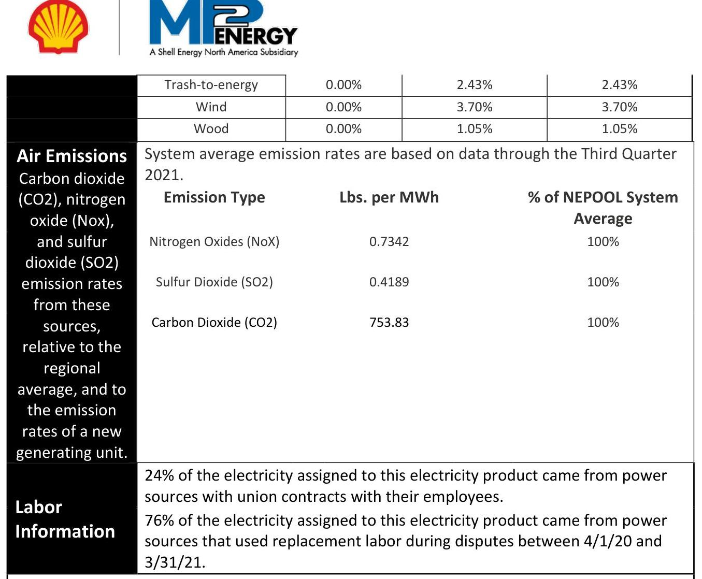

# Cover Sheet to Master Energy Sales Agreement 

This contract is not binding until such time that it is executed by both Parties.

## In order for contract to be executed by MP2, customer must:

- Complete Billing \& Contact Information Page
- Sign the Signature Page of the Master Agreement and the Transaction Confirmation(s)
- Add your address for Legal Notices under your signature
- In the event that an agent is signing on behalf of Customer, have agent sign Agency Block found under the signature blocks

## Upon receipt of executed agreement, MP2 will:

- Countersign both the MSA and the Transaction Confirmation(s)
- Schedule to enroll your Delivery Point(s)
- Hedge the power sold to you

# MASTER ENERGY SALES AGREEMENT 

This Master Energy Sales Agreement (the "MSA" or "Master Agreement")"is entered into by and between MP2 ENERGY LLC as authorized agent for its applicable licensed subsidiary in each instance (the applicable licensed subsidiary, the "Seller"), and CAMBRIDGE PUBLIC HEALTH COMMISSION ("Customer"). Seller and Customer are sometimes referred to herein individually as a "Party" and collectively as the "Parties."
1.1 Form and Construction of Agreement. The terms of this MSA apply to all end-use sales of Energy by Seller to Customer (each sale a "Transaction"). Each Transaction shall be memorialized with a written confirm executed by the Seller and Customer (each a "Transaction Confirmation" or a "TC"). Each TC will include the commercial terms of the Transaction, including but not limited to the Delivery Period, Contract Price, contract quantities in MWh, costs and EDC Regulatory Charges, Delivery Points and any other special provisions agreed to between the Parties. Customer's execution of a TC shall constitute an offer from Customer to Seller to purchase Energy on the terms set forth in the TC and the MSA. Upon Seller's execution of the TC Seller shall sell, and Customer shall purchase and receive the Total Contract Quantity pursuant to the terms and conditions of this MSA and any applicable TC during the Delivery Period set forth on an applicable TC. Any conflict between the terms and conditions of this Agreement and a TC shall be resolved in favor of the applicable TC. This MSA, associated TC(s), and any amendments, addendums, annexes to either the MSA or a TC set forth the single integrated "Agreement" among the Parties with respect to the subject matter hereof and thereof, and supersede all prior or contemporaneous agreements and understandings (oral or otherwise) among the Parties with respect to the subject matter hereof and thereof. The Agreement may only be modified by a written agreement signed by both Parties.
1.2 Term. This MSA commences on the date when the first TC hereunder is executed by both Customer and Seller and continues until terminated in writing by both Parties or terminated under Sections 1.7 and 1.8 hereunder, it being the intent of the Parties that even if the MSA is terminated all Transactions between the Parties will be governed by the terms and conditions set forth in this MSA, as such MSA may be amended in writing from time to time and the termination of this MSA shall in no way release a Party from any obligations existing hereunder or under any effective TC prior to the end of a Delivery Period or Renewal Period. Upon expiration of a Delivery Period unless the Parties have executed a new TC with respect to the Delivery Points, Customer shall continue to purchase and receive the Energy delivered to the Delivery Points at the Hold-Over Rate for successive one-month terms (each a "Renewal Period") until either Party notifies the other Party in writing of its intention to terminate the TC at least twenty (20) days prior to the end of each Renewal Period. Upon timely notice of termination being received by the non-terminating Party, the termination date shall be the next effective drop date after the notice period as permitted by the EDC. The Contract Price during the Renewal Period shall be the Hold-Over Rate set forth on the applicable TC. The terms of this MSA will govern during the Renewal Period(s).
1.3 Title, Risk of Loss and Taxes. Title, liability and risk of loss associated with the Energy purchased and sold hereunder shall pass to Customer at the Delivery Point(s) specified on the applicable TC. Seller is responsible for Taxes arising prior to the Delivery Point and Customer is responsible for Taxes arising at and after the Delivery Point. If Customer claims exemption from Taxes, Customer shall provide Seller a certificate of exemption.
1.4 Credit. Seller's entry into this MSA and each Transaction is contingent upon Customer, any guarantor or any successor maintaining its creditworthiness during the term of any Transaction and any Renewal Period. If Customer's payment history, credit or financial condition becomes unsatisfactory as determined by Seller in a commercially reasonable manner Seller may request, and Customer shall furnish Seller, Performance Assurance in a form and amount acceptable to Seller within three (3) Business Days of the request. In no event will the amount of the Performance Assurance be more than three (3) times Customer's estimated largest monthly invoice amount.
1.5 Billing and Payment. The method of billing applicable to a Transaction will be as set forth on a TC and will be either Utility Consolidated Billing ("UCB"), Dual Bill Option ("DBO" or "Dual Billing") or Supplier Consolidated Billing ("SBO"). If Customer elects UCB Customer's EDC will invoice Customer monthly for a) the Energy supplied by Seller under this Agreement, b) the EDC Regulatory Charges, and c) any applicable Taxes and payment will be made directly to the EDC by the date specified on the UCB invoice. If Customer elects DBO Customer will instead receive both a monthly invoice from Seller for Energy and a separate monthly invoice from the EDC for EDC Regulatory Charges and Taxes, then following each meter

read date, Seller will deliver to Customer an invoice setting forth the charges due for Energy. If available and Customer elects SBO Customer will receive one invoice from Seller for i) Energy supplied by Seller under this Agreement, ii) the EDC Regulatory Charges, and iii) any applicable Taxes and payment will be made directly to Seller by the date specified on the SBO invoice. In the event that Seller does not receive usage data from the EDC, Seller may reasonably estimate Customer's use and such estimate shall be adjusted when the actual consumption is received from the EDC. In the event of SBO or Dual billing, Seller's invoice will be sent via email or mail to Customer. In the case of SBO or DBO the day the invoice is sent is hereafter referred to as the "Sent Date." Payment shall be made by ACH, wire transfer, or check within 30 days of the Sent Date and unless directed otherwise by Seller. Overdue invoices will accrue interest at the statutory rate referenced for governmental entities in the state in which the Delivery Points are located. With respect to all forms of billing and invoices, Customer is responsible for all reasonable costs and fees incurred by Seller in collecting payment. If Customer disputes any amount on an invoice in good faith, Customer will contact Seller promptly in writing, stating the basis for the dispute and shall pay the undisputed amount by the due date; the amount in dispute may be withheld until the dispute is resolved. If the amount disputed is determined to be correct, it shall be paid (plus interest accrued under the above calculation method) within five (5) Business Days of such determination.
1.6 Force Majeure. If a Party is unable because of Force Majeure to perform its obligations hereunder and that Party gives notice of the event to the other Party as soon as practicable after its occurrence, then the obligations of the Party affected by the event (other than payment for Energy received and performance of other transactions or other obligations incurred before the Force Majeure event) will be suspended for the duration of the Force Majeure event. "Force Majeure" means a material, unavoidable occurrence beyond a Party's control, but shall not include inability to pay, an increase or decrease in Taxes or the cost of Energy, the economic hardships of a Party, or the full or partial closure of Customer's facilities, unless such closure itself is due to Force Majeure.
1.7 Events of Default. "Default" means any one of the following: (a) the failure by either Party to make, when due, any payment required under the Agreement and such failure is not remedied within five (5) Business Days after written notice; (b) any assignment or general arrangement for the benefit of creditors made by either Party; or the Bankruptcy or Insolvency of either Party or its guarantor; (c) any unauthorized assignment of a Party's rights or obligations hereunder; (d) failure of a Party to provide Performance Assurance pursuant to the terms of the Agreement and such failure is not remedied within five (5) Business Days after written notice; (e) either Party consolidates or merges into or transfers all or substantially all of its assets to another entity and the resulting transferee or surviving entity fails to assume the obligations of such party under the Agreement; (f) Customer switches to another supplier or otherwise terminates a TC after the date Seller accepts a TC and before the Estimated Start Date as indicated on a TC or Customer switches to another supplier or otherwise terminates a TC after the Estimated Start Date and prior to the end of the Delivery Period; (g) Customer fails to receive all of part of the Total Contract Quantity pursuant to a Transaction and such failure is not excused by Seller's failure to perform or by Force Majeure; or (h) any breach of this Agreement by either Party and such breach is not cured within seven (7) Business Days after written notice. If an event of Default listed in subsection (b) above occurs, the Default will be deemed to have automatically occurred just prior to such event.
1.8 Remedies Upon an Event of Default. In the event of a Default, the non-defaulting Party shall have the right to: (a) accelerate any or all amounts owing between the Parties and liquidate and terminate any and all Transactions hereunder and/or this MSA; (b) withhold any payments due to the defaulting Party; (c) immediately suspend performance under this Agreement; and/or (d) calculate an Early Termination Fee ("ETF"). The ETF shall be due from the defaulting Party to the non-defaulting Party within (5) days of written notice of the ETF ("ETF Notice") being delivered by the non-defaulting Party to the defaulting Party. In the case where Customer is the defaulting Party the ETF is the sum of the positive dollar amount obtained by multiplying (i) Contract Price minus the Underlying Value by (ii) the remaining amount of the Total Contract Quantity that would have been delivered under this Agreement had it not been terminated early plus amounts owed for Energy delivered but not paid plus fees and expenses, including reasonable attorneys' fees incurred by Seller in connection with collecting all amounts due under this Agreement. In the case where Seller is the defaulting Party the ETF is the sum of the net sum of the positive dollar amount obtained by multiplying (i) Underlying Value minus the Contract Price by (ii) the remaining amount of the Total Contract Quantity that would have been delivered under this Agreement had it not been terminated early less amounts owed for Energy delivered, but not paid plus fees and expenses, including reasonable attorneys' fees incurred by Customer in connection with collecting all amounts due under this Agreement. The provisions of this section shall be without prejudice and shall be in addition to any right of setoff, combination of accounts, lien or other right to which any Party is at any time otherwise entitled (whether by operation of law, contract or otherwise). If Customer has elected to terminate this Agreement due to Seller's Default such

termination shall be rescinded and of no force and effect if Shell Energy North America (US), L.P. (SENA) elects, during the cure period afforded Seller under this Agreement, to cure the Default or to take an assignment of this Agreement and assume Seller's duties and obligations under this Agreement. The Parties agree that the ETF constitutes a reasonable approximation of damages and is not a penalty or punitive in any respect. Seller may, but is not required to, physically liquidate a Transaction or enter into a replacement transaction to determine the ETF.

# 1.9 Limitation of Liability. IN NO EVENT SHALL EITHER PARTY BE LIABLE TO THE OTHER PARTY FOR CONSEQUENTIAL, INCIDENTAL, PUNITIVE, EXEMPLARY OR INDIRECT DAMAGES IN TORT, CONTRACT OR OTHERWISE. 

1.10 Representations and Warranties. As a material inducement to entering into this MSA and each Transaction hereunder, each of the following is made upon execution of this Agreement and are deemed to be repeated each time a TC or additional agreement is entered into by the Parties:
A. Each Party, with respect to itself, represents and warrants to the other Party that: (a) it is duly organized, validly existing and in good standing under the laws of the jurisdiction of its formation and is qualified to conduct its business in those jurisdictions necessary to perform this Agreement; (b) the execution, delivery and performance of this Agreement are within its powers, have been duly authorized by all necessary action and do not violate any of the terms or conditions in its governing documents or any contract to which it is a party or any law, rule, regulation, order, writ, judgment, decree or other legal or regulatory determination applicable to it; (c) this Agreement constitutes its legally valid and binding obligation enforceable against it in accordance with its terms, subject to any equitable defenses; (d) it is not Bankrupt or Insolvent and there are no reorganization, receivership or other arrangement proceedings pending or being contemplated by it, or to its knowledge threatened against it.
B. Customer further represents and warrants to Seller as follows: (a) Customer's claims of exemption from Taxes, if any, are consistent with the laws and regulations of the applicable taxing authorities; (b) it fully understands its rights and obligations under this Agreement; (c) the Person executing this MSA and each TC is expressly authorized to enter into and bind Customer; (d) it shall provide Seller all information reasonably required to substantiate its usage requirements, which in substantial part form the basis for the calculation of charges for the Transactions entered into hereunder and execution of this MSA constitutes an authorization for release of Customer's information from the EDC or other applicable third parties including but not limited to the Utility Account Number(s), data about meter readings, rate class and electric usage, the Customer's name, address(es) and telephone number; (e) any usage information and utility class information provided is true and accurate as of the date furnished and as of the effective date of the Agreement; and (f) it is the intended end-use customer for all Energy purchased under this Agreement and it has entered into this Agreement for non-speculative purposes, and will not resell any of the Energy purchased under this Agreement.
C. Customer further affirms, represents and warrants that it is not a residential or small commercial customer (as those terms are defined in the jurisdiction(s) applicable to the Transaction) and the Delivery Points hereunder are not classified as such.
1.11 Confidentiality. Unless in response to a request under a public records act of the state in which the Delivery Points are located, neither Party shall disclose, unless authorized in writing by the other Party, the terms of this Agreement except that: a) a Party may disclose the terms of this Agreement to any of its employees, consultants and advisors who have a reasonable need to know the information in order to allow the Party to perform its obligations under this Agreement; and b) Seller may disclose the terms of this Agreement to its affiliates, including but not limited to Shell Energy North America (US), LP ("SENA").
1.12 Material Regulatory Changes. In the event that after the date of execution of this MSA, any new charges, fees, obligations, and/or requirements, are imposed by any Regulatory Body or if there is a change in law, administrative regulation, change in market design, or material change to the applicable capacity rate or transmission rate used to determine Customer's Capacity Charge or Transmission Charge by the EDC/ISO, where applicable (each a "Material Regulatory Change" or "MRC"), and as a result of the MRC, Seller incurs material incremental costs in order to maintain the same level, location and/or quantity of services contemplated under this Agreement, Seller shall pass through the cost of such MRC, without markup, to Customer and Customer shall pay such cost to Seller.
1.13 On-site Generation and Material Adverse Change ("Material Adverse Change" or "MAC"). (a) Customer hereby represents and warrants that it has disclosed and accounted for all current or planned "behind-the-meter" distributed generation,

The image is a logo illustration. It features two logos side by side. On the left is the Shell logo, and on the right is the MP2 Energy logo. Below the MP2 Energy logo, there is text that reads: "A Shell Energy North America Subsidiary."
storage, and net metering at its place of business and/or with respect to any Delivery Point location. Customer also covenants and agrees to promptly notify Seller if, after the Effective Date hereof, Customer adds, removes, increases or decreases "behind-themeter" distributed generation, storage, and net metering at its place of business and/or with respect to any Delivery Point.
(b) Further, if there is change in Customer's business operations for any reason that produces a MAC in Customer's usage pattern and that usage pattern materially impacts Seller's ability to provide electric service to Customer, including, but not limited to, material increases in the costs to serve the Customer, then, in its sole discretion, acting reasonably, Seller may either (i) pass through such increased in costs to Customer without mark-up; provided such costs are documented and verifiable or (ii) provide 60 days' prior written notice to Customer of Seller's termination of this Agreement .
1.14 Governing Law. The Agreement between the Parties shall be governed by and construed in accordance with the laws of the State set forth on the applicable TC, without reference to principles of conflict of laws.
1.15 Waiver of Jury Trial. EACH PARTY HEREBY WAIVES ITS RESPECTIVE RIGHT TO A JURY TRIAL WITH RESPECT TO ANY LITIGATION ARISING UNDER OR IN CONNECTION WITH THIS MSA AND ANY TRANSACTION HEREUNDER.
1.16 Severability; Counterparts; Electronic Signature. In the event any provision of this MSA or any TC is found to be invalid or unenforceable, such provision shall be invalid and unenforceable only to the extent of such invalidity or unenforceability without invalidating or rendering unenforceable any other provision. This MSA and any TC may be executed in multiple counterparts and exchanged via email or facsimile and shall be construed as one as of the date it is executed by both Parties.
1.17 Survival. The applicable provisions of the Agreement shall continue in effect and survive the termination of the Agreement to the extent necessary to provide for final accounting, invoicing, billing, billing adjustments, resolution of any billing disputes, realization of any collateral or other performance assurance, set-off, final payments, or payments pertaining to liability obligations arising from acts or events that occurred in connection with the Agreement prior to termination.
1.18 Assignment. The Agreement shall be binding upon and shall inure to the benefit of, and may be performed by, the successors and assigns of the Parties, except that, no assignment by either Party shall operate to release the assignor from any of its obligations under the Agreement, unless: (a) the other Party consents in writing to such assignment and releases, the assignor from any of its obligations hereunder (such assignment not to be unreasonably withheld or delayed); or (b) such transfer is incident to a merger or consolidation with, or transfer of all, or substantially all, of the assets of the transferor to another Person that shall have the financial capability to assume, and who does assume all of the obligations of the assignor under the Agreement. Customer acknowledges that under some circumstances MP2 may be required to assign MP2's future interests, rights, and obligations in the Agreement to SENA, and Customer hereby consents to any such assignment.
1.19 Forward Contract; Master Netting Agreement. Each Party acknowledges and agrees (a) that this Agreement constitutes a forward contract and a master netting agreement as defined by the United States Bankruptcy Code (the "Code"); (b) each Party is a "forward contract merchant" within the meaning of the United States Bankruptcy Code; (c) Seller is not a "utility" as defined in Section 366 of the Code; (d) each Party waives and agrees not to assert the applicability of the provision of such Section 366 in any bankruptcy proceeding wherein such Party is a debtor; and (e) this is an agreement for the sale and purchase of a commodity and nothing in this Agreement shall be construed as creating any other relationship between the Parties other than that of independent contractors.
1.20 Anti-Corruption. Each Party represents, warrants and covenants to the other that: (i) it will comply with the AntiCorruption Laws (as defined herein) with respect to all transactions under this Agreement; (ii) it has not made and will not make, offer, authorize, or accept any payment, gift, or other benefit, directly or indirectly (whether via its affiliates, agents, contractors or other third parties), to or from any government official or any other Person for the purpose of facilitating or carrying out any transaction hereunder which would violate the Anti-Corruption Laws; (iii) it will promptly notify the other Party if it becomes aware of any violation of the Anti-Corruption Laws in connection with any transaction hereunder, subject to the preservation of

legal privilege; and (iv) except as the other Party may agree in writing, all payments payable to a Party pursuant to this Agreement shall be made only to the account of such Party, and not to the account of any other Person.
1.21 Notices. All notices will be made in writing and may be delivered by hand delivery, first class mail (postage prepaid), overnight courier service or facsimile to the address set forth below each Parties' signature and shall be effective upon receipt; provided however, that any notice of termination may only be sent by hand or by overnight courier service and, if Customer terminates the Agreement due to an alleged breach by Seller, a copy must be simultaneously delivered to SENA, 1000 Main, Level 12 Houston, Texas 77002 Attn: Contracts North America, Facsimile: 713-767-5414. Either Party may change its address for notice by advising the other Party in writing. In the event Customer fails to add its address below its signature on this MSA, Customer agrees that the billing address of the Customer shall be the legal notices address and hereby waives any objection to that address as the legal notices address and any claim that the address is not the proper legal notice address.
1.22 Additional Definitions. The following definitions shall apply hereunder whether stated in the singular or plural. Any capitalized terms not defined in this Master Agreement are defined in the TC or shall have the meaning set forth in the applicable EDC /utility rules, tariffs or other governmental regulations, or if such term is not defined therein then it shall have the wellknown and generally accepted technical or trade meaning customarily attributed to it in the electricity industry.
"Anti-Corruption Laws" mean (a) the United States Foreign Corrupt Practices Act of 1977; (b) the United Kingdom Bribery Act 2010; and (c) all applicable laws that prohibit money laundering, or otherwise dealing in the proceeds of crime, or the bribery of, or the providing of unlawful gratuities, facilitation payments, or other benefits to any government official or any other Person, or tax evasion.
"Bankrupt" or "Bankruptcy" means with respect to any entity, such entity (i) files a petition or otherwise commences, authorizes or acquiesces in the commencement of a proceeding or cause of action under a bankrupt, Insolvent, reorganization or similar law, or has any such petition filed or commenced against it, (ii) makes an assignment or any general arrangement for the benefit of creditors, (iii) otherwise becomes bankrupt or Insolvent (however evidenced), (iv) has a liquidator, administrator, receiver, trustee, conservator or similar official appointed with respect to it or any substantial portion of its property or assets, or (v) is generally unable to pay its debts as they fall due.
"Business Day" means any day except a Saturday, Sunday, or a Federal Reserve Bank holiday. A Business Day shall open at 8:00 a.m. and close at 5:00 p.m. local time for the relevant Party's principal place of business. The relevant Party, in each instance unless otherwise specified, shall be the Party to whom the notice, payment or delivery is being sent and by whom the notice or payment or delivery is to be received. Any reference to "days" means calendar days.
"Capacity Charge" means the product of the applicable capacity rate and capacity quantity for the utility account as determined by the EDC/ISO or otherwise.
"Contract Price" means that "Contract Price" set forth on a TC.
"Delivery Point" means each of Customer's meters associated with the "Utility Account Number" as listed on a TC, or any replacement account number issued by the ISO/ EDC/utility from time to time.
"Delivery Period" means the period during which Seller has agreed to sell and Customer has agreed to buy Energy for the Delivery Point(s) as set forth on a TC.
"EDC" means the utility or entity that has control of the transmission and / or distribution system and associated metering that is connected to a Utility Account Number.
"EDC Regulatory Charges" means those costs listed on a TC as "Pass-through charges" which are levied by an EDC and taxing authorities and shall be invoiced to Customer on an actual cost basis without any markup.
"Energy" means electric energy and related products and services and includes transmission and capacity in certain markets.
"Estimated Start Date" shall have the meaning set forth on a TC.
"Hold-over Rate" means the applicable rate set forth on a TC, that Customer agrees to pay for Energy delivered to the Delivery Points during the automatic Renewal Period.

The image is a photo/illustration featuring two logos. On the left is the Shell logo, which is a stylized yellow and red shell. On the right is the logo for "MP2 ENERGY," with the text "A Shell Energy North America Subsidiary" below it. The two logos are separated by a vertical line.
"Insolvent" or "Insolvency" means with respect to any Party, when such Party shall be unable to pay liabilities as they mature, or such entity shall admit in writing its inability to pay its debts generally as they become due.
"ISO" means the applicable Independent System Operator as identified on each TC.
"Performance Assurance" means collateral in the form of cash, irrevocable standby letter(s) of credit, corporate guaranty, or other security all as reasonably acceptable to Seller.
"Person" means any natural person, corporation, general partnership, limited partnership, limited liability company, proprietorship, other business organization, trust, union, association, governmental authority or agency or other form or legal entity.
"Regulatory Body" means any ISO, EDC, state utility commission, FERC, CFTC or other similar body or federal, state, local, municipal or other governmental, regulatory or administrative agency, commission or any authority lawfully exercising or entitled to exercise jurisdiction over the Parties or any Transaction.
"Taxes" means any and all sales, use, gross receipts, ad valorem, franchise, excise, or any other taxes or similar charges imposed by any governmental authority on, or with respect to the Energy or other products sold hereunder but excluding income taxes imposed on the respective Parties.
"Total Contract Quantity" means Customer's total forecasted usage for all contracted Delivery Points for the Delivery Period as set forth on a TC.
"Transmission Charge" means the product of the applicable transmission rate and transmission quantity for the utility account as determined by the EDC/ISO or otherwise.
"Underlying Value" means the price a third-party who is active in the Energy market would transact (sell or purchase as applicable) for Energy and related services.

The image is a photo/illustration featuring two logos. On the left is the Shell logo, which is a stylized yellow shell with a red outline. On the right is the MP2 Energy logo, which includes the text "MP2 ENERGY" in blue and black. Below the MP2 Energy logo, there is a tagline that reads "A Shell Energy North America Subsidiary." The two logos are separated by a vertical line.

IN WITNESS WHEREOF, the Parties, by their respective duly authorized representatives, have executed this Agreement.

## CAMBRIDGE PUBLIC HEALTH COMMISSION

By: DocuSigned by: $\square$

Name: Jeff Tuttle
Title: Purchasing Manager
Date: $9 / 20 / 2022$
Address for Notices:

## MP2 ENERGY LLC, as agent for its applicable licensed subsidiary

By: $\qquad$

Name:
Title: Authorized Signatory
Date:

Address for Notices:
MP2 Energy LLC
21 Waterway Ave., Suite 450
The Woodlands, Texas 77380
Attn: General Counsel

In the event Customer is executing through an Agent, the Agent must sign below:
("Agent") represents and warrants that it has the authority to enter into this transaction on behalf of the Customer and that the Agent's signature on this document and any associated TC serves to bind the Customer to the terms and conditions of this transaction. Agent understands that MP2 is relying on such representations and Agent hereby agrees to indemnify and hold harmless MP2 and its affiliates from and against all claims, losses, expenses, damages, causes of actions or suits of any kind arising out of or relating to a claim by Customer that the Agent lacked authority to enter into this Agreement on behalf of such Customer.

NAME OF AGENT
By: $\qquad$

# Billing \& Contact Information 

## Date: $\underline{9 / 15 / 2022}$

## Legal Entity Name: CAMBRIDGE PUBLIC HEALTH COMMISSION

## Contact Information:

Your Name
Phone Number
Email Address

## Billing Information

Billing Company Name
$\qquad$
Billing Contact Name
$\qquad$
Billing Contact Phone
$\qquad$
Billing Address Line 1
$\qquad$
Billing Address Line 2
$\qquad$
Billing City, State
$\qquad$
Billing $\mathrm{Zip}+4$
$\qquad$
Billing Contact Email 1
$\qquad$
Billing Contact Email 2
$\qquad$
Billing Contact Email 3

MP2 will send Customer invoices via email by default in order to reduce paper waste, U.S. Postal Service hydrocarbon waste, and to improve efficiency. If Customer prefers to receive invoices via the US Postal Service, please check the appropriate box below.
$\square$ Paperless Invoice Preferred
$\square$ Paper Invoice Preferred
$\square$ Paper \& Electronic Invoice Preferred
If the below are applicable, please select, by initialing in the spaces provided. We will set up the account accordingly upon proper documentation received.
$\qquad$ My accounts are Tax Exempt
If one or all of your ESI IDs are tax exempt, you must provide a current and completed Sales Tax Exemption form. MP2 Energy will only place exemptions on file once form is received.
$\qquad$ Summary Invoices
By default, you will receive individual invoices per ESI ID. Provide support documentation on how you wish your ESI IDs to be grouped if Summary is chosen.

The image is a logo illustration. It features two logos side by side. On the left is the Shell logo, which consists of a stylized yellow and red shell. On the right is the MP2 Energy logo, which includes the text "MP2 ENERGY" with "A Shell Energy North America Subsidiary" written below it. The logos are separated by a vertical line.

# TRANSACTION CONFIRMATION 

This Transaction Confirmation confirms the transaction between the Parties agreed to as of the date accepted by MP2 Energy NE LLC ("MP2" or "Seller") below pursuant to and in accordance with the Master Energy Sales Agreement entered into between Seller and CAMBRIDGE PUBLIC HEALTH COMMISSION ("Customer") dated on or about (the "Master Agreement" or "MSA") and constitutes part of and is subject to all of the terms and provisions of such Master Agreement. Terms used but not defined herein shall have the meanings ascribed to them in the Master Agreement.

| EXHIBIT A Terms |  |  |  |
| :-- | :-- | :-- | :-- |
| Estimated Start Date*: | On or about 11/1/2022 | Product Type: | Index Adder |
| Delivery Period: | 24 Months | Contract Price (\$/MWh): | Day Ahead LMP + Adder |
| Governing Law: | State of Massachusetts | Adder to be applied to all   Billed Volumes (\$/MWh): |  |
| ISO: | 150NE | PLC Value: | 3,486 kW |

*The Estimated Start Date is an approximation based upon Seller's best estimation as to the date on which the applicable Utility/EDC will have completed the process necessary to permit Seller to begin or discontinue providing the services hereunder. Seller shall not be liable to Customer in any way relating to this estimation including for any lost savings or lost opportunity.

Total Contract Quantity: $\quad 35,522 \mathrm{MWh}$
Annual Contract Quantity: $\quad 17,761 \mathrm{MWh}$

Monthly Contract Quantity**

|  | Jan | Feb | March | April | May | June | July | Aug | Sept | Oct | Nov | Dec |
| :-- | :--: | :--: | :--: | :--: | :--: | :--: | :--: | :--: | :--: | :--: | :--: | :--: |
| $\mathbf{2 0 2 2}$ |  |  |  |  |  |  |  |  |  |  | 493 | 1,250 |
| $\mathbf{2 0 2 3}$ | 1,361 | 1,207 | 1,260 | 1,239 | 1,617 | 1,746 | 1,849 | 1,980 | 1,668 | 1,352 | 1,210 | 1,246 |
| $\mathbf{2 0 2 4}$ | 1,361 | 1,248 | 1,247 | 1,260 | 1,627 | 1,743 | 1,875 | 1,972 | 1,649 | 1,346 | 715 |  |

**usage values in the above table are represented in MWh
Special Provisions:
CUSTOMER AFFIRMS IT IS NOT A RESIDENTIAL CUSTOMER OR SMALL COMMERCIAL RETAIL CUSTOMER AS DEFINED BY THE STATE OF MASSACHUSETTS, AND THEREFORE IS NOT ENTITLED TO ANY SPECIAL PROTECTIONS, RIGHTS OR PRIVILEGES PROVIDED SPECIFICALLY FOR RESIDENTIAL CUSTOMERS OR SMALL COMMERCIAL RETAIL CUSTOMERS UNDER MASSACHUSETTS LAW, AND AFTER CONSULTING AN ATTORNEY OF CUSTOMER'S OWN SELECTION CUSTOMER HEREBY VOLUNTARILY WAIVES TO THE GREATEST EXTENT PERMISSIBLE UNDER MASSACHUSETTS LAW, THE APPLICATION OF, AND ALL PROTECTIONS OF, THE MASSACHUSETTS CUSTOMER PROTECTION RULES, WITH RESPECT TO (i) THE MSA AND THIS TC AND (ii) THE RELATIONSHIP BETWEEN THE PARTIES.

Disputes. Assistance with the resolution of billing disputes under this Agreement involving amounts greater than $\$ 100$ is available from the Massachusetts Department of Public Utilities ("MDPU") and the Massachusetts Office of Dispute Resolution, provided that the subject matter of such disputes is within the MDPU statutory and regulatory jurisdiction. Please contact the MDPU at (617) $305-3500$ to obtain such assistance.

In accordance with the MDPU regulations Seller's energy disclosure label is provided to Customer with this Agreement. Seller will provide Customer with an updated label, on a quarterly basis, to reflect certain characteristics of Seller's electric generation supply. Additional information may be obtained by contacting the MDPU at (617) 305-3531. The MDPU required Terms of Service is herein referred to as the Master Energy Sales Agreement.

Seller does not operate under collective bargaining agreements.

The image is a photo/illustration featuring two logos. On the left is the Shell logo, and on the right is the MP2 Energy logo. Below the MP2 Energy logo, the text reads: "A Shell Energy North America Subsidiary." The logos are separated by a vertical line.

CUSTOMER HAS THE RIGHT TO RESCIND THIS AGREEMENT FOR ANY REASON, WITHOUT CHARGE OR PENALTY BY PROVIDING SELLER WRITTEN NOTICE OF SUCH RESCISSION UNTIL MIDNIGHT ON THE THIRD DAY AFTER CUSTOMER HAS SIGNED AND RECEIVED A FULLY EXECUTED COPY OF THIS AGREEMENT.

Definitions: Terms not otherwise defined in this TC shall have the respective meanings set forth in the MSA, ISO NE Tariff or Manuals, and/or applicable ISO or PUC Regulations, or if such term is not defined therein then it shall have the well-known and generally accepted technical or trade meaning customarily attributed to it in the electricity industry as applicable.
"Hold-Over Rate" means the applicable day ahead LMP, plus all applicable pass throughs, plus \$10/MWh. Pass throughs or pass through charges are all costs incurred by Seller to supply Energy to Customer hereunder regardless of whether such costs were included in the Contract Price or treated as a pass through prior to the Renewal Period.
"ISO NE" means ISO New England, the regional transmission organization that coordinates the movement of wholesale electricity in all or parts of New England.
"LMP" (Locational Marginal Pricing) means the hourly integrated marginal price to serve load at individual locations throughout ISO NE, calculated by ISO NE as specified in the ISO NE Tariff.
"Market Index Rate" means the applicable day ahead LMP plus the costs set forth below as Costs included in Contract Price and Items Passed Through at Cost.

| EXHIBIT B Costs included in Contract Price |  |
| :--: | :--: |
| Distribution Losses | Ancillary Services (includes but not limited to the follow charges/credits and ISO Costs) |
| Inventoried Energy Program (IEP) | Reserve Costs |
|  | Regulation |
|  | Transmission Related Charges |
|  | Auction Revenue Rights |
|  | Transmission Loss Credits |
|  | ISO Administrative Costs |
|  | NCPC |

| EXHIBIT C Pass-through Charges (passed to Customer at cost) |  |
| :-- | :-- |
| All applicable Taxes (Including GRT) | Energy - Security Improvements (ESI) |
| Wholesale Price of Energy |  |
| Basis from Hub to the Load Zone |  |
| Capacity |  |
| Mystic Generation Cost-of-Service |  |
| Agreement |  |
| Renewable Portfolio Standard |  |
| Obligations |  |
| Alternate Energy Portfolio Standard |  |
| Clean Energy Standard |  |
| Clean Peak Standard (CPS) |  |

| EXHIBIT D Delivery Points |  |  |  |  |  |  |  |  |
| :--: | :--: | :--: | :--: | :--: | :--: | :--: | :--: | :--: |
| Delv. Pt\# | Account Number | Meter Number | Service   Address | City, State,   Zip | Utility | Load Zone | Method of   Billing | Meter Read   Date/Special Date |
| 1 | 0240218017 | 0240218017 |  | , MA | MECO | NEMASSBO   ST | Dual Billing | 11/08/2022 |
| 2 | 0240230013 | 0240230013 |  | , MA | MECO | NEMASSBO   ST | Dual Billing | 11/08/2022 |
| 3 | 0321997022 | 0321997022 |  | , MA | MECO | NEMASSBO   ST | Dual Billing | 11/22/2022 |
| 4 | 0377298032 | 0377298032 |  | , MA | MECO | NEMASSBO   ST | Dual Billing | 11/17/2022 |
| 5 | 1477211038 | 1477211038 |  | , MA | MECO | NEMASSBO   ST | Dual Billing | 11/14/2022 |
| 6 | 1534222039 | 1534222039 |  | , MA | MECO | NEMASSBO   ST | Dual Billing | 11/17/2022 |
| 7 | 1609121003 | 1609121003 |  | , MA | MECO | NEMASSBO   ST | Dual Billing | 11/23/2022 |
| 8 | 2795273033 | 2795273033 |  | , MA | MECO | NEMASSBO   ST | Dual Billing | 11/22/2022 |
| 9 | 3966866038 | 3966866038 |  | , MA | MECO | NEMASSBO   ST | Dual Billing | 11/14/2022 |
| 10 | 3967671015 | 3967671015 |  | , MA | MECO | NEMASSBO   ST | Dual Billing | 11/21/2022 |
| 11 | 3967723023 | 3967723023 |  | , MA | MECO | NEMASSBO   ST | Dual Billing | 11/08/2022 |
| 12 | 5213118038 | 5213118038 |  | , MA | MECO | NEMASSBO   ST | Dual Billing | 11/14/2022 |
| 13 | 5213953019 | 5213953019 |  | , MA | MECO | NEMASSBO   ST | Dual Billing | 11/21/2022 |
| 14 | 6459763034 | 6459763034 |  | , MA | MECO | NEMASSBO   ST | Dual Billing | 11/14/2022 |
| 15 | 7706026036 | 7706026036 |  | , MA | MECO | NEMASSBO   ST | Dual Billing | 11/14/2022 |
| 16 | 7706837020 | 7706837020 |  | , MA | MECO | NEMASSBO   ST | Dual Billing | 11/21/2022 |
| 17 | 7706892030 | 7706892030 |  | , MA | MECO | NEMASSBO   ST | Dual Billing | 11/18/2022 |
| 18 | 7834512030 | 7834512030 |  | , MA | MECO | NEMASSBO   ST | Dual Billing | 11/23/2022 |

| 19 | 8954081020 | 8954081020 |  | , MA | MECO | NEMASSBO   ST | Dual Billing | 11/08/2022 |
| :--: | :--: | :--: | :--: | :--: | :--: | :--: | :--: | :--: |
| 20 | 9029216036 | 9029216036 |  | , MA | MECO | NEMASSBO   ST | Dual Billing | 11/22/2022 |
| 21 | 9081539030 | 9081539030 |  | , MA | MECO | NEMASSBO   ST | Dual Billing | 11/17/2022 |
| 22 | 16578141026 | 16578141026 |  | , MA | NSTAR   BECO | NEMASSBO   ST | Dual Billing | 11/14/2022 |
| 23 | 22375031006 | 22375031006 |  | , MA | NSTAR   BECO | NEMASSBO   ST | Dual Billing | 11/17/2022 |
| 24 | 22375261009 | 22375261009 |  | , MA | NSTAR   BECO | NEMASSBO   ST | Dual Billing | 11/17/2022 |
| 25 | 24762371003 | 24762371003 |  | , MA | NSTAR   BECO | NEMASSBO   ST | Dual Billing | 11/17/2022 |
| 26 | 26122351005 | 26122351005 |  | , MA | NSTAR   BECO | NEMASSBO   ST | Dual Billing | 11/15/2022 |
| 27 | 26122361004 | 26122361004 |  | , MA | NSTAR   BECO | NEMASSBO   ST | Dual Billing | 11/14/2022 |
| 28 | 26239781011 | 26239781011 |  | , MA | NSTAR   BECO | NEMASSBO   ST | Dual Billing | 11/14/2022 |
| 29 | 26239791077 | 26239791077 |  | , MA | NSTAR   BECO | NEMASSBO   ST | Dual Billing | 11/14/2022 |
| 30 | 26239791077 | 26239791077 |  | , MA | NSTAR   BECO | NEMASSBO   ST | Dual Billing | 11/14/2022 |
| 31 | 26297261005 | 26297261005 |  | , MA | NSTAR   BECO | NEMASSBO   ST | Dual Billing | 11/18/2022 |
| 32 | 26297271004 | 26297271004 |  | , MA | NSTAR   BECO | NEMASSBO   ST | Dual Billing | 11/29/2022 |
| 33 | 26770281009 | 26770281009 |  | , MA | NSTAR   BECO | NEMASSBO   ST | Dual Billing | 11/18/2022 |
| 34 | 26803690044 | 26803690044 |  | , MA | NSTAR   BECO | NEMASSBO   ST | Dual Billing | 11/14/2022 |
| 35 | 26863830019 | 26863830019 |  | , MA | NSTAR   BECO | NEMASSBO   ST | Dual Billing | 11/14/2022 |
| 36 | 16523950018 | 16523950018 |  | , MA | NSTAR   CAMB | NEMASSBO   ST | Dual Billing | 11/25/2022 |

As applicable to products with wholesale energy pricing and/or wholesale costs components that are passed-through to Customer at cost:

- I understand that the volatility and fluctuation of wholesale energy pricing (including LMP or Index pricing) may cause my energy bill to be multiple times higher in a month in which wholesale energy prices are high. I understand that I will be responsible for charges caused by fluctuations in wholesale energy prices.
- For Customers on the Hold-Over Rate: I understand that these potential price fluctuations may include wholesale prices (including LMP or Index pricing); if I am on a holdover, month to month plan, I will be responsible for all such charges.
- I also understand that my energy bill may include a separate assessment of ancillary service charges, which may cause my energy bill to be multiple times higher in a month in which ancillary services charges are high. I understand that I will be responsible for charges caused by fluctuations in ancillary service charges.

| CAMBRIDGE PUBLIC HEALTH COMMISSION | MP2 ENERGY NE LLC |
| :--: | :--: |
| By: | By: |
| Name: Jeff Tuttle | Name: |
| Title: Purchasing Manager | Title: Authorized Signatory |
| Date: $\quad 9 / 20 / 2022$ | Date Accepted by Seller: |

In the event Customer is executing through an Agent, the Agent must sign below:
("Agent") represents and warrants that it has the authority to enter into this transaction on behalf of the Customer and that the Agent's signature on this document and any associated TC serves to bind the Customer to the terms and conditions of this transaction. Agent understands that Seller is relying on such representations and Agent hereby agrees to indemnify and hold harmless Seller and its affiliates from and against all claims, losses, expenses, damages, causes of actions or suits of any kind arising out of or relating to a claim by Customer that the Agent lacked authority to enter into this Agreement on behalf of such Customer.

NAME OF AGENT
By: $\qquad$

In the event of an emergency, power outage or wires and equipment service needs, contact your applicable Utility at:

| ISO | STATE | UTILITY | OUTAGE/ EMERGENCY CONTACT |
| :--: | :--: | :--: | :--: |
| ISONE | CT | Connecticut Light and Power | 800-592-2000 |
| ISONE | CT | The United Illuminating Company | 1-800-722-5584 |
| ISONE | MA | NSTAR Electric Company dba Eversource Energy | 800-592-2000 |
| ISONE | MA | Nantucket Electric Company | 1-800-233-5325 |
| ISONE | MA | Massachusetts Electric Company | 1-800-465-1212 |
| ISONE | MA | Fitchburg Gas and Electric Light Company | 888-301-7700 |
| ISONE | MA | Western Massachusetts Electric Company | 877-659-6326 |
| ISONE | ME | Bangor Hydro Electric District | 1-855-363-7211 |
| ISONE | ME | Maine Public District | 1-855-363-7211 |
| ISONE | ME | Central Maine Power | 800-696-1000 |
| ISONE | NH | New Hampshire Electric Coop | 1-800-343-6432 |
| ISONE | NH | Liberty Utilities | 1-800-833-4200 |
| ISONE | NH | Unitil Energy Systems | NH Capital Region: 800-852-3339   NH Seacoast Region: 800-582-7276 |
| ISONE | NH | Public Service Company of New Hampshire | 800-662-7764 |
| ISONE | RI | Narraganset Electric Company | 1-800-465-1212 |

# ELECTRICITY FACTS 

## MP2 Energy NE LLC d/b/a Shell Energy Solutions

| Generation   Price   Average price   per kWh at   different levels   of use. Prices   do not include   regulated   charges for   customer   service and   delivery | Average   Use   per Month | $1,000 \mathrm{kWh}$ | $10,000 \mathrm{kWh}$ | $20,000 \mathrm{kWh}$ | $40,000 \mathrm{kWh}$ |
| :-- | :--: | :--: | :--: | :--: | :--: |
|  | Average Price   per kWh | 1.157 | 1.157 | 1.157 | 1.157 |
|  |  |  |  |  |  |

Your average generation price will vary according to when and how much electricity you consume. See your most recent bill for your monthly use and your Terms of Service for the actual prices.

| Contract | *Contract Terms: Fixed price over contract period. |  |  |  |
| :--: | :--: | :--: | :--: | :--: |
| Power   Sources   Demand for this   electricity   product in the   period 4/1/20-   3/31/21 was   assigned   generation   from the   following   sources. | Power Sources | Known   Resources | System Power | Total |
|  | Air-source heat pump | $0.00 \%$ | $0.06 \%$ | $0.06 \%$ |
|  | Biogas | $0.00 \%$ | $0.01 \%$ | $0.01 \%$ |
|  | Biomass | $0.00 \%$ | $2.05 \%$ | $2.05 \%$ |
|  | Coal | $0.00 \%$ | $0.53 \%$ | $0.53 \%$ |
|  | Diesel | $0.00 \%$ | $0.55 \%$ | $0.55 \%$ |
|  | Digester gas | $0.00 \%$ | $0.10 \%$ | $0.10 \%$ |
|  | Efficient Resource   (Maine) | $0.00 \%$ | $0.09 \%$ | $0.09 \%$ |
|  | Energy Storage | $0.00 \%$ | $0.03 \%$ | $0.03 \%$ |
|  | Fuel cell | $0.00 \%$ | $0.48 \%$ | $0.48 \%$ |
|  | Geothermal | $0.00 \%$ | $0.00 \%$ | $0.00 \%$ |
|  | Ground- and Water-   source heat pump | $0.00 \%$ | $0.03 \%$ | $0.03 \%$ |
|  | Hydroelectric/Hydrop   ower | $0.00 \%$ | $6.21 \%$ | $6.21 \%$ |
|  | Hydrokinetic | $0.00 \%$ | $0.00 \%$ | $0.00 \%$ |
|  | Jet | $0.00 \%$ | $0.01 \%$ | $0.01 \%$ |
|  | Landfill gas | $0.00 \%$ | $0.53 \%$ | $0.53 \%$ |
|  | Liquid biofuels | $0.00 \%$ | $0.56 \%$ | $0.56 \%$ |
|  | Municipal solid waste | $0.00 \%$ | $0.66 \%$ | $0.66 \%$ |
|  | Natural Gas | $0.00 \%$ | $45.91 \%$ | $45.91 \%$ |
|  | Nuclear | $0.00 \%$ | $24.99 \%$ | $24.99 \%$ |
|  | Oil | $0.00 \%$ | $4.82 \%$ | $4.82 \%$ |
|  | Solar Photovoltaic | $0.00 \%$ | $5.18 \%$ | $5.18 \%$ |
|  | Solar Thermal | $0.00 \%$ | $0.01 \%$ | $0.01 \%$ |

The image is a photo/illustration containing a table and text regarding energy sources and emissions.

- **Logos**: The top left features the Shell logo and "MP2 Energy A Shell Energy North America Subsidiary" logo.
- **Table**: 
  - **Columns**: 
    - "Trash-to-energy" with values 0.00%, 2.43%, 2.43%.
    - "Wind" with values 0.00%, 3.70%, 3.70%.
    - "Wood" with values 0.00%, 1.05%, 1.05%.
- **Text**:
  - **Air Emissions**: "Carbon dioxide (CO2), nitrogen oxide (Nox), and sulfur dioxide (SO2) emission rates from these sources, relative to the regional average, and to the emission rates of a new generating unit."
  - **System average emission rates are based on data through the Third Quarter 2021.**
  - **Emission Type Table**:
    - "Nitrogen Oxides (NoX)" with "Lbs. per MWh" as 0.7342 and "% of NEPOOL System Average" as 100%.
    - "Sulfur Dioxide (SO2)" with "Lbs. per MWh" as 0.4189 and "% of NEPOOL System Average" as 100%.
    - "Carbon Dioxide (CO2)" with "Lbs. per MWh" as 753.83 and "% of NEPOOL System Average" as 100%.
- **Labor Information**:
  - "24% of the electricity assigned to this electricity product came from power sources with union contracts with their employees."
  - "76% of the electricity assigned to this electricity product came from power sources that used replacement labor during disputes between 4/1/20 and 3/31/21."

The image is a photo/illustration featuring two logos. On the left is the Shell logo, and on the right is the MP2 Energy logo. Below the MP2 Energy logo, the text reads: "A Shell Energy North America Subsidiary." The logos are placed side by side with a vertical line separating them.

# LABEL DESCRIPTION 

## Generation Price and Contract:

Generation Prices displayed are representative average prices for electricity at usage levels that are typical for residential customers. Contract items displayed present the length of your contract for generation service, and the price terms included in your contract. See your recent bills to determine average monthly use, and your Terms of Service for additional information.

## Power Sources

The electricity you consume comes from the New England power grid, which receives power from a variety of power plants and transmits the power throughout the region as needed to meet the requirements of all customers in New England. When you choose a power supplier, that supplier is responsible for generating and/or purchasing power that is added to the power grid in an amount equivalent to your electricity use. Known Resources include resources that are owned by, or under contract to, the supplier. System Power represents power purchased in the regional electricity market. Biomass refers to power plants that are fueled by wood or other plant matter. Hydro resources of greater than 30 megawatts in size are deemed "large hydro". All other hydro resources are deemed "small hydro". Other Renewables include fuel cells utilizing renewable fuel sources, landfill gas, and ocean thermal.

## Emissions:

Emissions for each of the following pollutants are presented as a percent of the regional average emission rate. Arrows represent, for each pollutant, the emission rate from hypothetical new generation facility.
Carbon Dioxide $\left(\mathrm{CO}_{2}\right)$ is released when fossil fuels (e.g., coal, oil, and natural gas) are burned. Carbon Dioxide, a greenhouse gas, is a major contributor to global warming.
Nitrogen Oxides $\left(\mathrm{No}_{x}\right)$ form when fossil fuels and biomass are burned at high temperatures. They contribute to acid rain and ground-level ozone (or smog) and may cause respiratory illness in children with frequent high-level exposure. $\mathrm{No}_{x}$ also contributes to oxygen deprivation of lakes and coastal waters which is destructive to fish and other animal life.
Sulfur Dioxide $\left(\mathrm{SO}_{2}\right)$ is formed when fuels containing sulfur are burned, primarily coal and oil. Major health effects associated with $\mathrm{SO}_{2}$ include asthma, respiratory illness and aggravation of existing cardiovascular disease. $\mathrm{SO}_{2}$ combines with water and oxygen in the atmosphere to form acid rain, which raises the acid level of lakes and streams, and accelerates the decay of buildings and monuments.

## Labor Data:

The information on this label regarding whether generators or suppliers operate under collective bargaining agreements is provided to inform you about whether the energy was produced in plants where employee wages and working conditions are mutually determined by employees and management and protected by union contracts. The information on this label regarding the use of replacement employees during a labor dispute is provided to inform you of whether or not a generator or supplier during a strike by a lock-out of its employees has replaced them with other workers.

