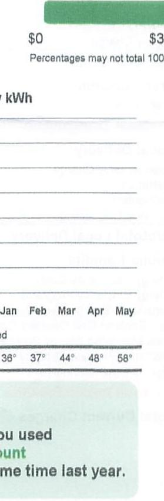

Account Number: 010-0001432-8032
Statement Date: 05/24/2024
Service Location: COOPER SURGICAL
50 CORPORATE DR FP
TRUMBULL, CT 08811
POD-ID: 3000000043500
Customer Name Key: COOP
Rate: GS - General Service
Meter Reading Cycle: 15
Bill Period: 04/22/24 to 05/21/24
Next Meter Reading: On or about 06/21/24

## Current Charges for Electricity

| Supply | Transmission | Local Delivery | Public Benefits |
| :--: | :--: | :--: | :--: |
| $\$ 0.00$ | $\$ 0.00$ | $\$ 16.98$ | $\$ 0.00$ |
| Cost of electricity from supplier or Standard Service. This cost is deregulated but is based on competitive procurements and dependent on usage. | Cost to maintain high voltage towers and lines. Regulated by the Federal Energy Regulatory Commission. This charge is dependent on usage. | Cost of UI to build, maintain, and repair poles, lines, and meters that deliver power from the substation. Regulated by PURA. | Cost to support energy programs authorized by the state. Charge dependent on usage. |

The image is a graph/chart.

- **Chart Type**: Bar chart
- **Data Points**:
  - January: 36 kWh
  - February: 37 kWh
  - March: 44 kWh
  - April: 48 kWh
  - May: 58 kWh
- **Axis Title**: "kWh"
- **Additional Text**: 
  - "$0"
  - "$3"
  - "Percentages may not total 100%"
- **Yearly Usage Breakdown (Monthly-Based)**: The chart shows monthly electricity usage from January to May, with increasing usage each month.
- **Styling**: The bars are green, with a note that percentages may not total 100%.

## Your Supplier Information

THE UNITED ILLUMINATING COMPANY
PO BOX 1564
NEW HAVEN, CT 06506-0901
1-800-722-5584
www.ulnet.com
Supply Summary information is provided by your supplier. Contact your supplier to verify the information. To return to Standard Service visit EnergizeCT.com or contact us at uinet.com or 800-7-CALL-UI.

Please return this stub with your payment. Please allow 7 to 10 business days for processing. Do not send cash or coins, and do not return with staples or paper clips. Please make your check payable to: The United Illuminating Company

Please consider adding $\$ 1, \$ 2$, or $\$ 3$ for Operation Fuel. You can also add more when paying your bill online or by phone. 100\% of your tax-deductible donation provides energy assistance grants.

AV 01 00847084878H 33 A**5DGT
$\mathrm{HH}\left[\mathrm{HH}\left[\mathrm{HH}\left[\mathrm{HH}\left[\mathrm{HH}\left[\mathrm{H}\right.\right.\right.\right.\right] \mathrm{ind}\left(\mathrm{ind}\left(\mathrm{ind}\left(\mathrm{ind}\left(\mathrm{ind}\left(\mathrm{ind}\right.\right.\right)\right.\right.\right.$
COOPER SURGICAL
75 CORPORATE DR
TRUMBULL CT 08811

## Your Manstion

All charges are due as of your Statement Date. For non-residential and residential non-hardship customers, any unpaid charges may be subject to a late payment charge as of your Statement Date, at the rate of $1.25 \%$ per month, if not paid on or before 06/21/24. If you make your payment on the Due Date at an authorized payment agent, your payment may not post until the following business day. If you have questions, please contact us.
Service will be delivered at one point through a single meter except as may be provided in Section 10b of the Company's Terms and Conditions. When the Company elects to meter service at primary voltage, the kilowatt-hours metered will be reduced by $3 \%$ for billing purposes.

[^0]
[^0]:    Please send payment to:

    THE UNITED ILLUMINATING COMPANY
    PO BOX 847818
    BOSTON, MA 02284-7818

# Your Meter Details 

Bill Cycle: 15
Service Period: 04/22/24 to 05/21/24 | 30 Days
POD-ID: 3000000043500
Service Address: 50 CORPORATE DR FP TRUMBULL CT 06611

| Meter   Number | Current   Read | Prior   Read | Multiplier | Total   kWh | Read   Type | Demand   kW |
| :--: | :--: | :--: | :--: | :--: | :--: | :--: |
| 011219936 Peak | 000000 | 000000 | 120 | 0 | Actual | 0.0 |
| 011219936 Shoulder | 000000 | 000000 | 120 | 0 | Actual | 0.0 |
| 011219936 Off Peak | 000001 | 000001 | 120 | 0 | Actual | 0.5 |

## Your Messages:

As we head into the cooling season, you can take steps to reduce your energy use and bill. Take advantage of energy-saving improvements to help you stay comfortable efficiently with Home Energy Solutions. You'll receive on-the-spot services plus recommendations and rebates for additional ways to save. For help with your energy bill and ways to lower your energy use visit uinet.com/UnderstandYourUsage.
As part of our continuing efforts to enhance your billing experience, the Combined Public Benefits Charge (CPBC) and Non-Bypassable Federal Mandated Congestion Charge (NBFMCC) under the Public Benefits section of your bill are now broken out into seven distinct charges, giving you more opportunity to see the value of our electricity service. Please visit uinet.com/BillingGlossary for more information.
View and pay your bill at home or on the go! With eBill, you can access your account at any time from your computer or mobile device. It's fast, secure, convenient, and good for the planet. Sign up today by using our Mobile App or visiting uinet.com/eBill.

## Account Summary

## Prior Balance

Payment Received 05/13/24 - Thank you!
Balance Forward
Total Current Charges
Total Balance

## Total Charges for Electricity

## Supply:

| Supply Charge | $0 \mathrm{kWh} \times \$ 0.170520$ | $\$ 0.00$ |
| :-- | :-- | :-- |
| Subtotal Supply |  | $\$ 0.00$ |
| Transmission: |  |  |
| Transmission | $0 \mathrm{kWh} \times \$ 0.064138$ | $\$ 0.00$ |
| Subtotal Transmission |  | $\$ 0.00$ |
| Local Delivery: |  |  |
| Fixed Monthly Charge |  | $\$ 16.98$ |
| Distribution | $0.5 \mathrm{~kW} \times \$ 0.000000$ | $\$ 0.00$ |
| Distribution | $0 \mathrm{kWh} \times \$ 0.082324$ | $\$ 0.00$ |
| Revenue Decoupling | $0 \mathrm{kWh} \times \$ 0.000405$ | $\$ 0.00$ |

Subtotal Local Delivery \$16.98
Public Benefits:
Energy Assistance Costs 0 kWh x \$0.009221
Energy Efficiency Programs 0 kWh x \$0.006000
Renevable Energy Investment 0 kWh x \$0.001000
New England Grid Operator Cost 0 kWh x \$0.000542-
State Mandated Energy Purchases 0 kWh x \$0.003389
Customer Produced Energy 0 kWh x \$0.001810-
Misc. \& Other Mandates 0 kWh x \$0.000991
Subtotal Public Benefits \$0.00
Total Current Charges \$16.98

## UI Contact Information

| Manage your account online at uinet.com | For emergency services or billing inquiries call: $1.800 .722 .5584$. | 

The image is a photo or illustration of a QR code on a white background. There are no additional elements or text visible in the image. | Scan QR code for more information on our website about your bill. |
| :--: | :--: | :--: | :--: |

Need to change your mailing address or stop or transfer service?

For easy online account management, login to uinet.com/MyAccount. Don't have an online account yet? Visit uinet.com/Registration to get started.

You may also contact us at 800.722.5584 Monday through Friday 7 a.m. - 7 p.m.
For mailing address changes, you may also submit your request online at uinet.com/ContactUs.

