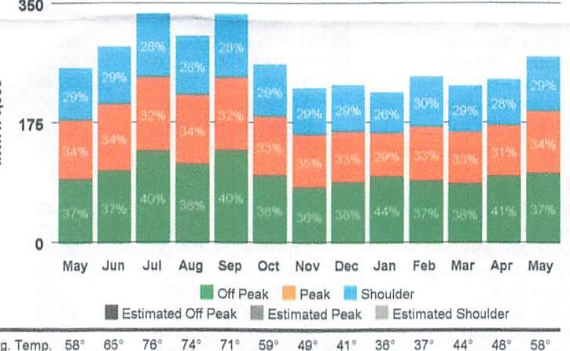
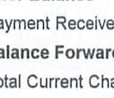
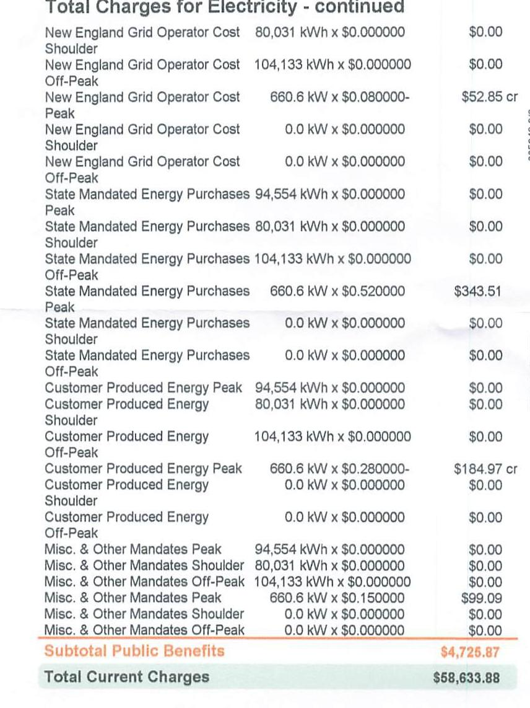

Account Number: 010-0000380-0199
Statement Date: 05/23/2024

Service Location:
COOPER SURGICAL
95 CORPORATE DR
TRUMBULL, CT 06611
POD-ID: 2411004229003
Customer Name Key: COOP
Rate: LPT - Large Power Time of Day
Meter Reading Cycle: 15
Bill Period: 04/22/24 to 05/21/24
Next Meter Reading: On or about 06/21/24

Current Charges for Electricity

| Supply | Transmission | Local Delivery | Public Benefits |
| :--: | :--: | :--: | :--: |
| \$36,762.90 | \$9,096.46 | \$8,048.65 | \$4,725.87 |
| Cost of electricity from supplier or Standard Service. This cost is deregulated but is based on competitive procurements and dependent on usage. | Cost to maintain high voltage towers and lines. Regulated by the Federal Energy Regulatory Commission. This charge is dependent on usage. | Cost of UI to build, maintain, and repair poles, lines, and meters that deliver power from the substation. Regulated by PURA. | Cost to support energy programs authorized by the state. Charge dependent on usage. |

|  |  |  |  |  |  |  |  |  |  |  |  |  |  |  |
| :--: | :--: | :--: | :--: | :--: | :--: | :--: | :--: | :--: | :--: | :--: | :--: | :--: | :--: | :--: |
| \$0 | \$11,727 | \$23,454 | \$35,180 | \$46,907 | \$58,634 |  |  |  |  |  |  |  |  |
|  |  |  |  |  |  |  |  |  |  |  |  |  |  |  |
| Percentages may not total 100\% due to rounding. |  |  |  |  |  |  |  |  |  |  |  |  |  |

## Using History - Total Monthly kWh

The image is a bar chart showing a **yearly usage breakdown (monthly-based)** for electricity consumption. 

- **Chart Type**: Stacked Bar Chart
- **X-Axis**: Months (May to May)
- **Y-Axis**: Unspecified units, with markers at 0, 175, and 350.
- **Legend**:
  - Green: Off Peak
  - Red: Peak
  - Blue: Shoulder
  - Gray: Estimated Off Peak
  - Dark Gray: Estimated Peak
  - Light Gray: Estimated Shoulder
- **Data Points**:
  - May: 37% Off Peak, 34% Peak, 29% Shoulder
  - Jun: 34% Off Peak, 32% Peak, 34% Shoulder
  - Jul: 34% Off Peak, 32% Peak, 34% Shoulder
  - Aug: 34% Off Peak, 32% Peak, 34% Shoulder
  - Sep: 40% Off Peak, 32% Peak, 28% Shoulder
  - Oct: 40% Off Peak, 31% Peak, 29% Shoulder
  - Nov: 39% Off Peak, 32% Peak, 29% Shoulder
  - Dec: 33% Off Peak, 36% Peak, 31% Shoulder
  - Jan: 34% Off Peak, 36% Peak, 30% Shoulder
  - Feb: 37% Off Peak, 34% Peak, 29% Shoulder
  - Mar: 38% Off Peak, 33% Peak, 29% Shoulder
  - Apr: 41% Off Peak, 31% Peak, 28% Shoulder
  - May: 37% Off Peak, 34% Peak, 29% Shoulder
- **Temperature Data**: Average temperatures are listed below each month, ranging from 36°F to 76°F.

Percentage may not total 100\% due to rounding. and may not display if space is limited. Peak hours are noon to 8 p.m. weekdays, a total of 40 hours or about $24 \%$ per week. All other hours, including weekend hours, are off peak.

## How Your Use Changed

This Month's Electric Use 270,600 kWh

This month you used $6.82 \%$ more than at the same time last year.

## Your Messages:

All charges are due as of your Statement Date. For non-residential and residential non-hardship customers, any unpaid charges may be subject to a late payment charge as of your Statement Date, at the rate of $1.25 \%$ per month, if not paid on or before 06/20/24. If you make your payment on the Due Date at an authorized payment agent, your payment may not post until the following business day. If you have questions, please contact us.
Service will ordinarily be measured through a single meter at a primary voltage. In cases where service is measured at secondary voltage, the kilowatt-hours metered will be increased $3 \%$ for billing purposes.

Please return this stub with your payment. Please allow 7 to 10 business days for processing. Do not send cash or coins, and do not return with staples or paper clips. Please make your check payable to:
The United Illuminating Company
Please consider adding $\$ 1, \$ 2$, or $\$ 3$ for Operation Fuel. You can also add more when paying your bill online or by phone. 100\% of your tax-deductible donation provides energy assistance grants.

Account Number
010-0000380-0199
Due Date
06/20/2024
Amount New Due
\$60,388.93
Amount Paid

[^0]
[^0]:    A V 0100534393501 H 22 A**SOGT
    '๑๑[๑๑๑๑๑|[๑|๑|๑|]|[๑| | ๑|]|[๑| | ๒|]|]| 1
    COOPER SURGICAL
    C/O ACCTS PAYABLE
    95 CORPORATE DR
    TRUMBULL CT 06611

| Year | 010151816955 |
| :-- | :-- |
|  |  |
|  |  |
|  |  |
|  |  |
|  |  |
|  |  |

## Your Meter Details

Bill Cycle: 15
Service Period: 04/22/24 to 05/21/24 | 30 Days
POD-4D: 2411004229003
Service Address: 95 CORPORATE DR TRUMBULL CT 06611

| Meter   Number | Current   Read | Prior   Read | Multiplier | Total   kWh | Read   Type | Demand   kW |
| :-- | :--: | :--: | :--: | :--: | :--: | :--: |
| 011288202 Peak | 020411 | 020105 | 300 | 91,800 | Actual | 660.6 |
| 011288202 Shoulder | 017365 | 017106 | 300 | 77,700 | Actual | 600.3 |
| 011288202 Off Peak | 022235 | 021898 | 300 | 101,100 | Actual | 569.1 |

## Your Messages:

As we head into the cooling season, you can take steps to reduce your energy use and bill. Take advantage of energy-saving improvements to help you stay comfortable efficiently with Home Energy Solutions. You'll receive on-the-spot services plus recommendations and rebates for additional ways to save. For help with your energy bill and ways to lower your energy use visit uinet.com/UnderstandYourUsage.
As part of our continuing efforts to enhance your billing experience, the Combined Public Benefits Charge (CPBC) and Non-Bypassable Federal Mandated Congestion Charge (NBFMCC) under the Public Benefits section of your bill are now broken out into seven distinct charges, giving you more opportunity to see the value of our electricity service. Please visit uinet.com/BillingGlossary for more information.
View and pay your bill at home or on the go! With eBill, you can access your account at any time from your computer or mobile device. It's fast, secure, convenient, and good for the planet. Sign up today by using our Mobile App or visiting uinet.com/eBill.

## UI Contact Information

| Manage your account online at uinet.com | For emergency services or billing inquiries call: $1.800 .722 .5584$. | 

The image is a photo showing the following text:

- "Payment Receiv"
- "Balance Forward"
- "Total Current Cha" | Scan QR code for more information on our website about your bill. |
| :--: | :--: | :--: | :--: |

## Account Summary

## Prior Balance

$278,718 \mathrm{kWh} \times \$ 0.131900$
Subtotal Supply
Transmission:
Transmission Peak
Transmission Shoulder
Transmission Off-Peak
Transmission Peak
Transmission Shoulder
Transmission Off-Peak

Subtotal Transmission
Local Delivery:
Fixed Monthly Charge
Distribution Peak
Distribution Shoulder
Distribution Off-Peak
Distribution Peak
Distribution Shoulder
Distribution Onto
Revenue Decoupling

| 94,554 kWh $\times \$ 0.000000$ | $\$ 0.00$ |
| :-- | --: |
| 80,031 kWh $\times \$ 0.000000$ | $\$ 0.00$ |
| 104,133 kWh $\times \$ 0.000000$ | $\$ 0.00$ |
| 660,6 kW $\times \$ 13.770000$ | $\$ 9,096.46$ |
| 0.0 kW $\times \$ 0.000000$ | $\$ 0.00$ |
| 0.0 kW $\times \$ 0.000000$ | $\$ 0.00$ |
|  | $\$ 9,896.46$ |
|  | $\$ 345.49$ |
| 660,6 kW $\times \$ 11.490000$ | $\$ 7,590.29$ |
| 0.0 kW $\times \$ 11.490000$ | $\$ 0.00$ |
| 94,554 kWh $\times \$ 0.000000$ | $\$ 0.00$ |
| 80,031 kWh $\times \$ 0.000000$ | $\$ 0.00$ |
| 104,133 kWh $\times \$ 0.000000$ | $\$ 0.00$ |
| 278,718 kWh $\times \$ 0.000405$ | $\$ 112.87$ |
|  |  |

## Public Benefits:

Energy Assistance Costs
Energy Efficiency Programs
Renewable Energy Investment
New England Grid Operator Cost Peak

278,718 kWh $\times \$ 0.009221$
278,718 kWh $\times \$ 0.006000$
278,718 kWh $\times \$ 0.001000$
94,554 kWh $\times \$ 0.000000$

278,718 kWh $\times \$ 0.009221$
278,718 kWh $\times \$ 0.006000$
278,718 kWh $\times \$ 0.001000$
94,554 kWh $\times \$ 0.000000$
278,718 kWh $\times \$ 0.00
continued on next page

Need to change your mailing address or stop or transfer service?

For easy online account management, login to uinet.com/MyAccount. Don't have an online account yet? Visit uinet.com/Registration to get started.

You may also contact us at 800.722.5584 Monday through Friday 7 a.m. - 7 p.m.
For mailing address changes, you may also submit your request online at uinet.com/ContactUs.

The image is a photo of a document detailing electricity charges. It includes various line items with quantities, rates, and costs. The text is structured in a tabular format with the following entries:

- **New England Grid Operator Cost**
  - 80,031 kWh x $0.000000 = $0.00 (Shoulder)
  - 104,133 kWh x $0.000000 = $0.00 (Off-Peak)
  - 660.6 kW x $0.080000 = $52.85 cr (Peak)
  - 0.0 kW x $0.000000 = $0.00 (Shoulder)
  - 0.0 kW x $0.000000 = $0.00 (Off-Peak)

- **State Mandated Energy Purchases**
  - 94,554 kWh x $0.000000 = $0.00 (Peak)
  - 80,031 kWh x $0.000000 = $0.00 (Shoulder)
  - 104,133 kWh x $0.000000 = $0.00 (Off-Peak)
  - 660.6 kW x $0.520000 = $343.51 (Peak)
  - 0.0 kW x $0.000000 = $0.00 (Shoulder)
  - 0.0 kW x $0.000000 = $0.00 (Off-Peak)

- **Customer Produced Energy**
  - 94,554 kWh x $0.000000 = $0.00 (Peak)
  - 80,031 kWh x $0.000000 = $0.00 (Shoulder)
  - 104,133 kWh x $0.000000 = $0.00 (Off-Peak)
  - 660.6 kW x $0.280000 = $184.97 cr (Peak)
  - 0.0 kW x $0.000000 = $0.00 (Shoulder)
  - 0.0 kW x $0.000000 = $0.00 (Off-Peak)

- **Misc. & Other Mandates**
  - 94,554 kWh x $0.000000 = $0.00 (Peak)
  - 80,031 kWh x $0.000000 = $0.00 (Shoulder)
  - 104,133 kWh x $0.000000 = $0.00 (Off-Peak)
  - 660.6 kW x $0.150000 = $99.09 (Peak)
  - 0.0 kW x $0.000000 = $0.00 (Shoulder)
  - 0.0 kW x $0.000000 = $0.00 (Off-Peak)

- **Subtotal Public Benefits**: $4,725.87
- **Total Current Charges**: $58,633.88

The document uses a mix of regular and bold text, with some entries highlighted in orange.

# Miscellaneous Charges \& Credits 

CT Gross Receipts Tax Credit (8.5\%) ..... \$1,841.63 cr
CT Sales Tax on Electricity ..... \$3,596.78
Total Miscellaneous Charges \& Credits ..... \$1,766.16

