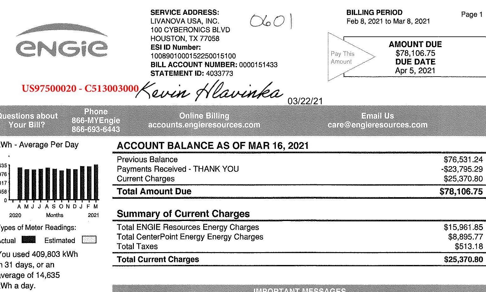
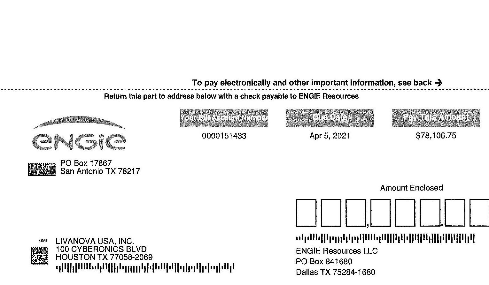
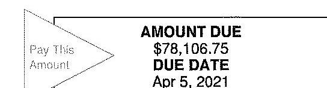

The image is a photo of a billing statement from ENGIE Resources. Key details include:

- **Service Address:** LivaNova USA, Inc., 100 Cyberonics Blvd, Houston, TX 77058
- **ESI ID Number:** 1008901000152250015100
- **Bill Account Number:** 0000151433
- **Statement ID:** 4033773
- **Billing Period:** Feb 8, 2021 to Mar 8, 2021
- **Amount Due:** $78,106.75
- **Due Date:** Apr 5, 2021
- **Account Balance as of Mar 16, 2021:**
  - Previous Balance: $76,531.24
  - Payments Received - Thank You: -$23,795.29
  - Current Charges: $25,370.80
  - Total Amount Due: $78,106.75
- **Summary of Current Charges:**
  - Total ENGIE Resources Energy Charges: $15,961.85
  - Total CenterPoint Energy Energy Charges: $8,895.77
  - Total Taxes: $513.18
  - Total Current Charges: $25,370.80
- **Contact Information:**
  - Phone: 866-MyEngie, 866-693-6443
  - Online Billing: accounts.engieresources.com
  - Email: care@engieresources.com
- **Graph:** Displays kWh usage per day from April 2020 to March 2021, with months labeled AMJ JASONDJFM and years 2020 and 2021. The graph shows actual and estimated readings.
- **Usage Information:** 409,803 kWh used over 31 days, averaging 14,635 kWh per day.

RECEIVED BY A/P

LIVANOVA

To pay electronically and other important information, see back $\rightarrow$
Return this part to address below with a check payable to ENGIE Resources

The image is a photo of a billing statement from ENGIE Resources. It includes the following details:

- **ENGIE Logo** at the top.
- **Instruction:** "To pay electronically and other important information, see back."
- **Instruction:** "Return this part to address below with a check payable to ENGIE Resources."
- **Your Bill Account Number:** 0000151433
- **Due Date:** Apr 5, 2021
- **Pay This Amount:** $78,106.75
- **Address for Payment:** 
  - PO Box 17867
  - San Antonio TX 78217
- **Customer Address:**
  - LIVANOVA USA, INC.
  - 100 CYBERONICS BLVD
  - HOUSTON TX 77058-2069
- **ENGIE Resources LLC Address:**
  - PO Box 841680
  - Dallas TX 75284-1680
- **Amount Enclosed:** Space provided for amount entry.

# BILL ACCOUNT NUMBER 0000151433 

## Understanding Your Bill

Your Bill Account Number - A unique number assigned to your account. Customers with multiple locations may have multiple account numbers.
Due Date - The date your payment is due to arrive at ENGIE Resources in order to avoid late charges.
Energy Charge - A charge based on the electric energy ( kWh ) consumed.
Utility Charges - Charges for services rendered by your local Transmission and Distribution Service Provider. These charges are set by the service provider.
Taxes - Taxes imposed on energy and utility charges and remitted to taxing entities.
Gross Receipts Tax Reimbursement - A fee assessed to recover the miscellaneous gross receipts tax imposed on retail electric providers operating in an incorporated city or town having a population more than 1,000.
PUC Assessment Reimbursement - A fee assessed to recover the statutory fee for administering the Public Utility Regulatory Act.
Sales Tax - Sales tax collected by authorized taxing authorities, such as the state, cities, and special purpose districts.
Late Payment Penalty - A charge assessed for late payment in accordance with Public Utility Commission rules. kW (Kilowatt) - The standard unit for measuring electricity demand, equal to 1,000 watts.
kWh (Kilowatt-hour) - The standard unit for measuring electricity energy consumption, equal to 1,000 watt-hours. Prevent Disconnect - Please be aware that all charges must be paid each month to keep your account current and prevent collection activities. Neglecting to pay all charges may result in disconnection.
Right to Dispute Bill - If you believe your bill is inaccurate or you wish to dispute all or part of any bill, please contact ENGIE Resources at 1-866-693-6443 (1-866-MYEngie). If you are not satisfied with the decision or do not receive a decision within 10 days, you have the right to appeal to the Public Utility Commission of Texas, P.O. Box 13326, Austin, TX 78711-3326. Telephone 1-868-782-8477. Hearing and speech impaired individuals with text telephone (TTY) may contact the commission at 1-512-936-7136.

Corporate Headquarters: ENGIE Resources, 1360 Post Oak Blvd, Suite 400, Houston TX 77056, Internet: www.ENGIEResources.com.

* Make electronic payments to: Bank of America Merrill Lynch, Dallas, ACH Routing: 111000012, Wire ABA: 026009593, Account Number: 4451335207.
* Mail payments to: ENGIE Resources LLC, P.O. Box 841680 Dallas, TX 75284-1680.
* Mail overnight payments to: Bank of America Lockbox Services, Lockbox 841680, 1950 N Stemmons Freeway, Suite 5010 Dallas, TX 75207.
* Mail notes and letters in a separate envelope to: ENGIE Resources, 1360 Post Oak Blvd, Suite 400, Houston TX 77056.
* Fed. I.D. 37-1796578.
* PUCT License \# 10053.

# SERVICE ADDRESS: 

LIVANOVA USA, INC. 100 CYBERONICS BLVD HOUSTON, TX 77058
ESI ID Number:
1008901000152250015100
BILL ACCOUNT NUMBER: 0000151433
STATEMENT ID: 4033773

BILLING PERIOD
Feb 8, 2021 to Mar 8, 2021

The image is a cropped section of a bill showing payment information. It includes the following text:

- "Pay This Amount"
- "AMOUNT DUE $78,106.75"
- "DUE DATE Apr 5, 2021"

Questions about
Your Bill?

| Phone | Online Billing. | Email Us |
| :--: | :--: | :--: |
| $493-6443$ | accounts.eng(eressources.com | care@eng(eressources.com |

## Charges for Billing Period for Feb 8, 2021 to Mar 8, 2021

For power outages and other electrical emergencies, call your electric distribution company:
CenterPoint Energy
1-800-332-7143
ESI ID Number
1008901000152250015100

Fixed Price Energy Charge 409803.48kWh @ \$0.03895
Subtotal Supplier Charges
Accumulated Deferred Federal Income Tax
Customer Charge
Distribution System Charge 958 NCP kVA @ \$4.449405
Electricity Relief Program 409803.48 kWh @ \$0.00033
Energy Efficiency Cost Recovery Factor 409803.48 kWh @ \$0.000644
Metering Charge
Nuclear Decommissioning Charge 958 NCP kVA @ \$0.000605
Rate Reduction Credit 958 NCP kVA @ \$-0.116827
Transition Charge 4958 NCP kVA @ \$0.100094
Transition Charge 5944.25 kVA @ \$0.961652
Transmission Cost Recovery Factor 630.36 4CP kVA @ \$5.123626
Subtotal TOSP Charges
Gross Receipts Tax - Delivery
Gross Receipts Tax - Supply
Puca Reimbursement - Delivery
Puca Reimbursement - Supply
Subtotal Taxes and Fees

## GENERAL INFORMATION

Thank you for being an ENGIE Resources customer, we value your business.
The average price you paid for electric service this month: 3.895¢ per kWh .
Please be aware that your service with ENGIE Resources at the contract price in this agreement will expire on the regularly scheduled utility meter read date that follows the last day of December 2021.
If by that time you have not signed a new contract for service with ENGIE Resources, signed a contract with another electricity provider, or provided a written request to ENGIE Resources to transfer your accounts to the default service provider, then you will begin paying a post-term rate for month-to-month service. The contract price for post-term service will be an amount equal to the applicable real time index price as posted by the independent system operator for the relevant delivery point, plus a per kWh Post-Term Charge as defined in your Agreement, plus any applicable non-utility charges, Taxes, and Utility Related Charges.
Meter data on back.
ENGIE Resources reports status of accounts and payment history to credit bureaus.

BILL ACCOUNT NUMBER
0000151433
Summary of Usage by Meter

| Reading Dates   Previous/Current | Meter   Number | Meter   Constant | Meter Reading |  | Usage   Type | Usage |
| :-- | :--: | :--: | :--: | :--: | :--: | :--: |
| Feb 08 / Mar 08 | 92433922 | 0 | 0 | 0 | kWh | $409,803.5$ |

UNDERSTANDING YOUR METER INFORMATION
Meter Constant - A fixed value which is used when converting meter readings to actual energy use.
Power Factor - A measurement used by some electrical distribution companies to determine the ratio of real power flowing to the load of apparent power.
OffPk (Off-Peak) - Those periods of time at which energy is generally being delivered far below the utility's maximum demand.
OnPk (On-Peak) - Those periods of time at which energy is generally being delivered near or at the utility's maximum demand.
kW (kilowatt) - A unit of power equal to 1000 watts.
kWh (Kilowatt-hour) - The standard unit for measuring electricity energy consumption, equal to 1,000 watt-hours.
kVa (Kilovolt-ampere) - The amount of apparent power in an electrical circuit, equal to the product of voltage and current.
kVAR (Kilo-Volt-Amperes Reactive) - The product of the voltage and the amperage required to excite inductive circuits.
kVARH (Kilo-Volt Amp Reactive Hours) - A measure of energy supplied but not converted into work.
kV (kilovolt) - A unit of electromotive force, equal to 1,000 volts.

