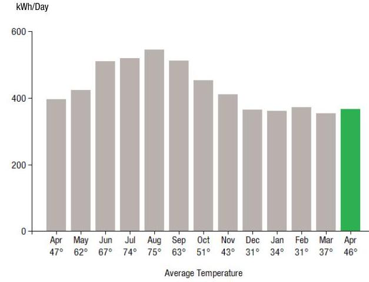
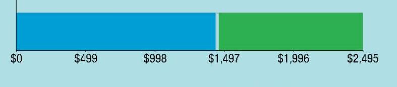
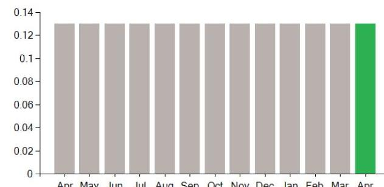
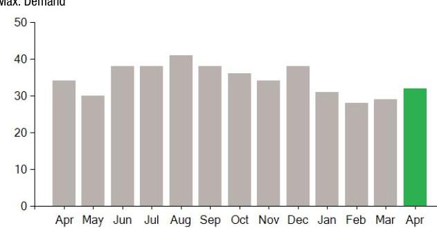

## EVERSEURCE

Account Number: 54186287058
Statement Date: 04/12/23
Service Provided To:
WEST SIDE DONUTS, INC

## Electric Usage History - Kiloworth House (kWh)

The image is a bar chart.

- **Chart Type**: Bar chart
- **X-Axis**: Average Temperature
  - Apr 47°
  - May 62°
  - Jun 67°
  - Jul 74°
  - Aug 75°
  - Sep 63°
  - Oct 51°
  - Nov 43°
  - Dec 31°
  - Jan 34°
  - Feb 31°
  - Mar 37°
  - Apr 46°
- **Y-Axis**: kWh/Day (ranging from 0 to 600)
- **Data Points**:
  - Apr: ~350 kWh
  - May: ~450 kWh
  - Jun: ~500 kWh
  - Jul: ~550 kWh
  - Aug: ~550 kWh
  - Sep: ~500 kWh
  - Oct: ~400 kWh
  - Nov: ~350 kWh
  - Dec: ~300 kWh
  - Jan: ~300 kWh
  - Feb: ~300 kWh
  - Mar: ~350 kWh
  - Apr: ~375 kWh (highlighted in green)
- **Styling**: The bar for April is highlighted in green, indicating a notable emphasis compared to other months.
- **Yearly Usage Breakdown (Monthly-Based)**: The chart shows monthly electric usage in kWh per day over a year, with corresponding average temperatures.

## Electric Usage Summary

| This month your   average daily   electric use was   367.0 kWh | This month you used   $7.6 \%$ less   than at the   same time last year | $7.6$   USAGE |
| :-- | :-- | :-- |

## News For You

If you're having trouble paying your energy bill, we have programs to help - even if you've never needed them before. Visit Eversource.com/billhelp for info on payment plans and other assistance programs available to you.

Remit Payment To: Eversource, PO Box 56005, Boston, MA 02205-6005

## EVERSEURCE

Account Number: 54186287058
You may be subject to a $1.02 \%$ late payment charge if the "Total Amount Due" is not received by 05/07/23

## Total Amount Due

by 05/07/23
\$990.69
\$960.63
\$960.63
\$0.00
\$990.69

Current Charges for Electricity

| Supply | Delivery |
| :--: | :--: |
| \$1,434.14 | \$1,051.08 |
| Cost of electricity from DIRECT ENERGY BUSINESS, LLC | Cost to deliver electricity from Eversource |

The image is a bar chart.

- **Chart Type**: Bar chart
- **X-Axis**: Represents monetary values
- **Data Points**:
  - $0
  - $499
  - $998
  - $1,497
  - $1,996
  - $2,495
- **Styling**: The bar is divided into two segments, with the first segment in blue and the second in green. The transition between the segments occurs at $1,497.

Your electric supplier is
DIRECT ENERGY BUSINESS, LLC 1001 LIBERTY AVE
PITTSBURGH PA 15222-3714 888-925-9115

Please make your check payable to Eversource and consider adding $\$ 1$ for Good Neighbor.
Visit Eversource.com to make your payment today. If mailing payment, please allow up to 5 business days to post.

## Total Amount Due

by 05/07/23
\$990.69

## Amount Enclosed

Eversource
PO Box 56005
Boston, MA 02205-6005

# EVERSEURCE 

Account Number: 54186287058
Customer name key: WEST
Statement Date: 04/12/23
Service Provided To:
WEST SIDE DONUTS, INC

| Sye Addr: 11 PERIEST |  |  |  |  |  |
| :--: | :--: | :--: | :--: | :--: | :--: |
| WEST SERINGFIELD MA 01089 |  |  |  |  |  |
| Serv Ref: 380153009 |  |  | Bill Cycle: 09 |  |  |
| Service from 03/13/23 - 04/12/23 |  |  | 30 Days |  |  |
| Next read date on or about: May 11, 2023 |  |  |  |  |  |
| Meter   Number | Current   Read | Previous   Read | Current   Usage | Reading   Type |  |
| 892904542 | 08287 | 75289 | 10998 | Actual |  |
| Total Demand Use $=32.40 \mathrm{~kW}$ |  |  |  |  |  |
| Monthly kWh Use |  |  |  |  |  |
| Apr | May | Jun | Jul | Aug | Sep | Oct |
| 11506 | 13106 | 16321 | 15578 | 17417 | 15327 | 13148 |
| Nov | Dec | Jan | Feb | Mar | Apr |  |
| 11476 | 12057 | 11183 | 10420 | 10949 | 10998 |  |

## Contact Information

Emergency: 877-659-6326
www.eversource.com
Pay by Phone: 888-783-6618
Customer Service: 888-783-6610

## Total Amount Due by 05/07/23

## $* 990.69$

Electric Account Summary
Amount Due On 04/07/23
Last Payment Received On 04/04/23
$8960.63$
Balance Forward
$0.00
Current Charges/Credits
Electric Supply Services
$1,434.14
Delivery Services
$1,051.08
Other Charges or Credits
$8990.69$
Total Amount Due
$990.69$

## Total Charges for Electricity

## Supplier

DIRECT ENERGY BUSINESS
Service Reference: 380153009
Generation Srvc Chrg
$10998.00 \mathrm{kWh} \times \$ 0.13040$
$1,434.14$
Subtotal Supplier Services
$1,434.14$

## Delivery

(RATE G1)
Service Reference: 380153009
Customer Chrg
$30.00
Distribution Dmd Chrg
Distribution Enrgy Chrg
$30.50 \mathrm{KW} \times \$ 10.83000$
Distribution Enrgy Chrg
$10998.00 \mathrm{kWh} \times \$ 0.00320$
$10998.00 \mathrm{kWh} \times \$ 0.00411$
$30.50 \mathrm{KW} \times \$ 9.94000$
Res Assist Adj Clause
$30.50 \mathrm{KW} \times \$ 9.94000$
$10998.00 \mathrm{kWh} \times \$ 0.00962$
$10998.00 \mathrm{kWh} \times \$ 0.00962$
Basic Srv Cost Adj
Net metering recovery surchrge
Solar Program Cost Adjustment
Renewable Enrgy Chrg
Energy Efficiency
$30.50 \mathrm{KW} \times \$ 10.83000$
$10998.00 \mathrm{kWh} \times \$ 0.00320$
$10998.00 \mathrm{kWh} \times \$ 0.00411$
$30.50 \mathrm{KW} \times \$ 9.94000$
$10998.00 \mathrm{kWh} \times \$ 0.00962$
$10998.00 \mathrm{kWh} \times \$ 0.00058$
$10998.00 \mathrm{kWh} \times \$ 0.00222$
$10998.00 \mathrm{kWh} \times \$ 0.00524$
$10998.00 \mathrm{kWh} \times \$ 0.00003$
$10998.00 \mathrm{kWh} \times \$ 0.00050$
$10998.00 \mathrm{kWh} \times \$ 0.01094$
$1,434.14$

## $* 30.00$

$330.32$
\$35.19
$-$ \$45.20
\$303.17
\$105.80
$-$ \$6.38
\$24.42
\$57.63
$-$ \$0.33
\$5.50
\$120.32

Eversource is required to comply with Department of Public Utilities' billing and termination regulations. If you have a dispute please see the bill insert for more information.
For an electronic version of this insert, residential customers go to Eversource.com/about-residential-bill and business customers go to Eversource.com/about-business-bill. Then select "Monthly Bill Inserts" from the page. Budget Billing is also available to pay a more consistent bill each month. Please see the Customer Rights Supplement for more information.

# EVERSEURCE 

Account Number: 54186287058
Customer name key: WEST
Statement Date: 04/12/23
Service Provided To:
WEST SIDE DONUTS, INC

Continued from previous page...

## Supply Rate

Dollars / kWh

The image is a bar chart.

- **Chart Type**: Bar chart
- **X-Axis**: Months (Apr, May, Jun, Jul, Aug, Sep, Oct, Nov, Dec, Jan, Feb, Mar, Apr)
- **Y-Axis**: No title, but the values range from 0 to 0.14
- **Data Points**: Each month has a bar with a height of approximately 0.12, except for the last bar (April) which is highlighted in green and slightly taller.
- **Styling**: All bars are gray except for the last bar (April), which is green.

This represents a **yearly usage breakdown (monthly-based)**.

## Demand Profile

Max. Demand

- **Chart Type**: Bar chart
- **X-Axis**: Months (Apr, May, Jun, Jul, Aug, Sep, Oct, Nov, Dec, Jan, Feb, Mar, Apr)
- **Y-Axis**: No title, but the values range from 0 to 50
- **Data Points**: Each month has a bar with heights ranging between 30 and 45, except for the last bar (April) which is highlighted in green and slightly taller.
- **Styling**: All bars are gray except for the last bar (April), which is green.

## Total Amount Due

by 05/07/23

Continued from previous page...

| Atty GenI consultant exp adj | 10998.00kWh X $\$ 0.00002$ | $\$ 0.22$ |
| :-- | --: | --: |
| Storm recovery adjustment | 10998.00kWh X $\$ 0.00218$ | $\$ 23.98$ |
| Exogenous Cost Adjustment | 10998.00kWh X $\$ 0.00070$ | $\$ 7.70$ |
| Revenue Decoupling Adj | 10998.00kWh X $\$ 0.00212$ | $\$ 23.32$ |
| Lng-Trm Rnwbl Contr Adj | 10998.00kWh X $\$$-0.00306$ | $-\$ 33.65$ |
| Vegetation Management | 10998.00kWh X $\$ 0.00089$ | $\$ 9.79$ |
| Solar Expansion Charge | 10998.00kWh X $\$-0.00027$ | $-\$ 2.97$ |
| Grid Modernization Charge | 10998.00kWh X $\$ 0.00130$ | $\$ 14.30$ |
| Tax Act Credit | 10998.00kWh X $\$-0.00113$ | $-\$ 12.43$ |
| Distributed Solar Charge | 10998.00kWh X $\$ 0.00327$ | $\$ 35.96$ |
| Advanced Meter Infrastructure | 10998.00kWh X $\$ 0.00222$ | $\$ 24.42$ |
| Subtotal Delivery Services |  | $\$ 1,051.08$ |
| Total Cost of Electricity |  | $\$ 2,485.22$ |

Other Charges or Credits
AOBC Transfer Mar 16 - - $\$ 6.26$
AOBC Transfer Mar 22 - - $\$ 479.74$
AOBC Transfer Mar 29 - - $\$ 609.81$
AOBC Transfer Apr 03 - - $\$ 321.06$
AOBC Transfer Apr 03 - - $\$ 167.29$
6.25\% MA Sales Tax Supplier \$89.63
Subtotal Other Charges or Credits - - $\$ 1,494.53$
Total Current Charges
$\$ 990.69$

