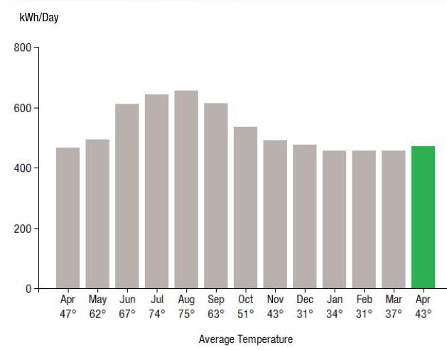
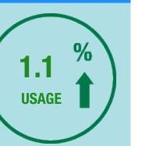
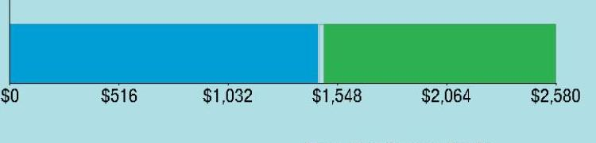
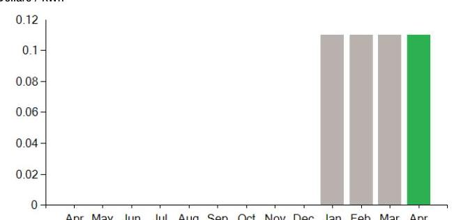
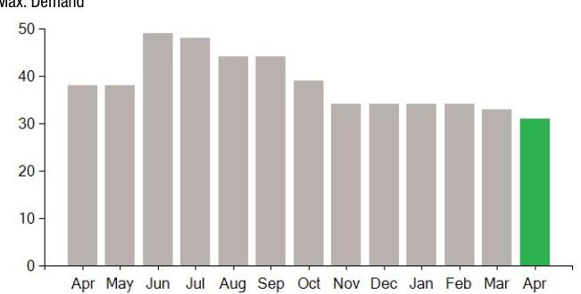

## EVERSEURCE

Account Number: $\quad 54414207019$
Statement Date: 04/04/23
Service Provided To:
AGAWAM DONUTS

## Electric Usage History - Kilowarth House (kWh)

The image is a bar chart.

- **Chart Type**: Bar chart
- **X-Axis**: Average Temperature
  - Labels: Apr (47°), May (62°), Jun (67°), Jul (74°), Aug (75°), Sep (63°), Oct (51°), Nov (43°), Dec (31°), Jan (34°), Feb (31°), Mar (37°), Apr (43°)
- **Y-Axis**: kWh/Day
  - Range: 0 to 800
- **Data Points**:
  - Apr (47°): ~450 kWh/Day
  - May (62°): ~600 kWh/Day
  - Jun (67°): ~700 kWh/Day
  - Jul (74°): ~750 kWh/Day
  - Aug (75°): ~750 kWh/Day
  - Sep (63°): ~650 kWh/Day
  - Oct (51°): ~550 kWh/Day
  - Nov (43°): ~450 kWh/Day
  - Dec (31°): ~400 kWh/Day
  - Jan (34°): ~400 kWh/Day
  - Feb (31°): ~400 kWh/Day
  - Mar (37°): ~450 kWh/Day
  - Apr (43°): ~475 kWh/Day (highlighted in green)
- **Styling**: The bar for the second April is highlighted in green, indicating a notable difference or emphasis.
- **Yearly Usage Breakdown (Monthly-Based)**: The chart shows monthly electric usage in kWh per day, with average temperatures for each month.

## Electric Usage Summary

| This month your   average daily   electric use was   472.0 kWh | This month you used   $1.1 \%$ more   than at the   same time last year | 

The image is a graphic illustration.

- **Type**: Circular graphic
- **Text**: 
  - "1.1 %"
  - "USAGE"
- **Design**: 
  - The percentage "1.1 %" is prominently displayed in green.
  - An upward arrow is present, indicating an increase.
  - The graphic is enclosed in a green circle on a light blue background. |
| :--: | :--: | :--: |

## No Payment Due

Amount Due On 03/31/23
Last Payment Received
\$11,449.21
\$0.00
Balance Forward
Total Current Charges
$-$ \$11,449.21
$\begin{array}{r}\text { Total Current Charges } \\ \text {-\$120.46 }\end{array}$

Current Charges for Electricity

| Supply | Delivery |
| :--: | :--: |
| \$1,457.24 | \$1,114.53 |
| Cost of electricity from CONSTELLATION NEWENERGY CSJ | Cost to deliver electricity from Eversource |

The image is a bar chart.

- **Chart Type**: Bar chart
- **X-Axis**: No specific title, but represents monetary values.
- **Data Points**:
  - $0
  - $516
  - $1,032
  - $1,548
  - $2,064
  - $2,580
- **Styling**: 
  - The bar is divided into two segments: blue and green.
  - The blue segment ends at $1,032, and the green segment starts at $1,548, indicating a transition between these values.
- **Background**: Light blue.

Your electric supplier is
CONSTELLATION NEWENERGY CSJ
1001 LOUISIANA ST
STE 2300
HOUSTON TX 77002-5089
844-636-3749

## News For You

If you're having trouble paying your energy bill, we have programs to help - even if you've never needed them before. Visit Eversource.com/billhelp for info on payment plans and other assistance programs available to you.

Remit Payment To: Eversource, PO Box 56005, Boston, MA 02205-6005

## EVERSEURCE

Account Number: $\quad 54414207019$
You may be subject to a $1.02 \%$ late payment charge if the "Total Amount Due" is not received by 04/29/23

Please make your check payable to Eversource and consider adding $\$ 1$ for Good Neighbor.
Visit Eversource.com to make your payment today. If mailing payment, please allow up to 5 business days to post.

## No Payment Due

Amount Enclosed

Eversource
PO Box 56005
Boston, MA 02205-6005

# EVERSEURCE 

Account Number: 54414207019
Customer name key: AGAW
Statement Date: 04/04/23
Service Provided To:
AGAWAM DONUTS

| Sye Addr: 389 MAIN ST AGAWAM MA 01091 |  |  |  |  |  |
| :--: | :--: | :--: | :--: | :--: | :--: |
| Sery Ref: 342653001 |  |  |  | Bill Cycle: 04 |  |
| Service from 03/06/23 - 04/04/23 |  |  |  | 20 Days |  |
| Next read date on or about: May 04, 2023 |  |  |  |  |  |
| Meter   Number | Current   Read | Previous   Read | Current   Usage | Reading   Type |  |
| 893323802 | 29654 | 1597 f | 13683 | Actual |  |
| Total Demand Use $=31.00 \mathrm{kW}$ |  |  |  |  |  |
| Monthly kWh Use |  |  |  |  |  |
| Apr | May | Jun | Jul | Aug | Sep | Oct |
| 13547 | 15264 | 19556 | 19292 | 20983 | 18441 | 14957 |
| Nov | Dec | Jan | Feb | Mar | Apr |  |
| 14224 | 15712 | 14197 | 12804 | 14142 | 13683 |  |

## Contact Information

Emergency: 877-659-6326
www.eversource.com
Pay by Phone: 888-783-6618
Customer Service: 888-783-6610

## No Payment Due

## Electric Account Summary

Amount Due On 03/31/23
Last Payment Received
\$11,449.21
\$0.00
Balance Forward
Current Charges/Credits
Electric Supply Services
$\$ 11,449.21$
Delivery Services
Other Charges or Credits
Total Current Charges
Total Amount Due
Total Charges for Electricity

## Supplier

CONSTELLATION NEWENERGY
Service Reference: 342653001
Generation Srvc Chrg
Subtotal Supplier Services
\$1,457.24

## Delivery

(RATE G1)
Service Reference: 342653001
Customer Chrg
29.00 KW X \$10.83000
Distribution Dmd Chrg
29.00KW X \$10.83000
Distribution Enrgy Chrg
13683.00kWh X \$0.00320
Transition Enrgy Chrg
Transmission Dmd Chrg
Res Assist Adj Clause
Pension/PBOP Adj Mechn PPAM
Basic Srv Cost Adj
Net metering recovery surchrge
Solar Program Cost Adjustment
Renewable Enrgy Chrg
Energy Efficiency
13683.00kWh X \$0.00411
29.00KW X \$9.94000
13683.00kWh X \$0.00962
13683.00kWh X $\$-0.00058$
13683.00kWh X \$0.00222
13683.00kWh X \$0.00524
13683.00kWh X $\$-0.00003$
13683.00kWh X \$0.00050
13683.00kWh X \$0.01094
\$30.00
\$314.07
\$43.79
\$56.24
\$288.26
\$131.63
\$-87.94
\$30.38
\$71.70
$-$ \$0.41
\$6.84
\$149.69

[^0]
[^0]:    $V M$ Z3004PROD.TXT

    Eversource is required to comply with Department of Public Utilities' billing and termination regulations. If you have a dispute please see the bill insert for more information.
    For an electronic version of this insert, residential customers go to Eversource.com/about-residential-bill and business customers go to Eversource.com/about-business-bill. Then select "Monthly Bill Inserts" from the page. Budget Billing is also available to pay a more consistent bill each month. Please see the Customer Rights Supplement for more information.

# EVERSEURCE 

## No Payment Due

Account Number: 54414207019
Customer name key: AGAW
Statement Date: 04/04/23
Service Provided To:
AGAWAM DONUTS

Continued from previous page...

## Supply Rate

Dollars / kWh

The image is a bar chart.

- **Chart Type**: Bar chart
- **X-Axis**: Months (Apr, May, Jun, Jul, Aug, Sep, Oct, Nov, Dec, Jan, Feb, Mar, Apr)
- **Y-Axis**: Dollars / kWh (ranging from 0 to 0.12)
- **Data Points**: 
  - Jan: Approximately 0.1
  - Feb: Approximately 0.1
  - Mar: Approximately 0.1
  - Apr: Approximately 0.1
- **Styling**: 
  - Bars for Jan, Feb, and Mar are gray.
  - The bar for Apr is green.
- **Yearly Usage Breakdown (Monthly-Based)**: The chart shows a consistent supply rate of approximately 0.1 dollars/kWh from January to April.

## Demand Profile

Max. Demand

The image is a bar chart.

- **Chart Type**: Bar chart
- **X-Axis**: Months (Apr, May, Jun, Jul, Aug, Sep, Oct, Nov, Dec, Jan, Feb, Mar, Apr)
- **Y-Axis**: Max. Demand (ranging from 0 to 50)
- **Data Points**: 
  - Apr: Approximately 35
  - May: Approximately 35
  - Jun: Approximately 45
  - Jul: Approximately 45
  - Aug: Approximately 40
  - Sep: Approximately 40
  - Oct: Approximately 35
  - Nov: Approximately 30
  - Dec: Approximately 30
  - Jan: Approximately 30
  - Feb: Approximately 30
  - Mar: Approximately 30
  - Apr: Approximately 35
- **Styling**: 
  - Bars for Apr to Mar are gray.
  - The bar for the second Apr is green.

Continued from previous page...

| Atty GenI consultant exp adj | 13683.00kWh X $\$ 0.00002$ | $\$ 0.27$ |
| :-- | --: | --: |
| Storm recovery adjustment | 13683.00kWh X $\$ 0.00218$ | $\$ 29.83$ |
| Exogenous Cost Adjustment | 13683.00kWh X $\$ 0.00070$ | $\$ 9.58$ |
| Revenue Decoupling Adj | 13683.00kWh X $\$ 0.00212$ | $\$ 29.01$ |
| Lng-Trm Rnwbl Contr Adj | 13683.00kWh X $\$$-0.00306$ | $-\$ 41.87$ |
| Vegetation Management | 13683.00kWh X $\$ 0.00089$ | $\$ 12.18$ |
| Solar Expansion Charge | 13683.00kWh X $\$-0.00027$ | $-\$ 3.69$ |
| Grid Modernization Charge | 13683.00kWh X $\$ 0.00130$ | $\$ 17.79$ |
| Tax Act Credit | 13683.00kWh X $\$-0.00113$ | $-\$ 15.46$ |
| Distributed Solar Charge | 13683.00kWh X $\$ 0.00327$ | $\$ 44.74$ |
| Advanced Meter Infrastructure | 13683.00kWh X $\$ 0.00222$ | $\$ 30.38$ |
| Subtotal Delivery Services |  | $\$ 1,114.53$ |
| Total Cost of Electricity |  | $\$ 2,571.77$ |

Other Charges or Credits
AOBC Transfer Mar 16 -\$469.50
AOBC Transfer Mar 22 - $\$ 479.74$
AOBC Transfer Mar 29 - $\$ 609.81$
AOBC Transfer Apr 03 - $\$ 668.87$
AOBC Transfer Apr 03 - $\$ 555.39$
6.25\% MA Sales Tax Supplier \$91.08
Subtotal Other Charges or Credits -$\$ 2,692.23$
Total Current Charges -$\$ 120.46$

