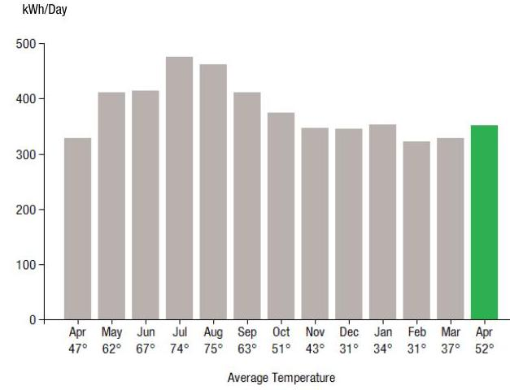
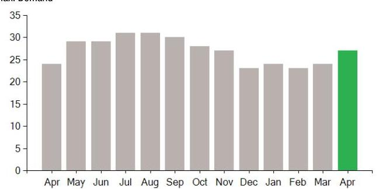

## EVERSEURCE

Account Number: 54513008078
Statement Date: 04/26/23
Service Provided To:
SALMAR REALTY, LLC

## Electric Usage History - Kilowash Hours (kWh)

The image is a bar chart showing the **yearly usage breakdown (monthly-based)** of electric usage in kWh per day. 

- **Y-axis**: kWh/Day
- **X-axis**: Average Temperature
- **Data Points**:
  - Apr: 47°, ~320 kWh
  - May: 62°, ~370 kWh
  - Jun: 67°, ~400 kWh
  - Jul: 74°, ~450 kWh
  - Aug: 75°, ~440 kWh
  - Sep: 63°, ~400 kWh
  - Oct: 51°, ~350 kWh
  - Nov: 43°, ~320 kWh
  - Dec: 31°, ~320 kWh
  - Jan: 34°, ~320 kWh
  - Feb: 31°, ~310 kWh
  - Mar: 37°, ~310 kWh
  - Apr: 52°, ~350 kWh (highlighted in green)

The bar for April is highlighted in green, indicating the current month.

## Electric Usage Summary

| This month your   average daily   electric use was   352.0 kWh | This month you used   $7.3 \%$ more   than at the   same time last year | 7.3   USAGE |
| :-- | :-- | :-- |

## News For You

If you're having trouble paying your energy bill, we have programs to help - even if you've never needed them before. Visit Eversource.com/billhelp for info on payment plans and other assistance programs available to you.

Remit Payment To: Eversource, PO Box 56005, Boston, MA 02205-6005

## EVERSEURCE

Account Number: 54513008078
You may be subject to a $1.02 \%$ late payment charge if the "Total Amount Due" is not received by 05/21/23

## $1,076.89

Amount Due On 04/18/23
$2,273.99
Last Payment Received On 04/19/23
$2,273.99
Balance Forward
Total Current Charges
$0.00
$1,076.99

Current Charges for Electricity

| Supply | Delivery |
| :--: | :--: |
| \$2,613.99 | \$958.37 |
| Cost of electricity from   Eversource | Cost to deliver electricity   from Eversource |

|  |  |  |  |
| :-- | :-- | :-- | :-- |
|  |  |  |  |
|  |  |  |  |
|  |  |  |  |
|  |  |  |  |
|  |  |  |  |
|  |  |  |  |
|  |  |  |  |
|  |  |  |  |
|  |  |  |  |
|  |  |  |  |
|  |  |  |  |
|  |  |  |  |
|  |  |  |  |
|  |  |  |  |
|  |  |  |  |
|  |  |  |  |
|  |  |  |  |
|  |  |  |  |
|  |  |  |  |
|  |  |  |  |
|  |  |  |  |
|  |  |  |  |
|  |  |  |  |

|  |  |  |
| :-- | :-- | :-- |
|  |  |  |
|  |  |  |
|  |  |  |
|  |  |  |
|  |  |  |
|  |  |  |
|  |  |  |
|  |  |  |
|  |  |  |
|  |  |  |
|  |  |  |
|  |  |  |
|  |  |  |
|  |  |  |
|  |  |  |
|  |  |  |
|  |  |  |
|  |  |  |
|  |  |  |
|  |  |  |
|  |  |  |
|  |  |  |
|  |  |  |
|  |  |  |
|  |  |  |
|  |  |  |
|  |  |  |
|  |  |  |
|  |  |  |
|  |  |  |
|  |  |  |

# EVERSEURCE 

Account Number: 54513008078
Customer name key: SALM
Statement Date: 04/26/23
Service Provided To:
SALMAR REALTY, LLC

| Svc Addr: 3065 MAIN ST |  |  |  |  |  |
| :--: | :--: | :--: | :--: | :--: | :--: |
|  |  |  |  |  |  |
| SPRINGFIELD MA 01107 |  |  |  |  |  |
| Serv Ref: 223341003 |  |  | Bill Cycle: 18 |  |  |
| Service from 03/24/23 - 04/26/23 |  |  | 33 Days |  |  |
| Next read date on or about: May 24, 2023 |  |  |  |  |  |
| Meter | Current | Previous | Current | Reading |  |
| Number | Read | Read | Usage | Type |  |
| 033319292 | 73270 | 61660 | 11610 | Actual |  |
| Total Demand Use $=26.90 \mathrm{~kW}$ |  |  |  |  |  |
| Monthly kWh Use |  |  |  |  |  |
| Apr | May | Jun | Jul | Aug | Sep | Oct |
| 10832 | 11925 | 13243 | 14259 | 13839 | 13170 | 10865 |
| Nov | Dec | Jan | Feb | Mar | Apr |  |
| 11459 | 10355 | 10244 | 9354 | 9185 | 11610 |  |

## Contact Information

Emergency: 877-659-6326
www.eversource.com
Pay by Phone: 888-783-6618
Customer Service: 888-783-6610

## Total Amount Due

by $05 / 21 / 23$

## $1,076.99

## Electric Account Summary

Amount Due On 04/18/23
Last Payment Received On 04/19/23
Balance Forward
Current Charges/Credits
Electric Supply Services
Delivery Services
Other Charges or Credits
Total Current Charges
Total Amount Due

## Total Charges for Electricity

Supplier (RATE G1 - BASIC FIXED)
Eversource
Service Reference: 223341003
Generation Srvc Chrg
Subtotal Supplier Services

## Delivery

(RATE G1)
Service Reference: 223341003
Customer Chrg
Distribution Dmd Chrg
Distribution Enrgy Chrg
Transition Enrgy Chrg
Transmission Dmd Chrg
Res Assist Adj Clause
Pension/PBOP Adj Mechn PPAM
Basic Srv Cost Adj
Net metering recovery surchrge
Solar Program Cost Adjustment
Renewable Enrgy Chrg
Energy Efficiency

## $2,273.99

- $\$ 2,273.99$
\$0.00
\$2,613.99
\$958.37
\$1,076.99
\$1,076.99

## Total Amount Due

## $1,076.99$

## $11610.00 \mathrm{kWh} \times \$ 0.22515$

## $2,613.99$

## Delivery

(RATE G1)
$\begin{array}{ll}\text { Service Reference: } 223341003 & \\ \text { Customer Chrg } & \$ 30.00\end{array}$
Distribution Dmd Chrg
Distribution Enrgy Chrg
Transition Enrgy Chrg
Transmission Dmd Chrg
Res Assist Adj Clause
Pension/PBOP Adj Mechn PPAM
Basic Srv Cost Adj
Net metering recovery surchrge
Solar Program Cost Adjustment
Renewable Enrgy Chrg
Energy Efficiency
25.00 KW X $\$ 10.83000$
11610.00 kWh X $\$ 0.00320$
11610.00 kWh X $\$-0.00411$
25.00 KW X $\$ 9.94000$
11610.00 kWh X $\$ 0.00962$
11610.00 kWh X $\$-0.00058$
11610.00 kWh X $\$ 0.00222$
11610.00 kWh X $\$ 0.00524$
11610.00 kWh X $\$-0.00003$
11610.00 kWh X $\$ 0.00050$
11610.00 kWh X $\$ 0.01094$

## \$270.75

\$37.15
\$47.72
\$248.50
\$111.69
\$6.73
\$25.77
\$60.84
\$0.35
\$5.81
\$127.01

VIM_230426PROD.TXT

Eversource is required to comply with Department of Public Utilities' billing and termination regulations. If you have a dispute please see the bill insert for more information.
For an electronic version of this insert, residential customers go to Eversource.com/about-residential-bill and business customers go to Eversource.com/about-business-bill. Then select "Monthly Bill Inserts" from the page. Budget Billing is also available to pay a more consistent bill each month. Please see the Customer Rights Supplement for more information.

# EVERSEURCE 

## Account Number: 54513008078

Customer name key: SALM
Statement Date: 04/26/23
Service Provided To:
SALMAR REALTY, LLC

Continued from previous page...

## Supply Rate

Dollars / kWh

The image is a bar chart.

- **Chart Type**: Bar chart
- **X-Axis**: Months (Apr, May, Jun, Jul, Aug, Sep, Oct, Nov, Dec, Jan, Feb, Mar, Apr)
- **Y-Axis**: Max Demand
- **Data Points**:
  - Apr: ~25
  - May: ~28
  - Jun: ~30
  - Jul: ~31
  - Aug: ~31
  - Sep: ~30
  - Oct: ~28
  - Nov: ~26
  - Dec: ~25
  - Jan: ~24
  - Feb: ~23
  - Mar: ~25
  - Apr: ~27 (highlighted in green)
- **Styling**: The bar for April is highlighted in green, while the other bars are in gray.
- **Yearly Usage Breakdown (Monthly-Based)**: The chart shows the monthly max demand over a year, with a notable increase in April highlighted in green.

## Demand Profile

Max. Demand

The image is a bar chart.

- **Chart Type**: Bar chart
- **X-Axis**: Months (Apr, May, Jun, Jul, Aug, Sep, Oct, Nov, Dec, Jan, Feb, Mar, Apr)
- **Y-Axis**: Max Demand
- **Data Points**:
  - Apr: ~25
  - May: ~28
  - Jun: ~30
  - Jul: ~31
  - Aug: ~31
  - Sep: ~30
  - Oct: ~28
  - Nov: ~26
  - Dec: ~25
  - Jan: ~24
  - Feb: ~23
  - Mar: ~25
  - Apr: ~27 (highlighted in green)
- **Styling**: The bar for April is highlighted in green, while the other bars are in gray.
- **Yearly Usage Breakdown (Monthly-Based)**: The chart shows the monthly max demand over a year, with a notable increase in April highlighted in green.

| 35.7 |  |
| :-- | :-- |
| 30.0 | $\$ 1,076.99$ |
| 25.0 |  |
| 20.0 |  |
| 15.0 |  |
| 10.0 |  |
| 5.0 |  |
| 35.0 |  |
| 30.0 |  |
| 25.0 |  |
| 15.0 |  |
| 10.0 |  |
| 5.0 |  |

Continued from previous page...

| Atty Geni consultant exp adj | $11610.00 \mathrm{kWh} \times \$ 0.00002$ | $\$ 0.23$ |
| :-- | --: | --: |
| Storm recovery adjustment | $11610.00 \mathrm{kWh} \times \$ 0.00218$ | $\$ 25.31$ |
| Exogenous Cost Adjustment | $11610.00 \mathrm{kWh} \times \$ 0.00070$ | $\$ 8.13$ |
| Revenue Decoupling Adj | $11610.00 \mathrm{kWh} \times \$ 0.00212$ | $\$ 24.61$ |
| Lng-Trm Rnwbl Contr Adj | $11610.00 \mathrm{kWh} \times \$ 0.00306$ | $-\$ 35.53$ |
| Vegetation Management | $11610.00 \mathrm{kWh} \times \$ 0.00089$ | $\$ 10.33$ |
| Solar Expansion Charge | $11610.00 \mathrm{kWh} \times \$ 0.00027$ | $-\$ 3.13$ |
| Grid Modernization Charge | $11610.00 \mathrm{kWh} \times \$ 0.00130$ | $\$ 15.09$ |
| Tax Act Credit | $11610.00 \mathrm{kWh} \times \$ 0.00113$ | $-\$ 13.12$ |
| Distributed Solar Charge | $11610.00 \mathrm{kWh} \times \$ 0.00327$ | $\$ 37.96$ |
| Advanced Meter Infrastructure | $11610.00 \mathrm{kWh} \times \$ 0.00222$ | $\$ 25.77$ |
| Subtotal Delivery Services |  | $\$ 958.37$ |
| Total Cost of Electricity |  | $\$ 3,572.36$ |

Other Charges or Credits
AOBC Transfer Mar 29
-$\$ 158.55$
AOBC Transfer Apr 03
-$\$ 208.77$
AOBC Transfer Apr 04
-$\$ 747.23$
AOBC Transfer Apr 11
-$\$ 652.84$
AOBC Transfer Apr 18
-$\$ 941.07$
6.25\% MA Sales Tax Supplier
$\$ 163.37$
6.25\% MA Sales Tax
$\$ 49.72$
Subtotal Other Charges or Credits
$-$ \$2,495.37
Total Current Charges
$\$ 1,076.99$

