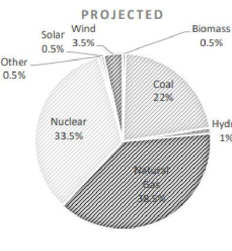
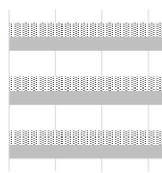
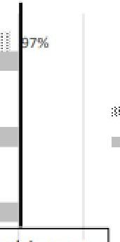
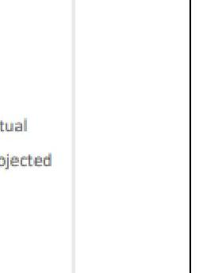

# Constellation NewEnergy, Inc.   Ohio Electricity Supply Agreement 

TOLEDO MUSEUM OF ART ("Customer") AND Constellation NewEnergy, Inc. ("Seller") AGREE AS FOLLOWS:
Defined Terms. Capitalized terms have the meanings set out in this Electricity Supply Agreement, including the attached General Terms and Conditions ("Agreement"); generally the words "you" and "your" refer to the Customer listed above and the words "we" and "us" refer to Seller, unless the context clearly requires otherwise.

Purchase and Sale of Electricity. You will purchase and receive, and we will sell and supply all of your electricity requirements at the prices set forth below for each account identified in the Account Schedule below ("Account"). By signing this Agreement, you authorize us to enroll each Account with your UDC so that we can supply those Account(s). You will take such actions as we request to allow us to enroll each Account in a timely manner. You agree that we may select such sources of energy as we deem appropriate to meet our obligations under this Agreement. We will enroll each Account with the applicable UDC as being supplied by us and will take such other actions with the applicable UDC and ISO necessary for us to meet our obligations under this Agreement.

The specific prices for each Account are set forth in the Account Schedule, below. You are also responsible to pay (1) Taxes - which we will pass through to you on your bill or as part of the price of electricity, as may be required by law, rule or regulation and (2) UDC charges for delivery/distribution services if we provide you a single bill that includes UDC charges. We will apply all appropriate Taxes unless and until you provide a valid certification of tax exempt status. The UDC charges (if any) and Taxes are charged to you as a "pass-through," which means they will change during the existing term of this Agreement if and as the related charges assessed or charged vary for any reason, including but not limited to the types of changes described above.

Affirmative Consent. You expressly provide your affirmative consent to modify the Price as described in the Change in Law provision in Section 5 of the General Terms and Conditions below.

Cost Components. For each of the items listed as "Passed Through" below, this means that you will be charged the costs associated with the line item in accordance with the definitions of each item in Section 1 Definitions of the General Terms and Conditions. If a cost component below is listed as "Included in Price subject to Change in Law" then such cost(s) are included in the contract price(s) in the Account Schedule below and are only subject to change if there is a change in law as described in Section 5 of the General Terms and Conditions below.

| Energy Costs | Included in Price subject to Change in Law |
| :-- | :-- |
| Ancillary Services And Other ISO Costs | Included in Price subject to Change in Law |
| Auction Revenue Rights Credits | Included in Price subject to Change in Law |
| Capacity Costs | Included in Price subject to Change in Law |
| Transmission Costs | Not Applicable |
| Transmission Loss Credits | Included in Price subject to Change in Law |
| Line Loss Costs | Included in Price (Charged Separately) subject   to Change in Law |
| FERC Order 745 Costs | Included in Price subject to Change in Law |
| Balancing Congestion Costs | Included in Price subject to Change in Law |
| Transmission Reallocation Costs | Not Applicable |

The contract prices contained in the Account Schedule include credit costs and margin as well as Renewable Portfolio Standards Costs. Any applicable RMR Costs are Not Applicable to this Agreement. All other costs listed above as "Included in Price subject to Change in Law" may be subject to change if there is a change in law, as described in Section 5 of the General Terms and Conditions below.
You have elected the "Included in Price subject to Change in Law" option for your "Capacity Costs" as noted in the table above. "Included in Price subject to Change in Law" means we have included Capacity Costs in your contract price (set forth in the Account Schedule) based on the current Capacity Costs associated with your Accounts as of the effective date of this Agreement. Your Capacity Costs will not be subject to change unless there has been a Change in Law pursuant to Section 5 of the General Terms and Conditions below. For avoidance of doubt, except as otherwise agreed to herein, your contract price will

not be adjusted (either upward or downward) to pass through any changes in your Capacity Costs based on changes to the Capacity Obligation for the Account(s). "Capacity Obligation" means the Accounts' Peak Load Contribution provided by the UDC and adjusted to apply any applicable ISO adjustment factors.

Cost Components invoiced directly by the UDC. The extent any of the Cost Components above are "Not Applicable", it means that charges for those Cost Components will be invoiced directly by the UDC ("UDC Charges"). If during the term of this Agreement, some or all of the UDC Charges are no longer invoiced by the UDC, we will pass those charges through to you.

Retail Trade Transactions. At any time during the term of this Agreement, you may request the purchase of renewable energy certificates in an amount equal to a prescribed percentage of your load volume by entering into one or more Retail Trade Transactions ("RTTs") between us. If we both agree to the pricing and terms of the renewable energy certificates purchase, a separate RTT Confirmation signed by both of us will document each such purchase and be incorporated herein.

Term. This Agreement will become effective and binding after you have signed this Agreement and we have counter-signed. Subject to successful enrollment of your Account(s), this Agreement shall commence on or about the date set forth under "Start Date", and end on or about the date set forth under "End Date", unless extended on a holdover basis as described in this Agreement. The actual Start Date is dependent on the UDC successfully enrolling the Account(s) and furnishing us with all necessary information regarding the Account(s) meter read cycle and meter read date(s). The dates set forth in the Account Schedule below reflect UDC information available at that time or as otherwise estimated by us. The actual meter read dates may occur on or about the dates set forth herein. We will use commercially reasonable efforts to begin service to each Account(s) on the actual meter read date on or about the Start Date set forth herein. If we are unable to timely enroll an Account, the Start Date will commence on the next regularly scheduled UDC meter read cycle date following successful enrollment. The End Date will remain the same unless extended for a holdover term. We shall not be liable for any failure to enroll or drop an Account by the Start and End Date due to circumstances beyond our control. We will not be responsible for any gaps in service that may occur between the termination of your service from a prior supplier and the commencement of supply from us.

Nothing in this Agreement shall be deemed to require or otherwise obligate us to offer to extend the term of this Agreement. If following termination or expiration of this Agreement (whether in whole or in part), for any reason, some or all of the Accounts remain designated by the UDC as being supplied by us, we may continue to serve such Account(s) on a month-to-month holdover basis. During such holdover term, we will calculate your invoice as follows: (Each Account's metered usage, as adjusted by the applicable line loss factor) times (the ISO-published Day Ahead Locational Based Marginal Price for the residual zone ("LMP") $+\$ .015000 / \mathrm{kWh})+$ (a pass through of all costs and charges incurred by us for the retail delivery of energy to you) + Taxes. This Agreement will continue to govern the service of such Accounts during such holdover term. Either party may terminate the holdover term at any time within its discretion at which time we will drop each Account as of the next possible meter read date to the then applicable tariff service, whether default service or otherwise.

Your Invoice. Your invoice will contain all charges applicable to your electricity usage, including Taxes (which are passed through to you). You will receive one invoice from the UDC for UDC charges and one invoice from us for all other charges ("Dual Billing") unless we agree otherwise, or your Account(s) eligibility changes. All amounts charged are due in full within twenty-one (21) days of the invoice date, and we reserve the right to adjust amounts previously invoiced based upon supplemental or additional data we may receive from your UDC. Your invoices will be based on actual data provided by the UDC, provided that if we do not receive actual data in a timely manner, we will make a good faith estimate using your historical usage data and other information. Once we receive actual data we will reconcile the estimated charges and adjust them as needed in subsequent invoices. If you fail to make payment by the due date, interest will accrue daily on outstanding amounts from the due date until the bill is paid in full at a rate of $1.50 \%$ per month, or the highest rate permitted by law, whichever is less. All invoices (including adjustments to those invoices) are conclusively presumed final and accurate unless such invoices are objected to by either you or us in writing, including adequate explanation and/or documentation, within 24 months after the date such invoice was rendered, provided however, we may rebill based on post-period audits or adjustments made by the ISO, UDC, or other governmental authority, commission or agency with jurisdiction in the state in which the Accounts are located.

Certain Warranties. You warrant and represent that for Account(s) located in the State of Ohio, the electricity supplied under this Agreement is not for use at a residence.

Notices. All notices will be in writing and delivered by hand, certified mail, return receipt requested, or by first class mail, or by express carrier to our respective business addresses. Our business address is 1001 Louisiana St. Constellation Suite 2300, Houston, TX 77002, Attn: Contracts Administration. Either of us can change our address by notice to the other pursuant to this paragraph.

Customer Service. For questions about your invoice or our services, contact us at our Customer Service Department by calling toll-free 844-636-3749, or by e-mail at CustomerCare@Constellation.com. Your prior authorization of us to your UDC as recipient of your current and historical energy billing and usage data will remain in effect during the entire term of this Agreement, including any renewal, unless you rescind the authorization upon written notice to us or by calling us at 844-636-3749. We reserve the right to cancel this Agreement in the event you rescind the authorization.

Conditions of Service. For Account(s) located in the State of Ohio, in order for us to perform under this Agreement, you must comply with the terms of the UDC's tariffs and the Account(s) must be successfully enrolled in our name with a switch date assigned by the UDC (the "Conditions of Service"). Those terms, in part, require you to: (a) if applicable, enter into agreements with UDC for distribution service and (b) provide communication link(s) for any interval meter installed or to be installed by the UDC. For accounts located in Dayton Power \& Light service territory, interval meters are required if the most recent 12month period peak demand is equal or greater than 100 kW . For Accounts located in the AEP Ohio or Duke Energy Ohio service territory, interval meters meeting the UDC's requirements and a dedicated analog phone line are required if the most recent 12-month period peak demand is greater than 200kW. You are responsible for the incremental costs of the interval meters and dedicated phone line (as applicable) and the incremental costs associated with the installation of the required interval metering and dedicated phone line (as applicable). You must sign and submit to the UDC, with a copy to us, a work order request before we can enroll the Account. Should you fail to install the required equipment, you acknowledge that the UDC may choose to switch your Account(s) back to UDC service.
Environmental Disclosure Information. For Account(s) located in the State of Ohio, our electricity supply may be purchased from any number of sources. We are not purporting to sell power from a specific source-e.g. renewable fuels. Data concerning the generation resource mix and environmental characteristics of our electricity products is included as Exhibit A hereto and incorporated herein by reference and will be made available periodically with our invoices and is available upon request.
Right to Rescission. For Account(s) located in the State of Ohio, if your Account(s) is classified by the UDC as a "Small Commercial Customer" (defined as a commercial or industrial customer using less than 700,000 kWh annually and not part of a national account with multiple facilities in one or more states), you will receive a confirmation notice from your UDC indicating your selection of Seller as your Competitive Retail Electric Service Supplier ("CRES Supplier"). Upon receipt of the notice, you may rescind this Agreement without penalty at any time within the 7 -day rescission period by following the instructions provided by the UDC. You must write or call the UDC to submit your rescission request by following the instructions on the UDC notice.
Right to Cancel. For Account(s) located in the State of Ohio, if you are a Small Commercial Customer and you move outside of where we provide service or into an area where we charge a different price, either of us may terminate the Agreement without penalty. We have the right to terminate this Agreement for any failure by you to comply with any material obligations as more specifically set forth in Sections 3 and 4 of our General Terms and Conditions attached hereto. If you are a Small Commercial Customer, we have to provide you 14 days prior written notice if we exercise our rights to terminate this Agreement pursuant to our rights set forth in Section 4 of our General Terms and Conditions attached hereto. Also, as a Small Commercial Customer, if we fail to comply with any material obligations, you may also terminate the Agreement and are entitled to the same remedies available to us, including those set forth in Section 4 of the General Terms and Conditions. Should the Agreement be canceled, terminated or expired, you agree to remit full payment, without offset or reduction of any kind, within 21 days of a final invoice date, of all outstanding charges, inclusive of all applicable fees and collection costs. Upon cancellation of this Agreement, your electric service will automatically default to the UDC's Standard Service Offer supply unless you select another CRES Supplier. You acknowledge that taking service under the UDC's Standard Service Offer supply will mean a return to regulated electric service, including energy, transmission and distribution services provided by the UDC under its applicable tariffs. Such UDC service does not necessarily entitle you to the same rates, terms and conditions that apply to other customers served by the UDC.
Right to Request/Release Information. For Account(s) located in the State of Ohio, you may request, twice within a 12-month period, up to 24 months of your payment history information with Seller without charge from Seller. Seller is prohibited from disclosing Small Commercial Customer's social security number or UDC account number without the Customer's affirmative written consent, except for Seller's collections and credit reporting, any participation in programs subject to the universal service fund pursuant to Section 4928.54 of the Ohio Revised Code, or assigning this Agreement to another CRES Supplier pursuant to the assignment provisions of this Agreement.
Right to Renew. For Account(s) located in the State of Ohio, if you are a Small Commercial Customer, you also acknowledge and agree that if for any reason you fail to renew this Agreement and/or if any Account(s) remain designated at the UDC as being served by us, we may continue to serve your Account(s) on a month-to-month basis at the Holdover Rate described in the Term Section above, even though such Holdover Rate is a change in your price under this Agreement.
Budget Billing/UDC Billing. For Account(s) located in the State of Ohio, Seller does not offer budget billing. Your failure to timely pay all applicable UDC charges to the UDC may result in your Account(s) being disconnected. You acknowledge that your price is in addition to any amount that may be charged to you by your UDC as a switching fee pursuant to us enrolling your Account(s) with such UDC.

Customer Complaints. For Account(s) located in the State of Ohio, any complaints or disputes regarding your service may be directed to our Customer Service at the contact information listed below. If your complaints are not resolved after you have called us and/or your UDC (at the contact information provided below), or for general UDC information, you may call the Public Utilities Commission of Ohio (PUCO) for assistance toll free at 800-686-7826 or 614466-3292, or for TTY toll free at 800-686-1570 from 8:00 am to 5:00 pm EPT week days, or visit the PUCO website at www.PUCO.ohio.gov.

IN THE EVENT OF AN EMERGENCY, POWER OUTAGE OR WIRES AND EQUIPMENT SERVICE NEEDS, CONTACT YOUR APPLICABLE UDC AT:

| UDC Name | UDC Abbreviation | Contact Numbers |
| :-- | :-- | :-- |
| Toledo Edison Company | TE | $1-888-544-4877$ |

[REMAINDER OF PAGE LEFT INTENTIONALLY BLANK.]
FOR INTERNAL USE ONLY

Each party has caused this Agreement to be executed by its authorized representative on the respective dates written below.

# Constellation NewEnergy, Inc. 

Signature: $\qquad$

Printed Name:
Title:

Address: 1001 Louisiana St. Constellation Suite 2300
Houston, TX 77002
Attn: Contracts Administration
Fax: $\quad 888-829-8738$
Phone: 844-636-3749

Customer: Toledo Museum of Art

## Thomas Huth

Signature: $\qquad$

## Tom Huth

Printed Name: $\qquad$ Facilities Manager Title: $\quad 05 / 17 / 2023$

Address: 2445 Monroe St
Toledo, OH 43620-1500
Fax:
Phone: (419) 255-8000
Email: thuth@toledomuseum.org

## General Terms and Conditions

## 1. Definitions.

"Ancillary Services And Other ISO Costs" means for any billing period the applicable charges regarding ancillary services as set forth in the applicable ISO Open Access Transmission Tariff ("OATT") and for other ISO costs not otherwise included in any of the defined cost components in this Agreement. We will reasonably determine your Account's monthly Ancillary Services And Other ISO Costs based on the Account's $\$ / \mathrm{kWh}$ share of costs for Ancillary Services And Other ISO Costs or otherwise reasonable allocation method as we may determine from time to time based on how Ancillary Services And Other ISO Costs are assessed by the ISO.
"Auction Revenue Rights Credits" means revenue credits resulting from the annual financial transmission rights auction conducted by the ISO that are applicable with respect to transmission peak load contribution. If Auction Revenue Rights Credits are "Passed Through", such credits shall be reasonably calculated by us as the monthly product of the (i) total Auction Revenue Rights Credits expressed in dollars per planning year for the applicable zone, as published by the ISO; divided by (ii) the total Network Service Peak Load for such zone, as published by the ISO; divided by (iii) the number of days in the applicable planning year; multiplied by (iv) by an Account's applicable Network Service Peak Load; multiplied by (v) the number of days in the billing period or such other reasonable calculation method applied by us.
"Balancing Congestion Costs" means any costs or charges imposed by the ISO in complying with the Federal Energy Regulatory Commission's Order on Rehearing and Compliance regarding Docket Nos. EL16-6-002, EL16-6-003 and ER16-121-001 (January 31, 2017).
"Capacity Costs" means a charge for fulfilling the capacity requirements for the Account(s) imposed by the ISO or otherwise. Capacity Costs includes, but is not limited to, the cost for procuring Capacity Performance resources (as currently required and defined by the ISO) in accordance with the provisions of Federal Energy Regulatory Commission Order on Proposed Tariff Revisions (Docket No. ER15-623-000, et al, issued June 9, 2015).
"Energy Costs" means a charge for the cost items included in the Locational Marginal Price for the ISO residual zone identified in the Account Schedule "FERC Order 745 Costs" means any costs or charges imposed by the ISO in accordance with complying with the provisions of Federal Energy Regulatory Commission ("FERC") in Order No. 74518 CFR Part 35 (March 15, 2011). Any modifications or conditions to the treatment of FERC Order 745 Costs under the ISO tariff or otherwise shall be deemed a change in law pursuant to Section 5 of the General Terms and Conditions of this Agreement.
"ISO" means the independent system operator or regional transmission organization responsible for the service territory governing an Account, or any successor or replacement entity.
"Line Loss Costs" means the costs (to the extent not already captured in the applicable Energy Costs) applicable to each Account based on the kWh difference between the UDC metered usage and the ISO settlement volumes (the "Line Loss Usage"). If Line Loss Costs are "Included in Price," then the Line Loss Costs are included in the contract price and will not be invoiced as a separate line item. If Line Loss Costs are "Included in Price (Charged Separately)", the contract price shall be applied to the Line Loss Usage and appear as a separate line item on the invoice. If Line Loss Costs are "Passed Through," the Line Loss Costs will be invoiced as a separate line item and calculated based on the applicable locational marginal price for the Line Loss Usage.
"Non Time Of Use" or "NTOU" means all hours of each day.
"Off Peak" means all hours other than Peak hours.
"Peak" means the hours designated as peak from time to time by the UDC.
"Renewable Portfolio Standards Costs" means the costs associated with meeting renewable portfolio standards costs at the levels required by currently applicable Law. If Renewable Portfolio Standards Costs are not included in the contract price, such costs for a particular month will be the product of (i) the Monthly RPS Price; and (ii) an Account's monthly kWh usage. The Monthly RPS Price is the price of renewable portfolio standards compliance for the Account, for a particular month, as determined by reference to the renewable portfolio standards forward price curve for the state where the Account is located.
"RMR Costs" or "Reliability-Must-Run Costs" means the generation deactivation charges and other such charges, if any, imposed by the ISO on load served in a particular load zone to recover the cost for any generation units that plan to retire but are required by the ISO to run for reliability purposes beyond their intended retirement date, in accordance with the applicable ISO rules and OATT provisions.
"Taxes" means all federal, state, municipal and local taxes, duties, fees, levies, premiums or other charges imposed by any governmental authority, directly or indirectly, on or with respect to the electricity and related products and services provided under this Agreement, including any taxes enacted after the date we entered into this Agreement.
"Transmission Costs" means the charge for Network Transmission Service and Transmission Enhancement Charges, each as identified in the applicable OATT Tariff for the provision of transmission service by the ISO within the UDC's service territory, and expressly excluding costs separately detailed as Transmission Reallocation Costs as defined below.
"Transmission Loss Credits" means the credit amounts applicable to the Accounts under the ISO's marginal loss construct.
"Transmission Reallocation Costs" means a charge or credit, as applicable, imposed by the ISO specifically for: (i) the Current Recovery Charges; and (ii) the Transmission Enhancement Charge Adjustments (each of (i) and (ii) as defined in the settlement agreement approved by FERC as of May 31, 2018 in Docket Number EL05-121-009 for the time periods identified therein and implemented in the OATT Schedule 12-C Appendices A and C, respectively, and as may subsequently be amended). Any modifications or conditions to the treatment of the Transmission Reallocation Costs under the ISO tariff or otherwise shall be deemed a change in law pursuant to Section 5 below.
"UDC" means your local electric distribution utility owning and/or controlling and maintaining the distribution system required for delivery of electricity to the Accounts.
"UDC Charges" means all UDC costs, charges, and fees, due under UDC's delivery services rates associated with your use of UDC's distribution network, all as defined by the UDC tariffs, and any similar or related charges the UDC may impose from time to time.
2. Cash deposit and other security. At any time, we may require that you provide information to us so that we may evaluate your creditworthiness. We reserve the right to require that you make a cash deposit or provide other security acceptable to us if your financial obligations to us increase under this Agreement, or if, in our opinion, your credit, payment history, or ability to pay your bills as they come due becomes a concern. You will deliver any required cash deposit or other required security (or any increase therein) within three (3) business days of our request.

3. Default under this Agreement. You will be in default under this Agreement if you fail to: pay your bills on time and in full; provide cash deposits or other security as required by Section 2 above; or perform all material obligations under this Agreement and you do not cure such default within 5 days of written notice from us; or if you declare or file for bankruptcy or otherwise become insolvent or unable to pay your debts as they come due. We will be in default under this Agreement if we fail to perform all material obligations under this Agreement and do not cure such default within 5 days written notice from you, or if we declare or file for bankruptcy or otherwise become insolvent or unable to pay our debts as they come due.
4. Remedies upon default; Early Termination Payment. If you are in default under this Agreement, in addition to any other remedies available to us, we may terminate this Agreement entirely, or solely with respect to those Accounts adversely affected by such default, and switch your Account(s) back to UDC service (consistent with applicable regulations and UDC practices); and/or you will be required to pay us an early termination payment to compensate us for all losses we sustain due to your default, including:

- all amounts you owe us for electricity provided to you;
- the positive difference, if any, between (A) the price you would have paid us under this Agreement had it not been terminated early (including our margin), less the then-current market price of electricity and services under terms substantially similar to the terms of this Agreement, as reasonably calculated by us based on information available to us internally or supplied by one or more third parties; multiplied by (B) the estimated undelivered volume of electricity you would consume through the end of the term, as reasonably calculated by us; and
- all costs (including attorneys' fees, expenses and court costs) we incur in collecting amounts you owe us under this Agreement.

The parties agree that any early termination payment determined in accordance with this Section is a reasonable approximation of harm or loss and is not a penalty or punitive in any respect, and that neither party will be required to enter into a replacement transaction in order to determine or be entitled to a termination payment.
5. Changes in tariff or law. We may pass through or allocate, as the case may be, to you any increase or decrease in our costs related to the electricity and related products and services sold to you that results from the implementation of new, or changes (including changes to formula rate calculations) to existing, Laws, or other requirements or changes in administration or interpretation of Laws or other requirements. "Law" means any law, rule, regulation, ordinance, statute, judicial decision, administrative order, ISO business practices or protocol, UDC or ISO tariff, rule of any commission or agency with jurisdiction in the state in which the Accounts are located. Such additional amounts will be included in subsequent invoices to you. The changes described in this Section may change any or all of the charges described in this Agreement. Your first bill reflecting increased costs will include a bill insert describing the increase in costs in reasonable detail.
hurricane, war, terrorism; declaration of emergency by a governmental entity, the ISO or the UDC; curtailment, disruption or interruption of electricity transmission, distribution or supply; regulatory, administrative, or legislative action, or action or restraint by court order or other governmental entity; actions taken by third parties not under your or our control, such as the ISO or a UDC. Such events shall not excuse failure to make payments due in a timely manner for electricity supplied to you prior to such event. Further, if such an event prevents or makes it impossible or impracticable for the claiming party to carry out any obligation under this Agreement due to the events beyond either of our reasonable control for more than 30 days, then whichever one of us whose performance was not prevented by such events shall have the right to terminate this Agreement without penalty upon 30 days' written notice to the other.
7. UDC or ISO obligations. We will have no liability or responsibility for matters within the control of the UDC or the ISO-controlled grid, which include maintenance of electric lines and systems, service interruptions, loss or termination of service, deterioration of electric services, or meter readings.
8. Limitation on Liability. IN NO EVENT WILL EITHER PARTY OR ANY OF ITS RESPECTIVE AFFILIATED COMPANIES BE LIABLE FOR ANY CONSEQUENTIAL, EXEMPLARY, SPECIAL, INCIDENTAL OR PUNITIVE DAMAGES, INCLUDING, WITHOUT LIMITATION, LOST OPPORTUNITIES OR LOST PROFITS NOT CONTEMPLATED BY SECTION 4. Each party's total liability related to this Agreement, whether arising under breach of contract, tort, strict liability or otherwise, will be limited to direct, actual damages. Direct, actual damages payable to us will reflect the early termination payment calculation in Section 4. Each party agrees to use commercially reasonable efforts to mitigate damages it may incur. NO WARRANTY, DUTY, OR REMEDY, WHETHER EXPRESSED, IMPLIED OR STATUTORY, ON OUR PART IS GIVEN OR INTENDED TO ARISE OUT OF THIS AGREEMENT, INCLUDING ANY WARRANTY OF MERCHANTABILITY OR FITNESS FOR A PARTICULAR PURPOSE OR USE.
9. DISPUTE RESOLUTION. THIS AGREEMENT WILL BE GOVERNED BY AND INTERPRETED IN ACCORDANCE WITH THE LAWS OF THE STATE IN WHICH ANY ACCOUNT IS LOCATED, WITHOUT GIVING EFFECT TO ANY CONFLICTS OF LAW PROVISIONS, AND ANY CONTROVERSY OR CLAIM ARISING FROM OR RELATING TO THIS AGREEMENT WILL BE SETTLED IN ACCORDANCE WITH THE EXPRESS TERMS OF THIS AGREEMENT BY A COURT LOCATED IN SUCH STATE. IF THE MATTER AT ISSUE INVOLVES ACCOUNTS OR MATTERS IN MORE THAN ONE STATE, THE GOVERNING JURISDICTION AND VENUE SHALL BE DEEMED TO BE NEW YORK. TO THE EXTENT ALLOWED BY APPLICABLE LAW, WE ALSO BOTH AGREE IRREVOCABLY AND UNCONDITIONALLY TO WAVE ANY RIGHT TO A TRIAL BY JURY OR TO INITIATE OR BECOME A PARTY TO ANY CLASS ACTION CLAIMS WITH RESPECT TO ANY ACTION, SUIT OR PROCEEDING DIRECTLY OR INDIRECTLY ARISING OUT OF OR RELATING TO THIS AGREEMENT OR THE TRANSACTIONS CONTEMPLATED BY THIS AGREEMENT.
6. Events beyond either of our reasonable control. If something happens that is beyond either of our reasonable control that prevents either of us from performing our respective obligations under this Agreement, then whichever one of us cannot perform will be relieved from performance until the situation is resolved. Examples of such events include: acts of God, fire, flood,
10. Relationship of Parties; Representations and Warranties. We are an independent contractor, and nothing in this Agreement establishes a joint venture, fiduciary relationship, partnership or other joint undertaking. We are not acting as your consultant or advisor, and you will not rely on us in evaluating the advantages or disadvantages of any specific product or

service, predictions about future energy prices, or any other matter. Your decision to enter into this Agreement and any other decisions or actions you may take is and will be based solely upon your own analysis (or that of your advisors) and not on information or statements from us. You represent (i) you are duly organized and in good standing under the Laws of the jurisdiction of your formation; (ii) you are authorized and qualified to do business in the jurisdiction necessary to perform under this Agreement; (iii) execution, delivery and performance of this Agreement are duly authorized and do not violate any of your governing documents or contracts or any applicable Law; and (iv) if you are a Governmental Entity, you further warrant (a) you have complied with all applicable bidding and procurement laws in awarding this Agreement, (b) you will not claim immunity on the grounds of sovereignty or similar grounds from enforcement of this Agreement; and (c) you will obtain all necessary budgetary approvals, appropriations and funding for all of your obligations under this Agreement, the failure of which shall not be an excuse for Governmental Entity's performance or failure to perform hereunder and upon request will provide proof of such authority. "Governmental Entity" means a municipality, county, governmental board or department, commission, agency, bureau, administrative body, joint action agency, court or other similar political subdivision (including a public school district or special purpose district or authority), or public entity or instrumentality of the United States or one or more states.
11. Confidentiality. Consistent with applicable regulatory requirements, we will hold in confidence all information obtained by us from you related to the provision of services under this Agreement and which concern your energy characteristics and use patterns, except that we may, consistent with applicable law and regulation, disclose such information to (a) our affiliates and such affiliates' employees, agents, advisors, and independent contractors, (b) third parties representing you in this purchase of electricity, and (c) other third parties, if the information (i) is presented in aggregate and (ii) cannot be reasonably expected to identify you. Except as otherwise required by law, you will agree to keep confidential the terms of our Agreement, including price.
12. Miscellaneous Provisions. If in any circumstance we do not provide notice of, or object to, any default on your part, such situation will not constitute a waiver of any future default of any kind. If any of this Agreement is held legally invalid, the remainder will not be affected and will be valid and enforced to the fullest extent permitted by law and equity, and there will be deemed substituted for the invalid provisions such provisions as will most nearly carry out our mutual intent as expressed in this Agreement. You may not assign or otherwise transfer any of your rights or obligations under this Agreement without our prior written consent. Any such attempted transfer will be void. We may assign our rights and obligations under this Agreement. This Agreement contains the entire agreement between both of us, supersedes any other agreements, discussions or understandings (whether written or oral) regarding the subject matter of this Agreement, and may not be contradicted by any prior or contemporaneous oral or written agreement. A facsimile or e-mailed copy with your signature will be considered an original for all purposes, and you will provide original signed copies upon request. Each party authorizes the other party to affix an ink or digital stamp of its signature to this Agreement, and agrees to be bound by a document executed in such a manner. The parties acknowledge that any document generated by the parties with respect to this Agreement, including this Agreement, may be imaged and stored electronically and such imaged documents may be introduced as evidence in any proceeding as if such were original business
records and neither party shall contest their admissibility as evidence in any proceeding. Except as otherwise explicitly provided in this Agreement, no amendment (including in form of a purchase order you send us) to this Agreement will be valid or given any effect unless signed by both of us. Applicable provisions of this Agreement will continue in effect after termination or expiration of this Agreement to the extent necessary, including those for billing adjustments and payments, indemnification, limitations of liability, and dispute resolution. This Agreement is a "forward contract" and we are a "forward contract merchant" under the U.S. Bankruptcy Code, as amended. Further, we are not providing advice regarding "commodity interests", including futures contracts and commodity options or any other matter, which would cause us to be a commodity trading advisor under the U.S. Commodity Exchange Act, as amended.

| Environmental Disclosure Information - Quarterly Comparisons |  |  |  |  |
| :--: | :--: | :--: | :--: | :--: |
| Constellation NewEnergy, Inc. |  |  |  |  |
| Projected Data for the 2022 Calendar Year |  |  |  |  |
| Actual Data for the Period 01/01/22 to 12/31/22 |  |  |  |  |
| Generation   Resource   Mix -   A comparison between the sources of generation projected to be used to generate this product and the actual resources used during this period. | 

The image is a pie chart titled "PROJECTED." It shows the projected generation resource mix with the following segments and percentages:

- Nuclear: 33.5%
- Natural Gas: 38.5%
- Coal: 22%
- Wind: 3.5%
- Hydro: 1%
- Biomass: 0.5%
- Solar: 0.5%
- Other: 0.5%

Each segment is labeled with its respective resource and percentage. The chart visually represents the proportion of each energy source projected to be used. |  |  |  |
| Environmental CharacteristicsA description of the characteristics associated with each possible generation resource. | Biomass Power |  | Air Emissions and Solid Waste |  |
|  | Coal Power |  | Air Emissions and Solid Waste |  |
|  | Hydro Power |  | Wildlife Impacts |  |
|  | Natural Gas Power |  | Air Emissions and Solid Waste |  |
|  | Nuclear Power |  | Radioactive Waste |  |
|  | Oil Power |  | Air Emissions and Solid Waste |  |
|  | Other Sources |  | Unknown Impacts |  |
|  | Solar Power |  | No Significant Impacts |  |
|  | Unknown Purchased Resources |  | Unknown Impacts |  |
|  | Wind Power |  | Wildlife Impacts |  |
| Air Emissions -   Product-specific projected and actual air emissions for this period compared to the regional average air emissions. | Carbon Dioxide | 

The image is a bar chart. It shows three horizontal bars, each with a pattern of small black dots on a gray background. The bars are separated by white spaces and aligned vertically. There are no visible axis titles, units, or data points. The chart lacks any text or labels that would provide further context or information about the data represented. | 

The image is a partial view of a bar chart. It shows a vertical black line with a percentage label "97%" next to it. The context and other elements of the chart are not visible, making it difficult to determine the full scope or purpose of the chart. There are no axis titles, units, or additional data points visible in this fragment. | 

The image is a partial view of a document or table. It shows a small section of text with the words "actual" and "projected" visible. The context and other elements of the document are not visible, making it difficult to determine the full scope or purpose. There are no additional data points or graphical elements visible in this fragment. |
| Radioactive   Waste -   Radioactive waste associated with the product. | Type: |  | Quantity: |  |
|  | High-Level Radioactive Waste |  | Unknown | Lbs./1,000 kWh |
|  | Low-Level Radioactive Waste |  | Unknown | $\mathrm{Pl}^{4} / 3,000 \mathrm{kWh}$ |

With in-depth analysis, the environmental characteristics of any form of electric generation will reveal benefits as well as costs. For further information, contact Constellation at customercare@constellation.com or 1-844-636-3749.

# ACCOUNT SCHEDULE:   For: Toledo Museum of Art   The Pricing set forth below is only valid until 5:30 PM Central Prevailing Time on May 17, 2023 

We shall have no obligation to enroll or supply electricity to any account(s) that are not identified on the Account Schedule below. Please verify that your specific information is COMPLETE and ACCURATE.
Your review and acceptance of this information will help ensure accurate future invoices
Notes: Accounts or Service Addresses listed in the Account(s) Schedule may be updated or replaced with a new account number issued by the UDC, ISO or other entity.

THIS DOCUMENT MAY BE RETURNED TO SELLER BY FAX TO (888)-829-8738 OR AS OTHERWISE DIRECTED.
No. of Service Accounts: 9

| UDC | UDC Account Number | Service Address | Start Date | End Date | Energy Price Non TOU (\$/kWh) |
| :--: | :--: | :--: | :--: | :--: | :--: |
| TE | 08007426802080093496 | 1805 COLLINGWOOD BLVD, TOLEDO, OH 43604-5009 | 06/26/23 | 06/25/25 | $\$ 0.05675$ |
| TE | 08007426802240024064 | 2445 MONROE ST, TOLEDO, OH 43620-1517 | 07/11/23 | 07/10/25 | $\$ 0.05675$ |
| TE | 08007426802520093855 | 701 W Grove PL, Toledo, OH 43620 | 06/26/23 | 06/25/25 | $\$ 0.05675$ |
| TE | 08007426802530093561 | 1838 PARKWOOD AVE, TOLEDO, OH 43604-6059 | 06/26/23 | 06/25/25 | $\$ 0.05675$ |
| TE | 08007426802790009415 | 801 W Grove PI, Toledo, OH 99999 | 06/26/23 | 06/25/25 | $\$ 0.05675$ |
| TE | 08007426802980093729 | 521 W WOODRUFF AVE, TOLEDO, OH 43604-5028 | 06/26/23 | 06/25/25 | $\$ 0.05675$ |
| TE | 08007426805000143372 | 2444 MONROE ST, TOLEDO, OH 43620-1516 | 06/26/23 | 06/25/25 | $\$ 0.05675$ |
| TE | 08007426805000143378 | 2444 MONROE ST, TOLEDO, OH 43620-1516 | 06/26/23 | 06/25/25 | $\$ 0.05675$ |
| TE | 08007426805001363684 | 2445 Monroe St Garden, Toledo, OH 43620 | 06/26/23 | 06/25/25 | $\$ 0.05675$ |

TO ACCEPT THE PRICING ABOVE, PLEASE FAX A SIGNED COPY OF THIS AGREEMENT TO US AT 888-829-8738.
Payments to Certain Third-Parties: You acknowledge that your price includes a fee that Constellation will remit to NRG Kiosk LLC dba Power Kiosk ("Third Party") in connection with its efforts to facilitate our entering into this Agreement. Third Party is acting on your behalf as your representative and is not a representative or agent of Constellation.

