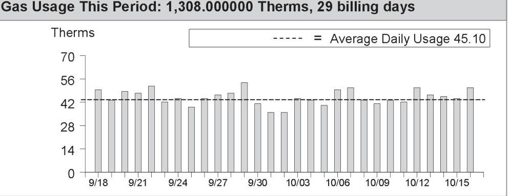
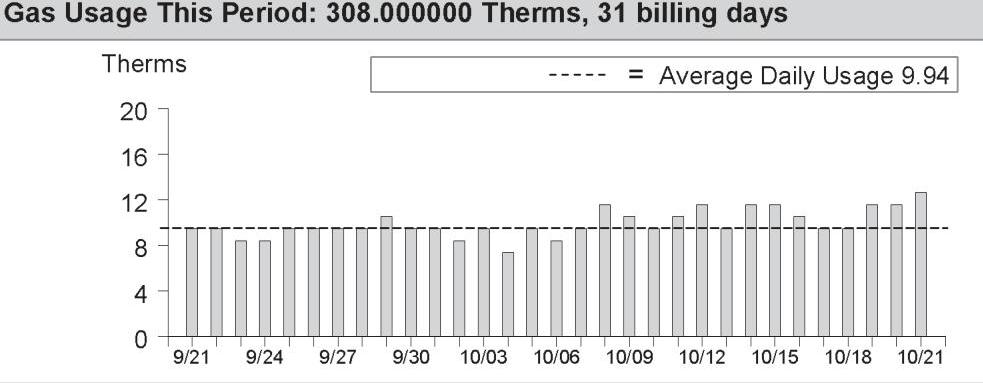
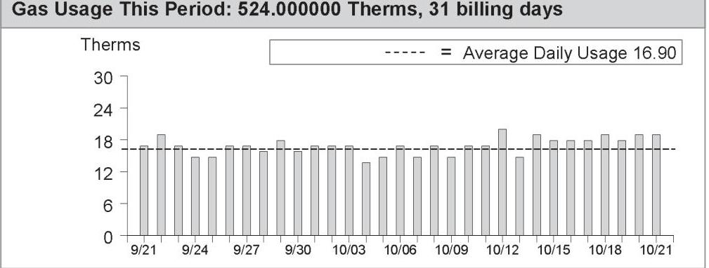
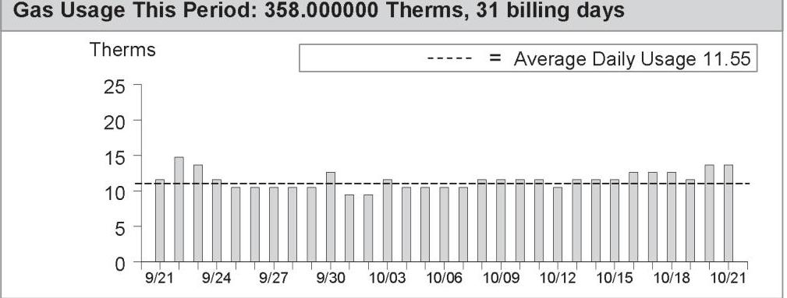
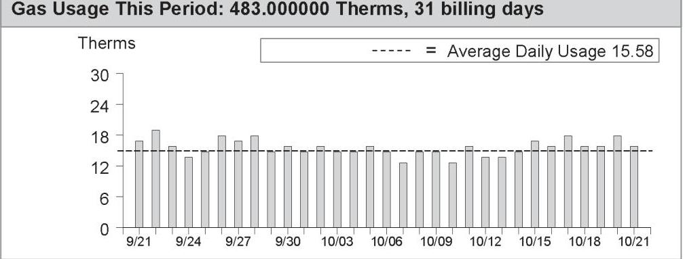
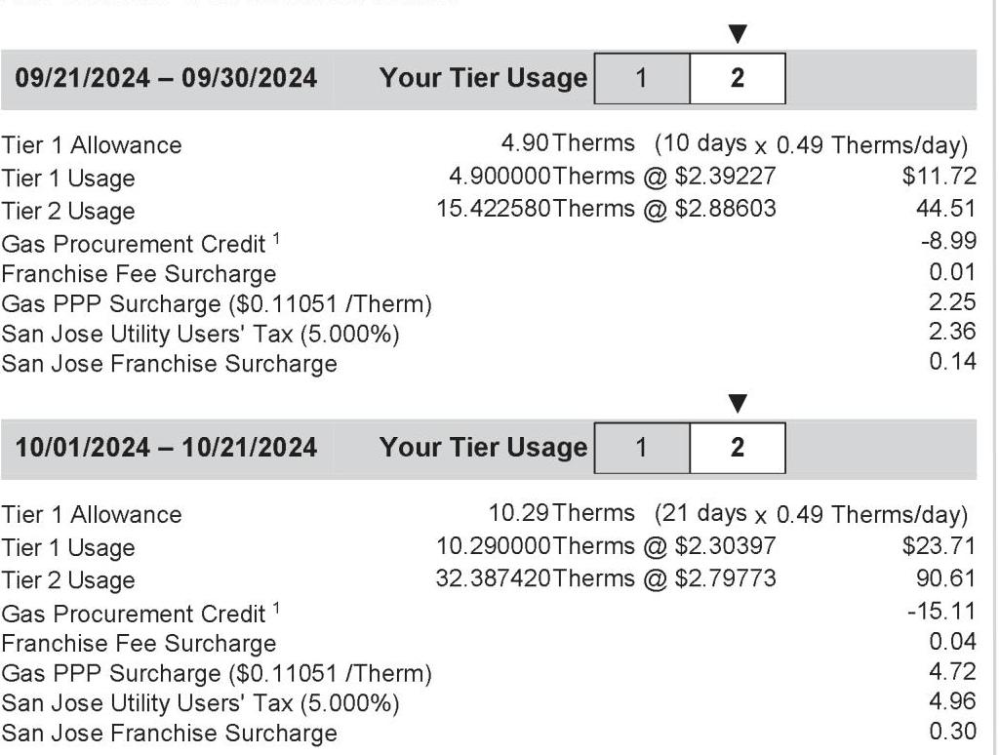
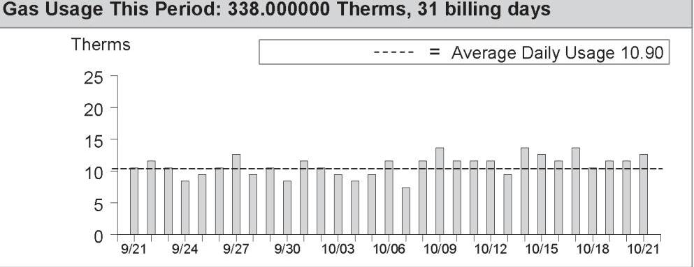

## Service For:

ARCADIA MANAGEMENT SERVICES CO Please see details page.

## Questions about your bill?

Mon-Fri 7 a.m.-7 p.m.
Saturday 8 a.m.-5 p.m.
Phone: 1-800-743-5000
www.pge.com/MyEnergy

## Ways To Pay

www.pge.com/waystopay

| Vendor \# | $\mathbf{3 7 5}$ |  |
| :-- | :-- | :-- |
| Date Paid | $\mathbf{1 1 / 0 8 / 2 4}$ | Est $\mathbf{N M}$ |
| Prop | Amount | Account |
| wdsb | $\$ \quad(241.12)$ | $\$ 7001-002$ |
| wdsb | $\$ \quad 10,426.21$ | $\$ 7003-000$ |

## Your Account Summary

Amount Due on Previous Statement \$10,427.86
Payment(s) Received Since Last Statement -10,427.86
Previous Unpaid Balance $\$ 0.00$
Current PG\&E Electric Delivery Charges \$326.47
Electric Adjustments -774.76
San Jose Clean Energy Electric Generation Charges 207.17
Current PG\&E Gas Delivery Charges 7,649.24
COMMERCIAL ENERGY Gas Procurement Charges 2,776.97

Total Amount Due by 11/19/2024 \$10,185.09
\$ Current charges include a discount of $\$ 772.38$ for CA Climate Credit.

| Monthly Billing History |  |
| :--: | :--: |
| \$20000 |  |
| \$15000 |  |
| \$10000 |  |
| \$5000 |  |
| \$0 |  |
| 2023 | Visit www.pge.com/MyEnergy for a detailed bill comparison |

## Important Messages

California is fighting climate change and so can you! Your bill includes a Climate Credit from a state program to cut carbon pollution while also reducing your energy costs. Find out how at cpuc.ca.gov/climatecredit.

Master meter service obligations As a master meter customer, you have billing and service obligations for your sub-metered tenants. To find out more, visit www.leginfo.ca.gov/calaw.html, check the box next to Public Utilities Code, and type 739.5 in the search field for details on this California Code.

Continued on page 63
Please return this portion with your payment. No staples or paper clips. Do not fold. Thank you.

99900326400545900010959850001018509

The image is a section of a bill or statement from PG&E. It contains the following details:

- **Logo**: PG&E logo on the left.
- **Account Information**:
  - **Account Number**: 0326400545-9
  - **Due Date**: 11/19/2024
  - **Total Amount Due**: $10,185.09
- **Amount Enclosed**: A blank section with boxes for entering the amount enclosed, prefixed by a dollar sign ($).

ARCADIA MANAGEMENT SERVICES CO
PO BOX 5368
SAN JOSE, CA 95150-5368

PG\&E
BOX 997300
SACRAMENTO, CA 95899-7300

# Important Phone Numbers - Monday-Friday 7 a.m.-7 p.m., Saturday 8 a.m.-5 p.m. Customer Service (All Languages; Relay Calls Accepted) 1-800-743-5000 TTY 7-1-1 

Servicio al Cliente en Español (Spanish) 1-800-660-6789

華語客戶服務 (Chinese)
1-800-893-9555

## Rules and rates

You may be eligible for a lower rate. To learn more about optional rates or view a complete list of rules and rates, visit www.pge.com or call 1-800-743-5000.
If you believe there is an error on your bill, please call 1-800-743-5000 to speak with a representative. If you are not satisfied with our response, contact the California Public Utilities Commission (CPUC), Consumer Affairs Branch (CAB), 505 Van Ness Avenue, Room 2003, San Francisco, CA 94102, 1-800-649-7570 or 7-1-1 (8:30 AM to 4:30 PM, Monday through Friday) or by visiting www.cpuc.ca.gov/complaints/.

To avoid having service turned off while you wait for the outcome of a complaint to the CPUC specifically regarding the accuracy of your bill, please contact CAB for assistance. If your case meets the eligibility criteria, CAB will provide you with instructions on how to mail a check or money order to be impounded pending resolution of your case. You must continue to pay your current charges while your complaint is under review to keep your service turned on.
If you are not able to pay your bill, call PG\&E to discuss how we can help. You may qualify for reduced rates under PG\&E's CARE program or other special programs and agencies may be available to assist you. You may qualify for PG\&E's Energy Savings Assistance Program which is an energy efficiency program for income-qualified residential customers.

## Important definitions

Rotating outage blocks are subject to change without advance notice due to operational conditions.
Tier 1/Baseline allowance: Some residential rates are given a Tier 1/Baseline allowance - a CPUC approved percentage of average customer usage during summer and winter months. Your Tier 1/Baseline allowance provides for basic needs at an affordable price and encourages conservation. Your allowance is assigned based on the climate where you live, the season and your heat source. As you use more energy, you pay more for usage. Any usage over your baseline allowance will be charged at a higher price.
Wildfire Fund Charge: Charge on behalf of the State of California Department of Water Resources (DWR) to fund the California Wildfire Fund. For usage prior to October 1, 2020, this charge included costs related to the 2001 California energy crisis, also collected on behalf of the DWR. These charges belong to DWR, not PG\&E.

[^0]
## Update My Information (English Only)

Please allow 1-2 billing cycles for changes to take effect

## Account Number: 0326400545-9

Change my mailing address to: $\qquad$

| City | State | ZIP code |
| :-- | :-- | :-- |
| Primary | Primary |  |
| Phone | Email |  |

## Ways To Pay

- Online via web or mobile at www.pge.com/waystopay
- By mail: Send your payment along with this payment stub in the envelope provided.
- By debit card, Visa, MasterCard, American Express, or Discover: Call 877-704-8470 at any time. (Our independent service provider charges a fee per transaction.)
- At a neighborhood payment center: To find a neighborhood payment center near you, please visit www.pge.com or call 800-743-5000. Please bring a copy of your bill with you.

[^0]:    "PG\&E" refers to Pacific Gas and Electric Company, a subsidiary of PG\&E Corporation, © 2024 Pacific Gas and Electric Company. All rights reserved.
    Please do not mark in box. For system use only.

# Summary of your energy related services 

|  | Meter Number | Usage | Amount |
| :--: | :--: | :--: | :--: |
| Service For: 4200 THE WOODS DR |  |  |  |
| Service Agreement ID: 0322322190 |  |  |  |
| PG\&E Gas Delivery Charges | 62174703 | 1,308.000000 | 3,135.18 |
| Service Agreement ID: 0322039913 |  |  |  |
| COMMERCIAL ENERGY Gas Procurement Charges |  | 1,308.000000 | 3.98 |
| Total |  |  | \$4,209.16 |
| Service For: 4200 THE WOODS DR |  |  |  |
| Service Agreement ID: 0320737646 |  |  |  |
| PG\&E Electric Delivery Charges | 1009180656 | 161.000000 |  |
| Electric Adjustments |  |  | $-55.34$ |
| Service Agreement ID: 0327668549 |  |  |  |
| SAN JOSE CLEAN ENERGY Electric Generation |  | 161.000000 |  |
| Total |  |  | - $\$ 42.55$ |
| Service For: 4200 THE WOODS DR |  |  |  |
| Service Agreement ID: 0323007405 |  |  |  |
| PG\&E Electric Delivery Charges | 1009180655 | 268.000000 |  |
| Electric Adjustments |  |  | $-55.34$ |
| Service Agreement ID: 0326087907 |  |  |  |
| SAN JOSE CLEAN ENERGY Electric Generation |  | 268.000000 |  |
| Total |  |  | - $\$ 0.74$ |
| Service For: 4200 THE WOODS DR BLDG 15 |  |  |  |
| Service Agreement ID: 0325345361 |  |  |  |
| PG\&E Electric Delivery Charges | 1009180677 | 34.000000 |  |
| Electric Adjustments |  |  | $-55.34$ |
| Service Agreement ID: 0322551716 |  |  |  |
| SAN JOSE CLEAN ENERGY Electric Generation |  | 34.000000 |  |
| Total |  |  | - $\$ 37.44$ |
| Service For: 4200 THE WOODS DR BLDG 13-14 |  |  |  |
| Service Agreement ID: 0325717085 |  |  |  |
| PG\&E Electric Delivery Charges | 1010096187 | $-206.000000$ |  |
| Electric Adjustments |  |  | $-55.34$ |
| Service Agreement ID: 0324094099 |  |  |  |
| SAN JOSE CLEAN ENERGY Electric Generation |  | $-206.000000$ |  |
| Service Agreement ID: 0326894482 |  |  |  |
| PG\&E Gas Delivery Charges | 62304769 | 308.000000 | 6666.67 |

Summary of your energy related services (continued)

| Service Agreement ID: 0320716954 | Meter Number | Usage | Amount |
| :--: | :--: | :--: | :--: |
| COMMERCIAL ENERGY Gas Procurement Charges |  | 308.000000 Therm | \$252.89 |
| Total |  |  | \$887.54 |
| Service For: 4200 THE WOODS DR BLDG 13 |  |  |  |
| Service Agreement ID: 0325494963 |  |  |  |
| PG\&E Electric Delivery Charges | 1009115133 | 187.000000 kWh | \$12.79 |
| Electric Adjustments |  |  | $-55.34$ |
| Service Agreement ID: 0322996972 |  |  |  |
| SAN JOSE CLEAN ENERGY Electric Generation |  | 187.000000 kWh | \$0.00 |
| Total |  |  | -\$42.55 |
| Service For: 4200 THE WOODS DR BLDG 11 |  |  |  |
| Service Agreement ID: 0320286467 |  |  |  |
| PG\&E Electric Delivery Charges | 1009115501 | 51.000000 kWh | \$12.79 |
| Electric Adjustments |  |  | $-55.34$ |
| Service Agreement ID: 0324079233 |  |  |  |
| SAN JOSE CLEAN ENERGY Electric Generation |  | 51.000000 kWh | \$0.00 |
| Total |  |  | -\$42.55 |
| Service For: 4200 THE WOODS DR |  |  |  |
| Service Agreement ID: 0326334850 |  |  |  |
| PG\&E Electric Delivery Charges | 1009115105 | 108.000000 kWh | \$44.38 |
| Electric Adjustments |  |  | $-55.34$ |
| Service Agreement ID: 0323936948 |  |  |  |
| SAN JOSE CLEAN ENERGY Electric Generation |  | 108.000000 kWh | \$15.73 |
| Total |  |  | \$4.77 |
| Service For: 4200 THE WOODS DR BLDG 12 |  |  |  |
| Service Agreement ID: 0326680981 |  |  |  |
| PG\&E Electric Delivery Charges | 1009180642 | 40.000000 kWh | \$28.58 |
| Electric Adjustments |  |  | $-55.34$ |
| Service Agreement ID: 0328896751 |  |  |  |
| SAN JOSE CLEAN ENERGY Electric Generation |  | 40.000000 kWh | \$6.10 |
| Total |  |  | -\$20.66 |
| Service For: 4200 THE WOODS DR BLDG 7-9 |  |  |  |
| Service Agreement ID: 0324333598 |  |  |  |
| PG\&E Electric Delivery Charges | 1009113681 | 864.000000 kWh | \$33.85 |
| Electric Adjustments |  |  | $-55.34$ |
| Service Agreement ID: 0325334653 |  |  |  |
| SAN JOSE CLEAN ENERGY Electric Generation |  | 864.000000 kWh | \$127.34 |

Summary of your energy related services (continued)

| Service Agreement ID: 0323161773 | Meter Number | Usage | Amount |
|-----------------------------|----------------|---------------------|-------------------|
| PG&E Gas Delivery Charges | 62181746 | 524.000000 | 1,134.21 |
| Service Agreement ID: 0321856385 | 524.000000 |  | $430.26 |
| COMMERCIAL ENERGY Gas Procurement Charges | | | $1,670.32 |
| Total | | | | $1,670.32 |
| Service For: 4200 THE WOODS DR BLDG 4-6 | | | | |
| Service Agreement ID: 0326015647 | 1009097628 | 43.000000 | kWh | $12.79 |
| PG&E Electric Delivery Charges | | | | -55.34 |
| Electric Adjustments | | | | -55.34 |
| Service Agreement ID: 0327674550 | | | | |
| SAN JOSE CLEAN ENERGY Electric Generation | | | 43.000000 | kWh | $0.00 |
| Service Agreement ID: 0325542336 | | | | |
| PG&E Gas Delivery Charges | 62176416 | 358.000000 |  | $774.89 |
| Service Agreement ID: 0321158811 | | | | |
| COMMERCIAL ENERGY Gas Procurement Charges | | | 358.000000 |  | $293.94 |
| Total | | | | $1,026.28 |
| Service For: 4200 THE WOODS DR BLDG 5 | | | | |
| Service Agreement ID: 0327373162 | | | | |
| PG&E Electric Delivery Charges | 1009113113 | 29.000000 | kWh | $12.79 |
| Electric Adjustments | | | | -55.34 |
| Service Agreement ID: 0326912799 | | | | |
| SAN JOSE CLEAN ENERGY Electric Generation | | | 29.000000 | kWh | $0.00 |
| Total | | | | -$42.55 |
| Service For: 4200 THE WOODS DR BLDG 4 | | | | |
| Service Agreement ID: 0324820755 | | | | |
| PG&E Electric Delivery Charges | 1009113961 | 75.000000 | kWh | $23.32 |
| Electric Adjustments | | | | -55.34 |
| Service Agreement ID: 0324335682 | | | | |
| SAN JOSE CLEAN ENERGY Electric Generation | | | 75.000000 | kWh | $11.08 |
| Total | | | | -$20.94 |
| Service For: 4200 THE WOODS DR BLDG 1-3 | | | | |
| Service Agreement ID: 0324768250 | | | | |
| PG&E Electric Delivery Charges | 1009180626 | 71.000000 | kWh | $70.70 |
| Electric Adjustments | | | | -55.34 |
| Service Agreement ID: 0329644905 | | | | |
| SAN JOSE CLEAN ENERGY Electric Generation | | | 71.000000 | kWh | $0.00 |
| Service Agreement ID: 0329953515 | | | | |
| PG&E Gas Delivery Charges | 62176462 | 483.000000 |  | $1,045.46 |

Summary of your energy related services (continued)

|  | Meter Number | Usage | Amount |
| :--: | :--: | :--: | :--: |
| Service Agreement ID: 0325923212 |  |  |  |
| COMMERCIAL ENERGY Gas Procurement Charges |  | 483.000000 | Therm |
| Total |  |  | \$1,457.43 |
| Service For: 4200 THE WOODS DR BLDG 2 |  |  |  |
| Service Agreement ID: 0328807488 |  |  |  |
| PG\&E Electric Delivery Charges | 1009111652 | 27.000000 | kWh |
| Electric Adjustments |  |  | $-55.34$ |
| Service Agreement ID: 0329731053 |  |  |  |
| SAN JOSE CLEAN ENERGY Electric Generation |  | 27.000000 | kWh |
| Total |  |  | - $\$ 42.55$ |
| Service For: 4200 THE WOODS DR BLDG 3 |  |  |  |
| Service Agreement ID: 0325750962 |  |  |  |
| PG\&E Gas Delivery Charges | 726806A | 63.000000 | Therm |
| Service Agreement ID: 0325354843 |  |  |  |
| COMMERCIAL ENERGY Gas Procurement Charges |  | 63.000000 | Therm |
| Total |  |  | \$212.97 |
| Service For: 4200 THE WOODS DR BLDG 10-11 |  |  |  |
| Service Agreement ID: 0323364853 |  |  |  |
| PG\&E Gas Delivery Charges | 62304771 | 338.000000 | Therm |
| Service Agreement ID: 0320985265 |  |  |  |
| COMMERCIAL ENERGY Gas Procurement Charges |  | 338.000000 | Therm |
| Total |  |  | \$1,009.15 |

Details of PG\&E Gas Delivery Charges
09/18/2024 - 10/16/2024 (29 billing days)
Service For: 4200 THE WOODS DR
Service Agreement ID: 0322322190
Rate Schedule: GM X Master-Metered Multi-Family Service
Number of Dwelling Units: 58
09/18/2024 - 09/30/2024

| Tier 1 Allowance | 324.22000 | Therm |
| :--: | :--: | :--: |
| Tier 1 Usage | 324.220000 | Therms @ \$2.39227 |
| Tier 2 Usage | 262.124828 | Therms @ \$2.88603 |
| Gas Mobile Home Park Surcharge | \$0.00000 | 0.00 |
| Gas Procurement Credit ${ }^{1}$ |  | -259.35 |
| Franchise Fee Surcharge |  | 0.22 |
| Gas PPP Surcharge (\$0.11051 /Therm) |  | 64.81 |
| San Jose Utility Users' Tax (5.000\%) |  | 63.64 |
| San Jose Franchise Surcharge |  | 3.82 |

10/01/2024 - 10/16/2024

| Tier 1 Allowance | 399.04000 | Therm |
| :-- | --: | --: |
| Tier 1 Usage | 399.040000 | Therms @ \$2.30397 |
| Tier 2 Usage | 322.615172 | Therms @ \$2.79773 |
| Gas Mobile Home Park Surcharge | $\$ 0.00000$ | 0.00 |
| Gas Procurement Credit ${ }^{1}$ |  | -255.48 |
| Franchise Fee Surcharge |  | 0.66 |
| Gas PPP Surcharge (\$0.11051 /Therm) |  | 79.75 |
| San Jose Utility Users' Tax (5.000\%) |  | 78.32 |
| San Jose Franchise Surcharge |  | 4.70 |

Total PG\&E Gas Delivery Charges
$\$ 3,135.18$
${ }^{1}$ Credits you for the PG\&E Gas Usage charge that otherwise would have been included in this rate

Average Daily Usage (Therms / day)

| Last Year | Last Period | Current Period |
| :--: | :--: | :--: |
| 53.20 | 43.28 | 45.10 |

Gas Usage This Period: 1,308.000000 Therms, 29 billing days

The image is a bar chart showing gas usage over a period from 9/18 to 10/15. 

- **Chart Type**: Bar chart
- **Y-Axis Title**: Therms
- **X-Axis**: Dates ranging from 9/18 to 10/15
- **Data Points**: Bars representing daily gas usage in therms, with values mostly between 28 and 56 therms.
- **Average Line**: A dashed line labeled "Average Daily Usage 45.10" runs horizontally across the chart.
- **Styling**: The bars are uniform in color, and the average line is dashed for distinction.

[^0]
[^0]:    Visit www.pge.com/MyEnergy for a detailed bill comparison.

Details of COMMERCIAL ENERGY Gas Procurement Charges

09/18/2024 - 10/16/2024 (29 billing days)
Service For: 4200 THE WOODS DR
Service Agreement ID: 0322039913 ESP Customer Number: 0322322190

09/18/2024 - 10/16/2024

Rate Schedule: PGGPG24921
Gas Procurement
Gas Procurement

Thank You For Your Business!
UTILITY USERS TAX

586.344850Therms @ $\$ 0.78200$
721.655150Therms @ $\$ 0.78200$
TOTAL NET CHARGES 1,022.85

51.13

Total COMMERCIAL ENERGY Gas Procurement Charges

For questions regarding charges on this page, please contact:
COMMERCIAL ENERGY
7677 OAKPORT ST STE 525
OAKLAND CA 94621
1-510-567-2700

## Additional Messages

If you believe there is an error or have a question in your Gas Service Provider's gas procurement charges, please call your Gas Service Provider at the number listed on your bill. If you are not satisfied with their response, please contact the CPUC's Consumer Affairs Branch at 1-800-649-7570. If you have limitations hearing or speaking, a specially-trained Communications Assistant can relay telephone conversations for all of your calls. Dial 711 to reach the California Relay Service.

To avoid being returned to PG&E bundled service by COMMERCIAL ENERGY while you wait for the outcome of your complaint, specifically regarding the accuracy of your bill, mail a check or money order payable to "California Public Utilities Commission" for the disputed amount, along with a description of the dispute to: California Public Utilities Commission, Consumer Affairs Branch, 505 Van Ness Avenue, Room 2003, San Francisco CA 94102. COMMERCIAL ENERGY cannot turn off your service for nonpayment while your complaint is under review. However, you must continue to pay your current charges to avoid disconnection of your service. The CPUC will not accept the payment for the disputed amount if the complaint to CAB is not directly related to the accuracy of your bill and your payment will be returned.

Details of PG\&E Electric Delivery Charges
09/20/2024 - 10/20/2024 (31 billing days)
Service For: 4200 THE WOODS DR
Service Agreement ID: 0320737646
09/20/2024 - 10/20/2024
Rate Schedule: NEM2AA
Rate Description: NEMA Aggregated Account
Net Charges
$\$ 12.14$
San Jose Utility Users' Tax
0.61

San Jose Franchise Surcharge
Total PG\&E Electric Delivery Charges
2018 Vintaged Power Charge Indifference Adjustment
Average Daily Usage (kWh / day)

| Last Year | Last Period | Current Period |
| :--: | :--: | :--: |
| -13.00 | 1.30 | 5.19 |

## Adjustments

California Climate Credit
CA Climate Credit City Franchise Surcharge Adjustment
Total Adjustments
Rate Identification Number

The image is a photo of a QR code. There are no additional elements or embedded text visible in the image.

USCA-PGCC-0200-0000
www.pge.com/rin
To program your smart device, scan the QR code or enter the RIN code above and follow the on-screen instructions.

Service Information
Meter \#
Total Usage
Baseline Territory
Heat Source
Serial
Rotating Outage Block
1009180656
161.000000 kWh

## Additional Messages

You received a California Climate Credit on your electric bill. Learn how you can use these savings to further reduce your energy costs and help fight climate change at
cpuc.ca.gov/climatecredit.
Visit www.pge.com/guidenema to get your guide to Net Energy Metering Aggregation billing.

Details of San Jose Clean Energy Electric Generation Charges
09/20/2024 - 10/20/2024 (31 billing days)
Service For: 4200 THE WOODS DR
Service Agreement ID: 0327668549 ESP Customer Number: 0320737646
09/20/2024 - 10/20/2024

## Rate Schedule: NEM E-TOU-D

Generation - Off Peak - Summer
Generation - Off Peak - Winter
Generation - On Peak - Winter
Generation - On Peak - Summer

Local Utility Users Tax
Energy Commission Surcharge
Charged to NEM Balance
Your NEM Credit balance is $\$ 23.85$
Your cumulative kWh relevant period year-to-date: -339 kWh
Your service: GreenSource - SJCE's standard service with more renewable energy
For more detail on your San Jose Clean Energy bill, call us at 833-432-2454

## Total San Jose Clean Energy Electric Generation Charges

Account No: 0326400545-9 Statement Date: 10/29/2024 Due Date: 11/19/2024

Rate Identification Number

The image is a photo/illustration of a QR code. There is no embedded text or additional elements visible in the image.

USCA-XXSJ-0457-0000
www.pge.com/rin
To program your smart device, scan the QR code or enter the RIN code above and follow the on-screen instructions.

## Service Information

For questions regarding charges on this page, please contact:
SAN JOSE CLEAN ENERGY
200 E SANTA CLARA ST
SAN JOSE CA 95113
1-833-432-2454
www.sanjosecleanenergy.org
info@SanJoseCleanEnergy.org

## Additional Messages

About San José Clean Energy (SJCE)
San José Clean Energy is a program of the City of San José and provides its residents and businesses with electricity from sources like solar, wind, and hydropower. SJCE offers the additional benefits of customer choice, community programs, local control, transparency, and accountability.

SJCE's standard electricity generation service, GreenSource, provides customers with more renewable power. SJCE also offers a 100\% renewable product, TotalGreen, for a small premium. Learn more.
www.SanJoseCleanEnergy.org/TotalGreen.

## Understanding SJCE Charges

SJCE replaces PG\&E Generation Charges. PG\&E continues to provide all electric delivery, billing, and gas services. Under PG\&E Electric Delivery Charges, note the Generation Credit. This is what PG\&E would have charged for power, and now credits back to you. The PG\&E Power Charge Indifference Adjustment and Franchise Fee are factored into SJCE's rate-setting. Learn more.
www.SanJoseCleanEnergy.org/Understandin g-Your-Bill.

SJ Cares is SJCE's program that allows customers enrolled in CARE or FERA financial assistance programs to receive cleaner energy at the lowest possible rates. Learn more: www.SanJoseCleanEnergy.org/Discount-Pro grams.

Please pay your SJCE charges directly to PG\&E (see page 1 of this bill). Do not send payment to San José Clean Energy.

Details of PG\&E Electric Delivery Charges
09/20/2024 - 10/20/2024 (31 billing days)
Service For: 4200 THE WOODS DR
Service Agreement ID: 0323007405
09/20/2024 - 10/20/2024
Rate Schedule: NEM2AA
Rate Description: NEMA Aggregated Account
Net Charges
$\$ 12.14$
San Jose Utility Users' Tax
0.61

San Jose Franchise Surcharge
Total PG\&E Electric Delivery Charges
2018 Vintaged Power Charge Indifference Adjustment
Average Daily Usage (kWh / day)

| Last Year | Last Period | Current Period |
| :--: | :--: | :--: |
| 5.16 | 5.77 | 8.65 |

## Adjustments

California Climate Credit
CA Climate Credit City Franchise Surcharge Adjustment
Total Adjustments
Rate Identification Number

The image is a photo of a QR code. There is no additional text or elements present in the image.

USCA-PGCC-0200-0000
www.pge.com/rin
To program your smart device, scan the QR code or enter the RIN code above and follow the on-screen instructions.

## Service Information

| Meter \# | 1009180655 |
| :-- | --: |
| Total Usage | 268.000000 kWh |
| Baseline Territory | X |
| Heat Source | B - Not Electric |
| Serial | Z |
| Rotating Outage Block | 50 |

## Additional Messages

You received a California Climate Credit on your electric bill. Learn how you can use these savings to further reduce your energy costs and help fight climate change at
cpuc.ca.gov/climatecredit.
Visit www.pge.com/guidenema to get your guide to Net Energy Metering Aggregation billing.

Details of San Jose Clean Energy Electric Generation Charges
09/20/2024 - 10/20/2024 (31 billing days)
Service For: 4200 THE WOODS DR
Service Agreement ID: 0326087907 ESP Customer Number: 0323007405
09/20/2024 - 10/20/2024

## Rate Schedule: NEM E-TOU-D

Generation - Off Peak - Summer
Generation - Off Peak - Winter
Generation - On Peak - Winter
Generation - On Peak - Summer

Local Utility Users Tax
Energy Commission Surcharge
Your NEM Credit balance is $\$ 0.00$.
Your cumulative kWh relevant period year-to-date: 372 kWh
Your service: GreenSource - SJCE's standard service with more renewable energy
For more detail on your San Jose Clean Energy bill, call us at 833-432-2454

## Total San Jose Clean Energy Electric Generation Charges

## Rate Identification Number

The image is a photo of a QR code. There is no additional text or elements visible in the image.

USCA-XXSJ-0457-0000
www.pge.com/rin
To program your smart device, scan the QR code or enter the RIN code above and follow the on-screen instructions.

## Service Information

For questions regarding charges on this page, please contact:
SAN JOSE CLEAN ENERGY
200 E SANTA CLARA ST
SAN JOSE CA 95113
1-833-432-2454
www.sanjosecleanenergy.org
info@SanJoseCleanEnergy.org

## Additional Messages

About San José Clean Energy (SJCE)
San José Clean Energy is a program of the City of San José and provides its residents and businesses with electricity from sources like solar, wind, and hydropower. SJCE offers the additional benefits of customer choice, community programs, local control, transparency, and accountability.

SJCE's standard electricity generation service, GreenSource, provides customers with more renewable power. SJCE also offers a 100\% renewable product, TotalGreen, for a small premium. Learn more.
www.SanJoseCleanEnergy.org/TotalGreen.

## Understanding SJCE Charges

SJCE replaces PG\&E Generation Charges. PG\&E continues to provide all electric delivery, billing, and gas services. Under PG\&E Electric Delivery Charges, note the Generation Credit. This is what PG\&E would have charged for power, and now credits back to you. The PG\&E Power Charge Indifference Adjustment and Franchise Fee are factored into SJCE's rate-setting. Learn more:
www.SanJoseCleanEnergy.org/Understandin g-Your-Bill.

SJ Cares is SJCE's program that allows customers enrolled in CARE or FERA financial assistance programs to receive cleaner energy at the lowest possible rates. Learn more:
www.SanJoseCleanEnergy.org/Discount-Pro grams.

Please pay your SJCE charges directly to PG\&E (see page 1 of this bill). Do not send payment to San José Clean Energy.

Details of PG\&E Electric Delivery Charges
09/20/2024 - 10/20/2024 (31 billing days)
Service For: 4200 THE WOODS DR BLDG 15
Service Agreement ID: 0325345361
09/20/2024 - 10/20/2024
Rate Schedule: NEM2AA
Rate Description: NEMA Aggregated Account
Net Charges
$\$ 12.14$
San Jose Utility Users' Tax
0.61

San Jose Franchise Surcharge
Total PG\&E Electric Delivery Charges
2018 Vintaged Power Charge Indifference Adjustment
Average Daily Usage (kWh / day)

| Last Year | Last Period | Current Period |
| :--: | :--: | :--: |
| 0.84 | 0.67 | 1.10 |

## Adjustments

California Climate Credit
CA Climate Credit City Franchise Surcharge Adjustment
Total Adjustments
Rate Identification Number

The image is a photo/illustration of a QR code. There is no additional text or elements visible within the image.

USCA-PGCC-0200-0000
www.pge.com/rin
To program your smart device, scan the QR code or enter the RIN code above and follow the on-screen instructions.

## Service Information

| Meter \# | 1009180677 |
| :-- | --: |
| Total Usage | 34.000000 kWh |
| Baseline Territory | X |
| Heat Source | B - Not Electric |
| Serial | Z |
| Rotating Outage Block | 50 |

## Additional Messages

You received a California Climate Credit on your electric bill. Learn how you can use these savings to further reduce your energy costs and help fight climate change at
cpuc.ca.gov/climatecredit.
Visit www.pge.com/guidenema to get your guide to Net Energy Metering Aggregation billing.

Details of San Jose Clean Energy Electric Generation Charges
09/20/2024 - 10/20/2024 (31 billing days)
Service For: 4200 THE WOODS DR BLDG 15
Service Agreement ID: 0322551716 ESP Customer Number: 0325345361
09/20/2024 - 10/20/2024

## Rate Schedule: NEM E-TOU-D

Generation - Off Peak - Summer
Generation - Off Peak - Winter
Generation - On Peak - Winter
Generation - On Peak - Summer

Local Utility Users Tax
Energy Commission Surcharge
Your NEM Balance Owed is $\$ 0.00$.
Your cumulative kWh relevant period year-to-date: 59 kWh
Your service: GreenSource - SJCE's standard service with more renewable energy
For more detail on your San Jose Clean Energy bill, call us at 833-432-2454

## Total San Jose Clean Energy Electric Generation Charges

\$5.11

## Rate Identification Number

The image is a photo of a QR code. There are no additional elements or text visible in the image.

USCA-XXSJ-0457-0000
www.pge.com/rin
To program your smart device, scan the QR code or enter the RIN code above and follow the on-screen instructions.

## Service Information

For questions regarding charges on this page, please contact:
SAN JOSE CLEAN ENERGY
200 E SANTA CLARA ST
SAN JOSE CA 95113
1-833-432-2454
www.sanjosecleanenergy.org
info@SanJoseCleanEnergy.org

## Additional Messages

About San José Clean Energy (SJCE)
San José Clean Energy is a program of the City of San José and provides its residents and businesses with electricity from sources like solar, wind, and hydropower. SJCE offers the additional benefits of customer choice, community programs, local control, transparency, and accountability.

SJCE's standard electricity generation service, GreenSource, provides customers with more renewable power. SJCE also offers a 100\% renewable product, TotalGreen, for a small premium. Learn more.
www.SanJoseCleanEnergy.org/TotalGreen.

## Understanding SJCE Charges

SJCE replaces PG\&E Generation Charges. PG\&E continues to provide all electric delivery, billing, and gas services. Under PG\&E Electric Delivery Charges, note the Generation Credit. This is what PG\&E would have charged for power, and now credits back to you. The PG\&E Power Charge Indifference Adjustment and Franchise Fee are factored into SJCE's rate-setting. Learn more:
www.SanJoseCleanEnergy.org/Understandin g-Your-Bill.

SJ Cares is SJCE's program that allows customers enrolled in CARE or FERA financial assistance programs to receive cleaner energy at the lowest possible rates. Learn more:
www.SanJoseCleanEnergy.org/Discount-Pro grams.

Please pay your SJCE charges directly to PG\&E (see page 1 of this bill). Do not send payment to San José Clean Energy.

Details of PG\&E Electric Delivery Charges
09/20/2024 - 10/20/2024 (31 billing days)
Service For: 4200 THE WOODS DR BLDG 13-14
Service Agreement ID: 0325717085
09/20/2024 - 10/20/2024

Rate Schedule: NEM2AG
Rate Description: NEMA Generator Account
Net Charges
$\$ 22.14$
San Jose Utility Users' Tax
1.11
San Jose Franchise Surcharge
0.07

Total PG\&E Electric Delivery Charges
2018 Vintaged Power Charge Indifference Adjustment
Average Daily Usage (kWh / day)

| Last Year | Last Period | Current Period |
| :--: | :--: | :--: |
| -7.72 | -9.90 | -6.65 |

## Adjustments

California Climate Credit
CA Climate Credit City Franchise Surcharge Adjustment
Total Adjustments
Rate Identification Number

The image is a QR code. There is no additional embedded text or notable features beyond the QR code itself.

USCA-PGCC-0100-0000
www.pge.com/rin
To program your smart device, scan the QR code or enter the RIN code above and follow the on-screen instructions.

Service Information
Meter \#
Total Usage
Baseline Territory
Heat Source
Serial
Rotating Outage Block
1010096187
-206.000000 kWh
X

## Additional Messages

You received a California Climate Credit on your electric bill. Learn how you can use these savings to further reduce your energy costs and help fight climate change at
cpuc.ca.gov/climatecredit.
Visit www.pge.com/guidenema to get your guide to Net Energy Metering Aggregation billing.

Details of San Jose Clean Energy Electric Generation Charges
09/20/2024 - 10/20/2024 (31 billing days)
Service For: 4200 THE WOODS DR BLDG 13-14
Service Agreement ID: 0324094099 ESP Customer Number: 0325717085
09/20/2024 - 10/20/2024

## Rate Schedule: NEM E-TOU-C

| Generation - Off Peak - Winter | -140.000000 | kWh | @ \$0.12542 | - $\$ 17.56$ |
| :-- | --: | --: | --: | --: |
| Generation - Off Peak - Summer | -108.000000 | kWh | @ \$0.12816 | -13.84 |
| Generation - On Peak - Winter | 30.000000 | kWh | @ \$0.15209 | 4.56 |
| Generation - On Peak - Summer | 12.000000 | kWh | @ \$0.21116 | 2.53 |
|  |  | Net Charges | -24.31 |  |
| Local Utility Users Tax |  |  |  | 0.00 |
| Energy Commission Surcharge |  |  |  | 0.00 |
| Credited to NEM Balance |  |  |  | 24.31 |
| Your NEM Credit balance is $\$ 363.69$. |  |  |  |  |
| Your cumulative kWh relevant period year-to-date: -2671 kWh |  |  |  |  |
| Your service: GreenSource - SJCE's standard service with more renewable energy |  |  |  |  |
| For more detail on your San Jose Clean Energy bill, call us at 833-432-2454 |  |  |  |  |

## Total San Jose Clean Energy Electric Generation Charges

\$0.00

## Rate Identification Number

The image is a photo of a QR code. There is no additional text or elements visible in the image.

USCA-XXSJ-0448-0000
www.pge.com/rin
To program your smart device, scan the QR code or enter the RIN code above and follow the on-screen instructions.

For questions regarding charges on this page, please contact:
SAN JOSE CLEAN ENERGY
200 E SANTA CLARA ST
SAN JOSE CA 95113
1-833-432-2454
www.sanjosecleanenergy.org
info@SanJoseCleanEnergy.org

## Additional Messages

About San José Clean Energy (SJCE)
San José Clean Energy is a program of the City of San José and provides its residents and businesses with electricity from sources like solar, wind, and hydropower. SJCE offers the additional benefits of customer choice, community programs, local control, transparency, and accountability.

SJCE's standard electricity generation service, GreenSource, provides customers with more renewable power. SJCE also offers a 100\% renewable product, TotalGreen, for a small premium. Learn more.
www.SanJoseCleanEnergy.org/TotalGreen.

## Understanding SJCE Charges

SJCE replaces PG\&E Generation Charges. PG\&E continues to provide all electric delivery, billing, and gas services. Under PG\&E Electric Delivery Charges, note the Generation Credit. This is what PG\&E would have charged for power, and now credits back to you. The PG\&E Power Charge Indifference Adjustment and Franchise Fee are factored into SJCE's rate-setting. Learn more.
www.SanJoseCleanEnergy.org/Understandin g-Your-Bill.

SJ Cares is SJCE's program that allows customers enrolled in CARE or FERA financial assistance programs to receive cleaner energy at the lowest possible rates. Learn more: www.SanJoseCleanEnergy.org/Discount-Pro grams.

Please pay your SJCE charges directly to PG\&E (see page 1 of this bill). Do not send payment to San José Clean Energy.

Details of PG\&E Gas Delivery Charges
09/21/2024 - 10/21/2024 (31 billing days)
Service For: 4200 THE WOODS DR BLDG 13-14
Service Agreement ID: 0326894482
Rate Schedule: GM XB Master-Metered Multi-Family Service
Number of Dwelling Units: 24
09/21/2024 - 09/30/2024

| Tier 1 Allowance | 103.20000 | Therm |
| :-- | --: | --: |
| Tier 1 Usage | 99.354839 | Therms @ \$2.39227 |
| Gas Mobile Home Park Surcharge $\$ 0.00000$ |  | 0.00 |
| Gas Procurement Credit ${ }^{1}$ | -43.95 |  |
| Franchise Fee Surcharge | 0.04 |  |
| Gas PPP Surcharge (\$0.11051 /Therm) | 10.98 |  |
| San Jose Utility Users' Tax (5.000\%) | 9.69 |  |
| San Jose Franchise Surcharge | 0.58 |  |

10/01/2024 - 10/21/2024

| Tier 1 Allowance | 216.72000 | Therm |
| :-- | --: | --: |
| Tier 1 Usage | 208.645161 | Therms @ \$2.30397 |
| Gas Mobile Home Park Surcharge $\$ 0.00000$ | 0.00 |  |
| Gas Procurement Credit ${ }^{1}$ | -73.86 |  |
| Franchise Fee Surcharge | 0.19 |  |
| Gas PPP Surcharge (\$0.11051 /Therm) | 23.05 |  |
| San Jose Utility Users' Tax (5.000\%) | 20.34 |  |
| San Jose Franchise Surcharge | 1.22 |  |

Total PG\&E Gas Delivery Charges
\$666.67
${ }^{1}$ Credits you for the PG\&E Gas Usage charge that otherwise would have been included in this rate

Average Daily Usage (Therms / day)

| Last Year | Last Period | Current Period |
| :--: | :--: | :--: |
| 10.38 | 9.07 | 9.94 |

Gas Usage This Period: 308.000000 Therms, 31 billing days

The image is a bar chart displaying gas usage over a billing period. 

- **Chart Type**: Bar chart
- **X-axis**: Dates from 9/21 to 10/21
- **Y-axis**: Therms, ranging from 0 to 20
- **Data Points**: Daily gas usage in Therms, with most bars around 8 to 12 Therms.
- **Average Daily Usage**: Indicated by a dashed line at 9.94 Therms
- **Styling**: Light gray bars with a dashed line representing the average daily usage. 

The chart provides a **yearly usage breakdown (monthly-based)** for the specified billing period.

[^0]
[^0]:    Visit www.pge.com/MyEnergy for a detailed bill comparison.

Details of COMMERCIAL ENERGY Gas Procurement Charges

09/21/2024 - 10/21/2024 (31 billing days)
Service For: 4200 THE WOODS DR BLDG 13-14
Service Agreement ID: 0320716954 ESP Customer Number: 0326894482

09/21/2024 - 10/21/2024

Rate Schedule: PGGPG24921
Gas Procurement 99.354800Therms @ $0.78200
Gas Procurement 208.645200Therms @ $0.78200
TOTAL NET CHARGES 240.85

Thank You For Your Business! UTILITY USERS TAX

## Total COMMERCIAL ENERGY Gas Procurement Charges

For questions regarding charges on this page, please contact:
COMMERCIAL ENERGY
7677 OAKPORT ST STE 525
OAKLAND CA 94621
1-510-567-2700

## Additional Messages

If you believe there is an error or have a question in your Gas Service Provider's gas procurement charges, please call your Gas Service Provider at the number listed on your bill. If you are not satisfied with their response, please contact the CPUC's Consumer Affairs Branch at 1-800-649-7570. If you have limitations hearing or speaking, a specially-trained Communications Assistant can relay telephone conversations for all of your calls. Dial 711 to reach the California Relay Service.

To avoid being returned to PG&E bundled service by COMMERCIAL ENERGY while you wait for the outcome of your complaint, specifically regarding the accuracy of your bill, mail a check or money order payable to "California Public Utilities Commission" for the disputed amount, along with a description of the dispute to: California Public Utilities Commission, Consumer Affairs Branch, 505 Van Ness Avenue, Room 2003, San Francisco CA 94102. COMMERCIAL ENERGY cannot turn off your service for nonpayment while your complaint is under review. However, you must continue to pay your current charges to avoid disconnection of your service. The CPUC will not accept the payment for the disputed amount if the complaint to CAB is not directly related to the accuracy of your bill and your payment will be returned.

Details of PG\&E Electric Delivery Charges
09/20/2024 - 10/20/2024 (31 billing days)
Service For: 4200 THE WOODS DR BLDG 13
Service Agreement ID: 0325494963
09/20/2024 - 10/20/2024
Rate Schedule: NEM2AA
Rate Description: NEMA Aggregated Account
Net Charges
$\$ 12.14$
San Jose Utility Users' Tax
0.61

San Jose Franchise Surcharge
Total PG\&E Electric Delivery Charges
2018 Vintaged Power Charge Indifference Adjustment
Average Daily Usage (kWh / day)

| Last Year | Last Period | Current Period |
| :--: | :--: | :--: |
| -5.69 | -4.57 | 6.03 |

## Adjustments

California Climate Credit
CA Climate Credit City Franchise Surcharge Adjustment
Total Adjustments
Rate Identification Number

The image is a photo of a QR code. There are no additional elements or text within the image itself.

USCA-PGCC-0200-0000
www.pge.com/rin
To program your smart device, scan the QR code or enter the RIN code above and follow the on-screen instructions.

## Service Information

| Meter \# | 1009115133 |
| :-- | --: |
| Total Usage | 187.000000 kWh |
| Baseline Territory | X |
| Heat Source | H - Electric |
| Serial | Z |
| Rotating Outage Block | 50 |

## Additional Messages

You received a California Climate Credit on your electric bill. Learn how you can use these savings to further reduce your energy costs and help fight climate change at
cpuc.ca.gov/climatecredit.
Visit www.pge.com/guidenema to get your guide to Net Energy Metering Aggregation billing.

Details of San Jose Clean Energy Electric Generation Charges
09/20/2024 - 10/20/2024 (31 billing days)
Service For: 4200 THE WOODS DR BLDG 13
Service Agreement ID: 0322996972 ESP Customer Number: 0325494963
09/20/2024 - 10/20/2024

## Rate Schedule: NEM E-TOU-D

Generation - Off Peak - Summer
Generation - Off Peak - Winter
Generation - On Peak - Winter
Generation - On Peak - Summer

Local Utility Users Tax
Energy Commission Surcharge
Charged to NEM Balance
Your NEM Credit balance is $\$ 406.49$.
Your cumulative kWh relevant period year-to-date: -2934 kWh
Your service: GreenSource - SJCE's standard service with more renewable energy
For more detail on your San Jose Clean Energy bill, call us at 833-432-2454

## Total San Jose Clean Energy Electric Generation Charges

$\$ 0.00$

## Rate Identification Number

The image is a photo of a QR code. There is no additional text or elements present in the image.

USCA-XXSJ-0457-0000
www.pge.com/rin
To program your smart device, scan the QR code or enter the RIN code above and follow the on-screen instructions.

For questions regarding charges on this page, please contact:
SAN JOSE CLEAN ENERGY
200 E SANTA CLARA ST
SAN JOSE CA 95113
1-833-432-2454
www.sanjosecleanenergy.org
info@SanJoseCleanEnergy.org

## Additional Messages

About San José Clean Energy (SJCE)
San José Clean Energy is a program of the City of San José and provides its residents and businesses with electricity from sources like solar, wind, and hydropower. SJCE offers the additional benefits of customer choice, community programs, local control, transparency, and accountability.

SJCE's standard electricity generation service, GreenSource, provides customers with more renewable power. SJCE also offers a 100\% renewable product, TotalGreen, for a small premium. Learn more.
www.SanJoseCleanEnergy.org/TotalGreen.

## Understanding SJCE Charges

SJCE replaces PG\&E Generation Charges. PG\&E continues to provide all electric delivery, billing, and gas services. Under PG\&E Electric Delivery Charges, note the Generation Credit. This is what PG\&E would have charged for power, and now credits back to you. The PG\&E Power Charge Indifference Adjustment and Franchise Fee are factored into SJCE's rate-setting. Learn more.
www.SanJoseCleanEnergy.org/Understandin g-Your-Bill.

SJ Cares is SJCE's program that allows customers enrolled in CARE or FERA financial assistance programs to receive cleaner energy at the lowest possible rates. Learn more: www.SanJoseCleanEnergy.org/Discount-Pro grams.

Please pay your SJCE charges directly to PG\&E (see page 1 of this bill). Do not send payment to San José Clean Energy.

Details of PG\&E Electric Delivery Charges
09/20/2024 - 10/20/2024 (31 billing days)
Service For: 4200 THE WOODS DR BLDG 11
Service Agreement ID: 0320286467
09/20/2024 - 10/20/2024
Rate Schedule: NEM2AA
Rate Description: NEMA Aggregated Account
Net Charges ..... $\$ 12.14$
San Jose Utility Users' Tax ..... 0.61
San Jose Franchise Surcharge ..... 0.04
Total PG\&E Electric Delivery Charges ..... \$12.79
2018 Vintaged Power Charge Indifference Adjustment
Average Daily Usage (kWh / day)

| Last Year | Last Period | Current Period |
| :--: | :--: | :--: |
| 9.38 | -3.77 | 1.65 |

## Adjustments

California Climate Credit
CA Climate Credit City Franchise Surcharge Adjustment
Total Adjustments
Rate Identification Number

The image is a photo of a QR code. There are no additional elements or text present in the image.

USCA-PGCC-0200-0000
www.pge.com/rin
To program your smart device, scan the QR code or enter the RIN code above and follow the on-screen instructions.

## Service Information

| Meter \# | 1009115501 |
| :-- | --: |
| Total Usage | 51.000000 kWh |
| Baseline Territory | X |
| Heat Source | B - Not Electric |
| Serial | Z |
| Rotating Outage Block | 50 |

## Additional Messages

You received a California Climate Credit on your electric bill. Learn how you can use these savings to further reduce your energy costs and help fight climate change at
cpuc.ca.gov/climatecredit.
Visit www.pge.com/guidenema to get your guide to Net Energy Metering Aggregation billing.

Details of San Jose Clean Energy Electric Generation Charges
09/20/2024 - 10/20/2024 (31 billing days)
Service For: 4200 THE WOODS DR BLDG 11
Service Agreement ID: 0324079233 ESP Customer Number: 0320286467
09/20/2024 - 10/20/2024

## Rate Schedule: NEM E-TOU-D

Generation - Off Peak - Summer
Generation - Off Peak - Winter
Generation - On Peak - Winter
Generation - On Peak - Summer

Local Utility Users Tax
Energy Commission Surcharge
Charged to NEM Balance
Your NEM Credit balance is $\$ 5.21$.
Your cumulative kWh relevant period year-to-date: -24 kWh
Your service: GreenSource - SJCE's standard service with more renewable energy
For more detail on your San Jose Clean Energy bill, call us at 833-432-2454

## Total San Jose Clean Energy Electric Generation Charges

\$0.00

## Rate Identification Number

The image is a photo of a QR code. There is no additional text or elements present in the image.

USCA-XXSJ-0457-0000
www.pge.com/rin
To program your smart device, scan the QR code or enter the RIN code above and follow the on-screen instructions.

## Service Information

For questions regarding charges on this page, please contact:
SAN JOSE CLEAN ENERGY
200 E SANTA CLARA ST
SAN JOSE CA 95113
1-833-432-2454
www.sanjosecleanenergy.org
info@SanJoseCleanEnergy.org

## Additional Messages

About San José Clean Energy (SJCE)
San José Clean Energy is a program of the City of San José and provides its residents and businesses with electricity from sources like solar, wind, and hydropower. SJCE offers the additional benefits of customer choice, community programs, local control, transparency, and accountability.

SJCE's standard electricity generation service, GreenSource, provides customers with more renewable power. SJCE also offers a 100\% renewable product, TotalGreen, for a small premium. Learn more.
www.SanJoseCleanEnergy.org/TotalGreen.

## Understanding SJCE Charges

SJCE replaces PG\&E Generation Charges. PG\&E continues to provide all electric delivery, billing, and gas services. Under PG\&E Electric Delivery Charges, note the Generation Credit. This is what PG\&E would have charged for power, and now credits back to you. The PG\&E Power Charge Indifference Adjustment and Franchise Fee are factored into SJCE's rate-setting. Learn more.
www.SanJoseCleanEnergy.org/Understandin g-Your-Bill.

SJ Cares is SJCE's program that allows customers enrolled in CARE or FERA financial assistance programs to receive cleaner energy at the lowest possible rates. Learn more: www.SanJoseCleanEnergy.org/Discount-Pro grams.

Please pay your SJCE charges directly to PG\&E (see page 1 of this bill). Do not send payment to San José Clean Energy.

Details of PG\&E Electric Delivery Charges
09/20/2024 - 10/20/2024 (31 billing days)
Service For: 4200 THE WOODS DR
Service Agreement ID: 0326334850
09/20/2024 - 10/20/2024
Rate Schedule: NEM2AG
Rate Description: NEMA Generator Account
Net Charges
$\$ 42.14$
San Jose Utility Users' Tax
2.11

San Jose Franchise Surcharge
Total PG\&E Electric Delivery Charges
2018 Vintaged Power Charge Indifference Adjustment
Average Daily Usage (kWh / day)

| Last Year | Last Period | Current Period |
| :--: | :--: | :--: |
| 6.16 | 1.93 | 3.48 |

## Adjustments

California Climate Credit
CA Climate Credit City Franchise Surcharge Adjustment
Total Adjustments
Rate Identification Number

The image is a photo/illustration of a QR code. There is no additional text or elements present in the image.

USCA-PGCC-0200-0000
www.pge.com/rin
To program your smart device, scan the QR code or enter the RIN code above and follow the on-screen instructions.

## Service Information

| Meter \# | 1009115105 |
| :-- | --: |
| Total Usage | 108.000000 kWh |
| Baseline Territory | X |
| Heat Source | B - Not Electric |
| Serial | Z |
| Rotating Outage Block | 50 |

## Additional Messages

You received a California Climate Credit on your electric bill. Learn how you can use these savings to further reduce your energy costs and help fight climate change at
cpuc.ca.gov/climatecredit.
Visit www.pge.com/guidenema to get your guide to Net Energy Metering Aggregation billing.

Details of San Jose Clean Energy Electric Generation Charges
09/20/2024 - 10/20/2024 (31 billing days)
Service For: 4200 THE WOODS DR
Service Agreement ID: 0323936948 ESP Customer Number: 0326334850
09/20/2024 - 10/20/2024

## Rate Schedule: NEM E-TOU-D

Generation - Off Peak - Summer
Generation - Off Peak - Winter
Generation - On Peak - Winter
Generation - On Peak - Summer

Local Utility Users Tax
Energy Commission Surcharge
Your NEM Credit balance is $\$ 0.00$.
Your cumulative kWh relevant period year-to-date: 556 kWh
Your service: GreenSource - SJCE's standard service with more renewable energy
For more detail on your San Jose Clean Energy bill, call us at 833-432-2454

## Total San Jose Clean Energy Electric Generation Charges

\$15.73

## Rate Identification Number

The image is a photo of a QR code. There is no additional text or elements present in the image.

USCA-XXSJ-0457-0000
www.pge.com/rin
To program your smart device, scan the QR code or enter the RIN code above and follow the on-screen instructions.

## Service Information

For questions regarding charges on this page, please contact:
SAN JOSE CLEAN ENERGY
200 E SANTA CLARA ST
SAN JOSE CA 95113
1-833-432-2454
www.sanjosecleanenergy.org
info@SanJoseCleanEnergy.org

## Additional Messages

About San José Clean Energy (SJCE)
San José Clean Energy is a program of the City of San José and provides its residents and businesses with electricity from sources like solar, wind, and hydropower. SJCE offers the additional benefits of customer choice, community programs, local control, transparency, and accountability.

SJCE's standard electricity generation service, GreenSource, provides customers with more renewable power. SJCE also offers a 100\% renewable product, TotalGreen, for a small premium. Learn more.
www.SanJoseCleanEnergy.org/TotalGreen.

## Understanding SJCE Charges

SJCE replaces PG\&E Generation Charges. PG\&E continues to provide all electric delivery, billing, and gas services. Under PG\&E Electric Delivery Charges, note the Generation Credit. This is what PG\&E would have charged for power, and now credits back to you. The PG\&E Power Charge Indifference Adjustment and Franchise Fee are factored into SJCE's rate-setting. Learn more.
www.SanJoseCleanEnergy.org/Understandin g-Your-Bill.

SJ Cares is SJCE's program that allows customers enrolled in CARE or FERA financial assistance programs to receive cleaner energy at the lowest possible rates. Learn more: www.SanJoseCleanEnergy.org/Discount-Pro grams.

Please pay your SJCE charges directly to PG\&E (see page 1 of this bill). Do not send payment to San José Clean Energy.

Details of PG\&E Electric Delivery Charges
09/20/2024 - 10/20/2024 (31 billing days)
Service For: 4200 THE WOODS DR BLDG 12
Service Agreement ID: 0326680981
09/20/2024 - 10/20/2024
Rate Schedule: NEM2AG
Rate Description: NEMA Generator Account
Net Charges
$\$ 27.14$
San Jose Utility Users' Tax
1.36

San Jose Franchise Surcharge
0.08

Total PG\&E Electric Delivery Charges
2018 Vintaged Power Charge Indifference Adjustment
Average Daily Usage (kWh / day)

| Last Year | Last Period | Current Period |
| :--: | :--: | :--: |
| 0.38 | 0.93 | 1.29 |

## Adjustments

California Climate Credit
CA Climate Credit City Franchise Surcharge Adjustment
Total Adjustments
Rate Identification Number

The image is a photo of a QR code. There is no additional text or elements present in the image.

USCA-PGCC-0200-0000
www.pge.com/rin
To program your smart device, scan the QR code or enter the RIN code above and follow the on-screen instructions.

## Service Information

| Meter \# | 1009180642 |
| :-- | --: |
| Total Usage | 40.000000 kWh |
| Baseline Territory | X |
| Heat Source | B - Not Electric |
| Serial | Z |
| Rotating Outage Block | 50 |

## Additional Messages

You received a California Climate Credit on your electric bill. Learn how you can use these savings to further reduce your energy costs and help fight climate change at
cpuc.ca.gov/climatecredit.
Visit www.pge.com/guidenema to get your guide to Net Energy Metering Aggregation billing.

Details of San Jose Clean Energy Electric Generation Charges
09/20/2024 - 10/20/2024 (31 billing days)
Service For: 4200 THE WOODS DR BLDG 12
Service Agreement ID: 0328896751 ESP Customer Number: 0326680981
09/20/2024 - 10/20/2024

## Rate Schedule: NEM E-TOU-D

Generation - Off Peak - Summer
Generation - Off Peak - Winter
Generation - On Peak - Winter
Generation - On Peak - Summer

Local Utility Users Tax
Energy Commission Surcharge
Your NEM Balance Owed is $\$ 0.00$.
Your cumulative kWh relevant period year-to-date: 146 kWh
Your service: GreenSource - SJCE's standard service with more renewable energy
For more detail on your San Jose Clean Energy bill, call us at 833-432-2454

## Total San Jose Clean Energy Electric Generation Charges

\$6.10

## Rate Identification Number

The image is a QR code. There is no additional text or elements present in the image.

USCA-XXSJ-0457-0000
www.pge.com/rin
To program your smart device, scan the QR code or enter the RIN code above and follow the on-screen instructions.

For questions regarding charges on this page, please contact:
SAN JOSE CLEAN ENERGY
200 E SANTA CLARA ST
SAN JOSE CA 95113
1-833-432-2454
www.sanjosecleanenergy.org
info@SanJoseCleanEnergy.org

## Additional Messages

About San José Clean Energy (SJCE)
San José Clean Energy is a program of the City of San José and provides its residents and businesses with electricity from sources like solar, wind, and hydropower. SJCE offers the additional benefits of customer choice, community programs, local control, transparency, and accountability.

SJCE's standard electricity generation service, GreenSource, provides customers with more renewable power. SJCE also offers a 100\% renewable product, TotalGreen, for a small premium. Learn more.
www.SanJoseCleanEnergy.org/TotalGreen.

## Understanding SJCE Charges

SJCE replaces PG\&E Generation Charges. PG\&E continues to provide all electric delivery, billing, and gas services. Under PG\&E Electric Delivery Charges, note the Generation Credit. This is what PG\&E would have charged for power, and now credits back to you. The PG\&E Power Charge Indifference Adjustment and Franchise Fee are factored into SJCE's rate-setting. Learn more.
www.SanJoseCleanEnergy.org/Understandin g-Your-Bill.

SJ Cares is SJCE's program that allows customers enrolled in CARE or FERA financial assistance programs to receive cleaner energy at the lowest possible rates. Learn more: www.SanJoseCleanEnergy.org/Discount-Pro grams.

Please pay your SJCE charges directly to PG\&E (see page 1 of this bill). Do not send payment to San José Clean Energy.

Details of PG\&E Electric Delivery Charges
09/20/2024 - 10/20/2024 (31 billing days)
Service For: 4200 THE WOODS DR BLDG 7-9
Service Agreement ID: 0324333598
09/20/2024 - 10/20/2024
Rate Schedule: NEM2AG
Rate Description: NEMA Generator Account
Net Charges
$\$ 32.14$
San Jose Utility Users' Tax
1.61

San Jose Franchise Surcharge
Total PG\&E Electric Delivery Charges
2018 Vintaged Power Charge Indifference Adjustment
Average Daily Usage (kWh / day)

| Last Year | Last Period | Current Period |
| :--: | :--: | :--: |
| 16.31 | 27.43 | 27.87 |

## Adjustments

California Climate Credit
CA Climate Credit City Franchise Surcharge Adjustment
Total Adjustments
Rate Identification Number

The image is a QR code. There are no additional elements or text within the image itself.

USCA-PGCC-0200-0000
www.pge.com/rin
To program your smart device, scan the QR code or enter the RIN code above and follow the on-screen instructions.

Service Information
Meter \#
Total Usage
Baseline Territory
Heat Source
Serial
Rotating Outage Block
1009113681
864.000000 kWh

## Additional Messages

You received a California Climate Credit on your electric bill. Learn how you can use these savings to further reduce your energy costs and help fight climate change at
cpuc.ca.gov/climatecredit.
Visit www.pge.com/guidenema to get your guide to Net Energy Metering Aggregation billing.

Details of San Jose Clean Energy Electric Generation Charges
09/20/2024 - 10/20/2024 (31 billing days)
Service For: 4200 THE WOODS DR BLDG 7-9
Service Agreement ID: 0325334653 ESP Customer Number: 0324333598
09/20/2024 - 10/20/2024

## Rate Schedule: NEM E-TOU-D

| Generation - Off Peak - Summer | 282.000000 | kWh | @ \$0.11810 | \$33.30 |
| :--: | :--: | :--: | :--: | :--: |
| Generation - Off Peak - Winter | 509.000000 | kWh | @ \$0.14507 | 73.84 |
| Generation - On Peak - Winter | 49.000000 | kWh | @ \$0.17767 | 8.71 |
| Generation - On Peak - Summer | 24.000000 | kWh | @ \$0.21565 | 5.18 |
|  |  | Net Charges | 121.03 |  |
| Local Utility Users Tax |  |  |  | 6.05 |
| Energy Commission Surcharge |  |  |  | 0.26 |
| Your NEM Balance Owed is $\$ 0.00$. |  |  |  |  |
| Your cumulative kWh relevant period year-to-date: 5427 kWh |  |  |  |  |
| Your service: GreenSource - SJCE's standard service with more renewable energy |  |  |  |  |
| For more detail on your San Jose Clean Energy bill, call us at 833-432-2454 |  |  |  |  |

## Total San Jose Clean Energy Electric Generation Charges

\$127.34

## Rate Identification Number

The image is a photo of a QR code. There is no additional text or elements visible in the image.

USCA-XXSJ-0457-0000
www.pge.com/rin
To program your smart device, scan the QR code or enter the RIN code above and follow the on-screen instructions.

For questions regarding charges on this page, please contact:
SAN JOSE CLEAN ENERGY
200 E SANTA CLARA ST
SAN JOSE CA 95113
1-833-432-2454
www.sanjosecleanenergy.org
info@SanJoseCleanEnergy.org

## Additional Messages

About San José Clean Energy (SJCE)
San José Clean Energy is a program of the City of San José and provides its residents and businesses with electricity from sources like solar, wind, and hydropower. SJCE offers the additional benefits of customer choice, community programs, local control, transparency, and accountability.

SJCE's standard electricity generation service, GreenSource, provides customers with more renewable power. SJCE also offers a 100\% renewable product, TotalGreen, for a small premium. Learn more.
www.SanJoseCleanEnergy.org/TotalGreen.

## Understanding SJCE Charges

SJCE replaces PG\&E Generation Charges. PG\&E continues to provide all electric delivery, billing, and gas services. Under PG\&E Electric Delivery Charges, note the Generation Credit. This is what PG\&E would have charged for power, and now credits back to you. The PG\&E Power Charge Indifference Adjustment and Franchise Fee are factored into SJCE's rate-setting. Learn more.
www.SanJoseCleanEnergy.org/Understandin g-Your-Bill.

SJ Cares is SJCE's program that allows customers enrolled in CARE or FERA financial assistance programs to receive cleaner energy at the lowest possible rates. Learn more: www.SanJoseCleanEnergy.org/Discount-Pro grams.

Please pay your SJCE charges directly to PG\&E (see page 1 of this bill). Do not send payment to San José Clean Energy.

Details of PG\&E Gas Delivery Charges
09/21/2024 - 10/21/2024 (31 billing days)
Service For: 4200 THE WOODS DR BLDG 7-9
Service Agreement ID: 0323161773
Rate Schedule: GM XB Master-Metered Multi-Family Service
Number of Dwelling Units: 52
09/21/2024 - 09/30/2024

| Tier 1 Allowance | 223.60000 |  |  |
| :--: | :--: | :--: | :--: |
| Tier 1 Usage | 169.032258 |  |  |
| Gas Mobile Home Park Surcharge \$0.00000 |  |  | 0.00 |
| Gas Procurement Credit ${ }^{1}$ |  |  | $-74.77$ |
| Franchise Fee Surcharge |  |  | 0.06 |
| Gas PPP Surcharge (\$0.11051 /Therm) |  |  | 18.68 |
| San Jose Utility Users' Tax (5.000\%) |  |  | 16.48 |
| San Jose Franchise Surcharge |  |  | 0.99 |
| 10/01/2024 - 10/21/2024 |  |  |  |
| Tier 1 Allowance | 469.56000 |  |  |
| Tier 1 Usage | 354.967742 |  |  |
| Gas Mobile Home Park Surcharge \$0.00000 |  |  | 0.00 |
| Gas Procurement Credit ${ }^{1}$ |  |  | $-125.67$ |
| Franchise Fee Surcharge |  |  | 0.32 |
| Gas PPP Surcharge (\$0.11051 /Therm) |  |  | 39.22 |
| San Jose Utility Users' Tax (5.000\%) |  |  | 34.61 |
| San Jose Franchise Surcharge |  |  | 2.08 |

# Total PG\&E Gas Delivery Charges 

$\$ 1,134.21$
${ }^{1}$ Credits you for the PG\&E Gas Usage charge that otherwise would have been included in this rate

## Average Daily Usage (Therms / day)

| Last Year | Last Period | Current Period |
| :--: | :--: | :--: |
| 15.28 | 15.53 | 16.90 |

Gas Usage This Period: 524.000000 Therms, 31 billing days

The image is a bar chart.

- **Chart Type**: Bar chart
- **X-Axis**: Dates ranging from 9/21 to 10/21
- **Y-Axis**: Therms, ranging from 0 to 30
- **Legend**: Dashed line labeled as "Average Daily Usage 16.90"
- **Data Points**: Bars represent daily gas usage in Therms, with most bars slightly above or below the average daily usage line of 16.90 Therms.
- **Styling**: The average daily usage is indicated by a dashed line across the chart. Bars are uniformly colored in light gray.

## Service Information

| Meter \# | 62181746 |
| :-- | --: |
| Current Meter Reading | 5,161 |
| Prior Meter Reading | 4,664 |
| Difference | 497 |
| Multiplier | 1.054246 |
| Total Usage | 524.000000 Therms |
| Baseline Territory | X |
| Serial | 2 |

Gas Procurement Costs (\$/Therm)
09/21/2024 - 09/30/2024 \$0.44232
10/01/2024 - 10/21/2024 \$0.35402

Details of COMMERCIAL ENERGY Gas Procurement Charges

09/21/2024 - 10/21/2024 (31 billing days)
Service For: 4200 THE WOODS DR BLDG 7-9
Service Agreement ID: 0321856385 ESP Customer Number: 0323161773

09/21/2024 - 10/21/2024

Rate Schedule: PGGPG24921
Gas Procurement 169.032300 Therm
Gas Procurement 354.967700 Therm
$@ \$ 0.78200$
TOTAL NET CHARGES 409.77

Thank You For Your Business! UTILITY USERS TAX

Total COMMERCIAL ENERGY Gas Procurement Charges

For questions regarding charges on this page, please contact:
COMMERCIAL ENERGY
7677 OAKPORT ST STE 525
OAKLAND CA 94621
1-510-567-2700

## Additional Messages

If you believe there is an error or have a question in your Gas Service Provider's gas procurement charges, please call your Gas Service Provider at the number listed on your bill. If you are not satisfied with their response, please contact the CPUC's Consumer Affairs Branch at 1-800-649-7570. If you have limitations hearing or speaking, a specially-trained Communications Assistant can relay telephone conversations for all of your calls. Dial 711 to reach the California Relay Service.

To avoid being returned to PG\&E bundled service by COMMERCIAL ENERGY while you wait for the outcome of your complaint, specifically regarding the accuracy of your bill, mail a check or money order payable to "California Public Utilities Commission" for the disputed amount, along with a description of the dispute to: California Public Utilities Commission, Consumer Affairs Branch, 505 Van Ness Avenue, Room 2003, San Francisco CA 94102. COMMERCIAL ENERGY cannot turn off your service for nonpayment while your complaint is under review. However, you must continue to pay your current charges to avoid disconnection of your service. The CPUC will not accept the payment for the disputed amount if the complaint to CAB is not directly related to the accuracy of your bill and your payment will be returned.

Details of PG\&E Electric Delivery Charges
09/20/2024 - 10/20/2024 (31 billing days)
Service For: 4200 THE WOODS DR BLDG 4-6
Service Agreement ID: 0326015647
09/20/2024 - 10/20/2024
Rate Schedule: NEM2AA
Rate Description: NEMA Aggregated Account
Net Charges
$\$ 12.14$
San Jose Utility Users' Tax
0.61

San Jose Franchise Surcharge
Total PG\&E Electric Delivery Charges
2018 Vintaged Power Charge Indifference Adjustment
Average Daily Usage (kWh / day)

| Last Year | Last Period | Current Period |
| :--: | :--: | :--: |
| -1.09 | -1.30 | 1.39 |

## Adjustments

California Climate Credit
CA Climate Credit City Franchise Surcharge Adjustment
Total Adjustments
Rate Identification Number

The image is a photo/illustration of a QR code. There is no additional text or elements visible in the image.

USCA-PGCC-0200-0000
www.pge.com/rin
To program your smart device, scan the QR code or enter the RIN code above and follow the on-screen instructions.

Service Information
Meter \#
Total Usage
Baseline Territory
Heat Source
Serial
Rotating Outage Block
1009097628
43.000000 kWh

50

## Additional Messages

You received a California Climate Credit on your electric bill. Learn how you can use these savings to further reduce your energy costs and help fight climate change at
cpuc.ca.gov/climatecredit.
Visit www.pge.com/guidenema to get your guide to Net Energy Metering Aggregation billing.

Details of San Jose Clean Energy Electric Generation Charges
09/20/2024 - 10/20/2024 (31 billing days)
Service For: 4200 THE WOODS DR BLDG 4-6
Service Agreement ID: 0327674550 ESP Customer Number: 0326015647
09/20/2024 - 10/20/2024

## Rate Schedule: NEM E-TOU-D

Generation - Off Peak - Summer
Generation - Off Peak - Winter
Generation - On Peak - Winter
Generation - On Peak - Summer

Local Utility Users Tax
Energy Commission Surcharge
Charged to NEM Balance
Your NEM Credit balance is $\$ 93.58$.
Your cumulative kWh relevant period year-to-date: -690 kWh
Your service: GreenSource - SJCE's standard service with more renewable energy
For more detail on your San Jose Clean Energy bill, call us at 833-432-2454

## Total San Jose Clean Energy Electric Generation Charges

$\$ 0.00$

## Rate Identification Number

The image is a photo of a QR code. There is no additional text or elements present in the image.

USCA-XXSJ-0457-0000
www.pge.com/rin
To program your smart device, scan the QR code or enter the RIN code above and follow the on-screen instructions.

For questions regarding charges on this page, please contact:
SAN JOSE CLEAN ENERGY
200 E SANTA CLARA ST
SAN JOSE CA 95113
1-833-432-2454
www.sanjosecleanenergy.org
info@SanJoseCleanEnergy.org

## Additional Messages

About San José Clean Energy (SJCE)
San José Clean Energy is a program of the City of San José and provides its residents and businesses with electricity from sources like solar, wind, and hydropower. SJCE offers the additional benefits of customer choice, community programs, local control, transparency, and accountability.

SJCE's standard electricity generation service, GreenSource, provides customers with more renewable power. SJCE also offers a 100\% renewable product, TotalGreen, for a small premium. Learn more.
www.SanJoseCleanEnergy.org/TotalGreen.

## Understanding SJCE Charges

SJCE replaces PG\&E Generation Charges. PG\&E continues to provide all electric delivery, billing, and gas services. Under PG\&E Electric Delivery Charges, note the Generation Credit. This is what PG\&E would have charged for power, and now credits back to you. The PG\&E Power Charge Indifference Adjustment and Franchise Fee are factored into SJCE's rate-setting. Learn more:
www.SanJoseCleanEnergy.org/Understandin g-Your-Bill.

SJ Cares is SJCE's program that allows customers enrolled in CARE or FERA financial assistance programs to receive cleaner energy at the lowest possible rates. Learn more:
www.SanJoseCleanEnergy.org/Discount-Pro grams.

Please pay your SJCE charges directly to PG\&E (see page 1 of this bill). Do not send payment to San José Clean Energy.

Details of PG\&E Gas Delivery Charges
09/21/2024 - 10/21/2024 (31 billing days)
Service For: 4200 THE WOODS DR BLDG 4-6
Service Agreement ID: 0325542336
Rate Schedule: GM XB Master-Metered Multi-Family Service
Number of Dwelling Units: 48
09/21/2024 - 09/30/2024

| Tier 1 Allowance | 206.40000 |  |  |
| :--: | :--: | :--: | :--: |
| Tier 1 Usage | 115.483871 |  |  |
| Gas Mobile Home Park Surcharge \$0.00000 |  |  | 0.00 |
| Gas Procurement Credit ${ }^{1}$ |  |  | $-51.08$ |
| Franchise Fee Surcharge |  |  | 0.04 |
| Gas PPP Surcharge (\$0.11051 /Therm) |  |  | 12.76 |
| San Jose Utility Users' Tax (5.000\%) |  |  | 11.26 |
| San Jose Franchise Surcharge |  |  | 0.68 |
| 10/01/2024 - 10/21/2024 |  |  |  |
| Tier 1 Allowance | 433.44000 |  |  |
| Tier 1 Usage | 242.516129 |  |  |
| Gas Mobile Home Park Surcharge \$0.00000 |  |  | 0.00 |
| Gas Procurement Credit ${ }^{1}$ |  |  | $-85.86$ |
| Franchise Fee Surcharge |  |  | 0.22 |
| Gas PPP Surcharge (\$0.11051 /Therm) |  |  | 26.79 |
| San Jose Utility Users' Tax (5.000\%) |  |  | 23.64 |
| San Jose Franchise Surcharge |  |  | 1.42 |
| Total PG\&E Gas Delivery Charges |  | \$774.89 |  |

${ }^{1}$ Credits you for the PG\&E Gas Usage charge that otherwise would have been included in this rate

Average Daily Usage (Therms / day)

| Last Year | Last Period | Current Period |
| :--: | :--: | :--: |
| 12.58 | 11.84 | 11.55 |

Gas Usage This Period: 358.000000 Therms, 31 billing days

The image is a bar chart showing gas usage over a period from 9/21 to 10/21. 

- **Chart Type**: Bar chart
- **X-Axis**: Dates ranging from 9/21 to 10/21
- **Y-Axis**: Therms (0 to 25)
- **Legend**: Dashed line labeled as "Average Daily Usage 11.55"
- **Data Points**: Bars represent daily gas usage in Therms, with most bars hovering around the average daily usage line of 11.55 Therms.
- **Styling**: The average daily usage is indicated by a dashed line across the chart.

This chart provides a **yearly usage breakdown (monthly-based)** for the specified billing period.

[^0]
[^0]:    Visit www.pge.com/MyEnergy for a detailed bill comparison.

Details of COMMERCIAL ENERGY Gas Procurement Charges

09/21/2024 - 10/21/2024 (31 billing days)
Service For: 4200 THE WOODS DR BLDG 4-6
Service Agreement ID: 0321158811 ESP Customer Number: 0325542336

09/21/2024 - 10/21/2024

Rate Schedule: PGGPG24921
Gas Procurement 115.483900Therms @ $0.78200
Gas Procurement 242.516100Therms @ $0.78200
TOTAL NET CHARGES 279.95

Thank You For Your Business! UTILITY USERS TAX

## Total COMMERCIAL ENERGY Gas Procurement Charges

For questions regarding charges on this page, please contact:
COMMERCIAL ENERGY
7677 OAKPORT ST STE 525
OAKLAND CA 94621
1-510-567-2700

## Additional Messages

If you believe there is an error or have a question in your Gas Service Provider's gas procurement charges, please call your Gas Service Provider at the number listed on your bill. If you are not satisfied with their response, please contact the CPUC's Consumer Affairs Branch at 1-800-649-7570. If you have limitations hearing or speaking, a specially-trained Communications Assistant can relay telephone conversations for all of your calls. Dial 711 to reach the California Relay Service.

To avoid being returned to PG&E bundled service by COMMERCIAL ENERGY while you wait for the outcome of your complaint, specifically regarding the accuracy of your bill, mail a check or money order payable to "California Public Utilities Commission" for the disputed amount, along with a description of the dispute to: California Public Utilities Commission, Consumer Affairs Branch, 505 Van Ness Avenue, Room 2003, San Francisco CA 94102. COMMERCIAL ENERGY cannot turn off your service for nonpayment while your complaint is under review. However, you must continue to pay your current charges to avoid disconnection of your service. The CPUC will not accept the payment for the disputed amount if the complaint to CAB is not directly related to the accuracy of your bill and your payment will be returned.

Details of PG\&E Electric Delivery Charges
09/20/2024 - 10/20/2024 (31 billing days)
Service For: 4200 THE WOODS DR BLDG 5
Service Agreement ID: 0327373162
09/20/2024 - 10/20/2024
Rate Schedule: NEM2AA
Rate Description: NEMA Aggregated Account
Net Charges
$\$ 12.14$
San Jose Utility Users' Tax
0.61

San Jose Franchise Surcharge
Total PG\&E Electric Delivery Charges
2018 Vintaged Power Charge Indifference Adjustment
Average Daily Usage (kWh / day)

| Last Year | Last Period | Current Period |
| :--: | :--: | :--: |
| -0.97 | -0.60 | 0.94 |

## Adjustments

California Climate Credit
CA Climate Credit City Franchise Surcharge Adjustment
Total Adjustments
Rate Identification Number

The image is a photo/illustration of a QR code. There is no additional text or elements present in the image.

USCA-PGCC-0200-0000
www.pge.com/rin
To program your smart device, scan the QR code or enter the RIN code above and follow the on-screen instructions.

Service Information
Meter \#
Total Usage
Baseline Territory
Heat Source
Serial
Rotating Outage Block
1009113113
29.000000 kWh

50

## Additional Messages

You received a California Climate Credit on your electric bill. Learn how you can use these savings to further reduce your energy costs and help fight climate change at
cpuc.ca.gov/climatecredit.
Visit www.pge.com/guidenema to get your guide to Net Energy Metering Aggregation billing.

Details of San Jose Clean Energy Electric Generation Charges
09/20/2024 - 10/20/2024 (31 billing days)
Service For: 4200 THE WOODS DR BLDG 5
Service Agreement ID: 0326912799 ESP Customer Number: 0327373162
09/20/2024 - 10/20/2024

## Rate Schedule: NEM E-TOU-D

Generation - Off Peak - Summer
Generation - Off Peak - Winter
Generation - On Peak - Winter
Generation - On Peak - Summer

Local Utility Users Tax
Energy Commission Surcharge
Charged to NEM Balance
Your NEM Credit balance is $\$ 74.64$.
Your cumulative kWh relevant period year-to-date: -493 kWh
Your service: GreenSource - SJCE's standard service with more renewable energy
For more detail on your San Jose Clean Energy bill, call us at 833-432-2454

## Total San Jose Clean Energy Electric Generation Charges

$\$ 0.00$

## Rate Identification Number

The image is a photo of a QR code. There are no additional elements or text visible in the image.

USCA-XXSJ-0457-0000
www.pge.com/rin
To program your smart device, scan the QR code or enter the RIN code above and follow the on-screen instructions.

## Service Information

For questions regarding charges on this page, please contact:
SAN JOSE CLEAN ENERGY
200 E SANTA CLARA ST
SAN JOSE CA 95113
1-833-432-2454
www.sanjosecleanenergy.org
info@SanJoseCleanEnergy.org

## Additional Messages

About San José Clean Energy (SJCE)
San José Clean Energy is a program of the City of San José and provides its residents and businesses with electricity from sources like solar, wind, and hydropower. SJCE offers the additional benefits of customer choice, community programs, local control, transparency, and accountability.

SJCE's standard electricity generation service, GreenSource, provides customers with more renewable power. SJCE also offers a 100\% renewable product, TotalGreen, for a small premium. Learn more.
www.SanJoseCleanEnergy.org/TotalGreen.

## Understanding SJCE Charges

SJCE replaces PG\&E Generation Charges. PG\&E continues to provide all electric delivery, billing, and gas services. Under PG\&E Electric Delivery Charges, note the Generation Credit. This is what PG\&E would have charged for power, and now credits back to you. The PG\&E Power Charge Indifference Adjustment and Franchise Fee are factored into SJCE's rate-setting. Learn more.
www.SanJoseCleanEnergy.org/Understandin g-Your-Bill.

SJ Cares is SJCE's program that allows customers enrolled in CARE or FERA financial assistance programs to receive cleaner energy at the lowest possible rates. Learn more: www.SanJoseCleanEnergy.org/Discount-Pro grams.

Please pay your SJCE charges directly to PG\&E (see page 1 of this bill). Do not send payment to San José Clean Energy.

Details of PG\&E Electric Delivery Charges
09/20/2024 - 10/20/2024 (31 billing days)
Service For: 4200 THE WOODS DR BLDG 4
Service Agreement ID: 0324820755
09/20/2024 - 10/20/2024
Rate Schedule: NEM2AG
Rate Description: NEMA Generator Account
Net Charges
$\$ 22.14$
San Jose Utility Users' Tax
1.11
San Jose Franchise Surcharge
0.07

Total PG\&E Electric Delivery Charges
2018 Vintaged Power Charge Indifference Adjustment
Average Daily Usage (kWh / day)

| Last Year | Last Period | Current Period |
| :--: | :--: | :--: |
| 2.28 | 2.20 | 2.42 |

## Adjustments

California Climate Credit
CA Climate Credit City Franchise Surcharge Adjustment
Total Adjustments
Rate Identification Number

The image is a photo of a QR code. There are no additional elements or text in the image.

USCA-PGCC-0200-0000
www.pge.com/rin
To program your smart device, scan the QR code or enter the RIN code above and follow the on-screen instructions.

## Service Information

| Meter \# | 1009113961 |
| :-- | --: |
| Total Usage | 75.000000 kWh |
| Baseline Territory | X |
| Heat Source | B - Not Electric |
| Serial | Z |
| Rotating Outage Block | 50 |

## Additional Messages

You received a California Climate Credit on your electric bill. Learn how you can use these savings to further reduce your energy costs and help fight climate change at
cpuc.ca.gov/climatecredit.
Visit www.pge.com/guidenema to get your guide to Net Energy Metering Aggregation billing.

Details of San Jose Clean Energy Electric Generation Charges
09/20/2024 - 10/20/2024 (31 billing days)
Service For: 4200 THE WOODS DR BLDG 4
Service Agreement ID: 0324335682 ESP Customer Number: 0324820755
09/20/2024 - 10/20/2024

Rate Schedule: NEM E-TOU-D
Generation - Off Peak - Summer 24.000000 kWh @ \$0.11810 \$2.83
Generation - Off Peak - Winter 44.000000 kWh @ \$0.14507 6.38
Generation - On Peak - Winter 5.000000 kWh @ \$0.17767 0.89
Generation - On Peak - Summer 2.000000 kWh @ \$0.21565 0.43
Net Charges 10.53
Local Utility Users Tax
0.53

Energy Commission Surcharge
0.02

Your NEM Credit balance is $\$ 0.00$.
Your cumulative kWh relevant period year-to-date: 457 kWh
Your service: GreenSource - SJCE's standard service with more renewable energy
For more detail on your San Jose Clean Energy bill, call us at 833-432-2454

## Total San Jose Clean Energy Electric Generation Charges

\$11.08

Rate Identification Number

The image is a photo of a QR code. There is no additional text or elements visible within the image.

USCA-XXSJ-0457-0000
www.pge.com/rin
To program your smart device, scan the QR code or enter the RIN code above and follow the on-screen instructions.

For questions regarding charges on this page, please contact:
SAN JOSE CLEAN ENERGY
200 E SANTA CLARA ST
SAN JOSE CA 95113
1-833-432-2454
www.sanjosecleanenergy.org
info@SanJoseCleanEnergy.org

## Additional Messages

About San José Clean Energy (SJCE)
San José Clean Energy is a program of the City of San José and provides its residents and businesses with electricity from sources like solar, wind, and hydropower. SJCE offers the additional benefits of customer choice, community programs, local control, transparency, and accountability.

SJCE's standard electricity generation service, GreenSource, provides customers with more renewable power. SJCE also offers a 100\% renewable product, TotalGreen, for a small premium. Learn more.
www.SanJoseCleanEnergy.org/TotalGreen.

## Understanding SJCE Charges

SJCE replaces PG\&E Generation Charges. PG\&E continues to provide all electric delivery, billing, and gas services. Under PG\&E Electric Delivery Charges, note the Generation Credit. This is what PG\&E would have charged for power, and now credits back to you. The PG\&E Power Charge Indifference Adjustment and Franchise Fee are factored into SJCE's rate-setting. Learn more.
www.SanJoseCleanEnergy.org/Understandin g-Your-Bill.

SJ Cares is SJCE's program that allows customers enrolled in CARE or FERA financial assistance programs to receive cleaner energy at the lowest possible rates. Learn more: www.SanJoseCleanEnergy.org/Discount-Pro grams.

Please pay your SJCE charges directly to PG\&E (see page 1 of this bill). Do not send payment to San José Clean Energy.

Details of PG\&E Electric Delivery Charges
09/20/2024 - 10/20/2024 (31 billing days)
Service For: 4200 THE WOODS DR BLDG 1-3
Service Agreement ID: 0324768250
09/20/2024 - 10/20/2024
Rate Schedule: NEM2AG
Rate Description: NEMA Generator Account
Net Charges
$\$ 67.14$
San Jose Utility Users' Tax
3.36

San Jose Franchise Surcharge
0.20

Total PG\&E Electric Delivery Charges
2018 Vintaged Power Charge Indifference Adjustment
Average Daily Usage (kWh / day)

| Last Year | Last Period | Current Period |
| :--: | :--: | :--: |
| 1.25 | 0.77 | 2.29 |

## Adjustments

California Climate Credit
CA Climate Credit City Franchise Surcharge Adjustment
Total Adjustments
Rate Identification Number

The image is a photo/illustration of a QR code. There is no additional text or elements present in the image.

USCA-PGCC-0100-0000
www.pge.com/rin
To program your smart device, scan the QR code or enter the RIN code above and follow the on-screen instructions.

## Service Information

| Meter \# | 1009180626 |
| :-- | --: |
| Total Usage | 71.000000 kWh |
| Baseline Territory | X |
| Heat Source | B - Not Electric |
| Serial | Z |
| Rotating Outage Block | 50 |

## Additional Messages

You received a California Climate Credit on your electric bill. Learn how you can use these savings to further reduce your energy costs and help fight climate change at
cpuc.ca.gov/climatecredit.
Visit www.pge.com/guidenema to get your guide to Net Energy Metering Aggregation billing.

Details of San Jose Clean Energy Electric Generation Charges
09/20/2024 - 10/20/2024 (31 billing days)
Service For: 4200 THE WOODS DR BLDG 1-3
Service Agreement ID: 0329644905 ESP Customer Number: 0324768250
09/20/2024 - 10/20/2024

## Rate Schedule: NEM E-TOU-C

Generation - Off Peak - Winter
Generation - Off Peak - Summer
Generation - On Peak - Winter
Generation - On Peak - Summer

Local Utility Users Tax
Energy Commission Surcharge
Charged to NEM Balance
Your NEM Credit balance is $\$ 11.87$.
Your cumulative kWh relevant period year-to-date: -91 kWh
Your service: GreenSource - SJCE's standard service with more renewable energy
For more detail on your San Jose Clean Energy bill, call us at 833-432-2454

## Total San Jose Clean Energy Electric Generation Charges

$\$ 0.00$

## Rate Identification Number

The image is a QR code. There is no additional text or elements present in the image.

USCA-XXSJ-0448-0000
www.pge.com/rin
To program your smart device, scan the QR code or enter the RIN code above and follow the on-screen instructions.

For questions regarding charges on this page, please contact:
SAN JOSE CLEAN ENERGY
200 E SANTA CLARA ST
SAN JOSE CA 95113
1-833-432-2454
www.sanjosecleanenergy.org
info@SanJoseCleanEnergy.org

## Additional Messages

About San José Clean Energy (SJCE)
San José Clean Energy is a program of the City of San José and provides its residents and businesses with electricity from sources like solar, wind, and hydropower. SJCE offers the additional benefits of customer choice, community programs, local control, transparency, and accountability.

SJCE's standard electricity generation service, GreenSource, provides customers with more renewable power. SJCE also offers a 100\% renewable product, TotalGreen, for a small premium. Learn more.
www.SanJoseCleanEnergy.org/TotalGreen.

## Understanding SJCE Charges

SJCE replaces PG\&E Generation Charges. PG\&E continues to provide all electric delivery, billing, and gas services. Under PG\&E Electric Delivery Charges, note the Generation Credit. This is what PG\&E would have charged for power, and now credits back to you. The PG\&E Power Charge Indifference Adjustment and Franchise Fee are factored into SJCE's rate-setting. Learn more.
www.SanJoseCleanEnergy.org/Understandin g-Your-Bill.

SJ Cares is SJCE's program that allows customers enrolled in CARE or FERA financial assistance programs to receive cleaner energy at the lowest possible rates. Learn more: www.SanJoseCleanEnergy.org/Discount-Pro grams.

Please pay your SJCE charges directly to PG\&E (see page 1 of this bill). Do not send payment to San José Clean Energy.

Details of PG\&E Gas Delivery Charges
09/21/2024 - 10/21/2024 (31 billing days)
Service For: 4200 THE WOODS DR BLDG 1-3
Service Agreement ID: 0329953515
Rate Schedule: GM XB Master-Metered Multi-Family Service
Number of Dwelling Units: 52
09/21/2024 - 09/30/2024

| Tier 1 Allowance | 223.60000 |  |  |
| :--: | :--: | :--: | :--: |
| Tier 1 Usage | 155.806452 |  |  |
| Gas Mobile Home Park Surcharge \$0.00000 |  |  | 0.00 |
| Gas Procurement Credit ${ }^{1}$ |  |  | $-68.92$ |
| Franchise Fee Surcharge |  |  | 0.06 |
| Gas PPP Surcharge (\$0.11051 /Therm) |  |  | 17.21 |
| San Jose Utility Users' Tax (5.000\%) |  |  | 15.19 |
| San Jose Franchise Surcharge |  |  | 0.91 |
| 10/01/2024 - 10/21/2024 |  |  |  |
| Tier 1 Allowance | 469.56000 |  |  |
| Tier 1 Usage | 327.193548 |  |  |
| Gas Mobile Home Park Surcharge \$0.00000 |  |  | 0.00 |
| Gas Procurement Credit ${ }^{1}$ |  |  | $-115.83$ |
| Franchise Fee Surcharge |  |  | 0.30 |
| Gas PPP Surcharge (\$0.11051 /Therm) |  |  | 36.16 |
| San Jose Utility Users' Tax (5.000\%) |  |  | 31.90 |
| San Jose Franchise Surcharge |  |  | 1.91 |
| Total PG\&E Gas Delivery Charges |  | \$1,045.46 |  |

${ }^{1}$ Credits you for the PG\&E Gas Usage charge that otherwise would have been included in this rate

Average Daily Usage (Therms / day)

| Last Year | Last Period | Current Period |
| :--: | :--: | :--: |
| 18.78 | 14.73 | 15.58 |

Gas Usage This Period: 483.000000 Therms, 31 billing days

The image is a bar chart displaying gas usage over a billing period. 

- **Chart Type**: Bar chart
- **X-Axis**: Dates ranging from 9/21 to 10/21
- **Y-Axis**: Therms, ranging from 0 to 30
- **Data Points**: Daily gas usage in therms for each date within the period
- **Average Daily Usage**: Indicated by a dashed line at 15.58 therms
- **Notable Styling**: The average daily usage is highlighted with a dashed line across the chart. Each bar represents daily usage, with variations around the average line.

[^0]
[^0]:    Visit www.pge.com/MyEnergy for a detailed bill comparison.

Details of COMMERCIAL ENERGY Gas Procurement Charges

09/21/2024 - 10/21/2024 (31 billing days)
Service For: 4200 THE WOODS DR BLDG 1-3
Service Agreement ID: 0325923212 ESP Customer Number: 0329953515

09/21/2024 - 10/21/2024

Rate Schedule: PGGPG24921
Gas Procurement
Gas Procurement

Thank You For Your Business!
UTILITY USERS TAX

155.806500Therms @ $\$ 0.78200$
327.193500Therms @ $\$ 0.78200$
TOTAL NET CHARGES 377.72

18.89

Total COMMERCIAL ENERGY Gas Procurement Charges

For questions regarding charges on this page, please contact:
COMMERCIAL ENERGY
7677 OAKPORT ST STE 525
OAKLAND CA 94621
1-510-567-2700

## Additional Messages

If you believe there is an error or have a question in your Gas Service Provider's gas procurement charges, please call your Gas Service Provider at the number listed on your bill. If you are not satisfied with their response, please contact the CPUC's Consumer Affairs Branch at 1-800-649-7570. If you have limitations hearing or speaking, a specially-trained Communications Assistant can relay telephone conversations for all of your calls. Dial 711 to reach the California Relay Service.

To avoid being returned to PG&E bundled service by COMMERCIAL ENERGY while you wait for the outcome of your complaint, specifically regarding the accuracy of your bill, mail a check or money order payable to "California Public Utilities Commission" for the disputed amount, along with a description of the dispute to: California Public Utilities Commission, Consumer Affairs Branch, 505 Van Ness Avenue, Room 2003, San Francisco CA 94102. COMMERCIAL ENERGY cannot turn off your service for nonpayment while your complaint is under review. However, you must continue to pay your current charges to avoid disconnection of your service. The CPUC will not accept the payment for the disputed amount if the complaint to CAB is not directly related to the accuracy of your bill and your payment will be returned.

Details of PG\&E Electric Delivery Charges
09/20/2024 - 10/20/2024 (31 billing days)
Service For: 4200 THE WOODS DR BLDG 2
Service Agreement ID: 0328807488
09/20/2024 - 10/20/2024
Rate Schedule: NEM2AA
Rate Description: NEMA Aggregated Account
Net Charges
$\$ 12.14$
San Jose Utility Users' Tax
0.61

San Jose Franchise Surcharge
Total PG\&E Electric Delivery Charges
2018 Vintaged Power Charge Indifference Adjustment
Average Daily Usage (kWh / day)

| Last Year | Last Period | Current Period |
| :--: | :--: | :--: |
| 0.16 | -0.70 | 0.87 |

## Adjustments

California Climate Credit
CA Climate Credit City Franchise Surcharge Adjustment
Total Adjustments
Rate Identification Number

The image is a QR code. There is no embedded text or additional elements present in the image.

USCA-PGCC-0100-0000
www.pge.com/rin
To program your smart device, scan the QR code or enter the RIN code above and follow the on-screen instructions.

## Service Information

| Meter \# | 1009111652 |
| :-- | --: |
| Total Usage | 27.000000 kWh |
| Baseline Territory | X |
| Heat Source | B - Not Electric |
| Serial | Z |
| Rotating Outage Block | 50 |

## Additional Messages

You received a California Climate Credit on your electric bill. Learn how you can use these savings to further reduce your energy costs and help fight climate change at
cpuc.ca.gov/climatecredit.
Visit www.pge.com/guidenema to get your guide to Net Energy Metering Aggregation billing.

Details of San Jose Clean Energy Electric Generation Charges
09/20/2024 - 10/20/2024 (31 billing days)
Service For: 4200 THE WOODS DR BLDG 2
Service Agreement ID: 0329731053 ESP Customer Number: 0328807488
09/20/2024 - 10/20/2024

## Rate Schedule: NEM E-TOU-C

Generation - Off Peak - Winter
Generation - Off Peak - Summer
Generation - On Peak - Winter
Generation - On Peak - Summer

Local Utility Users Tax
Energy Commission Surcharge
Charged to NEM Balance
Your NEM Credit balance is $\$ 79.64$.
Your cumulative kWh relevant period year-to-date: -518 kWh
Your service: GreenSource - SJCE's standard service with more renewable energy
For more detail on your San Jose Clean Energy bill, call us at 833-432-2454

## Total San Jose Clean Energy Electric Generation Charges

\$0.00

## Rate Identification Number

The image is a photo of a QR code. There is no additional text or elements present in the image.

USCA-XXSJ-0448-0000
www.pge.com/rin
To program your smart device, scan the QR code or enter the RIN code above and follow the on-screen instructions.

## Service Information

For questions regarding charges on this page, please contact:
SAN JOSE CLEAN ENERGY
200 E SANTA CLARA ST
SAN JOSE CA 95113
1-833-432-2454
www.sanjosecleanenergy.org
info@SanJoseCleanEnergy.org

## Additional Messages

About San José Clean Energy (SJCE)
San José Clean Energy is a program of the City of San José and provides its residents and businesses with electricity from sources like solar, wind, and hydropower. SJCE offers the additional benefits of customer choice, community programs, local control, transparency, and accountability.

SJCE's standard electricity generation service, GreenSource, provides customers with more renewable power. SJCE also offers a 100\% renewable product, TotalGreen, for a small premium. Learn more.
www.SanJoseCleanEnergy.org/TotalGreen.

## Understanding SJCE Charges

SJCE replaces PG\&E Generation Charges. PG\&E continues to provide all electric delivery, billing, and gas services. Under PG\&E Electric Delivery Charges, note the Generation Credit. This is what PG\&E would have charged for power, and now credits back to you. The PG\&E Power Charge Indifference Adjustment and Franchise Fee are factored into SJCE's rate-setting. Learn more.
www.SanJoseCleanEnergy.org/Understandin g-Your-Bill.

SJ Cares is SJCE's program that allows customers enrolled in CARE or FERA financial assistance programs to receive cleaner energy at the lowest possible rates. Learn more: www.SanJoseCleanEnergy.org/Discount-Pro grams.

Please pay your SJCE charges directly to PG\&E (see page 1 of this bill). Do not send payment to San José Clean Energy.

Details of PG\&E Gas Delivery Charges
09/21/2024 - 10/21/2024 (31 billing days)
Service For: 4200 THE WOODS DR BLDG 3
Service Agreement ID: 0325750962
Rate Schedule: G1 X Residential Service

The image is a photo of a utility bill detailing gas delivery charges from PG&E. It is divided into two sections, each covering different date ranges and usage tiers.

**09/21/2024 – 09/30/2024:**
- **Tier 1 Allowance:** 4.90 Therms (10 days x 0.49 Therms/day)
- **Tier 1 Usage:** 4.900000 Therms @ $2.39227 = $11.72
- **Tier 2 Usage:** 15.422580 Therms @ $2.88603 = $44.51
- **Gas Procurement Credit:** -$8.99
- **Franchise Fee Surcharge:** $0.01
- **Gas PPP Surcharge ($0.11051/Therm):** $2.25
- **San Jose Utility Users' Tax (5.000%):** $2.36
- **San Jose Franchise Surcharge:** $0.14

**10/01/2024 – 10/21/2024:**
- **Tier 1 Allowance:** 10.29 Therms (21 days x 0.49 Therms/day)
- **Tier 1 Usage:** 10.290000 Therms @ $2.30397 = $23.71
- **Tier 2 Usage:** 32.387420 Therms @ $2.79773 = $90.61
- **Gas Procurement Credit:** -$15.11
- **Franchise Fee Surcharge:** $0.04
- **Gas PPP Surcharge ($0.11051/Therm):** $4.72
- **San Jose Utility Users' Tax (5.000%):** $4.96
- **San Jose Franchise Surcharge:** $0.30

The sections are separated by a horizontal line, and each section has a "Your Tier Usage" indicator with numbers "1" and "2" highlighted.

## Total PG\&E Gas Delivery Charges

## Service Information

| Meter \# | 726806A |
| :-- | --: |
| Current Meter Reading | 6,052 |
| Prior Meter Reading | 5,992 |
| Difference | 60 |
| Multiplier | 1.054246 |
| Total Usage | 63.000000 The |
| Baseline Territory | X |
| Serial | 2 |

Gas Procurement Costs (\$/Therm)
09/21/2024 - 09/30/2024
\$0.44232
10/01/2024 - 10/21/2024
\$0.35402

## Gas Usage This Period: 63.000000 The

|  |  |  |  |  |
| :--: | :--: | :--: | :--: | :--: |
|  | ---- | - | Average Daily |  |
| 5 |  |  |  |  |
| 4 |  |  |  |  |
| 3 |  |  |  |  |
| 2 |  |  |  |  |
| 1 |  |  |  |  |
| 09/21 | 9/24 | 9/27 | 9/30 | 10/03 |
|  |  |  |  |  |
| 09/21 |  |  |  |  |
|  |  |  |  |  |

Visit www.pge.com/MyEnergy for a detailed bill comparison.

Details of COMMERCIAL ENERGY Gas Procurement Charges

09/21/2024 - 10/21/2024 (31 billing days)
Service For: 4200 THE WOODS DR BLDG 3
Service Agreement ID: 0325354843 ESP Customer Number: 0325750962

09/21/2024 - 10/21/2024

Rate Schedule: PGGPG24921
Gas Procurement
Gas Procurement

Thank You For Your Business!
UTILITY USERS TAX

## Total COMMERCIAL ENERGY Gas Procurement Charges

For questions regarding charges on this page, please contact:
COMMERCIAL ENERGY
7677 OAKPORT ST STE 525
OAKLAND CA 94621
1-510-567-2700

## Additional Messages

If you believe there is an error or have a question in your Gas Service Provider's gas procurement charges, please call your Gas Service Provider at the number listed on your bill. If you are not satisfied with their response, please contact the CPUC's Consumer Affairs Branch at 1-800-649-7570. If you have limitations hearing or speaking, a specially-trained Communications Assistant can relay telephone conversations for all of your calls. Dial 711 to reach the California Relay Service.

To avoid being returned to PG&E bundled service by COMMERCIAL ENERGY while you wait for the outcome of your complaint, specifically regarding the accuracy of your bill, mail a check or money order payable to "California Public Utilities Commission" for the disputed amount, along with a description of the dispute to: California Public Utilities Commission, Consumer Affairs Branch, 505 Van Ness Avenue, Room 2003, San Francisco CA 94102. COMMERCIAL ENERGY cannot turn off your service for nonpayment while your complaint is under review. However, you must continue to pay your current charges to avoid disconnection of your service. The CPUC will not accept the payment for the disputed amount if the complaint to CAB is not directly related to the accuracy of your bill and your payment will be returned.

Details of PG\&E Gas Delivery Charges
09/21/2024 - 10/21/2024 (31 billing days)
Service For: 4200 THE WOODS DR BLDG 10-11
Service Agreement ID: 0323364853
Rate Schedule: GM X Master-Metered Multi-Family Service
Number of Dwelling Units: 28
09/21/2024 - 09/30/2024

| Tier 1 Allowance | 120.40000 | Therm |
| :-- | --: | --: |
| Tier 1 Usage | 109.032258 | Therms @ \$2.39227 |
| Gas Mobile Home Park Surcharge $\$ 0.00000$ |  | 0.00 |
| Gas Procurement Credit ${ }^{1}$ | -48.23 |  |
| Franchise Fee Surcharge | 0.04 |  |
| Gas PPP Surcharge (\$0.11051 /Therm) | 12.05 |  |
| San Jose Utility Users' Tax (5.000\%) | 10.63 |  |
| San Jose Franchise Surcharge | 0.64 |  |

10/01/2024 - 10/21/2024

| Tier 1 Allowance | 252.84000 | Therm |
| :-- | --: | --: |
| Tier 1 Usage | 228.967742 | Therms @ \$2.30397 |
| Gas Mobile Home Park Surcharge $\$ 0.00000$ | 0.00 |  |
| Gas Procurement Credit ${ }^{1}$ | -81.06 |  |
| Franchise Fee Surcharge | 0.21 |  |
| Gas PPP Surcharge (\$0.11051 /Therm) | 25.30 |  |
| San Jose Utility Users' Tax (5.000\%) | 22.32 |  |
| San Jose Franchise Surcharge | 1.34 |  |

Total PG\&E Gas Delivery Charges
$\$ 731.60$
${ }^{1}$ Credits you for the PG\&E Gas Usage charge that otherwise would have been included in this rate

Average Daily Usage (Therms / day)

| Last Year | Last Period | Current Period |
| :--: | :--: | :--: |
| 10.25 | 10.73 | 10.90 |

Gas Usage This Period: 338.000000 Therms, 31 billing days

The image is a bar chart.

- **Chart Type**: Bar chart
- **X-Axis**: Dates ranging from 9/21 to 10/21
- **Y-Axis**: Therms (0 to 25)
- **Legend**: Dashed line represents "Average Daily Usage 10.90"
- **Data Points**: Daily therm usage is shown with bars for each date. The bars vary in height, generally around the 10 therms mark, with some fluctuations above and below.
- **Notable Styling**: A dashed line is drawn across the chart at approximately 10.90 therms to indicate the average daily usage. The bars are light gray.

This chart provides a **yearly usage breakdown (monthly-based)** for the specified period.

[^0]
[^0]:    Visit www.pge.com/MyEnergy for a detailed bill comparison.

Details of COMMERCIAL ENERGY Gas Procurement Charges

09/21/2024 - 10/21/2024 (31 billing days)
Service For: 4200 THE WOODS DR BLDG 10-11
Service Agreement ID: 0320985265 ESP Customer Number: 0323364853

09/21/2024 - 10/21/2024

Rate Schedule: PGGPG24921
Gas Procurement
Gas Procurement

Thank You For Your Business!
UTILITY USERS TAX

## Total COMMERCIAL ENERGY Gas Procurement Charges

For questions regarding charges on this page, please contact:
COMMERCIAL ENERGY
7677 OAKPORT ST STE 525
OAKLAND CA 94621
1-510-567-2700

## Additional Messages

If you believe there is an error or have a question in your Gas Service Provider's gas procurement charges, please call your Gas Service Provider at the number listed on your bill. If you are not satisfied with their response, please contact the CPUC's Consumer Affairs Branch at 1-800-649-7570. If you have limitations hearing or speaking, a specially-trained Communications Assistant can relay telephone conversations for all of your calls. Dial 711 to reach the California Relay Service.

To avoid being returned to PG&E bundled service by COMMERCIAL ENERGY while you wait for the outcome of your complaint, specifically regarding the accuracy of your bill, mail a check or money order payable to "California Public Utilities Commission" for the disputed amount, along with a description of the dispute to: California Public Utilities Commission, Consumer Affairs Branch, 505 Van Ness Avenue, Room 2003, San Francisco CA 94102. COMMERCIAL ENERGY cannot turn off your service for nonpayment while your complaint is under review. However, you must continue to pay your current charges to avoid disconnection of your service. The CPUC will not accept the payment for the disputed amount if the complaint to CAB is not directly related to the accuracy of your bill and your payment will be returned.

# Important Messages (continued from page 1) 

The Family Electric Rate Assistance (FERA) Program provides a monthly discount on electric bills for income-qualified households of three or more persons. To see if you qualify, please call 1-800-PGE-5000 or apply online at www.pge.com/fera.

El Programa FERA ofrece ahorros mensuales sólo en las facturas de electricidad a hogares de ingresos económicos bajos y medianos con tres o más personas. Para determinar si califica, por favor llame al 1-800-PGE-5000 o puede aplicar a través de nuestra página web www.pge.com/fera.

Energy Savings Assistance Program: provides free home improvements to help keep your home more energy efficient, safe and comfortable. Apply by answering a few simple questions at www.pge.com/energysavings or call 1-800-989-9744.

Programa Energy Savings Assistance: proporciona mejoras al hogar sin costo para ayudar a que este sea más eficiente en el consumo de energía, más seguro y más cómodo. Solicite respondiendo a unas pocas preguntas simples en www.pge.com/ahorreenergia o llamando al 1-800-989-9744.

