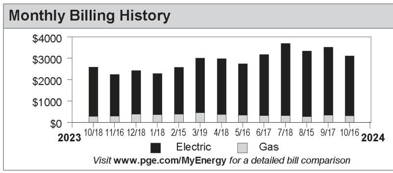
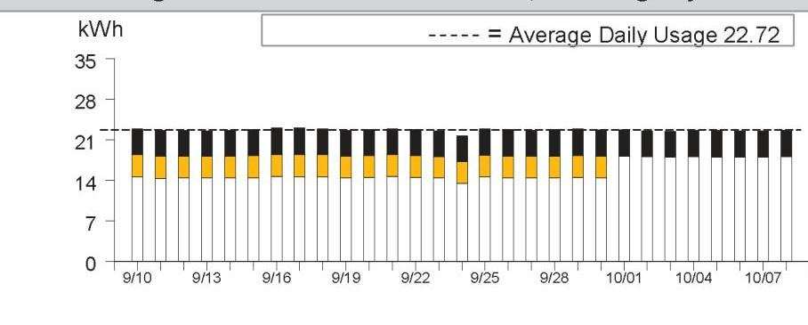
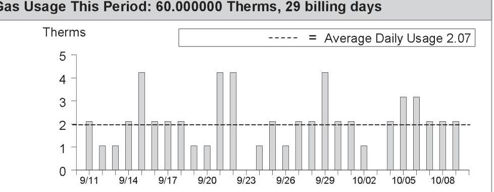
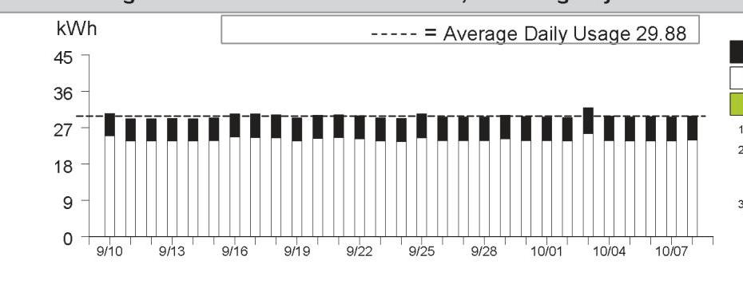
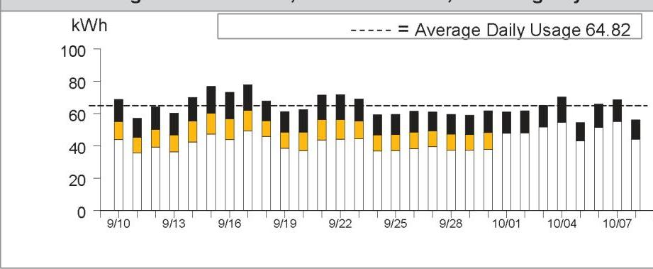
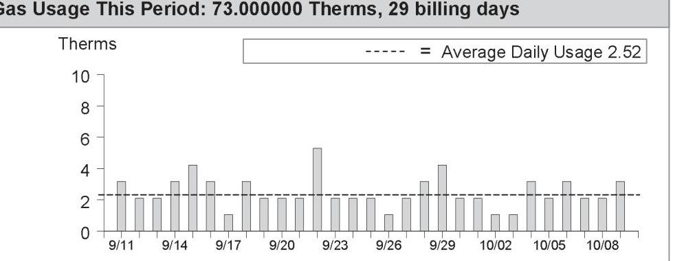
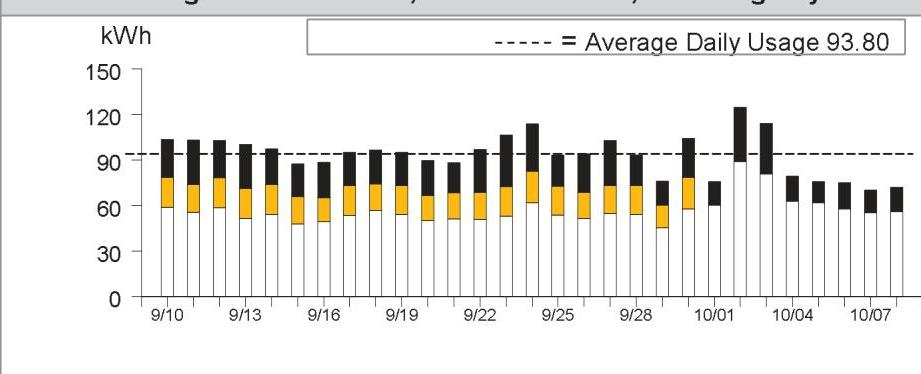

## Service For:

CHERRY AVE DEV CO
DBA CHERRY AVE
Please see details page.

## Questions about your bill?

Business Specialist available:
Mon-Fri: 7am to 6pm
1-800-468-4743
www.pge.com/MyEnergy

## Ways To Pay

www.pge.com/waystopay

| Vendor \# | 375 |  |
| :-- | :-- | :-- |
| Date Paid | $11 / 01 / 24$ | RB |
| Prop | Amount | Account |
| CWDA | $\$ 2,571.90$ | $\mathbf{5 7 0 0 1 - 0 0 2}$ |
| CWDA | $\$ 320.84$ | $\mathbf{5 7 0 0 3 - 0 0 0}$ |

## Your Account Summary

Amount Due on Previous Statement \$3,529.40
Payment(s) Received Since Last Statement -3,529.40
Previous Unpaid Balance $\$ 0.00$
Current PG\&E Electric Delivery Charges \$1,871.35
Electric Adjustments -221.36
San Jose Clean Energy Electric Generation Charges 921.91
Current PG\&E Gas Delivery Charges 212.19
COMMERCIAL ENERGY Gas Procurement Charges 108.65
Total Amount Due by 11/04/2024 \$2,892.74

## Monthly Billing History

The image is a bar chart titled "Monthly Billing History." It displays a yearly usage breakdown (monthly-based) of electric and gas charges from October 2018 to October 2019.

- **Y-axis:** Labeled with dollar amounts ranging from $0 to $4000.
- **X-axis:** Displays months from 10/18 to 10/16, spanning years 2023 to 2024.
- **Legend:** 
  - Black bars represent "Electric"
  - Gray bars represent "Gas"

Each month has a stacked bar with the black portion indicating electric charges and the gray portion indicating gas charges. The bars show variations in monthly billing amounts, with the highest total around 7/18. 

Text at the bottom: "Visit www.pge.com/MyEnergy for a detailed bill comparison."

Please return this portion with your payment. No staples or paper clips. Do not fold. Thank you.

99909398507108800003114100000289274

The image is a logo for PG&E. It features the letters "PG&E" in a stylized font with a diagonal line cutting through the design. The logo is predominantly black and white, with a registered trademark symbol (®) in the top right corner.

Account Number: $\quad$ Due Date: 9398507108-8 9398507108-8 11/04/2024
Total Amount Due: \$2,892.74
Amount Enclosed: $\$$

CHERRY AVE DEV CO
DBA CHERRY AVE
PO BOX 5368
SAN JOSE, CA 95150-5368

PG\&E
BOX 997300
SACRAMENTO, CA 95899-7300

Important Phone Numbers - Monday-Friday 7 a.m.-7 p.m., Saturday 8 a.m.-5 p.m.

# Customer Service (All Languages; Relay Calls Accepted) 1-800-743-5000 

TTY 7-1-1

| Servicio al Cliente en Español (Spanish) | $1-800-660-6789$ |
| :-- | :-- |
| 華語客戶服務 (Chinese) | $1-800-893-9555$ |

## Rules and rates

You may be eligible for a lower rate. Find out about optional rates or view a complete list of rules and rates, visit www.pge.com or call 1-800-743-5000.
If you believe there is an error on your bill, please call 1-800-743-5000 to speak with a representative. If you are not satisfied with our response, contact the California Public Utilities Commission (CPUC), Consumer Affairs Branch (CAB), 505 Van Ness Avenue, Room 2003, San Francisco, CA 94102, 1-800-649-7570 or 7-1-1 (8:30 AM to 4:30 PM, Monday through Friday) or by visiting www.cpuc.ca.gov/complaints/.
To avoid having service turned off while you wait for the outcome of a complaint to the CPUC specifically regarding the accuracy of your bill, please contact CAB for assistance. If your case meets the eligibility criteria, CAB will provide you with instructions on how to mail a check or money order to be impounded pending resolution of your case. You must continue to pay your current charges while your complaint is under review to keep your service turned on.
If you are not able to pay your bill, call PG\&E to discuss how we can help. You may qualify for reduced rates under PG\&E's CARE program or other special programs and agencies may be available to assist you. You may qualify for PG\&E's Energy Savings Assistance Program which is an energy efficiency program for income-qualified residential customers.

## Important definitions

Rotating outage blocks are subject to change without advance notice due to operational conditions.
Demand charge: Many non-residential rates include a demand charge. Demand is a measurement of the highest usage of electricity in any single fifteen (or sometimes five) minute period during a monthly billing cycle. Demand is measured in kilowatts (or kW). High demand is usually associated with equipment start-up. By spreading equipment start-ups over a longer period of time, you may be able to lower demand and reduce your demand charges.
Time-of-use electric prices are higher every day during afternoons and evenings, and lower at other times of the day. Prices also change by season, with higher prices in the summer and lower prices in the winter.
Wildfire Fund Charge: Charge on behalf of the State of California Department of Water Resources (DWR) to fund the California Wildfire Fund. For usage prior to October 1, 2020, this charge included costs related to the 2001 California energy crisis, also collected on behalf of the DWR. These charges belong to DWR, not PG\&E.

Dich vu khách tiếng Việt (Vietnamese) 1-800-298-8438
Business Customer Service 1-800-468-4743

Power Charge Indifference Adjustment (PCIA): The PCIA is a charge to ensure that both PG\&E customers and those who have left PG\&E service to purchase electricity from other providers pay for the above market costs for electric generation resources that were procured by PG\&E on their behalf. 'Above market' refers to the difference between what the utility pays for electric generation and current market prices for the sale of those resources. Visit www.pge.com/cca.
Wildfire Hardening Charge: PG\&E has been permitted to issue bonds that enable it to recover more quickly certain costs related to preventing and mitigating catastrophic wildfires, while reducing the total cost to its customers. Your bill for electric service includes a fixed recovery charge called the Wildfire Hardening Charge that has been approved by the CPUC to repay those bonds. The right to recover the Wildfire Hardening Charge has been transferred to a separate entity (called the Special Purpose Entity) that issued the bonds and does not belong to PG\&E. PG\&E is collecting the Wildfire Hardening Charge on behalf of the Special Purpose Entity. For details visit: www.pge.com/tariffs/assets/pdf/tariffbook/ELEC_PRELIM_JF.pdf.
Recovery Bond Charge/Credit: Your bill for electric service includes a charge that has been approved by the CPUC to repay bonds issued for certain costs related to catastrophic wildfires. The Recovery Bond Charge (RBC) rate is currently $\$ 0.00650$ per kWh. PG\&E has also contributed certain amounts to a trust fund which is used to provide a customer credit equal to $\$ 0.00650$ per kWh (Recovery Bond Credit). The right to recover the RBC has been transferred to one or more Special Purpose Entities that issued the bonds and does not belong to PG\&E. PG\&E is collecting that portion of the RBC on behalf of the Special Purpose Entities.
Gas Public Purpose Program (PPP) Surcharge. Used to fund state-mandated gas assistance programs for low-income customers, energy efficiency programs, and public-interest research and development.

Visit www.pge.com/billexplanation for more definitions. To view most recent bill inserts including legal or mandated notices, visit www.pge.com/billinserts.

See the table reflecting "Your Electric Charges Breakdown" on the last page
"PG\&E" refers to Pacific Gas and Electric Company, a subsidiary of PG\&E Corporation, © 2024 Pacific Gas and Electric Company. All rights reserved.
Please do not mark in box. For system use only.

## Update My Information (English Only)

Please allow 1-2 billing cycles for changes to take effect

## Account Number: 9398507108-8

Change my mailing address to: $\qquad$

| City | State | ZIP code |
| :-- | :-- | :-- |
| Primary | Primary |  |
| Phone | Email |  |

## Ways To Pay

- Online via web or mobile at www.pge.com/waystopay
- By mail: Send your payment along with this payment stub in the envelope provided.
- By debit card, Visa, MasterCard, American Express, or Discover: Call 877-704-8470 at any time. (Our independent service provider charges a fee per transaction.)
- At a neighborhood payment center: To find a neighborhood payment center near you, please visit www.pge.com or call 800-743-5000. Please bring a copy of your bill with you.

# Summary of your energy related services 

|  | Meter Number | Usage | Amount |
| :--: | :--: | :--: | :--: |
| Service For: 4950 CHERRY AVE BLDG 3 |  |  |  |
| Service Agreement ID: 9398507758 HSE MTR BOILER \#1,3,4 |  |  |  |
| PG\&E Electric Delivery Charges | 1006954090 | 658.813300 kWh | $\$ 203.32$ |
| Electric Adjustments |  |  | $-55.34$ |
| Service Agreement ID: 9397269060 |  |  |  |
| SAN JOSE CLEAN ENERGY Electric Generation |  | 658.813300 kWh | \$98.12 |
| Total |  |  | \$246.10 |
| Service For: 4950 CHERRY AVE BLDG 6 |  |  |  |
| Service Agreement ID: 9398507638 UTILITY ROOM |  |  |  |
| PG\&E Gas Delivery Charges | 62482849 | 60.000000 Therm | \$96.54 |
| Service Agreement ID: 9398507513 |  |  |  |
| COMMERCIAL ENERGY Gas Procurement Charges |  | 60.000000 Therm | \$49.01 |
| Total |  |  | \$145.55 |
| Service For: 4950 CHERRY AVE BLDG 7 |  |  |  |
| Service Agreement ID: 9398507361 |  |  |  |
| PG\&E Electric Delivery Charges | 1010071003 | 866.584500 kWh | \$267.55 |
| Electric Adjustments |  |  | $-55.34$ |
| Service Agreement ID: 9394721548 |  |  |  |
| SAN JOSE CLEAN ENERGY Electric Generation |  | 866.584500 kWh | \$125.61 |
| Total |  |  | \$337.82 |
| Service For: 4950 CHERRY AVE BLDG 17 |  |  |  |
| Service Agreement ID: 9398507993 REC RM |  |  |  |
| PG\&E Electric Delivery Charges | 1008832278 | 1,879.893000 kWh | \$576.77 |
| Electric Adjustments |  |  | $-55.34$ |
| Service Agreement ID: 9394360912 |  |  |  |
| SAN JOSE CLEAN ENERGY Electric Generation |  | 1,879.893000 kWh | \$281.52 |
| Total |  |  | \$802.95 |
| Service For: 4950 CHERRY AVE BLDG 13 |  |  |  |
| Service Agreement ID: 9398507450 HSE MTR-LTS-BLDG 13 |  |  |  |
| PG\&E Gas Delivery Charges | 62020197 | 73.000000 Therm | \$115.65 |
| Service Agreement ID: 9399688280 |  |  |  |
| COMMERCIAL ENERGY Gas Procurement Charges |  | 73.000000 Therm | \$59.64 |
| Total |  |  | \$175.29 |
| Service For: 4950 CHERRY AVE |  |  |  |
| Service Agreement ID: 9398507704 REC RM BOIL \#2,14,16 |  |  |  |
| PG\&E Electric Delivery Charges | 1008832279 | 2,720.230000 kWh | \$823.71 |
| Electric Adjustments |  |  | $-55.34$ |

|  |  | Account No: 9398507108-8 |  |
| :--: | :--: | :--: | :--: |
|  |  | Statement Date: | 10/16/2024 |
|  |  | Due Date: | 11/04/2024 |
| Summary of your energy related services (continued) |  |  |  |
|  | Meter Number | Usage | Amount |
| Service Agreement ID: 9391986939 |  |  |  |
| SAN JOSE CLEAN ENERGY Electric Generation |  | 2,720.230000 kWh | \$416.66 |
| Total |  |  | \$1,185.03 |

Details of PG\&E Electric Delivery Charges
09/10/2024 - 10/08/2024 (29 billing days)
Service For: 4950 CHERRY AVE BLDG 3
Service Agreement ID: 9398507758 HSE MTR BOILER \#1,3,4
Rate Schedule: B1 Bus Low Use
09/10/2024 - 09/30/2024

Customer Charge
Energy Charges
Peak
Part Peak
Off Peak
Generation Credit
Power Charge Indifference Adjustment
Franchise Fee Surcharge
San Jose Utility Users' Tax (5.000\%)
San Jose Franchise Surcharge

## 10/01/2024 - 10/08/2024

Customer Charge
Energy Charges
Peak
Off Peak
Generation Credit
Power Charge Indifference Adjustment
Franchise Fee Surcharge
San Jose Utility Users' Tax (5.000\%)
San Jose Franchise Surcharge

## 8 days @ $\$ 0.32854$

$\$ 0.46$
$79.527200 \mathrm{kWh} @ \$ 0.43334$
$304.171400 \mathrm{kWh} @ \$ 0.41253$
$-76.03$
$4.38$
$0.49$
$7.03$
$0.42$

## 10/01/2024 - 10/08/2024

Customer Charge
Energy Charges
Peak
Off Peak
Generation Credit
Power Charge Indifference Adjustment
Franchise Fee Surcharge
San Jose Utility Users' Tax (5.000\%)
San Jose Franchise Surcharge

8 days @ $\$ 0.32854$
$\$ 2.63$
$36.113900 \mathrm{kWh} @ \$ 0.41924$
$144.804200 \mathrm{kWh} @ \$ 0.40312$
$-26.00$
$1.66$
$0.18$
$2.59$
0.16

## Total PG\&E Electric Delivery Charges

2018 Vintaged Power Charge Indifference Adjustment
Average Daily Usage (kWh / day)

| Last Year | Last Period | Current Period |
| :--: | :--: | :--: |
| 22.90 | 22.25 | 22.72 |

## Rate Identification Number

The image is a QR code. There is no embedded text or additional details visible within the image itself.

USCA-PGCC-0600-0000
www.pge.com/rin
To program your smart device, scan the QR code or enter the RIN code above and follow the on-screen instructions.

## Service Information

| Meter \# | 1006954090 |
| :-- | --: |
| Total Usage | 658.813300 kWh |
| Serial | Q |
| Rotating Outage Block | 50 |

## Additional Messages

CA Climate Credit -
You received a Climate Credit on this month's electric bill. For more information about this California Climate Credit, visit
www.cpuc.ca.gov/smallbusinessclimatecredit

Electric Usage This Period: 658.813300 kWh, 29 billing days

The image is a bar chart.

- **Chart Type**: Bar chart
- **X-Axis**: Dates from 9/10 to 10/08
- **Y-Axis**: kWh (kilowatt-hours)
- **Data Points**: Daily usage values are shown as bars, with each bar representing a day's usage.
- **Legend**: Dashed line labeled as "Average Daily Usage 22.72"
- **Notable Styling**: 
  - Bars are colored with a combination of black and orange.
  - The dashed line indicates the average daily usage across the period.
- **Yearly Usage Breakdown (Monthly-Based)**: The chart provides a visual representation of daily electricity usage over the specified period, with an average daily usage line for comparison.

|  | Usage | Energy Charges |
| :--: | :--: | :--: |
| Peak $^{\dagger}$ | $19.77 \%$ | $\$ 60.60$ |
| Part Peak ${ }^{\ddagger}$ | $12.09 \%$ | $\$ 34.46$ |
| Off Peak ${ }^{\ddagger}$ | $68.14 \%$ | $\$ 183.85$ |
| Super Off Peak* | $0.00 \%$ | $\$ 0.00$ |

${ }^{\dagger}$ Peak: Year-round, Daily, 4:00pm-9:00pm
${ }^{\ddagger}$ Part Peak: Summer, 6/1-9/30, Daily, 2:00pm-4:00pm and 9:00pm-11:00pm
'Off Peak: Summer, 6/1-9/30, Daily, 11:00pm-2:00pm
Winter, 10/1-2/28, Daily, 9:00pm-4:00pm
Winter, 3/1-5/31, Daily, 9:00pm-9:00pm and 2:00pm-4:00pm
*Super Off Peak: Winter, Daily, 3/1-5/31, 9:00am-2:00pm

|  |  |
| :-- | --: |
|  |  |
|  |  |
|  |  |
|  |  |
|  |  |
|  |  |
|  |  |
|  |  |
|  |  |
|  |  |
|  |  |
|  |  |
|  |  |
|  |  |
|  |  |
|  |  |
|  |  |
|  |  |
|  |  |
|  |  |
|  |  |
|  |  |
|  |  |
|  |  |
|  |  |
|  |  |
|  |  |
|  |  |
|  |  |
|  |  |
|  |  |
|  |  |
|  |  |
|  |  |
|  |  |
|  |  |
|  |  |
|  |  |
|  |  |
|  | 

Details of San Jose Clean Energy Electric Generation Charges
09/10/2024 - 10/08/2024 (29 billing days)
Service For: 4950 CHERRY AVE BLDG 3
Service Agreement ID: 9397269060 ESP Customer Number: 9398507758
09/10/2024 - 10/08/2024

## Rate Schedule: B-1

| Generation - Off Peak - Winter | $144.804200 \mathrm{kWh} \quad @ \$ 0.12629$ | $\$ 18.29$ |
| :-- | --: | --: |
| Generation - Off Peak - Summer | $304.171400 \mathrm{kWh} \quad @ \$ 0.12771$ | 38.85 |
| Generation - On Peak - Winter | $36.113900 \mathrm{kWh} \quad @ \$ 0.14340$ | 5.18 |
| Generation - Part Peak - Summer | $79.527200 \mathrm{kWh} \quad @ \$ 0.14978$ | 11.91 |
| Generation - On Peak - Summer | $94.196600 \mathrm{kWh} \quad @ \$ 0.20200$ | 19.03 |
|  | Net Charges 93.26 |  |
| Local Utility Users Tax |  | 4.66 |
| Energy Commission Surcharge |  | 0.20 |
| Your service: GreenSource - SJCE's standard service with more renewable energy |  |  |
| For more detail on your San Jose Clean Energy bill, call us at 833-432-2454 |  |  |

## Total San Jose Clean Energy Electric Generation Charges

\$98.12

## Rate Identification Number

The image is a photo/illustration of a QR code. There is no additional text or elements present in the image.

USCA-XXSJ-0169-0000
www.pge.com/rin
To program your smart device, scan the QR code or enter the RIN code above and follow the on-screen instructions.

For questions regarding charges on this page, please contact:
SAN JOSE CLEAN ENERGY
200 E SANTA CLARA ST
SAN JOSE CA 95113
1-833-432-2454
www.sanjosecleanenergy.org
info@SanJoseCleanEnergy.org

## Additional Messages

About San José Clean Energy (SJCE)
San José Clean Energy is a program of the City of San José and provides its residents and businesses with electricity from sources like solar, wind, and hydropower. SJCE offers the additional benefits of customer choice, community programs, local control, transparency, and accountability.

SJCE's standard electricity generation service, GreenSource, provides customers with more renewable power. SJCE also offers a 100\% renewable product, TotalGreen, for a small premium. Learn more.
www.SanJoseCleanEnergy.org/TotalGreen.

## Understanding SJCE Charges

SJCE replaces PG\&E Generation Charges. PG\&E continues to provide all electric delivery, billing, and gas services. Under PG\&E Electric Delivery Charges, note the Generation Credit. This is what PG\&E would have charged for power, and now credits back to you. The PG\&E Power Charge Indifference Adjustment and Franchise Fee are factored into SJCE's rate-setting. Learn more.
www.SanJoseCleanEnergy.org/Understandin g-Your-Bill.

SJ Cares is SJCE's program that allows customers enrolled in CARE or FERA financial assistance programs to receive cleaner energy at the lowest possible rates. Learn more: www.SanJoseCleanEnergy.org/Discount-Pro grams.

Please pay your SJCE charges directly to PG\&E (see page 1 of this bill). Do not send payment to San José Clean Energy.

Details of PG\&E Gas Delivery Charges
09/11/2024 - 10/09/2024 (29 billing days)
Service For: 4950 CHERRY AVE BLDG 6
Service Agreement ID: 9398507638 UTILITY ROOM
Rate Schedule: GNR1 Gas Service to Small Commercial Customers
09/11/2024 - 09/30/2024
Customer Charge
20 days @ $\$ 0.27048$
\$5.41
Gas Charges
First 4,000 Therm
\$1.379310 Therm
\$1.70756
Gas Procurement Credit ${ }^{1}$
-16.68
Franchise Fee Surcharge
0.02
Gas PPP Surcharge (\$0.09693 /Therm)
San Jose Utility Users' Tax (5.000\%)
San Jose Franchise Surcharge
$.16 .68$
10/01/2024 - 10/09/2024
Customer Charge
9 days @ $\$ 0.27048$
\$2.43
Gas Charges
First 4,000 Therm
\$1.61844
\$1.61844
Gas Procurement Credit ${ }^{1}$
-5.84
Franchise Fee Surcharge
0.02
Gas PPP Surcharge (\$0.09693 /Therm)
1.80
San Jose Utility Users' Tax (5.000\%)
1.34
San Jose Franchise Surcharge
0.08

Total PG\&E Gas Delivery Charges
$\$ 96.54$
${ }^{1}$ Credits you for the PG\&E Gas Usage charge that otherwise would have been included in this rate

Average Daily Usage (Therms / day)

| Last Year | Last Period | Current Period |
| :--: | :--: | :--: |
| 2.13 | 2.19 | 2.07 |

Gas Usage This Period: 60.000000 Therms, 29 billing days

The image is a bar chart.

- **Chart Type**: Bar chart
- **X-Axis**: Dates ranging from 9/11 to 10/08
- **Y-Axis**: Therms (0 to 5)
- **Legend**: Dashed line labeled as "Average Daily Usage 2.07"
- **Data Points**: Bars represent daily therm usage with varying heights, mostly between 1 and 4 therms.
- **Notable Styling**: The average daily usage is marked with a dashed line across the chart at approximately 2.07 therms, indicating the average level of usage over the period.
- **Context**: This chart provides a **yearly usage breakdown (monthly-based)** for the specified billing period.

## Service Information

| Meter \# | 62482849 |
| :-- | --: |
| Current Meter Reading | 1,890 |
| Prior Meter Reading | 1,833 |
| Difference | 57 |
| Multiplier | 1.059109 |
| Total Usage | 60.000000 Therms |
| Serial | Q |

Gas Procurement Costs (\$/Therm)
09/11/2024 - 09/30/2024 \$0.40301
10/01/2024 - 10/09/2024 \$0.31389

## Additional Messages

Customer Charge To help deliver safe, reliable and affordable gas service to your business, PG\&E charges a customer fee which is based on your highest average daily gas usage within the past 12 months. For the billing period ending on 03/12/2024, your highest average daily gas usage was 2.7 therms.

Details of COMMERCIAL ENERGY Gas Procurement Charges

09/11/2024 - 10/09/2024 (29 billing days)
Service For: 4950 CHERRY AVE BLDG 6
Service Agreement ID: 9398507513 ESP Customer Number: 2074678045

09/11/2024 - 10/09/2024

Rate Schedule: PGGPG24911
Gas Procurement
Gas Procurement

Thank You For Your Business!
UTILITY USERS TAX

## Total COMMERCIAL ENERGY Gas Procurement Charges

For questions regarding charges on this page, please contact:
COMMERCIAL ENERGY
7677 OAKPORT ST STE 525
OAKLAND CA 94621
1-510-567-2700

## Additional Messages

If you believe there is an error or have a question in your Gas Service Provider's gas procurement charges, please call your Gas Service Provider at the number listed on your bill. If you are not satisfied with their response, please contact the CPUC's Consumer Affairs Branch at 1-800-649-7570. If you have limitations hearing or speaking, a specially-trained Communications Assistant can relay telephone conversations for all of your calls. Dial 711 to reach the California Relay Service.

To avoid being returned to PG\&E bundled service by COMMERCIAL ENERGY while you wait for the outcome of your complaint, specifically regarding the accuracy of your bill, mail a check or money order payable to "California Public Utilities Commission" for the disputed amount, along with a description of the dispute to: California Public Utilities Commission, Consumer Affairs Branch, 505 Van Ness Avenue, Room 2003, San Francisco CA 94102. COMMERCIAL ENERGY cannot turn off your service for nonpayment while your complaint is under review. However, you must continue to pay your current charges to avoid disconnection of your service. The CPUC will not accept the payment for the disputed amount if the complaint to CAB is not directly related to the accuracy of your bill and your payment will be returned.

Details of PG\&E Electric Delivery Charges
09/10/2024 - 10/08/2024 (29 billing days)
Service For: 4950 CHERRY AVE BLDG 7
Service Agreement ID: 9398507361
Rate Schedule: B6 Bus Low Use Alt
09/10/2024 - 09/30/2024

Customer Charge
Energy Charges
Peak
Off Peak
Generation Credit
Power Charge Indifference Adjustment
Franchise Fee Surcharge
San Jose Utility Users' Tax (5.000\%)
San Jose Franchise Surcharge

## 10/01/2024 - 10/08/2024

Customer Charge
Energy Charges
Peak
Off Peak
Generation Credit
Power Charge Indifference Adjustment
Franchise Fee Surcharge
San Jose Utility Users' Tax (5.000\%)
San Jose Franchise Surcharge

## 10/01/2024 - 10/08/2024

Customer Charge
Energy Charges
Peak
Off Peak
Generation Credit
Power Charge Indifference Adjustment
Franchise Fee Surcharge
San Jose Utility Users' Tax (5.000\%)
San Jose Franchise Surcharge

8 days @ $\$ 0.32854$
$47.934000 \mathrm{kWh} @ \$ 0.42189$
$192.381500 \mathrm{kWh} @ \$ 0.37829$
$2.20$
$0.25$
$3.28$
$0.56$

## 10/01/2024 - 10/08/2024

Customer Charge
Energy Charges
Peak
Off Peak
Generation Credit
Power Charge Indifference Adjustment
Franchise Fee Surcharge
San Jose Utility Users' Tax (5.000\%)
San Jose Franchise Surcharge

8 days @ $\$ 0.32854$
$47.934000 \mathrm{kWh} @ \$ 0.42189$
$192.381500 \mathrm{kWh} @ \$ 0.37829$
$2.20$
$0.25$
$3.28$
$0.20$

## Total PG\&E Electric Delivery Charges

2018 Vintaged Power Charge Indifference Adjustment
Average Daily Usage (kWh / day)

| Last Year | Last Period | Current Period |
| :--: | :--: | :--: |
| 29.91 | 28.68 | 29.88 |

## Rate Identification Number

The image is a QR code. It is a black and white square pattern used for scanning and retrieving information digitally. There is no embedded text or additional elements within the image itself.

USCA-PGCC-0700-0000
www.pge.com/rin
To program your smart device, scan the QR code or enter the RIN code above and follow the on-screen instructions.

## Service Information

| Meter \# | 1010071003 |
| :-- | --: |
| Total Usage | 866.584500 kWh |
| Serial | Q |
| Rotating Outage Block | 50 |

## Additional Messages

## CA Climate Credit -

You received a Climate Credit on this month's electric bill. For more information about this California Climate Credit, visit
www.cpuc.ca.gov/smallbusinessclimatecredit

Electric Usage This Period: 866.584500 kWh, 29 billing days

The image is a bar chart.

- **Chart Type**: Bar chart
- **X-Axis**: Dates ranging from 9/10 to 10/07
- **Y-Axis**: kWh (kilowatt-hours)
- **Data Points**: Daily usage values are shown for each date, with bars representing the kWh used.
- **Legend**: 
  - Dashed line represents "Average Daily Usage 29.88"
- **Styling**: 
  - Bars are black and white.
  - The dashed line indicates the average daily usage across the period.
- **Yearly Usage Breakdown (Monthly-Based)**: The chart provides a visual representation of daily energy usage over the specified period, with a comparison to the average daily usage.

|  | Usage | Energy Charges |
| :--: | :--: | :--: |
| Peak $^{\dagger}$ | $19.32 \%$ | $\$ 98.67$ |
| Off Peak ${ }^{\ddagger}$ | $80.68 \%$ | $\$ 274.92$ |
| Super Off Peak ${ }^{\ddagger}$ | 0.00\% | $\$ 0.00$ |

${ }^{\dagger}$ Peak: Year-round, Daily, 4:00pm-9:00pm
'Off Peak: Summer, 6/1-9/30, Daily, 9:00pm-4:00pm
Winter, 10/1-2/28, Daily, 9:00pm-4:00pm
Winter, 3/1-5/31, Daily, 9:00pm-9:00am and 2:00pm-4:00pm
Super Off Peak: Winter, 3/1-5/31, Daily, 9:00am-2:00pm

|  |  |
| :-- | --: |
|  |  |
|  |  |
|  |  |
|  |  |
|  |  |
| Details of PG&E Electric Delivery Charges |  |
| (continued) |  |
| Service For: 4950 CHERRY AVE BLDG 7 |  |
| Service Agreement ID: 9398507361 |  |
| Adjustments |  |
| CA Climate Credit | -$55.17 |
| CA Climate Credit City Franchise Surcharge Adj | -0.17 |
| Total Adjustments | -$55.34 |
|  |  |
|  |  |
|  |  |
|  |  |
|  |  |
|  |  |
|  |  |
|  |  |
|  |  |
|  |  |
|  |  |
|  |  |
|  |  |
|  |  |
|  |  |
|  |  |
|  |  |
|  |  |
|  |  |
|  |  |
|  |  |
|  |  |
|  |  |
|  |  |
|  |  |
|  |  |
|  |  |
|  |  |
|  |  |
|  |  |
|  |  |
|  |  |
|  |  |
|  |  |
|  |  |
|  |  |
|  |  |
|  |  |
|  |  |
|  | 

Details of San Jose Clean Energy Electric Generation Charges
09/10/2024 - 10/08/2024 (29 billing days)
Service For: 4950 CHERRY AVE BLDG 7
Service Agreement ID: 9394721548 ESP Customer Number: 9398507361
09/10/2024 - 10/08/2024

## Rate Schedule: B-6

Generation - Off Peak - Winter
Generation - Off Peak - Summer
Generation - On Peak - Winter
Generation - On Peak - Summer

Local Utility Users Tax
Energy Commission Surcharge
Your service: GreenSource - SJCE's standard service with more renewable energy
For more detail on your San Jose Clean Energy bill, call us at 833-432-2454

## Total San Jose Clean Energy Electric Generation Charges

## Rate Identification Number

The image is a photo of a QR code. There is no additional text or elements visible in the image.

USCA-XXSJ-0307-0000
www.pge.com/rin
To program your smart device, scan the QR code or enter the RIN code above and follow the on-screen instructions.

For questions regarding charges on this page, please contact:
SAN JOSE CLEAN ENERGY
200 E SANTA CLARA ST
SAN JOSE CA 95113
1-833-432-2454
www.sanjosecleanenergy.org
info@SanJoseCleanEnergy.org

## Additional Messages

About San José Clean Energy (SJCE)
San José Clean Energy is a program of the City of San José and provides its residents and businesses with electricity from sources like solar, wind, and hydropower. SJCE offers the additional benefits of customer choice, community programs, local control, transparency, and accountability.

SJCE's standard electricity generation service, GreenSource, provides customers with more renewable power. SJCE also offers a 100\% renewable product, TotalGreen, for a small premium. Learn more.
www.SanJoseCleanEnergy.org/TotalGreen.

## Understanding SJCE Charges

SJCE replaces PG\&E Generation Charges. PG\&E continues to provide all electric delivery, billing, and gas services. Under PG\&E Electric Delivery Charges, note the Generation Credit. This is what PG\&E would have charged for power, and now credits back to you. The PG\&E Power Charge Indifference Adjustment and Franchise Fee are factored into SJCE's rate-setting. Learn more.
www.SanJoseCleanEnergy.org/Understandin g-Your-Bill.

SJ Cares is SJCE's program that allows customers enrolled in CARE or FERA financial assistance programs to receive cleaner energy at the lowest possible rates. Learn more: www.SanJoseCleanEnergy.org/Discount-Pro grams.

Please pay your SJCE charges directly to PG\&E (see page 1 of this bill). Do not send payment to San José Clean Energy.

Details of PG\&E Electric Delivery Charges
09/10/2024 - 10/08/2024 (29 billing days)
Service For: 4950 CHERRY AVE BLDG 17
Service Agreement ID: 9398507993 REC RM
Rate Schedule: B1 Bus Low Use
09/10/2024 - 09/30/2024

Customer Charge
Energy Charges
Peak
Part Peak
Off Peak
Generation Credit
Power Charge Indifference Adjustment
Franchise Fee Surcharge
San Jose Utility Users' Tax (5.000\%)
San Jose Franchise Surcharge

## 10/01/2024 - 10/08/2024

Customer Charge
Energy Charges
Peak
Off Peak
Generation Credit
Power Charge Indifference Adjustment
Franchise Fee Surcharge
San Jose Utility Users' Tax (5.000\%)
San Jose Franchise Surcharge

## Total PG\&E Electric Delivery Charges

2018 Vintaged Power Charge Indifference Adjustment
Average Daily Usage (kWh / day)

| Last Year | Last Period | Current Period |
| :--: | :--: | :--: |
| 62.16 | 59.93 | 64.82 |

## Rate Identification Number

This is a QR code. It is a two-dimensional barcode that can be scanned using a smartphone or QR code reader to access information or a website. There is no embedded text visible within the image itself.

USCA-PGCC-0600-0000
www.pge.com/rin
To program your smart device, scan the QR code or enter the RIN code above and follow the on-screen instructions.

## Service Information

Meter \#
Total Usage
Serial
Rotating Outage Block
$1008832278$
1,879.893000 kWh
50

## Additional Messages

CA Climate Credit -
You received a Climate Credit on this month's electric bill. For more information about this California Climate Credit, visit
www.cpuc.ca.gov/smallbusinessclimatecredit

Electric Usage This Period: 1,879.893000 kWh, 29 billing days

The image is a bar chart.

- **Chart Type**: Bar chart
- **X-Axis**: Dates from 9/10 to 10/07
- **Y-Axis**: kWh (kilowatt-hours), ranging from 0 to 100
- **Legend**: Dashed line represents "Average Daily Usage 64.82"
- **Data Points**: Daily usage values are represented by stacked bars with two colors (black and orange). The bars fluctuate around the average daily usage line, with some days exceeding 80 kWh and others below 60 kWh.
- **Styling**: The average daily usage is highlighted with a dashed line across the chart. The bars are stacked with black and orange segments, indicating different components of the usage.

This chart provides a **yearly usage breakdown (monthly-based)**, showing daily electricity usage over the specified period.

|  | Usage | Energy Charges |
| :--: | :--: | :--: |
| Peak ${ }^{1}$ | 20.92\% | $\$ 183.06$ |
| Part Peak ${ }^{2}$ | 12.28\% | $\$ 99.97$ |
| Off Peak ${ }^{3}$ | 66.80\% | $\$ 514.33$ |
| Super Off Peak ${ }^{4}$ | 0.00\% | $\$ 0.00$ |

${ }^{1}$ Peak: Year-round, Daily, 4:00pm-9:00pm
${ }^{2}$ Part Peak: Summer, 6/1-9/30, Daily, 2:00pm-4:00pm and 9:00pm-11:00pm
${ }^{3}$ Off Peak: Summer, 6/1-9/30, Daily, 11:00pm-2:00pm
Winter, 10/1-2/28, Daily, 9:00pm-4:00pm
Winter, 3/1-5/31, Daily, 9:00pm-9:00pm and 2:00pm-4:00pm
${ }^{4}$ Super Off Peak: Winter, Daily, 3/1-5/31, 9:00am-2:00pm

|  |  |
| :-- | --: |
|  |  |
|  |  |
|  |  |
|  |  |
|  |  |
| Details of PG&E Electric Delivery Charges |  |
| (continued) |  |
| Service For: 4950 CHERRY AVE BLDG 17 |  |
| Service Agreement ID: 9398507993 REC RM |  |
| Adjustments |  |
| CA Climate Credit | -$55.17 |
| CA Climate Credit City Franchise Surcharge Adj | -0.17 |
| Total Adjustments | -$55.34 |
|  |  |
|  |  |
|  |  |
|  |  |
|  |  |
|  |  |
|  |  |
|  |  |
|  |  |
|  |  |
|  |  |
|  |  |
|  |  |
|  |  |
|  |  |
|  |  |
|  |  |
|  |  |
|  |  |
|  |  |
|  |  |
|  |  |
|  |  |
|  |  |
|  |  |
|  |  |
|  |  |
|  |  |
|  |  |
|  |  |
|  |  |
|  |  |
|  |  |
|  |  |
|  |  |
|  |  |
|  |  |
|  |  |
|  |  |
|  | 

Details of San Jose Clean Energy Electric Generation Charges
09/10/2024 - 10/08/2024 (29 billing days)
Service For: 4950 CHERRY AVE BLDG 17
Service Agreement ID: 9394360912 ESP Customer Number: 9398507993
09/10/2024 - 10/08/2024

## Rate Schedule: B-1

Generation - Off Peak - Winter
Generation - Off Peak - Summer
Generation - On Peak - Winter
Generation - Part Peak - Summer
Generation - On Peak - Summer

Local Utility Users Tax
Energy Commission Surcharge
Your service: GreenSource - SJCE's standard service with more renewable energy
For more detail on your San Jose Clean Energy bill, call us at 833-432-2454

## Total San Jose Clean Energy Electric Generation Charges

Account No: 9398507108-8 Statement Date: 10/16/2024 Due Date: 11/04/2024

Rate Identification Number

The image is a photo of a QR code. There is no additional text or elements visible in the image.

USCA-XXSJ-0169-0000
www.pge.com/rin
To program your smart device, scan the QR code or enter the RIN code above and follow the on-screen instructions.

For questions regarding charges on this page, please contact:
SAN JOSE CLEAN ENERGY
200 E SANTA CLARA ST
SAN JOSE CA 95113
1-833-432-2454
www.sanjosecleanenergy.org
info@SanJoseCleanEnergy.org

## Additional Messages

About San José Clean Energy (SJCE)
San José Clean Energy is a program of the City of San José and provides its residents and businesses with electricity from sources like solar, wind, and hydropower. SJCE offers the additional benefits of customer choice, community programs, local control, transparency, and accountability.

SJCE's standard electricity generation service, GreenSource, provides customers with more renewable power. SJCE also offers a 100\% renewable product, TotalGreen, for a small premium. Learn more.
www.SanJoseCleanEnergy.org/TotalGreen.

## Understanding SJCE Charges

SJCE replaces PG\&E Generation Charges. PG\&E continues to provide all electric delivery, billing, and gas services. Under PG\&E Electric Delivery Charges, note the Generation Credit. This is what PG\&E would have charged for power, and now credits back to you. The PG\&E Power Charge Indifference Adjustment and Franchise Fee are factored into SJCE's rate-setting. Learn more.
www.SanJoseCleanEnergy.org/Understandin g-Your-Bill.

SJ Cares is SJCE's program that allows customers enrolled in CARE or FERA financial assistance programs to receive cleaner energy at the lowest possible rates. Learn more: www.SanJoseCleanEnergy.org/Discount-Pro grams.

Please pay your SJCE charges directly to PG\&E (see page 1 of this bill). Do not send payment to San José Clean Energy.

Details of PG\&E Gas Delivery Charges
09/11/2024 - 10/09/2024 (29 billing days)
Service For: 4950 CHERRY AVE BLDG 13
Service Agreement ID: 9398507450 HSE MTR-LTS-BLDG 13
Rate Schedule: GNR1 Gas Service to Small Commercial Customers
09/11/2024 - 09/30/2024
Customer Charge
20 days @ $\$ 0.27048$
$50.344828 \mathrm{~T}$ herms @ $\$ 1.70756$
$85.97$
Gas Procurement Credit ${ }^{1}$
$-20.29$
Franchise Fee Surcharge
0.02
Gas PPP Surcharge (\$0.09693 /Therm)
4.88
San Jose Utility Users' Tax (5.000\%)
3.55
San Jose Franchise Surcharge
0.21
10/01/2024 - 10/09/2024
Customer Charge
9 days @ $\$ 0.27048$
$22.655172 \mathrm{~T}$ herms @ $\$ 1.61844$
36.67

Gas Procurement Credit ${ }^{1}$
$-7.11$
Franchise Fee Surcharge
0.02
Gas PPP Surcharge (\$0.09693 /Therm)
2.19

San Jose Utility Users' Tax (5.000\%)
1.60

San Jose Franchise Surcharge
0.10

Total PG\&E Gas Delivery Charges
$\$ 115.65$
${ }^{1}$ Credits you for the PG\&E Gas Usage charge that otherwise would have been included in this rate

Average Daily Usage (Therms / day)

| Last Year | Last Period | Current Period |
| :--: | :--: | :--: |
| 2.33 | 2.44 | 2.52 |

Gas Usage This Period: 73.000000 Therms, 29 billing days

The image is a bar chart.

- **Chart Type**: Bar chart
- **X-Axis**: Dates ranging from 9/11 to 10/09
- **Y-Axis**: Therms, ranging from 0 to 10
- **Legend**: Dashed line labeled as "Average Daily Usage 2.52"
- **Data Points**: Daily therm usage with varying bar heights, generally around 2 to 4 therms, with some peaks around 6 therms.
- **Styling**: The average daily usage is indicated by a dashed line across the chart at approximately 2.52 therms.
- **Yearly Usage Breakdown (Monthly-Based)**: The chart represents daily gas usage over a period of 29 days, with a total usage of 73 therms for the period.

## Service Information

| Meter \# | 62020197 |
| :-- | --: |
| Current Meter Reading | 6,411 |
| Prior Meter Reading | 6,342 |
| Difference | 69 |
| Multiplier | 1.059109 |
| Total Usage | 73.000000 Therms |
| Serial | Q |

Gas Procurement Costs (\$/Therm)
09/11/2024 - 09/30/2024
$\$ 0.40301$
10/01/2024 - 10/09/2024
$\$ 0.31389$

## Additional Messages

Customer Charge To help deliver safe, reliable and affordable gas service to your business, PG\&E charges a customer fee which is based on your highest average daily gas usage within the past 12 months. For the billing period ending on 03/12/2024, your highest average daily gas usage was 3.2 therms.

Details of COMMERCIAL ENERGY Gas Procurement Charges

09/11/2024 - 10/09/2024 (29 billing days)
Service For: 4950 CHERRY AVE BLDG 13
Service Agreement ID: 9399688280 ESP Customer Number: 9398507450

09/11/2024 - 10/09/2024

Rate Schedule: PGGPG24911
Gas Procurement
Gas Procurement

Thank You For Your Business!
UTILITY USERS TAX

## Total COMMERCIAL ENERGY Gas Procurement Charges

For questions regarding charges on this page, please contact:
COMMERCIAL ENERGY
7677 OAKPORT ST STE 525
OAKLAND CA 94621
1-510-567-2700

## Additional Messages

If you believe there is an error or have a question in your Gas Service Provider's gas procurement charges, please call your Gas Service Provider at the number listed on your bill. If you are not satisfied with their response, please contact the CPUC's Consumer Affairs Branch at 1-800-649-7570. If you have limitations hearing or speaking, a specially-trained Communications Assistant can relay telephone conversations for all of your calls. Dial 711 to reach the California Relay Service.

To avoid being returned to PG\&E bundled service by COMMERCIAL ENERGY while you wait for the outcome of your complaint, specifically regarding the accuracy of your bill, mail a check or money order payable to "California Public Utilities Commission" for the disputed amount, along with a description of the dispute to: California Public Utilities Commission, Consumer Affairs Branch, 505 Van Ness Avenue, Room 2003, San Francisco CA 94102. COMMERCIAL ENERGY cannot turn off your service for nonpayment while your complaint is under review. However, you must continue to pay your current charges to avoid disconnection of your service. The CPUC will not accept the payment for the disputed amount if the complaint to CAB is not directly related to the accuracy of your bill and your payment will be returned.

Details of PG\&E Electric Delivery Charges
09/10/2024 - 10/08/2024 (29 billing days)
Service For: 4950 CHERRY AVE
Service Agreement ID: 9398507704 REC RM BOIL \#2,14,16
Rate Schedule: B1 Bus Low Use
09/10/2024 - 09/30/2024

Customer Charge
Energy Charges
Peak
Part Peak
Off Peak
Generation Credit
Power Charge Indifference Adjustment
Franchise Fee Surcharge
San Jose Utility Users' Tax (5.000\%)
San Jose Franchise Surcharge

## 10/01/2024 - 10/08/2024

Customer Charge
Energy Charges
Peak
Off Peak
Generation Credit
Power Charge Indifference Adjustment
Franchise Fee Surcharge
San Jose Utility Users' Tax (5.000\%)
San Jose Franchise Surcharge

## 8 days @ $\$ 0.82136$

$\$ 6.57$
162.722000 kWh @ $\$ 0.41924$
525.443000 kWh @ $\$ 0.40312$

## 68.22

211.82
-99.31
6.31
0.70
9.68
0.58

Total PG\&E Electric Delivery Charges
2018 Vintaged Power Charge Indifference Adjustment
Average Daily Usage (kWh / day)

| Last Year | Last Period | Current Period |
| :--: | :--: | :--: |
| 76.55 | 103.30 | 93.80 |

## Rate Identification Number

This is a photo of a QR code. The QR code is a square, black-and-white pattern designed to be scanned by a device to access information or a website. There is no additional text or elements around the QR code in the image.

USCA-PGCC-0600-0000
www.pge.com/rin
To program your smart device, scan the QR code or enter the RIN code above and follow the on-screen instructions.

## Service Information

| Meter \# | 1008832279 |
| :-- | --: |
| Total Usage | $2,720.230000 \mathrm{kWh}$ |
| Serial | $Y$ |
| Rotating Outage Block | 50 |

## Additional Messages

## CA Climate Credit -

You received a Climate Credit on this month's electric bill. For more information about this California Climate Credit, visit
www.cpuc.ca.gov/smallbusinessclimatecredit

Electric Usage This Period: 2,720.230000 kWh, 29 billing days

This is a bar chart representing electricity usage over a period of time. 

- **Chart Type**: Bar chart
- **X-Axis**: Dates from 9/10 to 10/08
- **Y-Axis**: kWh (kilowatt-hours)
- **Data Points**: Daily electricity usage values are shown with bars, each divided into segments. The chart includes a dashed line indicating the "Average Daily Usage 93.80 kWh."
- **Styling**: Bars are segmented with different colors (black and orange) to possibly represent different types of usage or time periods.
- **Yearly Usage Breakdown (Monthly-Based)**: The chart provides a visual representation of daily electricity usage over the specified dates, with an average usage line for comparison.

|  | Usage | Energy Charges |
| :--: | :--: | :--: |
| Peak $^{\dagger}$ | $24.92 \%$ | $\$ 316.83$ |
| Part Peak* | $14.28 \%$ | $\$ 168.24$ |
| Off Peak* | $60.80 \%$ | $\$ 677.43$ |
| Super Off Peak* | $0.00 \%$ | $\$ 0.00$ |

${ }^{\dagger}$ Peak: Year-round, Daily, 4:00pm-9:00pm
*Part Peak: Summer, 6/1-9/30, Daily, 2:00pm-4:00pm and 9:00pm-11:00pm
*Off Peak: Summer, 6/1-9/30, Daily, 11:00pm-2:00pm
Winter, 10/1-2/28, Daily, 9:00pm-4:00pm
Winter, 3/1-5/31, Daily, 9:00pm-9:00pm and 2:00pm-4:00pm
*Super Off Peak: Winter, Daily, 3/1-5/31, 9:00am-2:00pm

|  |  |
| :-- | --: |
|  |  |
|  |  |
|  |  |
|  |  |
| Details of PG&E Electric Delivery Charges |  |
| (continued) |  |
| Service For: 4950 CHERRY AVE |  |
| Service Agreement ID: 9398507704 REC RM BOIL \#2,14,16 |  |
| Adjustments |  |
| CA Climate Credit | -$55.17 |
| CA Climate Credit City Franchise Surcharge Adj | -0.17 |
| Total Adjustments | -$55.34 |
|  |  |
|  |  |
|  |  |
|  |  |
|  |  |
|  |  |
|  |  |
|  |  |
|  |  |
|  |  |
|  |  |
|  |  |
|  |  |
|  |  |
|  |  |
|  |  |
|  |  |
|  |  |
|  |  |
|  |  |
|  |  |
|  |  |
|  |  |
|  |  |
|  |  |
|  |  |
|  |  |
|  |  |
|  |  |
|  |  |
|  |  |
|  |  |
|  |  |
|  |  |
|  |  |
|  |  |
|  |  |
|  |  |
|  |  |
|  | 

Details of San Jose Clean Energy Electric Generation Charges
09/10/2024 - 10/08/2024 (29 billing days)
Service For: 4950 CHERRY AVE
Service Agreement ID: 9391986939 ESP Customer Number: 9398507704
09/10/2024 - 10/08/2024

## Rate Schedule: B-1

Generation - Off Peak - Winter
Generation - Off Peak - Summer
Generation - On Peak - Winter
Generation - Part Peak - Summer
Generation - On Peak - Summer

Local Utility Users Tax
Energy Commission Surcharge
Your service: GreenSource - SJCE's standard service with more renewable energy
For more detail on your San Jose Clean Energy bill, call us at 833-432-2454

## Total San Jose Clean Energy Electric Generation Charges

## $416.66$

## Rate Identification Number

The image is a photo/illustration of a QR code. There is no additional text or elements present in the image.

USCA-XXSJ-0169-0000
www.pge.com/rin
To program your smart device, scan the QR code or enter the RIN code above and follow the on-screen instructions.

For questions regarding charges on this page, please contact:
SAN JOSE CLEAN ENERGY
200 E SANTA CLARA ST
SAN JOSE CA 95113
1-833-432-2454
www.sanjosecleanenergy.org
info@SanJoseCleanEnergy.org

## Additional Messages

About San José Clean Energy (SJCE)
San José Clean Energy is a program of the City of San José and provides its residents and businesses with electricity from sources like solar, wind, and hydropower. SJCE offers the additional benefits of customer choice, community programs, local control, transparency, and accountability.

SJCE's standard electricity generation service, GreenSource, provides customers with more renewable power. SJCE also offers a 100\% renewable product, TotalGreen, for a small premium. Learn more.
www.SanJoseCleanEnergy.org/TotalGreen.

## Understanding SJCE Charges

SJCE replaces PG\&E Generation Charges. PG\&E continues to provide all electric delivery, billing, and gas services. Under PG\&E Electric Delivery Charges, note the Generation Credit. This is what PG\&E would have charged for power, and now credits back to you. The PG\&E Power Charge Indifference Adjustment and Franchise Fee are factored into SJCE's rate-setting. Learn more.
www.SanJoseCleanEnergy.org/Understandin g-Your-Bill.

SJ Cares is SJCE's program that allows customers enrolled in CARE or FERA financial assistance programs to receive cleaner energy at the lowest possible rates. Learn more: www.SanJoseCleanEnergy.org/Discount-Pro grams.

Please pay your SJCE charges directly to PG\&E (see page 1 of this bill). Do not send payment to San José Clean Energy.

# ENERGY STATEMENT 

## Your Electric Charges Breakdown (from page 2)

Transmission \$192.08
Distribution
1,312.29

Electric Public Purpose Programs
154.65

Nuclear Decommissioning
$-15.86$
Wildfire Fund Charge
34.36

Recovery Bond Charge
39.82

Recovery Bond Credit
$-39.82$
Wildfire Hardening Charge
31.80

Competition Transition Charges (CTC)
5.94

Energy Cost Recovery Amount
$-0.19$
PCIA
56.16

Taxes and Other
100.12

Total Electric Charges
$\$ 1,871.35$

