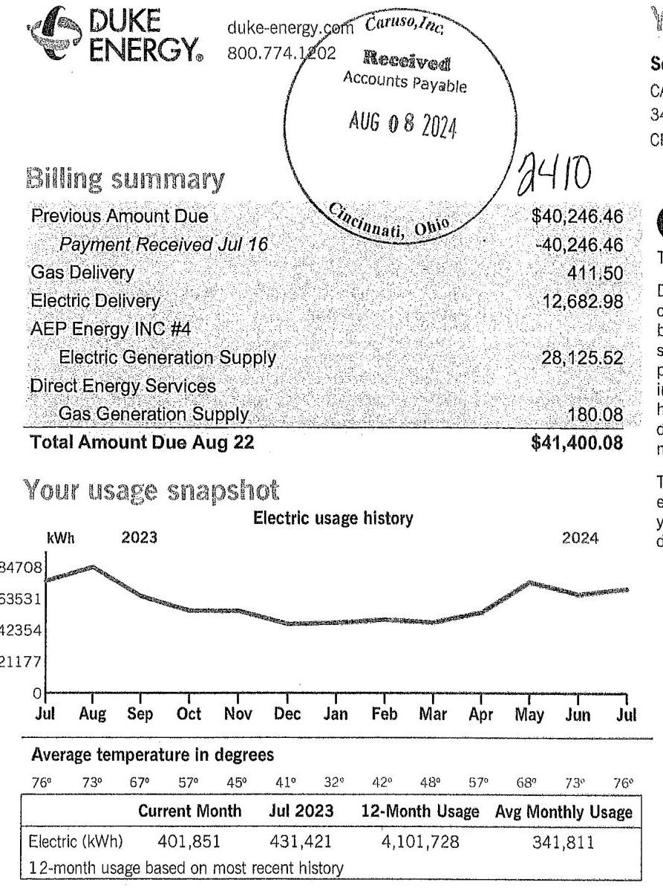
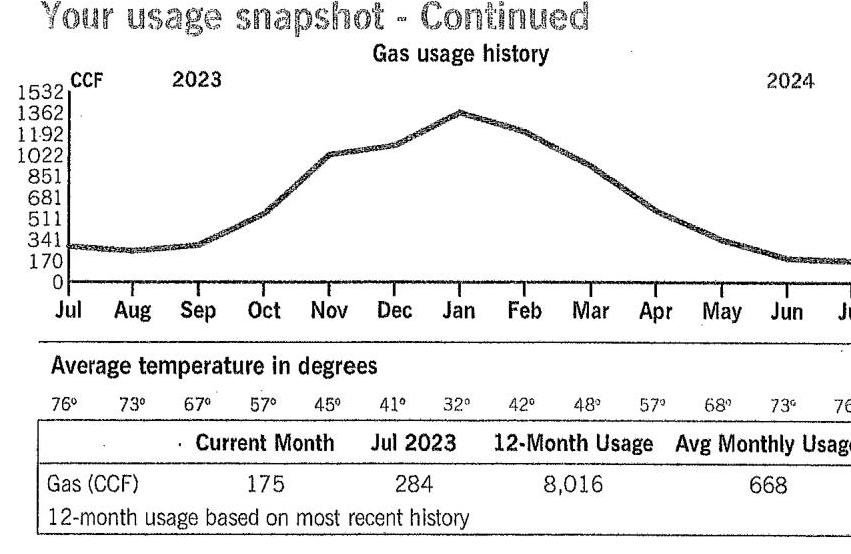

The image is a photo of an energy bill from Duke Energy. It includes a billing summary, a usage snapshot graph, and some additional information.

- **Billing Summary:**
  - Previous Amount Due: $40,246.46
  - Payment Received Jul 16: -$40,246.46
  - Gas Delivery: $411.50
  - Electric Delivery: $12,682.98
  - AEP Energy INC #4 Electric Generation Supply: $28,125.52
  - Direct Energy Services Gas Generation Supply: $180.08
  - Total Amount Due Aug 22: $41,400.08

- **Usage Snapshot:**
  - **Graph Type:** Line chart
  - **Title:** Electric usage history
  - **X-Axis:** Months from Jul 2023 to Jul 2024
  - **Y-Axis:** kWh (Kilowatt-hours) with values 0, 21177, 42354, 63531, 84708
  - **Yearly usage breakdown (monthly-based):** The graph shows a fluctuating pattern of electric usage over the months.
  - **Average temperature in degrees:** 76°, 73°, 67°, 57°, 45°, 41°, 32°, 42°, 48°, 57°, 68°, 73°, 76°

- **Electric Usage:**
  - Current Month Jul 2023: 401,851 kWh
  - 12-Month Usage: 4,101,728 kWh
  - Avg Monthly Usage: 341,811 kWh

- **Additional Information:**
  - Duke Energy contact: duke-energy.com, 800.774.1202
  - Received stamp: "Caruso, Inc. Received Accounts Payable AUG 08 2024 Cincinnati, Ohio"
  - "Your usage snapshot" is the title above the graph.

## Your Energy Bill

Service address
CARUSO/ HAUCK RD LLC
3465 HAUCK RD
31 days
CINCINNATI OH 45241

Account number 910117724619

## (5)

Thank you for your payment.
Duke Energy does not maintain customers' natural gas piping after or downstream of the meter. You should maintain such piping by periodically inspecting for leaks. If the piping is metal, you should also check for signs of corrosion. You should repair such piping if leaks or corrosion are discovered. For assistance locating, inspecting or repairing buried piping, please contact a licensed heating/plumbing contractor. You should always call 811 prior to digging. Once your lines are marked, always dig by hand if digging near natural gas piping.

To help us repair malfunctioning streetlights, quickly: 1. Visit duke-energy.com/lightrepair 2. Provide us with the light's location and your contact information. 3. Specific addresses, landmarks and directions work best.

Mail your payment at least 7 days before the due date or pay instantly at duke-energy.com/billing. Late payments are subject to a $1.5 \%$ late charge.

Please return this portion with your payment. Thank you for your business.

DUKE
ENERGYs
Duke Energy Return Mail
PO Box 1090
Charlotte, NC 28201-1090

022537 000008522
$\mathrm{H} / \mathrm{H} / \mathrm{H} / \mathrm{H} / \mathrm{H} / \mathrm{H} / \mathrm{H} / \mathrm{H} / \mathrm{H} / \mathrm{H} / \mathrm{H} / \mathrm{H} / \mathrm{H} / \mathrm{H} / \mathrm{H} / \mathrm{H} / \mathrm{H} / \mathrm{H} / \mathrm{H} / \mathrm{H} / \mathrm{H} / \mathrm{H} / \mathrm{H} / \mathrm{H} / \mathrm{H} / \mathrm{H} / \mathrm{H} / \mathrm{H} / \mathrm{H} / \mathrm{H} / \mathrm{H} / \mathrm{H} / \mathrm{H} / \mathrm{H} / \mathrm{H} / \mathrm{H} / \mathrm{H} / \mathrm{H} / \mathrm{H} / \mathrm{H} / \

# We're here for you 

## Report an emergency

Electric/Gas outage
Electric
Gas
duke-energy.com/outages 800.543.5599
800.634.4300

## Convenient ways to pay your bill

Online
Automatically from your bank account
Speedpay (fee applies)
By mail payable to Duke Energy
In person
duke-energy.com/billing
duke-energy.com/autodraft
duke-energy.com/pay-now
800.544 .6900

P.O. Box 1094

Charlotte, NC 28201-1094
duke-energy.com/location

Help managing your account (not applicable for all customers)
Register for free paperless billing
duke-energy.com/paperless Home
duke-energy.com/manage-home Business
duke-energy.com/manage-bus

## Correspond with Duke Energy (not for payment)

P.O. Box 1326

Charlotte, NC 28201

## General questions or concerns

Online
900.544 .6900

Home: Mon - Fri (7 a.m. to 7 p.m.)
800.774.1202

Business: Mon - Fri (7 a.m. to 6 p.m.) 711

For hearing impaired TDD/TTY
International
1.407.629.1010

## General utility information or commission assistance

Public Utilities Commission of Ohio (PUCO)
Call (8 a.m. to 5 p.m.) 800.686.7826
Online
puco.ohio.gov
For hearing impaired TDD/TTY 937.643.4600 or 711

## Ohio Consumers' Counsel (OCC)

Call (8:30 a.m. to 5:30 p.m.) 877.742.5622
Online
occ.ohio.gov

## Request the condensed or detailed bill format

Call (7a.m. to 7 p.m.)
800.544.6900

## Important to know

## Your next meter reading: Aug 27

Please be sure we can safely access your meter for actual readings. Don't worry if your digital meter flashes elghts from time to time. That's a normal part of the energy measuring process.

## Your service(s) may be disconnected if your payment is past due

If payment for your service(s) is past due, we may begin disconnection procedures. If your service is disconnected because of a missed payment, you must pay the amount specified in the Important Disconnect Information section on your bill, as well as, a reconnection fee, before your service will be reconnected. The reconnection fee is $\$ 10$ for electric service that may be reconnected remotely, $\$ 90$ for electric service that is not eligible to be reconnected remotely, and $\$ 70$ for gas service.

Failure to pay may result in a return to our standard offer for generation
Failure to pay charges for a competitive retail service may result in cancellation of your contract with the respective retail electric supplier. You will then be returned to Duke Energy Ohio's standard offer for generation services.

## When you pay by check

We may process the payment as a regular check or convert it into a one-time electronic check payment.
Customer Charge - The fixed monthly charge covers the cost of providing service to your location as well as maintaining customer records, billing and transactions affecting your account.
Delivery Charge - Charges for the operating expenses and delivering energy.
Generation Charge - Charges associated with the production of electricity.

## Questions or complaints

If you have a question or complaint about your bill or service, please contact us via one of the contact options provided.
If your complaint is not resolved after contacting Duke Energy or if you need general utility information, please contact the Public Utilities Commission of Ohio (PUCO) or the Ohio Consumers' Counsel (OCC) via one of the contact options provided.

## Choice Service ID

Once you have chosen a Certified Supplier to provide your energy supply, share this information with them so they can sign you up.

## Para nuestros clientes que hablan Español

Representantes bilingües están disponibles para asistirle de lunes a ylernes de 7 a.m. - 7 p.m. Para obtener más información o reportar problemas con su servicio eléctrico, favor de llamar al 800.544.6900.

The image is a line chart titled "Gas usage history" with the y-axis labeled "CCF" ranging from 0 to 1532. The x-axis represents months from July to June, covering the years 2023 to 2024. The chart shows a peak in gas usage around January and February, with lower usage in the summer months.

Below the chart, there is a table titled "Average temperature in degrees" with temperatures listed for each month: July (76°), August (73°), September (67°), October (57°), November (45°), December (41°), January (32°), February (42°), March (48°), April (57°), May (68°), June (73°), and July (76°).

Another table shows:
- Current Month: Jul 2023
- Gas (CCF): 175
- 12-Month Usage: 8,016
- Avg Monthly Usage: 668

The chart provides a **yearly usage breakdown (monthly-based)** for gas consumption.

|  | Choice Service ID   910117724619Z110046863 |
| :--: | :--: |
| Current Gas usage for meter number 344742 |  |
| Actual reading on Jul 26 | 971922 |
| Previous reading on Jun 26 | - 971747 |
| Gas Used | 175 CCF |
| Billed CCF | 175.000 CCF |

|  | Choice Service ID   910117724619Z109593271 |  |
| :--: | :--: | :--: |
| Current Electric Usage |  |  |
| Meter Number | Usage Type | Billing Period |
| 326438283 | Actual | Jun 26 - Jul 26 |
| Usage Values |  |  |
| Measured kWh |  | 401,850.600 kWh |
| Billed kWh |  | 401,850.600 kWh |
| Billed On Peak kWh |  | 125,335.680 kWh |
| Billed Off Peak kWh |  | 276,514.920 kWh |
| Actual kVA |  | 952.135 kVA |
| Actual Demand-kW |  | 820.320 kW |
| Billed Demand-kW |  | 856.922 kW |
| Billed Demand-kW On Peak |  | 820.320 kW |
| Billed Demand-kVA |  | 952.135 kVA |
| Power Factor |  | 86.160 \% |

# Billing details - Gas 

| Billing Period - Jun 2624 to Jul 2624 |  |
| :-- | --: |
| Meter - 344742 |  |
| Duke Energy Delivery |  |
| Service Delivery |  |
| Fixed Delivery Service Charge | $\$ 338.82$ |

Your current rate is Firm Transportation Service - Large (FT-L).

Your current generation rate with Direct Energy Services is VN58. Your Direct Energy Services account number is 11194151 . If you have any questions about your gas supplier's service or charges, contact Direct Energy Services at 888.566.998B or write to them at

# Billing details - Gas continued 

| Usage-Based Charge |  |
| :--: | :--: |
| 175.000 CCF @ \$0.13062200 | \$22.86 |
| Gas Delivery Riders | 50.27 |
| Applicable Surcharge |  |
| 175.000 CCF @ \$-0.00257143 | $-0.45$ |
| Total Delivery Charges | $\$ 411.50$ |
| Direct Energy Services |  |
| Gas Supplier Energy Charge |  |
| 175.000 CCF @ \$1.02900000 | 180.08 |
| Total Current Charges | $\$ 591.58$ |

## PO BOX 180, TULSA OK 74101.

Price to compare: If you're considering using a different natural gas supplier, their rate would have to be lower than $\$ 0.68420000$ per CCF for you to save money. Visit energychoice.ohio.gov to compare rates of all natural gas suppliers or contact Duke Energy for a written explanation.
This month's Gas Cost Recovery (GCR) charge for customers purchasing their natural gas from Duke Energy is $\$ 0.6773796$ per CCF, which includes a base GCR of $\$ 0.6458000$ and Ohio excise tax of $\$ 0.0315796$.

When shopping for a natural gas supplier, it may be useful to compare supplier offers with the standard service offer (SSO) rate available to eligible customers, which varies monthly based on the market price of natural gas. Price represents one feature of any offer; there may be other features which you consider of value. More information about SSO and other suppliers' offers is available at energychoice.ohio.gov or by contacting the PUCO.

Riders are costs the Public Utilities Commission of Ohio has approved to cover investments in improving the energy infrastructure or other additional expenses.

## Billing details - Electric

| Billing Period - Jun 2624 to Jul 2624 |  |
| :-- | --: |
| Meter - 326438283 |  |
| Duke Energy Delivery |  |
| Service Delivery |  |
| $\quad$ Distribution-Customer Charge | $\$ 46.00$ |
| $\quad$ Distribution-Demand Charge |  |
| $\quad 856.922 \mathrm{~kW} @ \$ 6.96780000$ | 5,970.86 |
| $\quad$ Delivery Riders | 6,664.59 |
| Generation Riders | 1.53 |
| Total Current Charges | $\mathbf{\$ 1 2 , 6 8 2 . 9 8}$ |

Your current rate is Service at Secondary Distribution Voltage (DS).
For a complete listing of all Ohio rates and riders, visit duke-energy.com/rates

Energy generation charges were calculated by your electric supplier.

If you have any questions about your electric supplier's service or charges, contact AEP Energy INC \#4 at 866.258.3782 or write to them at P.O. BOX 340, ZELIENOPLE PA 16063-2300.

To obtain a comparison of available competitive electric supplier offers, visit the Ohio Electric Choice website at energychoice.ohio.gov.

Riders are costs the Public Utilities Commission of Ohio has approved to cover investments in improving the energy infrastructure or other additional expenses.

## Billing details - Electric Supplier

## AEP

## iHINer

## AEP Energy INC \#4

## Jun 2624 - Jul 2624

TOTAL SUPPLIER CHARGES 401,850 KWH X \$0.06999 \$28,125.52
Total Electric Supplier
$\$ 28,125.52$

Your Electric Supplier Charges of $\$ 28125.52$ were calculated by your Electric Supplier.

