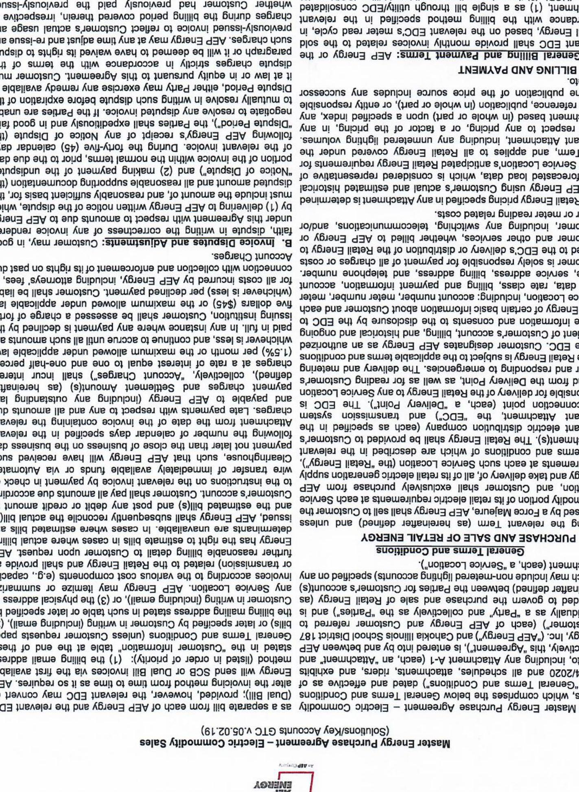
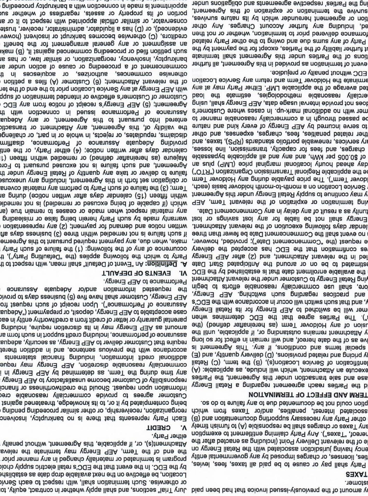
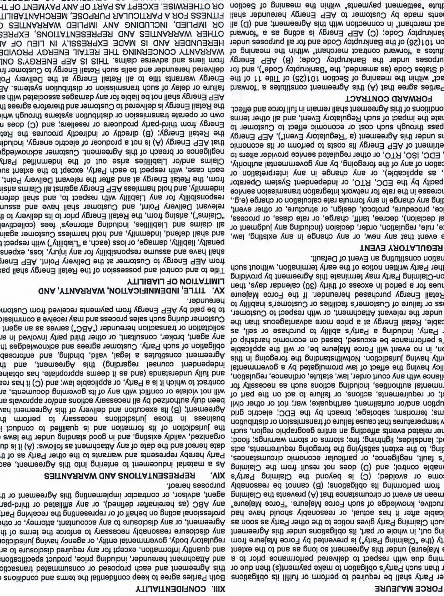
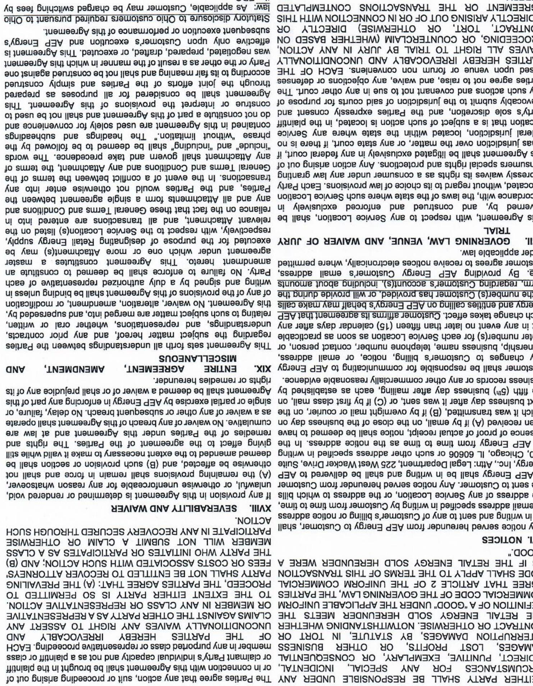
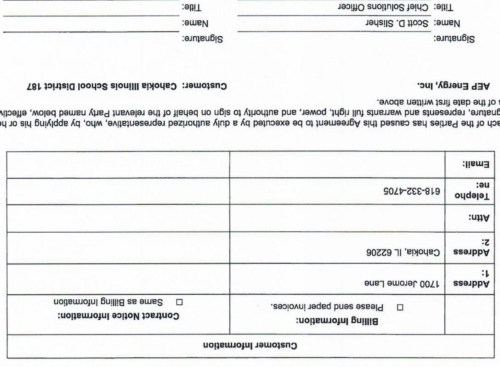
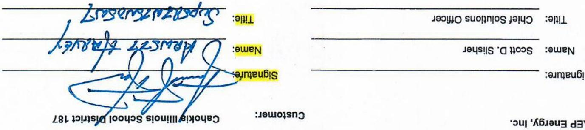
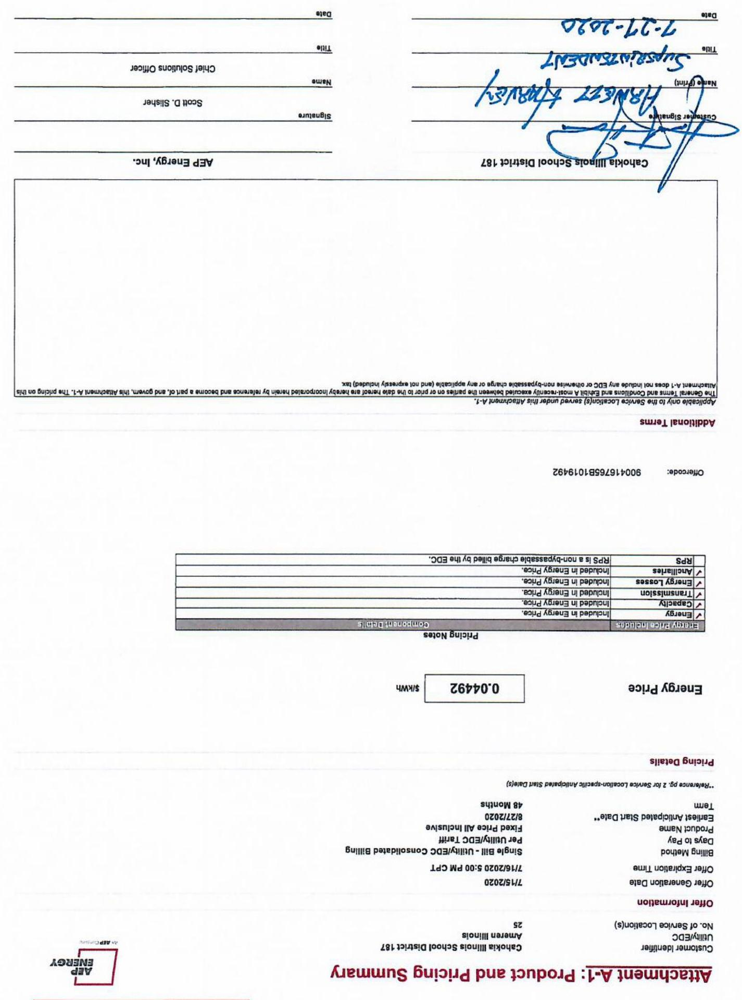
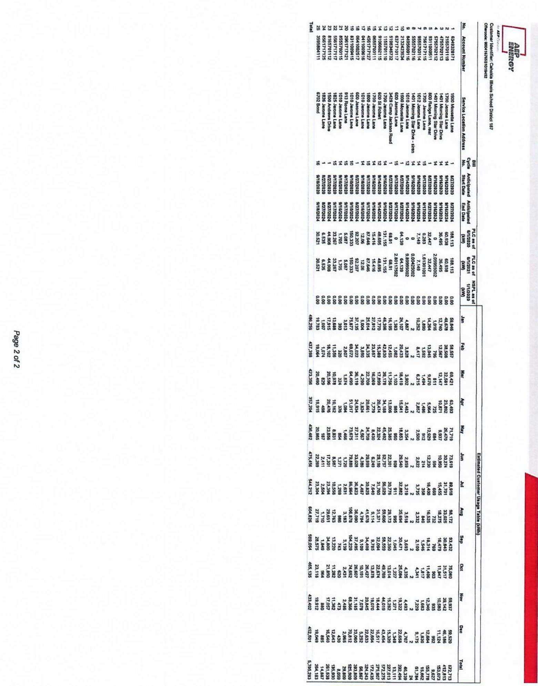

The image is a photo of a document containing text. The text is oriented upside down and appears to be part of a legal or contractual document related to energy services. It includes sections titled "GENERAL TERMS AND CONDITIONS," "BILLING AND PAYMENT," and "PURCHASE AND SALE OF RETAIL ENERGY." The document mentions terms like "energy supply," "billing," "payment," and "customer." There is a logo at the bottom, but the specific details of the logo are not clear due to the orientation and quality of the image.

The image is a photo of a document with text. The text appears to be a legal or contractual document, formatted in paragraphs with sections labeled by Roman numerals and letters. The text is oriented sideways, making it necessary to rotate the image to read comfortably. The document includes terms related to agreements, obligations, and conditions, possibly concerning energy or property, as indicated by phrases like "AP Energy" and "property." The sections are detailed and structured, suggesting a formal and official context.

|  **VII. SERVICE LOCATION CLOSEURS** | |   |
| --- | --- | --- |
|  **reasonable compensation for a Party’s damages** | |   |
|  *remedy,* and is not a penalty or punitive in any respect for any respect in the right of the anticipated or actual harm caused by the affected or successor is contractually obligated to continue to supply an additional damage that a Party will suffer or incur in such a case by estimating damages that a Party will suffer or incur in such a case by estimating damages that a Party will suffer or incur in such a case by estimating damages that a Party will suffer or incur in such a case. The right of the anticipated or actual harm caused by the affected or successor is contractually associated to the other party’s performance. The other parties acknowledge the same amount of the Service Location of the Party (e.g., the other members of the State of the State of the State of the State of the State of the State of the State of the State of the State of the State of the State of the State of the State of the State of the State of the State of the State of the State of the State of the State of the State of the State of the State of the State of the State of the State of the State of the State of the State of the State of the State of the State of the State of the State of the State of the State of the State of the State of the State of the State of the State of the State of the State of the State of the State of the State of the State of the State of the State of the State of the State of the State of the State of the State of the State of the State of the State of the State of the State of the State of the State of the State of the State of the State of the State of the State of the State

The image is a photo of a document containing text. The text is oriented upside down and appears to be part of a legal or contractual document. It includes sections labeled "XIV. REPRESENTATIONS AND WARRANTIES," "XV. LIMITATION OF LIABILITY," and "XVI. INDEMNIFICATION." The content discusses terms related to warranties, liabilities, indemnification, and other contractual obligations. The text is densely packed and formatted in a typical legal document style, with numbered sections and clauses.

The image is a photo of a document with text. The text is upside down and appears to be legal or contractual in nature, containing sections and clauses. Some visible headings include "WAIVER OF JURY TRIAL," "AGREEMENT, AMENDMENT, AND MISCELLANEOUS," and "NOTICES." The document discusses various legal terms, responsibilities, and obligations, likely related to a service or transaction agreement. The text is densely packed and formatted in paragraphs with bold section titles.

The image is a photo of a document, specifically a form. It includes the following text:

- "Customer: Cahokia Illinois School District 187"
- "AEP Energy, Inc."
- "Signature: Scott D. Silvestri"
- "Title: Chief Solutions Officer"
- "Name:"
- "Title:"
- "Billing Information:"
- "Please send paper invoices."
- "Contract Notice Information:"
- "Same as Billing Information"
- "Customer Information"
- "Address 1: 1700 Jerome Lane"
- "Address 2: Cahokia, IL 62206"
- "Attn:"
- "Telephone no: 618-332-4706"
- "Email:"

The document appears to be a form related to customer information, billing, and contract notice details. The text is oriented upside down in the image.

Attachment A-1, including any unmetered lighting volumes.
Attachment A-1, including any unmetered lighting volumes.
Attachment A-1, including any unmetered lighting volumes.
Attachment A-1, including any unmetered lighting volumes.
Attachment A-1, including any unmetered lighting volumes.
The following terms are applicable to certain products (as a result of a delay or the relevance of the Serrate to the Serrate), the following
the below. The Serrate is a applied to the Serrate, the Serrate is a applied to the Serrate, the RPS and the RPS. The RPS and the RPS are the same as the Serrate, and the Serrate is the same as the Serrate. The Serrate is the same as the Serrate, and the Serrate is the same as the Serrate. The Serrate is the same as the Serrate, and the Serrate is the same as the Serrate. The Serrate is the same as the Serrate, and the Serrate is the same as the Serrate. The Serrate is the same as the Serrate, and the Serrate is the same as the Serrate. The Serrate is the same as the Serrate, and the Serrate is the same as the Serrate. The Serrate is the same as the Serrate, and the Serrate is the same as the Serrate. The Serrate is the same as the Serrate, and the Serrate is the same as the Serrate. The Serrate is the same as the Serrate, and the Serrate is the same as the Serrate. The Serrate is the same as the Serrate, and the Serrate is the same as the Serrate. The Serrate is the same as the Serrate, and the Serrate is the same as the Serrate. The Serrate is the same as the Serrate, and the Serrate is the same as the Serrate. The Serrate is the same as the Serrate, and the Serrate is the same as the Serrate. The Serrate is the same as the Serrate, and the Serrate is the same as the Serrate. The Serrate is the same as the Serrate, and the Serrate is the same as the Serrate. The Serrate is the same as the Serrate, and the Serrate is the same as the Serrate. The Serrate is the same as the Serrate, and the Serrate is the same as the Serrate. The Serrate is the same as the Serrate, and the Serrate is the same as the Serrate. The Serrate is the same as the Serrate, and the Serrate is the same as the Serrate. The Serrate is the same as the Serrate, and the Serrate is the same as the Serrate. The Serrate is the same as the Serrate, and the Serrate is the same as the Serrate. The Serrate is the same as the Serrate, and the Serrate is the same as the Serrate. The Serrate is the same as the Serrate, and the Serrate is the same as the Serrate. The Serrate is the same as the Serrate, and the Serrate is the same as the Serrate, and the Serrate is the same as the Serrate. The Serrate is the same as the Serrate, and the Serrate is the same as the Serrate, and the Serrate is the same as the Serrate. The Serrate is the same as the Serrate, and the Serrate is the same as the Serrate, and the Serrate is the same as the Serrate. The Serrate is the same as the Serrate, and the Serrate is the same as the Serrate, and the Serrate is the same as the Serrate, and the Serrate is the same as the Serrate. The Serrate is the same as the Serrate, and the Serrate is the same as the Serrate, and the Serrate is the same as the Serrate, and the Serrate is the same as the Serrate. The Serrate is the same as the Serrate, and the Serrate is the same as the Serrate, and the Serrate is the same as the Serrate, and the Serrate is the same as the Serrate, and the Serrate is the same as the Serrate. The Serrate is the same as the Serrate, and the Serrate is the same as the Serrate, and the Serrate is the same as the Serrate, and the Serrate is the same as the Serrate, and the Serrate is the same as the Serrate, and the Serrate is the same as the Serrate, and the Serrate is the same as the Serrate, and the Serrate is the same as the Serrate, and the Serrate is the same as the Serrate, and the Serrate is the same as the Serrate, and the Serrate is the same as the Serrate, and the Serrate is the same as the Serrate, and the Serrate is the same as the Serrate, and the Serrate is the same as the Serrate, and the Serrate is the same as the Serrate, and the Serrate is the same as the Serrate, and the Serrate is the same as the Serrate, and the Serrate is the same as the Serrate, and the Serrate is the same as the Serrate, and the Serrate is the same as the Serrate, and the Serrate is the same as the Serrate, and the Serrate is the same as the Serrate, and the Serrate is the same as the Serrate, and the Serrate is the same as the Serrate, and the Serrate is the same as the Serrate, and the Serrate is the same as the Serrate, and the Serrate is the same as the Serrate, and the Serrate is the same as the Serrate, and the Serrate is the same as the Serrate, and the Serrate is the same as the Serrate, and the Serrate is the same as the Serrate, and the Serrate is the same as the Serrate, and the Serrate is the same as the Serrate, and the Serrate is the same as the Serrate, and the Serrate is the same as the Serrate, and the Serrate is the same as the Serrate, and the Serrate is the same as the Serrate, and the Serrate is the same as the Serrate, and the Serrate is the same as the Serrate, and the Serrate is the same as the Serrate, and the Serrate is the same as the Serrate, and the Serrate is the same as the Serrate, and the Serrate is the same as the Serrate, and the Serrate is the same as the Serrate, and the Serrate is the same as the Serrate, and the Serrate is the same as the Serrate, and the Serrate is the same as the Serrate, and the Serrate is the same as the Serrate, and the Serrate is the same as the Serrate, and the Serrate is the same as the Serrate, and the Serrate is the same as the Serrate, and the Serrate is the same as the Serrate, and the Serrate is the same as the Serrate, and the Serrate is the same as the Serrate, and the Serrate is the same as the Serrate, and the Serrate is the same as the Serrate, and the Serrate is the same as the Serrate, and the Serrate is the same as the Serrate, and the Serrate is the same as the Serrate, and the Serrate is the same as the Serrate, and the Serrate is the same as the Serrate, and the Serrate is the same as the Serrate, and the Serrate is the same as the Serrate, and the Serrate is the same as the Serrate, and the Serrate is the same as the Serrate, and the Serrate is the same as the Serrate, and the Serrate is the same as the Serrate, and the Serrate is the same as the Serrate, and the Serrate is the same as the Serrate, and the Serrate is the same as the Serrate, and the Serrate is the same as the Serrate, and the Serrate is the same as the Serrate, and the Serrate is the same as the Serrate, and the Serrate is the same as the Serrate, and the Serrate is the same as the Serrate, and the Serrate is the same as the Serrate, and the Serrate is the same as the Serrate, and the Serrate is the same as the Serrate, and the Serrate is the same as the Serrate, and the Serrate is the same as the Serrate, and the Serrate is the same as the Serrate, and the Serrate is the same as the Serrate, and the Serrate is the same as the Serrate, and the Serrate is the same as the Serrate, and the Serrate is the same as the Serrate, and the Serrate is the same as the Serrate, and the Serrate is the same as the Serrate, and the Serrate is the same as the Serrate, and the Serrate is the same as the Serrate, and the Serrate is the same as the Serrate, and the Serrate is the same as the Serrate, and the Serrate is the same as the Serrate, and the Serrate is the same as the Serrate, and the Serrate is the same as the Serrate, and the Serrate is the same as the Serrate, and the Serrate is the same as the Serrate, and the Serrate is the same as the Serrate, and the Serrate is the same as the Serrate, and the Serrate is the same as the Serrate, and the Serrate is the same as the Serrate, and the Serrate is the same as the Serrate, and the Serrate is the same as the Serrate, and the Serrate is the same as the Serrate, and the Serrate is the same as the Serrate, and the Serrate is the same as the Serrate, and the Serrate is the same as the Serrate, and the Serrate is the same as the Serrate, and the Serrate is the same as the Serrate, and the Serrate is the same as the Serrate, and the Serrate is the same as the Serrate, and the Serrate is the same as the Serrate, and the Serrate is the same as the Serrate, and the Serrate is the same as the Serrate, and the Serrate is the same as the Serrate, and the Serrate is the same as the Serrate, and the Serrate is the same as the Serrate, and the Serrate is the same as the Serrate, and the Serrate is the same as the Serrate, and the Serrate is the same as the Serrate, and the Serrate is the same as the Serrate, and the Serrate is the same as the Serrate, and the Serrate is the same as the Serrate, and the Serrate is the same as the Serrate, and the Serrate is the same as the Serrate, and the Serrate is the same as the Serrate, and the Serrate is the same as the Serrate, and the Serrate is the same as the Serrate, and the Serrate is the same as the Serrate, and the Serrate is the same as the Serrate, and the Serrate is the same as the Serrate, and the Serrate is the same as the Serrate, and the Serrate is the same as the Serrate, and the Serrate is the same as the Serrate, and the Serrate is the same as the Serrate, and the Serrate is the same as the Serrate, and the Serrate is the same as the Serrate, and the Serrate is the same as the Serrate, and the Serrate is the same as the Serrate, and the Serrate is the same as the Serrate, and the Serrate is the same as the Serrate, and the Serrate is the same as the Serrate, and the Serrate is the same as the Serrate, and the Serrate is the same as the Serrate, and the Serrate is the same as the Serrate, and the Serrate is the same as the Serrate, and the Serrate is the same as the Serrate, and the Serrate is the same as the Serrate, and the Serrate is the same as the Serrate, and the Serrate is the same as the Serrate, and the Serrate is the same as the Serrate, and the Serrate is the same as the Serrate, and the Serrate is the same as the Serrate, and the Serrate is the same as the Serrate, and the Serrate is the same as the Serrate, and the Serrate is the same as the Serrate, and the Serrate is the same as the Serrate, and the Serrate is the same as the Serrate, and the Serrate is the same as the Serrate, and the Serrate is the same as the Serrate, and the Serrate is the same as the Serrate, and the Serrate is the same as the Serrate, and the Serrate is the same as the Serrate, and the Serrate is the same as the Serrate, and the Serrate is the same as the Serrate, and the Serrate is the same as the Serrate, and the Serrate is the same as the Serrate, and the Serrate is the same as the Serrate, and the Serrate is the same as the Serrate, and the Serrate is the same as the Serrate, and the Serrate is the same as the Serrate, and the Serrate is the same as the Serrate, and the Serrate is the same as the Serrate, and the Serrate is the same as the Serrate, and the Serrate is the same as the Serrate, and the Serrate is the same as the Serrate, and the Serrate is the same as the Serrate, and the Serrate is the same as the Serrate, and the Serrate is the same as the Serrate, and the Serrate is the same as the Serrate, and the Serrate is the same as the Serrate, and the Serrate is the same as the Serrate, and the Serrate is the same as the Serrate, and the Serrate is the same as the Serrate, and the Serrate is the same as the Serrate, and the Serrate is the same as the Serrate, and the Serrate is the same as the Serrate, and the Serrate is the same as the Serrate, and the Serrate is the same as the Serrate, and the Serrate is the same as the Serrate, and the Serrate is the same as the Serrate, and the Serrate is the same as the Serrate, and the Serrate is the same as the Serrate, and the Serrate is the same as the Serrate, and the Serrate is the same as the Serrate, and the Serrate is the same as the Serrate, and the Serrate is the same as the Serrate, and the Serrate is the same as the Serrate, and the Serrate is the same as the Serrate, and the Serrate is the same as the Serrate, and the Serrate is the same as the Serrate, and the Serrate is the same as the Serrate, and the Serrate is the same as the Serrate, and the Serrate is the same as the Serrate, and the Serrate is the same as the Serrate, and the Serrate is the same as the Serrate, and the Serrate is the same as the Serrate, and the Serrate is the same as the Serrate, and the Serrate is the same as the Serrate, and the Serrate is the same as the Serrate, and the Serrate is the same as the Serrate, and the Serrate is the same as the Serrate, and the Serrate is the same as the Serrate, and the Serrate is the same as the Serrate, and the Serrate is the same as the Serrate, and the Serrate is the same as the Serrate, and the Serrate is the same as the Serrate, and the Serrate is the same as the Serrate, and the Serrate is the same as the Serrate, and the Serrate is the same as the Serrate, and the Serrate is the same as the Serrate, and the Serrate is the same as the Serrate, and the Serrate is the same as the Serrate, and the Serrate is the same as the Serrate, and the Serrate is the same as the Serrate, and the Serrate is the same as the Serrate, and the Serrate is the same as the Serrate, and the Serrate is the same as the Serrate, and the Serrate is the same as the Serrate, and the Serrate is the same as the Serrate, and the Serrate is the same as the Serrate, and the Serrate is the same as the Serrate, and the Serrate is the same as the Serrate, and the Serrate is the same as the Serrate, and the Serrate is the same as the Serrate, and the Serrate is the same as the Serrate, and the Serrate is the same as the Serrate, and the Serrate is the same as the Serrate, and the Serrate is the same as the Serrate, and the Serrate is the same as the Serrate, and the Serrate is the same as the Serrate, and the Serrate is the same as the Serrate, and the Serrate is the same as the Serrate, and the Serrate is the same as the Serrate, and the Serrate is the same as the Serrate, and the Serrate is the same as the Serrate, and the Serrate is the same as the Serrate, and the Serrate is the same as the Serrate, and the Serrate is the same as the Serrate, and the Serrate is the same as the Serrate, and the Serrate is the same as the Serrate, and the Serrate is the same as the Serrate, and the Serrate is the same as the Serrate, and the Serrate is the same as the Serrate, and the Serrate is the same as the Serrate, and the Serrate is the same as the Serrate, and the Serrate is the same as the Serrate, and the Serrate is the same as the Serrate, and the Serrate is the same as the Serrate, and the Serrate is the same as the Serrate, and the Serrate is the same as the Serrate, and the Serrate is the same as the Serrate, and the Serrate is the same as the Serrate, and the Serrate is the same as the Serrate, and the Serrate is the same as the Serrate, and the Serrate is the same as the Serrate, and the Serrate is the same as the Serrate, and the Serrate is the same as the Serrate, and the Serrate is the same as the Serrate, and the Serrate is the same as the Serrate, and the Serrate is the same as the Serrate, and the Serrate is the same as the Serrate, and the Serrate is the same as the Serrate, and the Serrate is the same as the Serrate, and the Serrate is the same as the Serrate, and the Serrate is the same as the Serrate, and the Serrate is the same as the Serrate, and the Serrate is the same as the Serrate, and the Serrate is the same as the Serrate, and the Serrate is the same as the Serrate, and the Serrate is the same as the Serrate, and the Serrate is the same as the Serrate, and the Serrate is the same as the Serrate, and the Serrate is the same as the Serrate, and the Serrate is the same as the Serrate, and the Serrate is the same as the Serrate, and the Serrate is the same as the Serrate, and the Serrate is the same as the Serrate, and the Serrate is the same as the Serrate, and the Serrate is the same as the Serrate, and the Serrate is the same as the Serrate, and the Serrate is the same as the Serrate, and the Serrate is the same as the Serrate, and the Serrate is the same as the Serrate, and the Serrate is the same as the Serrate, and the Serrate is the same as the Serrate, and the Serrate is the same as the Serrate, and the Serrate is the same as the Serrate, and the Serrate is the same as the Serrate, and the Serrate is the same as the Serrate, and the Serrate is the same as the Serrate, and the Serrate is the same as the Serrate, and the Serrate is the same as the Serrate, and the Serrate is the same as the Serrate, and the Serrate is the same as the Serrate, and the Serrate is the same as the Serrate, and the Serrate is the same as the Serrate, and the Serrate is the same as the Serrate, and the Serrate is the same as the Serrate, and the Serrate is the same as the Serrate, and the Serrate is the same as the Serrate, and the Serrate is the same as the Serrate, and the Serrate is the same as the Serrate, and the Serrate is the same as the Serrate, and the Serrate is the same as the Serrate, and the Serrate is the same as the Serrate, and the Serrate is the same as the Serrate, and the Serrate is the same as the Serrate, and the Serrate is the same as the Serrate, and the Serrate is the same as the Serrate, and the Serrate is the same as the Serrate, and the Serrate is the same as the Serrate, and the Serrate is the same as the Serrate, and the Serrate is the same as the Serrate, and the Serrate is the same as the Serrate, and the Serrate is the same as the Serrate, and the Serrate is the same as the Serrate, and the Serrate is the same as the Serrate, and the Serrate is the same as the Serrate, and the Serrate is the same as the Serrate, and the Serrate is the same as the Serrate, and the Serrate is the same as the Serrate, and the Serrate is the same as the Serrate, and the Serrate is the same as the Serrate, and the Serrate is the same as the Serrate, and the Serrate is the same as the Serrate, and the Serrate is the same as the Serrate, and the Serrate is the same as the Serrate, and the Serrate is the same as the Serrate, and the Serrate is the same as the Serrate, and the Serrate is the same as the Serrate, and the Serrate is the same as the Serrate, and the Serrate is the same as the Serrate, and the Serrate is the same as the Serrate, and the Serrate is the same as the Serrate, and the Serrate is the same as the Serrate, and the Serrate is the same as the Serrate, and the Serrate is the same as the Serrate, and the Serrate is the same as the Serrate, and the Serrate is the same as the Serrate, and the Serrate is the same as the Serrate, and the Serrate is the same as the Serrate, and the Serrate is the same as the Serrate, and the Serrate is the same as the Serrate, and the Serrate is the same as the Serrate, and the Serrate is the same as the Serrate, and the Serrate is the same as the Serrate, and the Serrate is the same as the Serrate, and the Serrate is the same as the Serrate, and the Serrate is the same as the Serrate, and the Serrate is the same as the Serrate, and the Serrate is the same as the Serrate, and the Serrate is the same as the Serrate, and the Serrate is the same as the Serrate, and the Serrate is the same as the Serrate, and the Serrate is the same as the Serrate, and the Serrate is the same as the Serrate, and the Serrate is the same as the Serrate, and the Serrate is the same as the Serrate, and the Serrate is the same as the Serrate, and the Serrate is the same as the Serrate, and the Serrate is the same as the Serrate, and the Serrate is the same as the Serrate, and the Serrate is the same as the Serrate, and the Serrate is the same as the Serrate, and the Serrate is the same as the Serrate, and the Serrate is the same as the Serrate, and the Serrate is the same as the Serrate, and the Serrate is the same as the Serrate, and the Serrate is the same as the Serrate, and the Serrate is the same as the Serrate, and the Serrate is the same as the Serrate, and the Serrate is the same as the Serrate, and the Serrate is the same as the Serrate, and the Serrate is the same as the Serrate, and the Serrate is the same as the Serrate, and the Serrate is the same as the Serrate, and the Serrate is the same as the Serrate, and the Serrate is the same as the Serrate, and the Serrate is the same as the Serrate, and the Serrate is the same as the Serrate, and the Serrate is the same as the Serrate, and the Serrate is the same as the Serrate, and the Serrate is the same as the Serrate, and the Serrate is the same as the Serrate, and the Serrate is the same as the Serrate, and the Serrate is the same as the Serrate, and the Serrate is the same as the Serrate, and the Serrate is the same as the Serrate, and the Serrate is the same as the Serrate, and the Serrate is the same as the Serrate, and the Serrate is the same as the Serrate, and the Serrate is the same as the Serrate, and the Serrate is the same as the Serrate, and the Serrate is the same as the Serrate, and the Serrate is the same as the Serrate, and the Serrate is the same as the Serrate, and the Serrate is the same as the Serrate, and the Serrate is the same as the Serrate, and the Serrate is the same as the Serrate, and the Serrate is the same as the Serrate, and the Serrate is the same as the Serrate, and the Serrate is the same as the Serrate, and the Serrate is the same as the Serrate, and the Serrate is the same as the Serrate, and the Serrate is the same as the Serrate, and the Serrate is the same as the Serrate, and the Serrate is the same as the Serrate, and the Serrate is the same as the Serrate, and the Serrate is the same as the Serrate, and the Serrate is the same as the Serrate, and the Serrate is the same as the Serrate, and the Serrate is the same as the Serrate, and the Serrate is the same as the Serrate, and the Serrate is the same as the Serrate, and the Serrate is the same as the Serrate, and the Serrate is the same as the Serrate, and the Serrate is the same as the Serrate, and the Serrate is the same as the Serrate, and the Serrate is the same as the Serrate, and the Serrate is the same as the Serrate, and the Serrate is the same as the Serrate, and the Serrate is the same as the Serrate, and the Serrate is the same as the Serrate, and the Serrate is the same as the Serrate, and the Serrate is the same as the Serrate, and the Serrate is the same as the Serrate, and the Serrate is the same as the Serrate, and the Serrate is the same as the Serrate, and the Serrate is the same as the Serrate, and the Serrate is the same as the Serrate, and the Serrate is the same as the Serrate, and the Serrate is the same as the Serrate, and the Serrate is the same as the Serrate, and the Serrate is the same as the Serrate, and the Serrate is the same as the Serrate, and the Serrate is the same as the Serrate, and the Serrate is the same as the Serrate, and the Serrate is the same as the Serrate, and the Serrate is the same as the Serrate, and the Serrate is the same as the Serrate, and the Serrate is the same as the Serrate, and the Serrate is the same as the Serrate, and the Serrate is the same as the Serrate, and the Serrate is the same as the Serrate, and the Serrate is the same as the Serrate, and the Serrate is the same as the Serrate, and the Serrate is the same as the Serrate, and the Serrate is the same as the Serrate, and the Serrate is the same as the Serrate, and the Serrate is the same as the Serrate, and the Serrate is the same as the Serrate, and the Serrate is the same as the Serrate, and the Serrate is the same as the Serrate, and the Serrate is the same as the Serrate, and the Serrate is the same as the Serrate, and the Serrate is the same as the Serrate, and the Serrate is the same as the Serrate, and the Serrate is the same as the Serrate, and the Serrate is the same as the Serrate, and the Serrate is the same as the Serrate, and the Serrate is the same as the Serrate, and the Serrate is the same as the Serrate, and the Serrate is the same as the Serrate, and the Serrate is the same as the Serrate, and the Serrate is the same as the Serrate, and the Serrate is the same as the Serrate, and the Serrate is the same as the Serrate, and the Serrate is the same as the Serrate, and the Serrate is the same as the Serrate, and the Serrate is the same as the Serrate, and the Serrate is the same as the Serrate, and the Serrate is the same as the Serrate, and the Serrate is the same as the Serrate, and the Serrate is the same as the Serrate, and the Serrate is the same as the Serrate, and the Serrate is the same as the Serrate, and the Serrate is the same as the Serrate, and the Serrate is the same as the Serrate, and the Serrate is the same as the Serrate, and the Serrate is the same as the Serrate, and the Serrate is the same as the Serrate, and the Serrate is the same as the Serrate, and the Serrate is the same as the Serrate, and the Serrate is the same as the Serrate, and the Serrate is the same as the Serrate, and the Serrate is the same as the Serrate, and the Serrate is the same as the Serrate, and the Serrate is the same as the Serrate, and the Serrate is the same as the Serrate, and the Serrate is the same as the Serrate, and the Serrate is the same as the Serrate, and the Serrate is the same as the Serrate, and the Serrate is the same as the Serrate, and the Serrate is the same as the Serrate, and the Serrate is the same as the Serrate, and the Serrate is the same as the Serrate, and the Serrate is the same as the Serrate, and the Serrate is the same as the Serrate, and the Serrate is the same as the Serrate, and the Serrate is the same as the Serrate, and the Serrate is the same as the Serrate, and the Serrate is the same as the Serrate, and the Serrate is the same as the Serrate, and the Serrate is the same as the Serrate, and the Serrate is the same as the Serrate, and the Serrate is the same as the Serrate, and the Serrate is the same as the Serrate, and the Serrate is the same as the Serrate, and the Serrate is the same as the Serrate, and the Serrate is the same as the Serrate, and the Serrate is the same as the Serrate, and the Serrate is the same as the Serrate, and the Serrate is the same as the Serrate, and the Serrate is the same as the Serrate, and the Serrate is the same as the Serrate, and the Serrate is the same as the Serrate, and the Serrate is the same as the Serrate, and the Serrate is the same as the Serrate, and the Serrate is the same as the Serrate, and the Serrate is the same as the Serrate, and the Serrate is the same as the Serrate, and the Serrate is the same as the Serrate, and the Serrate is the same as the Serrate, and the Serrate is the same as the Serrate, and the Serrate is the same as the Serrate, and the Serrate is the same as the Serrate, and the Serrate is the same as the Serrate, and the Serrate is the same as the Serrate, and the Serrate is the same as the Serrate, and the Serrate is the same as the Serrate, and the Serrate is the same as the Serrate, and the Serrate is the same as the Serrate, and the Serrate is the same as the Serrate, and the Serrate is the same as the Serrate, and the Serrate is the same as the Serrate, and the Serrate is the same as the Serrate, and the Serrate is the same as the Serrate, and the Serrate is the same as the Serrate, and the Serrate is the same as the Serrate, and the Serrate is the same as the Serrate, and the Serrate is the same as the Serrate, and the Serrate is the same as the Serrate, and the Serrate is the same as the Serrate, and the Serrate is the same as the Serrate, and the Serrate is the same as the Serrate, and the Serrate is the same as the Serrate, and the Serrate is the same as the Serrate, and the Serrate is the same as the Serrate, and the Serrate is the same as the Serrate, and the Serrate is the same as the Serrate, and the Serrate is the same as the Serrate, and the Serrate is the same as the Serrate, and the Serrate is the same as the Serrate, and the Serrate is the same as the Serrate, and the Serrate is the same as the Serrate, and the Serrate is the same as the Serrate, and the Serrate is the same as the Serrate, and the Serrate is the same as the Serrate, and the Serrate is the same as the Serrate, and the Serrate is the same as the Serrate, and the Serrate is the same as the Serrate, and the Serrate is the same as the Serrate, and the Serrate is the same as the Serrate, and the Serrate is the same as the Serrate, and the Serrate is the same as the Serrate, and the Serrate is the same as the Serrate, and the Serrate is the same as the Serrate, and the Serrate is the same as the Serrate, and the Serrate is the same as the Serrate, and the Serrate is the same as the Serrate, and the Serrate is the same as the Serrate, and the Serrate is the same as the Serrate, and the Serrate is the same as the Serrate, and the Serrate is the same as the Serrate, and the Serrate is the same as the Serrate, and the Serrate is the same as the Serrate, and the Serrate is the same as the Serrate, and the Serrate is the same as the Serrate, and the Serrate is the same as the Serrate, and the Serrate is the same as the Serrate, and the Serrate is the same as the Serrate, and the Serrate is the same as the Serrate, and the Serrate is the same as the Serrate, and the Serrate is the same as the Serrate, and the Serrate is the same as the Serrate, and the Serrate is the same as the Serrate, and the Serrate is the same as the Serrate, and the Serrate is the same as the Serrate, and the Serrate is the same as the Serrate, and the Serrate is the same as the Serrate, and the Serrate is the same as the Serrate, and the Serrate is the same as the Serrate, and the Serrate is the same as the Serrate, and the Serrate is the same as the Serrate, and the Serrate is the same as the Serrate, and the Serrate is the same as the Serrate, and the Serrate is the same as the Serrate, and the Serrate is the same as the Serrate, and the Serrate is the same as the Serrate, and the Serrate is the same as the Serrate, and the Serrate is the same as the Serrate, and the Serrate is the same as the Serrate, and the Serrate is the same as the Serrate, and the Serrate is the same as the Serrate, and the Serrate is the same as the Serrate, and the Serrate is the same as the Serrate, and the Serrate is the same as the Serrate, and the Serrate is the same as the Serrate, and the Serrate is the same as the Serrate, and the Serrate is the same as the Serrate, and the Serrate is the same as the Serrate, and the Serrate is the same as the Serrate, and the Serrate is the same as the Serrate, and the Serrate is the same as the Serrate, and the Serrate is the same as the Serrate, and the Serrate is the same as the Serrate, and the Serrate is the same as the Serrate, and the Serrate is the same as the Serrate, and the Serrate is the same as the Serrate, and the Serrate is the same as the Serrate, and the Serrate is the same as the Serrate, and the Serrate is the same as the Serrate, and the Serrate is the same as the Serrate, and the Serrate is the same as the Serrate, and the Serrate is the same as the Serrate, and the Serrate is the same as the Serrate, and the Serrate is the same as the Serrate, and the Serrate is the same as the Serrate, and the Serrate is the same as the Serrate, and the Serrate is the same as the Serrate, and the Serrate is the same as the Serrate, and the Serrate is the same as the Serrate, and the Serrate is the same as the Serrate, and the Serrate is the same as the Serrate, and the Serrate is the same as the Serrate, and the Serrate is the same as the Serrate, and the Serrate is the same as the Serrate, and the Serrate is the same as the Serrate, and the Serrate is the same as the Serrate, and the Serrate is the same as the Serrate, and the Serrate is the same as the Serrate, and the Serrate is the same as the Serrate, and the Serrate is the same as the Serrate, and the Serrate is the same as the Serrate, and the Serrate is the same as the Serrate, and the Serrate is the same as the Serrate, and the Serrate is the same as the Serrate, and the Serrate is the same as the Serrate, and the Serrate is the same as the Serrate, and the Serrate is the same as the Serrate, and the Serrate is the same as the Serrate, and the Serrate is the same as the Serrate, and the Serrate is the same as the Serrate, and the Serrate is the same as the Serrate, and the Serrate is the same as the Serrate, and the Serrate is the same as the Serrate, and the Serrate is the same as the Serrate, and the Serrate is the same as the Serrate, and the Serrate is the same as the Serrate, and the Serrate is the same as the Serrate, and the Serrate is the same as the Serrate, and the Serrate is the same as the Serrate, and the Serrate is the same as the Serrate, and the Serrate is the same as the Serrate, and the Serrate is the same as the Serrate, and the Serrate is the same as the Serrate, and the Serrate is the same as the Serrate, and the Serrate is the same as the Serrate, and the Serrate is the same as the Serrate, and the Serrate is the same as the Serrate, and the Serrate is the same as the Serrate, and the Serrate is the same as the Serrate, and the Serrate is the same as the Serrate, and the Serrate is the same as the Serrate, and the Serrate is the same as the Serrate, and the Serrate is the same as the Serrate, and the Serrate is the same as the Serrate, and the Serrate is the same as the Serrate, and the Serrate is the same as the Serrate, and the Serrate is the same as the Serrate, and the Serrate is the same as the Serrate, and the Serrate is the same as the Serrate, and the Serrate is the same as the Serrate, and the Serrate is the same as the Serrate, and the Serrate is the same as the Serrate, and the Serrate is the same as the Serrate, and the Serrate is the same as the Serrate, and the Serrate is the same as the Serrate, and the Serrate is the same as the Serrate, and the Serrate is the same as the Serrate, and the Serrate is the same as the Serrate, and the Serrate is the same as the Serrate, and the Serrate is the same as the Serrate, and the Serrate is the same as the Serrate, and the Serrate is the same as the Serrate, and the Serrate is the same as the Serrate, and the Serrate is the same as the Serrate, and the Serrate is the same as the Serrate, and the Serrate is the same as the Serrate, and the Serrate is the same as the Serrate, and the Serrate is the same as the Serrate, and the Serrate is the same as the Serrate, and the Serrate is the same as the Serrate, and the Serrate is the same as the Serrate, and the Serrate is the same as the Serrate, and the Serrate is the same as the Serrate, and the Serrate is the same as the Serrate, and the Serrate is the same as the Serrate, and the Serrate is the same as the Serrate, and the Serrate is the same as the Serrate, and the Serrate is the same as the Serrate, and the Serrate is the same as the Serrate, and the Serrate is the same as the Serrate, and the Serrate is the same as the Serrate, and the Serrate is the same as the Serrate, and the Serrate is the same as the Serrate, and the Serrate is the same as the Serrate, and the Serrate is the same as the Serrate, and the Serrate is the same as the Serrate, and the Serrate is the same as the Serrate, and the Serrate is the same as the Serrate, and the Serrate is the same as the Serrate, and the Serrate is the same as the Serrate, and the Serrate is the same as the Serrate, and the Serrate is the same as the Serrate, and the Serrate is the same as the Serrate, and the Serrate is the same as the Serrate, and the Serrate is the same as the Serrate, and the Serrate is the same as the Serrate, and the Serrate is the same as the Serrate, and the Serrate is the same as the Serrate, and the Serrate is the same as the Serrate, and the Serrate is the same as the Serrate, and the Serrate is the same as the Serrate, and the Serrate is the same as the Serrate, and the Serrate is the same as the Serrate, and the Serrate is the same as the Serrate, and the Serrate is the same as the Serrate, and the Serrate is the same as the Serrate, and the Serrate is the same as the Serrate, and the Serrate is the same as the Serrate, and the Serrate is the same as the Serrate, and the Serrate is the same as the Serrate, and the Serrate is the same as the Serrate, and the Serrate is the same as the Serrate, and the Serrate is the same as the Serrate, and the Serrate is the same as the Serrate, and the Serrate is the same as the Serrate, and the Serrate is the same as the Serrate, and the Serrate is the same as the Serrate, and the Serrate is the same as the Serrate, and the Serrate is the same as the Serrate, and the Serrate is the same as the Serrate, and the Serrate is the same as the Serrate, and the Serrate is the same as the Serrate, and the Serrate is the same as the Serrate, and the Serrate is the same as the Serrate, and the Serrate is the same as the Serrate, and the Serrate is the same as the Serrate, and the Serrate is the same as the Serrate, and the Serrate is the same as the Serrate, and the Serrate is the same as the Serrate, and the Serrate is the same as the Serrate, and the Serrate is the same as the Serrate, and the Serrate is the same as the Serrate, and the Serrate is the same as the Serrate, and the Serrate is the same as the Serrate, and the Serrate is the same as the Serrate, and the Serrate is the same as the Serrate, and the Serrate is the same as the Serrate, and the Serrate is the same as the Serrate, and the Serrate is the same as the Serrate, and the Serrate is the same as the Serrate, and the Serrate is the same as the Serrate, and the Serrate is the same as the Serrate, and the Serrate is the same as the Serrate, and the Serrate is the same as the Serrate, and the Serrate is the same as the Serrate, and the Serrate is the same as the Serrate, and the Serrate is the same as the Serrate, and the Serrate is the same as the Serrate, and the Serrate is the same as the Serrate, and the Serrate is the same as the Serrate, and the Serrate is the same as the Serrate, and the Serrate is the same as the Serrate, and the Serrate is the same as the Serrate, and the Serrate is the same as the Serrate, and the Serrate is the same as the Serrate, and the Serrate is the same as the Serrate, and the Serrate is the same as the Serrate, and the Serrate is the same as the Serrate, and the Serrate is the same as the Serrate, and the Serrate is the same as the Serrate, and the Serrate is the same as the Serrate, and the Serrate is the same as the Serrate, and the Serrate is the same as the Serrate, and the Serrate is the same as the Serrate, and the Serrate is the same as the Serrate, and the Serrate is the same as the Serrate, and the Serrate is the same as the Serrate, and the Serrate is the same as the Serrate, and the Serrate is the same as the Serrate, and the Serrate is the same as the Serrate, and the Serrate is the same as the Serrate, and the Serrate is the same as the Serrate, and the Serrate is the same as the Serrate, and the Serrate is the same as the Serrate, and the Serrate is the same as the Serrate, and the Serrate is the same as the Serrate, and the Serrate is the same as the Serrate, and the Serrate is the same as the Serrate, and the Serrate is the same as the Serrate, and the Serrate is the same as the Serrate, and the Serrate is the same as the Serrate, and the Serrate is the same as the Serrate, and the Serrate is the same as the Serrate, and the Serrate is the same as the Serrate, and the Serrate is the same as the Serrate, and the Serrate is the same as the Serrate, and the Serrate is the same as the Serrate, and the Serrate is the same as the Serrate, and the Serrate is the same as the Serrate, and the Serrate is the same as the Serrate, and the Serrate is the same as the Serrate, and the Serrate is the same as the Serrate, and the Serrate is the same as the Serrate, and the Serrate is the same as the Serrate, and the Serrate is the same as the Serrate, and the Serrate is the same as the Serrate, and the Serrate is the same as the Serrate, and the Serrate is the same as the Serrate, and the Serrate is the same as the Serrate, and the Serrate is the same as the Serrate, and the Serrate is the same as the Serrate, and the Serrate is the same as the Serrate, and the Serrate is the same as the Serrate, and the Serrate is the same as the Serrate, and the Serrate is the same as the Serrate, and the Serrate is the same as the Serrate, and the Serrate is the same as the Serrate, and the Serrate is the same as the Serrate, and the Serrate is the same as the Serrate, and the Serrate is the same as the Serrate, and the Serrate is the same as the Serrate, and the Serrate is the same as the Serrate, and the Serrate is the same as the Serrate, and the Serrate is the same as the Serrate, and the Serrate is the same as the Serrate, and the Serrate is the same as the Serrate, and the Serrate is the same as the Serrate, and the Serrate is the same as the Serrate, and

The image is a photo of a document section with handwritten and printed text. 

- On the left side, there are handwritten entries:
  - "Signature:" followed by a signature.
  - "Name:" followed by "Harvey Thayer."
  - "Title:" followed by "Representative."

- On the right side, there are printed entries:
  - "Signature:" followed by a blank line.
  - "Name:" followed by "Scott D. Slisher."
  - "Title:" followed by "Chief Solutions Officer."

- At the bottom, upside down, it reads:
  - "Customer: Cahokia Illinois School District 187"
  - "AEP Energy, Inc."

Parly named below, effective as of the date first written above.
The right to request from AEP Energy twice within a twelve (12) month period up to twenty-four (24) months of Customer's Consumer Relations' toff-free telephone number is 1-800-624-024-0241. Applicable to Service Locations in OIIIIIS: Customer has website address is www.epe.ae.pe/opioe.cfm?p=00000000000000000000000000000000000000000000000000000000000000000000000000000000000000000000000000000000000000000000000000000000000000000000000000000000000000000000000000000000000000000000000000000000

The image is a photo of a document, specifically an agreement or contract page. It includes sections for signatures, dates, and titles. The document is from "AEP Energy Inc." and is related to "Georgia Middle School District 187." 

Embedded text includes:

- "Name: School D. District"
- "Title: Chief Solutions Officer"
- "Date: 7-17-2020"
- "Signature: [Signature]"
- "Customer Name: Georgia Middle School District 187"
- "Amendment A-1: Product and Pricing Summary"
- "Pricing Details"
- "Energy Price: 0.04492 $/kWh"
- "Additional Terms"
- "Ordercode: 90041676581019492"
- "Term: 36 months"
- "Start Date: 7/1/2020"
- "Fixed Price Product"
- "Pricing Notes"
- "Contractor Details"
- "RPS: Included in Energy Price"
- "Capacity: Included in Energy Price"
- "Transmission: Included in Energy Price"
- "Line Losses: Included in Energy Price"
- "Ancillaries: Included in Energy Price"
- "Other: Included in Energy Price"
- "Pass-thru: Non-bypassable charges billed by the EDC."

The document is oriented upside down in the image.

The image is a photo of a document, likely a table or report. It contains multiple columns and rows with numerical data and text. The document is titled "Page 2 of 2" at the bottom left corner. The top right corner has a logo and text that reads "Duke Energy." The table includes headings such as "Account Number," "Service Location Address," "Rate," "Service Period," "Total Usage," and months of the year like "Jan," "Feb," "Mar," etc. The data appears to be organized in a grid format, with each row representing a different entry or account.

