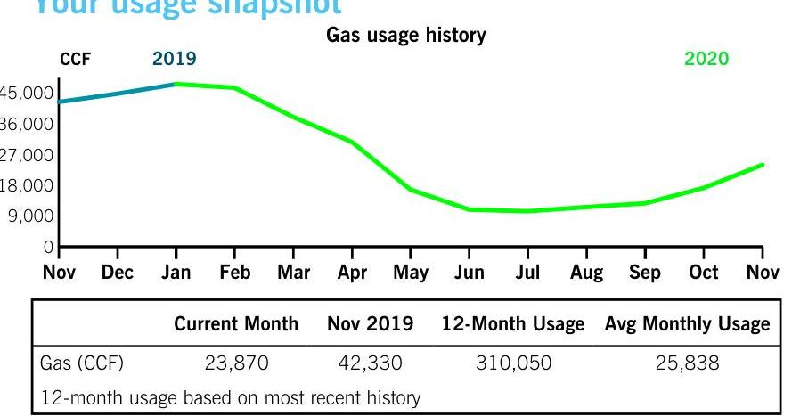

## Billing summary

| Previous amount due | \$9,184.95 |
| :--: | :--: |
| Payment received Nov 17 | $-9,184.95$ |
| IGS Energy |  |
| Gas Generation Supply | 9,213.82 |
| Gas Delivery | 3,198.61 |
| Taxes | 431.21 |
| Total amount due Dec 21 | \$12,843.64 |

## Your usage snapshot

The image is a line chart titled "Gas usage history" with the y-axis labeled "CCF" and the x-axis showing months from November to November. The chart compares gas usage for the years 2019 and 2020. The 2019 line is blue, starting high in November and decreasing slightly by December. The 2020 line is green, starting lower in November, decreasing until June, and then rising again by November.

Below the chart, there is a table with the following data:

- **Current Month**: 23,870 CCF
- **Nov 2019**: 42,330 CCF
- **12-Month Usage**: 310,050 CCF
- **Avg Monthly Usage**: 25,838 CCF

The text "12-month usage based on most recent history" is also included. The chart provides a yearly usage breakdown (monthly-based).

## Your Energy Bill

Service address
STANDARD AERO
11550 MOSTELLER RD
CINCINNATI OH 45241

## $0^{3}$

Thank you for your payment.
Duke Energy does not maintain customers' natural gas piping after or downstream of the meter. You should maintain such piping by periodically inspecting for leaks. If the piping is metal, you should also check for signs of corrosion. You should repair such piping if leaks or corrosion are discovered. For assistance locating, inspecting or repairing buried piping, please contact a licensed heating/plumbing contractor. You should always call 811 prior to digging. Once your lines are marked, always dig by hand if digging near natural gas piping.

Mail your payment at least 7 days before the due date or pay instantly at duke-energy.com/billing. Late payments are subject to a $1.5 \%$ late charge.

Please return this portion with your payment. Thank you for your business.

DUKE
ENERGY.
Duke Energy Return Mail
PO Box 1090
Charlotte, NC 28201-1090

## STANDARD AERO

11550 MOSTERLLAR RD
SHARONVILLE, OH 45241

## Amount due

$\$ 12,843.64$
by Dec 21

After Dec 21, the amount due will increase to $\$ 13,036.29$.

## \$   $\$$   $\$$   $\$$   $\$$   $\$$   $\$$   $\$$

We're here for you

| Report an emergency |  |
| :-- | :-- |
| Electric/Gas outage | duke-energy.com/outages |
|  | 800.543 .5599 |
|  | 800.634 .4300 |
| Convenient ways to pay your bill |  |
| Online | duke-energy.com/billing |
| Automatically from your bank account | duke-energy.com/autodraft |
| Speedpay (fee applies) | duke-energy.com/pay-now |
|  | 800.544 .6900 |
| By mail payable to Duke Energy | P.O. Box 1326 |
|  | Charlotte, NC 28201-1326 |
| In person | duke-energy.com/location |

Help managing your account (not applicable for all customers)
Register for free paperless billing
Home
Business
duke-energy.com/paperless
duke-energy.com/manage-home
duke-energy.com/manage-bus

## Correspond with Duke Energy

P.O. Box 1326

Charlotte, NC 28201

## Contact Duke Energy

Online
Call (Monday - Friday, 7 a.m. to 7 p.m.)
For hearing impaired TDD/TTY
duke-energy.com
800.544.6900
800.750 .7500

## General utility information or commission assistance

Public Utilities Commission of Ohio (PUCO)
Call (8 a.m. to 5 p.m.) 800.686.7826
Online
puco.ohio.gov
For hearing impaired TDD/TTY 937.643.4600 or 711
Ohio Consumers' Counsel (OCC)
Call (8 a.m. to 5 p.m.) 877.742.5622
Online
occ.ohio.gov

## Request the condensed or detailed bill format

Call (7a.m. to 7 p.m.)
800.544.6900

## Important to know

## Your next meter reading: Dec 29

Please be sure we can safely access your meter for actual readings. Don't worry if your digital meter flashes eights from time to time. That's a normal part of the energy measuring process.

## Your electric service may be disconnected if your payment is past due

If payment for your electric service is past due, we may begin disconnection procedures. If your service is disconnected because of a missed payment, you must pay the amount specified in the Important Disconnect Information section on your bill, as well as, a reconnection fee, before your service will be reconnected. The reconnection fee is $\$ 10$ for electric service that may be reconnected remotely, $\$ 69$ for electric service that is not eligible to be reconnected remotely, and $\$ 17$ for gas service. In such situations where both electric and gas service are disconnected for non-payment, the reconnection fee will not exceed $\$ 27$ for both.

## Failure to pay may result in a return to our standard offer for generation

Failure to pay charges for a competitive retail service may result in cancellation of your contract with the respective retail electric supplier. You will then be returned to Duke Energy Ohio's standard offer for generation services.

## Questions or complaints

If you have a question or complaint about your bill or service, please contact us via one of the contact options provided.

If your complaint is not resolved after contacting Duke Energy or if you need general utility information, please contact the Public Utilities Commission of Ohio (PUCO) or the Ohio Consumers' Counsel (OCC) via one of the contacts provided.

## When you pay by check

We may process the payment as a regular check or convert it into a one-time electronic check payment.

## Para nuestros clientes que hablan Español

Representantes bilingües están disponibles para asistirle de lunes a viernes de 7 a.m. 7 p.m. Para obtener más información o reportar problemas con su servicio eléctrico, favor de llamar al 800.544.6900.

# Your usage snapshot - continued 

| Current gas usage for meter number 000682561 |  |
| :--: | :--: |
| Actual reading on Nov 24 | 252648 |
| Previous reading on Oct 23 | - 250261 |
|  | 2,387 |
| Gas Pressure Factor | $\times 10$ |
| Gas used | 23,870 CCF |
| CCF Multiplier | 10 |

One centum cubic foot (CCF) is the amount of gas in a 100-cubicfoot space. If you have a standard oven, it would take about 20 hours to use 1 CCF of gas.
A multiplier is the factor that the meter reading is multiplied by to determine the correct energy usage.

## Billing details - Gas

| Meter - 682561 |  |
| :--: | :--: |
| Rate FTLT - Firm Transportation-Large |  |
| Fixed Delivery Service Charge | $\$ 226.64$ |
| Usage-Based Charge |  |
| 23,870 CCF @ \$0.10483 | 2,502.29 |
| Gas Delivery Riders | 626.11 |
| Applicable Surcharge |  |
| 23,870 CCF @ \$-0.0065534 | $-156.43$ |
| Total delivery charges | 3,198.61 |
| IGS Energy |  |
| Gas Supplier Energy Chg |  |
| 23,870 CCF @ \$0.386 | 9,213.82 |
| Total Charges | $\$ 12,412.43$ |

## Billing details - Taxes

| Tax on Gas Supplier Energy Chg | $\$ 431.21$ |
| :-- | --: |
| Total Taxes | $\mathbf{\$ 4 3 1 . 2 1}$ |

