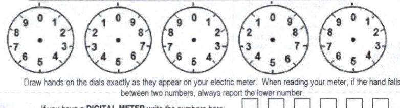
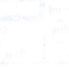

Billing Period: Jul 12 to Aug 11, 2024 for 31 days
Bill For: REGAL ENTERTAINMENT GRP
ISS TOWN CENTER DR
YORK PA 17408

# Amount Due: $\$ 1,851.72$ 

Due Date: August 29, 2024

| To report an emergency or an outage, call 24 hours a day 1.888-544-4877.   Bill issued by: Met-Ed. PO Box 16001. Reading PA 19812-6001.   To enroll in eBill or pay your bill online, scan the QR code on the right of this bill from your mobile device or go to www. firstenergycorp.com.   For Customer Service: call 1-800-545-7741 For Payment Options: call 1-800-962-4848. |  |  |  |  |  |  |  |  |  |  |  |  |  |  |  |
| :--: | :--: | :--: | :--: | :--: | :--: | :--: | :--: | :--: | :--: | :--: | :--: | :--: | :--: | :--: | :--: |
| Shaping Information Customer Number |  |  |  | Account Summary |  |  |  |  |  |  |  |  |  | Amount Due |  |
| 0805254769.0007450175 |  | Rate Category |  | Previous Balance |  |  |  |  |  |  |  |  |  | 1.922.98 |  |
|  | G | General Secondary Medium ME-GSMD |  | Payments/Adjustments |  |  |  |  |  |  |  |  |  |  |  |
|  | Contact your supplier if you do not know your contract expiration date. |  |  | Balance at Billing on Aug 14, 2024 |  |  |  |  |  |  |  |  |  |  |  |
| Messages |  |  |  | Met-Ed. - Consumption |  |  |  |  |  |  |  |  |  | 1.886.97 |  |
|  | To avoid a 2.00\% Late Payment Charge being added to your bill please pay the Amount Due by the Due Date. |  |  | Met-Ed. - Misc. Charges |  |  |  |  |  |  |  |  |  |  |  |
|  | Your current PRICE TO COMPARE for generation and transmission from Met-Ed is listed below. For you to save, a supplier's price must be lower. |  |  | Total Current Charges |  |  |  |  |  |  |  |  |  | 1.811.72 |  |
| General Secondary Medium - 0007450175 - 15.60 cents per KWH |  |  |  | Amount Due by Aug 29, 2024 |  |  |  |  |  |  |  |  |  |  |  |
| Your next meter reading is scheduled to occur on or about Sep 12, 2024. |  |  |  |  |  |  |  |  |  |  |  |  |  |  |  |
| Your bill includes $\$ 119.27$ in PA taxes, of which $\$ 105.03$ is PA gross receipts tax. |  |  |  |  |  |  |  |  |  |  |  |  |  |  |  |
| Generation prices and charges are set by the electric generation supplier you have chosen. The Public Utilities Commission regulates distribution prices and services. The Federal Energy Regulatory Commission regulates transmission prices and services. |  |  |  |  |  |  |  |  |  |  |  |  |  |  |  |
| Mailing in your payment? We have a new address! The enclosed bill stub has been pre-addressed for your convenience. If you can't locate your stub, please mail your check to the following. |  |  |  |  |  |  |  |  |  |  |  |  |  |  |  |
| Ohio, Pennsylvania and New Jersey. |  |  |  |  |  |  |  |  |  |  |  |  |  |  |  |
| FirstEnergy |  |  |  |  |  |  |  |  |  |  |  |  |  |  |  |
| P.O. Box 371422 |  |  |  |  |  |  |  |  |  |  |  |  |  |  |  |
| Pittsburgh, PA 15250-7422 |  |  |  | When contacting an Electric Generation Supplier, please provide the following. Customer Number: 0805234769.0007450175 |  |  |  |  |  |  |  |  |  |  |  |  |
| With the Pennsylvania Public Utility Commission's approval, we are notifying all customers of a change in the procedure for disconnection for nonpayment. The company representative will now attempt to complete a remote disconnection and may no longer need access to the meter. All other regulatory noticing leading up to disconnect will continue with no change, and a post-termination notice will be left at the service address. |  |  |  |  |  |  |  |  |  |  |  |  |  |  |  |
| Additional messages, if any, can be found on back. |  |  |  |  |  |  |  |  |  |  |  |  |  |  |  |
| Usage History |  |  |  |  |  |  |  |  |  |  |  |  |  |  |  |
|  |  |  |  |  |  |  |  |  |  |  |  |  |  |  |  |
|  |  |  |  |  |  |  |  |  |  |  |  |  |  |  |  |
|  |  |  |  |  |  |  |  |  |  |  |  |  |  |  |  |
|  |  |  |  |  |  |  |  |  |  |  |  |  |  |  |  |
|  |  |  |  |  |  |  |  |  |  |  |  |  |  |  |  |
|  |  |  |  |  |  |  |  |  |  |  |  |  |  |  |  |
|  |  |  |  |  |  |  |  |  |  |  |  |  |  |  |  |
|  |  |  |  |  |  |  |  |  |  |  |  |  |  |  |  |
|  |  |  |  |  |  |  |  |  |  |  |  |  |  |  |  |
|  |  |  |  |  |  |  |  |  |  |  |  |  |  |  |  |
|  |  |  |  |  |  |  |  |  |  |  |  |  |  |  |  |
|  |  |  |  |  |  |  |  |  |  |  |  |  |  |  |  |
|  |  |  |  |  |  |  |  |  |  |  |  |  |  |  |  |
|  |  |  |  |  |  |  |  |  |  |  |  |  |  |  |  |
|  |  |  |  |  |  |  |  |  |  |  |  |  |  |  |  |
|  |  |  |  |  |  |  |  |  |  |  |  |  |  |  |  |
|  |  |  |  |  |  |  |  |  |  |  |  |  |  |  |  |
|  |  |  |  |  |  |  |  |  |  |  |  |  |  |  |  |
|  |  |  |  |  |  |  |  |  |  |  |  |  |  |  |  |
|  |  |  |  |  |  |  |  |  |  |  |  |  |  |  |  |
|  |  |  |  |  |  |  |  |  |  |  |  |  |  |  |  |
|  |  |  |  |  |  |  |  |  |  |  |  |  |  |  |  |
|  |  |  |  |  |  |  |  |  |  |  |  |  |  |  |  |
|  |  |  |  |  |  |  |  |  |  |  |  |  |  |  |  |
|  |  |  |  |  |  |  |  |  |  |  |  |  |  |  |  |
|  |  |  |  |  |  |  |  |  |  |  |  |  |  |  |  |
|  |  |  |  |  |  |  |  |  |  |  |  |  |  |  |  |
|  |  |  |  |  |  |  |  |  |  |  |  |  |  |  |  |
|  |  |  |  |  |  |  |  |  |  |  |  |  |  |  |  |
|  |  |  |  |  |  |  |  |  |  |  |  |  |  |  |  |
|  |  |  |  |  |  |  |  |  |  |  |  |  |  |  |  |

# Explanation of Terms 

Customer Charge - Monthly charge that offsets costs for billing, meter reading equipment, service line maintenance, and assessing and deploying
Smart Meter Technology
Default Service Support Charge - Charge to recover new and deferred costs associated with serving customers in a competitive market
Distribution Charge - Charge for the use of local arms, transformers, subroutines and other equipment used to deliver electricity to consumers from high-voltage transmission lines
Distribution System Improvement Charge - This charge recovers costs incurred to repair, improve or replace infrastructure that the Company uses to deliver electricity to its customers.
Estimated Reading - On the months we do not read a meter, we calculate the bill based on post-electron usage
Energy Efficiency Charge(s) - Charge to fund the utility's programs designed to reduce customers' annual electric use and peak demand for electricity mandated by Act 129 of 2008
Hourly Pricing Service Charge - Charges to provide energy capacity, compliance with Alternative Energy Portfolio Standards, transmission and ancillary services for Industrial customers receiving Default Service.

KWH (Kilowatt Hout) - A unit of measure for electricity usage equal to 1,000 watts used for line loss
Lady Payment Charge - A charge added to the bill on balances owed after the Due Date
Price to Compare (PTC) - Price per kilowatt hour to be used when comparing to the price of a generation supplier
Price to Compare Default Service - Charges for costs to provide energy capacity, compliance with Alternative Energy Portfolio Standards, transmission and ancillary services for customers receiving Default Service
Prerated Reading - Reading calculated by multiplying the daily average electric usage between two recent readings by the number of days in the billing period
Service Charge - Charge for opening an account
Solar Requirements Charge - Charge to acquire Solar Photoprobe Alternative Energy Portfolio to comply with the Alternative Energy Portfolio Standards Act
State Tax Surcharge - An adjustment to the state taxes recovered through Met-Ed's basic charges
TCJA Voluntary Surcharge - This surcharge adjusts customer sales for the reduction to corporate federal income tax under the Tax Cuts and Jobs Act

## General Information

If you have billing questions or complaints about your Met Ed account, please contact us before the due date.
Call Customer Service at 1-800-545-7741 Monday - Friday, from 8 a.m. - 6 p.m. Our representatives can answer your questions, describe the charges on your bill, explain how to make sure your bill is correct, and provide information on rate schedules and energy efficiency.
Call Payment Options at 1-800-962-4948 Monday - Friday, from 8 a.m. - 6 p.m.
Visit our website at www.fosterergocorp.com
Write to us at Men 6.9, 76.5, Main 52, A-RPC, Akron, OH 44308-1890
Customers with hearing or speech impairments can contact the Telecommunications Relay Service (TRS) at 711.
Information about Dynegy: 312 Walnut Street, Suite 1500, Cincinnati, OH 45202, 1-877-331-3046

For your protection, all of our employees wear Photo I.D. badges
Electronic Check Conversion - Your check authorizes us either to make a one-time electronic funds transfer (EFT) from your account or process as a check. If you have questions about this program, call 1-866-263-8081.

To provide a customer meter reading, use the daily provided and enter the reading on-line at www.fosterergocorp.com/aboutyusubtil or by calling 1-800-545-7741. Say "Meter Reading" when asked "Which of these can I help you with today?" Have the date you took the reading available. If this is to avoid a scheduled estimate, please check the front of the bill for entry dates.

Provide reading by telephone or on-line only: DO NOT MAIL

The image is an illustration showing five analog meter dials. Each dial is numbered from 0 to 9, with a hand pointing to a specific number. Below the dials, there is text instructing users to "Draw hands on the dials exactly as they appear on your electric meter. When reading your meter, if the hand falls between two numbers, always report the lower number." There is also a section for digital meter readings with boxes to write numbers, accompanied by the text "If you have a DIGITAL METER write the numbers here."

Draw hands on the daily exactly as they appear on your electric meter. When reading your meter, if the hand falls between two numbers, always report the lower number.
If you have a DIGITAL METER write the numbers here

The image is a photo or illustration that appears to be very faint and difficult to discern. There are no visible details or text that can be extracted from it.

