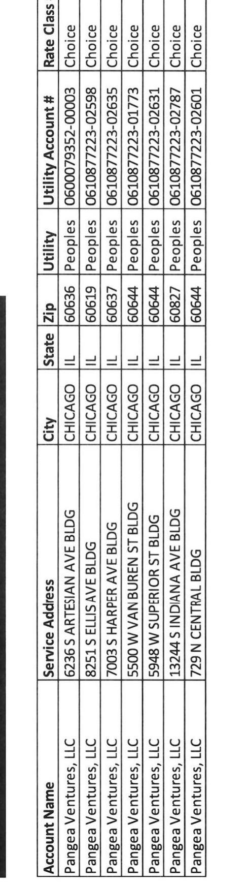

| Account Name | Service Address | City | State | Zip | Utility | Utility Account \# | Rate Class \# |
| :--: | :--: | :--: | :--: | :--: | :--: | :--: | :--: |
| Pangea Ventures, LLC | 7701 S MAY ST BLDG | CHICAGO | IL | 60620 | Peoples | 0610877223-02576 | Choice |
| Pangea Ventures, LLC | 8243 S ELLIS BLDG | CHICAGO | IL | 60619 | Peoples | 0608299543-00012 | Choice |
| Pangea Ventures, LLC | 701 N LOTUS AVE BLDG | CHICAGO | IL | 60644 | Peoples | 0610877223-00489 | Choice |
| Pangea Ventures, LLC | 7028 S CLYDE AVE BLDG | CHICAGO | IL | 60649 | Peoples | 0610877223-02639 | Choice |
| Pangea Ventures, LLC | 7609 S COLEAVE BLDG | CHICAGO | IL | 60649 | Peoples | 0610877223-02552 | Choice |
| Pangea Ventures, LLC | 10848 S PRAIRIE AVE BLDG | CHICAGO | IL | 60637 | Peoples | 0610877223-02990 | Choice |
| Pangea Ventures, LLC | 136 W 183RD ST BLDG | CHICAGO | IL | 60827 | Peoples | 0610877223-00240 | Choice |
| Pangea Ventures, LLC | 7915 S HERMITAGE BLDG | CHICAGO | IL | 60620 | Peoples | 0610877223-02993 | Choice |
| Pangea Ventures, LLC | 6618 S WABASH AVE BLDG | CHICAGO | IL | 60637 | Peoples | 0610877223-02889 | Choice |
| Pangea Ventures, LLC | 5846 W MADISON STR/BLDG | CHICAGO | IL | 60644 | Peoples | 0610877223-01612 | Choice |
| Pangea Ventures, LLC | 8231 S ELLIS AVE BLDG | CHICAGO | IL | 60619 | Peoples | 0600599241-00002 | Choice |
| Pangea Ventures, LLC | 2610 N LARAMIE AVE BLDG | CHICAGO | IL | 60639 | Peoples | 0610877223-02982 | Choice |
| Pangea Ventures, LLC | 3653 W FLOURNOY BLDG | CHICAGO | IL | 60612 | Peoples | 0610877223-02268 | Choice |
| Pangea Ventures, LLC | 6743 S OGLEIBY AVE | CHICAGO | IL | 60649 | Peoples | 0610877223-02636 | Choice |
| Pangea Ventures, LLC | 7700 S KINGSTON AVE BLDG | CHICAGO | IL | 60649 | Peoples | 0610877223-02965 | Choice |
| Pangea Ventures, LLC | 7949 S ELLIS BLDG | CHICAGO | IL | 60619 | Peoples | 0610877223-02581 | Choice |
| Pangea Ventures, LLC | 7800 S ASHLAND AVE BLDG | CHICAGO | IL | 60620 | Peoples | 0610877223-01736 | Choice |
| Pangea Ventures, LLC | 7620 S COLES AVE BLDG | CHICAGO | IL | 60649 | Peoples | 0610877223-02623 | Choice |
| Pangea Ventures, LLC | 4853 S PRAIRIE AVE BLDG | CHICAGO | IL | 60615 | Peoples | 0610877223-02554 | Choice |
| Pangea Ventures, LLC | 5854 S MICHIGAN AVE BLDG | CHICAGO | IL | 60637 | Peoples | 0610877223-02674 | Choice |
| Pangea Ventures, LLC | 5802 W IOWA BLDG | CHICAGO | IL | 60651 | Peoples | 0600667672-00026 | Choice |
| Pangea Ventures, LLC | 7951 S WOLCOTT AVE BLDG | CHICAGO | IL | 60620 | Peoples | 0610877223-02938 | Choice |
| Pangea Ventures, LLC | 8642 S INGLESIDE AVE BLDG | CHICAGO | IL | 60619 | Peoples | 0610877223-00525 | Choice |
| Pangea Ventures, LLC | 7929 S ELLIS BLDG | CHICAGO | IL | 60619 | Peoples | 0610877223-01870 | Choice |
| Pangea Ventures, LLC | 8155 S INGLESIDE AVE BLDG | CHICAGO | IL | 60619 | Peoples | 0610877223-02609 | Choice |
| Pangea Ventures, LLC | 211 E 71ST BLDG | CHICAGO | IL | 60619 | Peoples | 0610877223-02640 | Choice |
| Pangea Ventures, LLC | 2606 W 73RD ST BLDG | CHICAGO | IL | 60649 | Peoples | 0604355805-00003 | Choice |
| Pangea Ventures, LLC | 9049 S MUSKEGON AVE BLDG | CHICAGO | IL | 60617 | Peoples | 0610877223-02981 | Choice |
| Pangea Ventures, LLC | 5832 W NORTH AVE BLDG | CHICAGO | IL | 60639 | Peoples | 0610877223-00402 | Choice |
| Pangea Ventures, LLC | 8100S MARSHFIELD BLDG | CHICAGO | IL | 60620 | Peoples | 0606647085-00003 | Choice |
| Pangea Ventures, LLC | 5051 SFORRESTVILLE AVE BLDG | CHICAGO | IL | 60615 | Peoples | 0610877223-02215 | Choice |
| Pangea Ventures, LLC | 8456 S WABASH AVE BLDG | CHICAGO | IL | 60619 | Peoples | 0610877223-00133 | Choice |

| Account Name | Service Address | City | State | Zip | Utility | Utility Account \# | Rate Class \# |
| :--: | :--: | :--: | :--: | :--: | :--: | :--: | :--: |
| Pangea Ventures, LLC | 2201 E 79THST BLDG | CHICAGO | IL | 60617 | Peoples | 0610877223-02563 | Choice |
| Pangea Ventures, LLC | 8156 S INGLISIDE BSMT | CHICAGO | IL | 60619 | Peoples | 0607736393-00002 | Choice |
| Pangea Ventures, LLC | 6358 S FRANCISCO AVE BLDG BLDG 1S | CHICAGO | IL | 60629 | Peoples | 0610877223-02551 | Choice |
| Pangea Ventures, LLC | 737 N AUSTIN BLVD BLDG | CHICAGO | IL | 60644 | Peoples | 0610877223-02607 | Choice |
| Pangea Ventures, LLC | 221 E 60TH BLDG | CHICAGO | IL | 60637 | Peoples | 0610619560-00002 | Choice |
| Pangea Ventures, LLC | 8155 S INGLISIDE AVE BSMT | CHICAGO | IL | 60619 | Peoples | 0600691934-00002 | Choice |
| Pangea Ventures, LLC | 7956 S JUSTINE BLDG | CHICAGO | IL | 60620 | Peoples | 0610877223-00436 | Choice |
| Pangea Ventures, LLC | 11145 S KING DR BLDG | CHICAGO | IL | 60628 | Peoples | 0610877223-00068 | Choice |
| Pangea Ventures, LLC | 2241 E 71ST ST BLDG | CHICAGO | IL | 60649 | Peoples | 0610877223-00435 | Choice |
| Pangea Ventures, LLC | 8001 S ELLISAVE BLDG | CHICAGO | IL | 60619 | Peoples | 0610877223-02954 | Choice |
| Pangea Ventures, LLC | 8515 S GREEN ST BLDG | CHICAGO | IL | 60620 | Peoples | 0610877223-02644 | Choice |
| Pangea Ventures, LLC | 606 E 51ST ST BLDG | CHICAGO | IL | 60615 | Peoples | 0610877223-02216 | Choice |
| Pangea Ventures, LLC | 8051 S INGEISIDE BLDG | CHICAGO | IL | 60619 | Peoples | 0600667672-00009 | Choice |
| Pangea Ventures, LLC | 400 S KILBOURN AVE BLDG | CHICAGO | IL | 60624 | Peoples | 0600079352-00011 | Choice |
| Pangea Ventures, LLC | 10429 S VERIION BLDG | CHICAGO | IL | 60628 | Peoples | 0610877223-00890 | Choice |
| Pangea Ventures, LLC | 4815 W CORTEZ ST BLDG | CHICAGO | IL | 60651 | Peoples | 0610877223-02956 | Choice |
| Pangea Ventures, LLC | 330 N PINE BLDG | CHICAGO | IL | 60644 | Peoples | 0610877223-02274 | Choice |
| Pangea Ventures, LLC | 13332 S MICHIGAN AVENUE BLDG | CHICAGO | IL | 60827 | Peoples | 0610877223-00224 | Choice |
| Pangea Ventures, LLC | 2845 W 77THST BLDG | CHICAGO | IL | 60649 | Peoples | 0610877223-02934 | Choice |
| Pangea Ventures, LLC | 1355 N HOMAN AVE | CHICAGO | IL | 60651 | Peoples | 0610877223-02679 | Choice |
| Pangea Ventures, LLC | 7406 S PERRY AVE BLDG | CHICAGO | IL | 60621 | Peoples | 0609142657-00227 | Choice |
| Pangea Ventures, LLC | 7801 S SAGINAW BLDG | CHICAGO | IL | 60649 | Peoples | 0612424946-00001 | Choice |
| Pangea Ventures, LLC | 7934 S WABASH AVE BLDG | CHICAGO | IL | 60619 | Peoples | 0610877223-02567 | Choice |
| Pangea Ventures, LLC | 10901 S VERIION AVE BLDG | CHICAGO | IL | 60628 | Peoples | 0610877223-01665 | Choice |
| Pangea Ventures, LLC | 6300 S ARTEIJAN AVE BLDG | CHICAGO | IL | 60629 | Peoples | 0610877223-02569 | Choice |
| Pangea Ventures, LLC | 842 E 82ND ST BLDG | CHICAGO | IL | 60619 | Peoples | 0608299543-00029 | Choice |
| Pangea Ventures, LLC | 10851 S PRAIRIE AVE BLDG | CHICAGO | IL | 60637 | Peoples | 0610877223-02940 | Choice |
| Pangea Ventures, LLC | 4248 W 13THST BLDG | CHICAGO | IL | 60623 | Peoples | 0610877223-02561 | Choice |
| Pangea Ventures, LLC | 1247 S CALIFORNIA AVE BLDG | CHICAGO | IL | 60608 | Peoples | 0610877223-02568 | Choice |
| Pangea Ventures, LLC | 5300 S MICHIGAN AVE BLDG | CHICAGO | IL | 60615 | Peoples | 0610877223-02669 | Choice |
| Pangea Ventures, LLC | 753 E 79TH ST BLDG | CHICAGO | IL | 60619 | Peoples | 0608299543-00030 | Choice |
| Pangea Ventures, LLC | 723 N CENTRAL AVE BLDG | CHICAGO | IL | 60644 | Peoples | 0610877223-02958 | Choice |

| Account Name | Service Address | City | State | Zip | Utility | Utility Account \# | Rate Class \# |
| :--: | :--: | :--: | :--: | :--: | :--: | :--: | :--: |
| Pangea Ventures, LLC | 8255 MARYLAND AVE BLDG | CHICAGO | IL | 60619 | Peoples | 0610877223-02555 | Choice |
| Pangea Ventures, LLC | 221 E 68TH BLDG | CHICAGO | IL | 60637 | Peoples | 0610877223-01668 | Choice |
| Pangea Ventures, LLC | 7348 S KINGDR BLDG | CHICAGO | IL | 60619 | Peoples | 0610877223-02579 | Choice |
| Pangea Ventures, LLC | 7955 S CALLMET AVE BLDG | CHICAGO | IL | 60619 | Peoples | 0610877223-00079 | Choice |
| Pangea Ventures, LLC | 2605 W 62ND ST BSMT | CHICAGO | IL | 60629 | Peoples | 0610877223-01437 | Choice |
| Pangea Ventures, LLC | 8001 S MUSKEGON AVE BLDG | CHICAGO | IL | 60617 | Peoples | 0602247223-00029 | Choice |
| Pangea Ventures, LLC | 4750 S CALLME AVE BLDG | CHICAGO | IL | 60615 | Peoples | 0610877223-02885 | Choice |
| Pangea Ventures, LLC | 7800 S ASHLAND AVE TEMP STR2 | CHICAGO | IL | 60620 | Peoples | 0610877223-01737 | Choice |
| Pangea Ventures, LLC | 7905 S LUELLA AVE BLDG | CHICAGO | IL | 60617 | Peoples | 0610877223-02604 | Choice |
| Pangea Ventures, LLC | 8000 S MARILAND BLDG | CHICAGO | IL | 60619 | Peoples | 0613390967-00002 | Choice |
| Pangea Ventures, LLC | 6705 S MICHIGAN BLDG | CHICAGO | IL | 60637 | Peoples | 0610877223-02266 | Choice |
| Pangea Ventures, LLC | 7953 S DOBSON AVE BLDG | CHICAGO | IL | 60619 | Peoples | 0604355805-00001 | Choice |
| Pangea Ventures, LLC | 115 E 59TH ST BLDG | CHICAGO | IL | 60637 | Peoples | 0610877223-00545 | Choice |
| Pangea Ventures, LLC | 10201 S ST LAWRENCE AVE BLDG | CHICAGO | IL | 60628 | Peoples | 0610877223-00160 | Choice |
| Pangea Ventures, LLC | 7801 S KINGSTON AVE BLDG | CHICAGO | IL | 60649 | Peoples | 0607507982-00001 | Choice |
| Pangea Ventures, LLC | 8514 S CRANDON AVE BLDG | CHICAGO | IL | 60617 | Peoples | 0608299543-00034 | Choice |
| Pangea Ventures, LLC | 345 E 72ND ST BSMT | CHICAGO | IL | 60619 | Peoples | 0610877223-02860 | Choice |
| Pangea Ventures, LLC | 814 W 72NDST BLDG | CHICAGO | IL | 60621 | Peoples | 0610877223-01847 | Choice |
| Pangea Ventures, LLC | 1514 W 77TH ST BLDG | CHICAGO | IL | 60620 | Peoples | 0610877223-02550 | Choice |
| Pangea Ventures, LLC | 7656 S HERMTAGE AVE BLDG | CHICAGO | IL | 60620 | Peoples | 0600667672-00019 | Choice |
| Pangea Ventures, LLC | 7706 S SAGINAW BLDG | CHICAGO | IL | 60649 | Peoples | 0610877223-02562 | Choice |
| Pangea Ventures, LLC | 7409 S YATES AVE BLDG | CHICAGO | IL | 60649 | Peoples | 0610877223-02566 | Choice |
| Pangea Ventures, LLC | 715 S SAINT LOUIS AVE BLDG | CHICAGO | IL | 60624 | Peoples | 0610877223-02738 | Choice |
| Pangea Ventures, LLC | 3600 W FRANKLIN BLVD BLDG | CHICAGO | IL | 60624 | Peoples | 0610877223-00593 | Choice |
| Pangea Ventures, LLC | 7920 S EVANS AVE BLDG | CHICAGO | IL | 60619 | Peoples | 0610877223-02573 | Choice |
| Pangea Ventures, LLC | 7800 S JEFFERY BLVD BLDG | CHICAGO | IL | 60649 | Peoples | 0610877223-02661 | Choice |
| Pangea Ventures, LLC | 1108 1/2 E BIND ST BSMT | CHICAGO | IL | 60619 | Peoples | 0610877223-02976 | Choice |
| Pangea Ventures, LLC | 4901 S DREKIL BLVD BLDG | CHICAGO | IL | 60615 | Peoples | 0610877223-02565 | Choice |
| Pangea Ventures, LLC | 805 E DREKEISQ BLDG | CHICAGO | IL | 60615 | Peoples | 0610877223-02994 | Choice |
| Pangea Ventures, LLC | 7135 S BLACISTONE AVE BLDG | CHICAGO | IL | 60619 | Peoples | 0610877223-01475 | Choice |
| Pangea Ventures, LLC | 5501 W LAKEBLDG | CHICAGO | IL | 60644 | Peoples | 0610877223-02275 | Choice |
| Pangea Ventures, LLC | 1042 N LEAMINGTON AVE BLDG | CHICAGO | IL | 60651 | Peoples | 0610877223-02948 | Choice |

| Account Name | Service Address | City | State | Zip | Utility | Utility Account \# | Rate Class \# |
| :--: | :--: | :--: | :--: | :--: | :--: | :--: | :--: |
| Pangea Ventures, LLC | 5230 W HARRISON BLDG | CHICAGO | IL | 60644 | Peoples | 0603094930-00002 | Choice |
| Pangea Ventures, LLC | 7914 S HERMTAGE AVE BLDG | CHICAGO | IL | 60620 | Peoples | 0610877223-02989 | Choice |
| Pangea Ventures, LLC | 749 E 79TH ST BLDG | CHICAGO | IL | 60619 | Peoples | 0608299543-00028 | Choice |
| Pangea Ventures, LLC | 622 E 51ST ST BLDG | CHICAGO | IL | 60615 | Peoples | 0610877223-02118 | Choice |
| Pangea Ventures, LLC | 1249 S CAUFORNIA AVE BLDG | CHICAGO | IL | 60608 | Peoples | 0610877223-02643 | Choice |
| Pangea Ventures, LLC | 1815 W 77TH ST BLDG | CHICAGO | IL | 60620 | Peoples | 0600667672-00025 | Choice |
| Pangea Ventures, LLC | 8000 S PAULINA ST BLDG | CHICAGO | IL | 60620 | Peoples | 0608299543-00038 | Choice |
| Pangea Ventures, LLC | 7916 S DREXEL AVE BLDG | CHICAGO | IL | 60619 | Peoples | 0600599241-00001 | Choice |
| Pangea Ventures, LLC | 2542 S TRUMBULL AVE REAR 2 FL BLDG | CHICAGO | IL | 60623 | Peoples | 0610877223-00425 | Choice |
| Pangea Ventures, LLC | 4114 W WASHINGTON BLVD BLDG | CHICAGO | IL | 60624 | Peoples | 0610877223-02735 | Choice |
| Pangea Ventures, LLC | 7615 S COLES BLDG | CHICAGO | IL | 60649 | Peoples | 0600667672-00015 | Choice |
| Pangea Ventures, LLC | 7317 S CHAPPEL AVE BLDG | CHICAGO | IL | 60649 | Peoples | 0610877223-02603 | Choice |
| Pangea Ventures, LLC | 8109 S ASHLAND AVE BLDG | CHICAGO | IL | 60620 | Peoples | 0608299543-00039 | Choice |
| Pangea Ventures, LLC | 6751 S JEFFERY BLVD BLDG | CHICAGO | IL | 60649 | Peoples | 0602886372-00001 | Choice |
| Pangea Ventures, LLC | 8127 S ELLIS BLDG | CHICAGO | IL | 60619 | Peoples | 0610877223-02600 | Choice |
| Pangea Ventures, LLC | 119 E MARQUETTE RD BSMT | CHICAGO | IL | 60637 | Peoples | 0610877223-02283 | Choice |
| Pangea Ventures, LLC | 7236 S YATES | CHICAGO | IL | 60649 | Peoples | 0610877223-00712 | Choice |
| Pangea Ventures, LLC | 2611 W 64TH ST BSMT | CHICAGO | IL | 60628 | Peoples | 0610877223-02987 | Choice |
| Pangea Ventures, LLC | 6308 S FAIRFIELD BLDG | CHICAGO | IL | 60629 | Peoples | 0610877223-02599 | Choice |
| Pangea Ventures, LLC | 400 S LARAME BLDG | CHICAGO | IL | 60644 | Peoples | 0600667632-00046 | Choice |
| Pangea Ventures, LLC | 644 E 50TH PL BLDG | CHICAGO | IL | 60615 | Peoples | 0610877223-02175 | Choice |
| Pangea Ventures, LLC | 647 N MAYFIELD AVE BLDG | CHICAGO | IL | 60644 | Peoples | 0608299543-00006 | Choice |
| Pangea Ventures, LLC | 8000 S DREXEL AVE BLDG | CHICAGO | IL | 60619 | Peoples | 0608299543-00008 | Choice |
| Pangea Ventures, LLC | 7356 S DORCHESTER BLDG | CHICAGO | IL | 60619 | Peoples | 0610877223-02590 | Choice |
| Pangea Ventures, LLC | 1931 E 71ST ST BLDG | CHICAGO | IL | 60649 | Peoples | 0610877223-00103 | Choice |
| Pangea Ventures, LLC | 7939 S DOBSON AVE BLDG | CHICAGO | IL | 60619 | Peoples | 0610877223-00179 | Choice |
| Pangea Ventures, LLC | 7924 S VERNON AVE BLDG | CHICAGO | IL | 60619 | Peoples | 0610877223-02626 | Choice |
| Pangea Ventures, LLC | 11115 S VERNON AVE BLDG | CHICAGO | IL | 60628 | Peoples | 0610877223-02632 | Choice |
| Pangea Ventures, LLC | 7955 S CALUMET AVE BLDG | CHICAGO | IL | 60619 | Peoples | 0610877223-00080 | Choice |
| Pangea Ventures, LLC | 5200 S CONGRESS PKWY BLDG | CHICAGO | IL | 60644 | Peoples | 0600667632-00047 | Choice |
| Pangea Ventures, LLC | 7801 S YATES BLVD BLDG | CHICAGO | IL | 60649 | Peoples | 0610877223-02968 | Choice |
| Pangea Ventures, LLC | 7850 S CONSTANCE BLDG | CHICAGO | IL | 60649 | Peoples | 0608299543-00040 | Choice |

| Account Name | Service Address | City | State | Zip | Utility | Utility Account \# | Rate Class \# |
| :--: | :--: | :--: | :--: | :--: | :--: | :--: | :--: |
| Pangea Ventures, LLC | 115 E 59TH STREET BLDG | CHICAGO | IL | 60637 | Peoples | 0610877223-02730 | Choice |
| Pangea Ventures, LLC | 5870 W LAKE BLDG | CHICAGO | IL | 60644 | Peoples | 0610877223-02991 | Choice |
| Pangea Ventures, LLC | 7914 S KINGSTON AVE BLDG | CHICAGO | IL | 60617 | Peoples | 0610877223-02570 | Choice |
| Pangea Ventures, LLC | 7800 ESSEX BLDG | CHICAGO | IL | 60649 | Peoples | 0610877223-02630 | Choice |
| Pangea Ventures, LLC | 2157 S CENTKAL PARK AVE BLDG | CHICAGO | IL | 60623 | Peoples | 0610877223-00157 | Choice |
| Pangea Ventures, LLC | 7920 S EVANS BLDG | CHICAGO | IL | 60619 | Peoples | 0608299543-00026 | Choice |
| Pangea Ventures, LLC | 9001 S COMMERCIAL AVE BLDG | CHICAGO | IL | 60617 | Peoples | 0610877223-00271 | Choice |
| Pangea Ventures, LLC | 8001 S MARSHFIELD AVE BLDG | CHICAGO | IL | 60620 | Peoples | 0600667672-00011 | Choice |
| Pangea Ventures, LLC | 8001 S MARSHFIELD AVE LAUNDRY RC | CHICAGO | IL | 60620 | Peoples | 0600667672-00024 | Choice |
| Pangea Ventures, LLC | 4815 W MONROE BLDG | CHICAGO | IL | 60644 | Peoples | 0610877223-02887 | Choice |
| Pangea Ventures, LLC | 7701 S YATES AVE BLDG | CHICAGO | IL | 60649 | Peoples | 0610877223-00488 | Choice |
| Pangea Ventures, LLC | 1516 W 78TH BLDG | CHICAGO | IL | 60620 | Peoples | 0610877223-01808 | Choice |
| Pangea Ventures, LLC | 1807 S SAINT LOUIS AVE BLDG | CHICAGO | IL | 60623 | Peoples | 0610877223-01339 | Choice |
| Pangea Ventures, LLC | 5130 S KING DRIVE BLDG | CHICAGO | IL | 60615 | Peoples | 0610877223-02667 | Choice |
| Pangea Ventures, LLC | 6210 S WHIPPLE ST FL 1 | CHICAGO | IL | 60629 | Peoples | 0600667632-00345 | Choice |
| Pangea Ventures, LLC | 1019 W 80TH BSMT | CHICAGO | IL | 60620 | Peoples | 0600667672-00014 | Choice |
| Pangea Ventures, LLC | 7701 S EXCHANGE BLDG | CHICAGO | IL | 60649 | Peoples | 0608299543-00032 | Choice |
| Pangea Ventures, LLC | 2225 E 87TH ST BLDG | CHICAGO | IL | 60617 | Peoples | 0600691934-00003 | Choice |
| Pangea Ventures, LLC | 1734 E 72ND ST BLDG | CHICAGO | IL | 60649 | Peoples | 0610877223-02996 | Choice |
| Pangea Ventures, LLC | 8222 S INGELSIDE BLDG | CHICAGO | IL | 60619 | Peoples | 0610877223-02586 | Choice |
| Pangea Ventures, LLC | 4061 W STH BLDG | CHICAGO | IL | 60624 | Peoples | 0610877223-02677 | Choice |
| Pangea Ventures, LLC | 7802 S MICHGAN AVE BLDG | CHICAGO | IL | 60619 | Peoples | 0610877223-02737 | Choice |
| Pangea Ventures, LLC | 1605 N AUSTIN AVE BLDG | CHICAGO | IL | 60639 | Peoples | 0610619560-00001 | Choice |
| Pangea Ventures, LLC | 2043 E 75TH ST BLDG | CHICAGO | IL | 60649 | Peoples | 0610877223-01676 | Choice |
| Pangea Ventures, LLC | 5001 W ADAMS ST BLDG | CHICAGO | IL | 60644 | Peoples | 0610877223-00001 | Choice |
| Pangea Ventures, LLC | 11 S AUSTIN BLVD BLDG | CHICAGO | IL | 60644 | Peoples | 0610877223-02595 | Choice |
| Pangea Ventures, LLC | 12000 S EGGLESTON BLDG | CHICAGO | IL | 60619 | Peoples | 0610877223-01347 | Choice |
| Pangea Ventures, LLC | 6954 S CALUMET BLDG | CHICAGO | IL | 60637 | Peoples | 0608299543-00031 | Choice |
| Pangea Ventures, LLC | 737 N AUSTIN BLVD BLDG | CHICAGO | IL | 60644 | Peoples | 0610877223-02619 | Choice |
| Pangea Ventures, LLC | 1452 E 68TH ST BLDG | CHICAGO | IL | 60637 | Peoples | 0610877223-01053 | Choice |
| Pangea Ventures, LLC | 5015 W JACISON BLVD BSMT | CHICAGO | IL | 60644 | Peoples | 0610877223-02755 | Choice |
| Pangea Ventures, LLC | 9244 S SAGINAW AVE BLDG | CHICAGO | IL | 60617 | Peoples | 0608299543-00024 | Choice |

| Account Name | Service Address | City | State | Zip | Utility | Utility Account \# | Rate Class \# |
| :--: | :--: | :--: | :--: | :--: | :--: | :--: | :--: |
| Pangea Ventures, LLC | 617 N CENTRAL AVE BLDG | CHICAGO | IL | 60644 | Peoples | 0608299543-00004 | Choice |
| Pangea Ventures, LLC | 7254 S UNIVERSITY AVE BLDG | CHICAGO | IL | 60619 | Peoples | 0610877223-00727 | Choice |
| Pangea Ventures, LLC | 6100 S ARTEIJAN BLDG | CHICAGO | IL | 60629 | Peoples | 0604355805-00004 | Choice |
| Pangea Ventures, LLC | 7653 S LOOMIS BLVD BLDG | CHICAGO | IL | 60620 | Peoples | 0612728512-00002 | Choice |
| Pangea Ventures, LLC | 8001 S MAYST BLDG | CHICAGO | IL | 60620 | Peoples | 0610877223-02651 | Choice |
| Pangea Ventures, LLC | 8312 S INSLESIDE AVE BLDG | CHICAGO | IL | 60619 | Peoples | 0610877223-02970 | Choice |
| Pangea Ventures, LLC | 2231 E 71ST TEMP STR | CHICAGO | IL | 60649 | Peoples | 0610877223-02637 | Choice |
| Pangea Ventures, LLC | 1216 W 83R0 ST BLDG | CHICAGO | IL | 60620 | Peoples | 0610877223-02808 | Choice |
| Pangea Ventures, LLC | 620 E 51ST ST BLDG | CHICAGO | IL | 60615 | Peoples | 0610877223-02120 | Choice |
| Pangea Ventures, LLC | 7801 S ESSEX AVE BLDG | CHICAGO | IL | 60649 | Peoples | 0610877223-02629 | Choice |
| Pangea Ventures, LLC | 7829 S PHILLIPS AVE BLDG | CHICAGO | IL | 60649 | Peoples | 0610877223-05937 | Choice |
| Pangea Ventures, LLC | 1509 S KENNETH AVE BLDG | CHICAGO | IL | 60623 | Peoples | 0609142657-00839 | Choice |
| Pangea Ventures, LLC | 2433 W 63R0 ST STR | CHICAGO | IL | 60629 | Peoples | 0610877223-01930 | Choice |
| Pangea Ventures, LLC | 8259 S MARILAND AVE BLDG | CHICAGO | IL | 60619 | Peoples | 0610877223-02642 | Choice |
| Pangea Ventures, LLC | 7400 S YATEL BLVD BLDG | CHICAGO | IL | 60649 | Peoples | 0610877223-02633 | Choice |
| Pangea Ventures, LLC | 10719 S CALUMET AVE BLDG 1 | CHICAGO | IL | 60628 | Peoples | 0602247223-00014 | Choice |
| Pangea Ventures, LLC | 3359 W HIRSCH ST BSMT | CHICAGO | IL | 60651 | Peoples | 0610877223-02686 | Choice |
| Pangea Ventures, LLC | 345 E 72ND ST BLDG | CHICAGO | IL | 60619 | Peoples | 0608299543-00011 | Choice |
| Pangea Ventures, LLC | 7751 S LOOMIS BLVD BLDG | CHICAGO | IL | 60620 | Peoples | 0604355805-00005 | Choice |
| Pangea Ventures, LLC | 4720 S DREXEL BLVD BLDG | CHICAGO | IL | 60615 | Peoples | 0610877223-02827 | Choice |
| Pangea Ventures, LLC | 7440 S PHILLIPS BLDG | CHICAGO | IL | 60649 | Peoples | 0610877223-02613 | Choice |
| Pangea Ventures, LLC | 8100 S THRCOP ST BLDG | CHICAGO | IL | 60620 | Peoples | 0610877223-00433 | Choice |
| Pangea Ventures, LLC | 7655 S SANGAMON ST BLDG | CHICAGO | IL | 60620 | Peoples | 0609142657-00001 | Choice |
| Pangea Ventures, LLC | 1616 W 80THST BLDG | CHICAGO | IL | 60620 | Peoples | 0610877223-02549 | Choice |
| Pangea Ventures, LLC | 7944 S PAULNA ST BLDG | CHICAGO | IL | 60620 | Peoples | 0610877223-02622 | Choice |
| Pangea Ventures, LLC | 7612 S KINGSTON AVE BLDG | CHICAGO | IL | 60649 | Peoples | 0610877223-02606 | Choice |
| Pangea Ventures, LLC | 900 E 82ND ST BLDG | CHICAGO | IL | 60619 | Peoples | 0610877223-02612 | Choice |
| Pangea Ventures, LLC | 6224 S KINGSTON DR BLDG | CHICAGO | IL | 60637 | Peoples | 0610877223-00461 | Choice |
| Pangea Ventures, LLC | 7120 S WABASH AVE BLDG | CHICAGO | IL | 60619 | Peoples | 0610877223-01075 | Choice |
| Pangea Ventures, LLC | 2826 E 76THPL BLDG | CHICAGO | IL | 60649 | Peoples | 0610877223-02593 | Choice |
| Pangea Ventures, LLC | 1321 W 84THST BLDG | CHICAGO | IL | 60620 | Peoples | 0608299543-00010 | Choice |
| Pangea Ventures, LLC | 7542 S HALSTED ST BLDG | CHICAGO | IL | 60620 | Peoples | 0610877223-02611 | Choice |

| Account Name | Service Address | City | State | Zip | Utility | Utility Account \# | Rate Class \# |
| :--: | :--: | :--: | :--: | :--: | :--: | :--: | :--: |
| Pangea Ventures, LLC | 1400 E 67TH PL BLDG BSMT | CHICAGO | IL | 60637 | Peoples | 0610877223-00895 | Choice |
| Pangea Ventures, LLC | 4641 W JACISON BLVD BLDG | CHICAGO | IL | 60644 | Peoples | 0603060766-00004 | Choice |
| Pangea Ventures, LLC | 7938 S HERMTAGE AVE BLDG | CHICAGO | IL | 60620 | Peoples | 0610877223-01074 | Choice |
| Pangea Ventures, LLC | 8100 S DREXEL AVE BLDG BLDG | CHICAGO | IL | 60619 | Peoples | 0610877223-04319 | Choice |
| Pangea Ventures, LLC | 7834 S COLES AVE BLDG | CHICAGO | IL | 60649 | Peoples | 0608299543-00036 | Choice |
| Pangea Ventures, LLC | 8200 S INGLESIDE AVE BLDG | CHICAGO | IL | 60619 | Peoples | 0608299543-00007 | Choice |
| Pangea Ventures, LLC | 7034 S CLARIMONT BLDG | CHICAGO | IL | 60636 | Peoples | 0606647085-00007 | Choice |
| Pangea Ventures, LLC | 7755 S SANGAMON ST BLDG | CHICAGO | IL | 60620 | Peoples | 0610877223-02605 | Choice |
| Pangea Ventures, LLC | 7901 S DOBSON AVE BLDG | CHICAGO | IL | 60619 | Peoples | 0610877223-02960 | Choice |
| Pangea Ventures, LLC | 5136 S KING DR BSMT APT 06 | CHICAGO | IL | 60615 | Peoples | 0610877223-00394 | Choice |
| Pangea Ventures, LLC | 1962 E 73RD PL BLDG | CHICAGO | IL | 60649 | Peoples | 0610877223-02997 | Choice |
| Pangea Ventures, LLC | 5658 S PEORA ST BLDG | CHICAGO | IL | 60621 | Peoples | 0610877223-02973 | Choice |
| Pangea Ventures, LLC | 7800 S ESSEX AVE BLDG | CHICAGO | IL | 60649 | Peoples | 0600667672-00012 | Choice |
| Pangea Ventures, LLC | 6200 S ROCKWELL ST BLDG | CHICAGO | IL | 60629 | Peoples | 0610877223-02869 | Choice |
| Pangea Ventures, LLC | 1742 E 72ND ST BLDG | CHICAGO | IL | 60649 | Peoples | 0608299543-00033 | Choice |
| Pangea Ventures, LLC | 2649 E 78TH ST BLDG | CHICAGO | IL | 60649 | Peoples | 0610877223-02339 | Choice |
| Pangea Ventures, LLC | 1626 E 78TH ST BLDG | CHICAGO | IL | 60649 | Peoples | 0610877223-03544 | Choice |
| Pangea Ventures, LLC | 8552 S LAFLIN ST BLDG | CHICAGO | IL | 60620 | Peoples | 0610877223-02933 | Choice |
| Pangea Ventures, LLC | 8149 S MARSHFIELD AVE BLDG | CHICAGO | IL | 60620 | Peoples | 0610877223-02923 | Choice |
| Pangea Ventures, LLC | 6901 S MERRILL AVE BLDG | CHICAGO | IL | 60649 | Peoples | 0610877223-02628 | Choice |
| Pangea Ventures, LLC | 9400 S LAFLIN BLDG | CHICAGO | IL | 60620 | Peoples | 0610877223-02731 | Choice |
| Pangea Ventures, LLC | 5012 W JACISON AVE BLDG | CHICAGO | IL | 60644 | Peoples | 0610877223-02698 | Choice |
| Pangea Ventures, LLC | 7145 S YATES BLVD | CHICAGO | IL | 60649 | Peoples | 0610877223-01609 | Choice |
| Pangea Ventures, LLC | 7929 1/2 S STATE STREET BLDG | CHICAGO | IL | 60619 | Peoples | 0600079352-00005 | Choice |
| Pangea Ventures, LLC | 7701 S STEWART BLDG | CHICAGO | IL | 60620 | Peoples | 0610877223-02588 | Choice |
| Pangea Ventures, LLC | 8202 S DREXEL AVE BLDG | CHICAGO | IL | 60619 | Peoples | 0610877223-02659 | Choice |
| Pangea Ventures, LLC | 1619 W 77TH ST BLDG | CHICAGO | IL | 60620 | Peoples | 0610877223-02974 | Choice |
| Pangea Ventures, LLC | 8141 S ELLIS AVE BLDG | CHICAGO | IL | 60619 | Peoples | 0608299534-00020 | Choice |
| Pangea Ventures, LLC | 5019 S CHAMPLAIN AVE BLDG | CHICAGO | IL | 60615 | Peoples | 0610877223-02237 | Choice |
| Pangea Ventures, LLC | 1748 E 71ST BLDG | CHICAGO | IL | 60636 | Peoples | 0610877223-02559 | Choice |
| Pangea Ventures, LLC | 7549 S YATES BLVD BLDG | CHICAGO | IL | 60649 | Peoples | 0610877223-02614 | Choice |
| Pangea Ventures, LLC | 6933 S INDIANA AVE BLDG | CHICAGO | IL | 60637 | Peoples | 0602809571-00001 | Choice |

The image is a table with the following columns and data:

- **Account Name**
  - Pangea Ventures, LLC (repeated for each row)

- **Service Address**
  - 6236 S ARTESIAN AVE BLDG
  - 8251 S ELLIS AVE BLDG
  - 7003 S HARPER AVE BLDG
  - 5500 W VAN BUREN ST BLDG
  - 5948 W SUPERIOR ST BLDG
  - 13244 S INDIANA AVE BLDG
  - 729 N CENTRAL BLDG

- **City**
  - CHICAGO (repeated for each row)

- **State**
  - IL (repeated for each row)

- **Zip**
  - 60636
  - 60619
  - 60637
  - 60644
  - 60644
  - 60827
  - 60644

- **Utility**
  - Peoples (repeated for each row)

- **Utility Account #**
  - 0600079352-00003
  - 0610877233-02598
  - 0610877233-02635
  - 0610877233-01773
  - 0610877233-02631
  - 0610877233-02787
  - 0610877233-02601

- **Rate Class**
  - Choice (repeated for each row)

The following terms and conditions apply to any Transaction in which delivery of natural gas occurs in the State of Illinois. To the extent that the terms set forth in this Exhibit C conflict with the Master Gas Sales Agreement, the terms of this Exhibit C shall control. Any capitalized term not defined in this Exhibit have the meaning assigned to such term in the Master Agreement.

# 1. Definitions 

The following terms shall have the meanings set forth below when used in the Agreement or in this Exhibit C.
"Delivery State" means the State of Illinois.
"ICC" means the Illinois Commerce Commission.
"Local Distribution Company" means the utility distributing natural gas, delivered to its citygate from a transmission pipeline or gathering system, to residential, commercial and industrial end-users over a local geographic area ("LDC").
"Public Utilities Act" means the legislation enacted by the Illinois Legislature and codified at 220 Illinois Compiled Statutes ("ILCS") 05101 et. seq.

## 2. Disclosures and Additional Terms

Letter of Authorization: Upon the execution of a Confirmation, Customer shall also execute the Letter of Authorization-Agency attached to this Exhibit C.

Customer Representation/Waiver of Protection Rules: Customer represents and warrants to Supplier that it is not purchasing natural gas hereunder for residential use. Customer further represents and warrants to Supplier that it consumes more than 5,000 therms of natural gas annually for its premises located within Illinois. Customer and Supplier acknowledge and agree that regulations or state laws enacted to protect residential and very small commercial consumers do not apply to this Agreement. If there is any conflict between any such rules and this Agreement, the Parties acknowledge that this Agreement will control.

Repair Services: If Customer is receiving consolidated billing services from Supplier, Supplier consents to Customer directlyinstructing the LDC to perform repair services and Supplier shall invoice Customer for the actual costs billed to Supplier by the LDC for the performance of such repair services.

## 3. Invoices and Billing

Change in Billing Method. If Supplier, at its sole election, chooses to switch to Utility Consolidated Billing (if available) or the Duel Billing Option, it shall provide at least thirty (30) days prior written notice to Customer of such change. If the Utility Consolidated Billing or Duel Billing Option is implemented, all invoicing and payment requirements, including payment due date, late payment charges, deposit requirements and payment methods, shall all be determined by the LDC in accordance with applicable law and the LDC tariff. Customer shall comply with such terms and pay the invoice submitted by the LDC by the due date established by the LDC.

Disconnection of Service. The LDC has the right, pursuant to the Public Utilities Act Sec. 8-202 and the terms of the LDC's tariff, to disconnect electricity service in specified instances in which Customer fails to timely pay its invoices. In such instance, The LDC is required to give Customer prior written notice of such disconnection and an opportunity for Customer to pay its pastdue invoices. This disconnection right of the LDC applies to this Agreement and to the natural gas service provided by Supplier.

Tax Exemption Notice: If Supplier does not receive the proper tax exemption documentation within thirty (30) days of enrollmentdate, Customer must petition the Delivery State for any tax refunds due.

## 4. Notices

MANSFIELD POWER AND GAS LLC

## NOTICES/ CORRESPONDENCE:

Mansfield Power and Gas LLC
notices@mansfieldpowergas.com

BILLING/ACCOUNTING MATTERS:
Mansfield Power and Gas LLC
1025 Airport Parkway
Gainesville, GA 30501
Ath: Billing and Accounting
Telephone: (678) 207-3045
Email:
Accounts receivable@mansfieldpowergas.com

PAYMENTS:
Payment by Wire/ACH to
JPMorgan Chase
Wire: 021000021
ACH: 061092387
Account Name: Mansfield Power \& Gas
Acct. \# 133828639

# NOTICES/ CORRESPONDENCE: 

Pangea Ventures, LLC
P.O. Box 182590 M.S. 10

Columbus, OH 43218
Attn: Brandon Pieczynski utility@pangeare.com
$312-985-0555$

## BILLING/ACCOUNTING MATTERS:

Same as Notices/Correspondence contact information unless otherwise set forth below:

## 5. Outages or Emergency Contact Information

For Emergencies or Gas Leaks, call your respective LDC below:
Ameren Illinois: 1-800-755-5000
North Shore Gas Company: 1-866-556-6005
Nicor Gas Company: 1-888-642-6748
Peoples Gas: 1-866-556-6002

## 6. ICC Consumer Services Division:

For further information on your consumer rights, education regarding the Illinois natural gas customer choice program, or to file a complaint, you may contact the ICC Consumer Services Division at 1-800-524-0795 or 1-800-858-9277-TTY; or on the internet at www.icc.illinois.gov/complaints; or by mail at Illinois Commerce Commission, 527 East Capitol Ave., Springfield, IL 62701.

# LETTER OF AUTHORIZATION AND AGENCY 

As evidenced by the signature below and the execution of Exhibit A of the Master Commercial Natural Gas Sales Agreement dated June 27, 2019 ("Confirmation"), and in accordance with prices, terms and conditions set forth in the Confirmation and the Master Gas Sales Agreementby and between Pangea Ventures, LLC ("Customer") and Mansfield Power and Gas, LLC ("Supplier"), Customer hereby agrees to the following:
A. Customer authorizes Supplier to take all actions required to switch Customer's natural gas service provider to Supplier as of the Start Date specified below for the Customer service locations listed in ExhibitB of the Master Commercial Natural Gas Sales Agreement. Customer specifically authorizes Supplier to submit to Peoples Gas ("LDC") a Direct Access Switch Request("DASR") required for Supplier to begin providing natural gas to Customer as of the Start Date.
B. Customer authorizes LDC to provide Supplier with information concerning Customer's historical usage, rate class designation and other Customer load and billing data required for Supplier to provide service to Customer.
C. Customer understands and acknowledges that itmay owe charges to its current natural gas provider as a result of switching providers. Customer should consult with its current natural gas provider to determine if any such charges would be incurred.

Delivery Period:

| Start Date: | End Date: |
| :--: | :--: |
| August-1, 2019 | July 31, 2020 |

Customer:
By:
Title:
Date:

[^0]
[^0]:    Customer Billing Address:
    See Account List

