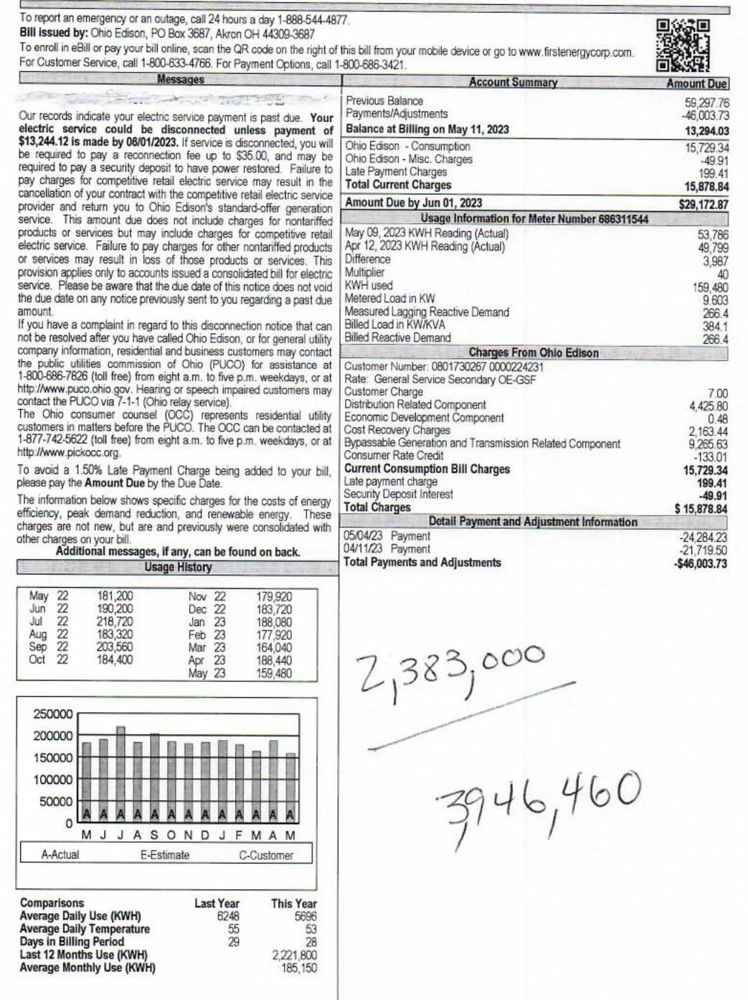
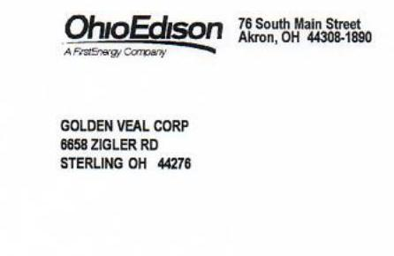

| WhoEdison Bill Based On: Actual Meter Reading, eбой |  |  |
| :--: | :--: | :--: |
| A-histimep Company |  |  |
| Billing Period: Apr 12 to May 08, 2023 for 28 days |  |  |
| Bill Four: |  | 519 |
| 2418 E 98557 SAL 336 RD |  |  |
| CRESTON OH 44217 |  |  |

May 11, 2023
Account Number: 110049457713
Amount Due: $\$ 29,172.87$
Due Date: June 01, 2023

The image is a photo of a utility bill from Ohio Edison. 

- **Account Summary**: 
  - Previous Balance: $59,297.76
  - Payments/Adjustments: -$46,003.73
  - Balance at Billing on May 11, 2023: $13,294.03
  - Ohio Edison - Consumption: $4,603.74
  - Ohio Edison - Misc. Charges: $4,275.00
  - Late Payment Charges: $999.41
  - Total Current Charges: $15,878.84
  - Amount Due by Jun 01, 2023: $29,172.87

- **Usage Information for Meter Number 686311544**:
  - May 09, 2023 KWH Reading (Actual): 53,786
  - Apr 12, 2023 KWH Reading (Actual): 49,799
  - Difference: 3,987
  - Multiplier: 40
  - KWH Used: 159,480
  - Metered Load in KW: 364.4
  - Measured Lagging Reactive Demand: 384.1
  - Billed Load in KW/KVA: 266.4
  - Billed Reactive Demand: 266.4

- **Charges From Ohio Edison**:
  - Customer Number: 0801730267 0000224321
  - Rate: General Service Secondary OE-QSF
  - Customer Charge: $7.00
  - Distribution Related Component: $4,275.00
  - Economic Development Component: $2,163.48
  - Cost Recovery Charges: $9,133.00
  - Bypassable Generation and Transmission Related Component: $9,153.00
  - Consumer Rate Credit: -$3,253.64
  - Current Consumption Bill Charges: $15,879.84
  - Late payment charge: $999.41
  - Security Deposit Interest: $49.91
  - Total Charges: $15,878.84

- **Detail Payment and Adjustment Information**:
  - 05/04/23 Payment: -$24,284.23
  - 04/11/23 Payment: -$21,719.50
  - Total Payments and Adjustments: -$46,003.73

- **Usage History** (Bar Chart):
  - Monthly KWH usage from May to May, showing values ranging from approximately 159,480 to 218,730 KWH.

- **Comparisons**:
  - Average Daily Use (KWH): Last Year 6248, This Year 5696
  - Average Daily Temperature: Last Year 53, This Year 53
  - Days in Billing Period: 28
  - Last 12 Months Use (KWH): 2,221,800
  - Average Monthly Use (KWH): 185,150

- **Additional Text**:
  - "To report an emergency or an outage, call 24 hours a day 1-888-544-4877."
  - "Bill issued by: Ohio Edison, PO Box 3687, Akron OH 44309-3687"
  - "To enroll in eBill or pay your bill online, scan the QR code on the right of this bill from your mobile device or go to www.firstenergycorp.com."
  - "For Customer Service, call 1-800-633-4766. For Payment Options, call 1-800-686-3421."
  - "Additional messages, if any, can be found on back."
  - Handwritten numbers: "2,383,000" and "3946,460"

Return this part with a check or money order payable to Ohio Edison

| WhoEdison | 76 South Main Street Almon, OH 44308-1880 |  |
| :--: | :--: | :--: |
| GOLDEN VEAL CORP |  |  |
| 8858 ZIGLER RD |  |  |
| STERLING OH 44276 |  |  |
|  |  |  |

The image is a photo of an envelope or letterhead from Ohio Edison. It includes the following text:

- "Ohio Edison"
- "A FirstEnergy Company"
- "76 South Main Street"
- "Akron, OH 44308-1890"
- "GOLDEN VEAL CORP"
- "8658 ZIGLER RD"
- "STERLING OH 44276"

2014-2023
2014-2023
2014-2023
2014-2023

OHO EDISON
PO BOX 3687
AKRON OH 44308-3687

|  |  |  |
| :--: | :--: | :--: |
| Energy Efficiency | 159,480 KWH $\times 0.000000$ | 50.00 |
| Peak Demand Reduction | 159,480 KWH $\times 0.000000$ | 50.00 |
| Renewable Energy | 159,480 KWH $\times 0.002244$ | $£ 357.87$ |
| Your next meter reading is scheduled to occur on or about Jun 12, 2023. |  |  |
| We are required to include your name, address and usage information on a list of eligible customers that is made available to other competitive retail electric service providers. If you do not wish to be included on this list, please call us at 1-800-225-0444, go to the Customer Choice section of our website - www.finsterengcconp.com or write to us at 76 S . Main St., Akron, OH 44308 Attr. FICCC. Please note that an election to not be included on this list will not prevent Ohio Edison, The Illuminating Company or Toledo Edison from providing your information to governmental aggregators. If you previously made a similar election, your name will continue to be excluded from the list without any additional action on your part. If you previously decided not to be included on the list and would like to reverse that decision, please call or write us at the same telephone number and address. |  |  |
| For your safety, if your service has been disconnected, do not attempt to reconned it. While this is illegal and could result in prosecution, removing a meter base or touching any of the wires can also cause death or serious injury through arcs of electricity, explosions or fire. Meters are only to be accessed by authorized utility personnel. |  |  |
| An important message to dog owners - to ensure that our meter readers' visits to your home are safe and productive, please keep your dog secured in an area away from the path to your meter. |  |  |
| All of our employees wear photo ID badges. Always ask for an employee's ID before letting anyone in your home. If you are still not sure, please call the company. |  |  |

# Explanation of Terms 

Business Distribution Credit - Applied during the winter billing period for non-residential electric heat and/or water heating customers on a qualifying rate
Bypassable Generation and Transmission Related Component Charges for purchasing power and delivering it through the transmission system. These charges are avoided when switching to a Certified Retail Eating Service provider
Cost Recovery Charges - Recovery previously incurred costly, including PULO-replained (Preted in Recovery Charges UK collects from all customers on behalf of UK Funding, LLC which owns the right to impose and collect such charges
Customer Charge - Monthly charge that offsets costs for billing, meter reading, equipment, and service line maintenance
Distribution Related Component - Charge for moving electricity over distribution lines to a service location
Economic Development Component - Charges related to economic development support

## Important Information

If you have billing questions or complaints about your Ohio Edison account or for a written explanation of the Price to Compare
Call Customer Service at 1-800-003-4700 Monday-Friday, from 6 a.m. - 6 p.m.
Call Payment Options at 1-800-095-3421 Monday-Friday, from 6 a.m. - 6 p.m.
Visit our website at http://www.finsterengcconp.com
Write to us at The Ohio Edison, 76 S . Main St., A-RPC, Akron, OH 44308-1890.
Customers with hearing or speech impairments can contact the Telecommunications Relay Service (TRS) at 711.
We welcome the opportunity to work with you and will try to answer your questions. If your complaint is not resolved after you have called your electric utility, or for general utility information, residential and business customers may contact the public utilities commission of Ohio (PULO) for assistance at 1-800-095-7626 (toll free) from 6 a.m. to 5 p.m. weekdays, or at http://www.puso.ohio.gov. Hearing or speech impaired customers may contact the PULO via 7-1-1 (Ohio relay service). You also can write to the PULO at: 180 East Broad St., Columbus, OH 43215.
For your protection, all of our employees wear Photo I.D. badges.
Electronic Check Conversion - Your check authorizes us either to make a one-time electronic funds transfer (EFT) from your account or process as a check. If you have questions about this program, call 1-866-283-8081.

| OtherEdison | Bill Based On: Actual Meter Reading, eBill |
| :--: | :--: |
| *Intrameter (onbany)* |  |
| Billing Period: Apr 12 to May 06, 2023 for 27 days | May 10, 2023 |
| Bill For: | 572 |
|  | CHICFARM PACKING COMPANY |
|  | 8898 ZEILER RO |
|  | STERLING OH 44276 |

Account Number: 110068609749
Amount Due: $\$ 14,437.76$
Due Date: May 31, 2023

| To report an emergency or an outage, call 24 hours a day 1-889-544-4677. |  |
| :--: | :--: |
| Bill issued by: Ohio Edison, PO Box 3687, Airton OH 44309-3687. |  |
| To enroll in eBill or pay your bill online, scan the Qill code on the right of this bill from your mobile device or go to www.finsterergycorp.com. |  |
| For Customer Service, call 1-800-033-4790. For Payment Options, call 1-800-698-3421. |  |
|  | Account Summary |
|  | 2697614 |
| Our records indicate your electric service payment is paid due. Your |  |
| electric service could be disconnected unless payment | Balance at Billing on May 10, 2023 |
| \$3,732.70 in made by 09/31/2023. If service is disconnected, you will |  |
| be required to pay a reconnection fee up to $\$ 35.00$, and may be |  |
| required to pay a security deposit to have power restored. Failure to |  |
| pay charges for competitive retail electric service may result in the |  |
| cancellation of your contract with the competitive retail electric service |  |
| provider and return you to Ohio Edison's standard-offer generator |  |
| service. This amount due does not include charges for nonterffed |  |
| products or services but may include charges for competitive retail |  |
| electric service. Failure to pay charges for other nonterffed products |  |
| or services may result in loss of those products or services. This |  |
| provision applies only to accounts issued a consolidated bill for electric |  |
| service. Please be aware that the due date of this notice does not v |  |
| the due date on any notice previously sent to you regarding a paid due |  |
| amount. |  |
| If you have a complaint in regard to this disconnection notice that can |  |
| not be received after you have called Ohio Edison, or for general utility |  |
| company information, residential and business customers may contact |  |
| the public utilities commission of Ohio (PLICO) for assistance in |  |
| 1-800-698-7626 (toll free) from eight a.m. to five p.m. weekdays, or at |  |
| http://www.puco.ohio.gov. Hearing or speech impaired customers may |  |
| contact the PLICO via F-1-1 (Ohio relay service). |  |
| The Ohio consumer counsel (OCC) represents residential utility |  |
| customers in matters before the PLICO. The OCC can be contacted at |  |
| 1-877-742-5622 (toll free) from eight a.m. to five p.m. weekdays, or at |  |
| http://www.pulcoco.org. |  |
| To avoid a 1.50\% Late Payment Charge being added to your bill |  |
| please pay the Amount Due by the Due Date. |  |
| The information below shows specific charges for the costs of energy |  |
| efficiency, peak demand reduction, and renewable energy. These |  |
| charges are not new, but are and previously were consolidated with |  |
| other charges on your bill. |  |
| Additional messages, if any, can be found on back. |  |
|  | Design History |
| May 22 | 126,600 |
| Jun 22 | 140,320 |
| Jul 22 | 188,800 |
| Aug 22 | 140,000 |
| Sep 22 | 137,600 |
| Oct 22 | 132,320 |
|  |  |
|  |  |
|  |  |

| 1000000 |  |  |  |  |
| :--: | :--: | :--: | :--: | :--: |
| 1800000 |  |  |  |  |
| 1400000 |  |  |  |  |
| 1200000 |  |  |  |  |
| 1400000 |  |  |  |  |
| 1200000 |  |  |  |  |
| 8000000 |  |  |  |  |
| 8000000 |  |  |  |  |
| 4000000 |  |  |  |  |
| 4000000 |  |  |  |  |
| 4000000 |  |  |  |  |
| 4000000 |  |  |  |  |
| 4000000 |  |  |  |  |
| 4000000 |  |  |  |  |
| 4000000 |  |  |  |  |
| 4000000 |  |  |  |  |
| 4000000 |  |  |  |  |
| 4000000 |  |  |  |  |
| 4000000 |  |  |  |  |
| 4000000 |  |  |  |  |
| 4000000 |  |  |  |  |
| 4000000 |  |  |  |  |
| 4000000 |  |  |  |  |
| 4000000 |  |  |  |  |
| 4000000 |  |  |  |  |
| 4000000 |  |  |  |  |
| 4000000 |  |  |  |  |
| 4000000 |  |  |  |  |
| 4000000 |  |  |  |  |
| 4000000 |  |  |  |  |
| 4000000 |  |  |  |  |
| 4000000 |  |  |  |  |
| 4000000 |  |  |  |  |
| 4000000 |  |  |  |  |
| 4000000 |  |  |  |  |
| 4000000 |  |  |  |  |
| 4000000 |  |  |  |  |
| 4000000 |  |  |  |  |
| 4000000 |  |  |  |  |

|  |  |  |  |  |  |  |  |  |  |  |  |  |  |  |  |  |
| :--: | :--: | :--: | :--: | :--: | :--: | :--: | :--: | :--: | :--: | :--: | :--: | :--: | :--: | :--: | :--: | :--: |
| Energy Efficiency |  | 109,440 KWH $\times$ 0.000000 |  |  |  |  |  |  |  |  |  |  |  |  |  |  |
| Peak Demand Reduction |  | 109,440 KWH $\times$ 0.000000 |  |  |  |  |  |  |  |  |  |  |  |  |  |  |
| Renewable Energy |  | 109,440 KWH $\times$ 0.002244 |  |  |  |  |  |  |  |  |  |  |  |  |  |  |
| Your next meter reading is scheduled to occur on or about Jun 09, 2023. |  |  |  |  |  |  |  |  |  |  |  |  |  |  |  |  |
| We are required to include your name, address and usage information on a list of eligible customers that is made available to other competitive retail electric service providers. If you do not wish to be included on this list, please call us at 1-800-225-0444, go to the Customer Choice section of our website - www.freitenergycorp.com or write to us at 70 S . Main St., Akron, OH 44308 Aftr. FECC. Please note that an election to not be included on this list will not prevent Ohio Edison, The Illuminating Company or Toledo Edison from providing your information to governmental aggregators. If you previously made a similar election, your name will continue to be excluded from the list without any additional action on your part. If you previously decided not to be included on the list and would like to reverse that decision, please call or write us at the same telephone number and address. |  |  |  |  |  |  |  |  |  |  |  |  |  |  |  |
| For your safety, if your service has been disconnected, do not attempt to reconnect it. While this is illegal and could result in prosecution, removing a meter base or touching any of the wires can also cause death or serious injury through acts of electricity, explosions or fire. Meters are only to be accessed by authorized utility personnel. An important message to dog owners - to ensure that our meter readers' visits to your home are safe and productive, please keep your dog secured in an area away from the path to your meter. |  |  |  |  |  |  |  |  |  |  |  |  |  |  |  |
| All of our employees wear photo ID badges. Always ask for an employee's ID before letting anyone in your home. If you are still not sure, please call the company. |  |  |  |  |  |  |  |  |  |  |  |  |  |  |  |  |

# Explanation of Terms 

Business Distribution Credit - Applied during the winter billing period for non-residential electric heat and/or water heating customers on a qualifying rate.
Bypassable Generation and Transmission Related Component Charges for purchasing power and delivering it through the transmission system. These charges are avoided when switching to a Certified Retail Electric Service provider.
Cost Recovery Charges - Recovery previously incurred costs, including PUCO (aggrrec) (Pleas-in Recipvery Charges US collects from all customers on behalf of GE Funding, LLC which owns the right to impose and collect such charges.
Customer Charge - Monthly charge that offsets costs for billing, meter reading, equipment, and service line maintenance.
Distribution Related Component - Charge for moving electricity over distribution lines to a service location.
Economic Development Component - Charges related to economic development support.

## Important Information

If you have billing questions or complaints about your Ohio Edison account or for a written explanation of the Price to Compare.
Call Customer Service at 1-800-053-4780 Monday-Friday, from 8 a.m. - 6 p.m.
Call Payment Options at 1-800-095-3421 Monday-Friday, from 8 a.m. - 6 p.m.
Visit our website at http://www.freitenergycorp.com
Write to us at The Ohio Edison, 70 S. Main St., A-RPC Avron, OH 44308-1890.
Customers with hearing or speech impairments can contact the Telecommunications Relay Service (TRS) at 711.
We welcome the opportunity to work with you and will try to answer your questions. If your complaint is not resolved after you have called your electric utility, or for general utility information, residential and business customers may contact the public utilities commission of Ohio (PUCO) for assistance at 1-800-086-7826 (toll free) from 8 a.m. to 5 p.m. weekdays, or at http://www.pucs.ohio.gov. Hearing or speech impaired customers may contact the PUCO via 7-1-1 (Ohio relay service). You also can write to the PUCO at: 180 East Broad St., Columbus, OH 43215.
For your protection, all of our employees wear Photo I.D. badges.
Electronic Check Conversion - Your check authorizes us either to make a one-time electronic funds transfer (EFT) from your account or process as a check. If you have questions about this program, call 1-866-283-8081.

