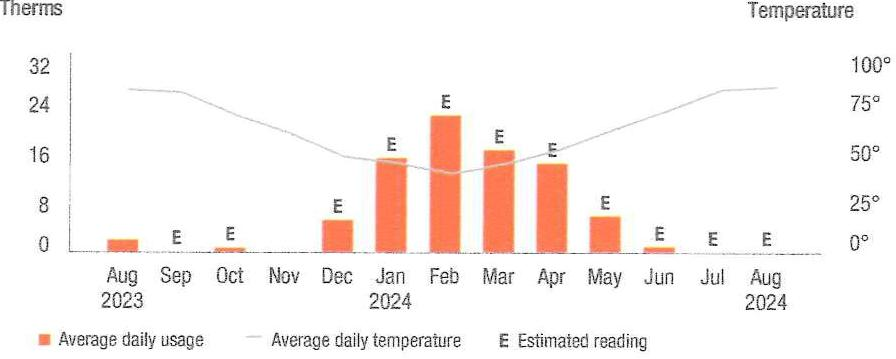
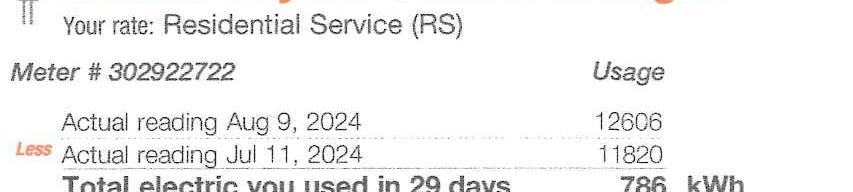
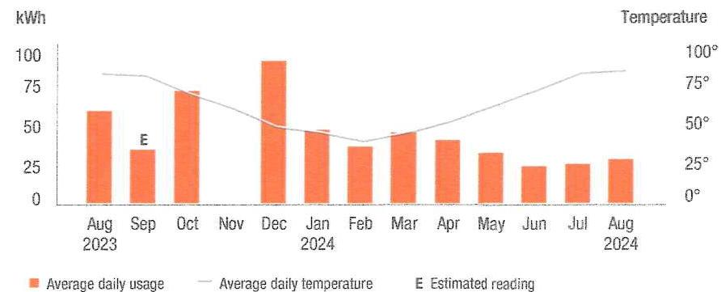

## PSIEG

We make things work for you.
52-8711-3098

## Your energy bill

Bill date: August 13, 2024
For the period: July 12, 2024 to August 09, 2024

## Message Center

This bill reflects BPU-approved changes in the Delivery portion of your electric bill effective on and after August 1, 2024. The increase in the Delivery portion of your bill is due to changes related to the Electric Conservation Incentive Program. As a result of these changes, a typical residential customer who receives electric Supply from PSE\&G and uses 577 kilowatt-hours in an average month will see an average monthly increase of $\$ 0.73$ or $0.57 \%$. Tariff information may also be found by visiting pseg.com.

If you are struggling to pay your bill, help is available! The NJ SHARES program, which now includes PAGE, can help low to moderate-income households with an outstanding balance. To apply, visit njshares.org or call 1-866-657-4273.

Get customized energy tips with our online Home Energy Assessment. It only takes about five minutes to complete, and you will receive valuable energy-saving information. Access it through My Account, or as a guest at pseg.com/SaveEnergy.

## NEXT METER READING September 10, 2024

## How to contact us

## 1-800-436-PSEG (7734)

Customer Service: 7am to 8pm Mon-Fri
Emergoncies / Outages / WorryFree Services: 24/7
TDD/TTY for the hearing impaired: 711
Visit pseg.com/myaccount to access your account anytime
Text us. Register for MyAlerts by texting REG to 4PSEG(47734)
$>$ Text OUT to report an outage.

## - facebook.com/pseg

twitter.com/psegdelivers

## - ST JOSEPH HOME FOR THE BLIND

ACCOUNT NUMBER 7276043207

## PSIEG

This month's charges and credits
Total amount due by Aug 28, 2024
$5188.44$
How much energy you're using

The image is a photo/illustration showing two icons. The first icon is a plug symbol, and the second icon is a droplet symbol. Next to the plug icon, the text reads "ELECTRIC," and next to the droplet icon, the text reads "GAS." The text is in orange.

You
used
$55.6 \%$
less
electric compared to this month last year.
gas compared to this month last year.

This month was $2^{\circ} \mathrm{F}$ warmer compared to this month last year.
If you were enrolled in our Equal Payment Plan, your monthly payment would be $\$ 532.00$. To automatically enroll in this plan, please pay $\$ 532.00$ instead of the amount due on this bill. For more information, visit pseg.com/epg.

Page 1 of 4

## PSIEG

We offer a variety of methods that make it easy to pay your bill. See reverse side for more information.

By checking this box, I authorize PSE\&G to initiate recurring ACH/Electronic
Debits using the bank account number on the enclosed check.
By checking this box, I authorize PSE\&G to enroll me in paperless billing at this email address:

044884000059762
$\mathrm{n} \mid \mathrm{H}_{\mathrm{H}} \mathrm{H}_{\mathrm{H}} \mathrm{H}_{\mathrm{H}} \mathrm{H}_{\mathrm{H}} \mathrm{H}_{\mathrm{H}} \mathrm{H}_{\mathrm{H}} \mathrm{H}_{\mathrm{H}} \mathrm{H}_{\mathrm{H}} \mathrm{H}_{\mathrm{H}} \mathrm{H}_{\mathrm{H}} \mathrm{H}_{\mathrm{H}} \mathrm{H}_{\mathrm{H}} \mathrm{H}_{\mathrm{H}} \mathrm{H}_{\mathrm{H}} \mathrm{H}_{\mathrm{H}} \mathrm{H}_{\mathrm{H}} \mathrm{H}_{\mathrm{H}} \mathrm{H}_{\mathrm{H}} \mathrm{H}$
ST JOSEPH HOME
FOR THE BLIND
537 PAVONIA AVE
JERSEY CITY NJ 07306-1803

Account number
Total amount due by Aug 28, 2024
$7276043207$
$5188.44$

Amount enclosed
$\mathrm{n} \mid \mathrm{H}_{\mathrm{H}} \mathrm{H}_{\mathrm{H}} \mathrm{H}_{\mathrm{H}} \mathrm{H}_{\mathrm{H}} \mathrm{H}_{\mathrm{H}} \mathrm{H}_{\mathrm{H}} \mathrm{H}_{\mathrm{H}} \mathrm{H}_{\mathrm{H}} \mathrm{H}_{\mathrm{H}} \mathrm{H}_{\mathrm{H}} \mathrm{H}_{\mathrm{H}} \mathrm{H}_{\mathrm{H}} \mathrm{H}_{\mathrm{H}} \mathrm{H}_{\mathrm{H}} \mathrm{H}_{\mathrm{H}} \mathrm{H}$
PSE\&G CO
PO BOX 14444
NEW BRUNSWICK NJ 08906-4444

# Balance remaining from your last bill 

| PSE\&G balance from last bill | \$172.95 |
| :--: | :--: |
| Less Payment received August 6, 2024 - thank you! | - $\$ 172.95$ |
| Balance remaining from your last bill | $\$ 0.00$ |

## This month's charges and credits

| Gas charges - PSE\&G | $\$ 9.61$ |
| :-- | --: |
| Pso Electric charges - PSE\&G | $\$ 178.83$ |
| This month's charges and credits | $\$ 188.44$ |
| Total amount due by Aug 28, 2024 | $\$ 188.44$ |

## (1) Message Center (Continued from page 1)

Si deses recibir en español una notificación de desconexión del servicio, llame al 1-800-357-2262.

If you or a member of your household rely on electricity to operate life sustaining equipment, please notify PSE\&G. For more information, visit pseg.com/life or call 1-800-436-PSEG.

Don't fall victim to payment scams if you receive a phone call demanding immediate bill payment with a prepaid card or cash transfer app, it is a scam. When in doubt, hang up and call the number listed on your bill: 1-800-436-7734. For more information, visit pseg.com/ScamAlert.
J.D. Power named PSE\&G \#1 for Residential and Business Customer Satisfaction among Large Electric utilities in the East Region. On behalf of the more than 12,000 PSEG employees who work hard every day, we thank you for rating us as a top utilities provider. For J.D. Power 2023 award information, visit jdpower.com/Awards.

Simple steps can make your home lighting safer. Always use the correct wattage and proper kind of light bulb in overhead and ceiling fixtures. Also, install LED lightbulbs that stay cool to the touch. For more tips, visit pseg.com/ElectricSafetyTips.

## Don't miss your meter reading

If you'll be away on your meter reading day, use our mobile app to upload a picture of your meter or enter your reading manually, or call 1-800-622-0197.

## Electric \& Gas Rate Information

For news about PSE\&G's rate filing and upcoming public hearings visit www.pseg.com/pseandgfilings. Under applicable tax law, the State Sales and Use Tax and corporate business tax are imposed upon the energy you have used.

## (2) My Account

Make a payment scafirine from a checking or savings account stored in My Account. Visit pseg.com/ myaccount

Mobile: Downized our Mobile App "PSE\&G"

Pay by text: Text PAY to 4PSEG (47734)

Voice: Ask Alexa or use Google Assistant

## Automatic B\# Pay

Automatic payments from your bank. Skip checks and stamps. Never every about due dates.

## Enroll at:

pseg.com/outrepay

## Credit Card

Pay your bill with a credit card owner or by phone. Because we don't use customer rates to subsidize the cost of this service, there is a fee.

## My Account:

pseg.com/myaccount

Phone:
1-833-277-8710

## Phone

Bank Account: 1-800-553-7734

Credit Card: 1-833-277-8710

## By Mail

Make your check payable to PSE\&G and write your account number on your check.

When you pay by check, you authorize PSE\&G to make a one-time electronic fund transfer from your account, in the amount of your check. If you prefer not to authorize us, call 1-800-436-PSEG.

## In Person

Payments are accepted at any customer service center or authorized location.

Locations can be found at:
pseg.com/csc

# Details of your gas charges 

Your rate: Residential Service Gas-Hasting - R\&G (HTG)

| Meter \# 4021236 | Usage |
| :--: | :--: |
| Estimated reading Aug 9, 2024 | 2798 |
| Estimated reading Jul 11, 2024 | 2797 |
| Difference | 1 |
| Converted to CCF $\times 1.012$ | 1.012 |
| Converted to therms $\times 1.032$ | 1.044 |
| Total gas you used in 29 days | 1.044 therms |

## Delivery charges

| Monthly service charge | $\$ 8.62$ |
| :-- | --: |
| Charges for delivering gas to you: | $\$ 0.58$ |
|  |  |
| Total gas delivery charges | $\$ 9.20$ |

## Supply charges

Cost of gas supplied by P\$E\&G:

## Total gas supply charges   $\$ 0.41$

Total gas charges

## $\$ 9.61$

## Explaining gas charges

We measure the volume of gas you use in cubic feet (CCF) and then convert it to therms.
If you used a standard gas clothes dryer, it would take about 6 hours to equal 1 therm of energy.

## Price to compare

If you want to consider getting your gas supply from another supplier, you can compare their price with ours. This month, your cost for gas supply is $\$ 0.41$ (or an average of 0.39272031 per therm). This price to compare varies from month to month, depending on your usage.

Your PoD ID is: PG000009401655766006 Your PoD ID is your Point of Delivery identification within P\$E\&G's system. You will need this number if you are considering enrolling with another supplier.

## How much gas are you using?

The image is a bar and line chart showing a **yearly usage breakdown (monthly-based)** for gas consumption and temperature from August 2023 to August 2024. 

- **Chart Type**: Combination of bar and line chart.
- **Y-Axis (Left)**: Therms, ranging from 0 to 32.
- **Y-Axis (Right)**: Temperature, ranging from 0° to 100°.
- **X-Axis**: Months from August 2023 to August 2024.
- **Legend**:
  - Orange bars represent "Average daily usage."
  - A gray line represents "Average daily temperature."
  - "E" indicates "Estimated reading."

- **Data Points**:
  - August 2023: Low usage, low temperature.
  - Usage increases from November 2023, peaking in February 2024.
  - Temperature is lowest in January 2024 and highest in August 2024.
  - Usage decreases after March 2024, reaching low levels by June 2024.

- **Styling**: Orange bars for usage, gray line for temperature, and "E" marks for estimated readings.

Visit MyAccount for more details regarding your energy usage.

Details of your electric charges
Your rate: Residential Service (RS)

The image is a photo of a section of an electric bill. It includes the following details:

- **Your rate:** Residential Service (RS)
- **Meter #** 302922722
- **Usage:**
  - **Actual reading Aug 9, 2024:** 12606
  - **Less Actual reading Jul 11, 2024:** 11820
- **Total electric you used in 29 days:** 786 kWh

## Delivery charges

Monthly service charge
$\$ 4.95$
Charges for delivering electric to you:
kWh charges

| For the first | 414 kWh $\times \$ 0.069493$ | $\$ 28.77$ |
| :-- | --: | --: |
| For the next | 128 kWh $\times \$ 0.073594$ | $\$ 9.42$ |
| For the next | 186 kWh $\times \$ 0.070753$ | $\$ 13.16$ |
| For the next | 58 kWh $\times \$ 0.074828$ | $\$ 4.34$ |

Total electric delivery charges
$\$ 60.64$

## Supply charges

Cost of electric supplied by PSE\&G:
Charges

| For the first | 600 kWh $\times \$ 0.148117$ | $\$ 88.87$ |
| :-- | --: | --: |
| For the next | 186 kWh $\times \$ 0.157634$ | $\$ 29.32$ |

Total electric supply charges
$\$ 118.19$
Total electric charges
$\$ 178.83$

## Using

## Explaining electric charges

We charge for the electric you use in kilowatt hours (kWh). 1 kilowatt is equal to 1,000 watts.
If you use a standard LCD TV which uses
-150 watts while operating, it would take 7 hours of use to equal 1 kWh .

# Price to compare 

If you want to consider getting your electric supply from another supplier, compare their price with ours. This month, your cost for energy supply is $\$ 118.19$ (or an average of 0.150369 per kWh ). This price to compare varies month to month, depending on your usage.

Your PoD ID is: PE000009401656566006 Your PoD ID is your Point of Delivery identification within PSE\&G's system. You will need this number if you are considering enrolling with another supplier.

## How much electric are you using?

The image is a bar and line chart showing a **yearly usage breakdown (monthly-based)** of average daily electricity usage and average daily temperature from August 2023 to August 2024.

- **X-axis:** Months from Aug 2023 to Aug 2024
- **Left Y-axis (kWh):** 0 to 100 kWh
- **Right Y-axis (Temperature):** 0° to 100°

**Legend:**
- Orange bars: Average daily usage
- Grey line: Average daily temperature
- "E": Estimated reading

**Data Points:**
- Aug 2023: Usage around 50 kWh
- Sep 2023: Usage around 25 kWh (Estimated)
- Oct 2023: Usage around 50 kWh
- Nov 2023: Usage around 25 kWh
- Dec 2023: Usage around 75 kWh
- Jan 2024: Usage around 50 kWh
- Feb 2024: Usage around 50 kWh
- Mar 2024: Usage around 50 kWh
- Apr 2024: Usage around 50 kWh
- May 2024: Usage around 25 kWh
- Jun 2024: Usage around 25 kWh
- Jul 2024: Usage around 25 kWh
- Aug 2024: Usage around 25 kWh

The temperature line shows a peak around July 2024.

Visit MyAccount for more details regarding your energy usage.

