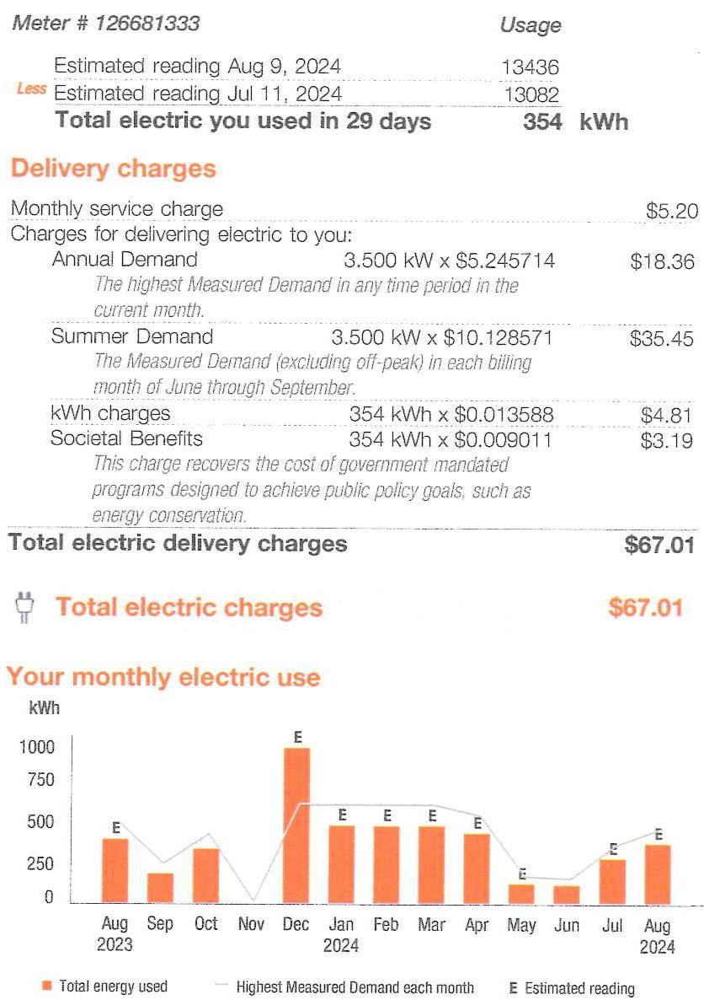

## 52-8060-78

## Your energy bill

## Message Center

This bill reflects BPU-approved changes in the Delivery portion of your electric bill effective on and after August 1, 2024. The increase in the Delivery portion of your bill is due to changes related to the Electric Conservation Incentive Program. The overall impact for business customers will vary by individual customer usage. Tariff information may also be found at pseg.com.

PSE\&G is connecting your business with the power to succeed. From energy-saving programs to convenient payment options and more, we are working hard to help your business run smoothly. Learn more at pseg.com/Business.

Don't fall victim to payment scams if you receive a phone call demanding immediate bill payment with a prepaid card or cash transfer app, it is a scam. When in doubt, hang up and call the number listed on your bill: 1-800-436-7734. For more information, visit pseg.com/ScamAlert.

## NEXT METER READING September 10, 2024

## How to contact us

## 1-855-BIZ-PSEG (249-7734)

Customer Service: 8am to 5:30pm Mon to Fri,
Closed on weekends and holidays
Emergencies / Outages / WorryFree Services: 24/7
TDD/TTY for the hearing impaired: 711
Visit pseg.com/myaccount to access your account anytime
Text us. Register for MyAlerts by texting REG to 4PSEG(47734)
$>$ Text OUT to report an outage.
facebook.com/pseg
twitter.com/psegdelivers

Bill date: August 14, 2024
For the period: July 12, 2024 to August 09, 2024

## - ST JOSEPHS HOME

## PO: SJ-22909

## ACCOUNT NUMBER

6731285218

## SERVICE ADDRESS

553 PAVONIA AVE SITE LTG JEREEY CITY NJ 07306-1803

## Your billing summary

## Balance remaining from your last bill

PSE\&G balance from last bill. (K 5200377) $\$ 60.31$
Balance remaining from your last bill (e) $\$ 60.31$
This month's charges and credits
Electric charges - PSE\&G
PSE\&G
Ple
Electric supply charges - Smartest Energy US LLC
This month's charges and credits
Total amount due by Aug 29, 2024
\$171.75

Page 1 of 4

## PSEG

We eater change work for you.

## PAY YOUR WAY, 24/7

We offer a variety of methods that make it easy to pay your bill. See reverse side for more information.

By checking this box, I authorize PSE\&G to initiate recurring ACH/Electronic
Debits using the bank account number on the enclosed check.

By checking this box, I authorize PSE\&G to enroll me in paperless billing at this email address:

$$
\begin{aligned}
& 007708000061608 \\
& 11111111111111111111111111111111111111111111111111111111111111111111111111111111111111111111111111111111111111111111
\end{aligned}
$$

$11111111111111111111111111111111111111111111111111111111111111$

## $1111111111111111111111111111111111111111111111111111$

PSE\&G CO
PO BOX 14444
NEW BRUNSWICK NJ 08906-4444

## Message Center (Continued from page 1)

Si desea recibir en español una notificación de desconexión del servicio, llame al 1-800-357-2262.
J.D. Power named PSE\&G \#1 for Residential and Business Customer Satisfaction among Large Electric utilities in the East Region. On behalf of the more than 12,000 PSEG employees who work hard every day, we thank you for rating us as a top utilities provider. For J.D. Power 2023 award information, visit jdpower.com/Awards.

At PSE\&G, we are committed to supporting your business needs. That's why we have a dedicated, toll-free phone number to address your energy questions and concerns. PSE\&G's Business Solutions Center is available Monday-Friday, 8:00 a.m. -5:30 p.m. at 1-855-249-7734 (1-855-BIZ-PSEG).

## Don't miss your meter reading

If you'll be away on your meter reading day, use our mobile app to upload a picture of your meter or enter your reading manually, or call 1-800-622-0197.

## Electric \& Gas Rate Information

For news about PSE\&G's rate filing and upcoming public hearings visit www.pseg.com/pseandgfilings. Under applicable tax law, the State Sales and Use Tax and corporate business tax are imposed upon the energy you have used.

# IT'S YOUR BILL. HOW YOU PAY IS YOUR CHOICE. 

My Account
Make a payment anytime
from a checking or savings account stored in My Account Visit psseg.com/ myaccount

Mobile: Download our Mobile App "PSE\&G"

Pay by text: Text PAY to 4PSEG (47734)

Voice: Ask Alexa or use Google Assistant

## Automatic Bill Pay

Automatic payments from your bank. Skip checks and stamps. Never worry about due dates.

## Enroll at:

pssg.com/autopay

Credit Card
Pay your bill with a credit card online or by phone. Because we don't use customer rates to subsidize the cost of this service, there is a fee.

## My Account:

pssg.com/myaccount
Phone:
1-833-277-8710

Phone
Bank Account: 1-800-552-7734

Credit Card: 1-833-277-8710

## $\square$ By Mail

Make your check payable to PSE\&G and write your account number on your check.

When you pay by check, you authorize PSE\&G to make a one-time electronic fund transfer from your account, in the amount of your check. If you prefer not to authorize us, call 1-800-436-PSEG.

## In Person

Payments are accepted at any customer service center or authorized location.

Locations can be found at: pssg.com/cac

Details of your electric charges
Your rate: General Lighting \& Power (GLP)

The image is a combination of a bill statement and a bar chart.

1. **Bill Statement Details:**
   - **Meter #**: 126681333
   - **Estimated reading Aug 9, 2024**: 13436
   - **Estimated reading Jul 11, 2024**: 13082
   - **Total electric you used in 29 days**: 354 kWh

   **Delivery charges:**
   - **Monthly service charge**: $5.20
   - **Annual Demand**: 3.500 kW x $5.245714 = $18.36
     - *The highest Measured Demand in any time period in the current month.*
   - **Summer Demand**: 3.500 kW x $10.128571 = $35.45
     - *The Measured Demand (excluding off-peak) in each billing month of June through September.*
   - **kWh charges**: 354 kWh x $0.013588 = $4.81
   - **Societal Benefits**: 354 kWh x $0.009011 = $3.19
     - *This charge recovers the cost of government mandated programs designed to achieve public policy goals, such as energy conservation.*

   **Total electric delivery charges**: $67.01

2. **Bar Chart Details:**
   - **Title**: Your monthly electric use
   - **Y-axis**: kWh
   - **X-axis**: Months from Aug 2023 to Aug 2024
   - **Legend**:
     - Orange bars: Total energy used
     - Line with "E": Highest Measured Demand each month
     - "E": Estimated reading

   **Data Points**:
   - Aug 2023: ~250 kWh
   - Sep 2023: ~150 kWh
   - Oct 2023: ~300 kWh
   - Nov 2023: ~500 kWh
   - Dec 2023: ~950 kWh
   - Jan 2024: ~600 kWh
   - Feb 2024: ~550 kWh
   - Mar 2024: ~500 kWh
   - Apr 2024: ~450 kWh
   - May 2024: ~200 kWh
   - Jun 2024: ~100 kWh
   - Jul 2024: ~150 kWh
   - Aug 2024: ~250 kWh

The chart provides a **yearly usage breakdown (monthly-based)**.

Visit MyAccount for more details regarding your energy usage.

## MEASURED DEMAND

Demand kW
3.50

Measured Demand is the maximum use of electricity at any time during a monthly time period, as measured by your meter.

## BILLED DEMAND

Annual Demand kW
3.50

Summer Demand kW
3.50

## SUPPLY CAPACITY

Generation kW
3.558

Transmission kW
2.872

Supply capacity is required to serve the system's annual peak usage. It represents your share of these facilities, in kilowatts (kW). It is calculated based on your peak usage from the previous summer. Supply capacity values are updated periodically throughout the year and are prorated based on your service period.

## Price to compare

You are currently buying your electricity from another supplier. If you had been purchasing your electric supply from PSE\&G, your cost would be $\$ 77.18$. This is your price to compare. It varies from month to month depending on your usage.

Your PoD ID is: PE000010374008078561 Your PoD ID is your Point of Delivery identification within PSE\&G's system.

# Electric supply charges - Smartest Energy US LLC 

Through the CHOICE Program, you have chosen to purchase electricity from Smartest Energy US LLC. If you have any questions about the electric supply charges below, please contact them directly at (600) 448-0995.

| Adjustments | $\$ 0.00$ |
| :-- | --: |
| Current charges | $\$ 44.43$ |

Total Smartest Energy US LLC \$44.43
Charges

