## (3) PSEG

We make things work for you.

## Your energy bill

Message Center
$53-8060-00078$
"SHUT-OFF NOTICE " *
1-800-357-2262 (Mon-Fri, 7:30 AM - 8:00 PM)
Your bill is now past due. Payment of $\$ 27,308.37$ must be received by $4 / 26 / 2024$ or service may be shut off. A security deposit may be required if late payments continue. A statement of customer rights and fees is shown on the reverse side.

SI en el futuro usted desea recibir la notificación de desconexión de servicio en español, por favor llame al 1-800-357-2262.

Know what's below. Call before you dig when starting a major project that involves digging! You or your contractor must call the New Jersey One-Call Center at 1-800-272-1000 or 811 three business-days before starting any work that involves digging. It's the law. Visit pseg.com/SafeDigging for more information.

## NEXT METER READING April 30, 2024

## How to contact us

## 1-855-BIZ-PSEG (249-7734)

Customer Service: 8am to 5:30pm Mon to Fri, Closed on weekends and holidays
Emergencies / Outages / WorryFree Services: 24/7
TTY for the hearing impaired: 1-800-225-0072
Visit pseg.com/myac count to access your account anytime
Text us. Register for MyAlerts by texting REG to 4PSEG(47734)
$>$ Text OUT to report an outage.
facebook.com/pseg
twitter.com/psegdelivers

## Shut-off notice

Total amount due
\$53,508.67
See shut-off notice below for payment details
Bill date: April 11, 2024
For the period: March 01, 2024 to March 31, 2024

## - ST JOSEPH HOME FOR THE BLIND PO: SJ-12137

ACCOUNT NUMBER
4200577402
SERVICE ADDRESS
537 PAVONIA AVE
JERSEY CITY NJ 07306-1803

## Your billing summary

## Balance remaining from your last bill

PSE\&G balance from last bill
Less: Payment received March 21, 2024 - thank you!
Balance remaining from your last bill

This month's charges and credits
Late payment charge
$4,737.11$
$21,048.11$
$26,200.31$
Total amount due by Apr 26, 2024
$21,048.11$
$24,737.11$
\$21,048.11
$26,200.31$
Total amount due by Apr 26, 2024
$53,508.67$

Page 1 of 4

## PSEG

We make things work for you.
PAY YOUR WAY, 24/7
We offer a variety of methods that make it easy to pay your bill. See reverse side for more information.

By checking this box, I authorize PSE\&G to initiate recurring ACH/Electronic Debits using the bank account number on the enclosed check.

000283000000279

ST JOSEPH HOME
FOR THE BLIND
537 PAVONIA AVE
JERSEY CITY NJ 07306-1803

Account number
Total amount due
See shut-off notice above for amount that must be paid to avoid shut-off.

Amount enclosed

000283000000279

ST JOSEPH HOME
FOR THE BLIND
537 PAVONIA AVE
JERSEY CITY NJ 07306-1803

## Details of your electric charges

Your rate: Large Power \& Lighting Secondary (LPLS)

## Meter \# 9207321

## Usage

Reading Mar 31, 2024
On-Peak Actual 25631
Reading Mar 1, 2024
Less On-Peak Actual 25428
Multiplier 800
Total On kWh 70,227
Total Off kWh 92,208
Total kWh
162,433
Delivery charges
Monthly service charge
Charges for delivering electric to you:
Annual Demand
The highest Measured Demand in any time period in the current month.
kWh - On-peak
Energy consumed between 8am-10pm, Monday to Friday.
kWh - Off-peak
Energy consumed outside peak hours.
Societal Benefits
162,433 kWh $\times \$ 0.008282$
This charge recovers the cost of government mandated programs designed to achieve public policy goals, such as energy consumption.

Total electric delivery charges
$\$ 4,737.10$
Total electric charges
$\$ 4,737.10$
Your monthly electric use kWh
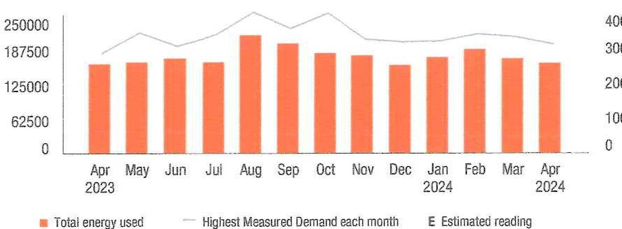

The image is a bar and line chart.

- **Chart Type**: Combination of bar and line chart.
- **X-Axis**: Months from April 2023 to April 2024.
- **Y-Axis (Left)**: Total energy used, ranging from 0 to 250,000.
- **Y-Axis (Right)**: Highest Measured Demand each month, ranging from 0 to 40.
- **Legend**:
  - Orange bars represent "Total energy used."
  - A gray line represents "Highest Measured Demand each month."
  - "E" indicates "Estimated reading."
- **Data Points**:
  - Bars show energy usage for each month, with a peak around August 2023.
  - The line shows the highest measured demand, peaking around August 2023 as well.
- **Yearly Usage Breakdown (Monthly-Based)**: The chart provides a monthly breakdown of energy usage and demand over a year.

Visit MyAccount for more details regarding your energy usage.

## MEASURED DEMAND

On-Peak kW 306.70
Off-Peak2 kW 260.80
Measured Demand is the maximum use of electricity at any time during a monthly time period, as measured by your meter.

## BILLED DEMAND

Annual Demand kW
306.70

## SUPPLY CAPACITY

Generation kW
Transmission kW
340.313

Supply capacity is required to serve the system's annual peak usage. It represents your share of these facilities, in kilowatts (kW). It is calculated based on your peak usage from the previous summer. Supply capacity values are updated periodically throughout the year and are prorated based on your service period.

## Price to compare

You are currently buying your electricity from another supplier. If you had been purchasing your electric supply from PSE\&G, your cost would be $\$ 17,795.90$. This is your price to compare. It varies from month to month depending on your usage.

Your PoD ID is: PE000008913350866006 -
Your PoD ID is your Point of Delivery identification within PSE\&G's system.

# Electric supply charges - Smartest Energy US LLC 

Through the CHOICE Program, you have chosen to purchase electricity from Smartest Energy US LLC. If you have any questions about the electric supply charges below, please contact them directly at (800) 448-0995.

Adjustments ..... $\$ 659.51$
Current charges ..... $\$ 20,388.59$
Total Smartest Energy US LLC ..... $\$ 21,048.10$
Charges

## $\int$ Shut-off notice

Total amount due
$\$ 18,151.73$
See shut-off notice below for payment details

Bill date: March 18, 2024
For the period: February 13, 2024 to March 14, 2024

## - ST JOSEPH HOME FOR THE BLIND

## PO: SJ-9663

ACCOUNT NUMBER
6622514003

## SERVICE ADDRESS

537 PAVONIA AVE
JERSEY CITY NJ 07306-1803

## Your billing summary

Balance remaining from your last bill
PSE\&G balance from last bill
Balance remaining from your last bill
$\$ 16,177.09$
$\$ 16,177.09$
This month's charges and credits
Gas charges - PSE\&G
This month's charges and credits
$\$ 1.974 .64$
Total amount due by Apr 2, 2024
$\$ 18,151.73$

Page 1 of 3

## (1) PSE\&G

To make things work for you.

## PAY YOUR WAY, 24/7

We offer a variety of methods that make it easy to pay your bill. See reverse side for more information.

By checking this box, i authority PSE\&G to initiate recurring ACH/Electronic
Debits using the bank account number on the enclosed check.

042507000053329
$\left.\right|^{\left|l_{1}\right|}\left|l_{1}\right|^{\left|l_{1}\right|}\left|l_{1}\right|^{\left|l_{1}\right|} \mid\left|l_{1}\right|^{\left|l_{1}\right|} \mid\left|l_{1}\right|^{\left|l_{1}\right|} \mid\left|l_{1}\right|^{\left|l_{1}\right|} \mid\left|l_{1}\right|^{\left|l_{1}\right|} \mid\left|l_{1}\right|$
$P$ SE\&G CO
PO BOX 14444
NEW BRUNSWICK NJ 08906-4444

# Details of your gas charges 

Your rate: Large Volume Gas (LVG)

| Meter \# 2643749 | Usage |
| :--: | :--: |
| Estimated reading Mar 14, 2024 | 14372 |
| Estimated reading Feb 12, 2024 | 11764 |
| Difference | 2,608 |
| Converted to CCF $\times 1.068$ | 2,785.866 |
| Converted to therms $\times 1.035$ | 2,883.371 |
| Total gas you used in 31 days | 2,883.371 therms |

## Delivery charges

| Monthly service charge |  | \$179.66 |
| :--: | :--: | :--: |
| Charges for delivering gas to you: |  |  |
| For the First | 548.000 |  |
| For the Next | 1,032.990 |  |
| For the Next | 452.000 |  |
| For the Next | 850.381 |  |
| Balancing Charge | 1,421.102 |  |
| Société Benefits | 2,883.371 |  |
| This charge recovers the cost of government mandated programs designed to achieve public policy goals, such as energy conservation. |  |  |

## Total gas delivery charges

## Supply charges

Cost of gas supplied by PSE\&G:
2,883.371 therms $\times \$ 0.494931$
Total gas supply charges
Total gas charges

## Your monthly gas use

The balancing charge includes pipeline, storage and other costs associated with seasonal peaks in usage. It applies from October to May.

## Price to compare

A history of PSE\&G's monthly Basic Gas Supply Service (BGSS) prices are located on our website at www.pseg.com.

Your PoD ID is: PG000007943247265992 -
Your PoD ID is your Point of Delivery identification within PSE\&G's system.

Visit MyAccount for more details regarding your energy usage.

## Your energy bill

Message Center 52-3660-00078
This bill reflects BPU-approved changes in the Delivery portion of your gas bill effective on and after April 1, 2024. The increase in the Delivery portion of your bill is due to changes in the Societal Benefits Charge. The overall impact for business customers will vary by individual customer usage. Tariff information can be found at pseg.com.

Know what's below. Call before you dig when starting a major project that involves digging! You or your contractor must call the New Jersey One-Call Center at 1-800-272-1000 or 811 three business-days before starting any work that involves digging. It's the law. Visit pseg.com/SafeDigging for more information.

PSE\&G is replacing hundreds of miles of gas pipes to ensure that our system can provide safe and reliable service for years to come. If you see our crews working in the street, please pardon any inconvenience. For a list of towns and streets where the work is taking place, go to pseg.com/GasWork.

## NEXT METER READING May 10, 2024

## How to contact us

## 1-855-BIZ-PSEG (249-7734)

Customer Service: 8am to 5:30pm Mon to Fri,
Closed on weekends and holidays
Emergencies / Outages / WorryFree Services: 24/7
TTY for the hearing impaired: 1-800-225-0072
Visit pseg.com/myaccount to access your account anytime
Text us. Register for MyAlerts by texting REG to 4PSEG(47734)
$>$ Text OUT to report an outage.
facebook.com/pseg
twitter.com/psegdelivers

Bill date: April 15, 2024
For the period: March 12, 2024 to April 11, 2024

## - ST JOSEPH HOME FOR THE BLIND PO: SJ-11819

ACCOUNT NUMBER
6622514003

## SERVICE ADDRESS

537 PAVONIA AVE
JERSEY CITY NJ 07306-1803

## Your billing summary

## Balance remaining from your last bill

PSE\&G balance from last bill
$\$ 18,151.73$
Less Payment received - thank you!
Balance remaining from your last bill
\$0.00

This month's charges and credits
Late payment charge
\$269.96
Pise Gas charges - PSE\&G
This month's charges and credits
Total amount due by Apr 30, 2024
\$5,041.17
\$5,311.13
\$5,311.13

Page 1 of 4

## PSE\&G

160 medle things work for you.
PAY YOUR WAY, 24/7
We offer a variety of methods that make it easy to pay your bill. See reverse side for more information.

By checking this box, I authorize PSE\&G to initiate recurring ACH/Electronic Debits using the bank account number on the enclosed check.

By checking this box, I authorize PSE\&G to enroll me in paperless billing at this email address:

049454000054374
IIIIIIIIIIIIIIIIIIIIIIIIIIIIIIIIIIIIIIIIIIIIII
ST JOSEPH HOME
FOR THE BLIND
537 PAVONIA AVE
JERSEY CITY NJ 07306-1803

Account number
Total amount due by Apr 30, 2024
\$5,311.13
$10[11] 11] 11] 11] 11] 11] 11] 11] 11] 11] 11] 11] 11] 11] 11] 11] 11] 11] 11] 11] 11] 11] 11] 11] 11] 11] 11] 11] 11] 11] 11] 11] 11] 11] 11] 11] 11] 11] 11] 11] 11] 11] 11] 11] 11] 11] 11] 11] 11] 11] 

## Details of your gas charges

Your rate: Large Volume Gas (LVG)

## Meter \# Combined

Total meter usage
Converted to therms $\times 1,035$
Total gas you used.

| Usage |  |
| :-- | :-- |
| 5,634.601 |  |
| 5,831.811 |  |
| 5,831.811 therms |  |

| Meter | Apr 10 | Mar 11 | Difference | Multiplier | Conversion   Factor | Usage |
| :--: | :--: | :--: | :--: | :--: | :--: | :--: |
| 5458718 | 22129 | 18781 | 3.348 |  | 1.0120 | 3388.176 |
| 5458712 | 14045 | 11942 | 2.103 |  | 1.0682 | 2248.425 |

## Delivery charges

Monthly service charge
Charges for delivering gas to you:

| For the First | 1,000.000 therms $\times \$ 0.020690$ | $\$ 20.69$ |
| :-- | --: | --: |
| For the Next | $4,831.811 \mathrm{therms} \times \$ 0.038861$ | $\$ 187.77$ |
| Balancing Charge | 5,349.660 therms $\times \$ 0.097915$ | $\$ 523.81$ |
| Societal Benefits | 5,831.811 therms $\times \$ 0.055233$ | $\$ 322.11$ |
| This charge recovers the cost of government mandated programs designed to achieve public policy goals, such as energy conservation. |  |  |

Total gas delivery charges
$\$ 1,234.04$

## Supply charges

Cost of gas supplied by PSE\&G:
5,831.811 therms $\times \$ 0.439047$
Total gas supply charges
Total gas charges
$\$ 2,560.44$
$\$ 3,794.48$

## Your monthly gas use

Thems
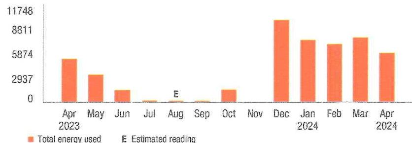

The image is a bar chart showing a **yearly usage breakdown (monthly-based)** of gas consumption from April 2023 to April 2024. 

- **Y-axis**: Represents energy usage with units marked at 0, 2937, 5874, 8811, and 11748.
- **X-axis**: Lists months from April 2023 to April 2024.
- **Legend**: 
  - Orange bars indicate "Total energy used."
  - "E" denotes "Estimated reading."

**Data Points**:
- April 2023: High usage
- May 2023: Moderate usage
- June to September 2023: Low usage
- October 2023: Slight increase
- November 2023: Significant increase
- December 2023: Peak usage
- January to March 2024: High usage
- April 2024: Moderate usage

The chart uses orange bars to represent the data, with an "E" marking the estimated reading for August.

Visit MyAccount for more details regarding your energy usage.

## About the balancing charge

The balancing charge includes pipeline, storage and other costs associated with seasonal peaks in usage. It applies from October to May.

## Price to compare

A history of PSE\&G's monthly Basic Gas Supply Service (BGS) prices are located on our website at www.psag.com.

Your PoD ID is: PG000007943246465992 Your PoD ID is your Point of Delivery Identification within PSE\&G's system.

## Details of your gas charges

Your rate: Large Volume Gas (LVG)

| Meter \# 2643749 | Usage |
| :--: | :--: |
| Actual reading Apr 11, 2024 | 16112 |
| Less | Estimated reading Mar 14, 2024 |
| Difference | 1,740 |
| Converted to CCF $\times 1.068$ | $1,858.668$ |
| Converted to therma $\times 1.035$ | $1,923.721$ |
| Total gas you used in 28 days | 1,923.721 therms |

## Delivery charges

| Monthly service charge |  | $\$ 179.66$ |
| :--: | :--: | :--: |
| Charges for delivering gas to you: |  |  |
| For the First | 1,000.000 |  |
| For the Next | 923.721 |  |
| Balancing Charge | 602.952 |  |
| Societal Benefits | 1,923.721 |  |
| Total gas delivery charges |  | \$402.95 |

Supply charges
Cost of gas supplied by PSE\&G:

| Total gas supply charges | $\$ 843.74$ |
| :-- | :-- |
| Total gas charges | $\$ 1,246.69$ |

Your monthly gas use
The balancing charge includes pipeline, storage and other costs associated with seasonal peaks in usage. It applies from October to May.

## Price to compare

A history of PSE\&G's monthly Basic Gas Supply Service (BSSS) prices are located on our website at www.pseg.com.

Your PoD ID is: PG000007943247265992 Your PoD ID is your Point of Delivery identification within PSE\&G's system.

Visit MyAccount for more details regarding your energy usage.

# Payments 

| Payment - Thank You | Apr 11, 2024 | - $\$ 8,619.73$ |
| :-- | :--: | :--: |
| Payment - Thank You | Apr 1, 2024 | - $\$ 9,532.00$ |
| Total payments | $\$ 18,151.73$ CR |  |

## Your energy bill

## Message Center

This bill reflects BPU-approved changes in the Delivery portion of your electric bill effective on and after March 1, 2024. The increase in the Delivery portion of your bill is due to changes in the Tax Adjustment Credit. The overall impact for business customers will vary by individual customer usage. Tariff information may also be found at pseg.com.

The success of your business is important to us. We are working hard to make it easier to do business with us. To learn more about how we can help, visit pseg.com/Business.

Don't wait for the mail - go paperless! With Paperless Billing, you'll get a monthly email showing your bill amount and due date, with the ability to view or print your current and past bills anytime, anywhere. To sign up, log in to My Account at pseg.com, and select "Paperless Billing."

## NEXT METER READING April 11, 2024

## How to contact us

## 1-855-BIZ-PSEG (249-7734)

Customer Service: 8am to 5:30pm Mon to Fri,
Closed on weekends and holidays
Emergencies / Outages / WorryFree Services: 24/7
TTY for the hearing impaired: 1-800-225-0072
Visit pseg.com/myaccount to access your account anytime
Text us. Register for MyAlerts by texting REG to 4PSEG(47734)
$>$ Text OUT to report an outage.
facebook.com/pseg
twitter.com/psegdelivers

Bill date: March 19, 2024
For the period: February 13, 2024 to March 14, 2024

## - ST JOSEPHS HOME PO: SJ-10276

## AOCOUNT NUMBER

6731285218

## SERVICE ADDRESS

553 PAVONIA AVE SITE LTG
JERSEY CITY NJ 07306-1803

## 52-8060-00078

## Your billing summary

## Balance remaining from your last bill

PSE\&G balance from last bill
Lover Payment received February 26, 2024 - thank you!
\$199.84
\$98.59
Balance remaining from your last bill
This month's charges and credits
Late payment charge
Plae Electric charges - PSE\&G
Plae Electric supply charges - Smartest Energy US LLC
This month's charges and credits
Total amount due by Apr 3, 2024
\$1.40
\$41.01
\$57.49
\$99.90
\$201.15

Page 1 of 4

## PSEG

To make things work for you.

## PAY YOUR WAY, 24/7

We offer a variety of methods that make it easy to pay your bill. See reverse side for more information.

By checking this box, I authorize PSE\&G to initiate recurring ACH/Electronic Debits using the bank account number on the enclosed check.

By checking this box, I authorize PSE\&G to enroll me in paperless billing at this email address:

001345000079819
H[H|H|H|H|H|H|H|H|H|H|H|H|H|H|H|H|H|H|H|H|H| H| H| H| H| H| H| H|

ST JOSEPHS HOME
537 PAVONIA AVE
JERSEY CITY NJ 07306-1803

Account number
Total amount due by Apr 3, 2024
\$201.15

Amount enclosed
$\mathrm{H}^{\mathrm{H}} \mathrm{H}_{\mathrm{H}} \mathrm{H}_{\mathrm{H}} \mathrm{H}_{\mathrm{H}}^{\mathrm{H}} \mathrm{H} \mathrm{H} \mathrm{H}_{\mathrm{H}} \mathrm{H}_{\mathrm{H}} \mathrm{H}^{\mathrm{H}} \mathrm{H}_{\mathrm{H}}^{\mathrm{H}} \mathrm{H}_{\mathrm{H}} \mathrm{H}^{\mathrm{H}} \mathrm{H}_{\mathrm{H}} \mathrm{H}_{\mathrm{H}}^{\mathrm{H}} \mathrm{H}_{\mathrm{H}}^{\mathrm{H}} \mathrm{H}^{\mathrm{H}} \mathrm{H}^{\mathrm{H}} \mathrm{H}^{\mathrm{H}} \mathrm{H}^{\mathrm{H}} \mathrm{H}^{\mathrm{H}} \mathrm{H}^{\mathrm{H}} \mathrm{H}^{\mathrm{H}} \mathrm{H}^{\mathrm{H}} \mathrm{H}^{\mathrm{H}} \mathrm{H}^{\mathrm{H}} \mathrm{H}^{\mathrm{H}} \mathrm{H}^{\mathrm{H}} \mathrm{H}^{\mathrm{H}} \mathrm{H}^{\mathrm{H}}$

PO BOX 14444
NEW BRUNSWICK NJ 08906-4444

## Details of your electric charges

Your rate: General Lighting \& Power (GLP)
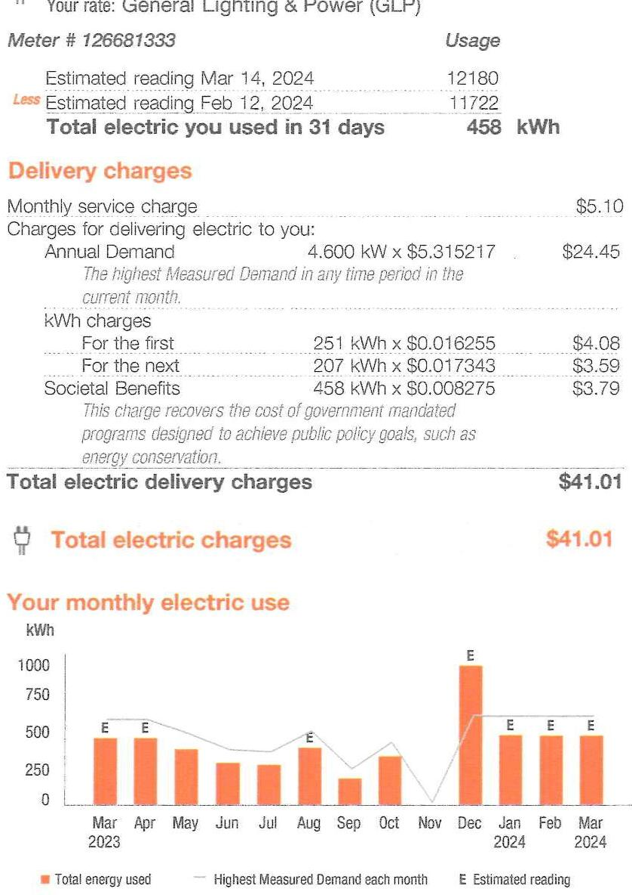

The image is a combination of a bill statement and a bar chart.

The bill statement includes the following text:

- "Your rate: General Lighting & Power (GLP)"
- "Meter # 126681333"
- "Estimated reading Mar 14, 2024 12180"
- "Less Estimated reading Feb 12, 2024 11722"
- "Total electric you used in 31 days 458 kWh"
- "Delivery charges"
- "Monthly service charge $5.10"
- "Charges for delivering electric to you:"
- "Annual Demand 4.600 kW x $5.315217 $24.45"
- "The highest Measured Demand in any time period in the current month."
- "kWh charges"
- "For the first 251 kWh x $0.016255 $4.08"
- "For the next 207 kWh x $0.017343 $3.59"
- "Societal Benefits 458 kWh x $0.008275 $3.79"
- "This charge recovers the cost of government mandated programs designed to achieve public policy goals, such as energy conservation."
- "Total electric delivery charges $41.01"
- "Total electric charges $41.01"

The bar chart shows "Your monthly electric use" with the y-axis labeled "kWh" ranging from 0 to 1000. The x-axis lists months from "Mar 2023" to "Mar 2024." 

Data points for each month are represented as bars, with some months marked with an "E" for estimated readings. The chart includes a legend indicating "Total energy used" and "Highest Measured Demand each month." 

Notable styling includes the use of orange for headings and bars, and the estimated readings are marked with an "E" above the bars.

Visit MyAccount for more details regarding your energy usage.

## MEASURED DEMAND

Demand kW
4.60

Measured Demand is the maximum use of electricity at any time during a monthly time period, as measured by your meter.

## BILLED DEMAND

Annual Demand kW
4.60

## SUPPLY CAPACITY

Generation kW
3.319

Transmission kW
2.872

Supply capacity is required to serve the system's annual peak usage. It represents your share of these facilities, in kilowatts (kW). It is calculated based on your peak usage from the previous summer. Supply capacity values are updated periodically throughout the year and are prorated based on your service period.

## Price to compare

You are currently buying your electricity from another supplier. If you had been purchasing your electric supply from PSE\&G, your cost would be $\$ 77.22$. This is your price to compare. It varies from month to month depending on your usage.

Your PoD ID is: PE000010374008078561 Your PoD ID is your Point of Delivery Identification within PSE\&G's system.

# Electric supply charges - Smartest Energy US LLC 

Through the CHOICE Program, you have chosen to purchase electricity from Smartest Energy US LLC. If you have any questions about the electric supply charges below, please contact them directly at (800) 448-0995.

Adjustments
\$0.00
Current charges
\$57.49

Total Smartest Energy US LLC
\$57.49
Charges

## 

The image is a logo or emblem featuring a circular design with a sunburst pattern in orange and white. There is no text or additional elements present in the image.

We make things work for you.

## Your energy bill

Message Center 52-3050-00074

*     * SHUT-OFF NOTICE * * 1-800-357-2262 (Mon-Fri, 7:30 AM - 8:00 PM)

Your service is currently in danger of being shut off. $\$ 509.78$ is due immediately. Note further that an additional $\$ 809.97$ is now past due and must be paid by $4 / 30 / 2024$ or $\$ 1,319.75$ will be required to avoid shut off. A statement of customer rights and fees is shown on the reverse side.

Si en el futuro usted desea recibir la notificación de desconexión de servicio en español, por favor llame al 1-800-357-2262.

*     * METER READING NOTICE * *

In order to provide safe and reliable service, and ensure accurate bills, we must be able to read your meter. Please make every possible effort to provide us access to read the meter on your next scheduled meter reading date (displayed on your bill).

NEXT METER READING May 10, 2024

## How to contact us

## 1-800-436-PSEG (7734)

Customer Service: 7am to 8pm Mon-Fri
Emergencies / Outages / WorryFree Services: 24/7
TTY for the hearing impaired: 1-800-225-0072
Visit pseg.com/myaccount to access your account anytime
Text us. Register for MyAlerts by texting REG to 4PSEG(47734)
$>$ Text OUT to report an outage.
facebook.com/pseg
twitter.com/psegdelivers

## 3

## 

The image is a photo or illustration showing a section of a document or flyer. It includes a partial view of a telephone icon followed by the text "How to" and a partial phone number "1-8". The background is a grayish color, and the text is white. The image appears to be cropped, showing only a fragment of the full content.

We offer a variety of methods that make it easy to pay your bill. See reverse side for more information.

By checking this box, I authorize PSE\&G to initiate recurring ACH/Electronic
Debits using the bank account number on the enclosed check.

## 046298000055691

$\eta \mid \eta \mid \eta \mid \eta \mid \eta \mid \eta \mid \eta \mid \eta \mid \eta \mid \eta \mid \eta \mid \eta \mid \eta \mid \eta \mid \eta \mid \eta \mid \eta \mid \eta \mid \eta \mid \eta \mid \eta \mid \eta \mid \eta \mid \eta \mid$
ST JOSEPH HOME
FOR THE BLIND
POR THE BLIND
POR THE BLIND
$P 0: S J-11819$

## 4

## SERVICE ADDRESS

257 BALDWIN AVE
JERSEY CITY NJ 07306-1317

## Fobticsing

Apr. curren't

## Snapshot of what you owe

See page 2 for details
Balance remaining from your last bill
Pise This month's charges and credits
Total amount due by Apr 30, 2024
\$1,319.75
$5683.11$
\$2,002.86

How much energy you're using
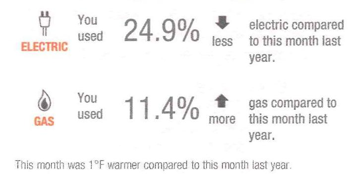

The image is a photo or illustration showing a comparison of energy usage. It includes two sections:

1. **Electric Usage**:
   - Icon: Electric plug
   - Text: "You used 24.9% less electric compared to this month last year."
   - Arrow: Downward

2. **Gas Usage**:
   - Icon: Gas drop
   - Text: "You used 11.4% more gas compared to this month last year."
   - Arrow: Upward

At the bottom, there is a note: "This month was 1°F warmer compared to this month last year."

This month was $1^{\circ} \mathrm{F}$ warmer compared to this month last year.

Page 1 of 5

Account number
Total amount due
See shut-off notice above for amount that must be paid to avoid shut-off.

Amount enclosed

046298000055691
$\eta \mid \eta \mid \eta \mid \eta \mid \eta \mid \eta \mid \eta \mid \eta \mid \eta \mid \eta \mid \eta \mid \eta \mid \eta \mid \eta \mid \eta \mid \eta \mid \eta \mid \eta \mid \eta \mid \eta \mid \eta \mid$
ST JOSEPH HOME
FOR THE BLIND
537 PAVONIA AVE
JERSEY CITY NJ 07306-1803

## 7276043207

\$2,002.86
See shut-off notice above for amount that must be paid to avoid shut-off.

Amount enclosed

# Balance remaining from your last bill 

| PSE\&G balance from last bill | \$2,958.48 |
| :--: | :--: |
| Less Payment received - thank you! | - $\$ 1,648.73$ |
| Balance remaining from your last bill | \$1,319.75 |

## This month's charges and credits

| Gas charges - PSE\&G | $\$ 442.40$ |
| :--: | :--: |
| Electric charges - PSE\&G | $\$ 240.71$ |
| This month's charges and credits | \$683.11 |
| Total amount due by Apr 30, 2024 | \$2,002.86 |

If you or any member of your household rely on electricity to operate life sustaining equipment, please notify PSE\&G. For more information, visit pseg.com/life or call 1-800-436-PSEG.

This bill reflects BPU-approved changes in the Supply and Delivery portions of your electric bill, effective on and after April 1, 2024. The decrease in the Supply portion of your bill is due to changes in the Transmission Charge. The increase in the Delivery portion of your bill is due to changes in the Societal Benefits Charge, offset by a decrease in the Solar Pilot Recovery Charge. As a result of these changes, a typical residential customer who receives electric Supply from PSE\&G and uses 577 kilowatt-hours in an average month, will see no change in their bill. Tariff information may also be found by visiting pseg.com.

This bill reflects BPU-approved changes in the Delivery portion of your gas bill, effective on and after April 1, 2024. The increase in the Delivery portion of your bill is due to changes in the Societal Benefits Charge. As a result of these changes, a typical residential customer who receives gas Supply from PSE\&G and uses 87 therms in an average month, will see an average monthly increase of $\$ 1.06$, or approximately $1.12 \%$. Tariff information can be found at pseg.com.

If you are struggling to pay your bill, help is available! You can apply for the Low-income Home Energy Assistance Program (LIHEAP) and the Universal Service Fund (USF) at the same time with one application. Visit pseg.com/EnergyAssistance or call 1-800-510-3102 (Mon.-Fri. 8 a.m. to 8 p.m.) to find a local agency where you can apply in person.

Know what's below. Call before you dig when starting a major project that involves digging! You or your contractor must call the New Jersey One-Call Center at 1-800-272-1000 or 811 three business-days before starting any work that involves digging. It's the law. Visit pseg.com/SafeDigging for more information.

PSE\&G is replacing hundreds of miles of gas pipes to ensure that our system can provide safe and reliable service for years to come. If you see our crews working in the street, please pardon any inconvenience. For a list of towns and streets where the work is taking place, go to pseg.com/GasWork.

Are you concerned that an aging, ill or disabled family member could forget a PSE\&G bill payment? Our Third-Party Notification Program will let you know if a loved one's bill is late. To sign up or for more information, call 1-800-436-PSEG (7734).

Save big with appliance rebates from PSE\&G. Shop our local retail partners to find the latest ENERGY STARIB certified products. Visit pseg.com/Rebates to learn how you can upgrade and save today!

Service at the speed of life! We provide a variety of self-service tools so you can easily manage your account whenever and wherever you want - online from any device,
2346 \$8 through our app, or even by text. Visit pseg.com/Go to learn how.

## Don't miss your meter reading

If you'll be away on your meter reading day, use our mobile app to upload a picture of your meter or enter your reading manually, or call 1-800-622-0197.

## Electric \& Gas Rate Information

For news about PSE\&G's rate filing and upcoming public hearings visit www.pseg.com/paeandglifings. Under applicable tax law, the State Sales and Use Tax and corporate business tax are imposed upon the energy you have used.

Details of your gas charges
Your rate: Residential Service Gas-Heating - RSG (HTG)

| Meter \# 4021236 | Usage |
| :--: | :--: |
| Estimated reading Apr 11, 2024 | 2608 |
| Less Estimated reading Mar 12, 2024 | 2202 |
| Difference | 406 |
| Converted to CCF $\times 1.012$ | 410.872 |
| Converted to therms $\times 1.035$ | 425.253 |
| Total gas you used in 30 days | 425.253 therms |

Delivery charges
Monthly service charge
$\$ 8.62$
Charges for delivering gas to your

| For the First | 296.420 therms $\times \$ 0.532960$ | $\$ 157.98$ |
| :-- | :-- | --: |
| For the Next | 128.833 therms $\times \$ 0.545202$ | $\$ 70.24$ |
| Balancing Charge | 372.930 therms $\times \$ 0.097927$ | $\$ 36.52$ |

Total gas delivery charges
$\$ 273.36$
Supply charges
Cost of gas supplied by PSE\&G:

| Total gas supply charges | $\$ 169.04$ |
| :-- | :-- |
| (4) Total gas charges | $\$ 442.40$ |

How much gas are you using?
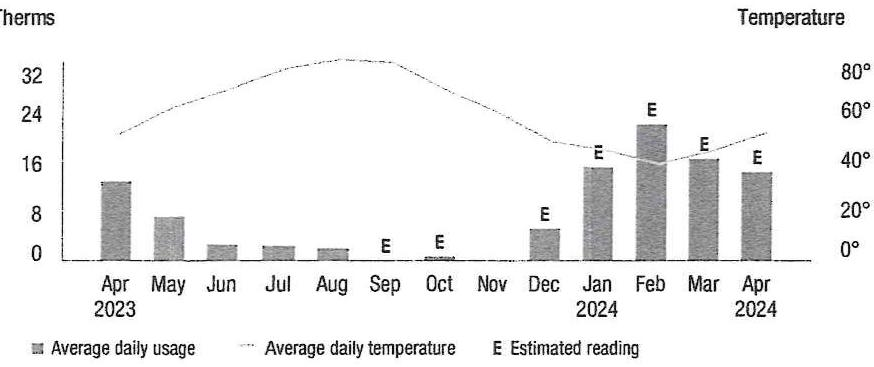

The image is a graph/chart.

- **Chart Type**: Combination bar and line chart.
- **Y-Axis (Left)**: Therms
- **Y-Axis (Right)**: Temperature (°F)
- **X-Axis**: Months from April 2023 to April 2024
- **Legend Entries**:
  - Gray bars: Average daily usage
  - Dashed line: Average daily temperature
  - "E": Estimated reading
- **Data Points**:
  - April 2023: Usage around 16 therms
  - May 2023: Usage around 10 therms
  - June to September 2023: Usage close to 0 therms
  - October 2023: Usage slightly above 0 therms, marked as estimated
  - November 2023: Usage slightly above 0 therms
  - December 2023: Usage around 4 therms, marked as estimated
  - January 2024: Usage around 20 therms, marked as estimated
  - February 2024: Usage around 28 therms, marked as estimated
  - March 2024: Usage around 24 therms, marked as estimated
  - April 2024: Usage around 20 therms, marked as estimated
- **Temperature Line**: Peaks around July 2023 and dips around January 2024.
- **Yearly Usage Breakdown (Monthly-Based)**: The chart shows monthly gas usage and temperature trends over a year.

Visit MyAccount for more details regarding your energy usage.

## Explaining gas charges

We measure the volume of gas you use in cubic feet (CCF) and then convert it to therms.
If you used a standard gas clothes dryer, it would take about 6 hours to equal 1 therm of energy.

## About the balancing charge

The balancing charge includes pipeline, storage and other costs associated with seasonal peaks in usage. It applies from October to May.

## Price to compare

If you want to consider getting your gas supply from another supplier, you can compare their price with ours. This month, your cost for gas supply is $\$ 169.04$ (or an average of 0.38750454 per therm). This price to compare varies from month to month, depending on your usage.

Your PoD ID is: PG000009401655766008 Your PoD ID is your Point of Delivery identification within PSE\&G's system. You will need this number if you are considering enrolling with another supplier.

Details of your electric charges
Your rate: Residential Service (RS)
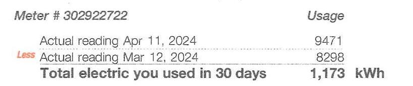

The image is a photo of a section from an electric bill detailing usage information. It includes the following text:

- "Meter # 302922722"
- "Usage"
- "Actual reading Apr 11, 2024" with a reading of "9471"
- "Less Actual reading Mar 12, 2024" with a reading of "8298"
- "Total electric you used in 30 days" is "1,173 kWh"

# Delivery charges 

Monthly service charge
$\$ 4.95$
Charges for delivering electric to you:
kWh charges

| For the first | 380 kWh $\times \$ 0.051763$ | $\$ 19.67$ |
| :-- | :-- | --: |
| For the next | 362 kWh $\times \$ 0.051740$ | $\$ 18.73$ |
| For the next | 220 kWh $\times \$ 0.052455$ | $\$ 11.54$ |
| For the next | 211 kWh $\times \$ 0.052464$ | $\$ 11.07$ |
| Total electric delivery charges |  | $\$ 65.96$ |

Supply charges
Cost of electric supplied by PSE\&G:
Charges

| For the first | 380 kWh $\times \$ 0.144947$ | $\$ 55.08$ |
| :-- | :-- | --: |
| For the next | 362 kWh $\times \$ 0.154696$ | $\$ 56.00$ |
| For the next | 220 kWh $\times \$ 0.147727$ | $\$ 32.50$ |
| For the next | 211 kWh $\times \$ 0.147725$ | $\$ 31.17$ |

Total electric supply charges
$\$ 174.75$
$\mathrm{M}_{\mathrm{g}}$
Total electric charges
$\$ 240.71$

How much electric are you using?
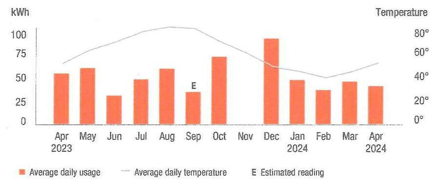

The image is a graph/chart.

- **Chart Type**: Bar and line chart.
- **Axes**:
  - Y-axis (left): "kWh" (for average daily usage).
  - Y-axis (right): "Temperature" (in degrees, ranging from 0° to 80°).
  - X-axis: Monthly timeline from "Apr 2023" to "Apr 2024".
- **Legend**:
  - Orange bars represent "Average daily usage".
  - Gray line represents "Average daily temperature".
  - "E" indicates an "Estimated reading".
- **Data Points**:
  - April 2023: Usage around 50 kWh.
  - May 2023: Usage around 75 kWh.
  - June 2023: Usage around 30 kWh.
  - July 2023: Usage around 50 kWh.
  - August 2023: Usage around 60 kWh.
  - September 2023: Usage around 30 kWh (marked with "E").
  - October 2023: Usage around 75 kWh.
  - November 2023: Usage around 50 kWh.
  - December 2023: Usage around 90 kWh.
  - January 2024: Usage around 50 kWh.
  - February 2024: Usage around 40 kWh.
  - March 2024: Usage around 50 kWh.
  - April 2024: Usage around 60 kWh.
- **Temperature Line**: Peaks around July 2023 and decreases towards December 2023, then rises again towards April 2024.
- **Yearly Usage Breakdown (Monthly-Based)**: The chart provides a visual representation of monthly average daily usage and temperature trends over the year.

Visit MyAccount for more details regarding your energy usage.

## Payments

| Payment - Thank You | Apr 11, 2024 | - $\$ 809.97$ |
| :-- | :-- | :-- |
| Payment - Thank You | Mar 21, 2024 | - $\$ 838.76$ |

## $246-88$

## PSIEG

We make things work for you.

## P0: SJ-9151

## Your energy bill

## Message Center

## 52- $87 / 1-03098$

1-800-357-2262 (Mon-Fri, 7:30 AM - 8:00 PM)
Your service is currently in danger of being shut off. $\$ 1,319.75$ is due immediately. Note further that an additional $\$ 838.76$ is now past due and must be paid by $4 / 1 / 2024$ or $\$ 2,158.51$ will be required to avoid shut off. A statement of customer rights and fees is shown on the reverse side.

Si en el futuro usted desea recibir la notificación de desconexión de servicio en español, por favor llame al 1-800-357-2262.

If you or any member of your household rely on electricity to operate life sustaining equipment, please notify PSE\&G. For more information, visit pseg.com/life or call 1-800-436-PSEG.

## NEXT METER READING April 11, 2024

## How to contact us

## 1-800-436-PSEG (7734)

Customer Service: 7am to 8pm Mon-Fri
Emergencies / Outages / WorryFree Services: 24/7
TTY for the hearing impaired: 1-800-225-0072
Visit pseg.com/myaccount to access your account anytime
Text us. Register for MyAlerts by texting REG to 4PSEG(47734)
$>$ Text OUT to report an outage.
facebook.com/pseg
twitter.com/psegdelivers

## - Shut-off notice

Total amount due

Bill date: March 14, 2024
For the period: February 10, 2024 to March 12, 2024

## - ST JOSEPH HOME FOR THE BLIND

## ACCOUNT NUMBER

7276043207

## SERVICE ADDRESS

257 BALDWIN AVE
JERSEY OTY NJ 07306-1317

## Brapshot of what you owe

See page 2 for details
Balance remaining from your last bill
This month's charges and credits
Total amount due by Apr 1, 2024
\$809.97
\$2,968.48

## How much energy you're using

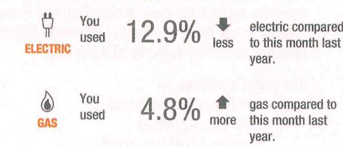

The image is a photo/illustration showing a comparison of energy usage. 

- **Electric Usage**: 
  - "You used 12.9% less electric compared to this month last year."
  - An icon of an electric plug is present.
  - A downward arrow indicates a decrease.

- **Gas Usage**: 
  - "You used 4.8% more gas compared to this month last year."
  - An icon of a gas drop is present.
  - An upward arrow indicates an increase.

The text is styled with "ELECTRIC" and "GAS" in orange, and the percentage changes are bolded.

This month was $1^{\circ} \mathrm{F}$ colder compared to this month last year.

Page 1 of 5

## $\$ 2,158.51$

Account number
Total amount due
See shut-off notice above for amount that must be paid to avoid shut-off.

Amount enclosed

031387000064262
$\mathrm{f} / \mathrm{l} / \mathrm{q} / \mathrm{q} / \mathrm{p} / \mathrm{u} / \mathrm{l} / \mathrm{l} / \mathrm{l} / \mathrm{q} / \mathrm{l} / \mathrm{u} / \mathrm{l} / \mathrm{l} / \mathrm{l} / \mathrm{l} / \mathrm{l} / \mathrm{l} / \mathrm{u} / \mathrm{l} / \mathrm{u} / \mathrm{l} / \mathrm{l} / \mathrm{u} / \mathrm{l} / \mathrm{u} / \mathrm{l} / \mathrm{u} / \mathrm{l} / \mathrm{u} / \mathrm{l} / \mathrm{u} / \mathrm{l} / \mathrm{u} / \mathrm{l} / \mathrm{u} / \mathrm{l} / \mathrm{u} / \mathrm{l} / \mathrm{u} / \mathrm{l} / \mathrm{u} / \mathrm{l} / \mathrm{u} / \mathrm{l} / \mathrm{u} / \mathrm{l} / \mathrm{u} / \mathrm{l} / \mathrm{u} / \mathrm{l} / \mathrm{u} / \mathrm{l} / \mathrm{u} / \mathrm{l} / \mathrm{u} / \mathrm{l} / \mathrm{u} / \mathrm{l} / \mathrm{u} / \mathrm{l} / \mathrm{u} / \mathrm{l} / \mathrm{u} / \mathrm{l} / \mathrm{u} / \mathrm{l} / \mathrm{u} / \mathrm{l} / \mathrm{u} / \mathrm{l} / \mathrm{u} / \mathrm{l} / \mathrm{u} / \mathrm{l} / \mathrm{u} / \mathrm{l} / \mathrm{u} / \mathrm{l} / \mathrm{u} / \mathrm{l} / \mathrm{u} / \mathrm{l} / \mathrm{u} / \mathrm{l} / \mathrm{u} / \mathrm{l} / \mathrm{u} / \mathrm{l} / \mathrm{u} / \mathrm{l} / \mathrm{u} / \mathrm{l} / \mathrm{u} / \mathrm{l} / \mathrm{u} / \mathrm{l} / \mathrm{u} / \mathrm{l} / \mathrm{u} / \mathrm{l} / \mathrm{u} / \mathrm{l} / \mathrm{u} / \mathrm{l} / \mathrm{u} / \mathrm{l} / \mathrm{u} / \mathrm{l} / \mathrm{u} / \mathrm{l} / \mathrm{u} / \mathrm{l} / \mathrm{u} / \mathrm{l} / \mathrm{u} / \mathrm{l} / \mathrm{u} / \mathrm{l} / \mathrm{u} / \mathrm{l} / \mathrm{u} / \mathrm{l} / \mathrm{u} / \mathrm{l} / \mathrm{u} / \mathrm{l} / \mathrm{u} / \mathrm{l} / \mathrm{u} / \mathrm{l} / \mathrm{u} / \mathrm{l} / \mathrm{u} / \mathrm{l} / \mathrm{u} / \mathrm{l} / \mathrm{u} / \mathrm{l} / \mathrm{u} / \mathrm{l} / \mathrm{u} / \mathrm{l} / \mathrm{u} / \mathrm{l} / \mathrm{u} / \mathrm{l} / \mathrm{u} / \mathrm{l} / \mathrm{u} / \mathrm{l} / \mathrm{u} / \mathrm{l} / \mathrm{u} / \mathrm{l} / \mathrm{u} / \mathrm{l} / \mathrm{u} / \mathrm{l} / \mathrm{u} / \mathrm{l} / \mathrm{u} / \mathrm{l} / \mathrm{u} / \mathrm{l} / \mathrm{u} / \mathrm{l} / \mathrm{u} / \mathrm{l} / \mathrm{u} / \mathrm{l} / \mathrm{u} / \mathrm{l} / \mathrm{u} / \mathrm{l} / \mathrm{u} / \mathrm{l} / \mathrm{u} / \mathrm{l} / \mathrm{u} / \mathrm{l} / \mathrm{u} / \mathrm{l} / \mathrm{u} / \mathrm{l} / \mathrm{u} / \mathrm{l} / \mathrm{u} / \mathrm{l} / \mathrm{u} / \mathrm{l} / \mathrm{u} / \mathrm{l} / \mathrm{u} / \mathrm{l} / \mathrm{u} / \mathrm{l} / \mathrm{u} / \mathrm{l} / \mathrm{u} / \mathrm{l} / \mathrm{u} / \mathrm{l} / \mathrm{u} / \mathrm{l} / \mathrm{u} / \mathrm{l} / \mathrm{u} / \mathrm{l} / \mathrm{u} / \mathrm{l} / \mathrm{u} / \mathrm{l} / \mathrm{u} / \mathrm{l} / \mathrm{u} / \mathrm{l} / \mathrm{u} / \mathrm{l} / \mathrm{u} / \mathrm{l} / \mathrm{u} / \mathrm{l} / \mathrm{u} / \mathrm{l} / \mathrm{u} / \mathrm{l} / \mathrm{u} / \mathrm{l} / \mathrm{u} / \mathrm{l} / \mathrm{u} / \mathrm{l} / \mathrm{u} / \mathrm{l} / \mathrm{u} / \mathrm{l} / \mathrm{u} / \mathrm{l} / \mathrm{u} / \mathrm{l} / \mathrm{u} / \mathrm{l} / \mathrm{u} / \mathrm{l} / \mathrm{u} / \mathrm{l} / \mathrm{u} / \mathrm{l} / \mathrm{u} / \mathrm{l} / \mathrm{u} / \mathrm{l} / \mathrm{u} / \mathrm{l} / \mathrm{u} / \mathrm{l} / \mathrm{u} / \mathrm{l} / \mathrm{u} / \mathrm{l} / \mathrm{u} / \mathrm{l} / \mathrm{u} / \mathrm{l} / \mathrm{u} / \mathrm{l} / \mathrm{u} / \mathrm{l} / \mathrm{u} / \mathrm{l} / \mathrm{u} / \mathrm{l} / \mathrm{u} / \mathrm{l} / \mathrm{u} / \mathrm{l} / \mathrm{u} / \mathrm{l} / \mathrm{u} / \mathrm{l} / \mathrm{u} / \mathrm{l} / \mathrm{u} / \mathrm{l} / \mathrm{u} / \mathrm{l} / \mathrm{u} / \mathrm{l} / \mathrm{u} / \mathrm{l} / \mathrm{u} / \mathrm{l} / \mathrm{u} / \mathrm{l} / \mathrm{u} / \mathrm{l} / \mathrm{u} / \mathrm{l} / \mathrm{u} / \mathrm{l} / \mathrm{u} / \mathrm{l} / \mathrm{u} / \mathrm{l} / \mathrm{u} / \mathrm{l} / \mathrm{u} / \mathrm{l} / \mathrm{u} / \mathrm{l} / \mathrm{u} / \mathrm{l} / \mathrm{u} / \mathrm{l} / \mathrm{u} / \mathrm{l} / \mathrm{u} / \mathrm{l} / \mathrm{u} / \mathrm{l} / \mathrm{u} / \mathrm{l} / \mathrm{u} / \mathrm{l} / \mathrm{u} / \mathrm{l} / \mathrm{u} / \mathrm{l} / \mathrm{u} / \mathrm{l} / \mathrm{u} / \mathrm{l} / \mathrm{u} / \mathrm{l} / \mathrm{u} / \mathrm{l} / \mathrm{u} / \mathrm{l} / \mathrm{u} / \mathrm{l} / \mathrm{u} / \mathrm{l} / \mathrm{u} / \mathrm{l} / \mathrm{u} / \mathrm{l} / \mathrm{u} / \mathrm{l} / \mathrm{u} / \mathrm{l} / \mathrm{u} / \mathrm{l} / \mathrm{u} / \mathrm{l} / \mathrm{u} / \mathrm{l} / \mathrm{u} / \mathrm{l} / \mathrm{u} / \mathrm{l} / \mathrm{u} / \mathrm{l} / \mathrm{u} / \mathrm{l} / \mathrm{u} / \mathrm{l} / \mathrm{u} / \mathrm{l} / \mathrm{u} / \mathrm{l} / \mathrm{u} / \mathrm{l} / \mathrm{u} / \mathrm{l} / \mathrm{u} / \mathrm{l} / \mathrm{u} / \mathrm{l} / \mathrm{u} / \mathrm{l} / \mathrm{u} / \mathrm{l} / \mathrm{u} / \mathrm{l} / \mathrm{u} / \mathrm{l} / \mathrm{u} / \mathrm{l} / \mathrm{u} / \mathrm{l} / \mathrm{u} / \mathrm{l} / \mathrm{u} / \mathrm{l} / \mathrm{u} / \mathrm{l} / \mathrm{u} / \mathrm{l} / \mathrm{u} / \mathrm{l} / \mathrm{u} / \mathrm{l} / \mathrm{u} / \mathrm{l} / \mathrm{u} / \mathrm{l} / \mathrm{u} / \mathrm{l} / \mathrm{u} / \mathrm{l} / \mathrm{u} / \mathrm{l} / \mathrm{u} / \mathrm{l} / \mathrm{u} / \mathrm{l} / \mathrm{u} / \mathrm{l} / \mathrm{u} / \mathrm{l} / \mathrm{u} / \mathrm{l} / \mathrm{u} / \mathrm{l} / \mathrm{u} / \mathrm{l} / \mathrm{u} / \mathrm{l} / \mathrm{u} / \mathrm{l} / \mathrm{u} / \mathrm{l} / \mathrm{u} / \mathrm{l} / \mathrm{u} / \mathrm{l} / \mathrm{u} / \mathrm{l} / \mathrm{u} / \mathrm{l} / \mathrm{u} / \mathrm{l} / \mathrm{u} / \mathrm{l} / \mathrm{u} / \mathrm{l} / \mathrm{u} / \mathrm{l} / \mathrm{u} / \mathrm{l} / \mathrm{u} / \mathrm{l} / \mathrm{u} / \mathrm{l} / \mathrm{u} / \mathrm{l} / \mathrm{u} / \mathrm{l} / \mathrm{u} / \mathrm{l} / \mathrm{u} / \mathrm{l} / \mathrm{u} / \mathrm{l} / \mathrm{u} / \mathrm{l} / \mathrm{u} / \mathrm{l} / \mathrm{u} / \mathrm{l} / \mathrm{u} / \mathrm{l} / \mathrm{u} / \mathrm{l} / \mathrm{u} / \mathrm{l} / \mathrm{u} / \mathrm{l} / \mathrm{u} / \mathrm{l} / \mathrm{u} / \mathrm{l} / \mathrm{u} / \mathrm{l} / \mathrm{u} / \mathrm{l} / \mathrm{u} / \mathrm{l} / \mathrm{u} / \mathrm{l} / \mathrm{u} / \mathrm{l} / \mathrm{u} / \mathrm{l} / \mathrm{u} / \mathrm{l} / \mathrm{u} / \mathrm{l} / \mathrm{u} / \mathrm{l} / \mathrm{u} / \mathrm{l} / \mathrm{u} / \mathrm{l} / \mathrm{u} / \mathrm{l} / \mathrm{u} / \mathrm{l} / \mathrm{u} / \mathrm{l} / \mathrm{u} / \mathrm{l} / \mathrm{u} / \mathrm{l} / \mathrm{u} / \mathrm{l} / \mathrm{u} / \mathrm{l} / \mathrm{u} / \mathrm{l} / \mathrm{u} / \mathrm{l} / \mathrm{u} / \mathrm{l} / \mathrm{u} / \mathrm{l} / \mathrm{u} / \mathrm{l} / \mathrm{u} / \mathrm{l} / \mathrm{u} / \mathrm{l} / \mathrm{u} / \mathrm{l} / \mathrm{u} / \mathrm{l} / \mathrm{u} / \mathrm{l} / \mathrm{u} / \mathrm{l} / \mathrm{u} / \mathrm{l} / \mathrm{u} / \mathrm{l} / \mathrm{u} / \mathrm{l} / \mathrm{u} / \mathrm{l} / \mathrm{u} / \mathrm{l} / \mathrm{u} / \mathrm{l} / \mathrm{u} / \mathrm{l} / \mathrm{u} / \mathrm{l} / \mathrm{u} / \mathrm{l} / \mathrm{u} / \mathrm{l} / \mathrm{u} / \mathrm{l} / \mathrm{u} / \mathrm{l} / \mathrm{u} / \mathrm{l} / \mathrm{u} / \mathrm{l} / \mathrm{u} / \mathrm{l} / \mathrm{u} / \mathrm{l} / \mathrm{u} / \mathrm{l} / \mathrm{u} / \mathrm{l} / \mathrm{u} / \mathrm{l} / \mathrm{u} / \mathrm{l} / \mathrm{u} / \mathrm{l} / \mathrm{u} / \mathrm{l} / \mathrm{u} / \mathrm{l} / \mathrm{u} / \mathrm{l} / \mathrm{u} / \mathrm{l} / \mathrm{u} / \mathrm{l} / \mathrm{u} / \mathrm{l} / \mathrm{u} / \mathrm{l} / \mathrm{u} / \mathrm{l} / \mathrm{u} / \mathrm{l} / \mathrm{u} / \mathrm{l} / \mathrm{u} / \mathrm{l} / \mathrm{u} / \mathrm{l} / \mathrm{u} / \mathrm{l} / \mathrm{u} / \mathrm{l} / \mathrm{u} / \mathrm{l} / \mathrm{u} / \mathrm{l} / \mathrm{u} / \mathrm{l} / \mathrm{u} / \mathrm{l} / \mathrm{u} / \mathrm{l} / \mathrm{u} / \mathrm{l} / \mathrm{u} / \mathrm{l} / \mathrm{u} / \mathrm{l} / \mathrm{u} / \mathrm{l} / \mathrm{u} / \mathrm{l} / \mathrm{u} / \mathrm{l} / \mathrm{u} / \mathrm{l} / \mathrm{u} / \mathrm{l} / \mathrm{u} / \mathrm{l} / \mathrm{u} / \mathrm{l} / \mathrm{u} / \mathrm{l} / \mathrm{u} / \mathrm{l} / \mathrm{u} / \mathrm{l} / \mathrm{u} / \mathrm{l} / \mathrm{u} / \mathrm{l} / \mathrm{u} / \mathrm{l} / \mathrm{u} / \mathrm{l} / \mathrm{u} / \mathrm{l} / \mathrm{u} / \mathrm{l} / \mathrm{u} / \mathrm{l} / \mathrm{u} / \mathrm{l} / \mathrm{u} / \mathrm{l} / \mathrm{u} / \mathrm{l} / \mathrm{u} / \mathrm{l} / \mathrm{u} / \mathrm{l} / \mathrm{u} / \mathrm{l} / \mathrm{u} / \mathrm{l} / \mathrm{u} / \mathrm{l} / \mathrm{u} / \mathrm{l} / \mathrm{u} / \mathrm{l} / \mathrm{u} / \mathrm{l} / \mathrm{u} / \mathrm{l} / \mathrm{u} / \mathrm{l} / \mathrm{u} / \mathrm{l} / \mathrm{u} / \mathrm{l} / \mathrm{u} / \mathrm{l} / \mathrm{u} / \mathrm{l} / \mathrm{u} / \mathrm{l} / \mathrm{u} / \mathrm{l} / \mathrm{u} / \mathrm{l} / \mathrm{u} / \mathrm{l} / \mathrm{u} / \mathrm{l} / \mathrm{u} / \mathrm{l} / \mathrm{u} / \mathrm{l} / \mathrm{u} / \mathrm{l} / \mathrm{u} / \mathrm{l} / \mathrm{u} / \mathrm{l} / \mathrm{u} / \mathrm{l} / \mathrm{u} / \mathrm{l} / \mathrm{u} / \mathrm{l} / \mathrm{u} / \mathrm{l} / \mathrm{u} / \mathrm{l} / \mathrm{u} / \mathrm{l} / \mathrm{u} / \mathrm{l} / \mathrm{u} / \mathrm{l} / \mathrm{u} / \mathrm{l} / \mathrm{u} / \mathrm{l} / \mathrm{u} / \mathrm{l} / \mathrm{u} / \mathrm{l} / \mathrm{u} / \mathrm{l} / \mathrm{u} / \mathrm{l} / \mathrm{u} / \mathrm{l} / \mathrm{u} / \mathrm{l} / \mathrm{u} / \mathrm{l} / \mathrm{u} / \mathrm{l} / \mathrm{u} / \mathrm{l} / \mathrm{u} / \mathrm{l} / \mathrm{u} / \mathrm{l} / \mathrm{u} / \mathrm{l} / \mathrm{u} / \mathrm{l} / \mathrm{u} / \mathrm{l} / \mathrm{u} / \mathrm{l} / \mathrm{u} / \mathrm{l} / \mathrm{u} / \mathrm{l} / \mathrm{u} / \mathrm{l} / \mathrm{u} / \mathrm{l} / \mathrm{u} / \mathrm{l} / \mathrm{u} / \mathrm{l} / \mathrm{u} / \mathrm{l} / \mathrm{u} / \mathrm{l} / \mathrm{u} / \mathrm{l} / \mathrm{u} / \mathrm{l} / \mathrm{u} / \mathrm{l} / \mathrm{u} / \mathrm{l} / \mathrm{u} / \mathrm{l} / \mathrm{u} / \mathrm{l} / \mathrm{u} / \mathrm{l} / \mathrm{u} / \mathrm{l} / \mathrm{u} / \mathrm{l} / \mathrm{u} / \mathrm{l} / \mathrm{u} / \mathrm{l} / \mathrm{u} / \mathrm{l} / \mathrm{u} / \mathrm{l} / \mathrm{u} / \mathrm{l} / \mathrm{u} / \mathrm{l} / \mathrm{u} / \mathrm{l} / \mathrm{u} / \mathrm{l} / \mathrm{u} / \mathrm{l} / \mathrm{u} / \mathrm{l} / \mathrm{u} / \mathrm{l} / \mathrm{u} / \mathrm{l} / \mathrm{u} / \mathrm{l} / \mathrm{u} / \mathrm{l} / \mathrm{u} / \mathrm{l} / \mathrm{u} / \mathrm{l} / \mathrm{u} / \mathrm{l} / \mathrm{u} / \mathrm{l} / \mathrm{u} / \mathrm{l} / \mathrm{u} / \mathrm{l} / \mathrm{u} / \mathrm{l} / \mathrm{u} / \mathrm{l} / \mathrm{u} / \mathrm{l} / \mathrm{u} / \mathrm{l} / \mathrm{u} / \mathrm{l} / \mathrm{u} / \mathrm{l} / \mathrm{u} / \mathrm{l} / \mathrm{u} / \mathrm{l} / \mathrm{u} / \mathrm{l} / \mathrm{u} / \mathrm{l} / \mathrm{u} / \mathrm{l} / \mathrm{u} / \mathrm{l} / \mathrm{u} / \mathrm{l} / \mathrm{u} / \mathrm{l} / \mathrm{u} / \mathrm{l} / \mathrm{u} / \mathrm{l} / \mathrm{u} / \mathrm{l} / \mathrm{u} / \mathrm{l} / \mathrm{u} / \mathrm{l} / \mathrm{u} / \mathrm{l} / \mathrm{u} / \mathrm{l} / \mathrm{u} / \mathrm{l} / \mathrm{u} / \mathrm{l} / \mathrm{u} / \mathrm{l} / \mathrm{u} / \mathrm{l} / \mathrm{u} / \mathrm{l} / \mathrm{u} / \mathrm{l} / \mathrm{u} / \mathrm{l} / \mathrm{u} / \mathrm{l} / \mathrm{u} / \mathrm{l} / \mathrm{u} / \mathrm{l} / \mathrm{u} / \mathrm{l} / \mathrm{u} / \mathrm{l} / \mathrm{u} / \mathrm{l} / \mathrm{u} / \mathrm{l} / \mathrm{u} / \mathrm{l} / \mathrm{u} / \mathrm{l} / \mathrm{u} / \mathrm{l} / \mathrm{u} / \mathrm{l} / \mathrm{u} / \mathrm{l} / \mathrm{u} / \mathrm{l} / \mathrm{u} / \mathrm{l} / \mathrm{u} / \mathrm{l} / \mathrm{u} / \mathrm{l} / \mathrm{u} / \mathrm{l} / \mathrm{u} / \mathrm{l} / \mathrm{u} / \mathrm{l} / \mathrm{u} / \mathrm{l} / \mathrm{u} / \mathrm{l} / \mathrm{u} / \mathrm{l} / \mathrm{u} / \mathrm{l} / \mathrm{u} / \mathrm{l} / \mathrm{u} / \mathrm{l} / \mathrm{u} / \mathrm{l} / \mathrm{u} / \mathrm{l} / \mathrm{u} / \mathrm{l} / \mathrm{u} / \mathrm{l} / \mathrm{u} / \mathrm{l} / \mathrm{u} / \mathrm{l} / \mathrm{u} / \mathrm{l} / \mathrm{u} / \mathrm{l} / \mathrm{u} / \mathrm{l} / \mathrm{u} / \mathrm{l} / \mathrm{u} / \mathrm{l} / \mathrm{u} / \mathrm{l} / \mathrm{u} / \mathrm{l} / \mathrm{u} / \mathrm{l} / \mathrm{u} / \mathrm{l} / \mathrm{u} / \mathrm{l} / \mathrm{u} / \mathrm{l} / \mathrm{u} / \mathrm{l} / \mathrm{u} / \mathrm{l} / \mathrm{u} / \mathrm{l} / \mathrm{u} / \mathrm{l} / \mathrm{u} / \mathrm{l} / \mathrm{u} / \mathrm{l} / \mathrm{u} / \mathrm{l} / \mathrm{u} / \mathrm{l} / \mathrm{u} / \mathrm{l} / \mathrm{u} / \mathrm{l} / \mathrm{u} / \mathrm{l} / \mathrm{u} / \mathrm{l} / \mathrm{u} / \mathrm{l} / \mathrm{u} / \mathrm{l} / \mathrm{u} / \mathrm{l} / \mathrm{u} / \mathrm{l} / \mathrm{u} / \mathrm{l} / \mathrm{u} / \mathrm{l} / \mathrm{u} / \mathrm{l} / \mathrm{u} / \mathrm{l} / \mathrm{u} / \mathrm{l} / \mathrm{u} / \mathrm{l} / \mathrm{u} / \mathrm{l} / \mathrm{u} / \mathrm{l} / \mathrm{u} / \mathrm{l} / \mathrm{u} / \mathrm{l} / \mathrm{u} / \mathrm{l} / \mathrm{u} / \mathrm{l} / \mathrm{u} / \mathrm{l} / \mathrm{u} / \mathrm{l} / \mathrm{u} / \mathrm{l} / \mathrm{u} / \mathrm{l} / \mathrm{u} / \mathrm{l} / \mathrm{u} / \mathrm{l} / \mathrm{u} / \mathrm{l} / \mathrm{u} / \mathrm{l} / \mathrm{u} / \mathrm{l} / \mathrm{u} / \mathrm{l} / \mathrm{u} / \mathrm{l} / \mathrm{u} / \mathrm{l} / \mathrm{u} / \mathrm{l} / \mathrm{u} / \mathrm{l} / \mathrm{u} / \mathrm{l} / \mathrm{u} / \mathrm{l} / \mathrm{u} / \mathrm{l} / \mathrm{u} / \mathrm{l} / \mathrm{u} / \mathrm{l} / \mathrm{u} / \mathrm{l} / \mathrm{u} / \mathrm{l} / \mathrm{u} / \mathrm{l} / \mathrm{u} / \mathrm{l} / \mathrm{u} / \mathrm{l} / \mathrm{u} / \mathrm{l} / \mathrm{u} / \mathrm{l} / \mathrm{u} / \mathrm{l} / \mathrm{u} / \mathrm{l} / \mathrm{u} / \mathrm{l} / \mathrm{u} / \mathrm{l} / \mathrm{u} / \mathrm{l} / \mathrm{u} / \mathrm{l} / \mathrm{u} / \mathrm{l} / \mathrm{u} / \mathrm{l} / \mathrm{u} / \mathrm{l} / \mathrm{u} / \mathrm{l} / \mathrm{u} / \mathrm{l} / \mathrm{u} / \mathrm{l} / \mathrm{u} / \mathrm{l} / \mathrm{u} / \mathrm{l} / \mathrm{u} / \mathrm{l} / \mathrm{u} / \mathrm{l} / \mathrm{u} / \mathrm{l} / \mathrm{u} / \mathrm{l} / \mathrm{u} / \mathrm{l} / \mathrm{u} / \mathrm{l} / \mathrm{u} / \mathrm{l} / \mathrm{u} / \mathrm{l} / \mathrm{u} / \mathrm{l} / \mathrm{u} / \mathrm{l} / \mathrm{u} / \mathrm{l} / \mathrm{u} / \mathrm{l} / \mathrm{u} / \mathrm{l} / \mathrm{u} / \mathrm{l} / \mathrm{u} / \mathrm{l} / \mathrm{u} / \mathrm{l} / \mathrm{u} / \mathrm{l} / \mathrm{u} / \mathrm{l} / \mathrm{u} / \mathrm{l} / \mathrm{u} / \mathrm{l} / \mathrm{u} / \mathrm{l} / \mathrm{u} / \mathrm{l} / \mathrm{u} / \mathrm{l} / \mathrm{u} / \mathrm{l} / \mathrm{u} / \mathrm{l} / \mathrm{u} / \mathrm{l} / \mathrm{u} / \mathrm{l} / \mathrm{u} / \mathrm{l} / \mathrm{u} / \mathrm{l} / \mathrm{u} / \mathrm{l} / \mathrm{u} / \mathrm{l} / \mathrm{u} / \mathrm{l} / \mathrm{u} / \mathrm{l} / \mathrm{u} / \mathrm{l} / \mathrm{u} / \mathrm{l} / \mathrm{u} / \mathrm{l} / \mathrm{u} / \mathrm{l} / \mathrm{u} / \mathrm{l} / \mathrm{u} / \mathrm{l} / \mathrm{u} / \mathrm{l} / \mathrm{u} / \mathrm{l} / \mathrm{u} / \mathrm{l} / \mathrm{u} / \mathrm{l} / \mathrm{u} / \mathrm{l} / \mathrm{u} / \mathrm{l} / \mathrm{u} / \mathrm{l} / \mathrm{u} / \mathrm{l} / \mathrm{u} / \mathrm{l} / \mathrm{u} / \mathrm{l} / \mathrm{u} / \mathrm{l} / \mathrm{u} / \mathrm{l} / \mathrm{u} / \mathrm{l} / \mathrm{u} / \mathrm{l} / \mathrm{u} / \mathrm{l} / \mathrm{u} / \mathrm{l} / \mathrm{u} / \mathrm{l} / \mathrm{u} / \mathrm{l} / \mathrm{u} / \mathrm{l} / \mathrm{u} / \mathrm{l} / \mathrm{u} / \mathrm{l} / \mathrm{u} / \mathrm{l} / \mathrm{u} / \mathrm{l} / \mathrm{u} / \mathrm{l} / \mathrm{u} / \mathrm{l} / \mathrm{u} / \mathrm{l} / \mathrm{u} / \mathrm{l} / \mathrm{u} / \mathrm{l} / \mathrm{u} / \mathrm{l} / \mathrm{u} / \mathrm{l} / \mathrm{u} / \mathrm{l} / \mathrm{u} / \mathrm{l} / \mathrm{u} / \mathrm{l} / \mathrm{u} / \mathrm{l} / \mathrm{u} / \mathrm{l} / \mathrm{u} / \mathrm{l} / \mathrm{u} / \mathrm{l} / \mathrm{u} / \mathrm{l} / \mathrm{u} / \mathrm{l} / \mathrm{u} / \mathrm{l} / \mathrm{u} / \mathrm{l} / \mathrm{u} / \mathrm{l} / \mathrm{u} / \mathrm{l} / \mathrm{u} / \mathrm{l} / \mathrm{u} / \mathrm{l} / \mathrm{u} / \mathrm{l} / \mathrm{u} / \mathrm{l} / \mathrm{u} / \mathrm{l} / \mathrm{u} / \mathrm{l} / \mathrm{u} / \mathrm{l} / \mathrm{u} / \mathrm{l} / \mathrm{u} / \mathrm{l} / \mathrm{u} / \mathrm{l} / \mathrm{u} / \mathrm{l} / \mathrm{u} / \mathrm{l} / \mathrm{u} / \mathrm{l} / \mathrm{u} / \mathrm{l} / \mathrm{u} / \mathrm{l} / \mathrm{u} / \mathrm{l} / \mathrm{u} / \mathrm{l} / \mathrm{u} / \mathrm{l} / \mathrm{u} / \mathrm{l} / \mathrm{u} / \mathrm{l} / \mathrm{u} / \mathrm{l} / \mathrm{u} / \mathrm{l} / \mathrm{u} / \mathrm{l} / \mathrm{u} / \mathrm{l} / \mathrm{u} / \mathrm{l} / \mathrm{u} / \mathrm{l} / \mathrm{u} / \mathrm{l} / \mathrm{u} / \mathrm{l} / \mathrm{u} / \mathrm{l} / \mathrm{u} / \mathrm{l} / \mathrm{u} / \mathrm{l} / \mathrm{u} / \mathrm{l} / \mathrm{u} / \mathrm{l} / \mathrm{u} / \mathrm{l} / \mathrm{u} / \mathrm{l} / \mathrm{u} / \mathrm{l} / \mathrm{u} / \mathrm{l} / \mathrm{u} / \mathrm{l} / \mathrm{u} / \mathrm{l} / \mathrm{u} / \mathrm{l} / \mathrm{u} / \mathrm{l} / \mathrm{u} / \mathrm{l} / \mathrm{u} / \mathrm{l} / \mathrm{u} / \mathrm{l} / \mathrm{u} / \mathrm{l} / \mathrm{u} / \mathrm{l} / \mathrm{u} / \mathrm{l} / \mathrm{u} / \mathrm{l} / \mathrm{u} / \mathrm{l} / \mathrm{u} / \mathrm{l} / \mathrm{u} / \mathrm{l} / \mathrm{u} / \mathrm{l} / \mathrm{u} / \mathrm{l} / \mathrm{u} / \mathrm{l} / \mathrm{u} / \mathrm{l} / \mathrm{u} / \mathrm{l} / \mathrm{u} / \mathrm{l} / \mathrm{u} / \mathrm{l} / \mathrm{u} / \mathrm{l} / \mathrm{u} / \mathrm{l} / \mathrm{u} / \mathrm{l} / \mathrm{u} / \mathrm{l} / \mathrm{u} / \mathrm{l} / \mathrm{u} / \mathrm{l} / \mathrm{u} / \mathrm{l} / \mathrm{u} / \mathrm{l} / \mathrm{u} / \mathrm{l} / \mathrm{u} / \mathrm{l} / \mathrm{u} / \mathrm{l} / \mathrm{u} / \mathrm{l} / \mathrm{u} / \mathrm{l} / \mathrm{u} / \mathrm{l} / \mathrm{u} / \mathrm{l} / \mathrm{u} / \mathrm{l} / \mathrm{u} / \mathrm{l} / \mathrm{u} / \mathrm{l} / \mathrm{u} / \mathrm{l} / \mathrm{u} / \mathrm{l} / \mathrm{u} / \mathrm{l} / \mathrm{u} / \mathrm{l} / \mathrm{u} / \mathrm{l} / \mathrm{u} / \mathrm{l} / \mathrm{u} / \mathrm{l} / \mathrm{u} / \mathrm{l} / \mathrm{u} / \mathrm{l} / \mathrm{u} / \mathrm{l} / \mathrm{u} / \mathrm{l} / \mathrm{u} / \mathrm{l} / \mathrm{u} / \mathrm{l} / \mathrm{u} / \mathrm{l} / \mathrm{u} / \mathrm{l} / \mathrm{u} / \mathrm{l} / \mathrm{u} / \mathrm{l} / \mathrm{u} / \mathrm{l} / \mathrm{u} / \mathrm{l} / \mathrm{u} / \mathrm{l} / \mathrm{u} / \mathrm{l} / \mathrm{u} / \mathrm{l} / \mathrm{u} / \mathrm{l} / \mathrm{u} / \mathrm{l} / \mathrm{u} / \mathrm{l} / \mathrm{u} / \mathrm{l} / \mathrm{u} / \mathrm{l} / \mathrm{u} / \mathrm{l} / \mathrm{u} / \mathrm{l} / \mathrm{u} / \mathrm{l} / \mathrm{u} / \mathrm{l} / \mathrm{u} / \mathrm{l} / \mathrm{u} / \mathrm{l} / \mathrm{u} / \mathrm{l} / \mathrm{u} / \mathrm{l} / \mathrm{u} / \mathrm{l} / \mathrm{u} / \mathrm{l} / \mathrm{u} / \mathrm{l} / \mathrm{u} / \mathrm{l} / \mathrm{u} / \mathrm{l} / \mathrm{u} / \mathrm{l} / \mathrm{u} / \mathrm{l} / \mathrm{u} / \mathrm{l} / \mathrm{u} / \mathrm{l} / \mathrm{u} / \mathrm{l} / \mathrm{u} / \mathrm{l} / \mathrm{u} / \mathrm{l} / \mathrm{u} / \mathrm{l} / \mathrm{u} / \mathrm{l} / \mathrm{u} / \mathrm{l} / \mathrm{u} / \mathrm{l} / \mathrm{u} / \mathrm{l} / \mathrm{u} / \mathrm{l} / \mathrm{u} / \mathrm{l} / \mathrm{u} / \mathrm{l} / \mathrm{u} / \mathrm{l} / \mathrm{u} / \mathrm{l} / \mathrm{u} / \mathrm{l} / \mathrm{u} / \mathrm{l} / \mathrm{u} / \mathrm{l} / \mathrm{u} / \mathrm{l} / \mathrm{u} / \mathrm{l} / \mathrm{u} / \mathrm{l} / \mathrm{u} / \mathrm{l} / \mathrm{u} / \mathrm{l} / \mathrm{u} / \mathrm{l} / \mathrm{u} / \mathrm{l} / \mathrm{u} / \mathrm{l} / \mathrm{u} / \mathrm{l} / \mathrm{u} / \mathrm{l} / \mathrm{u} / \mathrm{l} / \mathrm{u} / \mathrm{l} / \mathrm{u} / \mathrm{l} / \mathrm{u} / \mathrm{l} / \mathrm{u} / \mathrm{l} / \mathrm{u} / \mathrm{l} / \mathrm{u} / \mathrm{l} / \mathrm{u} / \mathrm{l} / \mathrm{u} / \mathrm{l} / \mathrm{u} / \mathrm{l} / \mathrm{u} / \mathrm{l} / \mathrm{u} / \mathrm{l} / \mathrm{u} / \mathrm{l} / \mathrm{u} / \mathrm{l} / \mathrm{u} / \mathrm{l} / \mathrm{u} / \mathrm{l} / \mathrm{u} / \mathrm{l} / \mathrm{u} / \mathrm{l} / \mathrm{u} / \mathrm{l} / \mathrm{u} / \mathrm{l} / \mathrm{u} / \mathrm{l} / \mathrm{u} / \mathrm{l} / \mathrm{u} / \mathrm{l} / \mathrm{u} / \mathrm{l} / \mathrm{u} / \mathrm{l} / \mathrm{u} / \mathrm{l} / \mathrm{u} / \mathrm{l} / \mathrm{u} / \mathrm{l} / \mathrm{u} / \mathrm{l} / \mathrm{u} / \mathrm{l} / \mathrm{l} / \mathrm{u} / \mathrm{l} / \mathrm{l} / \mathrm{u} / \mathrm{l} / \mathrm{u} / \mathrm{l} / \mathrm{l} / \mathrm{u} / \mathrm{l} / \mathrm{l} / \mathrm{u} / \mathrm{l} / \mathrm{l} / \mathrm{u} / \mathrm{l} / \mathrm{l} / \mathrm{u} / \mathrm{l} / \mathrm{l} / \mathrm{l} / \mathrm{u} / \mathrm{l} / \mathrm{l} / \mathrm{u} / \mathrm{l} / \mathrm{l} / \mathrm{l} / \mathrm{l} / \mathrm{u} / \mathrm{l} / \mathrm{l} / \mathrm{l} / \mathrm{l} / \mathrm{l} / \mathrm{l} / \mathrm{l} / \mathrm{l} / \mathrm{l} / \mathrm{l} / \mathrm{l} / \mathrm{l} / \mathrm{l} / \mathrm{l} / \mathrm{l} / \mathrm{l} / \mathrm{l} / \mathrm{l} / \mathrm{l} / \mathrm{l} / \mathrm{l} / \mathrm{l} / \mathrm{l} / \mathrm{l} / \mathrm{l} / \mathrm{l} / \mathrm{l} / \mathrm{l} / \mathrm{l} / \mathrm{l} / \mathrm{l} / \mathrm{l} / \mathrm{l} / \mathrm{l} / \mathrm{l} / \mathrm{l} / \mathrm{l} / \mathrm{l} / \mathrm{l} / \mathrm{l} / \mathrm

Details of your gas charges
Your rate: Residential Service Gas-Heating - RSG (HTG)

| Meter \# 4021236 | Usage |
| :--: | :--: |
| Estimated reading Mar 12, 2024 | 2202 |
| Estimated reading Feb 9, 2024 | 1702 |
| Difference | 500 |
| Converted to CCF $\times 1.012$ | 506.000 |
| Converted to therms $\times 1.035$ | 523.710 |
| Total gas you used in 32 days | 523.710 therms |

Delivery charges
Monthly service charge
$523.710 \mathrm{therms}$
$\$ 8.62$
$\$ 41.41$
$\$ 160.23$
$\$ 69.78$
$\$ 45.81$
Total gas delivery charges
$\$ 325.85$
Supply charges
Cost of gas supplied by PSE\&G:
523.710 therms $\times \$ 0.397491$
Total gas supply charges
Total gas charges
How much gas are you using?
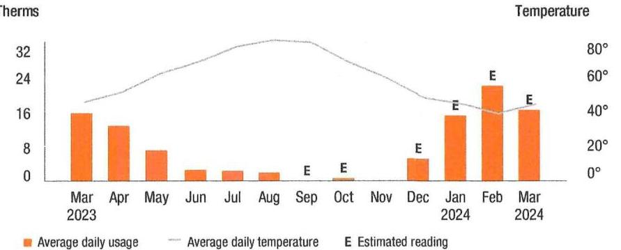

The image is a graph/chart.

- **Chart Type**: Bar and line chart.
- **Axes**:
  - X-axis: Months from Mar 2023 to Mar 2024.
  - Y-axis (left): Therms (for average daily usage).
  - Y-axis (right): Temperature in degrees Fahrenheit.
- **Legend**:
  - Orange bars represent "Average daily usage."
  - Gray line represents "Average daily temperature."
  - "E" indicates "Estimated reading."
- **Data Points**:
  - Mar 2023: Usage around 16 therms.
  - Apr 2023: Usage around 12 therms.
  - May 2023: Usage around 8 therms.
  - Jun, Jul, Aug 2023: Usage around 0 therms.
  - Sep 2023: Usage around 0 therms.
  - Oct 2023: Usage around 0 therms (Estimated).
  - Nov 2023: Usage around 4 therms.
  - Dec 2023: Usage around 8 therms (Estimated).
  - Jan 2024: Usage around 16 therms (Estimated).
  - Feb 2024: Usage around 28 therms (Estimated).
  - Mar 2024: Usage around 20 therms (Estimated).
- **Temperature Line**:
  - Peaks around July 2023 at approximately 80°F.
  - Lowest around January 2024 at approximately 20°F.

This chart provides a **yearly usage breakdown (monthly-based)** of gas consumption and average temperature.

Visit MyAccount for more details regarding your energy usage.

## Explaining gas charges

We measure the volume of gas you use in cubic feet (CCF) and then convert it to therms.

If you used a standard gas clothes dryer, it would take about 6 hours to equal 1 therm of energy.

## About the balancing charge

The balancing charge includes pipeline, storage and other costs associated with seasonal peaks in usage. It applies from October to May.

## Price to compare

If you want to consider getting your gas supply from another supplier, you can compare their price with ours. This month, your cost for gas supply is $\$ 208.17$ (or an average of 0.39749098 per therm). This price to compare varies from month to month, depending on your usage.

Your PoD ID is: PG000009401655766006 Your PoD ID is your Point of Delivery identification within PSE\&G's system. You will need this number if you are considering enrolling with another supplier.

# Balance remaining from your last bill 

| PSE\&G balance from last bill | \$2,905.68 |
| :--: | :--: |
| Less Payment received February 26, 2024 - thank you! | \$747.17 |
| Balance remaining from your last bill | \$2,158.51 |

## This month's charges and credits

| Gas charges - PSE\&G | \$534.02 |
| :--: | :--: |
| Plan Electric charges - PSE\&G | \$275.95 |
| This month's charges and credits | \$809.97 |
| Total amount due by Apr 1, 2024 | \$2,958.48 |

This bill reflects BPU-approved changes in the Delivery portion of your steatric bill, effective on and after March 1, 2024. The increase in the Delivery portion of your bill is due to changes in the Tax Adjustment Credit. As a result of these changes, a typical residential customer who receives electric Supply from PSE\&G, and uses 577 kilowatt-hours in an average month, will see an average monthly increase of $\$ 2.09$ or $1.78 \%$. Tariff information may also be found by visiting pseg.com.

This bill reflects BPU-approved changes in the Delivery portion of your gas bill, effective on and after March 1, 2024. The increase in the Delivery portion of your bill is due to changes in the Tax Adjustment Credit. As a result of these changes, a typical residential customer who receives gas Supply from PSE\&G, and uses 87 therms in an average month, will see an average monthly increase of $\$ 1.70$, or approximately $1.82 \%$. Tariff information can be found at pseg.com.

If you worked bill or part time in 2022 and earned less than $\$ 50,000$, you may qualify for an Earned Income Tax Credit (EITC) of up to $\$ 7,430$ on your federal taxes and up to $\$ 2,972$ on your New Jersey state taxes. For more information, call the Internal Revenue Service at 1-800-829-1040 or the New Jersey Division of Taxation at 1-888-895-9179. You can also visit irs.gov/eitc or njeltc.org. To learn how to file your taxes free of charge, call New Jersey's hotline at 211 or visit nj211.org.

Small, Leave. Call. Know what to do if you smell gas. Natural gas has a distinctive odor that smells like rotten eggs. If you smell gas, leave the area immediately. Call 911 or PSE\&G at 800-880-PSEG (7734). Do not assume somebody else has already called. For more information, visit pseg.com/SmellGas.

Help is available to pay your energy bill! You can apply for the Low-Income Home Energy Assistance Program (LIHEAP) and the Universal Service Fund (USF) at the same time with one application. Visit pseg.com/EnergyAssistance or call 1-800-510-3102 (Mon.-Fri. 8 a.m. to 8 p.m.) to find a local agency where you can apply in person.

Don't wait for the mail - go popartasal With Paperless Billing, you'll get a monthly email showing your bill amount and due date, with the ability to view or print your current and past bills anytime, anywhere. To sign up, log in to My Account at pseg.com, and select "Paperless Billing."

You may yuillly for a free home energy assessment through our Home Weatherization Program. You could also receive up to $\$ 7,500$ in home energy efficiency and health and safety upgrades at no cost. Visit pseg.com/HomeWeatherization or call 1-855-846-2895 to learn more.

PSE\&G protects smart meter data with a comprehensive cybersecurity plan. We will only use the data obtained through smart meters to provide better service to customers and we will not sell the data to third parties. Smart meters also do not collect, store, or transmit any personal information. To learn more, visit pseg.com/SmartMeters.

## Don't miss your meter reading

If you'll be away on your meter reading day, use our mobile app to upload a picture of your meter or enter your reading manually, or call 1-800-622-0197.

## Electric \& Gas Rate Information

For news about PSE\&G's rate filing and upcoming public hearings visit www.pseg.com/pseandgfilings. Under applicable tax law, the State Sales and Use Tax and corporate business tax are imposed upon the energy you have used.

# Details of your electric charges 

Your rate: Residential Service (RS)
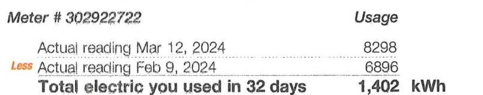

The image is a photo of a section of an electric bill showing meter readings and usage details.

- **Meter #**: 302922722
- **Usage**:
  - **Actual reading Mar 12, 2024**: 8298
  - **Less Actual reading Feb 9, 2024**: 6896
- **Total electric you used in 32 days**: 1,402 kWh

The text "Less" is highlighted in orange.

## Delivery charges

Monthly service charge
$\$ 4.95$
Charges for delivering electric to you:
kWh charges

| For the first | 375 kWh $\times \$ 0.048133$ | $\$ 18.05$ |
| :-- | :-- | :-- |
| For the next | 501 kWh $\times \$ 0.048124$ | $\$ 24.11$ |
| For the next | 225 kWh $\times \$ 0.051733$ | $\$ 11.64$ |
| For the next | 301 kWh $\times \$ 0.051761$ | $\$ 15.58$ |

## Total electric delivery charges

$\$ 74.33$
Supply charges
Cost of electric supplied by PSE\&G:
Charges

| For the first | 375 kWh $\times \$ 0.134213$ | $\$ 50.33$ |
| :-- | :-- | :-- |
| For the next | 501 kWh $\times \$ 0.143952$ | $\$ 72.12$ |
| For the next | 225 kWh $\times \$ 0.144933$ | $\$ 32.61$ |
| For the next | 301 kWh $\times \$ 0.154684$ | $\$ 46.56$ |

## Total electric supply charges

$\$ 201.62$
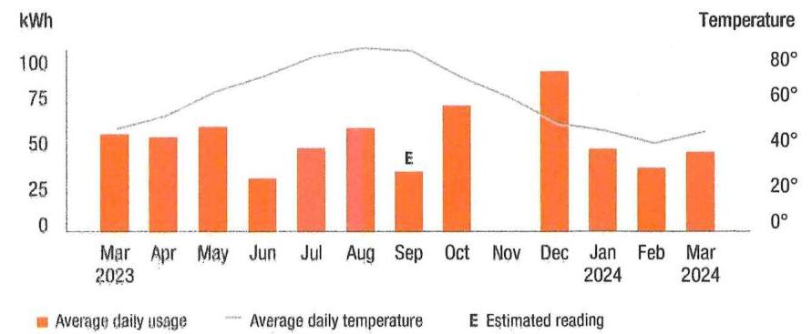

The image is a graph/chart.

- **Chart Type**: Bar and line chart
- **X-Axis**: Months from "Mar 2023" to "Mar 2024"
- **Y-Axis (Left)**: kWh
- **Y-Axis (Right)**: Temperature (°F)
- **Legend Entries**:
  - Orange bars: Average daily usage
  - Grey line: Average daily temperature
  - "E": Estimated reading
- **Data Points**:
  - Mar 2023: ~50 kWh
  - Apr 2023: ~60 kWh
  - May 2023: ~75 kWh
  - Jun 2023: ~40 kWh
  - Jul 2023: ~50 kWh
  - Aug 2023: ~50 kWh (Estimated)
  - Sep 2023: ~60 kWh
  - Oct 2023: ~70 kWh
  - Nov 2023: ~80 kWh
  - Dec 2023: ~90 kWh
  - Jan 2024: ~60 kWh
  - Feb 2024: ~50 kWh
  - Mar 2024: ~40 kWh
- **Temperature Line**: Peaks around July and August, declines towards December, and rises again by March.
- **Yearly Usage Breakdown (Monthly-Based)**: The chart provides a visual representation of average daily usage and temperature trends over the year.

Visit MyAccount for more details regarding your energy usage.

## Explaining electric charges

We charge for the electric you use in kilowatt hours (kWh). 1 kilowatt is equal to 1,000 watts.
If you use a standard LCD TV which uses -150 watts while operating, it would take 7 hours of use to equal 1 kWh .

## Price to compare

If you want to consider getting your electric supply from another supplier, compare their price with ours. This month, your cost for energy supply is $\$ 201.62$ (or an average of 0.143809 per kWh ). This price to compare varies month to month, depending on your usage.

Your PoD ID is: PE000009401656566006 Your PoD ID is your Point of Delivery identification within PSE\&G's system. You will need this number if you are considering enrolling with another supplier.

