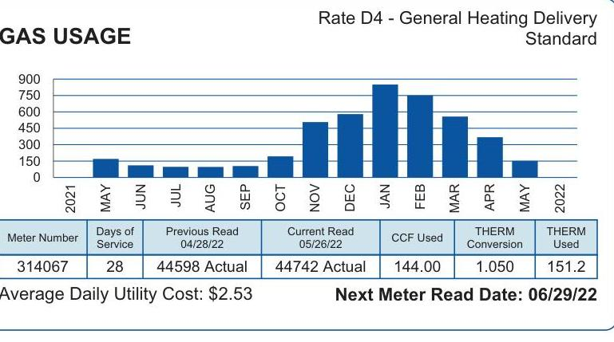
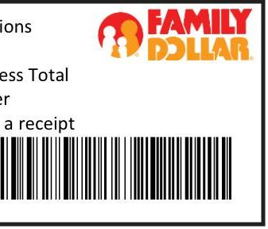
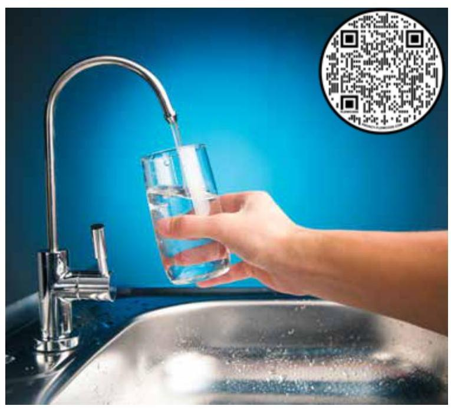
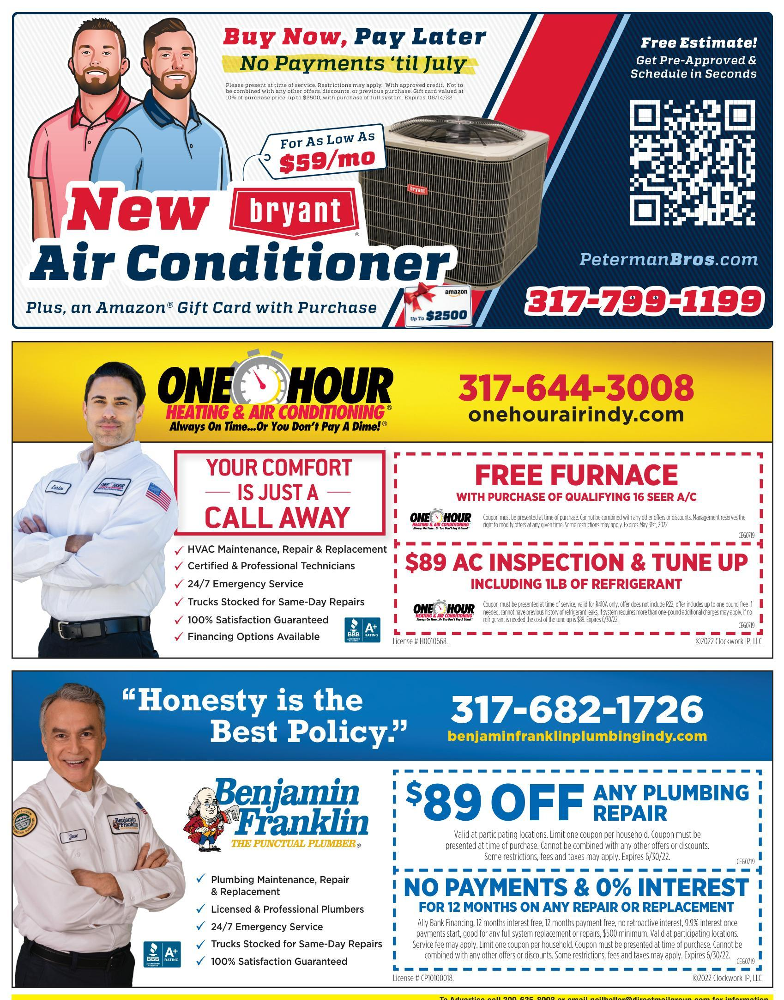

Amount Due
$75.79$
Date Due
06/15/22

## ACCOUNT SUMMARY

| Account Balance as of 04/29/22 | $\$ 109.29$ |
| :-- | --: |
| Payment(s) Received 05/16/22 | $\$ 109.29 \mathrm{cr}$ |
| Previous Balance | $\$ 0.00$ |
| Utility Charges | $\$ 35.65$ |
| Gas Delivery Charge | $\$ 35.00$ |
| Facility Charge | $\$ 0.33$ |
| Balancing Charge | $\$ 0.15 \mathrm{cr}$ |
| Customer Benefit Adjustment | $\$ 4.96$ |
| Sales Tax | $\$ 75.79$ |
| Utility Subtotal |  |
| Supplier Charges | 151 |
| Actual Therm |  |
| Amount Due | $\$ 75.79$ |
| as of 05/27/22 |  |

## Paperless Billing

Are you interested in updates, alerts and information about your utility services? Register your account online at www.citizensenergygroup.com for The Source, a quarterly business newsletter for commercial and industrial customers.

Visit us on the web at CitizensEnergyGroup.com.

## HISTORICAL INFORMATION

The image is a bar chart titled "GAS USAGE" with the subtitle "Rate D4 - General Heating Delivery Standard." It displays monthly gas usage data from May 2021 to May 2022.

- **X-axis**: Months from 2021 to 2022 (MAY, JUN, JUL, AUG, SEP, OCT, NOV, DEC, JAN, FEB, MAR, APR, MAY).
- **Y-axis**: Usage scale from 0 to 900.
- **Data Points**: 
  - MAY: ~100
  - JUN: ~100
  - JUL: ~100
  - AUG: ~100
  - SEP: ~100
  - OCT: ~200
  - NOV: ~400
  - DEC: ~600
  - JAN: ~800
  - FEB: ~700
  - MAR: ~500
  - APR: ~400
  - MAY: ~200

Below the chart, there is a table with the following details:
- **Meter Number**: 314067
- **Days of Service**: 28
- **Previous Read 04/28/22**: 44598 Actual
- **Current Read 05/26/22**: 44742 Actual
- **CCF Used**: 144.00
- **THERM Conversion**: 1.050
- **THERM Used**: 151.2

Additional information:
- **Average Daily Utility Cost**: $2.53
- **Next Meter Read Date**: 06/29/22

This chart provides a **yearly usage breakdown (monthly-based)** for gas consumption.

Account Number: 7062320000 Service Address: 10127 MONTERY RD

| Amount Due by 06/15/22 | $\$ 75.79$ |
| :-- | --: |
| Amount Due After 06/15/22 | $\$ 78.12$ |
| Amount Enclosed | $\$$ |

Write account number on check and mail to:
$\left.\begin{array}{l}\mu \cdot l_{1} l_{1} l_{1} l_{1} l_{1} l_{1} l_{1} l_{1} l_{1} l_{1} l_{1} l_{1} l_{1} l_{1} l_{1} l_{1} l_{1} l_{1} l_{1} l_{1} l_{1} l_{1} l_{1} l_{1} l_{1} l_{1} l_{1} l_{1} l_{1} l_{1} l_{1} l_{1} l_{1} l_{1} l_{1} l_{1} l_{1} l_{1} l_{1} l_{1} l_{1} l_{1} l_{1} l_{1} l_{1} l_{1} l_{1} l_{1} l_{1} l_{1}

# THIRD PARTY SUPPLIER FAQS 

Q. What steps do I take to be removed from third party billing?
A. Please call your third party marketer.
Q. What is the Customer Benefit Adjustment Credit?
A. The Customer Benefit Adjustment Credit is a credit designed to distribute funds to all customers, as approved by the Indiana Utility Regulatory Commission (IURC).
Q. What are the Gas Cost Charges?
A. Charges applicable to the Utility's customers and/ or Third Party Suppliers designed to recover the cost of gas and related off-system services incurred by the Utility to provide Gas Supply Service to the customer's meter. Such costs include pipeline transportation and balancing services.
Q. What is a Third Party Supplier?
A. Any entity, other than the Utility, including customer acting as its own Supply Agent, qualified under Section 13 to provide gas supply services within the Utility's service area.

## Emergency:   (317) 924-3311

Register Online:
CitizensEnergyGroup.com
Phone Numbers
Emergency ..... (317) 924-3311
Register Online ..... CitizensEnergyGroup.com
Pay Online ..... CitizensEnergyGroup.com
Customer Service ..... (317) 927-4328
Mon - Fri 8:00 a.m. - 5:00 p.m.
Pay by Phone ..... (317) 924-3310
Call Before You Dig ..... 811
Visit Citizensenergygroup.com for a schedule of Board of Directors meetings
The Rights and Responsibilities for Residential Customers pamphlet can be located at www.citizensenergygroup.com/My-Home/My-Responsibilities
Mailing Addresses
Remit Payments To: $\quad$ Corporate Office:
Citizens Energy Group
PO Box 7056
Indianapolis, IN 46207-7056
Citizens Energy Group
2020 N. Meridian Street
Indianapolis, IN 46202-1306

## DEFINITIONS

CCF - Amount of gas and water which goes through the meter, measured in 100 cubic feet. For water and sewer, 1 CCF is approximately 750 gallons.
er - Indicates a credit.
Therm (THRM) Used - Energy value of the gas used
Conversion - Used to convert the metered consumption to calculated charges for billing purposes (for example CCF to Therms)
Gas Charges - Includes cost of gas used, maintaining a safe and dependable distribution system, meter reading, billing and various customer services.

## E E E E E E E

## citizens energy group Payment Terminal

## BILLING OPTIONS

Me gustaria recibir mi factura en español
Provide Detailed Charges on Bill

PAY WITH CASH FOR FREE AT PARTICIPATING CVS PHARMACY AND FAMILY DOLLAR LOCATIONS
Bring this notice with you to make cash payment. Payments posted within 15 minutes.

The image is a photo/illustration showing a section of a payment instruction slip for Family Dollar. It includes the Family Dollar logo at the top right. Below the logo, there is a barcode. The visible text reads:

- "ess Total"
- "er"
- "a receipt"

The barcode is located at the bottom of the image.

## CVS Pharmacy Cashier Instructions

1. Scan barcode below
2. Ask the customer how much they want to pay
3. Enter the amount and collect payment
4. Give the customer their receipt

PayNearMe

The image is a photo/illustration showing a section of a payment instruction slip for Family Dollar. It includes the Family Dollar logo at the top right. Below the logo, there is a barcode. The visible text reads:

- "ess Total"
- "er"
- "a receipt"

The barcode is located at the bottom of the image.

## Customer/Cashier Call (888)-653-1161 for help

The image is a photo/illustration showing a section of a payment instruction slip for Family Dollar. It includes the Family Dollar logo at the top right. Below the logo, there is a barcode. The visible text reads:

- "ess Total"
- "er"
- "a receipt"

The barcode is located at the bottom of the image.

Cashier: Call CTTS at 866-377-6420 for help

# the citizens connection 

## 2021 Drinking Water Report Available Online

Drinking water quality is a top priority at Citizens Energy Group. Many significant efforts and investments are made to ensure the water supplied to our customers is safe to drink. These efforts include the protection of our water sources, quality control in the water treatment process, and maintenance of the water distribution system. We conduct testing every day to confirm the quality and safety of your drinking water supply.

Each year, we measure and report our compliance with drinking water regulations in a document called the Water Quality Report. To review the 2021 Water Quality Report, visit www.CitizensEnergyGroup.com/WaterQuality or scan the QR code with your smartphone.

## Safety Tip

If you detect even a slight odor of natural gas in the area, don't stay-get away. Then contact Citizens Energy Group at (317) 924-3311 or call 911.

## Summer Sewer Charges

On May 1, Citizens launched its annual Summer Sewer Charges program for residential customers. This program considers that some water used during the summer months may not be disposed of in the wastewater system, such as water used for lawn irrigation. Therefore, from May through November, the residential sewer charge will be based on the customer's average water usage during the months of December through March.

However, under no circumstances will the sewer charge be based on fewer than 3,000 gallons (4CCF) of water. Residential customers will see a line item on their bill labeled: Sewer Charges (xx CCF). This represents the sewer volume used to calculate sewer charges. No further action is needed by customers as enrollment in the program is automatic.

The image is a photo showing a person holding a garden hose nozzle, spraying water. The nozzle is yellow and black, and water is visibly spraying out in a wide arc. The background appears to be a grassy area, suggesting outdoor use.

The image is a photo showing a hand holding a glass under a running faucet, filling it with water. The faucet is metallic and positioned above a sink. In the upper right corner of the image, there is a QR code. The background is a gradient of blue, suggesting a clean and fresh environment.

## Conservation Tip

Use a rain barrel to collect runoff rainwater and use what you've collected to water your lawn and landscaping.

## Assistance Is Still Available for Customers in Need

Applications for the Low Income Home Energy Assistance Program (LIHEAP) and the newly established Low Income Household Water Assistance Program (LIHWAP) are still being accepted. Visit www.in.gov/ihcda and click on "Homeowners \& Renters" for information on qualifications and how to apply.

In addition, Citizens Energy Group encourages customers who are behind on their bills to call (317) 924-3311 or visit www.CitizensEnergyGroup.com/Help for additional sources of assistance, including Citizens' Warm Heart Warm Home Foundation ${ }^{\mathrm{TM}}$, and to establish flexible payment arrangements.

## Careers At Citizens

Visit www.CitizensEnergyGroup.com/Careers or scan the QR code with your smartphone to see the many career opportunities Citizens has to offer.

The image is a photo/illustration featuring three different advertisements for home services.

1. **Top Advertisement:**
   - **Text:** 
     - "Buy Now, Pay Later No Payments 'til July"
     - "For As Low As $59/mo"
     - "New bryant Air Conditioner"
     - "Plus, an Amazon® Gift Card with Purchase up to $2500"
     - "Free Estimate! Get Pre-Approved & Schedule in Seconds"
     - "317-799-1199"
     - "PetermanBros.com"
   - **Visuals:** Two illustrated men on the left, an air conditioner unit on the right, and a QR code.

2. **Middle Advertisement:**
   - **Text:**
     - "ONE HOUR HEATING & AIR CONDITIONING® Always On Time...Or You Don’t Pay A Dime!®"
     - "317-644-3008"
     - "onehourairindy.com"
     - "YOUR COMFORT IS JUST A CALL AWAY"
     - "HVAC Maintenance, Repair & Replacement"
     - "Certified & Professional Technicians"
     - "24/7 Emergency Service"
     - "Trucks Stocked for Same-Day Repairs"
     - "100% Satisfaction Guaranteed"
     - "Financing Options Available"
     - "FREE FURNACE WITH PURCHASE OF QUALIFYING 16 SEER A/C"
     - "$89 AC INSPECTION & TUNE UP INCLUDING 1LB OF REFRIGERANT"
   - **Visuals:** A man in a uniform on the left.

3. **Bottom Advertisement:**
   - **Text:**
     - "Honesty is the Best Policy."
     - "Benjamin Franklin THE PUNCTUAL PLUMBER®"
     - "317-682-1726"
     - "benjaminfranklinplumbingindy.com"
     - "Plumbing Maintenance, Repair & Replacement"
     - "Licensed & Professional Plumbers"
     - "24/7 Emergency Service"
     - "Trucks Stocked for Same-Day Repairs"
     - "100% Satisfaction Guaranteed"
     - "$89 OFF ANY PLUMBING REPAIR"
     - "NO PAYMENTS & 0% INTEREST FOR 12 MONTHS ON ANY REPAIR OR REPLACEMENT"
   - **Visuals:** A man in a uniform on the left.

Each advertisement includes contact information and promotional offers related to air conditioning and plumbing services.

