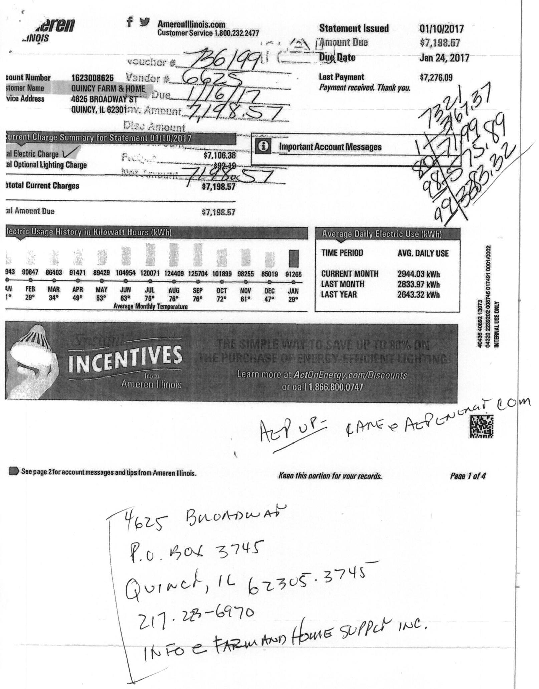

The image is a photo of a utility bill from Ameren Illinois. It includes various handwritten notes and printed information. Key details include:

- **Account Information:**
  - Account Number: 1623008626
  - Customer Name: QUINCY FARM & HOME
  - Service Address: 4625 BROADWAY ST, QUINCY, IL 62301

- **Billing Details:**
  - Statement Issued: 01/10/2017
  - Amount Due: $7,198.57
  - Due Date: Jan 24, 2017
  - Last Payment: $7,276.09
  - Total Current Charges: $7,198.57

- **Charge Summary:**
  - Total Electric Charge: $7,106.38
  - Total Optional Lighting Charge: $92.19

- **Electric Usage History in Kilowatt Hours (kWh):**
  - Monthly breakdown from Jan to Dec with values like 8402, 8643, 9147, etc.
  - Average Monthly Temperature: ranges from 29° to 72°

- **Average Daily Electric Use (kWh):**
  - Current Month: 2944.03 kWh
  - Last Month: 2783.97 kWh
  - Last Year: 2643.32 kWh

- **Handwritten Notes:**
  - Voucher #: 7861991
  - Vendor #: 6925
  - Various calculations and numbers written on the right side.

- **Contact Information:**
  - Address: 4625 BROADWAY, P.O. BOX 3745, QUINCY, IL 62305-3745
  - Phone: 217-228-6970
  - Note: INFO @ FARMHAND HOME SUPPLY INC.

- **Promotional Section:**
  - "INCENTIVES from Ameren Illinois"
  - "Learn more at ActOnEnergy.com/Discounts or call 1.866.800.0747"

The layout includes sections for account details, charge summary, usage history, and promotional content, with handwritten notes and calculations scattered throughout.

| 

The image is a photo or illustration of a logo. It features a stylized design resembling a sunburst or radiating lines, positioned to the left of the text. The text reads "Ameren ILLINOIS" with "Ameren" in larger font and "ILLINOIS" in smaller font beneath it. The logo is monochromatic, using shades of black and white. | Ameren | Amerenlilinois.com   Customer Service 1.800.232.2477 |
| :--: | :--: | :--: |
| Account Number | 1623098625 |  |
| Customer Name | QUINCY FARM \& HOME |  |
| Service Address | 4625 BROADWAY ST |  |
|  | QUINCY, IL 62301 |  |

| Payment Details |  |  |
| :--: | :--: | :--: |
|  | DATE | AMOUNT |
| Payment Received | December 20, 2016 | $\$ 7,276.09$ |

# Electric Meter Read for 12/01/2016 - 01/01/2017 (31 days) 

| READ TYPE | METER NUMBER | CURRENT METER READ | PREVIOUS METER READ | READ DIFFERENCE | MULTIPLIER | USAGE |
| :--: | :--: | :--: | :--: | :--: | :--: | :--: |
| Total kWh | 72021180 | 91265.0000 Actual | 0.0000 Actual | 91265.0000 | 1.0000 | 91265.0000 |
| On Peak kWh | 72021180 | 40773.0000 Actual | 0.0000 Actual | 40773.0000 | 1.0000 | 40773.0000 |
| Off Peak kWh | 72021180 | 50492.0000 Actual | 0.0000 Actual | 50492.0000 | 1.0000 | 50492.0000 |
| Peak kW | 72021180 | 256.2990 Actual | 0.0000 Actual | 256.2990 | 1.0000 | 256.2990 |
| On Peak kW | 72021180 | 256.2990 Actual | 0.0000 Actual | 256.2990 | 1.0000 | 256.2990 |
| Off Peak kW | 72021180 | 228.1980 Actual | 0.0000 Actual | 228.1980 | 1.0000 | 228.1980 |

## Usage Summary

Total kWh
Off-Peak kWh
On-Peak kW
12 Month Max Demand

| 91265.0000 | On-Peak kWh | 40773.0000 |
| :-- | --: | --: |
| 50492.0000 | Peak kW | 256.3000 |
| 256.3000 | Off-Peak kW | 228.2000 |

|  | CHARGE DESCRIPTION |  |  | USAGE | UNIT |  | RATE |  | CHARGE |
| :--: | :--: | :--: | :--: | :--: | :--: | :--: | :--: | :--: | :--: |
| Electric Delivery | Customer Charge |  |  |  |  |  |  |  | \$65.41 |
| Ameren Illinois | Meter Charge |  |  |  |  |  |  |  | \$9.84 |
| DS-3 General Delivery | Distribution Delivery kW Charge |  | 256.30 kW |  | @ | $\$ 6.16700000$ |  | \$1,580.60 |  |
| Service $<400 \mathrm{~kW}$ | Transformation Charge |  | 362.80 kW |  | @ | $\$ 0.59000000$ |  | \$214.05 |  |
|  | Electric Environmental Adjustment |  | 91,265.00 kWh |  | @ | $\$ 0.00059520$ |  | \$64.32 |  |
|  | Energy Efficiency Demand Response |  | 91,265.00 kWh |  | @ | $\$ 0.00176000$ |  | \$160.63 |  |
|  |  |  |  |  | Electric Delivery |  |  | \$2,084.85 |  |
| Electric Supply | SUPPLIER ENERGY CHARGES |  | 91,264.00 kWh |  | @ | $\$ 0.05980000$ |  | \$4,618.00 |  |
|  |  |  |  |  | Electric Supply |  |  | \$4,618.00 |  |
| Taxes and Other Fees |  |  |  |  |  |  |  | \$284.75 |  |
|  |  |  |  |  |  |  |  | \$118.76 |  |
|  |  |  |  |  | Total Tax Related Fees |  |  | \$403.53 |  |
|  |  |  |  |  | Total Electric Charges |  |  | \$7,108.38 |  |
| (3) | Details From Your Electric Supplier |  |  |  |  |  |  |  |  |
| AEP Energy | www.AEPenergy.com |  |  |  |  |  |  |  |  |
| 866.258.3782 | 866.258.3782 |  |  |  |  |  |  |  |  |
| Refer to supply contract for details. |  |  |  |  |  |  |  |  |  |

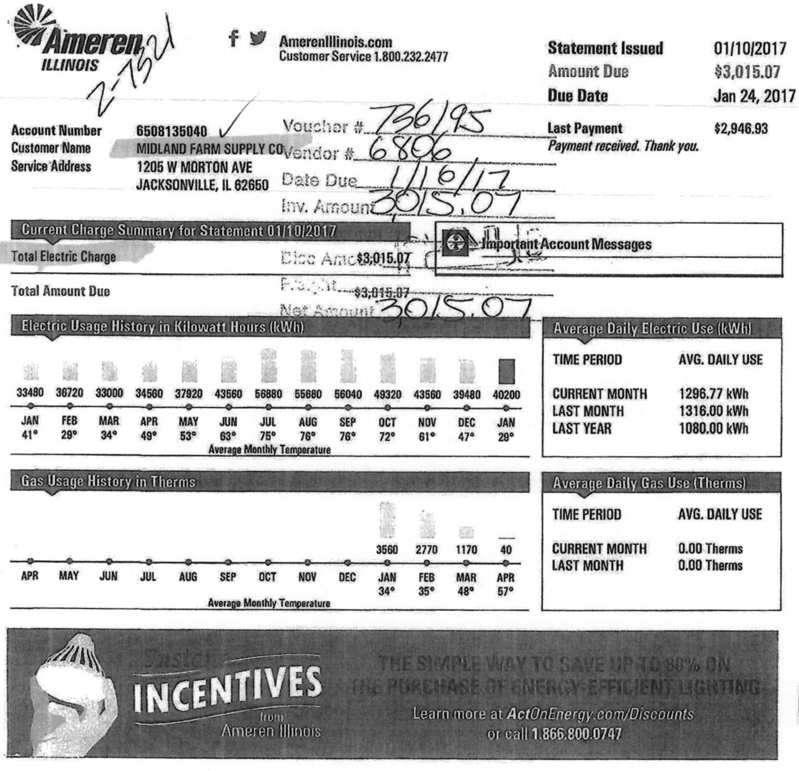

The image is a photo of a utility bill from Ameren Illinois. It contains various sections with detailed information:

- **Header Information:**
  - Ameren Illinois logo and contact information: "AmerenIllinois.com", "Customer Service 1.800.232.2477".
  - Account Number: "6508135040".
  - Customer Name: "MIDLAND FARM SUPPLY CO".
  - Service Address: "1205 W MORTON AVE, JACKSONVILLE, IL 62650".
  - Statement Issued: "01/10/2017".
  - Amount Due: "$3,015.07".
  - Due Date: "Jan 24, 2017".
  - Last Payment: "$2,946.93", with note "Payment received. Thank you."

- **Handwritten Notes:**
  - "Voucher # 736195".
  - "Vendor # 6896".
  - "Date Due 1/16/17".
  - "Inv. Amount 3015.07".

- **Current Charge Summary:**
  - Total Electric Charge: "Base Amt: $3,015.07".
  - Total Amount Due: "$3,015.07".

- **Electric Usage History in Kilowatt Hours (kWh):**
  - Monthly usage from January to December, with values ranging from 33,480 kWh in January to 56,880 kWh in August.
  - Average Monthly Temperature is listed below each month, ranging from 29°F in January to 76°F in July and August.

- **Average Daily Electric Use (kWh):**
  - Current Month: "1296.77 kWh".
  - Last Month: "1316.00 kWh".
  - Last Year: "1080.00 kWh".

- **Gas Usage History in Therms:**
  - Monthly usage from April to March, with values ranging from 0 Therms in several months to 3,560 Therms in December.
  - Average Monthly Temperature is listed below each month, ranging from 29°F in January to 63°F in May.

- **Average Daily Gas Use (Therms):**
  - Current Month: "0.00 Therms".
  - Last Month: "0.00 Therms".

- **Promotional Section:**
  - "Incentives from Ameren Illinois".
  - "THE SIMPLE WAY TO SAVE UP TO 30% ON THE PURCHASE OF ENERGY EFFICIENT LIGHTING".
  - "Learn more at ActOnEnergy.com/Discounts or call 1.866.800.0747".

|  | Ameren |  |
| :--: | :--: | :--: |
| ILLINOIS | ILLINOIS |  |
| Account Sumber | 6668135840 |  |
| Customer Name | MIDLAND FARM SUPPLY CO |  |
| Service Address | 1205 W MORTON AVE |  |
|  | JACKSONVILLE, IL 62650 |  |

| Payment Details |  |  |  |  |
| :--: | :--: | :--: | :--: | :--: |
| Payment Received | DATE | AMOUNT |  |  |
|  | December 20, 2016 | \$2,946.93 |  |  |
| Electric Service Non-Residential Billing Detail Date Zone III |  |  | 120512018 01/01/2017 (31 days) |  |
| Electric Mierc Road for 12/01/2018 - 01/01/2017 (31 days) |  |  |  |  |
| READ TYPE | METER NUMBER | CURRENT METER READ | PREVIOUS METER READ | READ DIFFERENCE | MULTIPLIER | USAGE |
| Total kWh | 72304931 | 1452.0000 Estimate | 1117.0000 Estimate | 335.0000 | 120.0000 | 40200.0000 |

| Usage Summary |  |  |  |  |
| :--: | :--: | :--: | :--: | :--: |
| Total kWh Peak kW |  | 40200.0000 Non-Summer kWh |  | 40200.0000 |
|  |  | 73.8000 |  |  |
| Electric Delivery | CHARGE DESCRIPTION |  |  | 40200.0000 |
| Ameren Illinois | Customer Charge |  |  |  |
| OS-2 Small General Delivery | Distribution Delivery Charge Non-Summer | 2,000.00 kWh | @ \$ 0.02176000 | \$ 0.02176000 |
| Service | Distribution Delivery Charge Non-Summer | 38,200.00 kWh | @ \$ 0.01116000 | \$ 0.01116000 |
|  | Electric Environmental Adjustment | 40,200.00 kWh | @ \$ 0.00138290 | \$55.59 |
|  | Energy Efficiency Demand Response | 40,200.00 kWh | @ \$ 0.00441000 | \$177.28 |
|  |  |  | Electric Delivery | \$746.11 |
| Electric Supply | SUPPLIER ENERGY CHARGES | 40,200.00 kWh | @ \$ 0.05199000 | \$2,090.00 |
| AEP Energy |  |  |  |  |
|  |  |  | Electric Supply | \$2,090.00 |
| Taxes and Other Fees | Illinois State Electricity Excise Tax |  |  | \$128.46 |
|  | EOT Cost Recovery |  |  | \$50.50 |
|  |  |  | Total Tax Related Fees | \$178.96 |
|  |  |  | Total Electric Charges | \$3,015.07 |
| (4) Details From Your Electric Supplier |  |  |  |  |
| AEP Energy |  |  |  |  |
| www.AEPenergy.com |  |  |  |  |
| 666.258 .3762 |  |  |  |  |
| Refer to supply contract for details. |  |  |  |  |
| For more information about your electric supply choices, visit www.phuginillinois.org. |  |  |  |  |

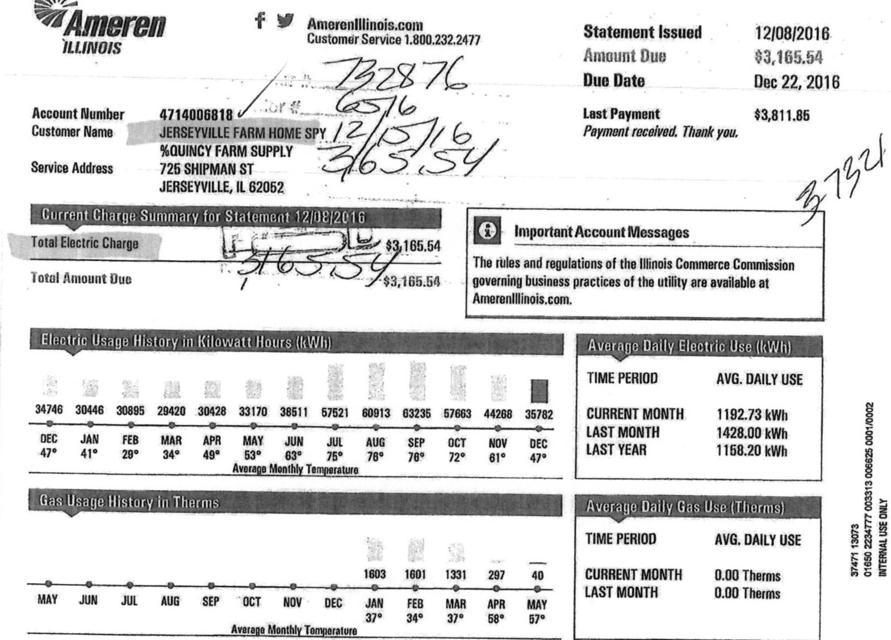

The image is a photo of a utility bill from Ameren Illinois. It includes various sections with details about electric and gas usage, charges, and account information.

- **Account Information:**
  - Account Number: 4714006818
  - Customer Name: JERSEYVILLE FARM HOME SPY / %QUINCY FARM SUPPLY
  - Service Address: 725 SHIPMAN ST, JERSEYVILLE, IL 62052

- **Statement Details:**
  - Statement Issued: 12/08/2016
  - Amount Due: $3,165.54
  - Due Date: Dec 22, 2016
  - Last Payment: $3,811.85

- **Current Charge Summary for Statement 12/08/2016:**
  - Total Electric Charge: $3,165.54
  - Total Amount Due: $3,165.54

- **Electric Usage History in Kilowatt Hours (kWh):**
  - DEC: 35782 kWh, Average Monthly Temperature: 47°
  - NOV: 44268 kWh, Average Monthly Temperature: 61°
  - OCT: 57603 kWh, Average Monthly Temperature: 72°
  - SEP: 63235 kWh, Average Monthly Temperature: 76°
  - AUG: 60913 kWh, Average Monthly Temperature: 76°
  - JUL: 57521 kWh, Average Monthly Temperature: 75°
  - JUN: 38511 kWh, Average Monthly Temperature: 63°
  - MAY: 33170 kWh, Average Monthly Temperature: 53°
  - APR: 30428 kWh, Average Monthly Temperature: 49°
  - MAR: 29420 kWh, Average Monthly Temperature: 34°
  - FEB: 30895 kWh, Average Monthly Temperature: 29°
  - JAN: 30446 kWh, Average Monthly Temperature: 41°
  - DEC: 34746 kWh, Average Monthly Temperature: 47°

- **Average Daily Electric Use (kWh):**
  - CURRENT MONTH: 1192.73 kWh
  - LAST MONTH: 1428.00 kWh
  - LAST YEAR: 1158.20 kWh

- **Gas Usage History in Therms:**
  - MAY: 40 Therms, Average Monthly Temperature: 57°
  - APR: 297 Therms, Average Monthly Temperature: 58°
  - MAR: 1331 Therms, Average Monthly Temperature: 37°
  - FEB: 1603 Therms, Average Monthly Temperature: 34°
  - JAN: 1601 Therms, Average Monthly Temperature: 37°
  - DEC: 1603 Therms, Average Monthly Temperature: 37°
  - NOV: 0 Therms
  - OCT: 0 Therms
  - SEP: 0 Therms
  - AUG: 0 Therms
  - JUL: 0 Therms
  - JUN: 0 Therms

- **Average Daily Gas Use (Therms):**
  - CURRENT MONTH: 0.00 Therms
  - LAST MONTH: 0.00 Therms

- **Important Account Messages:**
  - The rules and regulations of the Illinois Commerce Commission governing business practices of the utility are available at AmerenIllinois.com.

Handwritten notes and markings are present on the document, including numbers like "732876," "6576," "12/15/16," "3765.54," and "37321."

| Account Number | 4714086816 |
| :-- | :-- |
| Customer Name | JERSEYVILLE FARM HOME SPY |
|  | \%OUINCY FARM SUPPLY |
| Service Address | 725 SHIPMAN ST |
|  | JERSEYVILLE, IL 62052 |

| Account Details |  |  |
| :--: | :--: | :--: |
| Payment Received | DATE   November 15, 2016 | AMOUNT   $\$ 3,811.85$ |

# Electric Service Non-Residential 01111m Detail - Date: 2016-12/01/2016-12/01/2016 (01:00:00) 

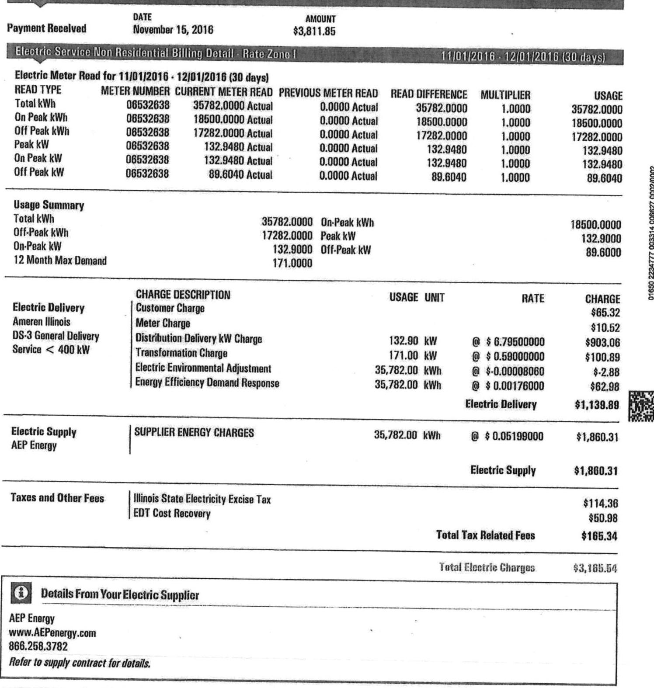

The image is a photo of an electric service billing statement. 

- **Title and Header Information:**
  - "Payment Received"
  - "DATE November 15, 2016"
  - "AMOUNT $3,811.85"
  - "Electric Service Non Residential Billing Detail - Rate Zone I"
  - "11/01/2016 - 12/01/2016 (30 days)"

- **Electric Meter Read for 11/01/2016 - 12/01/2016 (30 days):**
  - **READ TYPE:**
    - Total kWh
    - On Peak kWh
    - Off Peak kWh
    - Peak kW
    - On Peak kW
    - Off Peak kW
  - **METER NUMBER:** 06532638 for all types
  - **CURRENT METER READ:**
    - Total kWh: 35782.0000 Actual
    - On Peak kWh: 18500.0000 Actual
    - Off Peak kWh: 17282.0000 Actual
    - Peak kW: 132.9480 Actual
    - On Peak kW: 132.9480 Actual
    - Off Peak kW: 89.6040 Actual
  - **PREVIOUS METER READ:** 0.0000 Actual for all types
  - **READ DIFFERENCE:** Same as current meter read for all types
  - **MULTIPLIER:** 1.0000 for all types
  - **USAGE:**
    - Total kWh: 35782.0000
    - On Peak kWh: 18500.0000
    - Off Peak kWh: 17282.0000
    - Peak kW: 132.9480
    - On Peak kW: 132.9480
    - Off Peak kW: 89.6040

- **Usage Summary:**
  - Total kWh: 35782.0000
  - Off-Peak kWh: 17282.0000
  - On-Peak kW: 132.9000
  - 12 Month Max Demand: 171.0000

- **Charges:**
  - **Electric Delivery:**
    - Customer Charge: $65.32
    - Meter Charge: $110.52
    - Distribution Delivery kW Charge: 132.90 kW @ $6.795000000 = $903.06
    - Transformation Charge: 171.00 kW @ $0.590000000 = $100.89
    - Electric Environmental Adjustment: 35,782.00 kWh @ $-0.00008000 = $-2.88
    - Energy Efficiency Demand Response: 35,782.00 kWh @ $0.00176000 = $62.98
    - **Electric Delivery Total:** $1,139.89
  - **Electric Supply:**
    - Supplier Energy Charges: 35,782.00 kWh @ $0.05199000 = $1,860.31
    - **Electric Supply Total:** $1,860.31
  - **Taxes and Other Fees:**
    - Illinois State Electricity Excise Tax: $114.36
    - EDT Cost Recovery: $50.98
    - **Total Tax Related Fees:** $165.34

- **Total Electric Charges:** $3,165.54

- **Footer:**
  - "Details From Your Electric Supplier"
  - "AEP Energy"
  - "www.AEPenergy.com"
  - "866.258.3782"
  - "Refer to supply contract for details."

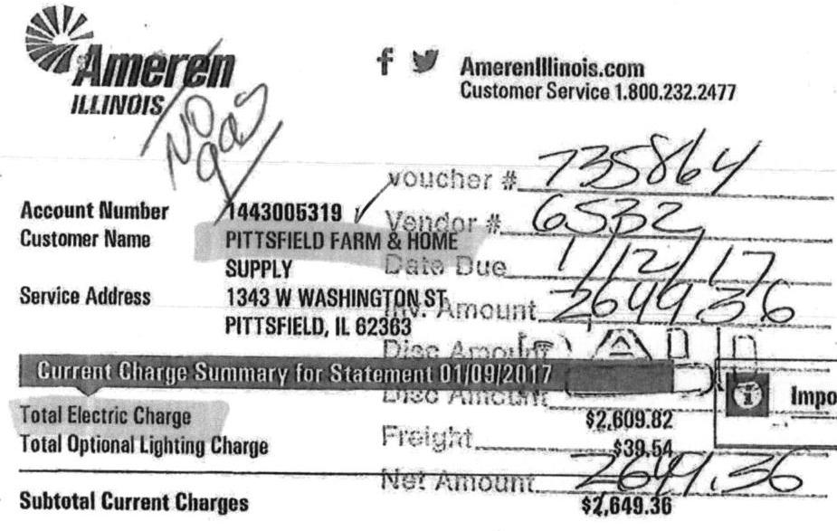

The image is a photo of a billing statement from Ameren Illinois. 

- **Logo and Contact Information:**
  - "Ameren ILLINOIS"
  - Website: "AmerenIllinois.com"
  - Customer Service: "1.800.232.2477"

- **Account Information:**
  - "Account Number: 1443005319"
  - "Customer Name: PITTSFIELD FARM & HOME SUPPLY"
  - "Service Address: 1343 W WASHINGTON ST, PITTSFIELD, IL 62363"

- **Billing Details:**
  - "Current Charge Summary for Statement 01/09/2017"
  - "Total Electric Charge: $2,609.82"
  - "Total Optional Lighting Charge: $39.54"
  - "Subtotal Current Charges: $2,649.36"
  - "Net Amount: $2,649.36"

- **Handwritten Notes:**
  - "voucher #: 735864"
  - "Vendor #: 6532"
  - "Date Due: 1/23/17"
  - "Amount: 2649.36"
  - "NO gas" (written across the logo)

The layout includes printed text and handwritten annotations, with some sections highlighted.

Statement Issued 01/09/2017
Amount Due
$2,846.36$
Due Date
Jan 23, 2017
Last Payment Payment received. Thank you.

| 34824 | 31762 | 31789 | 38873 | 37034 | 43760 | 55380 | 52640 | 51040 | 51680 | 38160 | 34400 | 34800 |
| :--: | :--: | :--: | :--: | :--: | :--: | :--: | :--: | :--: | :--: | :--: | :--: | :--: |
| JAN | YES | MAH | APB | MAY | JUN | JUL | AUG | SEP | OCT | NOV | DEC | JAN |
| $40^{\circ}$ | $28^{\circ}$ | $34^{\circ}$ | $49^{\circ}$ | $55^{\circ}$ | $64^{\circ}$ | $74^{\circ}$ | $72^{\circ}$ | $76^{\circ}$ | $71^{\circ}$ | $61^{\circ}$ | $48^{\circ}$ | $29^{\circ}$ |

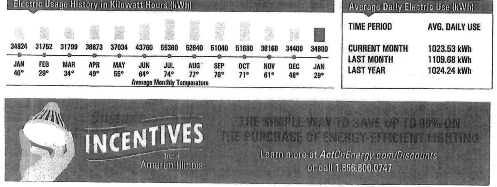

The image is a graph/chart.

- **Chart Type:** Bar chart
- **Title:** "Electric Usage History in Kilowatt Hours (kWh)"
- **X-Axis:** Months with corresponding average monthly temperatures
  - JAN: 34824 kWh, 40°
  - FEB: 31752 kWh, 29°
  - MAR: 31799 kWh, 34°
  - APR: 38873 kWh, 49°
  - MAY: 37034 kWh, 55°
  - JUN: 43760 kWh, 64°
  - JUL: 55360 kWh, 74°
  - AUG: 52640 kWh, 77°
  - SEP: 51040 kWh, 76°
  - OCT: 51680 kWh, 71°
  - NOV: 38160 kWh, 61°
  - DEC: 34400 kWh, 48°
  - JAN: 34800 kWh, 29°
- **Y-Axis:** Not explicitly labeled, but represents kWh usage
- **Additional Information:**
  - "Average Daily Electric Use (kWh)"
  - "TIME PERIOD" and "AVG. DAILY USE"
    - CURRENT MONTH: 1023.53 kWh
    - LAST MONTH: 1109.68 kWh
    - LAST YEAR: 1024.24 kWh
- **Advertisement Section:**
  - "INCENTIVES from Ameren Illinois"
  - "THE SIMPLE WAY TO SAVE UP TO 30% ON THE PURCHASE OF ENERGY-EFFICIENT LIGHTING"
  - "Learn more at ActOnEnergy.com/Discounts or call 1.866.800.0747"

This image provides a **yearly usage breakdown (monthly-based)** of electric usage in kilowatt hours, with average temperatures for each month.

See page 2 for account messages and tips from Ameren Illinois.
Keep this portion for your records.
Page 1 of 4

| Account Number | 1443085319 |
| :-- | :-- |
| Customer Name | PITTSFIELD FARM \& HOME |
|  | SUPPLY |
| Service Address | 1343 W WASHINGTON ST |
|  | PITTSFIELD, IL 62363 |

| Account Details |  |  |
| :--: | :--: | :--: |
| Payment Received | DATE   December 16, 2016 | AMOUNT   \$2,571.60 |

| Electric Energy Sun Residential Dilling Date: Date Zones |  |  |  |  |  |  |
| :--: | :--: | :--: | :--: | :--: | :--: | :--: |
| Electric Meter Read for 12/01/2016 - 01/04/2017 (34 days) |  |  |  |  |  |  |
| READ TYPE | METER NUMBER | CURRENT METER READ | PREVIOUS METER READ | READ DIFFERENCE | MULTIPLIER | USAGE |
| Total kWh | 72021501 | 4641.0000 Actual | 4206.0000 Actual | 435.0000 | 80.0000 | 34800.0000 |

Usage Summary
Total kWh
Peak kW
$34800.0000 \quad$ Non-Summer kWh
$34800.0000$
82.4000
$34800.0010 \quad$ 01/04/2017 144 days

|  | CHARGE DESCRIPTION |  |  |  |
| :--: | :--: | :--: | :--: | :--: |
| Electric Delivery | Customer Charge |  |  |  |
| Ameren Illinois | Meter Charge |  |  |  |
| DS-2 Small General Delivery | Distribution Delivery Charge Non-Summer | 2,000.00 kWh | ㅁ | \$ 0.02176000 |
| Service | Distribution Delivery Charge Non-Summer | 32,800.00 kWh | ㅁ | \$ 0.01116000 |
|  | Electric Environmental Adjustment | 34,800.00 kWh | ㅁ | \$ 0.00108040 |
|  | Energy Efficiency Demand Response | 34,800.00 kWh | ㅁ | \$ 0.00441000 |
|  |  |  | Electric Delivery | \$644.05 |
| Electric Supply | SUPPLIER ENERGY CHARGES | 34,800.00 kWh | (1) $\$ 0.05199000$ | \$1,809.25 |
| AEP Energy |  |  | Electric Supply | \$1,809.25 |
| Taxes and Other Fees | Illinois State Electricity Excise Tax |  |  | \$111.23 |
|  | EDT Cost Recovery |  |  | \$46.29 |
|  |  |  | Total Tax Related Fees | \$158.52 |
|  |  |  | Total Electric Charges | \$2,809.82 |

Dotoils From Your Electric Supplier
AEP Energy
www.AEPeriergy.com
886.258 .3782

Refer to supply contract for details.
For more information about your electric supply choices, visit www.phagiellinois.org.

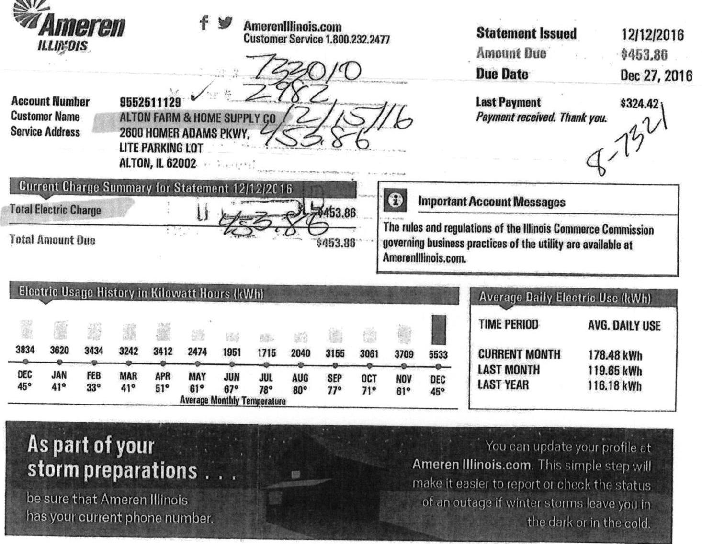

The image is a photo of a utility bill from Ameren Illinois. 

- **Header Information:**
  - Logo: Ameren Illinois
  - Website: AmerenIllinois.com
  - Customer Service: 1.800.232.2477

- **Account Information:**
  - Account Number: 9552511129
  - Customer Name: ALTON FARM & HOME SUPPLY CO
  - Service Address: 2600 HOMER ADAMS PKWY, LITE PARKING LOT, ALTON, IL 62002

- **Billing Information:**
  - Statement Issued: 12/12/2016
  - Amount Due: $453.86
  - Due Date: Dec 27, 2016
  - Last Payment: $324.42
  - Payment received. Thank you.

- **Current Charge Summary for Statement 12/12/2016:**
  - Total Electric Charge: $453.86
  - Total Amount Due: $453.86

- **Important Account Messages:**
  - The rules and regulations of the Illinois Commerce Commission governing business practices of the utility are available at AmerenIllinois.com.

- **Electric Usage History in Kilowatt Hours (kWh):**
  - DEC: 3834
  - JAN: 3620
  - FEB: 3434
  - MAR: 3242
  - APR: 3412
  - MAY: 2474
  - JUN: 1951
  - JUL: 1715
  - AUG: 2040
  - SEP: 3155
  - OCT: 3061
  - NOV: 3709
  - DEC: 5533

- **Average Monthly Temperature:**
  - DEC: 45°
  - JAN: 41°
  - FEB: 33°
  - MAR: 41°
  - APR: 51°
  - MAY: 61°
  - JUN: 67°
  - JUL: 78°
  - AUG: 80°
  - SEP: 77°
  - OCT: 71°
  - NOV: 61°
  - DEC: 45°

- **Average Daily Electric Use (kWh):**
  - TIME PERIOD: AVG. DAILY USE
  - CURRENT MONTH: 178.48 kWh
  - LAST MONTH: 119.65 kWh
  - LAST YEAR: 116.18 kWh

- **Promotional Message:**
  - As part of your storm preparations, be sure that Ameren Illinois has your current phone number.
  - You can update your profile at AmerenIllinois.com. This simple step will make it easier to report or check the status of an outage if winter storms leave you in the dark or in the cold.

As part of your
Storm preparations
be sure that Ameren Illinois has your current phone number.

You can update your profile at Ameren Illinois.com. This simple step will make it easier to report or check the status of an autogen. Winter storm. leave you in the dark on in the cold.

|  |  |  | Statement Issued | 12/12/2016 |
| :--: | :--: | :--: | :--: | :--: |
|  |  |  | Amount Due | \$453.86 |
| Account Number | 8552511128 |  | Due Date | Dec 27, 2016 |
| Customer Name |  |  |  |  |
| Service Address | 2600 HOMER ADAMS PKWY,   LITE PARKING LOT   ALTON, IL 62002 |  |  |  |
|  |  |  |  |  |
| Payment Itemals |  |  |  |  |
|  | DATE | AMOUNT |  |  |
| Payment Received | November 21, 2016 | \$324.42 |  |  |
| Electric Service Non-Residential Oiling Retail - Date: January |  |  |  |  |
| Electric Meter Read for 11/88/2016 - 12/87/2016 (31 days) |  |  |  |  |
| READ TYPE | METER NUMBER | CURRENT METER READ | PREVIOUS METER READ | READ DIFFERENCE | MULTIPLIER | USAGE |
| Total kWh | 08165610 | 21082.0000 Actual | 15549.0000 Actual | 5533.0000 | 1.0000 | 5533.0000 |
| Usage Summary |  |  |  |  |
| Total kWh |  | 5533.0000 Non-Summer kWh |  |  |  | 5533.0000 |
| Electric Delivery | CHARGE DESCRIPTION |  | USAGE UNIT | RATE | CHARGE |
| Ameren Illinois | Customer Charge |  |  |  | \$31.13 |
| DS-2 Small General Delivery |  |  |  |  | 88.37 |
| Service | Distribution Delivery Charge Non-Summer |  | 2,000.00 kWh | @ \$ 0.02156000 | \$43.12 |
|  | Distribution Delivery Charge Non-Summer |  | 3,533.00 kWh | @ \$ 0.01107000 | \$39.11 |
|  | Electric Environmental Adjustment |  | 5,533.00 kWh | @ \$ 0.00014840 | $\$ 0.82$ |
|  | Energy Efficiency Demand Response |  | 5,533.00 kWh | @ \$ 0.00441000 | \$24.40 |
|  |  |  |  | Electric Delivery | \$145.31 |
| Electric Supply | SUPPLIER ENERGY CHARGES |  | 5,533.00 kWh | @ \$ 0.05069000 | \$276.97 |
| AEP Energy |  |  |  | Electric Supply | \$276.97 |
| Taxes and Other Fees | Alton Municipal Tax |  |  |  | 2.83 |
|  | Illinois State Electricity Excise Tax |  |  |  | \$17.87 |
|  | EDT Cost Recovery |  |  |  | 7.88 |
|  |  |  | Total Tax Related Fees |  | \$28.58 |
|  |  |  | Total Electric Charges |  | \$453.86 |
| 4 Details From Your Electric Supplier |  |  |  |  |  |
| AEP Energy |  |  |  |  |  |
| www.AEPenergy.com |  |  |  |  |  |
| 086.258.3782 |  |  |  |  |  |
| Refer to supply contract for details. |  |  |  |  |  |
| For more information about your electric supply choices, visit www.pluginillinois.org. |  |  |  |  |  |

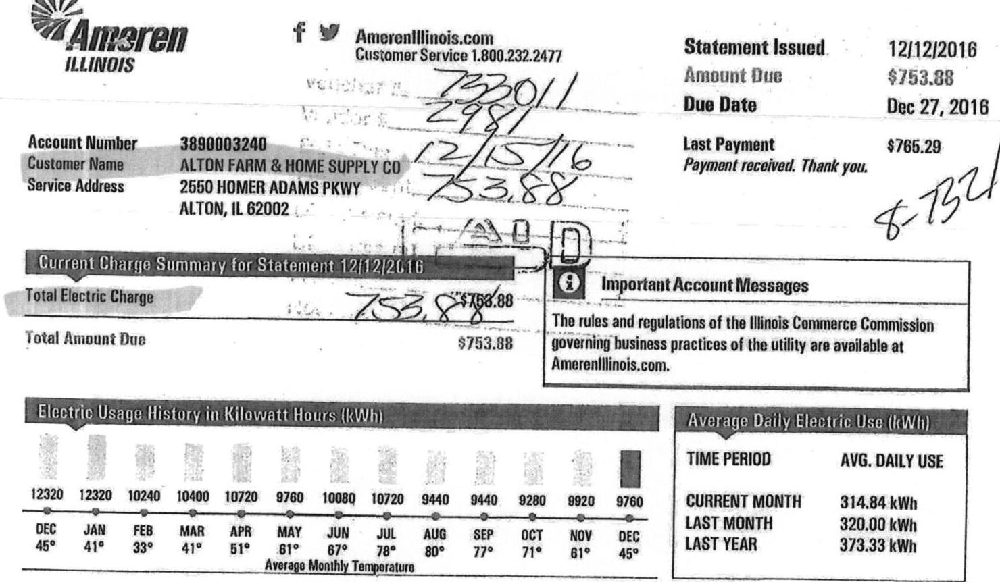

The image is a photo of a utility bill from Ameren Illinois. 

- **Header Information:**
  - Logo: Ameren Illinois
  - Website: AmerenIllinois.com
  - Customer Service: 1.800.232.2477

- **Account Information:**
  - Account Number: 3890003240
  - Customer Name: ALTON FARM & HOME SUPPLY CO
  - Service Address: 2550 HOMER ADAMS PKWY, ALTON, IL 62002

- **Statement Details:**
  - Statement Issued: 12/12/2016
  - Amount Due: $753.88
  - Due Date: Dec 27, 2016
  - Last Payment: $765.29 (Payment received. Thank you.)

- **Charge Summary:**
  - Current Charge Summary for Statement 12/12/2016
  - Total Electric Charge: $753.88
  - Total Amount Due: $753.88

- **Important Account Messages:**
  - The rules and regulations of the Illinois Commerce Commission governing business practices of the utility are available at AmerenIllinois.com.

- **Electric Usage History in Kilowatt Hours (kWh):**
  - DEC: 12320
  - JAN: 12320
  - FEB: 10240
  - MAR: 10400
  - APR: 10720
  - MAY: 9760
  - JUN: 10080
  - JUL: 10720
  - AUG: 9440
  - SEP: 9440
  - OCT: 9280
  - NOV: 9920
  - DEC: 9760
  - Average Monthly Temperature: DEC 45°, JAN 41°, FEB 33°, MAR 41°, APR 51°, MAY 61°, JUN 67°, JUL 78°, AUG 80°, SEP 77°, OCT 71°, NOV 61°, DEC 45°

- **Average Daily Electric Use (kWh):**
  - TIME PERIOD: AVG. DAILY USE
  - CURRENT MONTH: 314.84 kWh
  - LAST MONTH: 320.00 kWh
  - LAST YEAR: 373.33 kWh

As part of your
storm preparations
be sure that Ameren Illinois has your current phone number.

You can update your profile at Ameren Illinois.com. This simple step will make it easier to report or check the status of an autoge if winter storms leave you in the dark or in the cold.

| Account Number | 3890083248 |
| :-- | :-- |
| Customer Name | 4170N FARM \& HOME SUPPLY CO |
| Service Address | 2550 HOMER ADAMS PKWY |
|  | 4170N, IL 62002 |

| Payment Details |  |  |  |  |  |
| :--: | :--: | :--: | :--: | :--: | :--: |
| Payment Received | DATE |  | AMOUNT |  |  |
|  | November 21, 2016 |  | \$765.29 |  |  |
| Electric Seizure Non-Residential Sillian Dataft Data Zone |  |  |  |  | 11/08/2016 - 12/07/2016 (31 days) |
| Electric Meter Road for 11/08/2016 - 12/07/2016 (31 days) |  |  |  |  |  |
| READ TYPE | METER NUMBER | CURRENT METER READ | PREVIOUS METER READ | READ DIFFERENCE | MULTIPLIER | USAGE |
| Total kWh | 06610261 | 5374.0000 Actual | 6313.0000 Actual | 61.0000 | 160.0000 | 9760.0000 |
| Usage Summary |  |  |  |  |  |  |
| Total kWh |  | 9760.0000 | Non-Summer kWh |  |  | 9760.0000 |
| Electric Delivery | CHARGE DESCRIPTION |  | USAGE UNIT |  | RATE | CHARGE |
| Ameren Illinois | Customer Charge |  |  |  |  | \$31.13 |
| DS-2 Small General Delivery | Mater Charge |  |  |  |  | \$8.37 |
| Service | Distribution Delivery Charge Non-Summer | 2,000.00 | kWh | @ \$ 0.02158000 |  | \$43.12 |
|  | Distribution Delivery Charge Non-Summer | 7,760.00 | kWh | @ \$ 0.01107000 |  | \$85.90 |
|  | Electric Environmental Adjustment | 0,760.00 | kWh | @ \$ 0.00014840 |  | $\$ - 1.45$ |
|  | Energy Efficiency Demand Response | 0,760.00 | kWh | @ \$ 0.00441000 |  | \$43.04 |
|  |  |  |  | Electric Delivery |  | \$210.11 |
| Electric Supply | SUPPLIER ENERGY CHARGES | 9,760.00 | kWh | @ \$ 0.05060000 |  | \$403.86 |
| AEP Energy |  |  |  | Electric Supply |  | \$403.86 |
| Taxes and Other Fees | Alten Municipal Tax |  |  |  |  | \$4.86 |
|  | Illinois State Electricity Excise Tax |  |  |  |  | \$31.35 |
|  | EDT Cost Recovery |  |  |  |  | \$13.90 |
|  |  |  |  | Total Tax Related Fees |  | \$46.91 |
|  |  |  | Total Electric Charges |  |  | \$753.88 |

# 3 Details From Your Electric Supplier 

## AEP Energy

www.AEPenergy.com
866.258.3762

Refer to supply contract for details.
For more information about your electric supply choices, visit www.phagiellinois.org.

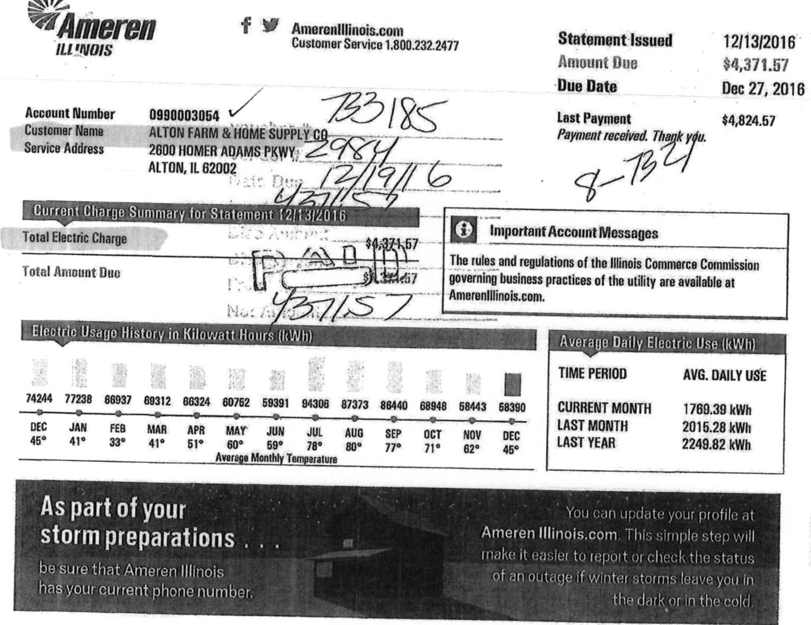

The image is a photo of an electricity bill from Ameren Illinois. It includes various sections with text and data:

- **Header Information:**
  - Logo: Ameren Illinois
  - Website: AmerenIllinois.com
  - Customer Service: 1.800.232.2477

- **Account Information:**
  - Account Number: 0990003054
  - Customer Name: ALTON FARM & HOME SUPPLY CO.
  - Service Address: 2600 HOMER ADAMS PKWY, ALTON, IL 62002

- **Statement Details:**
  - Statement Issued: 12/13/2016
  - Amount Due: $4,371.57
  - Due Date: Dec 27, 2016
  - Last Payment: $4,824.57
  - Note: Payment received. Thank you.

- **Current Charge Summary for Statement 12/13/2016:**
  - Total Electric Charge: $4,371.57
  - Total Amount Due: (Handwritten notes and numbers are present)

- **Important Account Messages:**
  - Text: The rules and regulations of the Illinois Commerce Commission governing business practices of the utility are available at AmerenIllinois.com.

- **Electric Usage History in Kilowatt Hours (kWh):**
  - Monthly data from December to December with corresponding kWh values and average monthly temperatures:
    - DEC: 74244, 45°
    - JAN: 77238, 41°
    - FEB: 86937, 33°
    - MAR: 69312, 41°
    - APR: 66324, 51°
    - MAY: 60752, 60°
    - JUN: 59391, 59°
    - JUL: 94306, 78°
    - AUG: 87373, 80°
    - SEP: 88440, 77°
    - OCT: 68948, 71°
    - NOV: 58443, 62°
    - DEC: 58390, 45°

- **Average Daily Electric Use (kWh):**
  - TIME PERIOD: AVG. DAILY USE
  - CURRENT MONTH: 1769.39 kWh
  - LAST MONTH: 2015.28 kWh
  - LAST YEAR: 2249.82 kWh

- **Additional Message:**
  - As part of your storm preparations, be sure that Ameren Illinois has your current phone number.
  - You can update your profile at AmerenIllinois.com. This simple step will make it easier to report or check the status of an outage if winter storms leave you in the dark or in the cold.

|  |  |  | Statement Issued | 12/13/2016 |
| :--: | :--: | :--: | :--: | :--: |
|  |  |  | Amount Due | \$4,371.57 |
| Account Number | 0990003854 |  | Due Date | Dec 27, 2016 |
| Customer Name | ALTON FARM \& HOME SUPPLY CO |  |  |  |
| Service Address | 2000 HOMER ADAMS PKWY |  |  |  |
|  | ALTON, IL 62002 |  |  |  |

| Payment Details |  |  |  |
| :--: | :--: | :--: | :--: |
|  | DATE | AMOUNT |  |
| Payment Received | November 21, 2016 | \$4,824.57 |  |

# Electric-Meter Read for 11/04/2016 - 12/07/2016 (33 days) 

| READ TYPE | METER NUMBER | CURRENT METER READ | PREVIOUS METER READ | READ DIFFERENCE | MULTIPLIER | USAGE |
| :--: | :--: | :--: | :--: | :--: | :--: | :--: |
| Total kWh | 17314256 | 58390.0000 Estimate | 0.0000 Actual | 58390.0000 | 1.0000 | 58390.0000 |
| On Peak kWh | 17314256 | 23106.0000 Estimate | 0.0000 Actual | 23106.0000 | 1.0000 | 23106.0000 |
| Off Peak kWh | 17314256 | 35284.0000 Estimate | 0.0000 Actual | 35284.0000 | 1.0000 | 35284.0000 |
| Peak kW | 17314256 | 121.6510 Estimate | 0.0000 Actual | 121.6510 | 1.0000 | 121.6510 |
| On Peak kW | 17314256 | 121.6510 Estimate | 0.0000 Actual | 121.6510 | 1.0000 | 121.6510 |
| Off Peak kW | 17314256 | 102.2980 Estimate | 0.0000 Actual | 102.2980 | 1.0000 | 102.2980 |

Usage Summary
Total kWh
Off-Peak kWh
On-Peak kW
12 Month Max Demand

|  | 58390.0000 | On-Peak kWh | 23106.0000 |
| :--: | :--: | :--: | :--: |
|  | 35284.0000 | Peak kW | 121.7000 |
|  | 121.7000 | Off-Peak kW | 102.3000 |
|  | 207.9000 |  |  |

| Electric Delivery | CHARGE DESCRIPTION | USAGE UNIT | RATE | CHARGE |
| :--: | :--: | :--: | :--: | :--: |
| Ameren Illinois | Customer Charge |  |  | \$65.32 |
| DS-3 General Delivery |  |  |  | \$10.52 |
| Service $<400 \mathrm{~kW}$ | Distribution Delivery kW Charge | 121.70 kW | @ \$ 6.79500000 | \$826.95 |
|  | Transformation Charge | 207.80 kW | @ \$ 0.59000000 | \$122.60 |
|  | Electric Environmental Adjustment | 58,390.00 kWh | @ \$ 0.00008060 | \$4.71 |
|  | Energy Efficiency Demand Response | 58,390.00 kWh | @ \$ 0.00176000 | \$102.77 |
|  |  |  | Electric Delivery | \$1,123.45 |
| Electric Supply | SUPPLIER ENERGY CHARGES | 58,389.00 kWh | @ \$ 0.05080000 | \$2,954.52 |
| AEP Energy |  |  |  |  |
|  |  |  | Electric Supply | \$2,954.52 |
| Taxes and Other Foes | Alton Municipal Tax |  |  | \$25.28 |
|  | Illinois State Electricity Excise Tax |  |  | \$185.14 |
|  | EDT Cost Recovery |  |  | \$83.16 |
|  |  |  | Total Tax Related Foes | \$293.90 |

Total Electric Charges \$4,371.57
Dutails From Your Electric Supplier
AEP Energy
www.AEPenergy.com
866.258 .3782

| Account Number | 0753077039 |
| :-- | :-- |
| Customer Name | HAVANA FARM \& HOME SUPPLY |
| Service Address | 1001 E LAUREL AVE |
|  | HAVANA, IL 62644 |

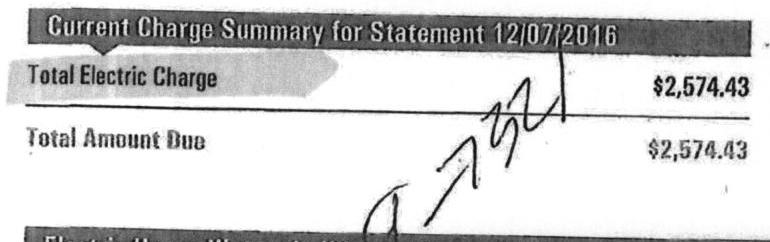

The image is a photo of a document showing a billing summary. 

- **Text:**
  - "Current Charge Summary for Statement 12/07/2016"
  - "Total Electric Charge" with an amount of "$2,574.43"
  - "Total Amount Due" with an amount of "$2,574.43"

- **Styling:**
  - The "Total Electric Charge" section has a shaded background.
  - There is a handwritten signature or scribble near the "Total Amount Due" section.

Important Account Messages
The rules and regulations of the Illinois Commerce Commission governing business practices of the utility are available at AmerenIllinois.com.

| Account Daily Elicitio Use (EVR) |  |  |  |  |  |  |  |  |  |
| :--: | :--: | :--: | :--: | :--: | :--: | :--: | :--: | :--: | :--: |
| TIME PERIOD |  | AVG. DAILY USE |  |  |  |  |  |  |  |
| CURRENT MONTH |  | 1164.80 kWh |  |  |  |  |  |  |  |
| LAST MONTH |  | 1647.48 kWh |  |  |  |  |  |  |  |
| LAST YEAR |  | 1145.60 kWh |  |  |  |  |  |  |  |

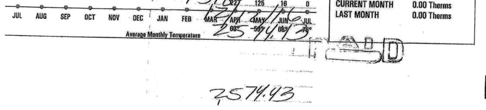

The image is a photo of a document showing part of a billing summary.

- **Text:**
  - "JUL AUG SEP OCT NOV DEC JAN FEB MAR APR MAY JUN JUL"
  - "Average Monthly Temperature"
  - "CURRENT MONTH 0.00 Therms"
  - "LAST MONTH 0.00 Therms"
  - Handwritten text: "2574.43"

- **Styling:**
  - There is a line graph with dots representing each month.
  - The handwritten text "2574.43" is prominently displayed near the bottom.

| See page 2 for account messages and tips from Ameren Illinois. | Keep this partien for your records. |  |  |  |  |  |  |  |  |
| :--: | :--: | :--: | :--: | :--: | :--: | :--: | :--: | :--: | :--: |

|  | Ameren | Amerenillinois.com |
| :--: | :--: | :--: |
| ILLINOIS | Customer Service 1.800.232.2477 |  |
| Account Numlier Customer Name Service Address | 0763077039 |  |
|  | HAVANA FARM \& HOME SUPPLY | Due Date |
|  | CO |  |
|  | 1001 E LAUREL AVE |  |
|  | HAVANA, IL 62644 |  |

| Payment Details |  |  |  |  |
| :--: | :--: | :--: | :--: | :--: |
|  | DATE | AMOUNT |  |  |
| Payment Received | November 16, 2016 | \$3,734.74 |  |  |
| Electric Service Non-Residential Silling Details Date Zone 1 |  |  |  | 12/07/2016 |
|  |  |  |  | 12/07/2016 (10 days) |
| Electric Meter Read for 11/01/2016 - 12/01/2016 (30 days) |  |  |  |  |
| READ TYPE | METER NUMBER | CURRENT METER READ | PREVIOUS METER READ | READ DIFFERENCE | MULTIPLIER | USAGE |
| Total kWh | 72019540 | 1931.0000 Estimate | 1749.0000 Actual | 162.0000 | 192.0000 | 34944.0000 |
| Usage Summary |  |  |  |  |
| Total kWh |  | 34944.0000 | Non-Summer kWh |  |  | 34944.0000 |
| Peak kW |  | 61.1000 |  |  |  |  |
| Electric Delivery | CHARGE DESCRIPTION |  | USAGE UNIT | RATE | CHARGE |
| Ameren Illinois | Customer Charge |  |  |  | \$31.13 |
| DS-2 Small General Delivery | Mater Charge |  |  |  | 88.37 |
| Service | Distribution Delivery Charge Non-Summer | 2,000.00 kWh | @ \$ 0.02156000 | \$43.12 |
|  | Distribution Delivery Charge Non-Summer | 32,044.00 kWh | @ \$ 0.01107000 | \$384.69 |
|  | Electric Environmental Adjustment | 34,944.00 kWh | @ \$ 0.00014840 | $\$ 6.19$ |
|  | Energy Efficiency Demand Response | 34,944.00 kWh | @ \$ 0.00441000 | \$164.10 |
|  |  |  | Electric Delivery | \$586.22 |
| Electric Supply | SUPPLIER ENERGY CHARGES | 34,944.00 kWh | @ \$ 0.05199000 | \$1,816.74 |
| AEP Energy |  |  |  |  |
|  |  |  | Electric Supply | \$1,816.74 |
| Taxes and Other Fees | Illinois State Electricity Excise Tax |  |  | \$111.69 |
|  | EDT Cost Recovery |  |  | \$49.78 |
|  |  |  | Total Tax Related Fees | \$181.47 |
|  |  |  | Total Electric Charges | \$2,574.43 |
| (3) |  |  |  |  |
| (4) |  |  |  |  |
| (5) |  |  |  |  |

# 6 Details From Your Electric Supplier 

## AEP Energy

www.AEPenergy.com
866.258 .3782

Refer to supply contract for details.
For more information about your electric supply choices, visit www.phigioillinois.org.

