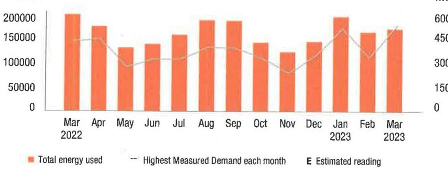

## (1) PSE\&G

We make things work for you.

## Your energy bill

## Message Center

PSE\&G offers a variety of convenient payment options, now including PayPal ${ }^{\circledR}$ and Amazon Pay! To learn more, visit pseg.com/paymentoptions.

At PSE\&G, we make it our business to support your business. That's why we have a dedicated, toll-free phone number to address your energy questions and concerns. PSE\&G's Business Solutions Center is available Monday-Friday, 8:00 a.m. - 5:30 p.m. at 1-855-249-7734 (1-855-BIZ-PSEG).

Smart meters are safe. They use low power radio frequency (RF) that is generally far less than that used by everyday items like baby monitors, cell phones, microwaves, TVs and wireless routers. To learn more about smart meters and their benefits, go to pseg.com/smartmeters.

## NEXT METER READING March 31, 2023

## How to contact us

## 1-855-BIZ-PSEG (249-7734)

Customer Service: 8am to 5:30pm Mon to Fri, Closed on weekends and holidays Emergencies / Outages / WorryFree Services: 24/7 TTY for the hearing impaired: 1-800-225-0072

Visit pseg.com/myaccount to access your account anytime
Text us. Register for MyAlerts by texting REG to 4PSEG(47734) $>$ Text OUT to report an outage.

## 20

facebook.com/pseg
twitter.com/psegdslivers

PAY YOUR WAY, 24/7
We offer a variety of methods that make it easy to pay your bill. See reverse side for more information.

## $[$

By checking this box, I authorize PSE\&G to initiate recurring ACH/Electronic
Debits using the bank account number on the enclosed check.

By checking this box, I authorize PSE\&G to enroll me in paperless billing at this email address:

000375000000586
(IHIIIIIIIIIIIIIIIIIIIIIIIIIIIIIIIIIIIIIIIIIIIIIIIIIIIIII
E W R MANAGEMENT LLC

## ACCOUNT NUMBER

4214252918

## SERVICE ADDRESS

901-923 SPRING ST
ELIZABETH OTY NJ 07201-2101

## Your billing summary

Balance remaining from your last bill
PSE\&G balance from last bill
\$4,376.31
Loss Payment received February 23, 2023 - thank you!
Balance remaining from your last bill
\$0.00

This month's charges and credits
Electric charges - PSE\&G for 1 meter
This month's charges and credits
Total amount due by Mar 27, 2023
\$21,067.62
$\$ 21,067.62$
$\$ 21,067.62$
$\mathrm{I}^{\mathrm{H}} \mathrm{H}_{\mathrm{I}} \mathrm{H}_{\mathrm{I}} \mathrm{H}_{\mathrm{I}} \mathrm{H}_{\mathrm{I}} \mathrm{H}_{\mathrm{I}} \mathrm{H}_{\mathrm{I}} \mathrm{H}_{\mathrm{I}} \mathrm{H}_{\mathrm{I}} \mathrm{H}_{\mathrm{I}} \mathrm{H}_{\mathrm{I}} \mathrm{H}_{\mathrm{I}} \mathrm{H}_{\mathrm{I}} \mathrm{H}_{\mathrm{I}} \mathrm{H}_{\mathrm{I}} \mathrm{H}_{\mathrm{I}} \mathrm{H}_{\mathrm{I}} \mathrm{H}_{\mathrm{I}} \mathrm{H}_{\mathrm{I}} \mathrm{H}_{\mathrm{I}} \mathrm{H}_{\mathrm{I}} \mathrm{H}_{\mathrm{I}} \mathrm{H}_{\mathrm{I}} \mathrm{H}_{\mathrm{I}} \mathrm{H}_{\mathrm{I}} \mathrm{H}_{\mathrm{I}} \mathrm{H}_{\mathrm{I}} \mathrm{H}_{\mathrm{I}} \mathrm{H}_{\mathrm{I}} \mathrm{H}_{\mathrm{I}} \mathrm{H}_{\mathrm{I}} \mathrm{H}_{\mathrm{I}} \mathrm{H}_{\mathrm{I}} \mathrm{H}_{\mathrm{I}} \mathrm{H}_{\mathrm{I}} \mathrm{H}_{\mathrm{I}} \mathrm{H}_{\mathrm{I}} \mathrm{H}_{\mathrm{I}} \mathrm{H}_{\mathrm{I}} \mathrm{H}_{\mathrm{I}} \mathrm{H}_{\mathrm{I}} \mathrm{H}_{\mathrm{I}} \mathrm{H}_{\mathrm{I}} \mathrm{H}_{\mathrm{I}} \mathrm{H}_{\mathrm{I}} \mathrm{H}_{\mathrm{I}} \mathrm{H}_{\mathrm{I}} \mathrm{H}_{\mathrm{I}} \mathrm{H}_{\mathrm{I}} \mathrm{H}_{\mathrm{I}} \mathrm{H}_{\mathrm{I}} \mathrm{H}_{\mathrm{I}} \mathrm{H}_{\mathrm{I}} \mathrm{H}_{\mathrm{I}} \mathrm{H}_{\mathrm{I}} \mathrm{H}_{\mathrm{I}} \mathrm{H}_{\mathrm{I}} \mathrm{H}_{\mathrm{I}} \mathrm{H}_{\mathrm{I}} \mathrm{H}_{\mathrm{I}} \mathrm{H}_{\mathrm{I}} \mathrm{H}_{\mathrm{I}} \mathrm{H}_{\mathrm{I}} \mathrm{H}_{\mathrm{I}} \mathrm{H}_{\mathrm{I}} \mathrm{H}_{\mathrm{I}} \mathrm{H}_{\mathrm{I}} \mathrm{H}_{\mathrm{I}} \mathrm{H}_{\mathrm{I}} \mathrm{H}_{\mathrm{I}} \mathrm{H}_{\mathrm{I}} \mathrm{H}_{\mathrm{I}} \mathrm{H}_{\mathrm{I}} \mathrm{H}_{\mathrm{I}} \mathrm{H}_{\mathrm{I}} \mathrm{H}_{\mathrm{I}} \mathrm{H}_{\mathrm{I}} \mathrm{H}_{\mathrm{I}} \mathrm{H}_{\mathrm{I}} \mathrm{H}_{\mathrm{I}} \mathrm{H}_{\mathrm{I}} \mathrm{H}_{\mathrm{I}} \mathrm{H}_{\mathrm{I}} \mathrm{H}_{\mathrm{I}} \mathrm{H}_{\mathrm{I}} \mathrm{H}_{\mathrm{I}} \mathrm{H}_{\mathrm{I}} \mathrm{H}_{\mathrm{I}} \mathrm{H}_{\mathrm{I}} \mathrm{H}_{\mathrm{I}} \mathrm{H}_{\mathrm{I}} \mathrm{H}_{\mathrm{I}} \mathrm{H}_{\mathrm{I}} \mathrm{H}_{\mathrm{I}} \mathrm{H}_{\mathrm{I}} \mathrm{H}_{\mathrm{I}} \mathrm{H}_{\mathrm{I}} \mathrm{H}_{\mathrm{I}} \mathrm{H}_{\mathrm{I}} \mathrm{H}_{\mathrm{I}} \mathrm{H}_{\mathrm{I}} \mathrm{H}_{\mathrm{I}} \mathrm{H}_{\mathrm{I}} \mathrm{H}_{\mathrm{I}} \mathrm{H}_{\mathrm{I}} \mathrm{H}_{\mathrm{I}} \mathrm{H}_{\mathrm{I}} \mathrm{H}_{\mathrm{I}} \mathrm{H}_{\mathrm{I}} \mathrm{H}_{\mathrm{I}} \mathrm{H}_{\mathrm{I}} \mathrm{H}_{\mathrm{I}} \mathrm{H}_{\mathrm{I}} \mathrm{H}_{\mathrm{I}} \mathrm{H}_{\mathrm{I}} \mathrm{H}_{\mathrm{I}} \mathrm{H}_{\mathrm{I}} \mathrm{H}_{\mathrm{I}} \mathrm{H}_{\mathrm{I}} \mathrm{H}_{\mathrm{I}} \mathrm{H}_{\mathrm{I}} \mathrm{H}_{\mathrm{I}} \mathrm{H}_{\mathrm{I}} \mathrm{H}_{\mathrm{I}} \mathrm{H}_{\mathrm{I}} \mathrm{H}_{\mathrm{I}} \mathrm{H}_{\mathrm{I}} \mathrm{H}_{\mathrm{I}} \mathrm{H}_{\mathrm{I}} \mathrm{H}_{\mathrm{I}} \mathrm{H}_{\mathrm{I}} \mathrm{H}_{\mathrm{I}} \mathrm{H}_{\mathrm{I}} \mathrm{H}_{\mathrm{I}} \mathrm{H}_{\mathrm{I}} \mathrm{H}_{\mathrm{I}} \mathrm{H}_{\mathrm{I}} \mathrm{H}_{\mathrm{I}} \mathrm{H}_{\mathrm{I}} \mathrm{H}_{\mathrm{I}} \mathrm{H}_{\mathrm{I}} \mathrm{H}_{\mathrm{I}} \mathrm{H}_{\mathrm{I}} \mathrm{H}_{\mathrm{I}} \mathrm{H}_{\mathrm{I}} \mathrm{H}_{\mathrm{I}} \mathrm{H}_{\mathrm{I}} \mathrm{H}_{\mathrm{I}} \mathrm{H}_{\mathrm{I}} \mathrm{H}_{\mathrm{I}} \mathrm{H}_{\mathrm{I}} \mathrm{H}_{\mathrm{I}} \mathrm{H}_{\mathrm{I}} \mathrm{H}_{\mathrm{I}} \mathrm{H}_{\mathrm{I}} \mathrm{H}_{\mathrm{I}} \mathrm{H}_{\mathrm{I}} \mathrm{H}_{\mathrm{I}} \mathrm{H}_{\mathrm{I}} \mathrm{H}_{\mathrm{I}} \mathrm{H}_{\mathrm{I}} \mathrm{H}_{\mathrm{I}} \mathrm{H}_{\mathrm{I}} \mathrm{H}_{\mathrm{I}} \mathrm{H}_{\mathrm{I}} \mathrm{H}_{\mathrm{I}} \mathrm{H}_{\mathrm{I}} \mathrm{H}_{\mathrm{I}} \mathrm{H}_{\mathrm{I}} \mathrm{H}_{\mathrm{I}} \mathrm{H}_{\mathrm{I}} \mathrm{H}_{\mathrm{I}} \mathrm{H}_{\mathrm{I}} \mathrm{H}_{\mathrm{I}} \mathrm{H}_{\mathrm{I}} \mathrm{H}_{\mathrm{I}} \mathrm{H}_{\mathrm{I}} \mathrm{H}_{\mathrm{I}} \mathrm{H}_{\mathrm{I}} \mathrm{H}_{\mathrm{I}} \mathrm{H}_{\mathrm{I}} \mathrm{H}_{\mathrm{I}} \mathrm{H}_{\mathrm{I}} \mathrm{H}_{\mathrm{I}} \mathrm{H}_{\mathrm{I}} \mathrm{H}_{\mathrm{I}} \mathrm{H}_{\mathrm{I}} \mathrm{H}_{\mathrm{I}} \mathrm{H}_{\mathrm{I}} \mathrm{H}_{\mathrm{I}} \mathrm{H}_{\mathrm{I}} \mathrm{H}_{\mathrm{I}} \mathrm{H}_{\mathrm{I}} \mathrm{H}_{\mathrm{I}} \mathrm{H}_{\mathrm{I}} \mathrm{H}_{\mathrm{I}} \mathrm{H}_{\mathrm{I}} \mathrm{H}_{\mathrm{I}} \mathrm{H}_{\mathrm{I}} \mathrm{H}_{\mathrm{I}} \mathrm{H}_{\mathrm{I}} \mathrm{H}_{\mathrm{I}} \mathrm{H}_{\mathrm{I}} \mathrm{H}_{\mathrm{I}} \mathrm{H}_{\mathrm{I}} \mathrm{H}_{\mathrm{I}} \mathrm{H}_{\mathrm{I}} \mathrm{H}_{\mathrm{I}} \mathrm{H}_{\mathrm{I}} \mathrm{H}_{\mathrm{I}} \mathrm{H}_{\mathrm{I}} \mathrm{H}_{\mathrm{I}} \mathrm{H}_{\mathrm{I}} \mathrm{H}_{\mathrm{I}} \mathrm{H}_{\mathrm{I}} \mathrm{H}_{\mathrm{I}} \mathrm{H}_{\mathrm{I}} \mathrm{H}_{\mathrm{I}} \mathrm{H}_{\mathrm{I}} \mathrm{H}_{\mathrm{I}} \mathrm{H}_{\mathrm{I}} \mathrm{H}_{\mathrm{I}} \mathrm{H}_{\mathrm{I}} \mathrm{H}_{\mathrm{I}} \mathrm{H}_{\mathrm{I}} \mathrm{H}_{\mathrm{I}} \mathrm{H}_{\mathrm{I}} \mathrm{H}_{\mathrm{I}} \mathrm{H}_{\mathrm{I}} \mathrm{H}_{\mathrm{I}} \mathrm{H}_{\mathrm{I}} \mathrm{H}_{\mathrm{I}} \mathrm{H}_{\mathrm{I}} \mathrm{H}_{\mathrm{I}} \mathrm{H}_{\mathrm{I}} \mathrm{H}_{\mathrm{I}} \mathrm{H}_{\mathrm{I}} \mathrm{H}_{\mathrm{I}} \mathrm{H}_{\mathrm{I}} \mathrm{H}_{\mathrm{I}} \mathrm{H}_{\mathrm{I}} \mathrm{H}_{\mathrm{I}} \mathrm{H}_{\mathrm{I}} \mathrm{H}_{\mathrm{I}} \mathrm{H}_{\mathrm{I}} \mathrm{H}_{\mathrm{I}} \mathrm{H}_{\mathrm{I}} \mathrm{H}_{\mathrm{I}} \mathrm{H}_{\mathrm{I}} \mathrm{H}_{\mathrm{I}} \mathrm{H}_{\mathrm{I}} \mathrm{H}_{\mathrm{I}} \mathrm{H}_{\mathrm{I}} \mathrm{H}_{\mathrm{I}} \mathrm{H}_{\mathrm{I}} \mathrm{H}_{\mathrm{I}} \mathrm{H}_{\mathrm{I}} \mathrm{H}_{\mathrm{I}} \mathrm{H}_{\mathrm{I}} \mathrm{H}_{\mathrm{I}} \mathrm{H}_{\mathrm{I}} \mathrm{H}_{\mathrm{I}} \mathrm{H}_{\mathrm{I}} \mathrm{H}_{\mathrm{I}} \mathrm{H}_{\mathrm{I}} \mathrm{H}_{\mathrm{I}} \mathrm{H}_{\mathrm{I}} \mathrm{H}_{\mathrm{I}} \mathrm{H}_{\mathrm{I}} \mathrm{H}_{\mathrm{I}} \mathrm{H}_{\mathrm{I}} \mathrm{H}_{\mathrm{I}} \mathrm{H}_{\mathrm{I}} \mathrm{H}_{\mathrm{I}} \mathrm{H}_{\mathrm{I}} \mathrm{H}_{\mathrm{I}} \mathrm{H}_{\mathrm{I}} \mathrm{H}_{\mathrm{I}} \mathrm{H}_{\mathrm{I}} \mathrm{H}_{\mathrm{I}} \mathrm{H}_{\mathrm{I}} \mathrm{H}_{\mathrm{I}} \mathrm{H}_{\mathrm{I}} \mathrm{H}_{\mathrm{I}} \mathrm{H}_{\mathrm{I}} \mathrm{H}_{\mathrm{I}} \mathrm{H}_{\mathrm{I}} \mathrm{H}_{\mathrm{I}} \mathrm{H}_{\mathrm{I}} \mathrm{H}_{\mathrm{I}} \mathrm{H}_{\mathrm{I}} \mathrm{H}_{\mathrm{I}} \mathrm{H}_{\mathrm{I}} \mathrm{H}_{\mathrm{I}} \mathrm{H}_{\mathrm{I}} \mathrm{H}_{\mathrm{I}} \mathrm{H}_{\mathrm{I}} \mathrm{H}_{\mathrm{I}} \mathrm{H}_{\mathrm{I}} \mathrm{H}_{\mathrm{I}} \mathrm{H}_{\mathrm{I}} \mathrm{H}_{\mathrm{I}} \mathrm{H}_{\mathrm{I}} \mathrm{H}_{\mathrm{I}} \mathrm{H}_{\mathrm{I}} \mathrm{H}_{\mathrm{I}} \mathrm{H}_{\mathrm{I}} \mathrm{H}_{\mathrm{I}} \mathrm{H}_{\mathrm{I}} \mathrm{H}_{\mathrm{I}} \mathrm{H}_{\mathrm{I}} \mathrm{H}_{\mathrm{I}} \mathrm{H}_{\mathrm{I}} \mathrm{H}_{\mathrm{I}} \mathrm{H}_{\mathrm{I}} \mathrm{H}_{\mathrm{I}} \mathrm{H}_{\mathrm{I}} \mathrm{H}_{\mathrm{I}} \mathrm{H}_{\mathrm{I}} \mathrm{H}_{\mathrm{I}} \mathrm{H}_{\mathrm{I}} \mathrm{H}_{\mathrm{I}} \mathrm{H}_{\mathrm{I}} \mathrm{H}_{\mathrm{I}} \mathrm{H}_{\mathrm{I}} \mathrm{H}_{\mathrm{I}} \mathrm{H}_{\mathrm{I}} \mathrm{H}_{\mathrm{I}} \mathrm{H}_{\mathrm{I}} \mathrm{H}_{\mathrm{I}} \mathrm{H}_{\mathrm{I}} \mathrm{H}_{\mathrm{I}} \mathrm{H}_{\mathrm{I}} \mathrm{H}_{\mathrm{I}} \mathrm{H}_{\mathrm{I}} \mathrm{H}_{\mathrm{I}} \mathrm{H}_{\mathrm{I}} \mathrm{H}_{\mathrm{I}} \mathrm{H}_{\mathrm{I}} \mathrm{H}_{\mathrm{I}} \mathrm{H}_{\mathrm{I}} \mathrm{H}_{\mathrm{I}} \mathrm{H}_{\mathrm{I}} \mathrm{H}_{\mathrm{I}} \mathrm{H}_{\mathrm{I}} \mathrm{H}_{\mathrm{I}} \mathrm{H}_{\mathrm{I}} \mathrm{H}_{\mathrm{I}} \mathrm{H}_{\mathrm{I}} \mathrm{H}_{\mathrm{I}} \mathrm{H}_{\mathrm{I}} \mathrm{H}_{\mathrm{I}} \mathrm{H}_{\mathrm{I}} \mathrm{H}_{\mathrm{I}} \mathrm{H}_{\mathrm{I}} \mathrm{H}_{\mathrm{I}} \mathrm{H}_{\mathrm{I}} \mathrm{H}_{\mathrm{I}} \mathrm{H}_{\mathrm{I}} \mathrm{H}_{\mathrm{I}} \mathrm{H}_{\mathrm{I}} \mathrm{H}_{\mathrm{I}} \mathrm{H}_{\mathrm{I}} \mathrm{H}_{\mathrm{I}} \mathrm{H}_{\mathrm{I}} \mathrm{H}_{\mathrm{I}} \mathrm{H}_{\mathrm{I}} \mathrm{H}_{\mathrm{I}} \mathrm{H}_{\mathrm{I}} \mathrm{H}_{\mathrm{I}} \mathrm{H}_{\mathrm{I}} \mathrm{H}_{\mathrm{I}} \mathrm{H}_{\mathrm{I}} \mathrm{H}_{\mathrm{I}} \mathrm{H}_{\mathrm{I}} \mathrm{H}_{\mathrm{I}} \mathrm{H}_{\mathrm{I}} \mathrm{H}_{\mathrm{I}} \mathrm{H}_{\mathrm{I}} \mathrm{H}_{\mathrm{I}} \mathrm{H}_{\mathrm{I}} \mathrm{H}_{\mathrm{I}} \mathrm{H}_{\mathrm{I}} \mathrm{H}_{\mathrm{I}} \mathrm{H}_{\mathrm{I}} \mathrm{H}_{\mathrm{I}} \mathrm{H}_{\mathrm{I}} \mathrm{H}_{\mathrm{I}} \mathrm{H}_{\mathrm{I}} \mathrm{H}_{\mathrm{I}} \mathrm{H}_{\mathrm{I}} \mathrm{H}_{\mathrm{I}} \mathrm{H}_{\mathrm{I}} \mathrm{H}_{\mathrm{I}} \mathrm{H}_{\mathrm{I}} \mathrm{H}_{\mathrm{I}} \mathrm{H}_{\mathrm{I}} \mathrm{H}_{\mathrm{I}} \mathrm{H}_{\mathrm{I}} \mathrm{H}_{\mathrm{I}} \mathrm{H}_{\mathrm{I}} \mathrm{H}_{\mathrm{I}} \mathrm{H}_{\mathrm{I}} \mathrm{H}_{\mathrm{I}} \mathrm{H}_{\mathrm{I}} \mathrm{H}_{\mathrm{I}} \mathrm{H}_{\mathrm{I}} \mathrm{H}_{\mathrm{I}} \mathrm{H}_{\mathrm{I}} \mathrm{H}_{\mathrm{I}} \mathrm{H}_{\mathrm{I}} \mathrm{H}_{\mathrm{I}} \mathrm{H}_{\mathrm{I}} \mathrm{H}_{\mathrm{I}} \mathrm{H}_{\mathrm{I}} \mathrm{H}_{\mathrm{I}} \mathrm{H}_{\mathrm{I}} \mathrm{H}_{\mathrm{I}} \mathrm{H}_{\mathrm{I}} \mathrm{H}_{\mathrm{I}} \mathrm{H}_{\mathrm{I}} \mathrm{H}_{\mathrm{I}} \mathrm{H}_{\mathrm{I}} \mathrm{H}_{\mathrm{I}} \mathrm{H}_{\mathrm{I}} \mathrm{H}_{\mathrm{I}} \mathrm{H}_{\mathrm{I}} \mathrm{H}_{\mathrm{I}} \mathrm{H}_{\mathrm{I}} \mathrm{H}_{\mathrm{I}} \mathrm{H}_{\mathrm{I}} \mathrm{H}_{\mathrm{I}} \mathrm{H}_{\mathrm{I}} \mathrm{H}_{\mathrm{I}} \mathrm{H}_{\mathrm{I}} \mathrm{H}_{\mathrm{I}} \mathrm{H}_{\mathrm{I}} \mathrm{H}_{\mathrm{I}} \mathrm{H}_{\mathrm{I}} \mathrm{H}_{\mathrm{I}} \mathrm{H}_{\mathrm{I}} \mathrm{H}_{\mathrm{I}} \mathrm{H}_{\mathrm{I}} \mathrm{H}_{\mathrm{I}} \mathrm{H}_{\mathrm{I}} \mathrm{H}_{\mathrm{I}} \mathrm{H}_{\mathrm{I}} \mathrm{H}_{\mathrm{I}} \mathrm{H}_{\mathrm{I}} \mathrm{H}_{\mathrm{I}} \mathrm{H}_{\mathrm{I}} \mathrm{H}_{\mathrm{I}} \mathrm{H}_{\mathrm{I}} \mathrm{H}_{\mathrm{I}} \mathrm{H}_{\mathrm{I}} \mathrm{H}_{\mathrm{I}} \mathrm{H}_{\mathrm{I}} \mathrm{H}_{\mathrm{I}} \mathrm{H}_{\mathrm{I}} \mathrm{H}_{\mathrm{I}} \mathrm{H}_{\mathrm{I}} \mathrm{H}_{\mathrm{I}} \mathrm{H}_{\mathrm{I}} \mathrm{H}_{\mathrm{I}} \mathrm{H}_{\mathrm{I}} \mathrm{H}_{\mathrm{I}} \mathrm{H}_{\mathrm{I}} \mathrm{H}_{\mathrm{I}} \mathrm{H}_{\mathrm{I}} \mathrm{H}_{\mathrm{I}} \mathrm{H}_{\mathrm{I}} \mathrm{H}_{\mathrm{I}} \mathrm{H}_{\mathrm{I}} \mathrm{H}_{\mathrm{I}} \mathrm{H}_{\mathrm{I}} \mathrm{H}_{\mathrm{I}} \mathrm{H}_{\mathrm{I}} \mathrm{H}_{\mathrm{I}} \mathrm{H}_{\mathrm{I}} \mathrm{H}_{\mathrm{I}} \mathrm{H}_{\mathrm{I}} \mathrm{H}_{\mathrm{I}} \mathrm{H}_{\mathrm{I}} \mathrm{H}_{\mathrm{I}} \mathrm{H}_{\mathrm{I}} \mathrm{H}_{\mathrm{I}} \mathrm{H}_{\mathrm{I}} \mathrm{H}_{\mathrm{I}} \mathrm{H}_{\mathrm{I}} \mathrm{H}_{\mathrm{I}} \mathrm{H}_{\mathrm{I}} \mathrm{H}_{\mathrm{I}} \mathrm{H}_{\mathrm{I}} \mathrm{H}_{\mathrm{I}} \mathrm{H}_{\mathrm{I}} \mathrm{H}_{\mathrm{I}} \mathrm{H}_{\mathrm{I}} \mathrm{H}_{\mathrm{I}} \mathrm{H}_{\mathrm{I}} \mathrm{H}_{\mathrm{I}} \mathrm{H}_{\mathrm{I}} \mathrm{H}_{\mathrm{I}} \mathrm{H}_{\mathrm{I}} \mathrm{H}_{\mathrm{I}} \mathrm{H}_{\mathrm{I}} \mathrm{H}_{\mathrm{I}} \mathrm{H}_{\mathrm{I}} \mathrm{H}_{\mathrm{I}} \mathrm{H}_{\mathrm{I}} \mathrm{H}_{\mathrm{I}} \mathrm{H}_{\mathrm{I}} \mathrm{H}_{\mathrm{I}} \mathrm{H}_{\mathrm{I}} \mathrm{H}_{\mathrm{I}} \mathrm{H}_{\mathrm{I}} \mathrm{H}_{\mathrm{I}} \mathrm{H}_{\mathrm{I}} \mathrm{H}_{\mathrm{I}} \mathrm{H}_{\mathrm{I}} \mathrm{H}_{\mathrm{I}} \mathrm{H}_{\mathrm{I}} \mathrm{H}_{\mathrm{I}} \mathrm{H}_{\mathrm{I}} \mathrm{H}_{\mathrm{I}} \mathrm{H}_{\mathrm{I}} \mathrm{H}_{\mathrm{I}} \mathrm{H}_{\mathrm{I}} \mathrm{H}_{\mathrm{I}} \mathrm{H}_{\mathrm{I}} \mathrm{H}_{\mathrm{I}} \mathrm{H}_{\mathrm{I}} \mathrm{H}_{\mathrm{I}} \mathrm{H}_{\mathrm{I}} \mathrm{H}_{\mathrm{I}} \mathrm{H}_{\mathrm{I}} \mathrm{H}_{\mathrm{I}} \mathrm{H}_{\mathrm{I}} \mathrm{H}_{\mathrm{I}} \mathrm{H}_{\mathrm{I}} \mathrm{H}_{\mathrm{I}} \mathrm{H}_{\mathrm{I}} \mathrm{H}_{\mathrm{I}} \mathrm{H}_{\mathrm{I}} \mathrm{H}_{\mathrm{I}} \mathrm{H}_{\mathrm{I}} \mathrm{H}_{\mathrm{I}} \mathrm{H}_{\mathrm{I}} \mathrm{H}_{\mathrm{I}} \mathrm{H}_{\mathrm{I}} \mathrm{H}_{\mathrm{I}} \mathrm{H}_{\mathrm{I}} \mathrm{H}_{\mathrm{I}} \mathrm{H}_{\mathrm{I}} \mathrm{H}_{\mathrm{I}} \mathrm{H}_{\mathrm{I}} \mathrm{H}_{\mathrm{I}} \mathrm{H}_{\mathrm{I}} \mathrm{H}_{\mathrm{I}} \mathrm{H}_{\mathrm{I}} \mathrm{H}_{\mathrm{I}} \mathrm{H}_{\mathrm{I}} \mathrm{H}_{\mathrm{I}} \mathrm{H}_{\mathrm{I}} \mathrm{H}_{\mathrm{I}} \mathrm{H}_{\mathrm{I}} \mathrm{H}_{\mathrm{I}} \mathrm{H}_{\mathrm{I}} \mathrm{H}_{\mathrm{I}} \mathrm{H}_{\mathrm{I}} \mathrm{H}_{\mathrm{I}} \mathrm{H}_{\mathrm{I}} \mathrm{H}_{\mathrm{I}} \mathrm{H}_{\mathrm{I}} \mathrm{H}_{\mathrm{I}} \mathrm{H}_{\mathrm{I}} \mathrm{H}_{\mathrm{I}} \mathrm{H}_{\mathrm{I}} \mathrm{H}_{\mathrm{I}} \mathrm{H}_{\mathrm{I}} \mathrm{H}_{\mathrm{I}} \mathrm{H}_{\mathrm{I}} \mathrm{H}_{\mathrm{I}} \mathrm{H}_{\mathrm{I}} \mathrm{H}_{\mathrm{I}} \mathrm{H}_{\mathrm{I}} \mathrm{H}_{\mathrm{I}} \mathrm{H}_{\mathrm{I}} \mathrm{H}_{\mathrm{I}} \mathrm{H}_{\mathrm{I}} \mathrm{H}_{\mathrm{I}} \mathrm{H}_{\mathrm{I}} \mathrm{H}_{\mathrm{I}} \mathrm{H}_{\mathrm{I}} \mathrm{H}_{\mathrm{I}} \mathrm{H}_{\mathrm{I}} \mathrm{H}_{\mathrm{I}} \mathrm{H}_{\mathrm{I}} \mathrm{H}_{\mathrm{I}} \mathrm{H}_{\mathrm{I}} \mathrm{H}_{\mathrm{I}} \mathrm{H}_{\mathrm{I}} \mathrm{H}_{\mathrm{I}} \mathrm{H}_{\mathrm{I}} \mathrm{H}_{\mathrm{I}} \mathrm{H}_{\mathrm{I}} \mathrm{H}_{\mathrm{I}} \mathrm{H}_{\mathrm{I}} \mathrm{H}_{\mathrm{I}} \mathrm{H}_{\mathrm{I}} \mathrm{H}_{\mathrm{I}} \mathrm{H}_{\mathrm{I}} \mathrm{H}_{\mathrm{I}} \mathrm{H}_{\mathrm{I}} \mathrm{H}_{\mathrm{I}} \mathrm{H}_{\mathrm{I}} \mathrm{H}_{\mathrm{I}} \mathrm{H}_{\mathrm{I}} \mathrm{H}_{\mathrm{I}} \mathrm{H}_{\mathrm{I}} \mathrm{H}_{\mathrm{I}} \mathrm{H}_{\mathrm{I}} \mathrm{H}_{\mathrm{I}} \mathrm{H}_{\mathrm{I}} \mathrm{H}_{\mathrm{I}} \mathrm{H}_{\mathrm{I}} \mathrm{H}_{\mathrm{I}} \mathrm{H}_{\mathrm{I}} \mathrm{H}_{\mathrm{I}} \mathrm{H}_{\mathrm{I}} \mathrm{H}_{\mathrm{I}} \mathrm{H}_{\mathrm{I}} \mathrm{H}_{\mathrm{I}} \mathrm{H}_{\mathrm{I}} \mathrm{H}_{\mathrm{I}} \mathrm{H}_{\mathrm{I}} \mathrm{H}_{\mathrm{I}} \mathrm{H}_{\mathrm{I}} \mathrm{H}_{\mathrm{I}} \mathrm{H}_{\mathrm{I}} \mathrm{H}_{\mathrm{I}} \mathrm{H}_{\mathrm{I}} \mathrm{H}_{\mathrm{I}} \mathrm{H}_{\mathrm{I}} \mathrm{H}_{\mathrm{I}} \mathrm{H}_{\mathrm{I}} \mathrm{H}_{\mathrm{I}} \mathrm{H}_{\mathrm{I}} \mathrm{H}_{\mathrm{I}} \mathrm{H}_{\mathrm{I}} \mathrm{H}_{\mathrm{I}} \mathrm{H}_{\mathrm{I}} \mathrm{H}_{\mathrm{I}} \mathrm{H}_{\mathrm{I}} \mathrm{H}_{\mathrm{I}} \mathrm{H}_{\mathrm{I}} \mathrm{H}_{\mathrm{I}} \mathrm{H}_{\mathrm{I}} \mathrm{H}_{\mathrm{I}} \mathrm{H}_{\mathrm{I}} \mathrm{H}_{\mathrm{I}} \mathrm{H}_{\mathrm{I}} \mathrm{H}_{\mathrm{I}} \mathrm{H}_{\mathrm{I}} \mathrm{H}_{\mathrm{I}} \mathrm{H}_{\mathrm{I}} \mathrm{H}_{\mathrm{I}} \mathrm{H}_{\mathrm{I}} \mathrm{H}_{\mathrm{I}} \mathrm{H}_{\mathrm{I}} \mathrm{H}_{\mathrm{I}} \mathrm{H}_{\mathrm{I}} \mathrm{H}_{\mathrm{I}} \mathrm{H}_{\mathrm{I}} \mathrm{H}_{\mathrm{I}} \mathrm{H}_{\mathrm{I}} \mathrm{H}_{\mathrm{I}} \mathrm{H}_{\mathrm{I}} \mathrm{H}_{\mathrm{I}} \mathrm{H}_{\mathrm{I}} \mathrm{H}_{\mathrm{I}} \mathrm{H}_{\mathrm{I}} \mathrm{H}_{\mathrm{I}} \mathrm{H}_{\mathrm{I}} \mathrm{H}_{\mathrm{I}} \mathrm{H}_{\mathrm{I}} \mathrm{H}_{\mathrm{I}} \mathrm{H}_{\mathrm{I}} \mathrm{H}_{\mathrm{I}} \mathrm{H}_{\mathrm{I}} \mathrm{H}_{\mathrm{I}} \mathrm{H}_{\mathrm{I}} \mathrm{H}_{\mathrm{I}} \mathrm{H}_{\mathrm{I}} \mathrm{H}_{\mathrm{I}} \mathrm{H}_{\mathrm{I}} \mathrm{H}_{\mathrm{I}} \mathrm{H}_{\mathrm{I}} \mathrm{H}_{\mathrm{I}} \mathrm{H}_{\mathrm{I}} \mathrm{H}_{\mathrm{I}} \mathrm{H}_{\mathrm{I}} \mathrm{H}_{\mathrm{I}} \mathrm{H}_{\mathrm{I}} \mathrm{H}_{\mathrm{I}} \mathrm{H}_{\mathrm{I}} \mathrm{H}_{\mathrm{I}} \mathrm{H}_{\mathrm{I}} \mathrm{H}_{\mathrm{I}} \mathrm{H}_{\mathrm{I}} \mathrm{H}_{\mathrm{I}} \mathrm{H}_{\mathrm{I}} \mathrm{H}_{\mathrm{I}} \mathrm{H}_{\mathrm{I}} \mathrm{H}_{\mathrm{I}} \mathrm{H}_{\mathrm{I}} \mathrm{H}_{\mathrm{I}} \mathrm{H}_{\mathrm{I}} \mathrm{H}_{\mathrm{I}} \mathrm{H}_{\mathrm{I}} \mathrm{H}_{\mathrm{I}} \mathrm{H}_{\mathrm{I}} \mathrm{H}_{\mathrm{I}} \mathrm{H}_{\mathrm{I}} \mathrm{H}_{\mathrm{I}} \mathrm{H}_{\mathrm{I}} \mathrm{H}_{\mathrm{I}} \mathrm{H}_{\mathrm{I}} \mathrm{H}_{\mathrm{I}} \mathrm{H}_{\mathrm{I}} \mathrm{H}_{\mathrm{I}} \mathrm{H}_{\mathrm{I}} \mathrm{H}_{\mathrm{I}} \mathrm{H}_{\mathrm{I}} \mathrm{H}_{\mathrm{I}} \mathrm{H}_{\mathrm{I}} \mathrm{H}_{\mathrm{I}} \mathrm{H}_{\mathrm{I}} \mathrm{H}_{\mathrm{I}} \mathrm{H}_{\mathrm{I}} \mathrm{H}_{\mathrm{I}} \mathrm{H}_{\mathrm{I}} \mathrm{H}_{\mathrm{I}} \mathrm{H}_{\mathrm{I}} \mathrm{H}_{\mathrm{I}} \mathrm{H}_{\mathrm{I}} \mathrm{H}_{\mathrm{I}} \mathrm{H}_{\mathrm{I}} \mathrm{H}_{\mathrm{I}} \mathrm{H}_{\mathrm{I}} \mathrm{H}_{\mathrm{I}} \mathrm{H}_{\mathrm{I}} \mathrm{H}_{\mathrm{I}} \mathrm{H}_{\mathrm{I}} \mathrm{H}_{\mathrm{I}} \mathrm{H}_{\mathrm{I}} \mathrm{H}_{\mathrm{I}} \mathrm{H}_{\mathrm{I}} \mathrm{H}_{\mathrm{I}} \mathrm{H}_{\mathrm{I}} \mathrm{H}_{\mathrm{I}} \mathrm{H}_{\mathrm{I}} \mathrm{H}_{\mathrm{I}} \mathrm{H}_{\mathrm{I}} \mathrm{H}_{\mathrm{I}} \mathrm{H}_{\mathrm{I}} \mathrm{H}_{\mathrm{I}} \mathrm{H}_{\mathrm{I}} \mathrm{H}_{\mathrm{I}} \mathrm{H}_{\mathrm{I}} \mathrm{H}_{\mathrm{I}} \mathrm{H}_{\mathrm{I}} \mathrm{H}_{\mathrm{I}} \mathrm{H}_{\mathrm{I}} \mathrm{H}_{\mathrm{I}} \mathrm{H}_{\mathrm{I}} \mathrm{H}_{\mathrm{I}} \mathrm{H}_{\mathrm{I}} \mathrm{H}_{\mathrm{I}} \mathrm{H}_{\mathrm{I}} \mathrm{H}_{\mathrm{I}} \mathrm{H}_{\mathrm{I}} \mathrm{H}_{\mathrm{I}} \mathrm{H}_{\mathrm{I}} \mathrm{H}_{\mathrm{I}} \mathrm{H}_{\mathrm{I}} \mathrm{H}_{\mathrm{I}} \mathrm{H}_{\mathrm{I}} \mathrm{H}_{\mathrm{I}} \mathrm{H}_{\mathrm{I}} \mathrm{H}_{\mathrm{I}} \mathrm{H}_{\mathrm{I}} \mathrm{H}_{\mathrm{I}} \mathrm{H}_{\mathrm{I}} \mathrm{H}_{\mathrm{I}} \mathrm{H}_{\mathrm{I}} \mathrm{H}_{\mathrm{I}} \mathrm{H}_{\mathrm{I}} \mathrm{H}_{\mathrm{I}} \mathrm{H}_{\mathrm{I}} \mathrm{H}_{\mathrm{I}} \mathrm{H}_{\mathrm{I}} \mathrm{H}_{\mathrm{I}} \mathrm{H}_{\mathrm{I}} \mathrm{H}_{\mathrm{I}} \mathrm{H}_{\mathrm{I}} \mathrm{H}_{\mathrm{I}} \mathrm{H}_{\mathrm{I}} \mathrm{H}_{\mathrm{I}} \mathrm{H}_{\mathrm{I}} \mathrm{H}_{\mathrm{I}} \mathrm{H}_{\mathrm{I}} \mathrm{H}_{\mathrm{I}} \mathrm{H}_{\mathrm{I}} \mathrm{H}_{\mathrm{I}} \mathrm{H}_{\mathrm{I}} \mathrm{H}_{\mathrm{I}} \mathrm{H}_{\mathrm{I}} \mathrm{H}_{\mathrm{I}} \mathrm{H}_{\mathrm{I}} \mathrm{H}_{\mathrm{I}} \mathrm{H}_{\mathrm{I}} \mathrm{H}_{\mathrm{I}} \mathrm{H}_{\mathrm{I}} \mathrm{H}_{\mathrm{I}} \mathrm{H}_{\mathrm{I}} \mathrm{H}_{\mathrm{I}} \mathrm{H}_{\mathrm{I}} \mathrm{H}_{\mathrm{I}} \mathrm{H}_{\mathrm{I}} \mathrm{H}_{\mathrm{I}} \mathrm{H}_{\mathrm{I}} \mathrm{H}_{\mathrm{I}} \mathrm{H}_{\mathrm{I}} \mathrm{H}_{\mathrm{I}} \mathrm{H}_{\mathrm{I}} \mathrm{H}_{\mathrm{I}} \mathrm{H}_{\mathrm{I}} \mathrm{H}_{\mathrm{I}} \mathrm{H}_{\mathrm{I}} \mathrm{H}_{\mathrm{I}} \mathrm{H}_{\mathrm{I}} \mathrm{H}_{\mathrm{I}} \mathrm{H}_{\mathrm{I}} \mathrm{H}_{\mathrm{I}} \mathrm{H}_{\mathrm{I}} \mathrm{H}_{\mathrm{I}} \mathrm{H}_{\mathrm{I}} \mathrm{H}_{\mathrm{I}} \mathrm{H}_{\mathrm{I}} \mathrm{H}_{\mathrm{I}} \mathrm{H}_{\mathrm{I}} \mathrm{H}_{\mathrm{I}} \mathrm{H}_{\mathrm{I}} \mathrm{H}_{\mathrm{I}} \mathrm{H}_{\mathrm{I}} \mathrm{H}_{\mathrm{I}} \mathrm{H}_{\mathrm{I}} \mathrm{H}_{\mathrm{I}} \mathrm{H}_{\mathrm{I}} \mathrm{H}_{\mathrm{I}} \mathrm{H}_{\mathrm{I}} \mathrm{H}_{\mathrm{I}} \mathrm{H}_{\mathrm{I}} \mathrm{H}_{\mathrm{I}} \mathrm{H}_{\mathrm{I}} \mathrm{H}_{\mathrm{I}} \mathrm{H}_{\mathrm{I}} \mathrm{H}_{\mathrm{I}} \mathrm{H}_{\mathrm{I}} \mathrm{H}_{\mathrm{I}} \mathrm{H}_{\mathrm{I}} \mathrm{H}_{\mathrm{I}} \mathrm{H}_{\mathrm{I}} \mathrm{H}_{\mathrm{I}} \mathrm{H}_{\mathrm{I}} \mathrm{H}_{\mathrm{I}} \mathrm{H}_{\mathrm{I}} \mathrm{H}_{\mathrm{I}} \mathrm{H}_{\mathrm{I}} \mathrm{H}_{\mathrm{I}} \mathrm{H}_{\mathrm{I}} \mathrm{H}_{\mathrm{I}} \mathrm{H}_{\mathrm{I}} \mathrm{H}_{\mathrm{I}} \mathrm{H}_{\mathrm{I}} \mathrm{H}_{\mathrm{I}} \mathrm{H}_{\mathrm{I}} \mathrm{H}_{\mathrm{I}} \mathrm{H}_{\mathrm{I}} \mathrm{H}_{\mathrm{I}} \mathrm{H}_{\mathrm{I}} \mathrm{H}_{\mathrm{I}} \mathrm{H}_{\mathrm{I}} \mathrm{H}_{\mathrm{I}} \mathrm{H}_{\mathrm{I}} \mathrm{H}_{\mathrm{I}} \mathrm{H}_{\mathrm{I}} \mathrm{H}_{\mathrm{I}} \mathrm{H}_{\mathrm{I}} \mathrm{H}_{\mathrm{I}} \mathrm{H}_{\mathrm{I}} \mathrm{H}_{\mathrm{I}} \mathrm{H}_{\mathrm{I}} \mathrm{H}_{\mathrm{I}} \mathrm{H}_{\mathrm{I}} \mathrm{H}_{\mathrm{I}} \mathrm{H}_{\mathrm{I}} \mathrm{H}_{\mathrm{I}} \mathrm{H}_{\mathrm{I}} \mathrm{H}_{\mathrm{I}} \mathrm{H}_{\mathrm{I}} \mathrm{H}_{\mathrm{I}} \mathrm{H}_{\mathrm{I}} \mathrm{H}_{\mathrm{I}} \mathrm{H}_{\mathrm{I}} \mathrm{H}_{\mathrm{I}} \mathrm{H}_{\mathrm{I}} \mathrm{H}_{\mathrm{I}} \mathrm{H}_{\mathrm{I}} \mathrm{H}_{\mathrm{I}} \mathrm{H}_{\mathrm{I}} \mathrm{H}_{\mathrm{I}} \mathrm{H}_{\mathrm{I}} \mathrm{H}_{\mathrm{I}} \mathrm{H}_{\mathrm{I}} \mathrm{H}_{\mathrm{I}} \mathrm{H}_{\mathrm{I}} \mathrm{H}_{\mathrm{I}} \mathrm{H}_{\mathrm{I}} \mathrm{H}_{\mathrm{I}} \mathrm{H}_{\mathrm{I}} \mathrm{H}_{\mathrm{I}} \mathrm{H}_{\mathrm{I}} \mathrm{H}_{\mathrm{I}} \mathrm{H}_{\mathrm{I}} \mathrm{H}_{\mathrm{I}} \mathrm{H}_{\mathrm{I}} \mathrm{H}_{\mathrm{I}} \mathrm{H}_{\mathrm{I}} \mathrm{H}_{\mathrm{I}} \mathrm{H}_{\mathrm{I}} \mathrm{H}_{\mathrm{I}} \mathrm{H}_{\mathrm{I}} \mathrm{H}_{\mathrm{I}} \mathrm{H}_{\mathrm{I}} \mathrm{H}_{\mathrm{I}} \mathrm{H}_{\mathrm{I}} \mathrm{H}_{\mathrm{I}} \mathrm{H}_{\mathrm{I}} \mathrm{H}_{\mathrm{I}} \mathrm{H}_{\mathrm{I}} \mathrm{H}_{\mathrm{I}} \mathrm{H}_{\mathrm{I}} \mathrm{H}_{\mathrm{I}} \mathrm{H}_{\mathrm{I}} \mathrm{H}_{\mathrm{I}} \mathrm{H}_{\mathrm{I}} \mathrm{H}_{\mathrm{I}} \mathrm{H}_{\mathrm{I}} \mathrm{H}_{\mathrm{I}} \mathrm{H}_{\mathrm{I}} \mathrm{H}_{\mathrm{I}} \mathrm{H}_{\mathrm{I}} \mathrm{H}_{\mathrm{I}} \mathrm{H}_{\mathrm{I}} \mathrm{H}_{\mathrm{I}} \mathrm{H}_{\mathrm{I}} \mathrm{H}_{\mathrm{I}} \mathrm{H}_{\mathrm{I}} \mathrm{H}_{\mathrm{I}} \mathrm{H}_{\mathrm{I}} \mathrm{H}_{\mathrm{I}} \mathrm{H}_{\mathrm{I}} \mathrm{H}_{\mathrm{I}} \mathrm{H}_{\mathrm{I}} \mathrm{H}_{\mathrm{I}} \mathrm{H}_{\mathrm{I}} \mathrm{H}_{\mathrm{I}} \mathrm{H}_{\mathrm{I}} \mathrm{H}_{\mathrm{I}} \mathrm{H}_{\mathrm{I}} \mathrm{H}_{\mathrm{I}} \mathrm{H}_{\mathrm{I}} \mathrm{H}_{\mathrm{I}} \mathrm{H}_{\mathrm{I}} \mathrm{H}_{\mathrm{I}} \mathrm{H}_{\mathrm{I}} \mathrm{H}_{\mathrm{I}} \mathrm{H}_{\mathrm{I}} \mathrm{H}_{\mathrm{I}} \mathrm{H}_{\mathrm{I}} \mathrm{H}_{\mathrm{I}} \mathrm{H}_{\mathrm{I}} \mathrm{H}_{\mathrm{I}} \mathrm{H}_{\mathrm{I}} \mathrm{H}_{\mathrm{I}} \mathrm{H}_{\mathrm{I}} \mathrm{H}_{\mathrm{I}} \mathrm{H}_{\mathrm{I}} \mathrm{H}_{\mathrm{I}} \mathrm{H}_{\mathrm{I}} \mathrm{H}_{\mathrm{I}} \mathrm{H}_{\mathrm{I}} \mathrm{H}_{\mathrm{I}} \mathrm{H}_{\mathrm{I}} \mathrm{H}_{\mathrm{I}} \mathrm{H}_{\mathrm{I}} \mathrm{H}_{\mathrm{I}} \mathrm{H}_{\mathrm{I}} \mathrm{H}_{\mathrm{I}} \mathrm{H}_{\mathrm{I}} \mathrm{H}_{\mathrm{I}} \mathrm{H}_{\mathrm{I}} \mathrm{H}_{\mathrm{I}} \mathrm{H}_{\mathrm{I}} \mathrm{H}_{\mathrm{I}} \mathrm{H}_{\mathrm{I}} \mathrm{H}_{\mathrm{I}} \mathrm{H}_{\mathrm{I}} \mathrm{H}_{\mathrm{I}} \mathrm{H}_{\mathrm{I}} \mathrm{H}_{\mathrm{I}} \mathrm{H}_{\mathrm{I}} \mathrm{H}_{\mathrm{I}} \mathrm{H}_{\mathrm{I}} \mathrm{H}_{\mathrm{I}} \mathrm{H}_{\mathrm{I}} \mathrm{H}_{\mathrm{I}} \mathrm{H}_{\mathrm{I}} \mathrm{H}_{\mathrm{I}} \mathrm{H}_{\mathrm{I}} \mathrm{H}_{\mathrm{I}} \mathrm{H}_{\mathrm{I}} \mathrm{H}_{\mathrm{I}} \mathrm{H}_{\mathrm{I}} \mathrm{H}_{\mathrm{I}} \mathrm{H}_{\mathrm{I}} \mathrm{H}_{\mathrm{I}} \mathrm{H}_{\mathrm{I}} \mathrm{H}_{\mathrm{I}} \mathrm{H}_{\mathrm{I}} \mathrm{H}_{\mathrm{I}} \mathrm{H}_{\mathrm{I}} \mathrm{H}_{\mathrm{I}} \mathrm{H}_{\mathrm{I}} \mathrm{H}_{\mathrm{I}} \mathrm{H}_{\mathrm{I}} \mathrm{H}_{\mathrm{I}} \mathrm{H}_{\mathrm{I}} \mathrm{H}_{\mathrm{I}} \mathrm{H}_{\mathrm{I}} \mathrm{H}_{\mathrm{I}} \mathrm{H}_{\mathrm{I}} \mathrm{H}_{\mathrm{I}} \mathrm{H}_{\mathrm{I}} \mathrm{H}_{\mathrm{I}} \mathrm{H}_{\mathrm{I}} \mathrm{H}_{\mathrm{I}} \mathrm{H}_{\mathrm{I}} \mathrm{H}_{\mathrm{I}} \mathrm{H}_{\mathrm{I}} \mathrm{H}_{\mathrm{I}} \mathrm{H}_{\mathrm{I}} \mathrm{H}_{\mathrm{I}} \mathrm{H}_{\mathrm{I}} \mathrm{H}_{\mathrm{I}} \mathrm{H}_{\mathrm{I}} \mathrm{H}_{\mathrm{I}} \mathrm{H}_{\mathrm{I}} \mathrm{H}_{\mathrm{I}} \mathrm{H}_{\mathrm{I}} \mathrm{H}_{\mathrm{I}} \mathrm{H}_{\mathrm{I}} \mathrm{H}_{\mathrm{I}} \mathrm{H}_{\mathrm{I}} \mathrm{H}_{\mathrm{I}} \mathrm{H}_{\mathrm{I}} \mathrm{H}_{\mathrm{I}} \mathrm{H}_{\mathrm{I}} \mathrm{H}_{\mathrm{I}} \mathrm{H}_{\mathrm{I}} \mathrm{H}_{\mathrm{I}} \mathrm{H}_{\mathrm{I}} \mathrm{H}_{\mathrm{I}} \mathrm{H}_{\mathrm{I}} \mathrm{H}_{\mathrm{I}} \mathrm{H}_{\mathrm{I}} \mathrm{H}_{\mathrm{I}} \mathrm{H}_{\mathrm{I}} \mathrm{H}_{\mathrm{I}} \mathrm{H}_{\mathrm{I}} \mathrm{H}_{\mathrm{I}} \mathrm{H}_{\mathrm{I}} \mathrm{H}_{\mathrm{I}} \mathrm{H}_{\mathrm{I}} \mathrm{H}_{\mathrm{I}} \mathrm{H}_{\mathrm{I}} \mathrm{H}_{\mathrm{I}} \mathrm{H}_{\mathrm{I}} \mathrm{H}_{\mathrm{I}} \mathrm{H}_{\mathrm{I}} \mathrm{H}_{\mathrm{I}} \mathrm{H}_{\mathrm{I}} \mathrm{H}_{\mathrm{I}} \mathrm{H}_{\mathrm{I}} \mathrm{H}_{\mathrm{I}} \mathrm{H}_{\mathrm{I}} \mathrm{H}_{\mathrm{I}} \mathrm{H}_{\mathrm{I}} \mathrm{H}_{\mathrm{I}} \mathrm{H}_{\mathrm{I}} \mathrm{H}_{\mathrm{I}} \mathrm{H}_{\mathrm{I}} \mathrm{H}_{\mathrm{I}} \mathrm{H}_{\mathrm{I}} \mathrm{H}_{\mathrm{I}} \mathrm{H}_{\mathrm{I}} \mathrm{H}_{\mathrm{I}} \mathrm{H}_{\mathrm{I}} \mathrm{H}_{\mathrm{I}} \mathrm{H}_{\mathrm{I}} \mathrm{H}_{\mathrm{I}} \mathrm{H}_{\mathrm{I}} \mathrm{H}_{\mathrm{I}} \mathrm{H}_{\mathrm{I}} \mathrm{H}_{\mathrm{I}} \mathrm{H}_{\mathrm{I}} \mathrm{H}_{\mathrm{I}} \mathrm{H}_{\mathrm{I}} \mathrm{H}_{\mathrm{I}} \mathrm{H}_{\mathrm{I}} \mathrm{H}_{\mathrm{I}} \mathrm{H}_{\mathrm{I}} \mathrm{H}_{\mathrm{I}} \mathrm{H}_{\mathrm{I}} \mathrm{H}_{\mathrm{I}} \mathrm{H}_{\mathrm{I}} \mathrm{H}_{\mathrm{I}} \mathrm{H}_{\mathrm{I}} \mathrm{H}_{\mathrm{I}} \mathrm{H}_{\mathrm{I}} \mathrm{H}_{\mathrm{I}} \mathrm{H}_{\mathrm{I}} \mathrm{H}_{\mathrm{I}} \mathrm{H}_{\mathrm{I}} \mathrm{H}_{\mathrm{I}} \mathrm{H}_{\mathrm{I}} \mathrm{H}_{\mathrm{I}} \mathrm{H}_{\mathrm{I}} \mathrm{H}_{\mathrm{I}} \mathrm{H}_{\mathrm{I}} \mathrm{H}_{\mathrm{I}} \mathrm{H}_{\mathrm{I}} \mathrm{H}_{\mathrm{I}} \mathrm{H}_{\mathrm{I}} \mathrm{H}_{\mathrm{I}} \mathrm{H}_{\mathrm{I}} \mathrm{H}_{\mathrm{I}} \mathrm{H}_{\mathrm{I}} \mathrm{H}_{\mathrm{I}} \mathrm{H}_{\mathrm{I}} \mathrm{H}_{\mathrm{I}} \mathrm{H}_{\mathrm{I}} \mathrm{H}_{\mathrm{I}} \mathrm{H}_{\mathrm{I}} \mathrm{H}_{\mathrm{I}} \mathrm{H}_{\mathrm{I}} \mathrm{H}_{\mathrm{I}} \mathrm{H}_{\mathrm{I}} \mathrm{H}_{\mathrm{I}} \mathrm{H}_{\mathrm{I}} \mathrm{H}_{\mathrm{I}} \mathrm{H}_{\mathrm{I}} \mathrm{H}_{\mathrm{I}} \mathrm{H}_{\mathrm{I}} \mathrm{H}_{\mathrm{I}} \mathrm{H}_{\mathrm{I}} \mathrm{H}_{\mathrm{I}} \mathrm{H}_{\mathrm{I}} \mathrm{H}_{\mathrm{I}} \mathrm{H}_{\mathrm{I}} \mathrm{H}_{\mathrm{I}} \mathrm{H}_{\mathrm{I}} \mathrm{H}_{\mathrm{I}} \mathrm{H}_{\mathrm{I}} \mathrm{H}_{\mathrm{I}} \mathrm{H}_{\mathrm{I}} \mathrm{H}_{\mathrm{I}} \mathrm{H}_{\mathrm{I}} \mathrm{H}_{\mathrm{I}} \mathrm{H}_{\mathrm{I}} \mathrm{H}_{\mathrm{I}} \mathrm{H}_{\mathrm{I}} \mathrm{H}_{\mathrm{I}} \mathrm{H}_{\mathrm{I}} \mathrm{H}_{\mathrm{I}} \mathrm{H}_{\mathrm{I}} \mathrm{H}_{\mathrm{I}} \mathrm{H}_{\mathrm{I}} \mathrm{H}_{\mathrm{I}} \mathrm{H}_{\mathrm{I}} \mathrm{H}_{\mathrm{I}} \mathrm{H}_{\mathrm{I}} \mathrm{H}_{\mathrm{I}} \mathrm{H}_{\mathrm{I}} \mathrm{H}_{\mathrm{I}} \mathrm{H}_{\mathrm{I}} \mathrm{H}_{\mathrm{I}} \mathrm{H}_{\mathrm{I}} \mathrm{H}_{\mathrm{I}} \mathrm{H}_{\mathrm{I}} \mathrm{H}_{\mathrm{I}} \mathrm{H}_{\mathrm{I}} \mathrm{H}_{\mathrm{I}} \mathrm{H}_{\mathrm{I}} \mathrm{H}_{\mathrm{I}} \mathrm{H}_{\mathrm{I}} \mathrm{H}_{\mathrm{I}} \mathrm{H}_{\mathrm{I}} \mathrm{H}_{\mathrm{I}} \mathrm{H}_{\mathrm{I}} \mathrm{H}_{\mathrm{I}} \mathrm{H}_{\mathrm{I}} \mathrm{H}_{\mathrm{I}} \mathrm{H}_{\mathrm{I}} \mathrm{H}_{\mathrm{I}} \mathrm{H}_{\mathrm{I}} \mathrm{H}_{\mathrm{I}} \mathrm{H}_{\mathrm{I}} \mathrm{H}_{\mathrm{I}} \mathrm{H}_{\mathrm{I}} \mathrm{H}_{\mathrm{I}} \mathrm{H}_{\mathrm{I}} \mathrm{H}_{\mathrm{I}} \mathrm{H}_{\mathrm{I}} \mathrm{H}_{\mathrm{I}} \mathrm{H}_{\mathrm{I}} \mathrm{H}_{\mathrm{I}} \mathrm{H}_{\mathrm{I}} \mathrm{H}_{\mathrm{I}} \mathrm{H}_{\mathrm{I}} \mathrm{H}_{\mathrm{I}} \mathrm{H}_{\mathrm{I}} \mathrm{H}_{\mathrm{I}} \mathrm{H}_{\mathrm{I}} \mathrm{H}_{\mathrm{I}} \mathrm{H}_{\mathrm{I}} \mathrm{H}_{\mathrm{I}} \mathrm{H}_{\mathrm{I}} \mathrm{H}_{\mathrm{I}} \mathrm{H}_{\mathrm{I}} \mathrm{H}_{\mathrm{I}} \mathrm{H}_{\mathrm{I}} \mathrm{H}_{\mathrm{I}} \mathrm{H}_{\mathrm{I}} \mathrm{H}_{\mathrm{I}} \mathrm{H}_{\mathrm{I}} \mathrm{H}_{\mathrm{I}} \mathrm{H}_{\mathrm{I}} \mathrm{H}_{\mathrm{I}} \mathrm{H}_{\mathrm{I}} \mathrm{H}_{\mathrm{I}} \mathrm{H}_{\mathrm{I}} \mathrm{H}_{\mathrm{I}} \mathrm{H}_{\mathrm{I}} \mathrm{H}_{\mathrm{I}} \mathrm{H}_{\mathrm{I}} \mathrm{H}_{\mathrm{I}} \mathrm{H}_{\mathrm{I}} \mathrm{H}_{\mathrm{I}} \mathrm{H}_{\mathrm{I}} \mathrm{H}_{\mathrm{I}} \mathrm{H}_{\mathrm{I}} \mathrm{H}_{\mathrm{I}} \mathrm{H}_{\mathrm{I}} \mathrm{H}_{\mathrm{I}} \mathrm{H}_{\mathrm{I}} \mathrm{H}_{\mathrm{I}} \mathrm{H}_{\mathrm{I}} \mathrm{H}_{\mathrm{I}} \mathrm{H}_{\mathrm{I}} \mathrm{H}_{\mathrm{I}} \mathrm{H}_{\mathrm{I}} \mathrm{H}_{\mathrm{I}} \mathrm{H}_{\mathrm{I}} \mathrm{H}_{\mathrm{I}} \mathrm{H}_{\mathrm{I}} \mathrm{H}_{\mathrm{I}} \mathrm{H}_{\mathrm{I}} \mathrm{H}_{\mathrm{I}} \mathrm{H}_{\mathrm{I}} \mathrm{H}_{\mathrm{I}} \mathrm{H}_{\mathrm{I}} \mathrm{H}_{\mathrm{I}} \mathrm{H}_{\mathrm{I}} \mathrm{H}_{\mathrm{I}} \mathrm{H}_{\mathrm{I}} \mathrm{H}_{\mathrm{I}} \mathrm{H}_{\mathrm{I}} \mathrm{H}_{\mathrm{I}} \mathrm{H}_{\mathrm{I}} \mathrm{H}_{\mathrm{I}} \mathrm{H}_{\mathrm{I}} \mathrm{H}_{\mathrm{I}} \mathrm{H}_{\mathrm{I}} \mathrm{H}_{\mathrm{I}} \mathrm{H}_{\mathrm{I}} \mathrm{H}_{\mathrm{I}} \mathrm{H}_{\mathrm{I}} \mathrm{H}_{\mathrm{I}} \mathrm{H}_{\mathrm{I}} \mathrm{H}_{\mathrm{I}} \mathrm{H}_{\mathrm{I}} \mathrm{H}_{\mathrm{I}} \mathrm{H}_{\mathrm{I}} \mathrm{H}_{\mathrm{I}} \mathrm{H}_{\mathrm{I}} \mathrm{H}_{\mathrm{I}} \mathrm{H}_{\mathrm{I}} \mathrm{H}_{\mathrm{I}} \mathrm{H}_{\mathrm{I}} \mathrm{H}_{\mathrm{I}} \mathrm{H}_{\mathrm{I}} \mathrm{H}_{\mathrm{I}} \mathrm{H}_{\mathrm{I}} \mathrm{H}_{\mathrm{I}} \mathrm{H}_{\mathrm{I}} \mathrm{H}_{\mathrm{I}} \mathrm{H}_{\mathrm{I}} \mathrm{H}_{\mathrm{I}} \mathrm{H}_{\mathrm{I}} \mathrm{H}_{\mathrm{I}} \mathrm{H}_{\mathrm{I}} \mathrm{H}_{\mathrm{I}} \mathrm{H}_{\mathrm{I}} \mathrm{H}_{\mathrm{I}} \mathrm{H}_{\mathrm{I}} \mathrm{H}_{\mathrm{I}} \mathrm{H}_{\mathrm{I}} \mathrm{H}_{\mathrm{I}} \mathrm{H}_{\mathrm{I}} \mathrm{H}_{\mathrm{I}} \mathrm{H}_{\mathrm{I}} \mathrm{H}_{\mathrm{I}} \mathrm{H}_{\mathrm{I}} \mathrm{H}_{\mathrm{I}} \mathrm{H}_{\mathrm{I}} \mathrm{H}_{\mathrm{I}} \mathrm{H}_{\mathrm{I}} \mathrm{H}_{\mathrm{I}} \mathrm{H}_{\mathrm{I}} \mathrm{H}_{\mathrm{I}} \mathrm{H}_{\mathrm{I}} \mathrm{H}_{\mathrm{I}} \mathrm{H}_{\mathrm{I}} \mathrm{H}_{\mathrm{I}} \mathrm{H}_{\mathrm{I}} \mathrm{H}_{\mathrm{I}} \mathrm{H}_{\mathrm{I}} \mathrm{H}_{\mathrm{I}} \mathrm{H}_{\mathrm{I}} \mathrm{H}_{\mathrm{I}} \mathrm{H}_{\mathrm{I}} \mathrm{H}_{\mathrm{I}} \mathrm{H}_{\mathrm{I}} \mathrm{H}_{\mathrm{I}} \mathrm{H}_{\mathrm{I}} \mathrm{H}_{\mathrm{I}} \mathrm{H}_{\mathrm{I}} \mathrm{H}_{\mathrm{I}} \mathrm{H}_{\mathrm{I}} \mathrm{H}_{\mathrm{I}} \mathrm{H}_{\mathrm{I}} \mathrm{H}_{\mathrm{I}} \mathrm{H}_{\mathrm{I}} \mathrm{H}_{\mathrm{I}} \mathrm{H}_{\mathrm{I}} \mathrm{H}_{\mathrm{I}} \mathrm{H}_{\mathrm{I}} \mathrm{H}_{\mathrm{I}} \mathrm{H}_{\mathrm{I}} \mathrm{H}_{\mathrm{I}} \mathrm{H}_{\mathrm{I}} \mathrm{H}_{\mathrm{I}} \mathrm{H}_{\mathrm{I}} \mathrm{H}_{\mathrm{I}} \mathrm{H}_{\mathrm{I}} \mathrm{H}_{\mathrm{I}} \mathrm{H}_{\mathrm{I}} \mathrm{H}_{\mathrm{I}} \mathrm{H}_{\mathrm{I}} \mathrm{H}_{\mathrm{I}} \mathrm{H}_{\mathrm{I}} \mathrm{H}_{\mathrm{I}} \mathrm{H}_{\mathrm{I}} \mathrm{H}_{\mathrm{I}} \mathrm{H}_{\mathrm{I}} \mathrm{H}_{\mathrm{I}} \mathrm{H}_{\mathrm{I}} \mathrm{H}_{\mathrm{I}} \mathrm{H}_{\mathrm{I}} \mathrm{H}_{\mathrm{I}} \mathrm{H}_{\mathrm{I}} \mathrm{H}_{\mathrm{I}} \mathrm{H}_{\mathrm{I}} \mathrm{H}_{\mathrm{I}} \mathrm{H}_{\mathrm{I}} \mathrm{H}_{\mathrm{I}} \mathrm{H}_{\mathrm{I}} \mathrm{H}_{\mathrm{I}} \mathrm{H}_{\mathrm{I}} \mathrm{H}_{\mathrm{I}} \mathrm{H}_{\mathrm{I}} \mathrm{H}_{\mathrm{I}} \mathrm{H}_{\mathrm{I}} \mathrm{H}_{\mathrm{I}} \mathrm{H}_{\mathrm{I}} \mathrm{H}_{\mathrm{I}} \mathrm{H}_{\mathrm{I}} \mathrm{H}_{\mathrm{I}} \mathrm{H}_{\mathrm{I}} \mathrm{H}_{\mathrm{I}} \mathrm{H}_{\mathrm{I}} \mathrm{H}_{\mathrm{I}} \mathrm{H}_{\mathrm{I}} \mathrm{H}_{\mathrm{I}} \mathrm{H}_{\mathrm{I}} \mathrm{H}_{\mathrm{I}} \mathrm{H}_{\mathrm{I}} \mathrm{H}_{\mathrm{I}} \mathrm{H}_{\mathrm{I}} \mathrm{H}_{\mathrm{I}} \mathrm{H}_{\mathrm{I}} \mathrm{H}_{\mathrm{I}} \mathrm{H}_{\mathrm{I}} \mathrm{H}_{\mathrm{I}} \mathrm{H}_{\mathrm{I}} \mathrm{H}_{\mathrm{I}} \mathrm{H}_{\mathrm{I}} \mathrm{H}_{\mathrm{I}} \mathrm{H}_{\mathrm{I}} \mathrm{H}_{\mathrm{I}} \mathrm{H}_{\mathrm{I}} \mathrm{H}_{\mathrm{I}} \mathrm{H}_{\mathrm{I}} \mathrm{H}_{\mathrm{I}} \mathrm{H}_{\mathrm{I}} \mathrm{H}_{\mathrm{I}} \mathrm{H}_{\mathrm{I}} \mathrm{H}_{\mathrm{I}} \mathrm{H}_{\mathrm{I}} \mathrm{H}_{\mathrm{I}} \mathrm{H}_{\mathrm{I}} \mathrm{H}_{\mathrm{I}} \mathrm{H}_{\mathrm{I}} \mathrm{H}_{\mathrm{I}} \mathrm{H}_{\mathrm{I}} \mathrm{H}_{\mathrm{I}} \mathrm{H}_{\mathrm{I}} \mathrm{H}_{\mathrm{I}} \mathrm{H}_{\mathrm{I}} \mathrm{H}_{\mathrm{I}} \mathrm{H}_{\mathrm{I}} \mathrm{H}_{\mathrm{I}} \mathrm{H}_{\mathrm{I}} \mathrm{H}_{\mathrm{I}} \mathrm{H}_{\mathrm{I}} \mathrm{H}_{\mathrm{I}} \mathrm{H}_{\mathrm{I}} \mathrm{H}_{\mathrm{I}} \mathrm{H}_{\mathrm{I}} \mathrm{H}_{\mathrm{I}} \mathrm{H}_{\mathrm{I}} \mathrm{H}_{\mathrm{I}} \mathrm{H}_{\mathrm{I}} \mathrm{H}_{\mathrm{I}} \mathrm{H}_{\mathrm{I}} \mathrm{H}_{\mathrm{I}} \mathrm{H}_{\mathrm{I}} \mathrm{H}_{\mathrm{I}} \mathrm{H}_{\mathrm{I}} \mathrm{H}_{\mathrm{I}} \mathrm{H}_{\mathrm{I}} \mathrm{H}_{\mathrm{I}} \mathrm{H}_{\mathrm{I}} \mathrm{H}_{\mathrm{I}} \mathrm{H}_{\mathrm{I}} \mathrm{H}_{\mathrm{I}} \mathrm{H}_{\mathrm{I}} \mathrm{H}_{\mathrm{I}} \mathrm{H}_{\mathrm{I}} \mathrm{H}_{\mathrm{I}} \mathrm{H}_{\mathrm{I}} \mathrm{H}_{\mathrm{I}} \mathrm{H}_{\mathrm{I}} \mathrm{H}_{\mathrm{I}} \mathrm{H}_{\mathrm{I}} \mathrm{H}_{\mathrm{I}} \mathrm{H}_{\mathrm{I}} \mathrm{H}_{\mathrm{I}} \mathrm{H}_{\mathrm{I}} \mathrm{H}_{\mathrm{I}} \mathrm{H}_{\mathrm{I}} \mathrm{H}_{\mathrm{I}} \mathrm{H}_{\mathrm{I}} \mathrm{H}_{\mathrm{I}} \mathrm{H}_{\mathrm{I}} \mathrm{H}_{\mathrm{I}} \mathrm{H}_{\mathrm{I}} \mathrm{H}_{\mathrm{I}} \mathrm{H}_{\mathrm{I}} \mathrm{H}_{\mathrm{I}} \mathrm{H}_{\mathrm{I}} \mathrm{H}_{\mathrm{I}} \mathrm{H}_{\mathrm{I}} \mathrm{H}_{\mathrm{I}} \mathrm{H}_{\mathrm{I}} \mathrm{H}_{\mathrm{I}} \mathrm{H}_{\mathrm{I}} \mathrm{H}_{\mathrm{I}} \mathrm{H}_{\mathrm{I}} \mathrm{H}_{\mathrm{I}} \mathrm{H}_{\mathrm{I}} \mathrm{H}_{\mathrm{I}} \mathrm{H}_{\mathrm{I}} \mathrm{H}_{\mathrm{I}} \mathrm{H}_{\mathrm{I}} \mathrm{H}_{\mathrm{I}} \mathrm{H}_{\mathrm{I}} \mathrm{H}_{\mathrm{I}} \mathrm{H}_{\mathrm{I}} \mathrm{H}_{\mathrm{I}} \mathrm{H}_{\mathrm{I}} \mathrm{H}_{\mathrm{I}} \mathrm{H}_{\mathrm{I}} \mathrm{H}_{\mathrm{I}} \mathrm{H}_{\mathrm{I}} \mathrm{H}_{\mathrm{I}} \mathrm{H}_{\mathrm{I}} \mathrm{H}_{\mathrm{I}} \mathrm{H}_{\mathrm{I}} \mathrm{H}_{\mathrm{I}} \mathrm{H}_{\mathrm{I}} \mathrm{H}_{\mathrm{I}} \mathrm{H}_{\mathrm{I}} \mathrm{H}_{\mathrm{I}} \mathrm{H}_{\mathrm{I}} \mathrm{H}_{\mathrm{I}} \mathrm{H}_{\mathrm{I}} \mathrm{H}_{\mathrm{I}} \mathrm{H}_{\mathrm{I}} \mathrm{H}_{\mathrm{I}} \mathrm{H}_{\mathrm{I}} \mathrm{H}_{\mathrm{I}} \mathrm{H}_{\mathrm{I}} \mathrm{H}_{\mathrm{I}} \mathrm{H}_{\mathrm{I}} \mathrm{H}_{\mathrm{I}} \mathrm{H}_{\mathrm{I}} \mathrm{H}_{\mathrm{I}} \mathrm{H}_{\mathrm{I}} \mathrm{H}_{\mathrm{I}} \mathrm{H}_{\mathrm{I}} \mathrm{H}_{\mathrm{I}} \mathrm{H}_{\mathrm{I}} \mathrm{H}_{\mathrm{I}} \mathrm{H}_{\mathrm{I}} \mathrm{H}_{\mathrm{I}} \mathrm{H}_{\mathrm{I}} \mathrm{H}_{\mathrm{I}} \mathrm{H}_{\mathrm{I}} \mathrm{H}_{\mathrm{I}} \mathrm{H}_{\mathrm{I}} \mathrm{H}_{\mathrm{I}} \mathrm{H}_{\mathrm{I}} \mathrm{H}_{\mathrm{I}} \mathrm{H}_{\mathrm{I}} \mathrm{H}_{\mathrm{I}} \mathrm{H}_{\mathrm{I}} \mathrm{H}_{\mathrm{I}} \mathrm{H}_{\mathrm{I}} \mathrm{H}_{\mathrm{I}} \mathrm{H}_{\mathrm{I}} \mathrm{H}_{\mathrm{I}} \mathrm{H}_{\mathrm{I}} \mathrm{H}_{\mathrm{I}} \mathrm{H}_{\mathrm{I}} \mathrm{H}_{\mathrm{I}} \mathrm{H}_{\mathrm{I}} \mathrm{H}_{\mathrm{I}} \mathrm{H}_{\mathrm{I}} \mathrm{H}_{\mathrm{I}} \mathrm{H}_{\mathrm{I}} \mathrm{H}_{\mathrm{I}} \mathrm{H}_{\mathrm{I}} \mathrm{H}_{\mathrm{I}} \mathrm{H}_{\mathrm{I}} \mathrm{H}_{\mathrm{I}} \mathrm{H}_{\mathrm{I}} \mathrm{H}_{\mathrm{I}} \mathrm{H}_{\mathrm{I}} \mathrm{H}_{\mathrm{I}} \mathrm{H}_{\mathrm{I}} \mathrm{H}_{\mathrm{I}} \mathrm{H}_{\mathrm{I}} \mathrm{H}_{\mathrm{I}} \mathrm{H}_{\mathrm{I}} \mathrm{H}_{\mathrm{I}} \mathrm{H}_{\mathrm{I}} \mathrm{H}_{\mathrm{I}} \mathrm{H}_{\mathrm{I}} \mathrm{H}_{\mathrm{I}} \mathrm{H}_{\mathrm{I}} \mathrm{H}_{\mathrm{I}} \mathrm{H}_{\mathrm{I}} \mathrm{H}_{\mathrm{I}} \mathrm{H}_{\mathrm{I}} \mathrm{H}_{\mathrm{I}} \mathrm{H}_{\mathrm{I}} \mathrm{H}_{\mathrm{I}} \mathrm{H}_{\mathrm{I}} \mathrm{H}_{\mathrm{I}} \mathrm{H}_{\mathrm{I}} \mathrm{H}_{\mathrm{I}} \mathrm{H}_{\mathrm{I}} \mathrm{H}_{\mathrm{I}} \mathrm{H}_{\mathrm{I}} \mathrm{H}_{\mathrm{I}} \mathrm{H}_{\mathrm{I}} \mathrm{H}_{\mathrm{I}} \mathrm{H}_{\mathrm{I}} \mathrm{H}_{\mathrm{I}} \mathrm{H}_{\mathrm{I}} \mathrm{H}_{\mathrm{I}} \mathrm{H}_{\mathrm{I}} \mathrm{H}_{\mathrm{I}} \mathrm{H}_{\mathrm{I}} \mathrm{H}_{\mathrm{I}} \mathrm{H}_{\mathrm{I}} \mathrm{H}_{\mathrm{I}} \mathrm{H}_{\mathrm{I}} \mathrm{H}_{\mathrm{I}} \mathrm{H}_{\mathrm{I}} \mathrm{H}_{\mathrm{I}} \mathrm{H}_{\mathrm{I}} \mathrm{H}_{\mathrm{I}} \mathrm{H}_{\mathrm{I}} \mathrm{H}_{\mathrm{I}} \mathrm{H}_{\mathrm{I}} \mathrm{H}_{\mathrm{I}} \mathrm{H}_{\mathrm{I}} \mathrm{H}_{\mathrm{I}} \mathrm{H}_{\mathrm{I}} \mathrm{H}_{\mathrm{I}} \mathrm{H}_{\mathrm{I}} \mathrm{H}_{\mathrm{I}} \mathrm{H}_{\mathrm{I}} \mathrm{H}_{\mathrm{I}} \mathrm{H}_{\mathrm{I}} \mathrm{H}_{\mathrm{I}} \mathrm{H}_{\mathrm{I}} \mathrm{H}_{\mathrm{I}} \mathrm{H}_{\mathrm{I}} \mathrm{H}_{\mathrm{I}} \mathrm{H}_{\mathrm{I}} \mathrm{H}_{\mathrm{I}} \mathrm{H}_{\mathrm{I}} \mathrm{H}_{\mathrm{I}} \mathrm{H}_{\mathrm{I}} \mathrm{H}_{\mathrm{I}} \mathrm{H}_{\mathrm{I}} \mathrm{H}_{\mathrm{I}} \mathrm{H}_{\mathrm{I}} \mathrm{H}_{\mathrm{I}} \mathrm{H}_{\mathrm{I}} \mathrm{H}_{\mathrm{I}} \mathrm{H}_{\mathrm{I}} \mathrm{H}_{\mathrm{I}} \mathrm{H}_{\mathrm{I}} \mathrm{H}_{\mathrm{I}} \mathrm{H}_{\mathrm{I}} \mathrm{H}_{\mathrm{I}} \mathrm{H}_{\mathrm{I}} \mathrm{H}_{\mathrm{I}} \mathrm{H}_{\mathrm{I}} \mathrm{H}_{\mathrm{I}} \mathrm{H}_{\mathrm{I}} \mathrm{H}_{\mathrm{I}} \mathrm{H}_{\mathrm{I}} \mathrm{H}_{\mathrm{I}} \mathrm{H}_{\mathrm{I}} \mathrm{H}_{\mathrm{I}} \mathrm{H}_{\mathrm{I}} \mathrm{H}_{\mathrm{I}} \mathrm{H}_{\mathrm{I}} \mathrm{H}_{\mathrm{I}} \mathrm{H}_{\mathrm{I}} \mathrm{H}_{\mathrm{I}} \mathrm{H}_{\mathrm{I}} \mathrm{H}_{\mathrm{I}} \mathrm{H}_{\mathrm{I}} \mathrm{H}_{\mathrm{I}} \mathrm{H}_{\mathrm{I}} \mathrm{H}_{\mathrm{I}} \mathrm{H}_{\mathrm{I}} \mathrm{H}_{\mathrm{I}} \mathrm{H}_{\mathrm{I}} \mathrm{H}_{\mathrm{I}} \mathrm{H}_{\mathrm{I}} \mathrm{H}_{\mathrm{I}} \mathrm{H}_{\mathrm{I}} \mathrm{H}_{\mathrm{I}} \mathrm{H}_{\mathrm{I}} \mathrm{H}_{\mathrm{I}} \mathrm{H}_{\mathrm{I}} \mathrm{H}_{\mathrm{I}} \mathrm{H}_{\mathrm{I}} \mathrm{H}_{\mathrm{I}} \mathrm{H}_{\mathrm{I}} \mathrm{H}_{\mathrm{I}} \mathrm{H}_{\mathrm{I}} \mathrm{H}_{\mathrm{I}} \mathrm{H}_{\mathrm{I}} \mathrm{H}_{\mathrm{I}} \mathrm{H}_{\mathrm{I}} \mathrm{H}_{\mathrm{I}} \mathrm{H}_{\mathrm{I}} \mathrm{H}_{\mathrm{I}} \mathrm{H}_{\mathrm{I}} \mathrm{H}_{\mathrm{I}} \mathrm{H}_{\mathrm{I}} \mathrm{H}_{\mathrm{I}} \mathrm{H}_{\mathrm{I}} \mathrm{H}_{\mathrm{I}} \mathrm{H}_{\mathrm{I}} \mathrm{H}_{\mathrm{I}} \mathrm{H}_{\mathrm{I}} \mathrm{H}_{\mathrm{I}} \mathrm{H}_{\mathrm{I}} \mathrm{H}_{\mathrm{I}} \mathrm{H}_{\mathrm{I}} \mathrm{H}_{\mathrm{I}} \mathrm{H}_{\mathrm{I}} \mathrm{H}_{\mathrm{I}} \mathrm{H}_{\mathrm{I}} \mathrm{H}_{\mathrm{I}} \mathrm{H}_{\mathrm{I}} \mathrm{H}_{\mathrm{I}} \mathrm{H}_{\mathrm{I}} \mathrm{H}_{\mathrm{I}} \mathrm{H}_{\mathrm{I}} \mathrm{H}_{\mathrm{I}} \mathrm{H}_{\mathrm{I}} \mathrm{H}_{\mathrm{I}} \mathrm{H}_{\mathrm{I}} \mathrm{H}_{\mathrm{I}} \mathrm{H}_{\mathrm{I}} \mathrm{H}_{\mathrm{I}} \mathrm{H}_{\mathrm{I}} \mathrm{H}_{\mathrm{I}} \mathrm{H}_{\mathrm{I}} \mathrm{H}_{\mathrm{I}} \mathrm{H}_{\mathrm{I}} \mathrm{H}_{\mathrm{I}} \mathrm{H}_{\mathrm{I}} \mathrm{H}_{\mathrm{I}} \mathrm{H}_{\mathrm{I}} \mathrm{H}_{\mathrm

## Message Center (Continued from page 1)

Si desea recibir en español una notificación de desconexión del servicio, llame al 1-800-357-2262.

All PSE\&G employees carry identification cards with their picture on it. For your safety, ask to see the ID card of any PSE\&G employee visiting your home or business.

Put our tools to work for your business! For easy access to tips, programs and resources to help your business save energy and money, visit pseg.com/bizsavings.

## Don't miss your meter reading

If you'll be away on your meter reading day, use our mobile app to upload a picture of your meter or enter your reading manually, or call 1-800-622-0197.

## Electric \& Gas Rate Information

For news about PSE\&G's rate filing and upcoming public hearings visit www.pseg.com/peeandgfilings. Under applicable tax law, the State Sales and Use Tax and corporate business tax are imposed upon the energy you have used.

# IT'S YOUR BILL. HOW YOU PAY IS YOUR CHOICE. 

## My Account

Make a payment anytime from a checking or savings account stored in My Account Visit pseg.com/ myaccount

Mobile: Download our Mobile App "PSE\&G"

Pay by text: Text PAY to 4PSE6 (47734)

Voice: Ask Alexa or use Google Assistant.

## Automatic BillPay

Automatic payments from your bank. Skip checks and stamps. Never worry about due dates.

## Enroll at:

pseg.com/autopay

Credit Card
Pay your bill with a credit card online or by phone. Because we don't use customer rates to subsidize the cost of this service, there is a fee.

My Account:
pseg.com/myaccount
Phone:
$1-833-277-8710$

## Phone

Bank Account:
$1-800-553-7734$
Credit Card:
$1-833-277-8710$

## $>$ By Mail

Make your check payable to PSE\&G and write your account number on your check.

When you pay by check, you authorize PSE\&G to make a one-time electronic fund transfer from your account, in the amount of your check. If you prefer not to authorize us, call 1-800-436-PSEG.

## In Person

Payments are accepted at any customer service center or authorized location.

Locations can be found at: pseg.com/csc

## Details of your electric charges

Your rate: Large Power \& Lighting Secondary (LPLS)

| Meter \# 9211684 | Usage |
| :--: | :--: |
| Reading Feb 28, 2023 |  |
| On-Peak Actual | 23012 |
| Reading Feb 1, 2023 |  |
| Less On-Peak Actual | 22805 |
| Multiplier | 800 |
| Total On kWh | 64,724 |
| Total Off kWh | 101,020 |
| Total kWh | 165,744 |

## Delivery charges

Monthly service charge
$\$ 370.81$
Charges for delivering electric to you:
Annual Demand
The highest Measured Demand in any time period in the current month.
kWh - On-peak
$64,724 \mathrm{kWh} \times \$ 0.006029$
Energy consumed between 8am-10pm, Monday to Friday.
kWh - Off-peak
101,020 kWh $\times \$ 0.006029$
Energy consumed outside peak hours.
S 390.22
S 609.05
$\$ 1,725.89$
S 1,725.89

Social Benefits
This charge recovers the cost of government mandated programs designed to achieve public policy goals, such as energy conservation.
Total electric delivery charges
$\$ 5,360.80$
Supply charges
BGS Capacity
Generation
Transmission
Cost of electric supplied by PSE\&G:
On-peak
Off-peak
Total electric supply charges
$\$ 1,158.76$
$\$ 4,356.30$
$\$ 4,264.92$
$\$ 5,926.84$
$\$ 15,706.82$

## Your monthly electric use

kWh

The image is a bar and line chart.

- **Chart Type**: Bar and line chart
- **X-Axis**: Months from March 2022 to March 2023
- **Y-Axis (Left)**: Total energy used (kWh), ranging from 0 to 200,000
- **Y-Axis (Right)**: Highest Measured Demand each month, ranging from 0 to 600
- **Legend Entries**:
  - Orange bars represent "Total energy used"
  - A line represents "Highest Measured Demand each month"
  - "E" indicates "Estimated reading"
- **Data Points**:
  - Bars show varying energy usage each month, with peaks around August 2022 and January 2023.
  - The line shows the highest measured demand, with notable peaks in December 2022 and March 2023.
- **Styling**:
  - Orange bars for energy usage
  - A line for demand
- **Yearly usage breakdown (monthly-based)**: The chart provides a monthly breakdown of energy usage and demand over a year.

Visit MyAccount for more details regarding your energy usage.

## MEASURED DEMAND

On-Peak kW
Off-Peak2 kW
Measured Demand is the maximum use of electricity at any time during a monthly time period, as measured by your meter.

## BILLED DEMAND

Annual Demand kW
506.90

## SUPPLY CAPACITY

Generation kW
340.793

Transmission kW
345.242

Supply capacity is required to serve the system's annual peak usage. It represents your share of these facilities, in kilowatts (kW). It is calculated based on your peak usage from the previous summer. Supply capacity values are updated periodically throughout the year and are prorated based on your service period.

## Price to compare

If you want to consider getting your electric supply from another supplier, compare their price with ours. This month, your cost for energy supply is $\$ 15,706.82$. This price to compare varies month to month, depending on your usage.

Your PoD ID is: PE000010185982545318 Your PoD ID is your Point of Delivery identification within PSE\&G's system. You will need this number if you are considering enrolling with another supplier.

pa.payeg.il/pdis01.1pagb01.202303092028-rev-782-000000566

