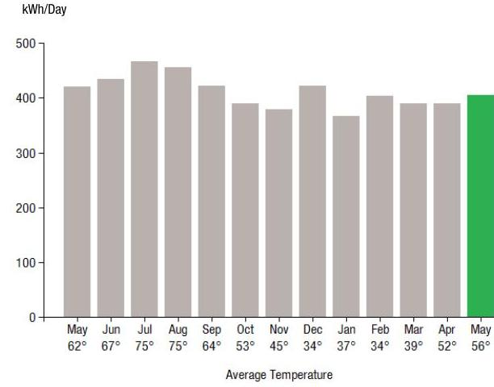
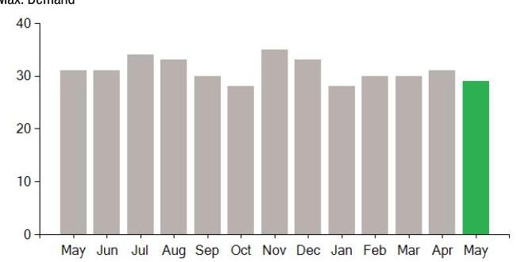

## EVERSEURCE

Account Number: 51436187058
Statement Date: 05/25/23
Service Provided To:
A.M. DONUTS, INC.

## Electric Usage History - Kilowash House (kWh)

The image is a bar chart.

- **Chart Type**: Bar chart
- **Y-Axis Title**: kWh/Day
- **X-Axis Title**: Average Temperature
- **Data Points**:
  - May (62°): ~400 kWh
  - Jun (67°): ~420 kWh
  - Jul (75°): ~440 kWh
  - Aug (75°): ~440 kWh
  - Sep (64°): ~400 kWh
  - Oct (53°): ~360 kWh
  - Nov (45°): ~340 kWh
  - Dec (34°): ~320 kWh
  - Jan (37°): ~340 kWh
  - Feb (34°): ~320 kWh
  - Mar (39°): ~340 kWh
  - Apr (52°): ~360 kWh
  - May (56°): ~400 kWh (highlighted in green)
- **Notable Styling**: The bar for May (56°) is highlighted in green, indicating the current month. The rest of the bars are in gray.

## Electric Usage Summary

| This month your   average daily   electric use was   404.0 kWh | This month you used   $3.8 \%$ less   than at the   same time last year | 3.8 |

## News For You

As we head into the cooling season, you can take steps to reduce your energy use and bill. Take advantage of energy-saving improvements to help you stay comfortable efficiently with Home Energy Solutions. You'll receive on-the-spot services plus recommendations and rebates for additional ways to save. For help with your energy bill and ways to lower your energy use visit Eversource.com/price.

Remit Payment To: Eversource, PO Box 56002, Boston, MA 02205-6002

## EVERSEURCE

Account Number: 51436187058
Non-residential and residential non-hardship customers may be subject to a 1.00\% late payment charge if the "Total Amount Due" is not received by 06/22/23.

## Eversource

PO Box 56002
Boston, MA 02205-6002

## EVERSEURCE

Account Number: 51436187058
Customer name key: A.M.
Statement Date: 05/25/23
Service Provided To:
A.M. DONUTS, INC.

| Sce Addr: 1699 HIGH AND AVE   CHESHINE CT 08410 |  |  |  |  |  |
| :--: | :--: | :--: | :--: | :--: | :--: |
| Sery Ref: 978973003 |  |  | Bill Cycle: 19 |  |  |
| Service from 04/27/23 - 05/25/23 |  |  | 28 Days |  |  |
| Next read date on or about: Jun 27, 2023 |  |  |  |  |  |
| Meter   Number | Current   Read | Previous   Read | Current   Usage | Reading   Type |  |
| 895127202 | 14265 | 2941 | 11324 | Actual |  |
| Total Demand Use $=29.00 \mathrm{kW}$ |  |  |  |  |  |
| Monthly kWh Use |  |  |  |  |  |
| May | Jun | Jul | Aug | Sep | Oct | Nov |
| 12172 | 13875 | 13996 | 14601 | 12667 | 11281 | 12503 |
| Dec | Jan | Feb | Mar | Apr | May |  |
| 12645 | 10630 | 12487 | 10929 | 12087 | 11324 |  |

## Contact Information

Emergency: 800-286-2000
www.eversource.com
Pay by Phone: 888-783-6618
Customer Service: 888-783-6617

## Payment will be sent to bank for processing on 05/26/23

## Electric Account Summary

Amount Due On 05/25/23
Last Payment Received On 04/28/23
Balance Forward
Current Charges/Credits
Electric Supply Services
Delivery Services
Other Charges or Credits
Total Current Charges
Total Amount Due

Total Charges for Electricity

## Delivery

(DISTRIBUTION RATE: 030)
Service Reference: 978973003
Transmission Dmd Chrg
Distr Cust Srvc Chrg
Distribution Dmd Chrg
Electric Sys Improvements***
Revenue Adj Mechanism
CTA Demand Chrg
FMCC Delivery Chrg
Comb Public Benefit Chrg*
Subtotal Delivery Services
Total Cost of Electricity

## Other Charges or Credits

6.35\% CT Sales Tax after Exemption of $\$ 150.00$

CT Sales Tax Delivery \$32.71
Subtotal Other Charges or Credits \$32.71

Total Current Charges
\$697.77

# 8597.77 

\$252.72

## $+27.00KW X \$ 14.22000$

27.00KW X \$1.86000
11324.00kWh X \$0.00192
27.00KW X \$-0.11000
11324.00kWh X \$-0.01500
11324.00kWh X \$0.00753
Total Cust of Electricity
$\$ 665.06$
\$665.06

## Other Charges or Credits

6.35\% CT Sales Tax after Exemption of $\$ 150.00$

| CT Sales Tax Delivery | $\$ 32.71$ |
| :-- | --: |
| Subtotal Other Charges or Credits | $\$ 32.71$ |

Total Current Charges
$\$ 697.77$

# EVERSEURCE 

Account Number: 51436187058
Customer name key: A.M.
Statement Date: 05/25/23
Service Provided To:
A.M. DONUTS, INC.

Continued from previous page...

## Demand Profile

Max. Demand

The image is a bar chart.

- **Chart Type**: Bar chart
- **X-Axis**: Months (May, Jun, Jul, Aug, Sep, Oct, Nov, Dec, Jan, Feb, Mar, Apr, May)
- **Y-Axis**: No title visible, but the scale ranges from 0 to 40.
- **Legend/Color**: The bars from May to April are gray, and the bar for May is green.
- **Data Points**: Each month has a bar representing a value slightly above 30, with the May bar also around this value.
- **Notable Styling**: The May bar is highlighted in green, indicating a possible emphasis or change compared to other months.

This represents a **yearly usage breakdown (monthly-based)** for maximum demand.

Important Messages About Your Account
Please note: Payment processes differ for each bank. Therefore, it may take longer than the date that appears on your bill for the funds to be deducted from your bank account.

## $6697.77$

