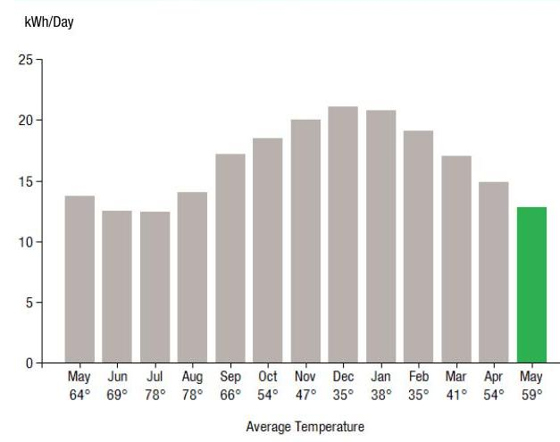
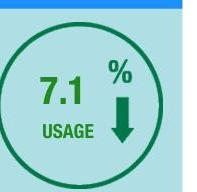
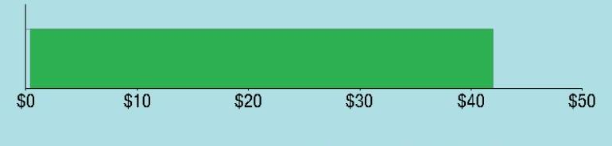
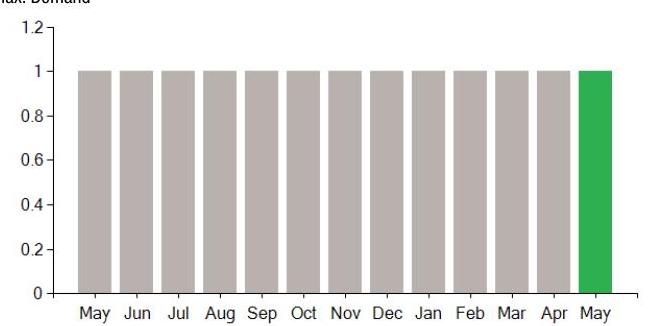

## EVERSEURCE

Account Number: $\quad 51067044008$
Statement Date: 05/25/23
Service Provided To:
MATTABESSET REALTY, LLC

## Electric Usage History - Kilowash House (KWh)

The image is a bar chart showing the electric usage history in kilowatt-hours per day (kWh/Day) over a year, with the x-axis labeled "Average Temperature" and the y-axis labeled "kWh/Day." 

- The months from May to May are listed along the x-axis, each with an associated average temperature:
  - May 64°
  - Jun 69°
  - Jul 78°
  - Aug 78°
  - Sep 66°
  - Oct 54°
  - Nov 47°
  - Dec 35°
  - Jan 35°
  - Feb 38°
  - Mar 41°
  - Apr 54°
  - May 59°

- The bars represent the daily average electric usage for each month, with the highest usage in December and January, peaking around 22 kWh/day. The lowest usage is in May (the second instance), with about 13 kWh/day, highlighted in green.

This chart provides a **yearly usage breakdown (monthly-based)**, showing how electric usage correlates with average temperatures throughout the year.

## Electric Usage Summary

| This month your   average daily   electric use was   13.0 kWh | This month you used   $7.1 \%$ less   than at the   same time last year | 

The image is a graphic illustration showing a circular design with a green border. Inside the circle, there is a percentage value and text:

- "7.1 %"
- "USAGE"
- A downward arrow indicating a decrease.

The design suggests a reduction in usage by 7.1%. |
| :--: | :--: | :--: |

| Payment will be sent to bank   for processing on 05/26/23 | $\$ 42.00$ |
| :-- | --: |
| Amount Due On 05/25/23 | $\$ 41.44$ |
| Last Payment Received On 04/28/23 | $-\$ 41.44$ |
| Balance Forward | $\$ 0.00$ |
| Total Current Charges | $\$ 42.00$ |

Current Charges for Electricity

| Supply | Delivery |
| :--: | :--: |
| \$0.00 | \$42.00 |
| Your supplier will bill you directly   for this charge. | Cost to deliver electricity   from Eversource |

The image is a bar chart.

- The chart features a single horizontal green bar.
- The x-axis is labeled with dollar amounts: $0, $10, $20, $30, $40, $50.
- The green bar extends to slightly above the $40 mark, indicating a value of approximately $42.
- The background is light blue.

Your electric supplier is
DIRECT ENERGY BUSINESS, LLC
1001 LIBERTY AVE
PITTSBURGH PA 15222-3714
888-925-9115

## News For You

As we head into the cooling season, you can take steps to reduce your energy use and bill. Take advantage of energy-saving improvements to help you stay comfortable efficiently with Home Energy Solutions. You'll receive on-the-spot services plus recommendations and rebates for additional ways to save. For help with your energy bill and ways to lower your energy use visit Eversource.com/price.

Remit Payment To: Eversource, PO Box 56002, Boston, MA 02205-6002
CE. 230529 PROD.TXT

## EVERSEURCE

Account Number: $\quad 51067044008$
Non-residential and residential non-hardship customers may be subject to a $1.00 \%$ late payment charge if the "Total Amount Due" is not received by 06/22/23.

Please make your check payable to Eversource and consider adding $\$ 1$ for Operation Fuel.
To add more or make a payment today, visit Eversource.com. If mailing, please allow up to 5 business days to post.

## Payment will be sent to bank

for processing on 05/26/23
$\$ 42.00$

## Amount Enclosed

MATTABESSET REALTY, LLC
57 S BROAD ST
MERIDEN CT 06450-6544

Eversource
PO Box 56002
Boston, MA 02205-6002

# EVERSEURCE 

Account Number: 51067044008
Customer name key: MATT
Statement Date: 05/25/23
Service Provided To:
MATTABESSET REALTY, LLC

| Svc Addr: 613 WASHINGTON ST |  |  |  |  |  |
| :--: | :--: | :--: | :--: | :--: | :--: |
| MINDLETOWN CT 05457 |  |  |  |  |  |
| Serv Ref: 436192009 |  |  | Bill Cycle: 19 |  |  |
| Service from 04/27/23 - 05/25/23 |  |  | 28 Days |  |  |
| Next read date on or about: Jun 27, 2023 |  |  |  |  |  |
| Meter   Number | Current   Read | Previous   Read | Current   Usage | Reading   Type |  |
| 891501452 | 24124 | 23765 | 359 | Actual |  |
| Total Demand Use $=1.70 \mathrm{~kW}$ |  |  |  |  |  |
| Monthly kWh Use |  |  |  |  |  |
| May | Jun | Jul | Aug | Sep | Oct | Nov |
| 398 | 400 | 373 | 449 | 516 | 536 | 661 |
| Dec | Jan | Feb | Mar | Apr | May |  |
| 632 | 603 | 593 | 476 | 461 | 359 |  |

## Contact Information

Emergency: 800-286-2000
www.eversource.com
Pay by Phone: 888-783-6618
Customer Service: 888-783-6617

## Payment will be sent to bank for processing on 05/26/23

## Electric Account Summary

Amount Due On 05/25/23
Last Payment Received On 04/28/23
$842.00$

Balance Forward
Current Charges/Credits
Electric Supply Services
Delivery Services
Total Current Charges
Total Amount Due

## Total Charges for Electricity

## Delivery

(DISTRIBUTION RATE: 030)
Service Reference: 436192009
Distr Cust Srvc Chrg
Revenue Adj Mechanism
FMCC Delivery Chrg
Comb Public Benefit Chrg*
Subtotal Delivery Services
Total Cost of Electricity

Total Current Charges
$44.00$
$359.00 \mathrm{kWh} \times \$ 0.00192$
$359.00 \mathrm{kWh} \mathrm{X} \$-0.01500$
$359.00 \mathrm{kWh} \mathrm{X} \$ 0.00753$
$359.00 \mathrm{kWh} \mathrm{X} \$ 0.00753$
Total Cost of Electricity
Total Current Charges
$42.00

## $42.00$

# EVERSEURCE 

Account Number: 51067044008
Customer name key: MATT
Statement Date: 05/25/23
Service Provided To:
MATTABESSET REALTY, LLC

Continued from previous page...

## Demand Profile

Max. Demand

The image is a bar chart.

- **Chart Type**: Bar chart
- **X-Axis**: Months (May, Jun, Jul, Aug, Sep, Oct, Nov, Dec, Jan, Feb, Mar, Apr, May)
- **Y-Axis**: No title visible, but the scale ranges from 0 to 1.2
- **Legend/Labels**: None visible
- **Data Points**: Each month from May to May has a bar reaching approximately 1.0
- **Styling**: All bars are gray except for the last bar (May), which is green.
- **Description**: This chart represents a **yearly usage breakdown (monthly-based)**, showing consistent demand across all months with a slight emphasis on the last month by using a green bar.

Important Messages About Your Account
Please note: Payment processes differ for each bank. Therefore, it may take longer than the date that appears on your bill for the funds to be deducted from your bank account.

Payment will be sent to bank for processing on 05/26/23

