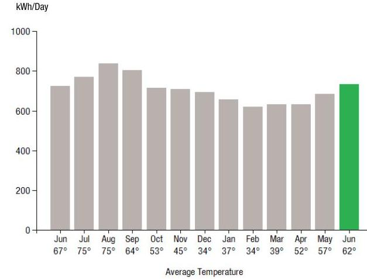
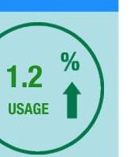
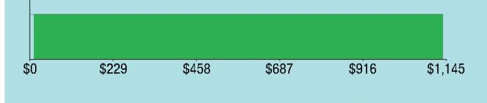
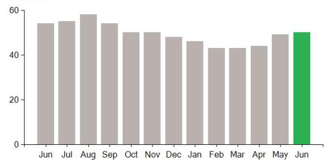

## EVERSEURCE

Account Number: $\quad 51222935082$
Statement Date: 06/13/23
Service Provided To:
NEW MERIDEN DONUTS, INC

Electric Usage History - Microsoft House (kWh)

The image is a bar chart showing a **yearly usage breakdown (monthly-based)** of electric usage in kWh per day, along with average temperatures for each month.

- **Y-axis:** kWh/Day (ranging from 0 to 1000)
- **X-axis:** Average Temperature
  - June 67°
  - July 75°
  - August 75°
  - September 64°
  - October 53°
  - November 45°
  - December 34°
  - January 37°
  - February 34°
  - March 39°
  - April 52°
  - May 57°
  - June 62°

- **Data Points:**
  - June: ~700 kWh
  - July: ~850 kWh
  - August: ~850 kWh
  - September: ~800 kWh
  - October: ~700 kWh
  - November: ~700 kWh
  - December: ~600 kWh
  - January: ~600 kWh
  - February: ~600 kWh
  - March: ~600 kWh
  - April: ~700 kWh
  - May: ~700 kWh
  - June: ~750 kWh (highlighted in green)

- **Styling:** The bar for the current June is highlighted in green, while the others are in gray.

## Electric Usage Summary

| This month your   average daily   electric use was   733.0 kWh | This month you used   $1.2 \%$ more   than at the   same time last year | 

The image is a graphic illustration.

- It features a circular design with a green border.
- Inside the circle, there is a green upward arrow.
- The text inside the circle reads:
  - "1.2"
  - "%"
  - "USAGE" |
| :--: | :--: | :--: |

## News For You

Hot weather drives energy use and bills higher as we run fans and air conditioners to keep cool. We offer programs to help you manage your energy bills. If you or someone you know is struggling to keep up with energy bills, even if you never have before, connect with us to get assistance. There is a plan for everyone. Visit Eversource.com/billhelp.

Remit Payment To: Eversource, PO Box 56002, Boston, MA 02205-6002

## EVERSEURCE

Account Number: $\quad 51222935082$
Non-residential and residential non-hardship customers may be subject to a 1.00\% late payment charge if the "Total Amount Due" is not received by $07 / 11 / 23$.

## $($ 1,198.40

Amount Due On 06/09/23
$1,207.88$
Last Payment Received On 05/15/23
$-\$ 1,207.88$
Balance Forward
Total Current Charges
$1,198.40$

Current Charges for Electricity

| Supply | Delivery |
| :--: | :--: |
| \$0.00 | \$1,135.80 |
| Your supplier will bill you directly for this charge. | Cost to deliver electricity from Eversource |

The image is a bar chart.

- **Chart Type:** Horizontal bar chart
- **X-axis Labels:** 
  - $0
  - $229
  - $458
  - $687
  - $916
  - $1,145
- **Bar Styling:** The bar is filled with a solid green color.
- **Data Representation:** The bar extends from $0 to approximately $1,145.

Your electric supplier is
DIRECT ENERGY BUSINESS, LLC 1001 LIBERTY AVE
PITTSBURGH PA 15222-3714 888-925-9115

# EVERSEURCE 

TEAMS@U
To add more or make a payment today, visit Eversource.com. If mailing, please allow up to 5 business days to post.

## Payment will be sent to bank for processing on 06/14/23

## Amount Enclosed

Eversource
PO Box 56002
Boston, MA 02205-6002

## EVERSEURCE

Account Number: 51222935082
Customer name key: NEW
Statement Date: 06/13/23
Service Provided To:
NEW MERIDEN DONUTS, INC

| Svc Adir: 075 EMAIN ST   UNIT A   MERIDEN CT 06450 |  |  |  |  |  |
| :--: | :--: | :--: | :--: | :--: | :--: |
| Serv Ref: 923013009   Service from 05/11/23 - 06/13/23 |  |  | Bill Cycle: 09   33 Days |  |  |
| Next read date on or about: Jul 13, 2023 |  |  |  |  |  |
| Meter   Number | Current   Read | Previous   Read | Current   Usage | Reading   Type |  |
| 091496072 | 61032 | 36859 | 24173 | Actual |  |
| Total Demand Use $=50.40 \mathrm{~kW}$ |  |  |  |  |  |
| Monthly kWh Use |  |  |  |  |  |
| Jun | Jul | Aug | Sep | Oct | Nov | Dec |
| 23170 | 23150 | 26814 | 24130 | 20776 | 19852 | 22852 |
| Jan | Feb | Mar | Apr | May | Jun |  |
| 20362 | 17382 | 19644 | 18963 | 19831 | 24173 |  |

## Contact Information

Emergency: 800-286-2000
www.eversource.com
Pay by Phone: 888-783-6616
Customer Service: 888-783-6617

## Payment will be sent to bank for processing on 06/14/23

## Electric Account Summary

Amount Due On 06/09/23
Last Payment Received On 05/15/23
Balance Forward
Current Charges/Credits
Electric Supply Services
Delivery Services
Other Charges or Credits
Total Current Charges
Total Amount Due

## Total Charges for Electricity

## Delivery

(DISTRIBUTION RATE: 030)
Service Reference: 923013009
Transmission Dmd Chrg
Distr Cust Srvc Chrg
Distribution Dmd Chrg
Electric Sys Improvements***
Revenue Adj Mechanism
CTA Demand Chrg
FMCC Delivery Chrg
Comb Public Benefit Chrg*
Subtotal Delivery Services
Total Cost of Electricity

## Other Charges or Credits

$6.35 \%$ CT Sales Tax after Exemption of $\$ 150.00$
CT Sales Tax Delivery \$62.60
\$62.60

Total Current Charges
Total Current Charges
\$1,198.40

*The Combined Public Benefits Charge represents a combination of three charges formerly known as: Conservation and Load Mgmt Charge, Renewable Energy Investment Charge, and Systems Benefits Charge. This charge also includes the Conservation Adjustment Mechanism approved by the Public Utilities Regulatory Authority in Docket No. 13-11-14.
**Effective January 1, 2007, the Generation Services Charge (GSC) and the Bypassable Federally Mandated Congestion Charge (BFMCC) have been combined into the "GSC Charge" listed in the Supplier Services section of your bill. The GSC reflects all of the cost of procuring energy from Eversource wholesale suppliers. The BFMCC portion of this line item is - $\$ 0.0015 / \mathrm{kWh}$. If you multiply this BFMCC rate by the number of kWhs on your bill, you can calculate the dollar amount associated with the BFMCC.
***Electric System Improvements: Recovers company investments that protect, strengthen or modernize the electric grid.

# EVERSEURCE 

Account Number: 51222935082
Customer name key: NEW
Statement Date: 06/13/23
Service Provided To:
NEW MERIDEN DONUTS, INC

Continued from previous page...

## Demand Profile

Max. Demand

The image is a bar chart.

- **Chart Type**: Bar chart
- **X-Axis**: Labeled with months from June to June (Jun, Jul, Aug, Sep, Oct, Nov, Dec, Jan, Feb, Mar, Apr, May, Jun).
- **Y-Axis**: Ranges from 0 to 60.
- **Data Points**: Each month has a corresponding bar representing a value between 40 and 60.
- **Styling**: The bars from June to May are gray, and the bar for June is green.
- **Description**: This chart provides a yearly usage breakdown (monthly-based), showing demand levels for each month, with the highest demand in August and the lowest in February. The green bar for June indicates a notable emphasis or change.

Important Messages About Your Account
Please note: Payment processes differ for each bank. Therefore, it may take longer than the date that appears on your bill for the funds to be deducted from your bank account.

Payment will be sent to bank for processing on 06/14/23
\$1,198.40

