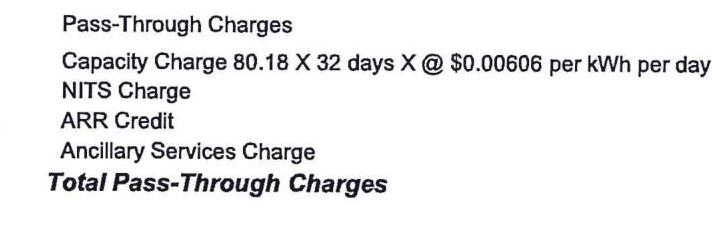
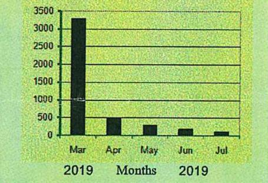
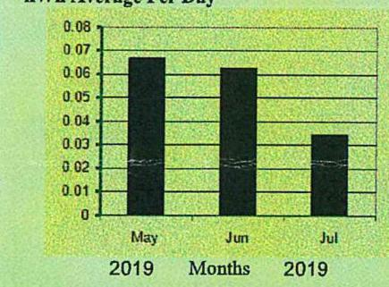
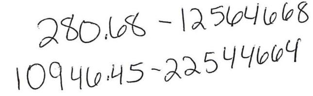

| Year | 1990 | 1991 | 1992 | 1993 | 1994 | 1995 |
|------|--------|--------|--------|--------|--------|--------|--------|
| 1990 | 1260 | 1000 | 1000 | 1000 | 1000 | 1000 |
| 1991 | 1000 | 800 | 800 | 800 | 800 | 800 |
| 1992 | 900 | 600 | 600 | 600 | 600 | 600 |
| 1993 | 800 | 500 | 500 | 500 | 500 | 500 |
| 1994 | 700 | 400 | 400 | 400 | 400 | 400 |
| 1995 | 600 | 300 | 300 | 300 | 300 | 300 |
| 1996 | 500 | 250 | 250 | 250 | 250 | 250 |
| 1997 | 400 | 200 | 200 | 200 | 200 | 200 |
| 1998 | 300 | 150 | 150 | 150 | 150 | 150 |
| 1999 | 250 | 100 | 100 | 100 | 100 | 100 |
| 2000 | 150 | 800 | 800 | 800 | 800 | 800 |
| 2001 | 100 | 500 | 500 | 500 | 500 | 500 |
| 2002 | 800 | 400 | 400 | 400 | 400 | 400 |
| 2003 | 600 | 300 | 300 | 300 | 300 | 300 |
| 2004 | 500 | 250 | 250 | 250 | 250 | 250 |
| 2005 | 400 | 200 | 200 | 200 | 200 | 200 |
| 2006 | 300 | 150 | 150 | 150 | 150 | 150 |
| 2007 | 250 | 100 | 100 | 100 | 100 | 100 |
| 2008 | 150 | 800 | 800 | 800 | 800 | 800 |
| 2009 | 100 | 500 | 500 | 500 | 500 | 500 |
| 2010 | 100 | 500 | 500 | 500 | 500 | 500 |
| 2011 | 100 | 500 | 500 | 500 | 500 | 500 |
| 2012 | 100 | 500 | 500 | 500 | 500 | 500 |
| 2013 | 100 | 500 | 500 | 500 | 500 | 500 |
| 2014 | 100 | 500 | 500 | 500 | 500 | 500 |
| 2015 | 100 | 500 | 500 | 500 | 500 | 500 |
| 2016 | 100 | 500 | 500 | 500 | 500 | 500 |
| 2017 | 100 | 500 | 500 | 500 | 500 | 500 |
| 2018 | Months | 2019 | 2019 | 2019 | 2019 | 2019 |
| 2019 |  |  |  |  |  |  |
| 2020 |  |  |  |  |  |  |

## SERVICE ADDRESS

Sparta Community Unit School District \#140 SPARTA CUSO 140 701 OAK ST EVANSVILLE, IL 62242
kWh Averag Per Day

The image is a photo or illustration containing text related to charges. The text reads:

"Pass-Through Charges
Capacity Charge 80.18 X 32 days X @ $0.00606 per kWh per day
NITS Charge
ARR Credit
Ancillary Services Charge
Total Pass-Through Charges"

| 2018 | Months | 2019 |
| :-- | :-- | :-- |

Types of Meter Readings

| Average - Jul | 2018 | 2019 |
| :-- | :-- | :-- |
| kWh Per Day | 1113 | N/A |
| Yearly Use: | Total | Average |
| Jul 2018 To Jun | 408398 | Monthly |
| 2019 |  | 34033 |

Number of Days -32
For power outages and other electrical emergencies, call your electric distribution company:

## Ameren Illinois

1-800-755-5000
Utility Account Number
6814625771

## Lhith Per Day

| Yearly Use: | Total | Average |
| :-- | :-- | :-- |
| Jul 2018 To Jun | 408398 | Monthly |
| 2019 |  | 34033 |

## Lhith Per

| Yearly Use: | Total | Average |
| :-- | :-- | :-- |
| 2018 | 408398 | Monthly |
| 2019 |  | 34033 |

## Lhith Per

| Yearly Use: | Total | Average |
| :-- | :-- | :-- |
| 2018 | Monthly |  |
| 2019 | 408398 | 34033 |

## Lhith Per

| Yearly Use: | Total | Average |
| :-- | :-- | :-- |
| 2018 | Monthly |  |
| 2019 | 408398 | 34033 |

## Lhith Per

| Yearly Use: | Total | Average |
| :-- | :-- | :-- |
| 2018 | Monthly |  |
| 2019 | 408398 | 34033 |

## Lhith Per

| Yearly Use: | Total | Average |
| :-- | :-- | :-- |
| 2018 | 408398 | 34033 |

## Lhith Per

| Yearly Use: | Total | Average |
| :-- | :-- | :-- |
| 2018 | 408398 | 34033 |

## Lhith Per

| Yearly Use: | Total | Average |
| :-- | :-- | :-- |
| 2018 | 408398 | 34033 |

## Lhith Per

| Yearly Use: | Total | Average |
| :-- | :-- | :-- |
| 2018 | 408398 | 34033 |

## Lhith Per

| Yearly Use: | Total | Average |
| :-- | :-- | :-- |
| 2018 | 408398 | 34033 |

## Lhith Per

| Yearly Use: | Total | Average |
| :-- | :-- | :-- |
| 2018 | 408398 | 34033 |

## Lhith Per

| Yearly Use: | Total | Average |
| :-- | :-- | :-- |
| 2018 | 408398 | 34033 |

## Lhith Per

| Yearly Use: | Total | Average |
| :-- | :-- | :-- |
| 2018 | 408398 | 34033 |

## Lhith Per

| Yearly Use: | Total | Average |
| :-- | :-- | :-- |
| 2018 | 408398 | 34033 |

## Lhith Per

| Yearly Use: | Total | Average |
| :-- | :-- | :-- |
| 2018 | 408398 | 34033 |

## Lhith Per

| Yearly Use: | Total | Average |
| :-- | :-- | :-- |
| 2018 | 408398 | 34033 |

## Lhith Per

| Yearly Use: | Total | Average |
| :-- | :-- | :-- |
| 2018 | 408398 | 34033 |

## Lhith Per

| Yearly Use: | Total | Average |
| :-- | :-- | :-- |
| 2018 | 408398 | 34033 |

## Lhith Per

| Yearly Use: | Total | Average |
| :-- | :-- | :-- |
| 2018 | 408398 | 34033 |

## Lhith Per

| Yearly Use: | Total | Average |
| :-- | :-- | :-- |
| 2018 | 408398 | 34033 |

## Lhith Per

| Yearly Use: | Total | Average |
| :-- | :-- | :-- |
| 2018 | 408398 | 34033 |

## Lhith Per

| Yearly Use: | Total | Average |
| :-- | :-- | :-- |
| 2018 | 408398 | 34033 |

## Lhith Per

| Yearly Use: | Total | Average |
| :-- | :-- | :-- |
| 2018 | 408398 | 34033 |

## Lhith Per

| Yearly Use: | Total | Average |
| :-- | :-- | :-- |
| 2018 | 408398 | 34033 |

## Lhith Per

| Yearly Use: | Total | Average |
| :-- | :-- | :-- |
| 2018 | 408398 | 34033 |

## Lhith Per

| Yearly Use: | Total | Average |
| :-- | :-- | :-- |
| 2018 | 408398 | 34033 |

## Lhith Per

| Yearly Use: | Total | Average |
| :-- | :-- | :-- |
| 2018 | 408398 | 34033 |

## Lhith Per

| Yearly Use: | Total | Average |
| :-- | :-- | :-- |
| 2018 | 408398 | 34033 |

## Lhith Per

| Yearly Use: | Total | Average |
| :-- | :-- | :-- |
| 2018 | 408398 | 34033 |

## Lhith Per

| Yearly Use: | Total | Average |
| :-- | :-- | :-- |
| 2018 | 408398 | 34033 |

## Lhith Per

| Yearly Use: | Total | Average |
| :-- | :-- | :-- |
| 2018 | 408398 | 34033 |

## Lhith Per

| Yearly Use: | Total | Average |

The image is a bar chart.

- **Chart Type**: Bar chart
- **X-Axis**: Months (Mar, Apr, May, Jun, Jul)
- **Y-Axis**: No title, but the scale ranges from 0 to 3500
- **Data Points**:
  - Mar 2019: Approximately 3200
  - Apr 2019: Approximately 600
  - May 2019: Approximately 400
  - Jun 2019: Approximately 200
  - Jul 2019: Approximately 200
- **Yearly usage breakdown (monthly-based)**: The chart shows a significant decrease in usage from March to July 2019.
- **Styling**: The bars are black on a green background.

BILLING ACCOUNT NUMBER 8100052600

## INVOICE NUMBER

382763558258

## UTILITY ACCOUNT NUMBER

3175137619

Charges for Billing Period May 31, 2019 - Jun 29, 2019

## SERVICE ADDRESS

Sparta Community Unit School District \#140 SPARTA CUSO 140 205 W HOOD SPARTA, IL 62286
kWh Average Per Day

The image is a bar chart.

- **Chart Type**: Bar chart
- **X-Axis**: Months (Mar, Apr, May, Jun, Jul)
- **Y-Axis**: No title, but the scale ranges from 0 to 3500
- **Data Points**:
  - Mar 2019: Approximately 3200
  - Apr 2019: Approximately 600
  - May 2019: Approximately 400
  - Jun 2019: Approximately 200
  - Jul 2019: Approximately 200
- **Yearly usage breakdown (monthly-based)**: The chart shows a significant decrease in usage from March to July 2019.
- **Styling**: The bars are black on a green background.

Types of Meter Readings

| Average - Mar | 2018 | 2019 |
| :--: | :--: | :--: |
| kWh Per Day | 2326 | N/A |
| Yearly Use: | Total | Average |
|  | Use | Monthly |
| Mar 2019 To Jul 2019 | 836916 | 69743 |

Number of Days -29
For power outages and other electrical emergencies, call your electric distribution company:

## Ameren Illinois

1-800-755-5000
Utility Account Number
3175137619

Supplier Charges
Fixed Price Total 47,683.48 @ $\$ 0.03401$ per kWh
Index Charge 47,683.48 @ $\$ 0.02526$ per kWh
Retail Adder 95,366.96 @ $\$ 0.00221$ per kWh
Total Supplier Charges
$\$ 3,037.10$

Pass-Through Charges
NITS Charge
Ancillary Services Charge
ARR Credit
Capacity Charge 291.81 X 29 days $X$ @ $\$ 0.00299$ per kWh per day
Total Pass-Through Charges
$\$ 964.51$

Delivery Service Charges
Clean Energy Assistance Charge 89,303.00 @ \$0.00186 per kWh
Customer Charge
Distribution Delivery Charge Summer 3,280.00 @ \$0.04516 per kWh
Distribution Delivery kW Charge 332.60 @ \$6.95500 per kWh
Electric Environmental Adjustment 3,280.00 @ \$0.00157 per kWh
Renewable Energy Adjustment 89,303.00 @ \$0.00181 per kWh
Customer Charge
EDT Cost Recovery
EDT Cost Recovery
Electric Environmental Adjustment 89,303.00 @ \$0.00106 per kWh
Illinois State Electricity Excise Tax
Renewable Energy Adjustment 3,280.00 @ \$0.00181 per kWh
Transformation Charge 415.10 @ \$0.55900 per kWh
Clean Energy Assistance Charge 3,280.00 @ \$0.00186 per kWh
Illinois State Electricity Excise Tax
Single Bill Option Credit
Energy Efficiency Programs Charge 3,280.00 @ \$0.00119 per kWh
Energy Efficiency Programs Charge 89,303.00 @ \$0.00129 per
kWh
Meter Charge
Meter Charge
Total Delivery Service Charges
$\$ 3,754.71$
$\$ 10.20$
\$1.13
\$3.90
\$115.20
\$8.94
\$12.61
Total Charges for this Billing Period
Rentinder: As a member of the IEC you are eligible for an early pay credit if you meet the terms of the incentive program. Please go to http://ilschools.nexteraenergyservices.com for information.
Usage is grossed up to include utility losses. The Energy Supplier Charges reflects your IEC program price, with all other charges being a direct pass through without mark-up.

## SERVICE ADDRESS

Sparta Community Unit School District \#140 SPARTA CUSD 140
119 LEGION DR SPARTA, IL 62286
kWh Average Per Day

The image is a bar chart.

- **Chart Type**: Bar chart
- **X-Axis**: Labeled "Months" with categories "May", "Jun", "Jul"
- **Y-Axis**: Labeled "kWh Average Per Day" with values ranging from 0.01 to 0.07
- **Data Points**:
  - May 2019: Approximately 0.07 kWh
  - Jun 2019: Approximately 0.06 kWh
  - Jul 2019: Approximately 0.03 kWh
- **Yearly usage breakdown (monthly-based)**: The chart shows the average daily kWh usage for May, June, and July of 2019.
- **Styling**: The bars are black against a green background.

Types of Meter Readings

| Average - May | 2018 | 2019 |
| :--: | :--: | :--: |
| kWh Per Day | 2759 | N/A |
| Yearly Use: | Total | Average |
| May 2019 To Jul 2019 | 1003718 | Monthly |
|  |  | 83643 |

Number of Days -29
For power outages and other electrical emergencies, call your electric distribution company:

## Ameren Illinois   1-800-785-5000   Utility Account Number   9926229137

## INVOICE NUMBER

382763558257

## STOICE NUMBER

382763558257

## STOICE NUMBER

382763558257

## Charges for Billing Period May 31, 2019 - Jun 29, 2019

## Supplier Charges

Retail Adder 165,114.81 @ \$0.00221 per kWh
Fixed Price Total 82,557.40 @ \$0.03401 per kWh
Index Charge 82,557.40 @ \$0.02464 per kWh
Total Supplier Charges
Pass-Through Charges
Capacity Charge 410.34 X 29 days $X$ @ \$0.00299 per kWh per day
NITS Charge
Ancillary Services Charge
ARR Credit
Total Pass-Through Charges
$1,105.97

Delivery Service Charges
Electric Environmental Adjustment 159,971.00 @ \$0.00106 per kWh
Energy Efficiency Programs Charge 248.00 @ \$0.00119 per kWh
Energy Efficiency Programs Charge 159,971.00 @ \$0.00129 per kWh
Optional Lighting Charge
Single Bill Option Credit
Clean Energy Assistance Charge 248.00 @ \$0.00186 per kWh
Customer Charge
Illinois State Electricity Excise Tax
Meter Charge
Clean Energy Assistance Charge 159,971.00 @ \$0.00186 per kWh
Customer Charge
Distribution Delivery kW Charge 405.80 @ \$6.95500 per kWh
EDT Cost Recovery
EDT Cost Recovery
Electric Environmental Adjustment 248.00 @ \$0.00308 per kWh
Illinois State Electricity Excise Tax
Renewable Energy Adjustment 248.00 @ \$0.00181 per kWh
Renewable Energy Adjustment 159,971.00 @ \$0.00181 per kWh
Transformation Charge 570.20 @ \$0.55900 per kWh
Distribution Delivery Charge Summer 1.00 @ \$0.04516 per kWh
Meter Charge
Total Delivery Service Charges
Reminder: As a member of the IEC you are eligible for an early pay credit if you meet the terms of the incentive program. Please go to http://ilschools.nexteraenergyservices.com for information.
Usage is grossed up to include utility losses. The Energy Supplier Charges reflects your IEC program price, with all other charges being a direct pass through without mark-up.

The image is a photo or illustration showing handwritten text. 

The text reads:
- "280.68 - 125646668"
- "10946.45 - 225446604"

