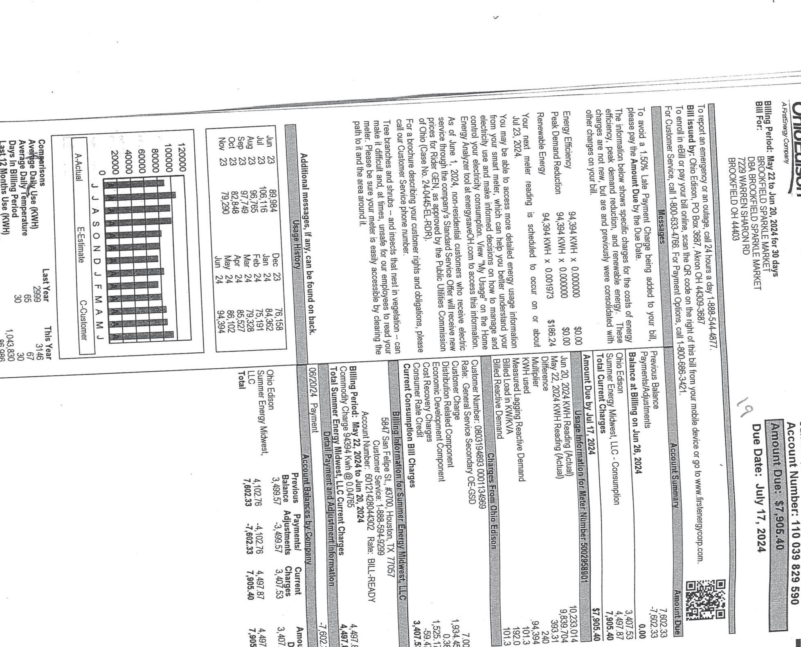

The image is a photo of a utility bill. It includes a bar chart and various sections with text and tables.

1. **Chart Type**: Bar chart
   - **Yearly usage breakdown (monthly-based)**
   - **X-axis**: Months (J, A, S, O, N, D, J, F, M, A, M, J)
   - **Y-axis**: Usage (kWh)
   - **Legend**: 
     - A = Actual
     - E = Estimate
     - C = Customer
   - **Data Points**: 
     - Bars for each month with values approximately ranging from 600 to 1200 kWh.

2. **Embedded Text**:
   - "Comparisons"
   - "Average Daily Use (kWh)"
   - "Average Daily Temperature (F)"
   - "Days in Billing Period"
   - "Last 12 Months"
   - "This Month"
   - "Last Year"
   - "Electric Usage (kWh)"
   - "Meter Reading"
   - "Previous"
   - "Current"
   - "Total"
   - "Billing period: Jun 21, 2024 to Jul 21, 2024"
   - "Account Number: 110 039 826 590"
   - "Due Date: July 17, 2024"
   - "Ohio Edison"
   - "Sum of Energy Market"
   - "Billing price: $0.1234 per kWh"
   - "Rate: BULK-READY"
   - "Energy Efficiency"
   - "Responsible for reading"
   - "94-1381-KYH"
   - "0000000"
   - "500"
   - "500"
   - "500"
   - "500"
   - "500"
   - "500"
   - "500"
   - "500"
   - "500"
   - "500"
   - "500"
   - "500"
   - "500"
   - "500"
   - "500"
   - "500"
   - "500"
   - "500"
   - "500"
   - "500"
   - "500"
   - "500"
   - "500"
   - "500"
   - "500"
   - "500"
   - "500"
   - "500"
   - "500"
   - "500"
   - "500"
   - "500"
   - "500"
   - "500"
   - "500"
   - "500"
   - "500"
   - "500"
   - "500"
   - "500"
   - "500"
   - "500"
   - "500"
   - "500"
   - "500"
   - "500"
   - "500"
   - "500"
   - "500"
   - "500"
   - "500"
   - "500"
   - "500"
   - "500"
   - "500"
   - "500"
   - "500"
   - "500"
   - "500"
   - "500"
   - "500"
   - "500"
   - "500"
   - "500"
   - "500"
   - "500"
   - "500"
   - "500"
   - "500"
   - "500"
   - "500"
   - "500"
   - "500"
   - "500"
   - "500"
   - "500"
   - "500"
   - "500"
   - "500"
   - "500"
   - "500"
   - "500"
   - "500"
   - "500"
   - "500"
   - "500"
   - "500"
   - "500"
   - "500"
   - "500"
   - "500"
   - "500"
   - "500"
   - "500"
   - "500"
   - "500"
   - "500"
   - "500"
   - "500"
   - "500"
   - "500"
   - "500"
   - "500"
   - "500"
   - "500"
   - "500"
   - "500"
   - "500"
   - "500"
   - "500"
   - "500"
   - "500"
   - "500"
   - "500"
   - "500"
   - "500"
   - "500"
   - "500"
   - "500"
   - "500"
   - "500"
   - "500"
   - "500"
   - "500"
   - "500"
   - "500"
   - "500"
   - "500"
   - "500"
   - "500"
   - "500"
   - "500"
   - "500"
   - "500"
   - "500"
   - "500"
   - "500"
   - "500"
   - "500"
   - "500"
   - "500"
   - "500"
   - "500"
   - "500"
   - "500"
   - "500"
   - "500"
   - "500"
   - "500"
   - "500"
   - "500"
   - "500"
   - "500"
   - "500"
   - "500"
   - "500"
   - "500"
   - "500"
   - "500"
   - "500"
   - "500"
   - "500"
   - "500"
   - "500"
   - "500"
   - "500"
   - "500"
   - "500"
   - "500"
   - "500"
   - "500"
   - "500"
   - "500"
   - "500"
   - "500"
   - "500"
   - "500"
   - "500"
   - "500"
   - "500"
   - "500"
   - "500"
   - "500"
   - "500"
   - "500"
   - "500"
   - "500"
   - "500"
   - "500"
   - "500"
   - "500"
   - "500"
   - "500"
   - "500"
   - "500"
   - "500"
   - "500"
   - "500"
   - "500"
   - "500"
   - "500"
   - "500"
   - "500"
   - "500"
   - "500"
   - "500"
   - "500"
   - "500"
   - "500"
   - "500"
   - "500"
   - "500"
   - "500"
   - "500"
   - "500"
   - "500"
   - "500"
   - "500"
   - "500"
   - "500"
   - "500"
   - "500"
   - "500"
   - "500"
   - "500"
   - "500"
   - "500"
   - "500"
   - "500"
   - "500"
   - "500"
   - "500"
   - "500"
   - "500"
   - "500"
   - "500"
   - "500"
   - "500"
   - "500"
   - "500"
   - "500"
   - "500"
   - "500"
   - "500"
   - "500"
   - "500"
   - "500"
   - "500"
   - "500"
   - "500"
   - "500"
   - "500"
   - "500"
   - "500"
   - "500"
   - "500"
   - "500"
   - "500"
   - "500"
   - "500"
   - "500"
   - "500"
   - "500"
   - "500"
   - "500"
   - "500"
   - "500"
   - "500"
   - "500"
   - "500"
   - "500"
   - "500"
   - "500"
   - "500"
   - "500"
   - "500"
   - "500"
   - "500"
   - "500"
   - "500"
   - "500"
   - "500"
   - "500"
   - "500"
   - "500"
   - "500"
   - "500"
   - "500"
   - "500"
   - "500"
   - "500"
   - "500"
   - "500"
   - "500"
   - "500"
   - "500"
   - "500"
   - "500"
   - "500"
   - "500"
   - "500"
   - "500"
   - "500"
   - "500"
   - "500"
   - "500"
   - "500"
   - "500"
   - "500"
   - "500"
   - "500"
   - "500"
   - "500"
   - "500"
   - "500"
   - "500"
   - "500"
   - "500"
   - "500"
   - "500"
   - "500"
   - "500"
   - "500"
   - "500"
   - "500"
   - "500"
   - "500"
   - "500"
   - "500"
   - "500"
   - "500"
   - "500"
   - "500"
   - "500"
   - "500"
   - "500"
   - "500"
   - "500"
   - "500"
   - "500"
   - "500"
   - "500"
   - "500"
   - "500"
   - "500"
   - "500"
   - "500"
   - "500"
   - "500"
   - "500"
   - "500"
   - "500"
   - "500"
   - "500"
   - "500"
   - "500"
   - "500"
   - "500"
   - "500"
   - "500"
   - "500"
   - "500"
   - "500"
   - "500"
   - "500"
   - "500"
   - "500"
   - "500"
   - "500"
   - "500"
   - "500"
   - "500"
   - "500"
   - "500"
   - "500"
   - "500"
   - "500"
   - "500"
   - "500"
   - "500"
   - "500"
   - "500"
   - "500"
   - "500"
   - "500"
   - "500"
   - "500"
   - "500"
   - "500"
   - "500"
   - "500"
   - "500"
   - "500"
   - "500"
   - "500"
   - "500"
   - "500"
   - "500"
   - "500"
   - "500"
   - "500"
   - "500"
   - "500"
   - "500"
   - "500"
   - "500"
   - "500"
   - "500"
   - "500"
   - "500"
   - "500"
   - "500"
   - "500"
   - "500"
   - "500"
   - "500"
   - "500"
   - "500"
   - "500"
   - "500"
   - "500"
   - "500"
   - "500"
   - "500"
   - "500"
   - "500"
   - "500"
   - "500"
   - "500"
   - "500"
   - "500"
   - "500"
   - "500"
   - "500"
   - "500"
   - "500"
   - "500"
   - "500"
   - "500"
   - "500"
   - "500"
   - "500"
   - "500"
   - "500"
   - "500"
   - "500"
   - "500"
   - "500"
   - "500"
   - "500"
   - "500"
   - "500"
   - "500"
   - "500"
   - "500"
   - "500"
   - "500"
   - "500"
   - "500"
   - "500"
   - "500"
   - "500"
   - "500"
   - "500"
   - "500"
   - "500"
   - "500"
   - "500"
   - "500"
   - "500"
   - "500"
   - "500"
   - "500"
   - "500"
   - "500"
   - "500"
   - "500"
   - "500"
   - "500"
   - "500"
   - "500"
   - "500"
   - "500"
   - "500"
   - "500"
   - "500"
   - "500"
   - "500"
   - "500"
   - "500"
   - "500"
   - "500"
   - "500"
   - "500"
   - "500"
   - "500"
   - "500"
   - "500"
   - "500"
   - "500"
   - "500"
   - "500"
   - "500"
   - "500"
   - "500"
   - "500"
   - "500"
   - "500"
   - "500"
   - "500"
   - "500"
   - "500"
   - "500"
   - "500"
   - "500"
   - "500"
   - "500"
   - "500"
   - "500"
   - "500"
   - "500"
   - "500"
   - "500"
   - "500"
   - "500"
   - "500"
   - "500"
   - "500"
   - "500"
   - "500"
   - "500"
   - "500"
   - "500"
   - "500"
   - "500"
   - "500"
   - "500"
   - "500"
   - "500"
   - "500"
   - "500"
   - "500"
   - "500"
   - "500"
   - "500"
   - "500"
   - "500"
   - "500"
   - "500"
   - "500"
   - "500"
   - "500"
   - "500"
   - "500"
   - "500"
   - "500"
   - "500"
   - "500"
   - "500"
   - "500"
   - "500"
   - "500"
   - "500"
   - "500"
   - "500"
   - "500"
   - "500"
   - "500"
   - "500"
   - "500"
   - "500"
   - "500"
   - "500"
   - "500"
   - "500"
   - "500"
   - "500"
   - "500"
   - "500"
   - "500"
   - "500"
   - "500"
   - "500"
   - "500"
   - "500"
   - "500"
   - "500"
   - "500"
   - "500"
   - "500"
   - "500"
   - "500"
   - "500"
   - "500"
   - "500"
   - "500"
   - "500"
   - "500"
   - "500"
   - "500"
   - "500"
   - "500"
   - "500"
   - "500"
   - "500"
   - "500"
   - "500"
   - "500"
   - "500"
   - "500"
   - "500"
   - "500"
   - "500"
   - "500"
   - "500"
   - "500"
   - "500"
   - "500"
   - "500"
   - "500"
   - "500"
   - "500"
   - "500"
   - "500"
   - "500"
   - "500"
   - "500"
   - "500"
   - "500"
   - "500"
   - "500"
   - "500"
   - "500"
   - "500"
   - "500"
   - "500"
   - "500"
   - "500"
   - "500"
   - "500"
   - "500"
   - "500"
   - "500"
   - "500"
   - "500"
   - "500"
   - "500"
   - "500"
   - "500"
   - "500"
   - "500"
   - "500"
   - "500"
   - "500"
   - "500"
   - "500"
   - "500"
   - "500"
   - "500"
   - "500"
   - "500"
   - "500"
   - "500"
   - "500"
   - "500"
   - "500"
   - "500"
   - "500"
   - "500"
   - "500"
   - "500"
   - "500"
   - "500"
   - "500"
   - "500"
   - "500"
   - "500"
   - "500"
   - "500"
   - "500"
   - "500"
   - "500"
   - "500"
   - "500"
   - "500"
   - "500"
   - "500"
   - "500"
   - "500"
   - "500"
   - "500"
   - "500"
   - "500"
   - "500"
   - "500"
   - "500"
   - "500"
   - "500"
   - "500"
   - "500"
   - "500"
   - "500"
   - "500"
   - "500"
   - "500"
   - "500"
   - "500"
   - "500"
   - "500"
   - "500"
   - "500"
   - "500"
   - "500"
   - "500"
   - "500"
   - "500"
   - "500"
   - "500"
   - "500"
   - "500"
   - "500"
   - "500"
   - "500"
   - "500"
   - "500"
   - "500"
   - "500"
   - "500"
   - "500"
   - "500"
   - "500"
   - "500"
   - "500"
   - "500"
   - "500"
   - "500"
   - "500"
   - "500"
   - "500"
   - "500"
   - "500"
   - "500"
   - "500"
   - "500"
   - "500"
   - "500"
   - "500"
   - "500"
   -

