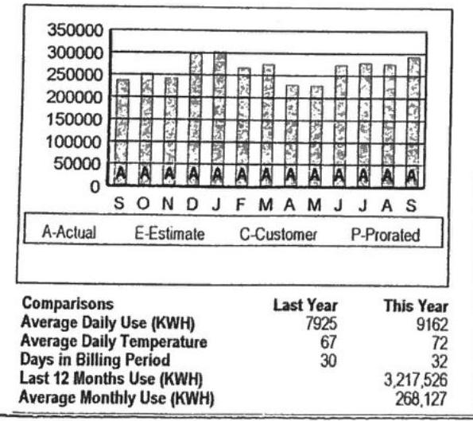

To report an emergency or an outage, call 24 hours a day 1-888-544-4877. For Customer Service, call 1-800-686-0021. For Payment Options, call 1-800-736-3404. Pay your bill online at www.firstenergycop.com.

Bill issued by: West Penn Power, PO Box 3687 Akron OH 44309-3687

| Shopping Information | Account Summary | Amount Due |
| :--: | :--: | :--: |
| Customer Number 0805522857 0007190606 | General Power Service WP-GP300   General Power Service WP-GP300 | 30,175.28 |
| Contact your supplier if you do not know your contract expiration date. | Balance at Billing on Oct 02, 2018 | 0.00 |
| Messages |  |  |
| To avoid a 2.00\% Late Payment Charge being added to your bill, please pay the Amount Due by the Due Date. | West Penn Power - Consumption | $4,452.61$ |
| Your current PRICE TO COMPARE for generation and transmission from West Penn Power is listed below. You may not be lower. | West Penn Power - Most Charges | 106.72 |
| General Power Service - 0007190066 - 4.60 cents per KWH | West Penn Power - Security Deposit lest Plan Amount | 8,526.50 |
| Your next meter reading is scheduled to occur on or about Oct 23, 2018. |  | 18,378.92 |
| Your bill includes $\$ 312.52$ in PA taxes, of which $\$ 47.83$ is PA gross receipts tax. |  | 358.2 |
| Generation prices and charges are set by the elestipc generator supplier you have chosen. The Public Utilities Commission regulates distribution prices and services. The Federal Energy Ambulatory Commission regulates transmission prices and services. |  | 2,071.14 |
| The Distribution System Improvement Charge on October 1, 2018. This charge recovers costs bycured to your improve or replace infrastructure that the Company is to do. |  | 1,777.801 |
|  |  | 253.179 |
|  |  | 1,000 |
|  |  | 293.179 |
|  |  | 579.6 |
|  |  | 460.8 |
|  |  | 417.6 |
|  |  | 358.2 |
| Additional messages, if any, can be found on back. |  | 579.6 |
| Usage History |  |  |
| 350000 | Last Year | This Year |
| Average Daily Use (KWH) | 7925 | 9162 |
| Average Daily Temperature | 67 | 72 |
| Days in Billing Period | 30 | 32 |
| Last 12 Months Use (KWH) |  | 3,217,526 |
| Average Monthly Use (KWH) |  | 268,127 |

Additional messages, if any, can be found on back.

The image is a bar chart showing a **yearly usage breakdown (monthly-based)** for electricity consumption. 

- **Chart Type:** Bar chart
- **X-Axis:** Months (S, O, N, D, J, F, M, A, M, J, J, A, S)
- **Y-Axis:** Usage in KWH (0 to 350,000 in increments of 50,000)
- **Legend:** 
  - A - Actual
  - E - Estimate
  - C - Customer
  - P - Prorated

**Comparisons Table:**
- **Average Daily Use (KWH):** 
  - Last Year: 7925
  - This Year: 9162
- **Average Daily Temperature:** 
  - Last Year: 67
  - This Year: 72
- **Days in Billing Period:** 
  - Last Year: 30
  - This Year: 32
- **Last 12 Months Use (KWH):** 
  - This Year: 3,217,526
- **Average Monthly Use (KWH):** 
  - This Year: 268,127

The bars are labeled with "A" indicating actual usage for each month.

| Company | Last Year | This Year |
| :--: | :--: | :--: |
| Average Daily Use (KWH) | 7925 | 9162 |
| Average Daily Temperature | 67 | 72 |
| Last 12 Months Use (KWH) |  | 3,217,526 |
| Average Monthly Use (KWH) |  | 268,127 |

|  |  |  |  |  |  |  |  |  |  |  |  |  |  |  |  |  |  |  |  |  |  |  |  |  |  |  |  |  |  |  |  |  |  |  |  |  |  |  |  |  |  |  |  |  |  |  |  |  |  |  |  |  |  |  |  |  |  |  |  |  |  |  |  |  |  |  |  |  |  |  |  |  |  |  |  |  |  |  |  |  |  |  |  |  |  |  |  |  |  |  |  |  |  |  |  |  |  |  |  |

