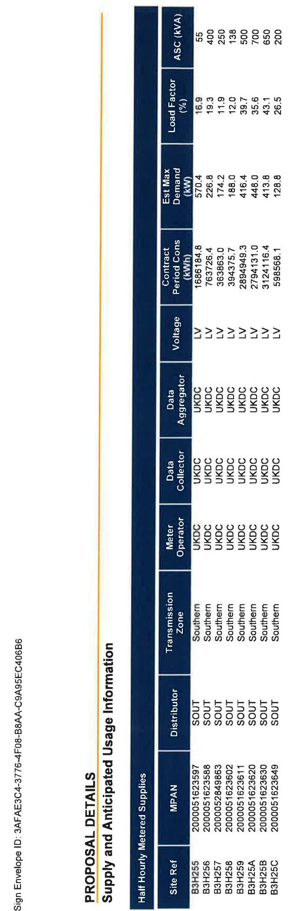
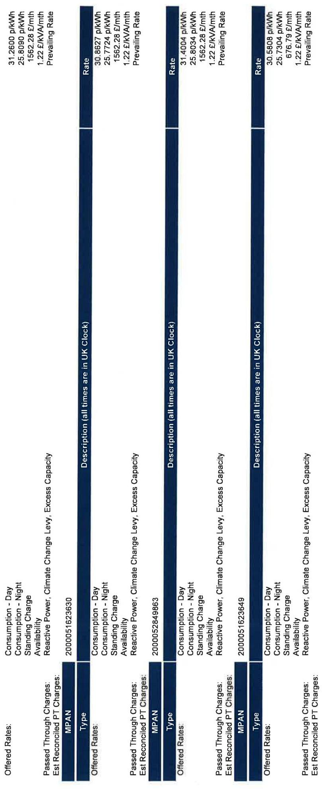
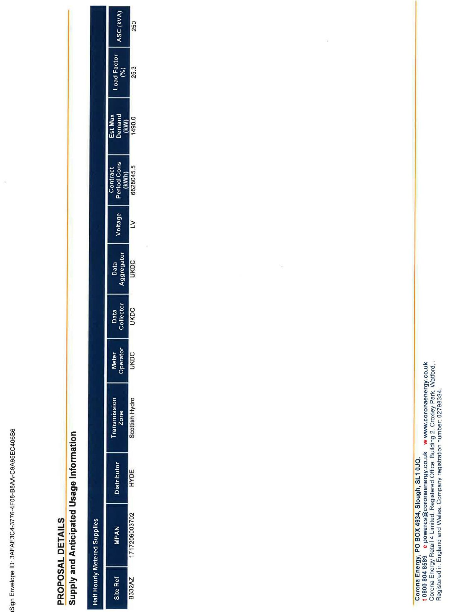
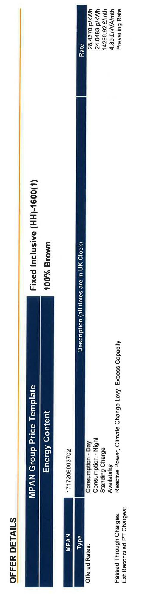

# Corona Energy Electricity Supply Contract 

PARTICULARS OF CONTRACT

| Customer Name: | Vector Aerospace International Limited |
| :-- | :-- |
| Customer Address: | Fleetlands |
| Company/Charity Registration | Fareham Road |
| Number: | Gosport |
| Contract Reference: | Hampshire |
| Customer Reference: | PO13 OAA |
| Start Date: |  |
| End Date: | Registered in England Number: 6404274 |
| Product: | 256125-23/1 |
| Number of Sites: | 60126956 |
| Payment Terms: | 01/10/2023 |
| Payment Method: | 30/09/2025 |

The Third Party Intermediary (TPI) is Power Kiosk
The estimated fee payable by us to the TPI for the duration of your contract with us, based on your total estimated contractual consumption is $£ 63,099.58$ (TPI Fee)
The value of that TPI Fee is included in your agreed contract price
the TPI fee payable to Power Kiosk Equates to 0.5 ppkwh

Corona Energy, PO BOX 4934, Slough, SL1 0JG.
108008048589 e powercs@coronaenergy.co.uk w www.coronaenergy.co.uk
Corona Energy Retail 4 Limited. Registered Office: Building 2, Crowley Park, Watford,

# TERMS AND CONDITIONS 

The Corona Energy Electricity Supply Contract is subject to the acceptance of Corona Energy's Terms and Conditions relating to the Product stated on Page 1 of this document.

Please be aware any Products that relate to an SME Product agreement; if termination has not been served by either party 30 days before the End Date, we will automatically renew your supply for a further twelve month period.

Corona Energy has the right to withdraw this offer at any time prior to issuing written confirmation that the agreement has been accepted on these terms. If the contract is terminated early, additional charges may apply, please ensure you are familiar with all clauses relating to Termination, Change of Ownership/Isolation, Liability and Force Majeure; all of which are highlighted in bold within the terms and conditions.

Our prices are subject to VAT \& Climate Change Levy, signed acceptance, credit approval and successful transfer of the supply point on the agreed start date in the event of a new business supply

The supply contract is a legal document, and as such is binding on both parties once entered into.

The image is a photo of a signed document section. It includes the following text:

- "Signed on behalf of the Customer"
- "Signature: Brent Fawkes" (handwritten)
- "Print Name: Brent Fawkes"
- "Position: VP Finance"
- "Date: May 16/23" (handwritten)

The layout consists of a table with two columns, where the left column contains labels ("Signature:", "Print Name:", "Position:", "Date:") and the right column contains the corresponding handwritten or printed information.

Signed on behalf of the Supplier

| Signature: | $\begin{aligned} & \text { Jack Goodson } \\ & \text { Jy } \end{aligned}$ |
| :--: | :--: |
| Print Name: | Jack Goodson |
| Position: | Head of Corporate Sales |
| Date: | $17-05-2023$ |

[^0]
[^0]:    Corona Energy, PO BOX 4934, Slough, SL1 0JQ.
    108008048599 e powertz@coronaenergy.co.uk w www.coronaenergy.co.uk Corona Energy Retail 4 Limited. Registered Office: Building 2, Croxley Park, Watford. Registered in England and Wales. Company registration number: 02798334.

The image is a table with the following details:

- **Title**: PROPOSAL DETAILS Supply and Anticipated Usage Information
- **Columns**:
  - **Site Ref**: BH425, BH256, BH257, BH258, BH258, BH325A, BH325B, BH325C
  - **MPAN**: 200051623597, 200051623588, 200051623601, 200051623011, 200051623020, 200051623010, 200051623649
  - **Distributor**: SOUT, SOUT, SOUT, SOUT, SOUT, SOUT, SOUT, SOUT
  - **Transmission Zone**: Southern, Southern, Southern, Southern, Southern, Southern, Southern, Southern
  - **Meter Operator**: UKDC, UKDC, UKDC, UKDC, UKDC, UKDC, UKDC, UKDC
  - **Data Collector**: UKDC, UKDC, UKDC, UKDC, UKDC, UKDC, UKDC, UKDC
  - **Data Aggregator**: UKDC, UKDC, UKDC, UKDC, UKDC, UKDC, UKDC, UKDC
  - **Voltage**: LV, LV, LV, LV, LV, LV, LV, LV
  - **Contract Period Cons (kWh)**: 168184.8, 763726.4, 363263.0, 394375.7, 289449.3, 2794131.0, 3124116.4, 589568.1
  - **Est Max Demand (kW)**: 570.4, 226.8, 174.2, 188.0, 448.4, 448.0, 413.8, 128.8
  - **Load Factor (%)**: 16.9, 19.3, 11.9, 12.0, 35.6, 39.7, 43.1, 26.5
  - **ASC (kVA)**: 55, 400, 250, 138, 500, 700, 650, 200

The table is oriented vertically, with the title on the left side.

The image is a photo of a document or table layout. It contains several columns with headers and data entries. The main elements include:

- **Left Column (Vertical Text):**
  - "OFFER DETAILS"
  - "MPAN Group Price Template"
  - "Energy Content"
  - "Fixed Inclusive (HH)-1600(1)"
  - "100% Brown"

- **Main Columns (Horizontal Text):**
  - **Headers:**
    - "MPAN"
    - "Type"
    - "Offered Rates:"
    - "Description (all times are in UK Clock)"
  - **Data Entries:**
    - "200005162602"
    - "200005162611"
    - "200005162588"
    - "200005162620"
    - "200005162597"
  - **Repeated Text in Columns:**
    - "Consumption - Day"
    - "Consumption - Night"
    - "Standing Charge"
    - "Availability"
    - "Reactive Power, Climate Change Levy, Excess Capacity"
    - "Passed Through Charges: Est Reconciled/CT Charges."
    - "Rate"
    - "Prevail"
    - "31.086"
    - "25.894"
    - "15.262"
    - "12.424"

The columns are organized in a structured format, with each MPAN number associated with specific types, rates, and descriptions. The text is aligned vertically and horizontally, with some sections highlighted in bold or different colors for emphasis.

The image is a flow diagram with three vertical columns, each representing different sets of data related to energy rates and charges.

- **Column 1:**
  - **MPAN:** 200005162360
  - **Type:** Description (all times are in UK Clock)
  - **Offered Rates:**
    - Rate: 31.2600 p/kWh
    - 25.8990 p/kWh
    - 15622.28 £/mth
    - 1.22 £/kVA/mth
    - Prevailing Rate
  - **Passed Through Charges:**
    - Consumption - Day
    - Consumption - Night
    - Standing Charge
    - Availability
    - Reactive Power, Climate Change Levy, Excess Capacity
    - Est Reconciled PT Charges:

- **Column 2:**
  - **MPAN:** 200005284963
  - **Type:** Description (all times are in UK Clock)
  - **Offered Rates:**
    - Rate: 30.6827 p/kWh
    - 25.7872 p/kWh
    - 15622.28 £/mth
    - 1.22 £/kVA/mth
    - Prevailing Rate
  - **Passed Through Charges:**
    - Consumption - Day
    - Consumption - Night
    - Standing Charge
    - Availability
    - Reactive Power, Climate Change Levy, Excess Capacity
    - Est Reconciled PT Charges:

- **Column 3:**
  - **MPAN:** 200005162349
  - **Type:** Description (all times are in UK Clock)
  - **Offered Rates:**
    - Rate: 31.4004 p/kWh
    - 25.8034 p/kWh
    - 15622.28 £/mth
    - 1.22 £/kVA/mth
    - Prevailing Rate
  - **Passed Through Charges:**
    - Consumption - Day
    - Consumption - Night
    - Standing Charge
    - Availability
    - Reactive Power, Climate Change Levy, Excess Capacity
    - Est Reconciled PT Charges:

Each column has similar categories of information, with slight variations in the rate values.

# TERMINOLOGY 

| Acronym/Term | Meaning |
| :--: | :--: |
| MPAN | Meter Point Administration Number - a 13 digit unique reference for your supply point. |
| SSC | Standard Settlement Configuration - for meters that do not take half hourly measurements of consumption this is a 4 digit code that represents the periods of use that your meter is capable of measuring. This will not be displayed for half hourly meters. |
| Site | A geographic location in the United Kingdom. |
| Price Group | A grouping of the supplies for which you are being provided a quotation based on their sharing the same pricing template, rate structure and energy content. |
| Offered Rates | These are the rates that are being offered to you. |
| Passed Through Charges | These are rates that we are either directly charged for your supply (e.g. Distribution costs) or are charged on billed values (e.g. CCL and VAT). These charges will be passed onto you and charged in addition to the "Offered Rates". |
| Est Reconciled PT Charges | Estimated Reconciled Passed-Through Charges - these are Pass-Through charges for which the amount is not known until after the event e.g. TNUoS TRIAD rates. We will charge an estimated amount, based on your forecast usage, up until the actual amount is known and at this point a reconciliation will be performed. The difference between the estimated charges that have been charged up until this point and the actual amount due is calculated by the reconciliation and is then included on your next bill. |
| Estimated Annual Cons (kWh) | An estimate of the amount of electricity that will be used over the next annual period. The value is expressed in kWh and it is based on this prediction of your use that this quote has been provided. If you believe the value displayed is not an accurate estimation of your predicted use please let us know. |
| Contract Period Cons (kWh) | The estimated total consumption over the contract term for an individual supply point on the basis of which the offered rates have been calculated. |
| Est Max Demand (kW) | An estimation of the maximum demand that will be applicable for a supply. |
| Load Factor (\%) | A ratio of the average load on the supply point divided by the peak load. |
| ASC (kVA) | Available Supply Capacity. The amount of electricity that the Distribution Network Operator (DNO) makes available for use through your supply. |
| Metering Point | The term Metering Point relates to the electricity usage at your meter point. Due to losses over the transmission and distribution networks the energy actually used at a meter point is less than the total energy that needs to be generated in order to supply it to you. |
| Grid Supply Point | The term Grid Supply Point relates to the volume of electricity that needs to be delivered to the grid supply point in order to then be distributed to your supply to provide the metering point consumption. The Grid Supply Point consumption is the sum of the Metering Point consumption and distribution losses. |
| Notional Balancing Point | The term Notional Balancing Point relates to the volume of electricity that needs to be generated in order to transmit and distribute the electricity to supply and provide the Metering Point consumption. The Notional Balancing Point consumption is the sum of the Metering Point consumption, distribution losses and transmission losses. |

## MARKET PARTICIPANTS

| Participant Code | Role | Training As |
| :--: | :--: | :--: |
| SOUT | Distributor | SSE Power Distribution |
| UKDC | Meter Operator | IMServ Europe Ltd |
| UKDC | Data Collector | IMServ Europe Ltd |
| UKDC | Data Aggregator | IMServ Europe Ltd |

# Corona Energy Electricity Supply Contract 

PARTICULARS OF CONTRACT

| Customer Name: | Vector Aerospace International Limited |
| :-- | :-- |
| Customer Address: | Fleetlands |
|  | Fareham Road |
|  | Gosport |
|  | Hampshire |
|  | PO13 OAA |
| Company/Charity Registration |  |
| Number: | Registered in England Number: 6404274 |
| Contract Reference: | $225089-85 / 1$ |
| Customer Reference: | 60126956 |
| Start Date: | $01 / 11 / 2023$ |
| End Date: | $31 / 10 / 2025$ |
| Product: | KAM Fixed 2 |
| Number of Sites: | 1 (as detailed in Proposal Details Section) |
| Payment Terms: | 30 |
| Payment Method: | Direct Debit |

The Third Party Intermediary (TPI) is Power Kiosk
The estimated fee payable by us to the TPI for the duration of your contract with us, based on your total estimated contractual consumption is $£ 33,140.23$ (TPI Fee)
The value of that TPI Fee is included in your agreed contract price
the TPI fee payable to Power Kiosk Equates to 0.5 ppkwh

# TERMS AND CONDITIONS 

The Corona Energy Electricity Supply Contract is subject to the acceptance of Corona Energy's Terms and Conditions relating to the Product stated on Page 1 of this document.

Please be aware any Products that relate to an SME Product agreement; if termination has not been served by either party 30 days before the End Date, we will automatically renew your supply for a further twelve month period.

Corona Energy has the right to withdraw this offer at any time prior to issuing written confirmation that the agreement has been accepted on these terms. If the contract is terminated early, additional charges may apply, please ensure you are familiar with all clauses relating to Termination, Change of Ownership/Isolation, Liability and Force Majeure; all of which are highlighted in bold within the terms and conditions.

Our prices are subject to VAT \& Climate Change Levy, signed acceptance, credit approval and successful transfer of the supply point on the agreed start date in the event of a new business supply

The supply contract is a legal document, and as such is binding on both parties once entered into.

The image is a section of a document with a signature block.

- **Text at the top:** "Signed on behalf of the Customer"
- **Fields and handwritten entries:**
  - **Signature:** [Handwritten signature]
  - **Print Name:** "Bret Fawkes"
  - **Position:** "VP Finance"
  - **Date:** "May 16/23"

The fields are organized in a table format with labels on the left and corresponding handwritten entries on the right.

Signed on behalf of the Supplier

| Signature: |  |
| :-- | :-- |
| Print Name: |  |
| Position: |  |
| Date: |  |

Corona Energy, PO BOX 4934, Slough, SL1 0JQ.
t 08008048589 e powercs@coronaenergy.co.uk w www.coronaenergy.co.uk
Corona Energy Retail 4 Limited. Registered Office: Building 2, Croxley Park, Walford, Registered in England and Wales. Company registration number: 02798334.

The image is a photo or illustration of a document titled "PROPOSAL DETAILS Supply and Anticipated Usage Information." It contains a table with the following information:

- **Half Hourly Metered Supplies**
- **Site Ref:** MPAN
- **Distributor:** Scottish Hydro
- **Transmission Zone:** HYDE
- **Meter Operator:** UKDC
- **Data Collector:** UKDC
- **Data Aggregator:** UKDC
- **Voltage:** LV
- **Contract Period/Cons:** 68280 kWh
- **Est. Max Demand:** 149.00
- **Load Factor (%):** 25.3
- **ASC (kVA):** 25

On the side, there is text related to Corona Energy, including contact information and a website URL: www.coronaenergy.co.uk. The document also includes a system envelope ID: 3AF3EAC3-37F6-4FE9-BB8A-CA98E5C40BB6.

The image is a photo or illustration of a document or form with the following details:

- **Text on the left side:**
  - "OFFER DETAILS"
  - "MPAN Group Price Template"
  - "Energy Content"
  - "MPAN"
  - "Type"

- **Text in the middle:**
  - "Fixed Inclusive (HH)-1600(1)"
  - "100% Brown"
  - "171720603702"

- **Text on the right side:**
  - "Rate"
  - "28.4370 p/kWh"
  - "24.0843 p/kWh"
  - "142.8062 £/mth"
  - "4.89 £/kVA/mth"
  - "Prevailing Rate"
  - "Description (all times are in UK Clock)"
  - "Consumption - Day"
  - "Consumption - Night"
  - "Standing Charge"
  - "Availability"
  - "Reactive Power, Climate Change Levy, Excess Capacity"
  - "Passed Through Charges: Est Reconciled PT Charges"

# TERMINOLOGY 

| Acconym/Term | Meaning |
| :--: | :--: |
| MPAN | Meter Point Administration Number - a 13 digit unique reference for your supply point. |
| SSC | Standard Settlement Configuration - for meters that do not take half hourly measurements of consumption this is a 4 digit code that represents the periods of use that your meter is capable of measuring. This will not be displayed for half hourly meters. |
| Site | A geographic location in the United Kingdom. |
| Price Group | A grouping of the supplies for which you are being provided a quotation based on their sharing the same pricing template, rate structure and energy content. |
| Offered Rates | These are the rates that are being offered to you. |
| Passed Through Charges | These are rates that we are either directly charged for your supply (e.g. Distribution costs) or are charged on billed values (e.g. CCL and VAT). These charges will be passed onto you and charged in addition to the "Offered Rates". |
| Est Reconciled PT | Estimated Reconciled Passed-Through Charges - these are Pass-Through charges for which the |
| Charges | amount is not known until after the event e.g. TNUoS TRIAD rates. We will charge an estimated amount, based on your forecast usage, up until the actual amount is known and at this point a reconciliation will be performed. The difference between the estimated charges that have been charged up until this point and the actual amount due is calculated by the reconciliation and is then included on your next bill. |
| Estimated Annual Cons (kWh) | An estimate of the amount of electricity that will be used over the next annual period. The value is expressed in kWh and it is based on this prediction of your use that this quote has been provided. If you believe the value displayed is not an accurate estimation of your predicted use please let us know. |
| Contract Period Cons (kWh) | The estimated total consumption over the contract term for an individual supply point on the basis of which the offered rates have been calculated. |
| Est Max Demand (kW) | An estimation of the maximum demand that will be applicable for a supply. |
| Load Factor (\%) | A ratio of the average load on the supply point divided by the peak load. |
| ASC (kVA) | Available Supply Capacity. The amount of electricity that the Distribution Network Operator (DNO) makes available for use through your supply. |
| Metering Point | The term Metering Point relates to the electricity usage at your meter point. Due to losses over the transmission and distribution networks the energy actually used at a meter point is less than the total energy that needs to be generated in order to supply it to you. |
| Grid Supply Point | The term Grid Supply Point relates to the volume of electricity that needs to be delivered to the grid supply point in order to then be distributed to your supply to provide the metering point consumption. The Grid Supply Point consumption is the sum of the Metering Point consumption and distribution losses. |
| Notional Balancing Point | The term Notional Balancing Point relates to the volume of electricity that needs to be generated in order to transmit and distribute the electricity to supply and provide the Metering Point consumption. The Notional Balancing Point consumption is the sum of the Metering Point consumption, distribution losses and transmission losses. |

## MARKET PARTICIPANTS

| Participant Code | Role | Trading As |
| :--: | :--: | :--: |
| HYDE | Distributor | SSE Power Distribution |
| UKDC | Meter Operator | IMServ Europe Ltd |
| UKDC | Data Collector | IMServ Europe Ltd |
| UKDC | Data Aggregator | IMServ Europe Ltd |

