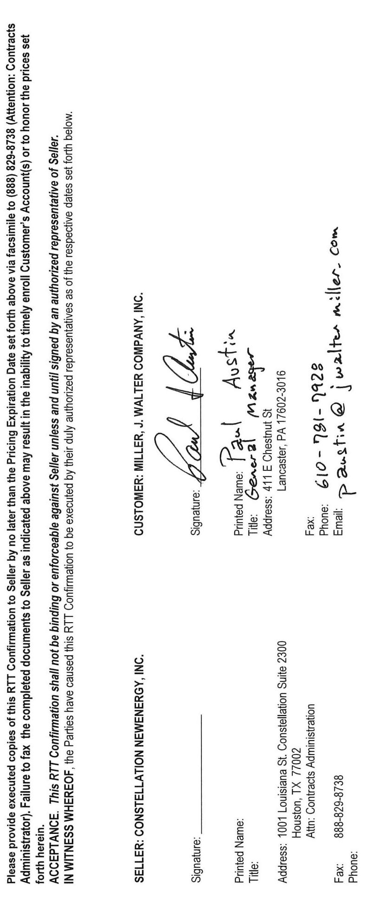
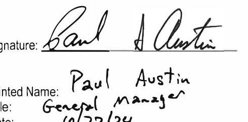

# Constellation NewEnergy, Inc. Retail Trade Transactions ("RTT") Confirmation Pricing Expiration Date: 5:30 PM Eastern Time on October 22, 2024 

This Retail Trade Transactions Confirmation ("RTT Confirmation") is being entered into by and between Constellation NewEnergy, Inc. ("Seller") and Miller, J. Walter Company, Inc. ("Customer") pursuant to and in accordance with a master retail electricity supply agreement, power sale agreement or master electricity sales agreement ("Master Agreement") and a transaction confirmation or pricing schedule (the "TC") or an Electricity Supply Agreement (OF-0000876324), as applicable, between Seller and Customer. Any reference in the Master Agreement, the TC, or the Electricity Supply Agreement, as applicable, or this RTT Confirmation to the "TC" or the "Agreement" shall include this RTT Confirmation. Capitalized terms used but not defined herein shall have the meanings ascribed to elsewhere in the Agreement. To the extent that the Master Agreement and/or the TC or the Electricity Supply Agreement and this executed RTT Confirmation contradict each other, this fully executed RTT Confirmation shall control. The Parties agree to the sale/purchase of the products identified below under the following terms and conditions:

## 1. RTT Confirmation Detail Table

No. of Service Accounts: 3

| RTT Contract   Number | Product | Sell | Commodity | RTT Start Date | RTT End Date | Delivery   Point | Time Pattern | Holidays | Quantity | Qty UOM | Price ( $\$ /$ kWh) | UDC Account Number |
| :--: | :--: | :--: | :--: | :--: | :--: | :--: | :--: | :--: | :--: | :--: | :--: | :--: |
| 583814.5204.0-1 | Electric Fixed Price Percent Of Load | 5 | Energy | $12 / 14 / 2024$ | $12 / 31 / 2025$ | PPL | 7x24 | NERC   Holidays | 100 | PercentOfLoad | 50.03737 | 1552082006 |
| 583814.5204.0-1 | Electric Fixed   Price Percent Of   Load | 5 | Energy | $12 / 14 / 2024$ | $12 / 31 / 2025$ | PPL | 7x24 | NERC   Holidays | 100 | PercentOfLoad | 50.03737 | 2652082009 |
| 583814.5204.0-1 | Electric Fixed   Price Percent Of   Load | 5 | Energy | $12 / 14 / 2024$ | $12 / 31 / 2025$ | PPL | 7x24 | NERC   Holidays | 100 | PercentOfLoad | 50.03737 | 8665252002 |

## 2. Definitions

### 2.1. RTT Confirmation Detail Definitions

2.1.1. Commodity means the commodity for the transaction set forth in this RTT Confirmation as defined in the Commodity Definitions below.

### 2.1.2. Commodity Definitions

2.1.2.1. Energy means the requirement to supply electrical energy to meet the needs of Customer's Account(s) as defined by the relevant ISO or other electrical system governing authority as applicable.
2.1.2.2. Natural Gas is defined as meaning the requirement to fix some portion of the natural gas price associated with purchases of electricity when the purchase price is stated as a heat rate.
2.1.3. Holidays means the days designated as holidays per the Holidays Definitions below.
2.1.4. Delivery Point means the point of interconnection between the ISO-controlled grid or a third-party transmission system and/or distribution system, as applicable, and the Utility's transmission system and/or distribution system at which the commodity will be delivered for settlement purposes.
2.1.4.1. Congestion Costs. If an Electric Block or Electric Fixed Price Percent of Load's Delivery Point for the Account(s) above is not at the Account(s)' zone (UDC) indicated in the Account Schedule for the applicable TC or Electricity Supply Agreement, then Seller shall pass through Congestion Costs on Customer's monthly invoice for the Quantity. "Congestion

Costs" (which may also be referred to as "Basis Costs" in the TC) means the difference between the ISO-published LMP for the ISO energy zone of the Account(s), in the applicable TC or Electricity Supply Agreement, and the ISO LMP for the Delivery Point specified in the table above.
2.1.4.2. Line Loss Costs. Line Loss Costs shall be calculated for the Account(s) and Quantity above, as the product of the applicable Price above, and the Account's Line Loss Usage, and the Quantity. If Line Loss Usage is not otherwise defined in the Agreement, "Line Loss Usage" shall mean the kWh difference between the UDC metered usage and the ISO settlement volumes. To the extent this RTT does not secure 100 percent of the usage for the Account(s) above, then for each Account's remaining volumes not covered by this RTT: (i) the Line Loss Costs shall be Passed Through as described in the Agreement and (ii) Line Loss Costs will appear as separate line item(s) on the invoice.
2.1.5. Price means the price to be paid per unit for the commodity. The price may be stated in dollars or as a heat rate. See Product Definitions, below.
2.1.6. Product means the specific type of product purchased in the RTT Confirmation. See Product Definitions below.
2.1.7. Quantity means the amount of the commodity sold in each hour for the hours in which the commodity is defined to be provided.
2.1.8. RTT Contract Number means the contract number in Seller systems used to identify the specific RTT.
2.1.9. RTT End Date means on or about the date set forth above in which the commodity ceases to be provided to the Accounts, subject to definitions of Time Pattern and Holidays Excluded. In no case shall the term for any Product continue past the End Date of the underlying TC.
2.1.10. RTT Start Date means on or about the date set forth above in which the commodity begins to be provided to the Accounts subject to definitions of Time Pattern and Holidays Excluded. In no case shall the term for any Product start prior to the Start Date of the underlying TC.
2.1.11. Sell means that Seller is selling and the Customer is purchasing the commodity as set forth in this RTT Confirmation.
2.1.12. Time Pattern means the days of the week and hours of those days when the commodity will be provided between the RTT Start Date and RTT End Date subject to definitions of Holidays. See Time Pattern Definitions below.
2.1.13. Utility Account numbers means the list of Account(s) participating in the purchase of the RTT for purposes of invoice calculation based on the Utility account numbers, recognizing that such account numbers may be updated or replaced from time to time by the UDC, ISO, or other authorized entity.
2.2. Product Definitions
2.2.1. Electric Block or Fixed Energy Contract Quantity fixes the unit Price and the Quantity for the specified commodity, Delivery Point, Time Pattern, and Holidays.
2.2.2. Electric Fixed Price Percent Of Load or Incremental Fixed Energy Contract Quantity Percentage fixes the unit Price for a fixed percentage of the total requirement of the specified commodity for the specified Delivery Point, Time Pattern, and Holiday Pattern.
2.2.3. Electric Block DA fixes the Quantity for the specified commodity, Delivery Point, Time Pattern, and Holidays. The price will be the day ahead market price established by the Independent System Operator (ISO) plus the stated adder listed under Price.
2.2.4. Gas Block fixes the Gas Price and the Quantity for the specified Delivery Point, Time Pattern, and Holidays. This product is used only when the customer has previously purchased a Heat Rate Block and is used to fix the Gas Price for a portion of heat rate block(s).
2.2.5. Gas Fixed Price Percent of Load fixes the Gas Price for a fixed percentage of electric usage for the specified Delivery Point, Time Pattern, and Holiday Pattern. This RTT is used only when the base contract price is stated as a heat rate.
2.2.6. Heat Rate Block fixes the unit Price and the Quantity for the specified commodity, Delivery Point, Time Pattern, and Holidays. The unit Price is a heat rate, meaning that the price for the electricity will be determined by the price of natural gas multiplied by the heat rate. The gas price index is NA, the gas price index location is NA, the electric price index is NA. The Gas Price for a Heat Rate Block may be fixed for some or all of the Heat Rate Block volume by the purchase of a Gas Block.
2.3. Time Pattern Definitions
2.3.1. $7 \times 24$ means all days and all hours.
2.3.2. Central $2 \times 16$ means Central Prevailing Time, Sat., Sun. and applicable Holidays from 6:00 a.m. through 10:00 p.m.
2.3.3. Central $2 \times 24$ means Central Prevailing Time, Sat., Sun. and applicable Holidays for all hours.
2.3.4. Central $5 \times 16$ means Central Prevailing Time, Mon. through Fri. from 6:00 a.m. through 10:00 p.m. excluding Holidays.
2.3.5. Central $5 \times 24$ means Central Prevailing Time, Mon. through Fri. for all hours.
2.3.6. Central $5 \times 8$ means Central Prevailing Time, Mon. through Fri. from midnight through 6:00 a.m. and 10:00 p.m. through midnight.
2.3.7. Central $7 \times 16$ means Central Prevailing Time, Sun. through Sat. from 6:00 a.m. through 10:00 p.m.
2.3.8. Central $7 \times 8$ means Central Prevailing Time, Sun. through Sat. from midnight through 6:00 a.m. and 10:00 p.m. through midnight.

2.3.9. Central Whls NERC Off Peak means Central $5 \times 8$ and Central $2 \times 24$ as elsewhere defined.
2.3.10. Central Whls NERC Peak means Central $5 \times 16$, as elsewhere defined.
2.3.11. Eastern $2 \times 16$ means Eastern Prevailing Time, Sat., Sun, and applicable Holidays from 7:00 a.m. through 11:00 p.m.
2.3.12. Eastern $2 \times 24$ means Eastern Prevailing Time, Sat., Sun, and applicable Holidays for all hours.
2.3.13. Eastern $5 \times 16$ means Eastern Prevailing Time, Mon. through Fri. from 7:00 a.m. through 11:00 p.m. excluding Holidays.
2.3.14. Eastern $5 \times 8$ means Eastern Prevailing Time, Mon. through Fri. from midnight through 7:00 a.m. and 11:00 p.m. through midnight.
2.3.15. Eastern $7 \times 16$ means Eastern Prevailing Time, Sun. through Sat. from 7:00 a.m. through 11:00 p.m.
2.3.16. Eastern $7 \times 8$ means Eastern Prevailing Time, Sun, through Sat. from midnight through 7:00 a.m. and 11:00 p.m. through midnight.
2.3.17. Eastern Whls NERC Off Peak means Eastern $5 \times 8$ and Eastern $2 \times 24$ as elsewhere defined.
2.3.18. Eastern Whls NERC Peak means Eastern $5 \times 16$, as elsewhere defined.
2.3.19. Pacific $1 \times 16$ means Pacific Prevailing Time, Sun, and applicable Holidays from 6:00 a.m. through 10:00 p.m.
2.3.20. Pacific $1 \times 24$ means Pacific Prevailing Time, Sun, and applicable Holidays for all hours.
2.3.21. Pacific $5 \times 16$ means Pacific Prevailing Time, Mon. through Fri. from 6:00 a.m. through 10:00 p.m. excluding Holidays.
2.3.22. Pacific $6 \times 16$ means Pacific Prevailing Time, Mon. through Sat. from 6:00 a.m. through 10:00 p.m. excluding Holidays.
2.3.23. Pacific $6 \times 8$ means Pacific Prevailing Time, Mon. through Sat. from midnight through 6:00 a.m. and 10:00 p.m. through midnight.
2.3.24. Pacific $7 \times 16$ means Pacific Prevailing Time, Sun. through Sat. from 6:00 a.m. through 10:00 p.m.
2.3.25. Pacific $7 \times 8$ means Pacific Prevailing Time, Sun. through Sat. from midnight through 6:00 a.m. and 10:00 p.m. through midnight.
2.3.26. Pacific Whls NERC Off Peak means Pacific $6 \times 8$ and Pacific $1 \times 24$ as elsewhere defined.
2.3.27. Pacific Whls NERC Peak means Pacific $6 \times 16$, as elsewhere defined.
2.4. Holidays Definitions
2.4.1. NERC Holidays means holidays as defined by the North American Electric Reliability Council (NERC).
[REMAINDER OF PAGE LEFT INTENTIONALLY BLANK.]

The image is a photo of a document with the following text:

- **Customer: Miller, J. Walter Company, Inc.**
  - Signature: [Signature]
  - Printed Name: Paul Austin
  - Title: General Manager
  - Address: 411 E Chestnut St, Lancaster, PA 17602-3016
  - Phone: 610-781-7928
  - Email: paustin@jwaltermiller.com

- **Seller: Constellation NewEnergy, Inc.**
  - Signature: [Blank line]
  - Printed Name: [Blank line]
  - Title: [Blank line]
  - Address: 1001 Louisiana St, Constellation Suite 2300, Houston, TX 77002
  - Attn: Contracts Administration
  - Fax: 888-829-8738
  - Phone: [Blank line]

- Additional text:
  - "Please provide executed copies of this RTT Confirmation to Seller by no later than the Pricing Expiration Date set forth above via facsimile to (888) 829-8738 (Attention: Contracts Administrator). Failure to fax the completed documents to Seller as indicated above may result in the inability to timely enroll Customer's Account(s) or to honor the prices set forth herein."
  - "Acceptance. This RTT Confirmation shall not be binding or enforceable against Seller unless and until signed by an authorized representative of Seller."
  - "In witness whereof, the Parties have caused this RTT Confirmation to be executed by their duly authorized representatives as of the respective dates set forth below."

# Constellation 

Constellation NewEnergy, Inc.
Electricity Supply Agreement - Flexible Index Solutions

## MILLER, J. WALTER COMPANY, INC. ("Customer") AND Constellation NewEnergy, Inc. ("Seller") AGREE AS FOLLOWS:

Defined Terms. Capitalized terms have the meanings set out in this Electricity Supply Agreement, including the attached General Terms and Conditions ("Agreement"); generally the words "you" and "your" refer to the Customer listed above and the words "we" and "us" refer to Seller, unless the context clearly requires otherwise.

Purchase and Sale of Electricity. You will purchase and receive, and we will sell and supply all of your electricity requirements at the prices set forth below for each account identified in the Account Schedule below ("Account"). By signing this Agreement, you authorize us to enroll each Account with your UDC so that we can supply those Account(s). You will take such actions as we request to allow us to enroll each Account in a timely manner. You agree that we may select such sources of energy as we deem appropriate to meet our obligations under this Agreement. We will enroll each Account with the applicable UDC as being supplied by us and will take such other actions with the applicable UDC and ISO necessary for us to meet our obligations under this Agreement.

The specific prices for each Account are set forth in the Account Schedule, below. You are also responsible to pay (1) Taxes - which we will pass through to you on your bill or as part of the price of electricity, as may be required by law, rule or regulation and (2) UDC charges for delivery/distribution services if we provide you a single bill that includes UDC charges. We will apply all appropriate Taxes unless and until you provide a valid certification of tax exempt status. Your prices are fixed for the existing term of this Agreement and only subject to change if there is a change in law, as described in Section 5 of the General Terms and Conditions below. The UDC charges (if any) and Taxes are charged to you as a "pass-through," which means they will change during the existing term of this Agreement if and as the related charges assessed or charged vary for any reason, including but not limited to the types of changes described above.

We will pass through Energy Costs using the day ahead locational marginal price, which changes hourly (or sub-hourly in some markets), for the applicable ISO residual zone for your Account. If your Account(s) are not equipped with meters that provide an hourly (or sub-hourly in some markets) reading, we will use either the load profiles provided by the UDC applicable to the Account or, in the absence of such load profiles provided by the UDC on a timely basis, an otherwise reasonable allocation method established by us, in order to obtain hourly (or sub-hourly in some markets) readings to calculate costs associated with usage at market index prices. You may fix the Energy Costs for some or all of your usage as described in Retail Trade Transactions Section, below.

Cost Components. For each of the items listed as "Fixed" below, this means the item is included in your contract prices as set forth in the Account Schedule. For each of the items listed as "Passed Through" below, this means that you will be charged the costs associated with the line item in accordance with the definitions of each item in Section 1 Definitions of the General Terms and Conditions.

| Energy Costs | Passed Through |
| :-- | :-- |
| Ancillary Services And Other ISO Costs | Fixed |
| Auction Revenue Rights Credits | Fixed |
| Capacity Costs | Passed Through |
| Transmission Costs | Passed Through |
| Transmission Loss Credits | Fixed |
| Line Loss Costs | Passed Through |
| FERC Order 745 Costs | Fixed |
| Balancing Congestion Costs | Fixed |
| Transmission Reallocation Costs | Fixed |
| Renewable Portfolio Standards Costs | Fixed |

The contract prices contained in the Account Schedule include credit costs and margin. Any applicable RMR Costs will be passed through to you. Deration Credits are included in the contract price(s).

Retail Trade Transactions. At any time during the term of this Agreement, you may enter into one or more Retail Trade Transactions ("RTTs") with us, which shall be evidenced by a fully executed RTT Confirmation and be incorporated herein. Such RTTs may cover the purchase of: (1) electricity to fix your price of energy for supply period of three month or longer equal to a prescribed percentage of your load volume and associated line loss; and (2) renewable energy certificates in an amount equal to a prescribed percentage of your load volume.

Term. This Agreement will become effective and binding after you have signed this Agreement and we have counter-signed. Subject to successful enrollment of your Account(s), this Agreement shall commence on or about the date set forth under "Start Date", and end on or about the date set forth under "End Date", unless extended on a holdover basis as described in this Agreement. The actual Start Date is dependent on the UDC successfully enrolling the Account(s) and furnishing us with all necessary information regarding the Account(s) meter read cycle and meter read date(s). The dates set forth in the Account Schedule below reflect UDC information available at that time or as otherwise estimated by us. The actual meter read dates may occur on or about the dates set forth herein. We will use commercially reasonable efforts to begin service to each Account(s) on the actual meter read date on or about the Start Date set forth herein. If we are unable to timely enroll an Account, the Start Date will commence on the next regularly scheduled UDC meter read cycle date following successful enrollment. The End Date will remain the same unless extended for a holdover term. We shall not be liable for any failure to enroll or drop an Account by the Start and End Date due to circumstances beyond our control. We will not be responsible for any gaps in service that may occur between the termination of your service from a prior supplier and the commencement of supply from us.

Nothing in this Agreement shall be deemed to require or otherwise obligate us to offer to extend the term of this Agreement. If following termination or expiration of this Agreement (whether in whole or in part), for any reason, some or all of the Accounts remain designated by the UDC as being supplied by us, we may continue to serve such Account(s) on a month-to-month holdover basis. During such holdover term, we will calculate your invoice as follows: (Each Account's metered usage, as adjusted by the applicable line loss factor) times (the ISO-published Day Ahead Locational Based Marginal Price for the applicable residual zone ("LMP") $+\$ .015000 / \mathrm{Wh}$ ) + (a pass through of all costs and charges incurred for the retail delivery of energy to you) + Taxes. This Agreement will continue to govern the service of such Accounts during such holdover term. Either party may terminate the holdover term at any time within its discretion at which time we will drop each Account as of the next possible meter read date to the then applicable tariff service, whether default service or otherwise.

Your Invoice. Your invoice will contain all charges applicable to your electricity usage, including Taxes (which are passed through to you). You will receive one invoice from the UDC for UDC charges and one invoice from us for all other charges ("Dual Billing") unless we agree otherwise, or your Account(s) eligibility changes. All amounts charged are due in full within twenty (20) days of the invoice date, and we reserve the right to adjust amounts previously invoiced based upon supplemental or additional data we may receive from your UDC. Your invoices will be based on actual data provided by the UDC, provided that if we do not receive actual data in a timely manner, we will make a good faith estimate using your historical usage data and other information. Once we receive actual data we will reconcile the estimated charges and adjust them as needed in subsequent invoices. If you fail to make payment by the due date, interest will accrue daily on outstanding amounts from the due date until the bill is paid in full at a rate of $1.50 \%$ per month, or the highest rate permitted by law, whichever is less. All invoices (including adjustments to those invoices) are conclusively presumed final and accurate unless such invoices are objected to by either you or us in writing, including adequate explanation and/or documentation, within 24 months after the date such invoice was rendered, provided however, we may rebill based on post-period audits or adjustments made by the ISO, UDC, or other governmental authority, commission or agency with jurisdiction in the state in which the accounts are located.

Certain Warranties. You warrant and represent that for Account(s) located in the Commonwealth of Pennsylvania your aggregate peak load during any 12 month period is greater than 25 kilowatts, and that electricity supplied under this Agreement is not for use at a residence.

Notices. All notices will be in writing and delivered by hand, certified mail, return receipt requested, or by first class mail, or by express carrier to our respective business addresses. Our business address is 1001 Louisiana St. Constellation Suite 2300, Houston, TX 77002, Attn: Contracts Administration. Either of us can change our address by notice to the other pursuant to this paragraph.

Customer Service. For questions about your invoice or our services, contact us at our Customer Service Department by calling toll-free 844-636-3749, or by e-mail at CustomerCare@Constellation.com. Your prior authorization of us to your UDC as recipient of your current and historical energy billing and usage data will remain in effect during the entire term of this Agreement, including any renewal, unless you rescind the authorization upon written notice to us or by calling us at 844-636-3749. We reserve the right to cancel this Agreement in the event you rescind the authorization.

Consumer Protections, State Public Utility Commission, and UDC Information. If you are a Pennsylvania consumer, you acknowledge provisions of the UDC's Electric Generation Supplier Services Tariff or Electric Generation Supplier Coordination Tariff relating to the UDC's disclosure of Customer-specific information to electric generation suppliers, and you agree to prohibit the disclosure of any such information to any electric generation supplier other than Seller during the term of this Agreement. You may change this election at any time by contacting the UDC. If there is any conflict between this Agreement and the referenced orders or tariffs, you agree that this Agreement shall control to the extent permissible under applicable law.

IN THE EVENT OF AN EMERGENCY, POWER OUTAGE OR WIRES AND EQUIPMENT SERVICE NEEDS, CONTACT YOUR APPLICABLE UDC AT:

| UDC Name | UDC Abbreviation | Contact Numbers |
| :-- | :-- | :-- |
| Pennsylvania Power \& Light   Company | PPL | $1-800-342-5775$ |

Additional information may be obtained by contacting the Public Service Commission ("PSC") of Maryland at: 1-800-402-0474, 6 St. Paul Street, Baltimore, MD 21202-6806, OR the PSC of the District of Columbia at: (202) 626-5100, 1333 H Street, NW, 6 Floor, East Tower, Washington, D.C. 20005, OR the Pennsylvania Public Utility Commission at: (717) 783-1740, P.O. Box 3265, Harrisburg, PA 17105-3265, OR the Delaware PSC at (302) 739-4247, 861 Silver Lake Boulevard, Cannon Building, Ste 100, Dover, DE 19904.
[REMAINDER OF PAGE LEFT INTENTIONALLY BLANK.]

Each party has caused this Agreement to be executed by its authorized representative on the respective dates written below.

# Constellation NewEnergy, Inc. 

Signature: $\qquad$

Printed Name:
Title:

Address: 1001 Louisiana St. Constellation Suite 2300
Houston, TX 77002
Attn: Contracts Administration
Fax: 888-829-8738
Phone: 844-636-3749

Customer: Miller, J. Walter Company, Inc.

The image is a photo of a signed document section. 

- **Signature:** A handwritten signature is present.
- **Printed Name:** Paul Austin
- **Title:** General manager
- **Date:** 10/22/24

The signature is positioned above the printed name and title.

Printed Name: Paul Austin
Title: General manager
Date: $\quad(p / 22 / 24$
Address: 411 E Chestnut St
Lancaster, PA 17602-3016
Fax:
Phone:
Email:

## General Terms and Conditions

1. Definitions.

"Ancillary Services And Other ISO Costs" means for any billing period the applicable charges regarding ancillary services as set forth in the applicable ISO Open Access Transmission Tariff ("OATT") and for other ISO costs not otherwise included in any of the defined cost components in this Agreement. We will reasonably determine your Account's monthly Ancillary Services And Other ISO Costs based on the Account's $\$ / \mathrm{kWh}$ share of costs for Ancillary Services And Other ISO Costs or otherwise reasonable allocation method as we may determine from time to time based on how Ancillary Services And Other ISO Costs are assessed by the ISO.
"Auction Revenue Rights Credits" means revenue credits resulting from the annual financial transmission rights auction conducted by the ISO that are applicable with respect to transmission peak load contribution. If Auction Revenue Rights Credits are "Passed Through", such credits shall be reasonably calculated by us as the monthly product of the (i) total Auction Revenue Rights Credits expressed in dollars per planning year for the applicable zone, as published by the ISO; divided by (ii) the total Network Service Peak Load for such zone, as published by the ISO; divided by (iii) the number of days in the applicable planning year; multiplied by (iv) by an Account's applicable Network Service Peak Load; multiplied by (v) the number of days in the billing period or such other reasonable calculation method applied by us.
"Balancing Congestion Costs" means any costs or charges imposed by the ISO in complying with the Federal Energy Regulatory Commission's Order on Rehearing and Compliance regarding Docket Nos. EL16-6-002, EL16-6-003 and ER16-121-001 (January 31, 2017).
"Capacity Costs" means a charge for fulfilling the capacity requirements for the Account(s) imposed by the ISO or otherwise. Capacity Costs includes, but is not limited to, the cost for procuring Capacity Performance resources (as currently required and defined by the ISO) in accordance with the provisions of Federal Energy Regulatory Commission Order on Proposed Tariff Revisions (Docket No. ER15-623-000, et al, issued June 9, 2015).
'Deration Credits' means the transmission loss deration value for each Account as accounted for by the ISO for the applicable UDC. If Deration Credits are noted as fixed in the contract price, then (a) the Retail Service Price will reflect the transmission loss deration value and (b) Line Loss Usage shall instead be defined as the kWh difference between the UDC metered usage and the ISO settlement volumes without any inclusion relative to the transmission loss deration value.
"Energy Costs" means a charge for the cost items included in the Locational Marginal Price for the ISO residual zone identified in the Account Schedule "FERC Order 745 Costs" means any costs or charges imposed by the ISO in accordance with complying with the provisions of Federal Energy Regulatory Commission ("FERC") in Order No. 74518 CFR Part 35 (March 15, 2011). Any modifications or conditions to the treatment of FERC Order 745 Costs under the ISO tariff or otherwise shall be deemed a change in law pursuant to Section 5 of the General Terms and Conditions of this Agreement.
"ISO" means the independent system operator or regional transmission organization responsible for the service territory governing an Account, or any successor or replacement entity.
"Line Loss Costs" means the costs (to the extent not already captured in the applicable Energy Costs) applicable to each Account based on the kWh difference between the UDC metered usage and the ISO settlement volumes (the "Line Loss Usage"). If Line Loss Costs are "Fixed," the Line Loss Costs
are included in the contract price and will not be invoiced as a separate line item. If Line Loss Costs are "Fixed (Charged Separately)", the contract price shall be applied to the Line Loss Usage and appear as a separate line item on the invoice. If Line Loss Costs are "Passed Through," the Line Loss Costs will be invoiced as a separate line item and calculated based on the applicable locational marginal price for the Line Loss Usage.
"Non Time Of Use" or "NTOU" means all hours of each day.
"Off Peak" means all hours other than Peak hours.
"Peak" means the hours designated as peak from time to time by the UDC.
"Renewable Portfolio Standards Costs" means the costs associated with meeting renewable portfolio standards costs at the levels required by applicable Law. If Renewable Portfolio Standards Costs are not included in the contract price, such costs for a particular month will be the product of (i) the Monthly RPS Price, and (ii) an Account's monthly kWh usage. The Monthly RPS Price is the price of renewable portfolio standards compliance for the Account, for a particular month, fixed by reference to the renewable portfolio standards forward price curve for the state where the Account is located.
"RMR Costs" or "Reliability-Must-Run Costs" means the generation deactivation charges and other such charges, if any, imposed by the ISO on load served in a particular load zone to recover the cost for any generation units that plan to retire but are required by the ISO to run for reliability purposes beyond their intended retirement date, in accordance with the applicable ISO rules and OATT provisions. Beginning on June 1, 2015, several Pennsylvania UDCs (i.e., PECO, MetEd, Penelec, Penn-Power and West Penn-Power) will be responsible for collecting RMR Costs that are incurred during the term of this Agreement on your UDC Charges. If at any time during the term of this Agreement the aforementioned UDCs discontinue collecting RMR Costs and we again become responsible for collecting them, we will pass those costs through to you.
"Taxes" means all federal, state, municipal and local taxes, duties, fees, levies, premiums or other charges imposed by any governmental authority, directly or indirectly, on or with respect to the electricity and related products and services provided under this Agreement, including any taxes enacted after the date we entered into this Agreement.
"Transmission Costs" means the charge for Network Transmission Service and Transmission Enhancement Charges, each as identified in the applicable OATT Tariff for the provision of transmission service by the ISO within the UDC's service territory, and expressly excluding costs separately detailed as Transmission Reallocation Costs as defined below. You will be responsible for any applicable Transmission Cost Enhancement Charges on your Delivery Charges in the following Pennsylvania UDCs: MetEd, Penelec, Penn-Power, West Penn-Power and PECO.
"Transmission Loss Credits" means the credit amounts applicable to the Accounts under the ISO's marginal loss construct.
"Transmission Reallocation Costs" means a charge or credit, as applicable, imposed by the ISO specifically for: (i) the Current Recovery Charges; and (ii) the Transmission Enhancement Charge Adjustments (each of (i) and (ii) as defined in the settlement agreement approved by FERC as of May 31, 2018 in Docket Number EL05-121-009 for the time periods identified therein and implemented in the OATT Schedule 12-C Appendices A and C, respectively, and as may subsequently be amended). Any modifications or conditions to the treatment of the Transmission Reallocation Costs under the ISO tariff or otherwise shall be deemed a change in law pursuant to Section 5 below.

"UDC" means your local electric distribution utility owning and/or controlling and maintaining the distribution system required for delivery of electricity to the Accounts.
"UDC Charges" means all UDC costs, charges, and fees, due under UDC's delivery services rates associated with your use of UDC's distribution network, all as defined by the UDC tariffs, and any similar or related charges the UDC may impose from time to time.
2. Cash deposit and other security. At any time, we may require that you provide information to us so that we may evaluate your creditworthiness. We reserve the right to require that you make a cash deposit or provide other security acceptable to us if your financial obligations to us increase under this Agreement, or if, in our opinion, your credit, payment history, or ability to pay your bills as they come due becomes a concern. You will deliver any required cash deposit or other required security (or any increase therein) within three (3) business days of our request.
3. Default under this Agreement. You will be in default under this Agreement if you fail to: pay your bills on time and in full; provide cash deposits or other security as required by Section 2 above; or perform all material obligations under this Agreement and you do not cure such default within 5 days of written notice from us; or if you declare or file for bankruptcy or otherwise become insolvent or unable to pay your debts as they come due. We will be in default under this Agreement if we fail to perform all material obligations under this Agreement and do not cure such default within 5 days written notice from you, or if we declare or file for bankruptcy or otherwise become insolvent or unable to pay our debts as they come due.
4. Remedies upon default; Early Termination Payment. If you are in default under this Agreement, in addition to any other remedies available to us, we may terminate this Agreement entirely, or solely with respect to those Accounts adversely affected by such default, and switch your Account(s) back to UDC service (consistent with applicable regulations and UDC practices); and/or you will be required to pay us an early termination payment to compensate us for all losses we sustain due to your default, including:

- all amounts you owe us for electricity provided to you;
- the positive difference, if any, between (A) the price you would have paid us under this Agreement had it not been terminated early (including our margin), less the then-current market price of electricity and services under terms substantially similar to the terms of this Agreement, as reasonably calculated by us based on information available to us internally or supplied by one or more third parties; multiplied by (B) the estimated undelivered volume of electricity you would consume through the end of the term, as reasonably calculated by us; and
- all costs (including attorneys' fees, expenses and court costs) we incur in collecting amounts you owe us under this Agreement.

The parties agree that any early termination payment determined in accordance with this Section is a reasonable approximation of harm or loss and is not a penalty or punitive in any respect, and that neither party will be required to enter into a replacement transaction in order to determine or be entitled to a termination payment.
5. Changes in law. We may pass through or allocate, as the case may be, to you any increase or decrease in our costs related to the electricity and related
products and services sold to you that results from the implementation of new, or changes (including changes to formula rate calculations) to existing, Laws, or other requirements or changes in administration or interpretation of Laws or other requirements. "Law" means any law, rule, regulation, ordinance, statute, judicial decision, administrative order, ISO business practices or protocol, UDC or ISO tariff, rule of any commission or agency with jurisdiction in the state in which the Accounts are located. Such additional amounts will be included in subsequent invoices to you. The changes described in this Section may change any or all of the charges described in this Agreement, whether described as "fixed," "variable," "pass-through" or otherwise. Your first bill reflecting increased costs will include a bill insert describing the increase in costs in reasonable detail.
6. Events beyond either of our reasonable control. If something happens that is beyond either of our reasonable control that prevents either of us from performing our respective obligations under this Agreement, then whichever one of us cannot perform will be relieved from performance until the situation is resolved. Examples of such events include: acts of God, fire, flood, hurricane, war, terrorism; declaration of emergency by a governmental entity, the ISO or the UDC; curtailment, disruption or interruption of electricity transmission, distribution or supply; regulatory, administrative, or legislative action, or action or restraint by court order or other governmental entity; actions taken by third parties not under your or our control, such as the ISO or a UDC. Such events shall not excuse failure to make payments due in a timely manner for electricity supplied to you prior to such event. Further, if such an event prevents or makes it impossible or impracticable for the claiming party to carry out any obligation under this Agreement due to the events beyond either of our reasonable control for more than 30 days, then whichever one of us whose performance was not prevented by such events shall have the right to terminate this Agreement without penalty upon 30 days' written notice to the other.
7. UDC or ISO obligations. We will have no liability or responsibility for matters within the control of the UDC or the ISO-controlled grid, which include maintenance of electric lines and systems, service interruptions, loss or termination of service, deterioration of electric services, or meter readings.
8. Limitation on Liability. IN NO EVENT WILL EITHER PARTY OR ANY OF ITS RESPECTIVE AFFILIATED COMPANIES BE LIABLE FOR ANY CONSEQUENTIAL, EXEMPLARY, SPECIAL, INCIDENTAL OR PUNITIVE DAMAGES, INCLUDING, WITHOUT LIMITATION, LOST OPPORTUNITIES OR LOST PROFITS NOT CONTEMPLATED BY SECTION 4. Each party's total liability related to this Agreement, whether arising under breach of contract, tort, strict liability or otherwise, will be limited to direct, actual damages. Direct, actual damages payable to us will reflect the early termination payment calculation in Section 4. Each party agrees to use commercially reasonable efforts to mitigate damages it may incur. NO WARRANTY, DUTY, OR REMEDY, WHETHER EXPRESSED, IMPLIED OR STATUTORY, ON OUR PART IS GIVEN OR INTENDED TO ARISE OUT OF THIS AGREEMENT, INCLUDING ANY WARRANTY OF MERCHANTABILITY OR FITNESS FOR A PARTICULAR PURPOSE OR USE.
9. DISPUTE RESOLUTION. THIS AGREEMENT WILL BE GOVERNED BY AND INTERPRETED IN ACCORDANCE WITH THE LAWS OF THE STATE IN WHICH ANY ACCOUNT IS LOCATED, WITHOUT GIVING EFFECT TO ANY CONFLICTS OF LAW PROVISIONS, AND ANY CONTROVERSY OR

CLAIM ARISING FROM OR RELATING TO THIS AGREEMENT WILL BE SETTLED IN ACCORDANCE WITH THE EXPRESS TERMS OF THIS AGREEMENT BY A COURT LOCATED IN SUCH STATE. IF THE MATTER AT ISSUEINVOLVESACCOUNTSOR MATTERSINMORE THAN ONE STATE, THE GOVERNING JURISDICTION AND VENUE SHALL BE DEEMED TO BE NEW YORK. TO THE EXTENT ALLOWED BY APPLICABLE LAW, WE ALSO BOTH AGREE IRREVOCABLY AND UNCONDITIONALLY TO WAIVE ANY RIGHT TO A TRIAL BY JURY OR TO INITIATE OR BECOME A PARTY TO ANY CLASS ACTION CLAIMS WITH RESPECT TO ANY ACTION, SUIT OR PROCEEDING DIRECTLY OR INDIRECTLY ARISING OUT OF OR RELATING TO THIS AGREEMENT OR THE TRANSACTIONS CONTEMPLATED BY THIS AGREEMENT.
10. Relationship of Parties; Representations and Warranties. We are an independent contractor, and nothing in this Agreement establishes a joint venture, fiduciary relationship, partnership or other joint undertaking. We are not acting as your consultant or advisor, and you will not rely on us in evaluating the advantages or disadvantages of any specific product or service, predictions about future energy prices, or any other matter. Your decision to enter into this Agreement and any other decisions or actions you may take is and will be based solely upon your own analysis (or that of your advisors) and not on information or statements from us. You represent (i) you are duly organized and in good standing under the Laws of the jurisdiction of your formation; (ii) you are authorized and qualified to do business in the jurisdiction necessary to perform under this Agreement; (iii) execution, delivery and performance of this Agreement are duly authorized and do not violate any of your governing documents or contracts or any applicable Law, and (iv) if you are a Governmental Entity, you further warrant (a) you have complied with all applicable bidding and procurement laws in awarding this Agreement, (b) you will not claim immunity on the grounds of sovereignty or similar grounds from enforcement of this Agreement; and (c) you will obtain all necessary budgetary approvals, appropriations and funding for all of your obligations under this Agreement, the failure of which shall not be an excuse for Governmental Entity's performance or failure to perform hereunder and upon request will provide proof of such authority. "Governmental Entity" means a municipality, county, governmental board or department, commission, agency, bureau, administrative body, joint action agency, court or other similar political subdivision (including a public school district or special purpose district or authority), or public entity or instrumentality of the United States or one or more states.
11. Confidentiality. Consistent with applicable regulatory requirements, we will hold in confidence all information obtained by us from you related to the provision of services under this Agreement and which concern your energy characteristics and use patterns, except that we may, consistent with applicable law and regulation, disclose such information to (a) our affiliates and such affiliates' employees, agents, advisors, and independent contractors, (b) third parties representing you in this purchase of electricity, and (c) other third parties, if the information (i) is presented in aggregate and (ii) cannot be reasonably expected to identify you. Except as otherwise required by law, you will agree to keep confidential the terms of our Agreement, including price.
12. Miscellaneous Provisions. If in any circumstance we do not provide notice of, or object to, any default on your part, such situation will not constitute a waiver of any future default of any kind. If any of this Agreement is held legally invalid, the remainder will not be affected and will be valid and
enforced to the fullest extent permitted by law and equity, and there will be deemed substituted for the invalid provisions such provisions as will most nearly carry out our mutual intent as expressed in this Agreement. You may not assign or otherwise transfer any of your rights or obligations under this Agreement without our prior written consent. Any such attempted transfer will be void. We may assign our rights and obligations under this Agreement. This Agreement contains the entire agreement between both of us, supersedes any other agreements, discussions or understandings (whether written or oral) regarding the subject matter of this Agreement, and may not be contradicted by any prior or contemporaneous oral or written agreement. A facsimile or e-mailed copy with your signature will be considered an original for all purposes, and you will provide original signed copies upon request. Each party authorizes the other party to affix an ink or digital stamp of its signature to this Agreement, and agrees to be bound by a document executed in such a manner. The parties acknowledge that any document generated by the parties with respect to this Agreement, including this Agreement, may be imaged and stored electronically and such imaged documents may be introduced as evidence in any proceeding as if such were original business records and neither party shall contest their admissibility as evidence in any proceeding. Except as otherwise explicitly provided in this Agreement, no amendment (including in form of a purchase order you send us) to this Agreement will be valid or given any effect unless signed by both of us. Applicable provisions of this Agreement will continue in effect after termination or expiration of this Agreement to the extent necessary, including those for billing adjustments and payments, indemnification, limitations of liability, and dispute resolution. This Agreement is a "forward contract" and we are a "forward contract merchant" under the U.S. Bankruptcy Code, as amended. Further, we are not providing advice regarding "commodity interests", including futures contracts and commodity options or any other matter, which would cause us to be a commodity trading advisor under the U.S. Commodity Exchange Act, as amended.

# ACCOUNT SCHEDULE: 

For: Miller, J. Walter Company, Inc.
The Pricing set forth below is only valid until 5:30 PM Eastern Prevailing Time on October 28, 2024
We shall have no obligation to enroll or supply electricity to any account(s) that are not identified on the Account Schedule below. Please verify that your specific information is COMPLETE and ACCURATE.
Your review and acceptance of this information will help ensure accurate future invoices
Notes: Accounts or Service Addresses listed in the Account(s) Schedule may be updated or replaced with a new account number issued by the UDC, ISO or other entity.

THIS DOCUMENT MAY BE RETURNED TO SELLER BY FAX TO (888)-829-8738 OR AS OTHERWISE DIRECTED.
No. of Service Accounts: 3

| UDC | UDC Account Number | Service Address | Start Date | End Date | Retail   Service   Price   (\$/kWh) |
| :--: | :--: | :--: | :--: | :--: | :--: |
| PPL | 1552082006 | 411 E CHESTNUT ST, LANCASTER, PA 176023016 | $12 / 14 / 24$ | $12 / 15 / 27$ | $\$ 0.01779$ |
| PPL | 2652082009 | 419 E CHESTNUT ST, LANCASTER, PA 17602 | $12 / 14 / 24$ | $12 / 15 / 27$ | $\$ 0.01779$ |
| PPL | 8665252002 | 230 N ANN ST, CONCURRENT SRV, LANCASTER, PA 17602 | $12 / 14 / 24$ | $12 / 15 / 27$ | $\$ 0.01779$ |

TO ACCEPT THE PRICING ABOVE, PLEASE FAX A SIGNED COPY OF THIS AGREEMENT TO US AT 888-829-8738.
Payments to Certain Third-Parties: You acknowledge that your price includes a fee that Constellation will remit to NRG Kiosk LLC dba Power Kiosk ("Third Party") in connection with its efforts to facilitate our entering into this Agreement. Third Party is acting on your behalf as your representative and is not a representative or agent of Constellation.

