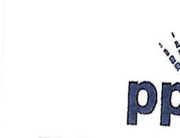
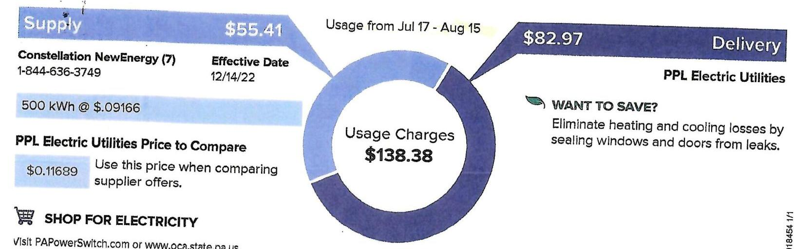
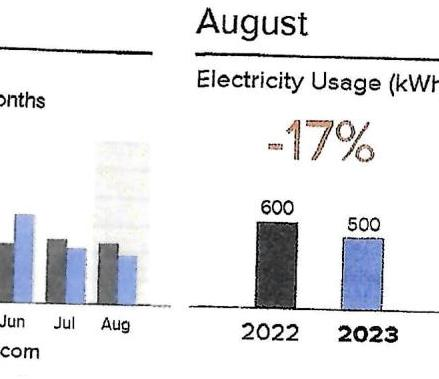
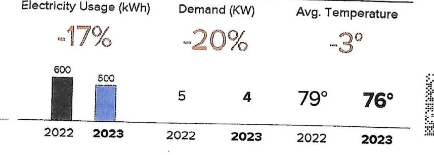

The image is a partial photo or illustration showing a segment of a logo or text. The visible part includes the letters "pp" in a stylized font, with some decorative elements above the letters. The rest of the image is mostly white space.

PPI Electric Utilities

Service tp:
J WALTER MILLER CO 230 N ANN ST, CONCURRENT SRV

The image is a photo or illustration of a utility bill segment. It includes a circular chart with usage charges and text details. 

- **Chart Details:**
  - **Supply:** $55.41
  - **Delivery:** $82.97
  - **Usage Charges:** $138.38
  - **Usage Period:** Jul 17 - Aug 15

- **Text Details:**
  - **Constellation NewEnergy (7)**
    - Phone: 1-844-636-3749
  - **Effective Date:** 12/14/22
  - **500 kWh @ $0.09166**
  - **PPL Electric Utilities Price to Compare:** $0.11689
    - "Use this price when comparing supplier offers."
  - **SHOP FOR ELECTRICITY**
    - "Visit PAPowerSwitch.com or call 1-800-692-7380"
  - **WANT TO SAVE?**
    - "Eliminate heating and cooling losses by sealing windows and doors from leaks."

Billing Details on Back

LANCE E 55.41

The image is a bar chart comparing electricity usage for August between two years, 2022 and 2023. 

- **Chart Type:** Bar chart
- **Title:** August Electricity Usage (kWh)
- **Data Points:**
  - 2022: 600 kWh
  - 2023: 500 kWh
- **Percentage Change:** -17%
- **Styling:** The 2022 bar is black, and the 2023 bar is blue. The percentage change is highlighted in red.

* PPE 300268166 Account 86652-52002

| Due Date | Amount Due |
| :-- | :-- |
| $9 / 5 / 23$ | $\$ 187.87$ |

## WANT TO SAVE?

Eliminate heating and cooling losses by sealing windows and doors from leaks.

## August

The image is a combination of bar charts and text comparing electricity usage, demand, and average temperature between the years 2022 and 2023.

- **Chart Type:** Bar chart
- **Electricity Usage (kWh):**
  - 2022: 600 kWh
  - 2023: 500 kWh
  - Percentage Change: -17%
  - Styling: 2022 bar is black, 2023 bar is blue, percentage change is highlighted in red.

- **Demand (KW):**
  - 2022: 5 KW
  - 2023: 4 KW
  - Percentage Change: -20%
  - Percentage change is highlighted in red.

- **Avg. Temperature:**
  - 2022: 79°
  - 2023: 76°
  - Temperature change: -3°
  - Temperature change is highlighted in red.

